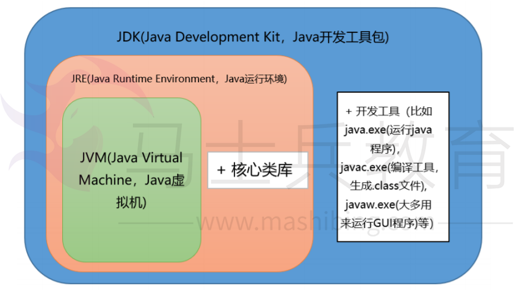
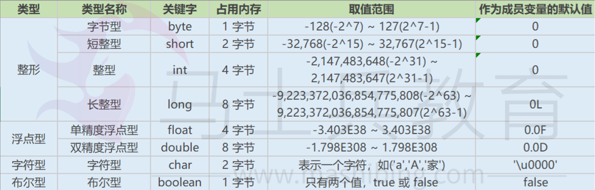
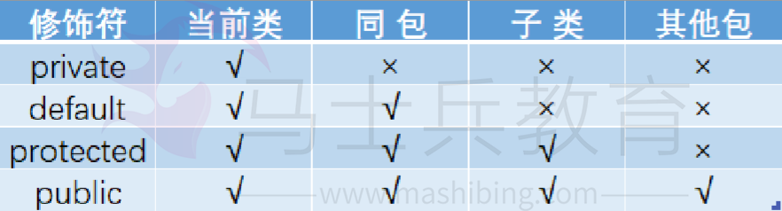

# JVM                               

## 1.     描述 一下jvm内存模型，以及这些空间的存放的内容 ？

##                  

## **2.** **堆内存划分的空间，如何回收这些内存对象，有哪些回收算法？**


 

垃圾回收算法：标记清除、复制（多为新生代垃圾回收使用）、标记整理

## 3. 如何解决线上gc频繁的问题？

1. 查看监控，以了解出现问题的时间点以及当前FGC的频率（可对比正常情况看频率是否正常）

2. 了解该时间点之前有没有程序上线、基础组件升级等情况。

3. 了解JVM的参数设置，包括：堆空间各个区域的大小设置，新生代和老年代分别采用了哪些垃 圾收集器，然后分析JVM参数设置是否合理。

4. 再对步骤1中列出的可能原因做排除法，其中元空间被打满、内存泄漏、代码显式调用gc方法 比较容易排查。

5. 针对大对象或者长生命周期对象导致的FGC，可通过 jmap -histo 命令并结合dump堆内存文件作进一步分析，需要先定位到可疑对象。

6. 通过可疑对象定位到具体代码再次分析，这时候要结合GC原理和JVM参数设置，弄清楚可疑 对象是否满足了进入到老年代的条件才能下结论。

## 4. 描述一下class初始化过程？

一个类初始化就是执行clinit()方法，过程如下
		父类初始化
		static变量初始化/static块（按照文本顺序执行）

Java Language Specification中，类初始化详细过程如下（最重要的是类初始化是线程安全的）：

1. 每个类都有一个初始化锁LC，进程获取LC（如果没有获取到，就一直等待）
2. 如果C正在被其他线程初始化，释放LC并等待C初始化完成
3. 如果C正在被本线程初始化，即递归初始化，释放LC
4. 如果C已经被初始化了，释放LC
5. 如果C处于erroneous状态，释放LC并抛出异常NoClassDefFoundError
6. 否则，将C标记为正在被本线程初始化，释放LC；然后， 初始化那些final且为基础类型的类成员变量
7. 初始化C的父类SC和各个接口SI_n（按照implements子句中的顺序来） ；如果SC或SIn初始化过程中抛出异常，则获取LC，将C标记为erroneous，并通知所有线程，然后释放LC，然后再抛出同样的异常。
8. 从classloader处获取assertion是否被打开
9. 接下来， 按照文本顺序执行类变量初始化和静态代码块，或接口的字段初始化，把它们当作是一个个单独的代码块。
10. 如果执行正常，获取LC，标记C为已初始化，并通知所有线程，然后释放LC
11. 否则，如果抛出了异常E。若E不是Error，则以E为参数创建新的异常ExceptionInInitializerError作为E。如果因为OutOfMemoryError导致无法创建ExceptionInInitializerError，则将OutOfMemoryError作为E。
12. 获取LC，将C标记为erroneous，通知所有等待的线程，释放LC，并抛出异常E。

## 5. 简述一下内存溢出的原因，如何排查线上问题？

内存溢出的原因

1. java.lang.OutOfMemoryError: ......java heap space..... 堆栈溢出，代码问题的可能性极大

   ```
   发生堆内存不足的原因可能有：
   
   1）设置的堆内存太小，而系统运行需要的内存要超过这个设置值
   
   2）内存泄露。关注系统稳定运行期，full gc每次gc后的可用内存值是否一直在增大。
   
   3）由于设计原因导致系统需要过多的内存，如系统中过多地缓存了数据库中的数据，这属于设计问题，需要通过设计减少内存的使用。
   
   4）分析线程执行模型和它们持有的JVM里的短生命对象
   
   
   解决方法有：
   1.代码提速。这样可以使得相同对象的生存时间更短。更快被GC。
   2.对于长生命周期对象（如I/O操作）对象后续不用了，objecft=null可以辅助GC，一旦方法脱离了作用域，相应的局部变量应用就会被注销。
   3.代码无法优化后，程序跑的飞快，还是出现OOM，考虑到去修改参数配置。
   　eg:堆空间的大小，堆空间要设置的足够大（相对），如果太大，发生FULL GC会很恐怖
   4.内存泄露：内存可能在某些情况增加几十字节空间但未能释放，每次被GC，很老的对象被GC的较慢。
   ```

   

2. java.lang.OutOfMemoryError: GC over head limit exceeded 系统处于高频的GC状态，而且回收的效果依然不佳的情况，就会开始报这个错误，这种情况一般是产生了很多不可以被释放的对象，有可能是引用使用不当导致，或申请大对象导致，但是java heap space的内存溢出有可能提前不会报这个错误，也就是可能内存就直接不够导致，而不是高频GC.

   ```
   解决这种问题两种方法：
   
   1）增加参数，- XX:-UseGCOverheadLimit，关闭这个特性，同时增加heap大小，-Xmx1024m。
   
   2）排查并优化消耗内存资源代码。
   
   如果生产环境中遇到了这个问题，在不知道原因时可以通过-verbose:gc -XX:+PrintGCDetails看下到底什么原因造成了异常。通常原因都是因为old区占用过多导致频繁Full GC，最终导致GC overhead limit exceed。如果gc log不够可以借助于JProfile等工具查看内存的占用，old区是否有内存泄露。分析内存泄露还有一个方法-XX:+HeapDumpOnOutOfMemoryError，这样OOM时会自动做Heap Dump，可以拿MAT来排查了。还要留意young区，如果有过多短暂对象分配，可能也会抛这个异常。
   ```

   

3. java.lang.OutOfMemoryError: PermGen space jdk1.7之前才会出现的问题 ，原因是系统的代码非常多或引用的第三方包非常多、或代码中使用了大量的常量、或通过intern注入常量、或者通过动态代码加载等方法，导致常量池的膨胀

   ```
   解决的话从几方面入手：
   ● 增加MaxPermSize
   ● 减少系统需要的类数量
   ● 使用classloader合理的装载各个类，并定期进行回收
   
   加+PrintGCDetails参数，打印日志可看地gc情况。+TraceClassUnloading，查看日志。 
   ```

   

4. java.lang.OutOfMemoryError: Direct buffer memory 直接内存不足，因为jvm垃圾回收不会回收掉直接内存这部分的内存，所以可能原因是直接或间接使用了ByteBuffer中的allocateDirect方法的时候，而没有做clear

   ```
   1）合理执行显示GC，可降低概率；
   
   2）设置合理的-XX:MaxDirectMemorySize值，避免发生；
   
   3）设置一个较小的堆在32 虚机上可是到更多的内存用于直接内存。
   
   手动释放本地内存？DirectByteBuffer持有一个Cleaner对象，该对象有一个clean()方法可用于释放本地内存，需要的时候可以调用这个方法手动释放本地内存。
   ```

   

5. java.lang.StackOverflowError - Xss设置的太小了

6. java.lang.OutOfMemoryError: unable to create new native thread 堆外内存不足，无法为线程分配内存区域

   ```
   分析思路：
   1）系统当前有过多的线程，操作系统无法再创建更多的线程。可以通过打印线程堆栈，先查看总的线程数量。可能原因：是否系统创建的线程被阻塞或者死锁，导致系统中的线程越来越多，直到超过最大限制。或者操作系统自身能创建的线程数量太少。
   2）swap分区不足。
   3）堆内存设置过大。
   4）系统对进程内存限制，用户最大打开的进程数限制
   max user processes用户最大打开的进程数这个值默认是1024，看官方说明，指用户最多可创建线程数，因为一个进程最少有一个线程，所以间接影响到最大进程数。
   
   解决从以下几方面下手：
   1）减少堆空间  -xmx，可预留更多内存用于线程创建，因此程序可正常执行。
   2）减少每一个线程所占用的内存空间，-xss参数指定线程的栈空间   -xmx1g -xss128K   栈空间小了，栈溢出风险会提高。
   3）打开/etc/security/limits.d/90-nproc.conf，把对应用户soft   nproc   1024这行的1024改大就行了。
   总体思路：合理减少线程总数，减少最大堆空间，减少线程的栈空间也可行。 系统限制。
   ```

   

7. java.lang.OutOfMemoryError: request {} byte for {}out of swap 地址空间不够:

   ```
   地址空间不够用（不一定是物理地址，还有swap,显卡，网卡）
   
   这个错误是当虚拟机向本地操作系统申请内存失败时抛出的。这和用完了堆或者持久化中的内存的情况有些不同。这个错误通常是在程序已经逼近平台限制的时候产生的。这个信息是可能已经用光了物理内存以及虚拟内存了。由于虚拟内存通常是用磁盘作为交换分区，因此最先想到的解决方法可能是先增加交换分区的大小，但这个方法可能不太好用。
   ```

   

## 6.jvm有哪些垃圾回收器，实际中如何选择？


图中展示了7种作用于不同分代的收集器，如果两个收集器之间存在连线，则说明它们可以搭配使用。虚拟机所处的区域则表示它是属于新生代还是老年代收集器。

新生代收集器（全部的都是复制算法）：Serial、ParNew、Parallel Scavenge

老年代收集器：CMS（标记-清理）、Serial Old（标记-整理）、Parallel Old（标记整理） 整堆收集器： G1（一个Region中是标记-清除算法，2个Region之间是复制算法）

同时，先解释几个名词：

1，**并行（****Parallel****）**：多个垃圾收集线程并行工作，此时用户线程处于等待状态

2，**并发（****Concurrent****）**：用户线程和垃圾收集线程同时执行

3，**吞吐量**：运行用户代码时间／（运行用户代码时间＋垃圾回收时间）

### **1.Serial收集器是最基本的、发展历史最悠久的收集器。**

**特点：**单线程、简单高效（与其他收集器的单线程相比），对于限定单个CPU的环境来说，Serial收集器由于没有线程交互的开销，专心做垃圾收集自然可以获得最高的单线程收集效率。收集器进行垃圾回收时，必须暂停其他所有的工作线程，直到它结束（Stop The World）。

**应用场景**：适用于Client模式下的虚拟机。

Serial / Serial Old收集器运行示意图

|      |                             |
| ---- | --------------------------- |
|      |  |

### **2.ParNew收集器其实就是Serial收集器的多线程版本。**

除了使用多线程外其余行为均和Serial收集器一模一样（参数控制、收集算法、Stop The World、对象分配规则、回收策略等）。

**特点**：多线程、ParNew收集器默认开启的收集线程数与CPU的数量相同，在CPU非常多的环境中，可以 使用-XX:ParallelGCThreads参数来限制垃圾收集的线程数。

和Serial收集器一样存在Stop The World问题

**应用场景**：ParNew收集器是许多运行在Server模式下的虚拟机中首选的新生代收集器，因为它是除了Serial收集器外，唯一一个能与CMS收集器配合工作的。

*ParNew/Serial Old*组合收集器运行示意图如下：

|      |                             |
| ---- | --------------------------- |
|      |  |

### **3.Parallel Scavenge 收集器与吞吐量关系密切，故也称为吞吐量优先收集器。**

特点：属于新生代收集器也是采用复制算法的收集器，又是并行的多线程收集器（与ParNew收集器类似）。
该收集器的目标是达到一个可控制的吞吐量。还有一个值得关注的点是：GC自适应调节策略（与ParNew收集器最重要的一个区别）
GC自适应调节策略：Parallel Scavenge收集器可设置-XX:+UseAdptiveSizePolicy参数。当开关打开时不需要手动指定新生代的大小（-Xmn）、Eden与Survivor区的比例（-XX:SurvivorRation）、晋升老年代的对象年龄（-XX:PretenureSizeThreshold）等，虚拟机会根据系统的运行状况收集性能监控信息，动态设置这些参数以提供最优的停顿时间和最高的吞吐量，这种调节方式称为GC的自适应调节策略。
Parallel Scavenge收集器使用两个参数控制吞吐量：
	XX:MaxGCPauseMillis 控制最大的垃圾收集停顿时间
	XX:GCRatio 直接设置吞吐量的大小。

### **4.Serial Old是Serial收集器的老年代版本。**

**特点**：同样是单线程收集器，采用标记-整理算法。

**应用场景**：主要也是使用在Client模式下的虚拟机中。也可在Server模式下使用。

Server模式下主要的两大用途（在后续中详细讲解···）：

1. 在JDK1.5以及以前的版本中与Parallel Scavenge收集器搭配使用。

2. 作为CMS收集器的后备方案，在并发收集Concurent Mode Failure时使用。

Serial / Serial Old收集器工作过程图（Serial收集器图示相同）：

 

|      |                                 |
| ---- | ------------------------------- |
|      |  |


### **5.Parallel Old是Parallel Scavenge收集器的老年代版本。**

**特点**：多线程，采用标记-整理算法。

**应用场景**：注重高吞吐量以及CPU资源敏感的场合，都可以优先考虑Parallel Scavenge+Parallel Old 收集器。

*Parallel   Scavenge/Parallel   Old*收集器工作过程图：


###  **6.CMS收集器是一种以获取最短回收停顿时间为目标的收集器。**

 **特点**：基于标记-清除算法实现。并发收集、低停顿。

**应用场景**：适用于注重服务的响应速度，希望系统停顿时间最短，给用户带来更好的体验等场景下。

如：web程序、b/s服务。

CMS收集器的运行过程分为下列4步：

**初始标记**：标记GC Roots能直接到的对象。速度很快但是仍存在Stop The World问题。

**并发标记**：进行GC Roots Tracing 的过程，找出存活对象且用户线程可并发执行。

**重新标记**：为了修正并发标记期间因用户程序继续运行而导致标记产生变动的那一部分对象的标记记 录。仍然存在Stop The World问题。

**并发清除**：对标记的对象进行清除回收。

CMS收集器的内存回收过程是与用户线程一起并发执行的。

CMS收集器的工作过程图：

|      |                          |
| ---- | ------------------------ |
|      |  |


CMS收集器的缺点：

​	1:对CPU资源非常敏感。

​	2:无法处理浮动垃圾，可能出现Concurrent Model Failure失败而导致另一次Full GC的产生。

- 在[JDK1.5](https://www.zhihu.com/search?q=JDK1.5&search_source=Entity&hybrid_search_source=Entity&hybrid_search_extra={"sourceType"%3A"article"%2C"sourceId"%3A98938737})之前老年带使用了68%空间后就会激活CMS收集。

- 如果实际应用中可以适当调整参数-XX:CMSInitiatingOccu-pancyFraction 的值来提高CMS的触发百分比，降低内存回收频率获得更好的性能。
- 到了JDK6 CMS[收集器](https://www.zhihu.com/search?q=收集器&search_source=Entity&hybrid_search_source=Entity&hybrid_search_extra={"sourceType"%3A"article"%2C"sourceId"%3A98938737})的启动阀值就已经默认提升到92%。

		3:因为采用标记-清除算法所以会存在空间碎片的问题，导致大对象无法分配空间，不得不提前触发 一次Full GC。

- 为了解决这个问题，CMS收集器提供了-XX:UseCMSCompactAtFullCollection开关参数，用于在CMS收集器不得不进行Full GC时开启内存碎片的合并整理过程。 有参数可以配置有多少次Full GC会堆内存碎片进行整理(-XX:CMSFullGCsBeforeCompaction)

		4:如果预留空间不够怎么办？

​        首先要确定这是个小概率事件，其次JVM对着的情况处理如下：

- CMS垃圾回收报错(Concurrent Model Failure) 并发失败。
- 启动后备预案：冻结用户线程的执行，临时启用Serial Old收集器来重新进行老年代的垃圾收集。（这样的话时间就会变得很长）

	​		


### **7.G1收集器一款面向服务端应用的垃圾收集器。**

特点如下：

并行与并发：G1能充分利用多CPU、多核环境下的硬件优势，使用多个CPU来缩短Stop-The-World停顿时间。部分收集器原本需要停顿Java线程来执行GC动作，G1收集器仍然可以通过并发的方式让Java程序继续运行。

分代收集：G1能够独自管理整个Java堆，并且采用不同的方式去处理新创建的对象和已经存活了一段时间、熬过多次GC的旧对象以获取更好的收集效果。

空间整合：G1运作期间不会产生空间碎片，收集后能提供规整的可用内存。

可预测的停顿：G1除了追求低停顿外，还能建立可预测的停顿时间模型。能让使用者明确指定在一个长度为M毫秒的时间段内，消耗在垃圾收集上的时间不得超过N毫秒。

G1收集器运行示意图：

 

|      |                         |
| ---- | ----------------------- |
|      |  |


### 8.关于gc的选择

除非应用程序有非常严格的暂停时间要求，否则请先运行应用程序并允许VM选择收集器（如果没有特别 要求。使用VM提供给的默认GC就好）。

如有必要，调整堆大小以提高性能。 如果性能仍然不能满足目标，请使用以下准则作为选择收集器的起点：

- 如果应用程序的数据集较小（最大约100 MB），则选择带有选项-XX：+ UseSerialGC的串行收集器。

- 如果应用程序将在单个处理器上运行，并且没有暂停时间要求，则选择带有选项-XX：+ UseSerialGC的串行收集器。

- 如果（a）峰值应用程序性能是第一要务，并且（b）没有暂停时间要求或可接受一秒或更长 时间的暂停，则让VM选择收集器或使用-XX：+ UseParallelGC选择并行收集器 。

- 如果响应时间比整体吞吐量更重要，并且垃圾收集暂停时间必须保持在大约一秒钟以内，则选 择具有-XX：+  UseG1GC。（值得注意的是JDK9中CMS已经被Deprecated，不可使用！移除该选项）

- 如果使用的是jdk8，并且堆内存达到了16G，那么推荐使用G1收集器，来控制每次垃圾收集的时间。

- 如果响应时间是高优先级，或使用的堆非常大，请使用-XX：UseZGC选择完全并发的收集 器。（值得注意的是JDK11开始可以启动ZGC，但是此时ZGC具有实验性质，在JDK15中[202009发布]才取消实验性质的标签，可以直接显示启用，但是JDK15默认GC仍然是G1）

 

这些准则仅提供选择收集器的起点，因为性能取决于堆的大小，应用程序维护的实时数据量以及可用处 理器的数量和速度。

如果推荐的收集器没有达到所需的性能，则首先尝试调整堆和新生代大小以达到所需的目标。 如果性能仍然不足，尝试使用其他收集器

**总体原则**：减少STOP THE WORD时间，使用并发收集器（比如CMS+ParNew，G1）来减少暂停时间， 加快响应时间，并使用并行收集器来增加多处理器硬件上的总体吞吐量。

## 7. 简述一下Java类加载模型？

 

|      |                               |
| ---- | ----------------------------- |
|      |  |


双亲委派模型

在某个类加载器加载class文件时，它首先委托父加载器去加载这个类，依次传递到顶层类加载器

(Bootstrap)。如果顶层加载不了（它的搜索范围中找不到此类），子加载器才会尝试加载这个类。 双亲委派的好处每一个类都只会被加载一次，避免了重复加载每一个类都会被尽可能的加载（从引导类加载器往下，每个加载器都可能会根据优先次序尝试 加载它）有效避免了某些恶意类的加载（比如自定义了Java.lang.Object类，一般而言在双亲委派模型 下会加载系统的Object类而不是自定义的Object类）

## 9. JVM8为什么要增加元空间，带来什么好处？

原因：

1、字符串存在永久代中，容易出现性能问题和内存溢出。

2、类及方法的信息等比较难确定其大小，因此对于永久代的大小指定比较困难，太小容易出现永久代溢 出，太大则容易导致老年代溢出。

3、永久代会为 GC 带来不必要的复杂度，并且回收效率偏低。元空间的特点：

​	1，每个加载器有专门的存储空间。

​	2，不会单独回收某个类。

​	3，元空间里的对象的位置是固定的。

​	4，如果发现某个加载器不再存货了，会把相关的空间整个回收。

## 10. 堆G1垃圾收集器有了解么，有什么特点？

G1的特点：

1. G1的设计原则是"首先收集尽可能多的垃圾(Garbage  First)"。因此，G1并不会等内存耗尽(串行、并行)或者快耗尽(CMS)的时候开始垃圾收集，而是在内部采用了启发式算法，在老年代找 出具有高收集收益的分区进行收集。同时G1可以根据用户设置的暂停时间目标自动调整年轻  代和总堆大小，暂停目标越短年轻代空间越小、总空间就越大；

2. G1采用内存分区(Region)的思路，将内存划分为一个个相等大小的内存分区，回收时则以分  区为单位进行回收，存活的对象复制到另一个空闲分区中。由于都是以相等大小的分区为单位 进行操作，因此G1天然就是一种压缩方案(局部压缩)；

3. G1虽然也是分代收集器，但整个内存分区不存在物理上的年轻代与老年代的区别，也不需要 完全独立的survivor(to space)堆做复制准备。G1只有逻辑上的分代概念，或者说每个分区都可能随G1的运行在不同代之间前后切换；

4. G1的收集都是STW的，但年轻代和老年代的收集界限比较模糊，采用了混合(mixed)收集的方 式。即每次收集既可能只收集年轻代分区(年轻代收集)，也可能在收集年轻代的同时，包含部 分老年代分区(混合收集)，这样即使堆内存很大时，也可以限制收集范围，从而降低停顿。

5. 因为G1建立可预测的停顿时间模型，所以每一次的垃圾回收时间都可控，那么对于大堆（16G左右）的垃圾收集会有明显优势

## 11. 介绍一下垃圾回收算法？

### 1:标记-清除


缺点：产生内存碎片，如上图，如果清理了两个1kb的对象，再添加一个2kb的对象，无法放 入这两个位置

### 2:标记-整理（老年代）


缺点：移动对象开销较大复制（新生代)

### 3:复制算法


缺点：浪费空间并且移动对象开销大

## 12. Happens-Before规则？

先行发生原则（Happens-Before）是判断数据是否存在竞争、线程是否安全的主要依据。

先行发生是Java内存，模型中定义的两项操作之间的偏序关系，如果操作A先行发生于操作B，那么操作A产生的影响能够被操作B观察到。

口诀：如果两个操作之间具有happen-before关系，**那么前一个操作的结果就会对后面的一个操作可 见**。是Java内存模型中定义的两个操作之间的偏序关系。

### 1:常见的happen-before规则：

#### 1.程序顺序规则：

一个线程中的每个操作，happen-before在该线程中的任意后续操作。(注解：如果只有一个线程的操 作，那么前一个操作的结果肯定会对后续的操作可见。)

程序顺序规则中所说的每个操作happen-before于该线程中的任意后续操作并不是说前一个操作必须要 在后一个操作之前执行，而是指前一个操作的执行结果必须对后一个操作可见，如果不满足这个要求那就不允许这两个操作进行重排序

#### 2.锁规则：

对一个锁的解锁，happen-before在随后对这个锁加锁。(注解：这个最常见的就是synchronized方法和syncronized块)

#### 3.volatile变量规则：

对一个volatile域的写，happen-before在任意后续对这个volatile域的读。该规则在CurrentHashMap 的读操作中不需要加锁有很好的体现。

#### 4.传递性：

如果A happen-before B，且B happen-before C，那么A happen - before C.

#### 5.线程启动规则：

Thread对象的start()方法happen-before此线程的每一个动作。

#### 6.线程终止规则：

线程的所有操作都happen-before对此线程的终止检测，可以通过Thread.join()方法结束，Thread.isAlive()的返回值等手段检测到线程已经终止执行。

#### 7.线程中断规则：

对线程interrupt()方法的调用happen-before发生于被中断线程的代码检测到中断时事件的发生。

## 13. 描述一下java类加载和初始化的过程？

1:JAVA类的加载机制

Java类加载分为5个过程,分别为：加载，链接(验证，准备，解析)，初始化，使用，卸载。

1加载

加载主要是将.class文件通过二进制字节流读入到JVM中。 在加载阶段，JVM需要完成3件事：

1）通过classloader在classpath中获取XXX.class文件，将其以二进制流的形式读入内存。

2）将字节流所代表的静态存储结构转化为方法区的运行时数据结构；

3）在内存中生成一个该类的java.lang.Class对象，作为方法区这个类的各种数据的访问入口。

1. 链接

2. 验证

主要确保加载进来的字节流符合JVM规范。验证阶段会完成以下4个阶段的检验动作：

1）文件格式验证

2）元数据验证(是否符合Java语言规范)

3）字节码验证（确定程序语义合法，符合逻辑）

4）符号引用验证（确保下一步的解析能正常执行）

2.2. 准备

准备是连接阶段的第二步，主要为静态变量在方法区分配内存，并设置默认初始值。

2.3. 解析

解析是连接阶段的第三步，是虚拟机将常量池内的符号引用替换为直接引用的过程。

2. 初始化

初始化阶段是类加载过程的最后一步，主要是根据程序中的赋值语句主动为类变量赋值。

当有继承关系时，先初始化父类再初始化子类，所以创建一个子类时其实内存中存在两个对象实例。

3. 使用

程序之间的相互调用。

4. 卸载

即销毁一个对象，一般情况下中有JVM垃圾回收器完成。代码层面的销毁只是将引用置为null。


## 14. JVM线上出OOM问题了如何定位？

## **15.** **吞吐量优先和响应时间优先的回收器是哪些？**

吞吐量优先：Parallel Scavenge+Parallel Old（多线程并行） 响应时间优先：cms+par new（并发回收垃圾）

## 16. 什么叫做阻塞队列的有界和无界，实际中有用过吗？

阻塞队列

ArrayBlockingQueue：一个由**数组**结构组成的**有界**阻塞队列，线程池，生产者消费者

LinkedBlockingQueue：一个由**链表**结构组成的**无界**阻塞队列，线程池，生产者消费者

PriorityBlockingQueue：一个**支持优先级排序**的**无界**阻塞队列，可以实现精确的定时任务

DelayQueue：一个**使用优先级队列**实现的**无界**阻塞队列，可以实现精确的定时任务

SynchronousQueue： 一 个 不 存 储 元 素 的 阻 塞 队 列 ， 线 程 池 

LinkedTransferQueue： 一 个 由 **链 表** 结 构 组 成 的 **无 界** 阻 塞 队 列 

LinkedBlockingDeque：一个由**链表**结构组成的**双向无界**阻塞队列，可以用在“工作窃取”模式 中

阻塞队列有一个非常重要的属性，那就是容量的大小，分为有界和无界两种。

无界队列意味着里面可以容纳非常多的元素，例如 LinkedBlockingQueue 的上限是 Integer.MAX_VALUE，约为 2 的 31 次方，是非常大的一个数，可以近似认为是无限容量，因为我们几乎无法把这个容量装满。

但是有的阻塞队列是有界的，例如 ArrayBlockingQueue 如果容量满了，也不会扩容，所以一旦满了就无法再往里放数据了

## 17. jvm监控系统是通过jmx做的么？

一般都是，但是要是记录比较详细的性能定位指标，都会导致进入 safepoint，从而降低了线上应用性能

例如 jstack，jmap打印堆栈，打印内存使用情况，都会让 jvm 进入safepoint，才能获取线程稳定状态从而采集信息。

同时，JMX暴露向外的接口采集信息，例如使用jvisualvm，还会涉及rpc和网络消耗，以及JVM忙时，无 法采集到信息从而有指标断点。这些都是基于 JMX 的外部监控很难解决的问题。

所以，推荐使用JVM内部采集 JFR，这样即使在JVM很忙时，也能采集到有用的信息

## 18. 内存屏障的汇编指令是啥？

1.硬件内存屏障 X86

sfence: store| 在sfence指令前的写操作当必须在sfence指令后的写操作前完成。

lfence：load | 在lfence指令前的读操作当必须在lfence指令后的读操作前完成。

mfence：modify/mix | 在mfence指令前的读写操作当必须在mfence指令后的读写操作前完成。

2.原子指令，如x86上的”lock …” 指令是一个Full Barrier，执行时会锁住内存子系统来确保执行顺序，甚至跨多个CPU。Software Locks通常使用了内存屏障或原子指令来实现变量可见性和保持程序顺序。

3.JVM级别如何规范（JSR133） 

LoadLoad屏障：对于这样的语句Load1; LoadLoad; Load2，在Load2及后续读取操作要读取的数据被访问前，保证Load1要读取的数据被读取完毕。

StoreStore屏障：对于这样的语句Store1; StoreStore; Store2，在Store2及后续写入操作执行前，保证Store1的写入操作对其它处理器可见。

LoadStore屏障：对于这样的语句Load1; LoadStore; Store2，在Store2及后续写入操作被刷出前，保证Load1要读取的数据被读取完毕。 

StoreLoad屏障：对于这样的语句Store1; StoreLoad; Load2，在Load2及后续所有读取操作执行前，保证Store1的写入对所有处理器可见。


## 19. 怎么提前避免内存泄漏？


## 20.Java虚拟机栈

概述
Java虚拟机栈（Java Virtual Machine Stacks）是线程私有的，它的生命周期与线程相同。虚拟机栈描述的是Java方法执行的内存模型：栈帧（Stack Frame）是用于支持Java虚拟机进行方法调用和执行的数据结构，它是虚拟机栈中的栈元素。每个方法在执行的同到都会创建一个栈帧用于存储局部变量表、操作数栈、动态链接、方法出口等信息。在编译程序代码的时候，栈帧中需要多大的局部变量表，多深的操作数栈都已经完全确定了，并且写入到方法表的Code属性之中，因此一个栈帧需要分配多少内存，不会受到程序运行期变量数据的影响，而仅仅取决于具体的虚拟机实现。

每一个方法从调用直至执行完成的过程，就对应着一个栈帧在虚拟栈中从入栈到出栈的过程（说人话就是要执行一个方法，将该方法的栈帧压入栈顶，方法执行完成其栈帧出栈）。在JVM里面，栈帧的操作只有两种：出栈和入栈。正在被线程执行的方法称为当前线程方法，而该方法的栈帧就称为当前帧，执行引擎运行时只对当前栈帧有效。


### 局部变量表

局部变量表(Local Variable Table）是一组变量值存储空间，用于存放方法参数和方法内部定义的局部变量。在Java程序编译为Class文件时就在方法的code属性的max_locals数据项中确定了该方法所需要分配的局部变量表的最大容量。

局部变量表的容量以变量槽（Variable Slot，下称Slot）为最小单位，虚拟机规范中并没有明确指明一个Slot应占用的内存空间大小，只是很有导向性地说到每个引都应该能存放一个boolean、byte、char、short，int，float、reference或returnAddress类型的数据，这8种数类都可以使用32位或更小的物理存来存放，但这种描述与明确指出 "每个Slot占用32位长度的内存空间" 是有一些差别的，它运行Slot的长度可以随着处理器、操作系统或虚拟机的不同而发生变化。只要保证使在64位虚拟机中使用了64位的物理内存空间去实现一个Slot，虚拟机仍要使用对齐和补白的手段让Slot在外观上看起来与32位拟机中的一致。

一个Slot可以存放一个32位以内的数据类型，Java中占用32位以内的数据类型有boolean、byte、char、short、float、reference和returnAddress8种类型。第7种reference类表示对一个对象实例的引用，虚拟机规范既没有说明它的长度，也没有明确指出这种引用应有怎样的结构。但是一般来说，虚拟机实现至少都应当能通过这个引用做到两点，一是从此引用直接或间接地查找到对象在Java堆中的数据存放的起始地址索引，二是此引用中直接或间接地查找到对象所属数据类型在方法区中的存储的类型信息。第8种即returnAddress类型目前已经很少见了，现在已经由异常表代替。

对于64位的数据类型，虚拟机会以高位对齐的方式为其分配两个连续的引Slot空间。Java语言中明确的（reference类型则可能是32位也可能是64位），64位的数据类型只有long和double两种。虚拟机通过索引定位的方式使用局部变量表，索引值的范围是从0开始至局部变量表最大的Slot数量。如果访问的是32位数据类型的变量，索引 n 就代表了使用第n个Slot，如果是64位数据类型的变量，则说明会同时使用n和n+1两个Slot对于两个相邻的共同存放一个64位数据的两个Slot，不允许采用任何方式单独访问其中的某一个，Java虚拟机规范中明确要求了如果遇到进行这种操作的字节码序列，虚拟机应该在类加载的校验阶段抛出异常。

如果是实例方法（非static的方法），那么局部变量表中第0位索引的Slot默认是用于传递方法所属对象实例的引用"this"。其余参数则按照参数表的顺序来排列，占用从1开始的局部变量Slot，参数表分配完毕后，再根据方法体内部定义的变量顺序和作用域分配其余的Slot（比如方法method(int a1,inta2)，参数表为a1和a2，则局部变量表索引0、1、2则分别存储了this指针、a1、a2，如果方法内部有其他内部变量，则在局部变量表中存在a2之后的位置）。


为了尽可能节省栈帧空间，局部变量表中的Slot是可以重用的，方法体中定义的变量，其作用域并不一定会覆盖整个方法体，如果当前字节码PC计数器的值已经超出了某个变量的作用域，那这个变量对应的Slot就可以交给其他变量使用。

局部变量不像的类成员变量那样存在"准备阶段"。我们知道类变量有两次赋初始值的过程，一次在准备阶段，赋予系统初始值；另外一次在初始化阶段，赋予程序员定义的初始值。因此，即使在初始化阶段程序员没有为类变量赋值也没有关系，类变量仍然具有一个确定的初始值。但局部变量就不一样，如果一个局部变量定义了但没有赋初始值是不能使用的，不要认为Java中任何情况下都存在诸如整型变量默认为0，布尔型变量默认为false等这样的默认值。


### 操作数栈

操作数栈(Operand Stack）也常称为操作栈，它是一个后入先出（Last In First out，LIFO）栈。同局部变量表一样，操作数栈的最大深度也在编译的时候写入到code属性的max_stacks数据项中。操作数栈的每一个元素可以是任意的Java数据类型，包括long和double。32位数据类型所占的栈容量为1，64位数据类型所占的栈容量为2。在方法执行的任何时候，操作数栈的深度都不会超过在maxstacks数据项中设定的最大值。

当一个方法刚刚开始执行的时候，这个方法的操作数栈是空的，在方法的执行过程中，会有各种字节码指令往操作数栈中写入和提取内容，也就是出栈/入栈操作。例如，在做算术运算的时候是通过操作数栈来进行的，又或者在调用其他方法的时候是通过操作数栈来进行参数传递的。举个例子，整数加法的字节码指令iadd在运行的时候操作数栈中最接近栈顶的两个元素已经存入了两个int型的数值，当执行这个指令时，会将这两个int值出栈并相加，然后将相加的结果入栈。 

Java虚拟机的解释执行引擎称为“基于栈的执行引擎”，其中所指的“栈”就是操作数栈。如果当前线程请求的栈深度大于虚拟机所允许的最大深度，将抛出StackOverflowError异常。

### 动态连接

每个栈帧都包含一个指向运行时常量池中该栈帧所属方法的引用，持有这个引用是为了支持方法调用过程中的动态连接(Dynamic Linking)。Class文件的常量池中存有大量的符号引用，字节码中的方法调用指令就以常量池中指向方法的符号引用作为参数。这些符号引用一部分会在类加载阶段或者第一次使用的时候就转化为直接引用，这种转化称为静态解析。另外一部分将在每一次运行期间转化为直接引用，这部分称为动态连接。

Java代码在进行Javac编译的时候，并不像C和C++那样有“连接”这一步骤，而是在虚拟机加载Class文件的时候进行动态连接。也就是说，在Class文件中不会保存各个方法、字段的最终内存布局信息，因此这些字段、方法的符号引用不经过运行期转换的话无法得到真正的内存入口地址，也就无法直接被虚拟机使用。当虚拟机运行时，需要从常量池获得对应的符号引用，再在类创建时或运行时解析、翻译到具体的内存地址之中。

```
Math math=new Math();
math.compute();//调用实例方法compute（）
```

以上面两行代码为例，解释一下动态连接：math.compute()调用时compute()叫符号，需要通过compute()这个符号去到常量池中去找到对应方法的符号引用，运行时将通过符号引用找到方法的字节码指令的内存地址。

### 方法的返回地址

当一个方法开始执行后，只有两种方式可以退出这个方法。第一种方式是执行引擎遇任意一个方法返回的字节码指令，这时候可能会有返回值传递给上层的方法调用者（调用当前方法的方法称为调用者），这种退出方法的方式称为正常完成出口(Normal Method Invocation Completion）。另外一种退出方式是，在方法执行过程中遇到了异常，并且这个异常没有在方法体内得到处理，无论是Java虚拟机内部产生的异常，还是代码中使用athrow字节码指令产生的异常，只要在本方法的异常表中没有搜索到匹配的异常处理器，就会导致方法退出，这种退出方法的方式称为异常完成出口（Abrupt Method Invocation Completion)。一个方法使用异常完成出口的方式退出，是不会给它的上层调用者产生任何返回值的。

无论采用何种退出方式，在方法退出之后，都需要返回到方法被调用的位置，程序才能继续执行，方法返回时可能需要在栈帧中保存一些信息，用来帮助恢复它的上层方法的执行状态。一般来说，方法正常退出时，调用者的PC计数器的值可以作为返回地址，栈帧中很可能会保存这个计数器值。而方法异常退出时，返回地址是要通过异常处理器表来确定的，栈帧中一般不会保存这部分信息。方法退出的过程实际上就等同于把当前栈帧出栈，因此退出时可能执行的操作有：恢复上层方法的局部变量表和操作数栈，把返回值（如果有的话）压入调用者栈帧的操作数栈中，调整pc计数器的值以指向方法调用指令后面的一条指令等。


# Java并发编程


## **1.** **如何预防死锁？**

1. 首先需要将死锁发生的四个必要条件讲出来:
   1. 互斥条件： 同一时间只能有一个线程获取资源。
   2. 不可剥夺条件： 一个线程已经占有的资源，在释放之前不会被其它线程抢占
   3. 请求和保持条件： 线程等待过程中不会释放已占有的资源
   4. 循环等待条件： 多个线程互相等待对方释放资源

1. 死锁预防，那么就是需要破坏这四个必要条件：
   1. 由于资源互斥是资源使用的固有特性，无法改变，我们不讨论
   
   2. 破坏不可剥夺条件：
       一个进程不能获得所需要的全部资源时便处于等待状态，等待期间他占有的资源将被隐式的释放重新加入到系统的资源列表中，可以被其他的进程使用，而等待的进程只有重新获得自己原有的资源以及新申请的资源才可以重新启动，执行
   
   3. 破坏请求与保持条件：
      第一种方法：静态分配即每个进程在开始执行时就申请他所需要的全部资源,
      第二种方法：动态分配即每个进程在申请所需要的资源时他本身不占用系统资源
   4. 破坏循环等待条件：
   采用资源有序分配其基本思想是将系统中的所有资源顺序编号，将紧缺的，稀少的采用较大的编号，在申请资源时必须按照编号的顺序进行，一个进程只有获得较小编号的进程才能申请较大编号的进程。

## 2.  多线程有哪几种创建方式？

1. 实现Runnable，Runnable规定的方法是run()，无返回值，无法抛出异常

2. 实现Callable，Callable规定的方法是call()，任务执行后有返回值，可以抛出异常

3. 继承Thread类创建多线程：继承java.lang.Thread类，重写Thread类的run()方法，在run()方 法中实现运行在线程上的代码，调用start()方法开启线程。

Thread 类本质上是实现了 Runnable 接口的一个实例，代表一个线程的实例。启动线程的唯一方法就是通过 Thread 类的 start()实例方法。start()方法是一个 native 方法，它将启动一个新线程，并执行 run()方法

4. 通过线程池创建线程.  线程和数据库连接这些资源都是非常宝贵的资源。那么每次需要的时候创建，不需要的时候销毁，是非常浪费资源的。那么我们就可以使用缓存的策略，也就是使用 线程池。

## 3.  描述一下线程安全活跃态问题，竞态条件？

1. 线程安全的活跃性问题可以分为 死锁、活锁、饥饿

2. 活锁 ：

   就是有时线程虽然没有发生阻塞，但是仍然会存在执行不下去的情况，活锁不会阻塞线程，线程会一直重复执行某个相同的操作，并且一直失败重试：

   我们开发中使用的异步消息队列就有可能造成活锁的问题，在消息队列的消费端如果没有正确的ack消息，并且执行过程中报错了，就会再次放回消息头，然后再拿出来执行，一直循环往复的失败。这个问题除了正确的ack之外，往往是通过将失败的消息放入到延时队列中，等到一定的延时再进行重试来解决。

   解决活锁的方案很简单，尝试等待一个随机的时间就可以，会按时间轮去重试

3. 饥饿 ：
    就是 线程因无法访问所需资源而无法执行下去的情况，

    饥饿（线程饥饿例子：线程读写锁） 分为两种情况：
        1. 一种是其他的线程在临界区做了无限循环或无限制等待资源的操作，让其他的线程一直不能拿到锁进入临界区，对其他线程来说，就进入了饥饿状态
            2. 另一种是因为线程优先级不合理的分配，导致部分线程始终无法获取到CPU资源而一直无法执行
           解决饥饿的问题有几种方案:
            1. 保证资源充足，很多场景下，资源的稀缺性无法解决
            2. 公平分配资源，在并发编程里使用公平锁，例如FIFO策略，线程等待是有顺序的，排在等待队列前面的线程会优先获得资源
            3. 避免持有锁的线程长时间执行，很多场景下，持有锁的线程的执行时间也很难缩短

3. 死锁
    线程在对同一把锁进行竞争的时候，未抢占到锁的线程会等待持有锁的线程释放锁后继续抢占，如果两个或两个以上的线程互相持有对方将要抢占的锁，互相等待对方先 行释放锁就会进入到一个循环等待的过程，这个过程就叫做死锁

4. 线程安全的竞态条件问题：

    1. 同一个程序多线程访问同一个资源，如果对资源的访问顺序敏感，就称存在竞态条件， 代码区成为临界区。 大多数并发错误一样，竞态条件不总是会产生问题，还需要不恰当的执行时序

    2. 最常见的竞态条件为
        1. 先检测后执行执行依赖于检测的结果，而检测结果依赖于多个线程的执行时序，而 多个线程的执行时序通常情况下是不固定不可判断的，从而导致执行结果出现各种 问题，见一种可能 的解决办法就是：在一个线程修改访问一个状态时，要防止其他线程访问修改，也就是加锁机制，保证原子性

        2. 延迟初始化（典型为单例）

## 4.  Java中的wait和sleep的区别与联系？

1. 所属类: 首先，这两个方法来自不同的类分别是Thread和Object ，wait是Object的方法，sleep是Thread的方法
2. sleep方法属于Thread类中方法，表示让一个线程进入睡眠状态，等待一定的时间之后，自动醒来进入到可运行状态，不会马上进入运行状态，因为线程调度机制恢复线程的运行也需要时间，一个线程对象调用了sleep方法之后，并不会释放他所持有的所有对像锁，所以也就不会影响其他进程对象的运行。但在sleep的过程中过程中有可能被其他 对象调用它的interrupt(),产生InterruptedException异常，如果你的程序不捕获这个异常，线程就会异常终止，进入TERMINATED状态，如果你的程序捕获了这个异常，那么程序就会继续执行catch语句块(可能还有finally语句块)以及以后的代码
3. 作用范围: sleep方法没有释放锁，只是休眠，而wait释放了对象锁，使得其他线程可以使用同步控制块或方法
4. 使用范围: wait，notify和notifyAll只能在同步控制方法或者同步控制块里面使用，而sleep可以在任何地方使用
5. ~~异常范围： sleep必须显示捕获异常，而wait，notify和notifyAll不需要捕获异常~~
4. 联系：两者都会导致线程阻塞，两者均可被中断唤醒
7. 线程中，调用sleep（0）可以释放cpu时间，让线程马上重新回到就绪队列而非等待队列，sleep(0)释放当前线程所剩余的时间片（如果有剩余的话），这样可以让操作系统切换其他线程来执行，提升效率。

## 5.  描述一下进程与线程区别？

1. 进程（Process）

   是系统进行资源分配和调度的基本单位，是操作系统结构的基础。在当代面向线程设计的计算机结构中，进程是线程的容器。程序是指令、数据及其组织形式的描述，进程是程序的实体。是计算机中的程序关于某数据集合上的一次运行活动，是系统进行资源分配和调度的基本单位，是操作系统结构的基础。程序是指令、数据及其组织形式的描述，进程是程序的实体。

   总结: 进程是指在系统中正在运行的一个应用程序；程序一旦运行就是进程；进程——资源分配的最小单位

1. 线程

   操作系统能够进行运算调度的最小单位。它被包含在进程之中，是进程中的实际运作单位。一条线程指的是进程中一个单一顺序的控制流，一个进程中可以并发多个线程，每条线程并行执行不同的任务。

   总结: 系统分配处理器时间资源的基本单元，或者说进程之内独立执行的一个单元执行流。线程——程序执行的最小单位

## 6.  描述一下Java线程的生命周期？

1. 大致包括5个阶段
   1. 新建 就是刚使用new（）方法，new（）出来的线程；
   2. 就绪 就是调用的线程的start()方法后，这时候线程处于等待CPU分配资源阶段，谁先抢的CPU资源，谁开始执行;
   3. 运行 当就绪的线程被调度并获得CPU资源时，便进入运行状态，run方法定义了线程的操作和功能;
   4. 阻塞 在运行状态的时候，可能因为某些原因导致运行状态的线程变成了阻塞状态，比如sleep()、wait()之后线程就处于了阻塞状态，这个时候需要其他机制将处于阻塞状态的线程唤醒，比如调用notify或者notifyAll()方法。唤醒的线程不会立刻执行run方法，它们  要再次等待CPU分配资源进入运行状态;
   5. 销毁 如果线程正常执行完毕后或线程被提前强制性的终止或出现异常导致结束，那么线程就要被销毁，释放资源

 

|      |                                   |
| ---- | --------------------------------- |
|      |  |


1. 按JDK的源码分析来看，Thread的状态分为：
   1. NEW： 尚未启动的线程的线程状态
   2. RUNNABLE： 处于可运行状态的线程正在Java虚拟机中执行，但它可能正在等待来自操作系统（例如处理器）的其他资源
   3. BLOCKED：  线程的线程状态被阻塞，等待监视器锁定。处于阻塞状态的线程正在等待监视器锁定以输入同步的块方法或在调用后重新输入同步的块方法，通过 Object#wait() 进入阻塞
   4. WAITING：处于等待状态的线程正在等待另一个线程执行特定操作：例如: 在对象上调用了Object.wait（）的线程正在等待另一个线程调用Object.notify（） 或者Object.notifyAll(), 调用了 Thread.join（）的线程正在等待指定的线程终止
   5. TIMED_WAITING ： 具有指定等待时间的等待线程的线程状态。由于以指定的正等待时间调用以下方法之一，因此线程处于定时等待状态：

1. Thread.sleep（long）

2. Object#wait(long)

3. Thread.join（long）

4. LockSupport.parkNanos（long...）

5. LockSupport.parkUntil（long...）

 

|      |                               |
| ---- | ----------------------------- |
|      |  |

1. TERMINATED: 终止线程的线程状态。线程已完成执行


## 7.  程序开多少线程合适？

1. 这里需要区别下应用是什么样的程序：

1. CPU 密集型程序， 一个完整请求，I/O操作可以在很短时间内完成， CPU还有很多运算要处理，也就是说 CPU 计算的比例占很大一部分，线程等待时间接近0
   1. 单核CPU： 一个完整请求，I/O操作可以在很短时间内完成， CPU还有很多运算要处理，也就是说 CPU 计算的比例占很大一部分，线程等待时间接近0。单核CPU处理CPU密集型程序，这种情况并不太适合使用多线程，
   2. 多核 ： 如果是多核CPU 处理 CPU 密集型程序，我们完全可以最大化的利用 CPU核心数，应用并发编程来提高效率。CPU 密集型程序的最佳线程数就是：因此对于CPU 密集型来说，理论上 线程数量 = CPU 核数（逻辑），但是实际上，数量一般会设置为 CPU 核数（逻辑）+ 1（经验值）

2.计算(CPU)密集型的线程恰好在某时因为发生一个页错误或者因其他原因而暂停， 刚好有一个“额外”的线程，可以确保在这种情况下CPU周期不会中断工作

1. I/O 密集型程序，与 CPU 密集型程序相对，一个完整请求，CPU运算操作完成之后还有很多 I/O 操作要做，也就是说 I/O 操作占比很大部分，等待时间较长，线程等待时间所占比例越高，需要越多线程；线程CPU时间所占比例越高，需要越少线程

*1.*  I/O 密集型程序的最佳线程数就是： 最佳线程数 = CPU核心数 *(1/CPU*利用率*) =CPU核心数 (1 + (I/O耗时/CPU耗时))

2. 如果几乎全是 I/O耗时，那么CPU耗时就无限趋近于0，所以纯理论你就可以说是2N（N=CPU核数），当然也有说 2N + 1的，1应该是backup

3. 一般我们说 2N + 1 就即可

## 8.  描述一下notify和notifyAll区别？

1. 首先最好说一下 锁池 和 等待池 （等待集）的概念：
   1. 锁池:假设线程A已经拥有了某个对象(注意:不是类)的锁，而其它的线程想要调用这个对 象的某个synchronized方法(或者synchronized块)，由于这些线程在进入对象的synchronized方法之前必须先获得该对象的锁的拥有权，但是该对象的锁目前正被线程 A拥有，所以这些线程就进入了该对象的锁池中。
   2. 等待池:假设一个线程A调用了某个对象的wait()方法，线程A就会释放该对象的锁(因为wait()方法必须出现在synchronized中，这样自然在执行wait()方法之前线程A就已经拥 有了该对象的锁)，同时线程A就进入到了该对象的等待池中。如果另外的一个线程调用 了相同对象的notifyAll()方法，那么处于该对象的等待池中的线程就会全部进入该对象的 锁池中，准备争夺锁的拥有权。如果另外的一个线程调用了相同对象的notify()方法，那 么仅仅有一个处于该对象的等待池中的线程(随机)会进入该对象的锁池.

2. 如果线程调用了对象的 wait()方法，那么线程便会处于该对象的等待池中，等待池中的线程不会去竞争该对象的锁

3. 当有线程调用了对象的 notifyAll()方法（唤醒所有 wait 线程）或 notify()方法（只随机唤醒一个 wait 线程），被唤醒的的线程便会进入该对象的锁池中，锁池中的线程会去竞争该对象锁。也就是说，调用了notify后只要一个线程会由等待池进入锁池，而notifyAll会将该对象等待池内的所有线程移动到锁池中，等待锁竞争

4. 所谓唤醒线程，另一种解释可以说是将线程由等待池移动到锁池，notifyAll调用后，会将全部 线程由等待池移到锁池，然后参与锁的竞争，竞争成功则继续执行，如果不成功则留在锁池等 待锁被释放后再次参与竞争。而notify只会唤醒一个线程。

   

## 9.  描述一下synchronized和lock区别 ？

1. 如下表：

| **区别类型** | **synchronized**                                             | **Lock**                                                     |
| ------------ | ------------------------------------------------------------ | ------------------------------------------------------------ |
| 存在层次     | Java的关键字，在jvm层面上                                    | 是JVM的一个接口                                              |
| 锁的获取     | 假设A线程获得锁，B线程等待。如果A线程阻塞，B线程会一直等待   | 情况而定，Lock有多个锁获取的方式，大致就是可以尝试获得锁，线程可以不用一直等待(可以通过tryLock判断有没有锁) |
| 锁的释放     | 1、以获取锁的线程执行完同步代码，释放锁 2、线程执行发生异常，jvm会让线程释放 | 在finally中必须释放锁，不然容易造成线程死锁                  |
| 锁类型       | 锁可重入、不可中断、非公平                                   | 可重入、可中断 可公平（两者皆可）                            |
| 性能         | 少量同步                                                     | 适用于大量同步                                               |
| 支持锁的场景 | 1. 独占锁                                                    | 1. 公平锁与非公平锁                                          |

 区别如下：

1. 来源：
   lock是一个接口，而synchronized是java的一个关键字，synchronized是内置的语言实现；
   
2. 异常是否释放锁：
   synchronized在发生异常时候会自动释放占有的锁，因此不会出现死锁；而lock发生异常时候，不会主动释放占有的锁，必须手动unlock来释放锁，可能引起死锁的发生。（所以最好将同步代码块用try catch包起来，finally中写入unlock，避免死锁的发生。）
   
3. 是否响应中断
   lock等待锁过程中可以用interrupt来中断等待，而synchronized只能等待锁的释放，不能响应中断；
   
4. 是否知道获取锁
   Lock可以通过trylock来知道有没有获取锁，而synchronized不能；
   
5. Lock可以提高多个线程进行读操作的效率。（可以通过readwritelock实现读写分离）

6. 在性能上来说，如果竞争资源不激烈，两者的性能是差不多的，而当竞争资源非常激烈时（即有大量线程同时竞争），此时Lock的性能要远远优于synchronized。所以说，在具体使用时要根据适当情况选择。

7. synchronized使用Object对象本身的wait 、notify、notifyAll调度机制，而Lock可以使用Condition进行线程之间的调度，

8. 可以再多说下 synchronized的 加锁流程：

   一、Mark Word（标记字）

   

   

   

 ```
 1:偏向锁：
 由于HotSpot的作者经过研究发现，大多数情况下，锁不仅不存在多线程竞争，而且总是由同 一线程多次获得，为了让线程获得锁的代价更低从而引入偏向锁。偏向锁在获取资源的时候会在锁对象头上记录当前线程ID，偏向锁并不会主动释放，这样每次偏向锁进入的时候都会判断锁对象头中线程ID是否为自己，如果是当前线程重入，直接进入同步操作，不需要额外的操作。默认在开启偏向锁和轻量锁的情况下，当线程进来时，首先会加上偏向锁，其实这里只是用一个状态来控制，会记录加锁的线程，如果是线程重入，则不会进行锁升级。
 获取偏向锁流程：
    1. 判断是否为可偏向状态--MarkWord中锁标志是否为‘01’，是否偏向锁是否为‘1’
    2. 如果是可偏向状态，则查看线程ID是否为当前线程，如果是，则进入步骤 'V'，否则进入步骤‘III’
    3. 通过CAS操作竞争锁，如果竞争成功，则将MarkWord中线程ID设置为当前线程ID，然 后执行‘V’；竞争失败，则执行‘IV’
    4. CAS获取偏向锁失败表示有竞争。当达到safepoint时获得偏向锁的线程被挂起，偏向锁升级为轻量级锁，然后被阻塞在安全点的线程继续往下执行同步代码块
    5. 执行同步代码
 2：轻量级锁：   
 轻量级锁是相对于重量级锁需要阻塞/唤醒涉及上下文切换而言，主要针对多个线程在不同时间请求同一把锁的场景。轻量级锁获取过程：
    1. 进行加锁操作时，jvm会判断是否已经是重量级锁，如果不是，则会在当前线程栈帧中划出一块空间，作为该锁的锁记录，并且将锁对象MarkWord复制到该锁记录中
    2. 复制成功之后，jvm使用CAS操作将对象头MarkWord更新为指向锁记录的指针，并将锁记录里的owner指针指向对象头的MarkWord。如果成功，则执行‘III’，否则执行‘IV’
    3. 更新成功，则当前线程持有该对象锁，并且对象MarkWord锁标志设置为‘00’，即表示此 对象处于轻量级锁状态
    4. 更新失败，jvm先检查对象MarkWord是否指向当前线程栈帧中的锁记录，如果是则执行‘V’，否则执行‘VI’
    5. 表示锁重入；然后当前线程栈帧中增加一个锁记录第一部分（Displaced Mark Word） 为null，并指向Mark Word的锁对象，起到一个重入计数器的作用
    6. 表示该锁对象已经被其他线程抢占，则进行自旋等待（默认10次），等待次数达到阈值仍未获取到锁，则升级为重量级锁
 3：重量级锁：   
当有多个锁竞争轻量级锁则会升级为重量级锁，重量级锁正常会进入一个cxq的队列，在调用wait方法之后，则会进入一个waitSet的队列park等待，而当调用notify方法唤醒之后，则有可能进入EntryList。重量级锁加锁过程:
    1. 分配一个ObjectMonitor对象，把Mark Word锁标志置为‘10’，然后Mark Word存储指向ObjectMonitor对象的指针。ObjectMonitor对象有两个队列和一个指针，每个需要获取锁的线程都包装成ObjectWaiter对象
    2. 多个线程同时执行同一段同步代码时，ObjectWaiter先进入EntryList队列，当某个线程获取到对象的monitor以后进入Owner区域，并把monitor中的owner变量设置为当前线程同时monitor中的计数器count+1；
 ```
 

## 10.简单描述一下ABA问题？

1. 有两个线程同时去修改一个变量的值，比如线程1、线程2，都更新变量值，将变量值从A更新成B。

2. 首先线程1、获取到CPU的时间片，线程2由于某些原因发生阻塞进行等待，此时线程1进行比较更 新（CompareAndSwap），成功将变量的值从A更新成B。

3. 更新完毕之后，恰好又有线程3进来想要把变量的值从B更新成A，线程3进行比较更新，成功将变 量的值从B更新成A。

4. 线程2获取到CPU的时间片，然后进行比较更新，发现值是预期的A，然后有更新成了B。但是线程1并不知道，该值已经有了

A->B->A这个过程，这也就是我们常说的ABA问题。

5. 可以通过加版本号或者加时间戳解决，或者保证单向递增或者递减就不会存在此类问题。

## 11.实现一下DCL（单例）？

 ```java
     public class Singleton {
         //volatile是防止指令重排(java 在创建对象的时候是分步骤的 最终生成对象的 init方法和分配空间的会出现指令重拍)
         private static volatile Singleton singleton;
         private Singleton() {}
         public static Singleton getInstance() {
             //第一层判断singleton是不是为null
             //如果不为null直接返回，这样就不必加锁了
             if (singleton == null) {
                 //现在再加锁
                 synchronized (Singleton.class) {
                     //第二层判断
                     //如果A,B两个线程都在synchronized等待
                     //A创建完对象之后，B还会再进入，如果不再检查一遍，B又会创建一个对象
                     if (singleton == null) {
                         singleton = new Singleton();
                     }
                 }
             }
             return singleton;
         }
     }
 ```

```
对象的创建过程如下：
JVM遇到new指令时，首先去检查这个指令的参数（也就是类名）是否能在常量池中定位到类的符号引用（@1.检查常量池中有无这个类的符号应用）
回顾一下，方法区的运行时常量池中存储的是编译器生成的各种字变量和符号引用

如果在常量池中找到了类的符号引用，接下来会 @2检查这个符号应用代表的类是否被加载、解析、初始化过，如果没有，必须先执行相应的类加载过程 。类的加载过程在后面的文章中会专门提到

@3类加载检查通过后，JVM会为新生对象分配内存。所谓分配内存，就是要划分一块区域存放新生对象，那么需要解决两个问题：给多大内存？以及在Java堆的哪里划分内存？
第一个问题：在类加载完成后便可以完全确定对象所需的内存大小；
第二个问题，堆的哪一部分给它划分内存呢？假设堆中内存是绝对规整的，所有用过的内存都放在一边，空闲的内存放在另一边，中间放着一个指针作为分界点的指示器，那所分配的内存就仅仅是把那个指针向空闲空间那边移动一段与对象所需内存大小相同的距离，这种方式成为指针碰撞。

还有一种情况，Java堆中使用过的内存和空闲内存相互交错，就没有办法简单地进行指针碰撞了，JVM就必须拿个小本本记下来哪块内存是没有用过的，在分配内存的时候，从小本本找一块够新对象用的内存区域分配给它，然后更新一下小本本的记录，这种方式称为空闲列表

至于选择哪种方式分配内存由Java堆是否规整决定，Java堆是否规整又与JVM采用哪种垃圾收集器确定，比如Serial,ParNew等采用指针碰撞，CMS，G1采用空闲列表

内存分配完成后，虚拟机会 @4.将分配到的内存空间都初始化为零值（不包括对象头），保证对象的示例字段在Java代码中不用赋初始值就可以直接使用，程序能访问到这些字段的数据类型所对应的零值。

接下来 @5.设置对象头信息，例如这个对象是哪个类的实例，如何才能找到类的元数据信息，对象的哈希吗，对象的GC分代年龄等，这些信息存放在对象的对象头中。根据虚拟机当前运行状态的不同，如是否启用偏向锁等，对象头有不同的设置方式，关于对象头，稍后做详细介绍。

上面的工作完成后，从虚拟机的角度看，一个新对象已经产生，但从Java程序的角度看，度一想创建才刚刚开始–方法还没执行，所有的字段都还为零值，执行new指令后会接着 @6.执行< init >方法，按程序猿的意愿初始化对象,一个真正可用的对象才算完全产生

```


## 12.实现一个阻塞队列（用Condition写生产者与消费者）

直接说：arrayblockingqueue

 ```java
 public class ProviderConsumer<T> {
 
     private int length;
 
 
     private Queue<T> queue;
 
     private ReentrantLock lock = new ReentrantLock();
 
     private Condition provideCondition = lock.newCondition();//condition  叫做条件变量
 
     private Condition consumeCondition = lock.newCondition();
 
 
     public ProviderConsumer(int length){ this.length = length;
 
         this.queue = new LinkedList<T>();
 
     }
 
     public void provide(T product){ 
         lock.lock();
 
         try {
 
             while (queue.size() >= length) { //为了解决假唤醒
                 provideCondition.await();
             }
             queue.add(product); 
             consumeCondition.signal();
         } catch (InterruptedException e) {
             e.printStackTrace();
         } finally {
             lock.unlock();
         }
     }
 
  
     public T consume() { 
         lock.lock();
         try {
             while (queue.isEmpty()) { 
                 consumeCondition.await();
 			}
             T product = queue.remove(); 
             provideCondition.signal(); 
             return product;
 
         } catch (InterruptedException e) { 
             e.printStackTrace();
 
         } finally {
             lock.unlock();
         }
     }
 }
 ```


## 13.实现多个线程顺序打印abc？

 ```java
 public class PrintABC {
 
 	ReentrantLock lock = new ReentrantLock(); 
     Condition conditionA = lock.newCondition(); 
     Condition conditionB = lock.newCondition(); 
     Condition conditionC = lock.newCondition(); 
     volatile int value = 0;
 
     //打印多少遍
 
     private int count;
 
     public PrintABC (int count) {
         this.count = count;
 
     }
 
     public void printABC() {
 
     	new Thread(new ThreadA()).start(); 
         new Thread(new ThreadB()).start(); 
         new Thread(new ThreadC()).start();
 
     }
 
  
     class ThreadA implements Runnable{
 
 
         @Override
         public void run() { 
             lock.lock(); 
             try {
                 for (int i = 0; i < count; i++) { 
                     while (value % 3 != 0) {
                 		conditionA.await();
         			}
 
    	 				System.out.print("A"); 
                     conditionB.signal(); 
                     value ++;
 
     			}
     		} catch (InterruptedException e) { 
                 e.printStackTrace();
     		} finally {
     			lock.unlock();
     		}
 
     	}
     }
 
  
 
     class ThreadB implements Runnable{
 
         @Override
         public void run() { 
             lock.lock(); 
             try {
                  for (int i = 0; i < count; i++) { 
                     while (value % 3 != 1) {
 						conditionB.await();
                     }
 
                 	System.out.print("B"); 
                      conditionC.signal(); 
                      value ++;
 
                 }
 
             } catch (InterruptedException e) {
                 e.printStackTrace();
             } finally {
            		lock.unlock();
             }
 
         }
 
     }
 
     class ThreadC implements Runnable{
 
         @Override
         public void run() { 
             lock.lock(); 
             try {
 
                 for (int i = 0; i < count; i++) { 
                     while ( value % 3 != 2) {
                    		conditionC.await();
 
                     }
 
                 	System.out.println("C"); 
                     conditionA.signal(); 
                     value ++;
 
                 }
 
             } catch (InterruptedException e) { 
                 e.printStackTrace();
             } finally {
            		 lock.unlock();
             }
 
         }
 
     }
 
  
 
     public static void main(String[] args) { 
         PrintABC printABC = new PrintABC(15);
         printABC.printABC();
 
     }
 
 }
 ```

## 14.服务器CPU数量及线程池线程数量的关系？

首先确认业务是CPU密集型还是IO密集型的，

如果是CPU密集型的，那么就应该尽量少的线程数量，一般为CPU的核数+1；

如果是IO密集型：所以可多分配一点 cpu核数*2 也可以使用公式：CPU 核数 / (1 - 阻塞系数)；其中阻塞系数    在 0.8 ～ 0.9 之间。


## 15.多线程之间是如何通信的？

1、通过共享变量，变量需要volatile 修饰

2、使用wait()和notifyAll()方法，但是由于需要使用同一把锁，所以必须通知线程释放锁，被通知线程才能获取到锁，这样导致通知不及时。

3、使用CountDownLatch实现，通知线程到指定条件，调用countDownLatch.countDown()，被通知线程countDownLatch.await()。

4、使用Condition的await()和signal（），signalAll()方法。

## 16.描述一下synchronized底层实现，以及和lock的区别？

详见第九题

## 17. synchronized关键字加在静态方法和实例方法的区别?

修饰静态方法，是对类进行加锁，如果该类中有methodA  和methodB都是被synchronized修饰的静态方法，此时有两个线程T1、T2分别调用methodA()和methodB()，则T2会阻塞等待直到T1执行完成之后 才能执行。

修饰实例方法时，是对实例进行加锁，锁的是实例对象的对象头，如果调用同一个对象的两个不同的被synchronized修饰的实例方法时，看到的效果和上面的一样，如果调用不同对象的两个不同的被synchronized修饰的实例方法时，则不会阻塞。

## 18. countdownlatch的用法？

两种用法：

1、让主线程await，业务线程进行业务处理，处理完成时调用countdownLatch.countDown()， CountDownLatch实例化的时候需要根据业务去选择CountDownLatch的count;

2、让业务线程await，主线程处理完数据之后进行countdownLatch.countDown()，此时业务线程被唤 醒，然后去主线程拿数据，或者执行自己的业务逻辑。

## 19.线程池问题：

（1）Executor提供了几种线程池
1、newCachedThreadPool()（工作队列使用的是 SynchronousQueue）

创建一个线程池，如果线程池中的线程数量过大，它可以有效的回收多余的线程，如果线程数不足，那么它可以创建新的线程。

不足：这种方式虽然可以根据业务场景自动的扩展线程数来处理我们的业务，但是最多需要多少个线程同时处理却是我们无法控制的。

优点：如果当第二个任务开始，第一个任务已经执行结束，那么第二个任务会复用第一个任务创建的线程，并不会重新创建新的线程，提高了线程的复用率。

作用：该方法返回一个可以根据实际情况调整线程池中线程的数量的线程池。即该线程池中的线程数量不确定，是根据实际情况动态调整的。

2、newFixedThreadPool()（工作队列使用的是 LinkedBlockingQueue）
这种方式可以指定线程池中的线程数。如果满了后又来了新任务，此时只能排队等待。                         

优点：newFixedThreadPool 的线程数是可以进行控制的，因此我们可以通过控制最大线程来使我们的服务器达到最大的使用率，同时又可以保证即使流量突然增大也不会占用服务器过多的资源。

作用：该方法返回一个固定线程数量的线程池，该线程池中的线程数量始终不变，即不会再创建新的线程，也 不会销毁已经创建好的线程，自始自终都是那几个固定的线程在工作，所以该线程池可以控制线程的最大并发数。

 

3、newScheduledThreadPool()

该线程池支持定时，以及周期性的任务执行，我们可以延迟任务的执行时间，也可以设置一个周期性的时间让 任务重复执行。该线程池中有以下两种延迟的方法。

scheduleAtFixedRate 不同的地方是任务的执行时间，如果间隔时间大于任务的执行时间，任务不受执行时间的影响。如果间隔时间小于任务的执行时间，那么任务执行结束之后，会立马执行，至此间隔时间就会被 打乱。

scheduleWithFixedDelay 的间隔时间不会受任务执行时间长短的影响。

作用：该方法返回一个可以控制线程池内线程定时或周期性执行某任务的线程池。

4、newSingleThreadExecutor()

这是一个单线程池，至始至终都由一个线程来执行。

作用：该方法返回一个只有一个线程的线程池，即每次只能执行一个线程任务，多余的任务会保存到一个任务 队列中，等待这一个线程空闲，当这个线程空闲了再按 FIFO 方式顺序执行任务队列中的任务。

 

5、newSingleThreadScheduledExecutor()

 

只有一个线程，用来调度任务在指定时间执行。

 

作用：该方法返回一个可以控制线程池内线程定时或周期性执行某任务的线程池。只不过和上面的区别是该线 程池大小为 1，而上面的可以指定线程池的大小。

 

（2）线程池的参数

 int corePoolSize,//线程池核心线程大小
int maximumPoolSize,//线程池最大线程数量
long keepAliveTime,//空闲线程存活时间
TimeUnit unit,//空闲线程存活时间单位，一共有七种静态属性(TimeUnit.DAYS天,TimeUnit.HOURS小时,TimeUnit.MINUTES分钟,TimeUnit.SECONDS秒,TimeUnit.MILLISECONDS毫秒,TimeUnit.MICROSECONDS微妙,TimeUnit.NANOSECONDS纳秒)
BlockingQueue<Runnable> workQueue,//工作队列
ThreadFactory threadFactory,//线程工厂，主要用来创建线程(默认的工厂方法是：Executors.defaultThreadFactory()对线程进行安全检查并命名)
RejectedExecutionHandler handler//拒绝策略(默认是：ThreadPoolExecutor.AbortPolicy不执行并抛出异常)

（3）拒绝策略

 当工作队列中的任务已到达最大限制，并且线程池中的线程数量也达到最大限制，这时如果有新任务提交进来，就会执行拒绝策略。
jdk中提供了4中拒绝策略：
①ThreadPoolExecutor.CallerRunsPolicy

该策略下，在调用者线程中直接执行被拒绝任务的 run 方法，除非线程池已经 shutdown，则直接抛弃任务。
②ThreadPoolExecutor.AbortPolicy
该策略下，直接丢弃任务，并抛出 RejectedExecutionException 异常。
③ThreadPoolExecutor.DiscardPolicy
该策略下，直接丢弃任务，什么都不做。
④ThreadPoolExecutor.DiscardOldestPolicy
该策略下，抛弃进入队列最早的那个任务，然后尝试把这次拒绝的任务放入队列。
除此之外，还可以根据应用场景需要来实现 RejectedExecutionHandler 接口自定义策略。

 

（4）任务放置的顺序过程

 任务调度是线程池的主要入口，当用户提交了一个任务，接下来这个任务将如何执行都是由这个阶段决定的。
了解这部分就相当于了解了线程池的核心运行机制。
首先，所有任务的调度都是由execute方法完成的，这部分完成的工作是：检查现在线程池的运行状态、运行线程数、运行策略，决定接下来执行的流程，是直接申请线程执行，或是缓冲到队列中执行，亦或是直接拒绝该任务。其执行过程如下：
首先检测线程池运行状态，如果不是RUNNING，则直接拒绝，线程池要保证在RUNNING的状态下执行任务。
如果workerCount < corePoolSize，则创建并启动一个线程来执行新提交的任务。
如果workerCount >= corePoolSize，且线程池内的阻塞队列未满，则将任务添加到该阻塞队列中。
如果workerCount >= corePoolSize && workerCount < maximumPoolSize，且线程池内的阻塞队列已满，则创建并启动一个线程来执行新提交的任务。
如果workerCount >= maximumPoolSize，并且线程池内的阻塞队列已满, 则根据拒绝策略来处理该任务, 默认的处理方式是直接抛异常。
其执行流程如下图所示：


（5）任务结束后会不会回收线程

 ```java
 根据情况.
 /java/util/concurrent/ThreadPoolExecutor.java:1127
     final void runWorker(Worker w) {
         Thread wt = Thread.currentThread();
         Runnable task = w.firstTask;
         w.firstTask = null;
         w.unlock(); // allow interrupts
         boolean completedAbruptly = true;
         try {
             while (task != null || (task = getTask()) != null) {...执行任务...}
             completedAbruptly = false;
         } finally {
             processWorkerExit(w, completedAbruptly);
         }
     }
 首先线程池内的线程都被包装成了一个个的java.util.concurrent.ThreadPoolExecutor.Worker,然后这个worker会马不停蹄的执行任务,执行完任务之后就会在while循环中去取任务,取到任务就继续执行,取不到任务就跳出while循环(这个时候worker就不能再执行任务了)执行 processWorkerExit方法,这个方法呢就是做清场处理,将当前woker线程从线程池中移除,并且判断是否是异常进入processWorkerExit方
 法,如果是非异常情况,就对当前线程池状态(RUNNING,shutdown)和当前工作线程数和当前任务数做判断,是否要加入一个新的线程去完成最后的任务.
 那么什么时候会退出while循环呢?取不到任务的时候.下面看一下getTask方法
     private Runnable getTask() {
         boolean timedOut = false; // Did the last poll() time out?
         for (;;) {
             int c = ctl.get();
             int rs = runStateOf(c);
             // Check if queue empty only if necessary.
             if (rs >= SHUTDOWN && (rs >= STOP || workQueue.isEmpty())) {
                 decrementWorkerCount();
                 return null;
             }
             int wc = workerCountOf(c);
             // Are workers subject to culling?
             boolean timed = allowCoreThreadTimeOut || wc > corePoolSize;
             if ((wc > maximumPoolSize || (timed && timedOut))
                     && (wc > 1 || workQueue.isEmpty())) {
                 if (compareAndDecrementWorkerCount(c))
                     return null;
                 continue;
             }
             try {
                 Runnable r = timed ?
                         workQueue.poll(keepAliveTime, TimeUnit.NANOSECONDS) :
                         workQueue.take();
                 if (r != null)
                     return r;
                 timedOut = true;
             } catch (InterruptedException retry) {
                 timedOut = false;
             }
         }
     }
 ```


（6）未使用的线程池中的线程放在哪里

 ```
 private final HashSet<Worker> workers = new HashSet<Worker>();
 ```


（7）线程池线程存在哪

```
private final HashSet<Worker> workers = new HashSet<Worker>();
```


（8）cache线程池会不会销毁核心线程

当allowCoreThreadTimeOut手动设置为true或者执行的run方法抛出异常，核心线程都会被销毁，但是后者还是会创建新的线程称呼来，前者则销毁什么都不做，关键在于allowCoreThreadTimeOut为true则下面代码直接返回，不在执行addWorker方法


## 20.Java多线程的几种状态及线程各个状态之间是如何切换的？

 


 

## 21.如何在方法栈中进行数据传递

通过方法参数传递;通过共享变量;如果在用一个线程中,还可以使用ThreadLocal进行传递.

## 22.描述一下ThreadLocal的底层实现形式及实现的数据结构？

Thread类中有两个变量threadLocals和inheritableThreadLocals，二者都是ThreadLocal内部类

ThreadLocalMap类型的变量，我们通过查看内部内ThreadLocalMap可以发现实际上它类似于一个HashMap。在默认情况下，每个线程中的这两个变量都为null:

 ```
 ThreadLocal.ThreadLocalMap threadLocals = null;
 ThreadLocal.ThreadLocalMap inheritableThreadLocals = null;
 ```

只有当线程第一次调用ThreadLocal的set或者get方法的时候才会创建他们。

```java

    public T get() {
        Thread t = Thread.currentThread();
        ThreadLocalMap map = getMap(t);
        if (map != null) {
            ThreadLocalMap.Entry e = map.getEntry(this);
            if (e != null) {
                @SuppressWarnings("unchecked")
                T result = (T)e.value;
                return result;
            }
        }
        return setInitialValue();
    }
    ThreadLocalMap getMap(Thread t) {
        return t.threadLocals;
    }
```


除此之外，和我所想的不同的是，每个线程的本地变量不是存放在ThreadLocal实例中，而是放在调用线程的ThreadLocals变量里面。也就是说，ThreadLocal类型的本地变量是存放在具体的线程空间上，  其本身相当于一个装载本地变量的工具壳，通过set方法将value添加到调用线程的threadLocals中，当调用线程调用get方法时候能够从它的threadLocals中取出变量。如果调用线程一直不终止，那么这个本地变量将会一直存放在他的threadLocals中，所以不使用本地变量的时候需要调用remove方法将threadLocals中删除不用的本地变量,防止出现内存泄漏。

 ```java
     public void set(T value) {
         Thread t = Thread.currentThread();
         ThreadLocalMap map = getMap(t);
         if (map != null)
             map.set(this, value);
         else
             createMap(t, value);
     }
     public void remove() {
         ThreadLocalMap m = getMap(Thread.currentThread());
         if (m != null)
             m.remove(this);
     }
 ```


## 23. Sychornized是否是公平锁？

不是公平锁

## 24. Sychronized和ReentryLock的区别？

请看第9题

## 25.描述一下线程池的创建方式、分类、应用场景、拒绝策略的场景？

请看第19题.

## 26.描述一下锁的四种状态及升级过程？

以下是32位的对象头描述

 

| **锁状态** | **25 bit**                   | **4bit**     | **1bit**     | **2bit** |      |
| ---------- | ---------------------------- | ------------ | ------------ | -------- | ---- |
| 23bit      | 2bit                         | 是否是偏向锁 | 锁标志位     |          |      |
| 轻量级锁   | 指向栈中锁记录的指针         | 00           |              |          |      |
| 重量级锁   | 指向互斥量（重量级锁）的指针 | 10           |              |          |      |
| GC标记     | 空                           | 11           |              |          |      |
| 偏向锁     | 线程ID                       | Epoch        | 对象分代年龄 | 1        | 01   |

 

```
synchronized锁的膨胀过程：
当线程访问同步代码块。首先查看当前锁状态是否是偏向锁(可偏向状态)
1、如果是偏向锁：
1.1、检查当前mark word中记录是否是当前线程id，如果是当前线程id，则获得偏向锁执行同步代码块。
1.2、如果不是当前线程id，cas操作替换线程id，替换成功获得偏向锁(线程复用)，替换失败锁撤销升级轻量锁(同一类对象多次撤销升级达到阈值20，则批量重偏向,这个点可以稍微提一下,详见下面的注意)
2、升级轻量锁
升级轻量锁对于当前线程，分配栈帧锁记录lock_record(包含mark word和object-指向锁记录首地址)，对象头mark word复制到线程栈帧的锁记录 mark word存储的是无锁的hashcode(里面有重入次数问题（10次）)。
3、重量级锁(纯理论可结合源码)
CAS自旋达到一定次数升级为重量级锁(多个线程同时竞争锁时)存储在ObjectMonitor对象，里面有很多属性ContentionList、EntryList 、WaitSet、owner。当一个线程尝试获取锁时，如果该锁已经被占用，则该线程封装成ObjectWaiter对象插到ContentionList队列的对首，然后调用park挂起。该线程锁时方式会从ContentionList或EntryList挑一个唤醒。线程获得锁后调用Object的wait方法，则会加入到WaitSet集合中(当前锁或膨胀为重量级锁)
注意:
1.偏向锁在JDK1.6以上默认开启，开启后程序启动几秒后才会被激活
2.偏向锁撤销是需要在safe_point,也就是安全点的时候进行,这个时候是stop the word的,所以说偏向锁的撤销是开销很大的,如果明确了项目里的竞争情况比较多,那么关闭偏向锁可以减少一些偏向锁撤销的开销
3.以class为单位，为每个class维护一个偏向锁撤销计数器。每一次该class的对象发生偏向撤销操作时(这个时候进入轻量级锁)，该计数器+1，当这个值达到重偏向阈值(默认20,也就是说前19次进行加锁的时候,都是假的轻量级锁,当第20次加锁的时候,就会走批量冲偏向的逻辑)时，JVM就认为该class的偏向锁有问题，因此会进行批量重偏向。每个class对象也会有一个对应的epoch字段，每个处于偏向锁状态对象的mark
word中也有该字段，其初始值为创建该对象时，class中的epoch值。每次发生批量重偏向时，就将该值+1，同时遍历JVM中所有线程的站，找到该class所有正处于加锁状态的偏向锁，将其epoch字段改为新值。下次获取锁时，发现当前对象的epoch值和class不相等，那就算当前已经偏向了其他线程，也不会执行撤销操作，而是直接通过CAS操作将其mark word的Thread Id改为当前线程ID
4.需要看源码的同学:https://github.com/farmerjohngit/myblog/issues/12
```

 

## 27.描述一下CMS和G1的异同？

CMS只对老年代进行收集，采用“**标记**-清除**”算法，会出现内存碎片，但是可以设置；而G1使用了独立区 域（Region）概念，G1从整体来看是基于“**标记-整理**”算法实现收集，从局部（两个Region）上来看是  基于“**复制**”算法实现的，但无论如何，这两种算法都意味着G1运作期间不会产生内存空间碎片尤其是当Java 堆非常大的时候，G1 的优势更加明显，并且G1建立了可预测的停顿时间模型， 可以直观的设定停顿时间的目标，减少每一次的垃圾收集时间，相比于 CMS GC，G1 未必能做到 CMS 在最好情况下的延时停顿，但是最差情况要好很多。

## 28. G1什么时候引发Full GC?

1. Evacuation的时候没有足够的to-space来存放晋升的对象;

2. 并发处理过程完成之前空间耗尽。

## 29. 除了CAS，原子类，syn，Lock还有什么线程安全的方式？

park() 、信号量semaphore

## 30. 描述一下HashMap和Hashtable的异同。

1.两者最主要的区别在于Hashtable是线程安全，而HashMap则非线程安全。

2.key、value都是对象，但是不能拥有重复key值，value值可以重复出现。

   1.Hashtable中，key和value都不允许出现null值。

2. HashMap允许null值(key和value都可以)，因为在HashMap中null可以作为健，而它对应的值可以有 多个null。

3. Hashtable 是线程安全的，每个方法都要阻塞其他线程，所以 Hashtable 性能较差，HashMap 性能较好，使用更广。

4. Hashtable 继承了 Dictionary类，而 HashMap 继承的是 AbstractMap 类


## 31. CAS的ABA问题怎么解决的？

通过加版本号控制，只要有变更，就更新版本号

## 32. 描述一下AQS？

一· 状态变量：state

AQS中定义了一个状态变量state，它有以下两种使用方法：

（1）互斥锁

当AQS只实现为互斥锁的时候，每次只要原子更新state的值从0变为1成功了就获取了锁，可重入是通过 不断把state原子更新加1实现的。

（2）互斥锁 + 共享锁

当AQS需要同时实现为互斥锁+共享锁的时候，低16位存储互斥锁的状态，高16位存储共享锁的状态， 主要用于实现读写锁。

互斥锁是一种独占锁，每次只允许一个线程独占，且当一个线程独占时，其它线程将无法再获取互斥锁 及共享锁，但是它自己可以获取共享锁。

共享锁同时允许多个线程占有，只要有一个线程占有了共享锁，所有线程（包括自己）都将无法再获取 互斥锁，但是可以获取共享锁。

二· AQS队列：

AQS中维护了一个队列，获取锁失败（非tryLock()）的线程都将进入这个队列中排队，等待锁释放后唤 醒下一个排队的线程（互斥锁模式下）。

condition队列

AQS中还有另一个非常重要的内部类ConditionObject，它实现了Condition接口，主要用于实现条件锁。

ConditionObject中也维护了一个队列，这个队列主要用于等待条件的成立，当条件成立时，其它线程将signal这个队列中的元素，将其移动到AQS的队列中，等待占有锁的线程释放锁后被唤醒。

Condition典型的运用场景是在BlockingQueue中的实现，当队列为空时，获取元素的线程阻塞在notEmpty条件上，一旦队列中添加了一个元素，将通知notEmpty条件，将其队列中的元素移动到AQS队列中等待被唤醒。

**模 板 方 法** 

AQS这个抽象类把模板方法设计模式运用地炉火纯青，它里面定义了一系列的模板方法，比如下面这 些：

```java
// 获取互斥锁
public final void acquire(int arg) {
    // tryAcquire(arg)需要子类实现
    if (!tryAcquire(arg) &&
        acquireQueued(addWaiter(Node.EXCLUSIVE), arg))
        selfInterrupt();
}
// 获取互斥锁可中断
public final void acquireInterruptibly(int arg)throws InterruptedException {
    if (Thread.interrupted())
    	throw new InterruptedException();
    // tryAcquire(arg)需要子类实现
    if (!tryAcquire(arg))
    	doAcquireInterruptibly(arg);
}
// 获取共享锁
public final void acquireShared(int arg) {
    // tryAcquireShared(arg)需要子类实现
    if (tryAcquireShared(arg) < 0)
    	doAcquireShared(arg);
}
// 获取共享锁可中断
public final void acquireSharedInterruptibly(int arg)throws InterruptedException {
    if (Thread.interrupted())
    	throw new InterruptedException();
    // tryAcquireShared(arg)需要子类实现
    if (tryAcquireShared(arg) < 0)
    	doAcquireSharedInterruptibly(arg);
}
// 释放互斥锁
public final boolean release(int arg) {
    // tryRelease(arg)需要子类实现
    if (tryRelease(arg)) {
        Node h = head;
        if (h != null && h.waitStatus != 0)
        	unparkSuccessor(h);
        return true;
    }
    return false;
}
// 释放共享锁
public final boolean releaseShared(int arg) {
    // tryReleaseShared(arg)需要子类实现
    if (tryReleaseShared(arg)) {
        doReleaseShared();
        return true;
    }
    return false;
}
```

 

获取锁、释放锁的这些方法基本上都穿插在ReentrantLock、ReentrantReadWriteLock、Semaphore、CountDownLatch的源码解析中

需要子类实现的方法

上面一起学习了AQS中几个重要的模板方法，下面我们再一起学习下几个需要子类实现的方法：

```java
// 互斥模式下使用：尝试获取锁
protected boolean tryAcquire(int arg) {
	throw new UnsupportedOperationException();
}
// 互斥模式下使用：尝试释放锁
protected boolean tryRelease(int arg) {
	throw new UnsupportedOperationException();
}
// 共享模式下使用：尝试获取锁
protected int tryAcquireShared(int arg) {
	throw new UnsupportedOperationException();
}
// 共享模式下使用：尝试释放锁
protected boolean tryReleaseShared(int arg) {
	throw new UnsupportedOperationException();
}
// 如果当前线程独占着锁，返回true
protected boolean isHeldExclusively() {
	throw new UnsupportedOperationException();
}
```

这几个方法为什么不直接定义成抽象方法呢？

因为子类只要实现这几个方法中的一部分就可以实现一个同步器了，所以不需要定义成抽象方法。

## 33. JUC包里的同步组件主要实现了AQS的哪些主要方法？（见问题32）

## **34.** 介绍一下volatile的功能

保证线程可见性防止指令重排序

## 35. volatile的可见性和禁止指令重排序怎么实现的？

可 见 性 ：                                                         

volatile的功能就是被修饰的变量在被修改后可以立即同步到主内存，被修饰的变量在每次是用之前都从主内存刷新。本质也是通过内存屏障来实现可见性

写内存屏障（Store Memory Barrier）可以促使处理器将当前store buffer（存储缓存）的值写回主存。读内存屏障（Load Memory Barrier）可以促使处理器处理invalidate queue（失效队列）。进而避免由于Store Buffer和Invalidate Queue的非实时性带来的问题。禁止指令重排序：

volatile是通过**内存屏障**来禁止指令重排序

JMM内存屏障的策略

在每个 volatile 写操作的前面插入一个 StoreStore 屏障。
在每个 volatile 写操作的后面插入一个 StoreLoad 屏障。
在每个 volatile 读操作的后面插入一个 LoadLoad 屏障。
在每个 volatile 读操作的后面插入一个 LoadStore 屏障。

在每个 volatile 写操作的前面插入一个 StoreStore 屏障。在每个 volatile 写操作的后面插入一个 StoreLoad 屏障。在每个 volatile 读操作的后面插入一个 LoadLoad 屏障。在每个 volatile 读操作的后面插入一个 LoadStore 屏障。

## 36.简要描述一下ConcurrentHashMap底层原理？


### JDK1.7中的ConcurrentHashMap

内部主要是一个Segment数组，而数组的每一项又是一个HashEntry数组，元素都存在HashEntry数组 里。因为每次锁定的是Segment对象，也就是整个HashEntry数组，所以又叫分段锁。

### JDK1.8中的ConcurrentHashMap

舍弃了分段锁的实现方式，元素都存在Node数组中，每次锁住的是一个Node对象，而不是某一段数 组，所以支持的写的并发度更高。

再者它引入了红黑树，在hash冲突严重时，读操作的效率更高。

# java 基础

## 技术面试中的几个注意点:

1 面试时,你熟悉的问题要和面试官多聊,不要为了回答问题而回答问题 

2 一个问题的沟通时间最好能多聊一会儿,简单问题说3/5分钟,如果问题的规模比较大,10分钟左右也是可以的

3 回答问题时不要为了凑时间而凑时间,聊的内容一定要和问的问题相关,知识点可以连续的引入

4 了解的东西多聊,不了解的少说

5 对于知识可以有一些自己的见解,自己的想法,清晰表述出来,虽然自己的看法有时候不会特别的恰当.

6 面试时收集面试录音,面试题,可以发给我们 100元/人,多人评比,最好的400元奖金

7 答题思路  总 分 总   点 线 面

## 请聊一下java的集合类，以及在实际项目中你是如何用的？

​    参照java集合一章

​    注意说出集合体系,常用类 接口  实现类

​    加上你所知道的高并发集合类,JUC   参照集合增强内容

​    在实际项目中引用,照实说就好了   

​    问集合的引子 … … 

## Hashmap为什么要使用红黑树？

在jdk1.8版本后，java对HashMap做了改进，在链表长度大于8的时候，将后面的数据存在红黑树中，以加快检索速度 

红黑树虽然本质上是一棵二叉查找树，但它在二叉查找树的基础上增加了着色和相关的性质使得红黑树相对平衡，从而保证了红黑树的查找、插入、删除的时间复杂度最坏为O(log n)。加快检索速率。

## 集合类是怎么解决高并发中的问题？

思路 先说一下那些是非安全

​      普通的安全的集合类

​      JUC中高并发的集合类

线程非安全的集合类 ArrayList LinkedList HashSet TreeSet HashMap TreeMap 实际开发中我们自己用这样的集合最多,因为一般我们自己写的业务代码中,不太涉及到多线程共享同一个集合的问题

线程安全的集合类 Vector HashTable 虽然效率没有JUC中的高性能集合高,但是也能够适应大部分环境

高性能线程安全的集合类

 1.ConcurrentHashMap 

 2.ConcurrentHashMap和HashTable的区别

 3.ConcurrentHashMap线程安全的具体实现方式/底层具体实现 

 4.说说CopyOnWriteArrayList

 

ConcurrentHashMap

java5.0在juc包中提供了大量支持并发的容器类，采用“锁分段”机制，Concurrentlevel分段级别，默认16，就是有16个段（segment)，每个段默认又有16个哈希表（table），每个又有链表连着。

​                               

在JDK1.7的时候，ConcurrentHashMap（分段锁） 对整个桶数组进行了分割分段(Segment)，每一把锁只锁容器其中一部分数据，多线程访问容器里不同数据段的数据，就不会存在锁竞争。
JDK1.8ConcurrentHashMap取消了Segment分段锁，采用CAS和synchronized来保证并发安全。数据结构跟HashMap1.8的结构类似，数组+链表/红黑二叉树。Java 8在链表长度超过一定阈值（8）时将链表（寻址时间复杂度为O(N)）转换为红黑树（寻址时间复杂度为O(log(N))）
 synchronized只锁定当前链表或红黑二叉树的首节点，这样只要hash不冲突，就不会产生并发，效率又提升N倍。

 

ConcurrentSkipListMap是**线程安全的有序的哈希表(相当于线程安全的TreeMap)**; 它**继承于AbstractMap类，并且实现ConcurrentNavigableMap接口**。ConcurrentSkipListMap是**通过“跳表”来实现的**，

ConcurrentSkipListSet是**线程安全的有序的集合(相当于线程安全的TreeSet)**；**它继承于AbstractSet，并实现了NavigableSet接口**。ConcurrentSkipListSet是通过ConcurrentSkipListMap实现的，它也支持并发。


 CopyOnWriteArraySet addIfAbsent和 CopyOnWriteArrayList（写入并复制）也是juc里面的，它解决了并发修改异常，每当有写入的时候，就在底层重新复制一个新容器写入，最后把新容器的引用地址赋给旧的容器，在别人写入的时候，其他线程读数据，依然是旧容器的线程。这样是开销很大的，所以不适合频繁写入的操作。适合并发迭代操作多的场景。只能保证数据的最终一致性

 

## 简述一下自定义异常的应用场景？

借助异常机制,我们可以省略很多业务逻辑上的判断处理,直接借助java的异常机制可以简化业务逻辑判断代码的编写

1当你不想把你的错误直接暴露给前端或者你想让前端从业务角度判断后台的异常，这个时候自定义异常类是你的不二选择

2 虽然JAVA给我们提供了丰富的异常类型,但是在实际的业务上,还有很多情况JAVA提供的异常类型不能准确的表述出我们业务上的含义

3 控制项目的后期服务 … … 

## 描述一下Object类中常用的方法？

参照面向对象章节toString hashCode equals clone finalized wait notify notifyAll … … 

解释每个方法的作用

toString 定义一个对象的字符串表现形式 Object类中定义的规则是 类的全路径名+@+对象的哈希码 重写之后 我们可以自行决定返回的字符串中包含对象的那些属性信息 … 

clone >>>返回一个对象的副本  深克隆 浅克隆 原型模式 重写时实现Cloneable

finalized GC 会调动该方法 自救

## 1.8的新特性有了解过吗？   (注意了解其他版本新特征) +JDK更新认识

·    **Lambda表达式**

·    **函数式接口 函数式编程**

·    **方法引用和构造器调用**

·    **Stream API**

·    **接口中的默认方法和静态方法**

·    **新时间日期API**

新的日期类

| **属性**          | **含义**                                                     |
| ----------------- | ------------------------------------------------------------ |
| **Instant**       | 代表的是时间戳                                               |
| **LocalDate**     | 代表日期，比如2020-01-14                                     |
| **LocalTime**     | 代表时刻，比如12:59:59                                       |
| **LocalDateTime** | 代表具体时间 2020-01-12 12:22:26                             |
| **ZonedDateTime** | 代表一个包含时区的完整的日期时间，偏移量是以UTC/ 格林威治时间为基准的 |
| **Period**        | 代表时间段                                                   |
| **ZoneOffset**    | 代表时区偏移量，比如：+8:00                                  |
| **Clock**         | 代表时钟，比如获取目前美国纽约的时间                         |

### 一、接口的默认方法

Java 8允许我们给接口添加一个非抽象的方法实现，只需要使用 default关键字即可，这个特征又叫做扩展方法，示例如下：

代码如下:

```java
interface Formula { 
	double calculate(int a);
	default double sqrt(int a) { 
		return Math.sqrt(a); 
	}
 }
```

Formula接口在拥有calculate方法之外同时还定义了sqrt方法，实现了Formula接口的子类只需要实现一个calculate方法，默认方法sqrt将在子类上可以直接使用。

代码如下:

```java
Formula formula = new Formula() { 
	@Override 
	public double calculate(int a) { 
		return sqrt(a * 100); 
	} 
};

formula.calculate(100); // 100.0 
formula.sqrt(16); // 4.0
```


文中的formula被实现为一个匿名类的实例，该代码非常容易理解，6行代码实现了计算 sqrt(a * 100)。在下一节中，我们将会看到实现单方法接口的更简单的做法。

译者注： 在Java中只有单继承，如果要让一个类赋予新的特性，通常是使用接口来实现，在C++中支持多继承，允许一个子类同时具有多个父类的接口与功能，在其他语言中，让一个类同时具有其他的可复用代码的方法叫做mixin。新的Java 8 的这个特新在编译器实现的角度上来说更加接近Scala的trait。 在C#中也有名为扩展方法的概念，允许给已存在的类型扩展方法，和Java 8的这个在语义上有差别。

### 二、Lambda 表达式

首先看看在老版本的Java中是如何排列字符串的：

代码如下:

```java
List<String> names = Arrays.asList("peterF", "anna", "mike", "xenia");

Collections.sort(names, new Comparator<String>() { 
	@Override 
	public int compare(String a, String b) { 
		return b.compareTo(a); 
	} 
});
```

只需要给静态方法 Collections.sort 传入一个List对象以及一个比较器来按指定顺序排列。通常做法都是创建一个匿名的比较器对象然后将其传递给sort方法。

在Java 8 中你就没必要使用这种传统的匿名对象的方式了，Java 8提供了更简洁的语法，lambda表达式：

代码如下:

```java
Collections.sort(names, (String a, String b) -> { return b.compareTo(a); });
```

看到了吧，代码变得更段且更具有可读性，但是实际上还可以写得更短：

代码如下:

```java
Collections.sort(names, (String a, String b) -> b.compareTo(a));
```

对于函数体只有一行代码的，你可以去掉大括号{}以及return关键字，但是你还可以写得更短点：

代码如下:

```java
Collections.sort(names, (a, b) -> b.compareTo(a));
```

Java编译器可以自动推导出参数类型，所以你可以不用再写一次类型。接下来我们看看lambda表达式还能作出什么更方便的东西来：

### 三、函数式接口

Lambda表达式是如何在java的类型系统中表示的呢？每一个lambda表达式都对应一个类型，通常是接口类型。而“函数式接口”是指仅仅只包含一个抽象方法的接口，每一个该类型的lambda表达式都会被匹配到这个抽象方法。因为 默认方法 不算抽象方法，所以你也可以给你的函数式接口添加默认方法。

我们可以将lambda表达式当作任意只包含一个抽象方法的接口类型，确保你的接口一定达到这个要求，你只需要给你的接口添加 @FunctionalInterface 注解，编译器如果发现你标注了这个注解的接口有多于一个抽象方法的时候会报错的。

示例如下：

代码如下:

```java
@FunctionalInterface 
interface Converter<F, T> { 
	T convert(F from); 
} 
Converter<String, Integer> converter = (from) -> Integer.valueOf(from); 
Integer converted = converter.convert("123");
System.out.println(converted); // 123
```

需要注意如果@FunctionalInterface如果没有指定，上面的代码也是对的。

译者注 将lambda表达式映射到一个单方法的接口上，这种做法在Java 8之前就有别的语言实现，比如Rhino JavaScript解释器，如果一个函数参数接收一个单方法的接口而你传递的是一个function，Rhino 解释器会自动做一个单接口的实例到function的适配器，典型的应用场景有 org.w3c.dom.events.EventTarget 的addEventListener 第二个参数 EventListener。

### 四、方法与构造函数引用

前一节中的代码还可以通过静态方法引用来表示：

代码如下:

```java
Converter<String, Integer> converter = Integer::valueOf; 
Integer converted = converter.convert("123");
System.out.println(converted); // 123
```

Java 8 允许你使用 :: 关键字来传递方法或者构造函数引用，上面的代码展示了如何引用一个静态方法，我们也可以引用一个对象的方法：

代码如下:

```java
converter = something::startsWith; 
String converted = converter.convert("Java");
System.out.println(converted); // "J"
```

接下来看看构造函数是如何使用::关键字来引用的，首先我们定义一个包含多个构造函数的简单类：

代码如下:

```java
class Person { 
	String firstName; 
	String lastName;

	Person() {}

	Person(String firstName, String lastName) { 
		this.firstName = firstName; 
        this.lastName = lastName; 
	} 
}
```

接下来我们指定一个用来创建Person对象的对象工厂接口：

代码如下:

```java
interface PersonFactory<P extends Person> { 
	P create(String firstName, String lastName); 
}
```


这里我们使用构造函数引用来将他们关联起来，而不是实现一个完整的工厂：

代码如下:

```java

PersonFactory<Person> personFactory = Person::new; 
Person person = personFactory.create("Peter", "Parker");
```


我们只需要使用 Person::new 来获取Person类构造函数的引用，Java编译器会自动根据PersonFactory.create方法的签名来选择合适的构造函数。

### 五、Lambda 作用域

在lambda表达式中访问外层作用域和老版本的匿名对象中的方式很相似。你可以直接访问标记了final的外层局部变量，或者实例的字段以及静态变量。

### 六、访问局部变量

我们可以直接在lambda表达式中访问外层的局部变量：

代码如下:

```java
final int num = 1; 
Converter<Integer, String> stringConverter = (from) -> String.valueOf(from + num);
stringConverter.convert(2); // 3
```

但是和匿名对象不同的是，这里的变量num可以不用声明为final，该代码同样正确：

代码如下:

```java
int num = 1; 
Converter<Integer, String> stringConverter = (from) -> String.valueOf(from + num);

stringConverter.convert(2); // 3
```

不过这里的num必须不可被后面的代码修改（即隐性的具有final的语义），例如下面的就无法编译：

代码如下:

```java
int num = 1; 
Converter<Integer, String> stringConverter = (from) -> String.valueOf(from + num); 
num = 3;
```

在lambda表达式中试图修改num同样是不允许的。

### 七、访问对象字段与静态变量

和本地变量不同的是，lambda内部对于实例的字段以及静态变量是即可读又可写。该行为和匿名对象是一致的：

代码如下:

```java
class Lambda4 { 
	static int outerStaticNum; 
    int outerNum;

	void testScopes() { 
        Converter<Integer, String> stringConverter1 = (from) -> { 
            outerNum = 23; 
            return String.valueOf(from); 
        };

        Converter<Integer, String> stringConverter2 = (from) -> {  
            outerStaticNum = 72;  
            return String.valueOf(from);  
        }; 
    } 
}
```

### 八、访问接口的默认方法

还记得第一节中的formula例子么，接口Formula定义了一个默认方法sqrt可以直接被formula的实例包括匿名对象访问到，但是在lambda表达式中这个是不行的。 Lambda表达式中是无法访问到默认方法的，以下代码将无法编译：

代码如下:

```java
Formula formula = (a) -> sqrt( a * 100); 
```

Built-in Functional Interfaces

JDK 1.8 API包含了很多内建的函数式接口，在老Java中常用到的比如Comparator或者Runnable接口，这些接口都增加了@FunctionalInterface注解以便能用在lambda上。 Java 8 API同样还提供了很多全新的函数式接口来让工作更加方便，有一些接口是来自Google Guava库里的，即便你对这些很熟悉了，还是有必要看看这些是如何扩展到lambda上使用的。

**Predicate接口**

Predicate 接口只有一个参数，返回boolean类型。该接口包含多种默认方法来将Predicate组合成其他复杂的逻辑（比如：与，或，非）：

代码如下:

```java
Predicate<String> predicate = (s) -> s.length() > 0;

predicate.test("foo"); // true 
predicate.negate().test("foo"); // false
Predicate<Boolean> nonNull = Objects::nonNull; 
Predicate<Boolean> isNull = Objects::isNull;

Predicate<String> isEmpty = String::isEmpty;
Predicate<String> isNotEmpty = isEmpty.negate();
```


**Function** **接口**

Function 接口有一个参数并且返回一个结果，并附带了一些可以和其他函数组合的默认方法（compose, andThen）：

代码如下:

```java
Function<String, Integer> toInteger = Integer::valueOf; 
Function<String, String> backToString = toInteger.andThen(String::valueOf);

backToString.apply("123"); // "123"
```

**Supplier** **接口** Supplier 接口返回一个任意范型的值，和Function接口不同的是该接口没有任何参数

代码如下:

```java
Supplier<Person> personSupplier = Person::new; 
personSupplier.get(); // new Person
```

**Consumer** **接口** Consumer 接口表示执行在单个参数上的操作。

代码如下:

```java
Consumer<Person> greeter = (p) -> System.out.println("Hello, " + p.firstName); greeter.accept(new Person("Luke", "Skywalker"));
```

**Comparator** **接口** Comparator 是老Java中的经典接口， Java 8在此之上添加了多种默认方法：

代码如下:

```java
Comparator<Person> comparator = (p1, p2) -> p1.firstName.compareTo(p2.firstName);

Person p1 = new Person("John", "Doe");
Person p2 = new Person("Alice", "Wonderland");

comparator.compare(p1, p2); // > 0 
comparator.reversed().compare(p1, p2); // < 0
```

**Optional** **接口**

Optional 不是函数是接口，这是个用来防止NullPointerException异常的辅助类型，这是下一届中将要用到的重要概念，现在先简单的看看这个接口能干什么：

Optional 被定义为一个简单的容器，其值可能是null或者不是null。在Java 8之前一般某个函数应该返回非空对象但是偶尔却可能返回了null，而在Java 8中，不推荐你返回null而是返回Optional。

代码如下:

```java
Optional<String> optional = Optional.of("bam");

optional.isPresent(); // true 
optional.get(); // "bam" 
optional.orElse("fallback"); // "bam"
optional.ifPresent((s) -> System.out.println(s.charAt(0))); // "b"
```

**Stream** **接口**

java.util.Stream 表示能应用在一组元素上一次执行的操作序列。Stream 操作分为中间操作或者最终操作两种，最终操作返回一特定类型的计算结果，而中间操作返回Stream本身，这样你就可以将多个操作依次串起来。Stream 的创建需要指定一个数据源，比如 java.util.Collection的子类，List或者Set， Map不支持。Stream的操作可以串行执行或者并行执行。

首先看看Stream是怎么用，首先创建实例代码的用到的数据List：

代码如下:

```java
List<String> stringCollection = new ArrayList<>(); 
stringCollection.add("ddd2"); 
stringCollection.add("aaa2"); 
stringCollection.add("bbb1"); 
stringCollection.add("aaa1"); 
stringCollection.add("bbb3"); 
stringCollection.add("ccc"); 
stringCollection.add("bbb2"); 
stringCollection.add("ddd1");
```

Java 8扩展了集合类，可以通过 Collection.stream() 或者 Collection.parallelStream() 来创建一个Stream。下面几节将详细解释常用的Stream操作：

**Filter** **过滤**

过滤通过一个predicate接口来过滤并只保留符合条件的元素，该操作属于中间操作，所以我们可以在过滤后的结果来应用其他Stream操作（比如forEach）。forEach需要一个函数来对过滤后的元素依次执行。forEach是一个最终操作，所以我们不能在forEach之后来执行其他Stream操作。

代码如下:

```java
stringCollection .stream() .filter((s) -> s.startsWith("a")).forEach(System.out::println);

// "aaa2", "aaa1"
```

**Sort** **排序**

排序是一个中间操作，返回的是排序好后的Stream。如果你不指定一个自定义的Comparator则会使用默认排序。

代码如下:

```java
stringCollection .stream() .sorted() .filter((s) -> s.startsWith("a")) .forEach(System.out::println);

// "aaa1", "aaa2"
```

需要注意的是，排序只创建了一个排列好后的Stream，而不会影响原有的数据源，排序之后原数据stringCollection是不会被修改的：

代码如下:

```
System.out.println(stringCollection); // ddd2, aaa2, bbb1, aaa1, bbb3, ccc, bbb2, ddd1
```

**Map** **映射** 中间操作map会将元素根据指定的Function接口来依次将元素转成另外的对象，下面的示例展示了将字符串转换为大写字符串。你也可以通过map来讲对象转换成其他类型，map返回的Stream类型是根据你map传递进去的函数的返回值决定的。

代码如下:

```java
stringCollection .stream() .map(String::toUpperCase) .sorted((a, b) -> b.compareTo(a)) .forEach(System.out::println);

// "DDD2", "DDD1", "CCC", "BBB3", "BBB2", "AAA2", "AAA1"
```


**Match** **匹配**

Stream提供了多种匹配操作，允许检测指定的Predicate是否匹配整个Stream。所有的匹配操作都是最终操作，并返回一个boolean类型的值。

代码如下:

```java
boolean anyStartsWithA = stringCollection .stream() .anyMatch((s) -> s.startsWith("a"));

System.out.println(anyStartsWithA); // true

boolean allStartsWithA = stringCollection .stream() .allMatch((s) -> s.startsWith("a"));

System.out.println(allStartsWithA); // false

boolean noneStartsWithZ = stringCollection .stream() .noneMatch((s) -> s.startsWith("z"));

System.out.println(noneStartsWithZ); // true
```

**Count** **计数** 计数是一个最终操作，返回Stream中元素的个数，返回值类型是long。

代码如下:

```java
long startsWithB = stringCollection .stream() .filter((s) -> s.startsWith("b")) .count();

System.out.println(startsWithB); // 3
```

**Reduce** **规约**

这是一个最终操作，允许通过指定的函数来讲stream中的多个元素规约为一个元素，规越后的结果是通过Optional接口表示的：

代码如下:

```java
Optional<String> reduced = stringCollection .stream() .sorted() .reduce((s1, s2) -> s1 + "#" + s2);

reduced.ifPresent(System.out::println); // "aaa1#aaa2#bbb1#bbb2#bbb3#ccc#ddd1#ddd2"
```

**并行Streams**

前面提到过Stream有串行和并行两种，串行Stream上的操作是在一个线程中依次完成，而并行Stream则是在多个线程上同时执行。

下面的例子展示了是如何通过并行Stream来提升性能：

首先我们创建一个没有重复元素的大表：

代码如下:

```java
int max = 1000000; 
List<String> values = new ArrayList<>(max); 
for (int i = 0; i < max; i++) {
    UUID uuid = UUID.randomUUID(); 
    values.add(uuid.toString()); 
}
```

然后我们计算一下排序这个Stream要耗时多久， 串行排序：

代码如下:

```java
long t0 = System.nanoTime();

long count = values.stream().sorted().count(); System.out.println(count);

long t1 = System.nanoTime();

long millis = TimeUnit.NANOSECONDS.toMillis(t1 - t0); System.out.println(String.format("sequential sort took: %d ms", millis));
```

// 串行耗时: 899 ms 并行排序：

代码如下:

```java
long t0 = System.nanoTime();

long count = values.parallelStream().sorted().count(); System.out.println(count);

long t1 = System.nanoTime();

long millis = TimeUnit.NANOSECONDS.toMillis(t1 - t0); System.out.println(String.format("parallel sort took: %d ms", millis));
```

// 并行排序耗时: 472 ms 上面两个代码几乎是一样的，但是并行版的快了50%之多，唯一需要做的改动就是将stream()改为parallelStream()。

**Map**

前面提到过，Map类型不支持stream，不过Map提供了一些新的有用的方法来处理一些日常任务。

代码如下:

```java
Map<Integer, String> map = new HashMap<>();

for (int i = 0; i < 10; i++) { map.putIfAbsent(i, "val" + i); }

map.forEach((id, val) -> System.out.println(val));
```


 以上代码很容易理解， putIfAbsent 不需要我们做额外的存在性检查，而forEach则接收一个Consumer接口来对map里的每一个键值对进行操作。

下面的例子展示了map上的其他有用的函数：

代码如下:

```java
map.computeIfPresent(3, (num, val) -> val + num); map.get(3); // val33

map.computeIfPresent(9, (num, val) -> null); map.containsKey(9); // false

map.computeIfAbsent(23, num -> "val" + num); map.containsKey(23); // true

map.computeIfAbsent(3, num -> "bam"); map.get(3); // val33
```

接下来展示如何在Map里删除一个键值全都匹配的项：

代码如下:

```java
map.remove(3, "val3"); map.get(3); // val33

map.remove(3, "val33"); map.get(3); // null
```

另外一个有用的方法：

代码如下:

```
map.getOrDefault(42, "not found"); // not found
```

对Map的元素做合并也变得很容易了：

代码如下:

```java
map.merge(9, "val9", (value, newValue) -> value.concat(newValue)); map.get(9); // val9

map.merge(9, "concat", (value, newValue) -> value.concat(newValue)); map.get(9); // val9concat
```

Merge做的事情是如果键名不存在则插入，否则则对原键对应的值做合并操作并重新插入到map中。

### 九、Date API

Java 8 在包java.time下包含了一组全新的时间日期API。新的日期API和开源的Joda-Time库差不多，但又不完全一样，下面的例子展示了这组新API里最重要的一些部分：

**Clock** **时钟**

Clock类提供了访问当前日期和时间的方法，Clock是时区敏感的，可以用来取代 System.currentTimeMillis() 来获取当前的微秒数。某一个特定的时间点也可以使用Instant类来表示，Instant类也可以用来创建老的java.util.Date对象。

代码如下:

```java
Clock clock = Clock.systemDefaultZone(); 
long millis = clock.millis();

Instant instant = clock.instant(); 
Date legacyDate = Date.from(instant); // legacy java.util.Date
```

**Timezones** **时区**

在新API中时区使用ZoneId来表示。时区可以很方便的使用静态方法of来获取到。 时区定义了到UTS时间的时间差，在Instant时间点对象到本地日期对象之间转换的时候是极其重要的。

代码如下:

```java
System.out.println(ZoneId.getAvailableZoneIds()); // prints all available timezone ids

ZoneId zone1 = ZoneId.of("Europe/Berlin"); 
ZoneId zone2 = ZoneId.of("Brazil/East"); 
System.out.println(zone1.getRules()); 
System.out.println(zone2.getRules());

// ZoneRules[currentStandardOffset=+01:00] 
// ZoneRules[currentStandardOffset=-03:00]
```

**LocalTime** **本地时间**

LocalTime 定义了一个没有时区信息的时间，例如 晚上10点，或者 17:30:15。下面的例子使用前面代码创建的时区创建了两个本地时间。之后比较时间并以小时和分钟为单位计算两个时间的时间差：

代码如下:

```java
LocalTime now1 = LocalTime.now(zone1); 
LocalTime now2 = LocalTime.now(zone2);

System.out.println(now1.isBefore(now2)); // false

long hoursBetween = ChronoUnit.HOURS.between(now1, now2); 
long minutesBetween = ChronoUnit.MINUTES.between(now1, now2);

System.out.println(hoursBetween); // -3 
System.out.println(minutesBetween); // -239
```


LocalTime 提供了多种工厂方法来简化对象的创建，包括解析时间字符串。

代码如下:

```java
LocalTime late = LocalTime.of(23, 59, 59); 
System.out.println(late); // 23:59:59

DateTimeFormatter germanFormatter = DateTimeFormatter.ofLocalizedTime(FormatStyle.SHORT) .withLocale(Locale.GERMAN);

LocalTime leetTime = LocalTime.parse("13:37", germanFormatter); System.out.println(leetTime); // 13:37
```

**LocalDate** **本地日期**

LocalDate 表示了一个确切的日期，比如 2014-03-11。该对象值是不可变的，用起来和LocalTime基本一致。下面的例子展示了如何给Date对象加减天/月/年。另外要注意的是这些对象是不可变的，操作返回的总是一个新实例。

代码如下:

```java
LocalDate today = LocalDate.now(); 
LocalDate tomorrow = today.plus(1, ChronoUnit.DAYS); 
LocalDate yesterday = tomorrow.minusDays(2);

LocalDate independenceDay = LocalDate.of(2014, Month.JULY, 4);
DayOfWeek dayOfWeek = independenceDay.getDayOfWeek();

System.out.println(dayOfWeek); // FRIDAY 
```

从字符串解析一个LocalDate类型和解析LocalTime一样简单：

代码如下:

```java
DateTimeFormatter germanFormatter = DateTimeFormatter .ofLocalizedDate(FormatStyle.MEDIUM) .withLocale(Locale.GERMAN);

LocalDate xmas = LocalDate.parse("24.12.2014", germanFormatter); System.out.println(xmas); // 2014-12-24
```

**LocalDateTime** **本地日期时间**

LocalDateTime 同时表示了时间和日期，相当于前两节内容合并到一个对象上了。LocalDateTime和LocalTime还有LocalDate一样，都是不可变的。LocalDateTime提供了一些能访问具体字段的方法。

代码如下:

```java
LocalDateTime sylvester = LocalDateTime.of(2014, Month.DECEMBER, 31, 23, 59, 59);

DayOfWeek dayOfWeek = sylvester.getDayOfWeek(); 
System.out.println(dayOfWeek); // WEDNESDAY

Month month = sylvester.getMonth();
System.out.println(month); // DECEMBER

long minuteOfDay = sylvester.getLong(ChronoField.MINUTE_OF_DAY); System.out.println(minuteOfDay); // 1439
```

只要附加上时区信息，就可以将其转换为一个时间点Instant对象，Instant时间点对象可以很容易的转换为老式的java.util.Date。

代码如下:

```java
Instant instant = sylvester .atZone(ZoneId.systemDefault()) .toInstant();

Date legacyDate = Date.from(instant); 
System.out.println(legacyDate); // Wed Dec 31 23:59:59 CET 2014
```

格式化LocalDateTime和格式化时间和日期一样的，除了使用预定义好的格式外，我们也可以自己定义格式：

代码如下:

```java
DateTimeFormatter formatter = DateTimeFormatter.ofPattern("MMM dd, yyyy - HH:mm");

LocalDateTime parsed = LocalDateTime.parse("Nov 03, 2014 - 07:13", formatter); 
String string = formatter.format(parsed); 
System.out.println(string); // Nov 03, 2014 - 07:13
```

和java.text.NumberFormat不一样的是新版的DateTimeFormatter是不可变的，所以它是线程安全的。

### 十、Annotation 注解

在Java 8中支持多重注解了，先看个例子来理解一下是什么意思。 首先定义一个包装类Hints注解用来放置一组具体的Hint注解：

代码如下:

```java
@interface Hints { 
    Hint[] value(); 
}

@Repeatable(Hints.class) 
@interface Hint { String value(); }
```


Java 8允许我们把同一个类型的注解使用多次，只需要给该注解标注一下@Repeatable即可。

例 1: 使用包装类当容器来存多个注解（老方法）

代码如下:

```java

@Hints({@Hint("hint1"), @Hint("hint2")}) class Person {}
```


例 2：使用多重注解（新方法）

代码如下:

```java
@Hint("hint1") @Hint("hint2") class Person {}
```

第二个例子里java编译器会隐性的帮你定义好@Hints注解，了解这一点有助于你用反射来获取这些信息：

代码如下:

```java
Hint hint = Person.class.getAnnotation(Hint.class); System.out.println(hint); // null

Hints hints1 = Person.class.getAnnotation(Hints.class); System.out.println(hints1.value().length); // 2

Hint[] hints2 = Person.class.getAnnotationsByType(Hint.class); System.out.println(hints2.length); // 2
```

即便我们没有在Person类上定义@Hints注解，我们还是可以通过 getAnnotation(Hints.class) 来获取 @Hints注解，更加方便的方法是使用 getAnnotationsByType 可以直接获取到所有的@Hint注解。 另外Java 8的注解还增加到两种新的target上了：

代码如下:

```java
@Target({ElementType.TYPE_PARAMETER, ElementType.TYPE_USE}) @interface MyAnnotation {}
```

关于Java 8的新特性就写到这了，肯定还有更多的特性等待发掘。JDK 1.8里还有很多很有用的东西，比如Arrays.parallelSort, StampedLock和CompletableFuture等等。

 

## 简述一下Java面向对象的基本特征，继承、封装与多态，以及你自己的应用？

知识参照面向对象章节

注意单独解释 继承 封装 多态的概念

继承 基本概念解释 后面多态的条件

封装 基本概念解释 隐藏实现细节,公开使用方式 

多态 基本概念解释 就是处理参数 提接口 打破单继承 

设计模式 设计原则

## Java中重写和重载的区别？

联系: 名字相似 都是多个同名方法

重载  在同一个类之中发生的

重写 继承中,子类重写父类方法

1 目的差别

2 语法差别

## 怎样声明一个类不会被继承，什么场景下会用？

final修饰的类不能有子类 大部分都是出于安全考虑

String举例

## Java中的自增是线程安全的吗，如何实现线程安全的自增？

i++   ++i 

增加synchronized进行线程同步

使用lock、unlock处理Reetrantent 锁进行锁定

AtomicInteger >>> Unsafe >>> cas >>> aba

首先说明，此处 AtomicInteger，一个提供原子操作的 Integer 的类，常见的还有AtomicBoolean、AtomicInteger、AtomicLong、AtomicReference 等，他们的实现原理相同，区别在与运算对象类型的不同。令人兴奋地，还可以通过 AtomicReference<V>将一个对象的所有操作转化成原子操作。 

我们知道，在多线程程序中，诸如++i 或 i++等运算不具有原子性，是不安全的线程操作之一。通常我们会使用 synchronized 将该操作变成一个原子操作，但 JVM 为此类操作特意提供了一些同步类，使得使用更方便，且使程序运行效率变得更高。通过相关资料显示，通常AtomicInteger 的性能是 ReentantLock 的好几倍。 

## Jdk1.8中的stream有用过吗，详述一下stream的并行操作原理？stream并行的线程池是从哪里来的？

Stream作为Java8的一大亮点，它与java.io包里的InputStream和OutputStream是完全不同的概念。它是对容器对象功能的增强，它专注于对容器对象进行各种非常便利、高效的聚合操作或者大批量数据操作。

Stream API借助于同样新出现的Lambda表达式，极大的提高编程效率和程序可读性。同时，它提供串行和并行两种模式进行汇聚操作，并发模式能够充分利用多核处理器的优势，使用fork/join并行方式来拆分任务和加速处理过程。所以说，Java8中首次出现的 java.util.stream是一个函数式语言+多核时代综合影响的产物。

Stream有如下三个操作步骤：

一、创建Stream：从一个数据源，如集合、数组中获取流。

二、中间操作：一个操作的中间链，对数据源的数据进行操作。

三、终止操作：一个终止操作，执行中间操作链，并产生结果。

当数据源中的数据上了流水线后，这个过程对数据进行的所有操作都称为“中间操作”。中间操作仍然会返回一个流对象，因此多个中间操作可以串连起来形成一个流水线。比如map (mapToInt, flatMap 等)、filter、distinct、sorted、peek、limit、skip、parallel、sequential、unordered。

当所有的中间操作完成后，若要将数据从流水线上拿下来，则需要执行终止操作。终止操作将返回一个执行结果，这就是你想要的数据。比如：forEach、forEachOrdered、toArray、reduce、collect、min、max、count、anyMatch、allMatch、noneMatch、findFirst、findAny、iterator。

多个中间操作可以连接起来形成一个流水线，除非流水线上触发终止操作，否则中间操作不会执行任何处理！而在终止操作时一次性全部处理，称作“惰性求值”。

stream并行原理: 其实本质上就是在ForkJoin上进行了一层封装，将Stream 不断尝试分解成更小的split，然后使用fork/join 框架分而治之, parallize使用了默认的ForkJoinPool.common 默认的一个静态线程池.

## 什么是ForkJoin框架 适用场景

虽然目前处理器核心数已经发展到很大数目，但是按任务并发处理并不能完全充分的利用处理器资源，因为一般的应用程序没有那么多的并发处理任务。基于这种现状，考虑把一个任务拆分成多个单元，每个单元分别得到执行，最后合并每个单元的结果。 

Fork/Join框架是JAVA7提供的一个用于并行执行任务的框架，是一个把大任务分割成若干小任务，最终汇总每个小任务结果得到大任务结果的框架。 

**2.工作窃取算法（work-stealing）**

一个大任务拆分成多个小任务，为了减少线程间的竞争，把这些子任务分别放到不同的队列中，并且每个队列都有单独的线程来执行队列里的任务，线程和队列一一对应。 

但是会出现这样一种情况：A线程处理完了自己队列的任务，B线程的队列里还有很多任务要处理。 

A是一个很热情的线程，想过去帮忙，但是如果两个线程访问同一个队列，会产生竞争，所以A想了一个办法，从双端队列的尾部拿任务执行。而B线程永远是从双端队列的头部拿任务执行。 

注意：线程池中的每个线程都有自己的工作队列（PS，这一点和ThreadPoolExecutor不同，ThreadPoolExecutor是所有线程公用一个工作队列，所有线程都从这个工作队列中取任务），当自己队列中的任务都完成以后，会从其它线程的工作队列中偷一个任务执行，这样可以充分利用资源。 

**工作窃取算法的优点：** 

​     利用了线程进行并行计算，减少了线程间的竞争。 

**工作窃取算法的缺点：** 

​     任务争夺问题

 

## Java种的代理有几种实现方式？

动态代理

JDK >>> Proxy  

​    1 面向接口的动态代理  代理一个对象去增强面向某个接口中定义的方法

​    2 没有接口不可用 

​    3 只能读取到接口上的一些注解

MyBatis

DeptMapper dm=sqlSession.getMapper(DeptMapper.class)

第三方  CGlib

​    1 面向父类的动态代理

​    2 有没有接口都可以使用

​    3 可以读取类上的注解

​     AOP 日志 性能检测 事务

MyBatis 源码  spring源码

## equals()和==区别。为什么重写equal要重写hashcode？

== 是运算符  equals来自于Object类定义的一个方法

== 可以用于基本数据类型和引用类型

equals只能用于引用类型

 

== 两端如果是基本数据类型,就是判断值是否相同

equals在重写之后,判断两个对象的属性值是否相同

equals如果不重写,其实就是 == 

重写equals可以让我们自己定义判断两个对象是否相同的条件

Object中定义的hashcode方法生成的哈希码能保证同一个类的对象的哈希码一定是不同的

当equals 返回为true,我们在逻辑上可以认为是同一个对象,但是查看哈希码,发现哈希码不同,和equals方法的返回结果违背
Object中定义的hashcode方法生成的哈希码跟对象的本身属性值是无关的

重写hashcode之后,我们可以自定义哈希码的生成规则,可以通过对象的属性值计算出哈希码

HashMap中,借助equals和hashcode方法来完成数据的存储

将根据对象的内容查询转换为根据索引查询
## hashmap在1.8中做了哪些优化？

**数据结构**

在Java1.7中，HashMap的数据结构为**数组+单向链表**。Java1.8中变成了**数组+单向链表+红黑树**

链表插入节点的方式

在Java1.7中，插入链表节点使用**头插法**。Java1.8中变成了**尾插法**。

**hash函数**

Java1.8的hash()中，将hash值高位（前16位）参与到取模的运算中，使得计算结果的不确定性增强，降低发生哈希碰撞的概率

**扩容优化:**

扩容以后,1.7对元素进行rehash算法,计算原来每个元素在扩容之后的哈希表中的位置,1.8借助2倍扩容机制,元素不需要进行重新计算位置

JDK 1.8 在扩容时并没有像 JDK 1.7 那样，重新计算每个元素的哈希值，而是通过高位运算**（e.hash & oldCap）**来确定元素是否需要移动，比如 key1 的信息如下：

使用 e.hash & oldCap 得到的结果，高一位为 0，当结果为 0 时表示元素在扩容时位置不会发生任何变化，而 key 2 信息如下

高一位为 1，当结果为 1 时，表示元素在扩容时位置发生了变化，新的下标位置等于原下标位置 + 原数组长度**hashmap,不必像1.7一样全部重新计算位置**

## hashmap线程安全的方式？

HashMap不是线程安全的,往往在写程序时需要通过一些方法来回避.其实JDK原生的提供了2种方法让HashMap支持线程安全.

方法一:通过Collections.synchronizedMap()返回一个新的Map,这个新的map就是线程安全的. 这个要求大家习惯基于接口编程,因为返回的并不是HashMap,而是一个Map的实现.

方法二:重新改写了HashMap,具体的可以查看java.util.concurrent.ConcurrentHashMap. 这个方法比方法一有了很大的改进.
下面对这2中实现方法从各个角度进行分析和比较.

方法一特点: 

通过Collections.synchronizedMap()来封装所有不安全的HashMap的方法,就连toString, hashCode都进行了封装. 封装的关键点有2处,1)使用了经典的synchronized来进行互斥, 2)使用了代理模式new了一个新的类,这个类同样实现了Map接口.在Hashmap上面,synchronized锁住的是对象,所以第一个申请的得到锁,其他线程将进入阻塞,等待唤醒. 优点:代码实现十分简单,一看就懂.缺点:从锁的角度来看,方法一直接使用了锁住方法,基本上是锁住了尽可能大的代码块.性能会比较差.

方法二特点:

重新写了HashMap,比较大的改变有如下几点.使用了新的锁机制,把HashMap进行了拆分,拆分成了多个独立的块,这样在高并发的情况下减少了锁冲突的可能,使用的是NonfairSync. 这个特性调用CAS指令来确保原子性与互斥性.当如果多个线程恰好操作到同一个segment上面,那么只会有一个线程得到运行.

优点:需要互斥的代码段比较少,性能会比较好. ConcurrentHashMap把整个Map切分成了多个块,发生锁碰撞的几率大大降低,性能会比较好. 缺点:代码繁琐

## 为什么hashmap扩容的时候是两倍？
查看源代码
在存入元素时,放入元素位置有一个 (n-1)&hash 的一个算法,和hash&(newCap-1),这里用到了一个&位运算符

当HashMap的容量是16时，它的二进制是10000，(n-1)的二进制是01111，与hash值得计算结果如下

下面就来看一下HashMap的容量不是2的n次幂的情况，当容量为10时，二进制为01010，(n-1)的二进制是01001，向里面添加同样的元素，结果为:

可以看出，有三个不同的元素进过&运算得出了同样的结果，严重的hash碰撞了

## 解决hash冲突的方式有哪些？

1.开放定址法 

所谓的开放定址法就是一旦发生了冲突，就去寻找下一个空的散列地址，只要散列表足够大，空的散列地址总能找到，并将记录存入 

2.再哈希法： 

再哈希法又叫双哈希法，有多个不同的Hash函数，当发生冲突时，使用第二个，第三个，….，等哈希函数计算地址，直到无冲突。虽然不易发生聚集，但是增加了计算时间。

3.链地址法

链地址法的基本思想是：每个哈希表节点都有一个next指针，多个哈希表节点可以用next指针构成一个单向链表，被分配到同一个索引上的多个节点可以用这个单向 链表连接起来

4.建立公共溢出区

这种方法的基本思想是：将哈希表分为基本表和溢出表两部分，凡是和基本表发生冲突的元素，一律填入溢出表

## Tomcat为什么要重写类加载器？

**这里简单解释类加载器双亲委派：**

**无法实现隔离性**：如果使用默认的类加载器机制，那么是无法加载两个相同类库的不同版本的，默认的类加器是不管你是什么版本的，只在乎你的全限定类名，并且只有一份。一个web容器可能要部署两个或者多个应用程序，不同的应用程序，可能会依赖同一个第三方类库的不同版本，因此要保证每一个应用程序的类库都是独立、相互隔离的。部署在同一个web容器中的相同类库的相同版本可以共享，否则，会有重复的类库被加载进JVM, web容器也有自己的类库，不能和应用程序的类库混淆，需要相互隔离

**无法实现热替换：**jsp 文件其实也就是class文件，那么如果修改了，但类名还是一样，类加载器会直接取方法区中已经存在的，修改后的jsp是不会重新加载的。

打破双亲委派机制(参照JVM中的内容)OSGI是基于Java语言的动态模块化规范，类加载器之间是网状结构，更加灵活，但是也更复杂,JNDI服务，使用线程上线文类加载器，父类加载器去使用子类加载器

2. tomcat自己定义的类加载器：

CommonClassLoader：tomcat最基本的类加载器，加载路径中的class可以被tomcat和各个webapp访问

CatalinaClassLoader：tomcat私有的类加载器，webapp不能访问其加载路径下的class，即对webapp不可见

SharedClassLoader：各个webapp共享的类加载器，对tomcat不可见

WebappClassLoader：webapp私有的类加载器，只对当前webapp可见

3. 每一个web应用程序对应一个WebappClassLoader，每一个jsp文件对应一个JspClassLoader，所以这两个类加载器有多个实例

4. 工作原理：

a. CommonClassLoader能加载的类都可以被Catalina ClassLoader和SharedClassLoader使用，从而实现了公有类库的共用

b. CatalinaClassLoader和SharedClassLoader自己能加载的类则与对方相互隔离

c. WebAppClassLoader可以使用SharedClassLoader加载到的类，但各个WebAppClassLoader实例之间相互隔离，多个WebAppClassLoader是同级关系

d. 而JasperLoader的加载范围仅仅是这个JSP文件所编译出来的那一个.Class文件，它出现的目的就是为了被丢弃：当Web容器检测到JSP文件被修改时，会替换掉目前的JasperLoader的实例，并通过再建立一个新的Jsp类加载器来实现JSP文件的HotSwap功能

5. tomcat目录结构，与上面的类加载器对应

/common/*

/server/*

/shared/*

/WEB-INF/*

6. 默认情况下，conf目录下的catalina.properties文件，没有指定server.loader以及shared.loader，所以tomcat没有建立CatalinaClassLoader和SharedClassLoader的实例，这两个都会使用CommonClassLoader来代替。Tomcat6之后，把common、shared、server目录合成了一个lib目录。所以在我们的服务器里看不到common、shared、server目录。

## 简述一下Java运行时数据区？

**Java虚拟机栈**

与程序计数器一样，Java 虚拟机栈（Java Virtual Machine Stacks）也是线程私有的，它的生命周期与线程相同。

虚拟机栈描述的是 Java 方法执行的内存模型：每个方法在执行的同时都会创建一个栈帧（Stack Frame，是方法运行时的基础数据结构

**程序计数器**

程序计数器（Program Counter Register）是一块较小的内存空间，它可以看作是当前线程所执行的字节码的行号指示器。

由于 Java 虚拟机的多线程是通过线程轮流切换并分配处理器执行时间的方式来实现的，在任何一个确定的时刻，一个处理器内核都只会执行一条线程中的指令。

**本地方法栈**

本地方法栈（Native Method Stack）与虚拟机栈所发挥的作用是非常相似的，它们之间的区别不过是虚拟机栈为虚拟机执行 Java 方法（也就是字节码）服务，而本地方法栈则为虚拟机使用到的 Native 方法服务。Sun HotSpot 虚拟机直接就把本地方法栈和虚拟机栈合二为一。与虚拟机栈一样，本地方法栈区域也会抛出 StackOverflowError 和 OutOfMemoryError 异常

**Java堆**

对于大多数应用来说，Java 堆（Java Heap）是 Java 虚拟机所管理的内存中最大的一块。Java 堆是被所有线程共享的一块内存区域，在虚拟机启动时创建。此内存区域的唯一目的就是存放对象实例，几乎所有的对象实例都在这里分配内存。

**方法区**

方法区（Method Area）与 Java 堆一样，是各个线程共享的内存区域，它用于存储已被虚拟机加载的类信息、常量、静态变量、即时编译器编译后的代码等数据。

## 说一下反射，反射会影响性能吗？

JAVA反射机制是在运行状态中，对于任意一个类，都能够知道这个类的所有属性和方法；对于任意一个对象，都能够调用它的任意一个方法和属性；这种动态获取的信息以及动态调用对象的方法的功能称为java语言的反射机制。反射这种运行时动态的功能可以说是非常重要的,可以说无反射不框架!!!,反射方式实例化对象和,属性赋值和调用方法肯定比直接的慢,但是程序运行的快慢原因有很多,不能主要归于反射,如果你只是偶尔调用一下反射，反射的影响可以忽略不计,如果你需要大量调用反射,会产生一些影响,适当考虑减少使用或者使用缓存,你的编程的思想才是限制你程序性能的最主要的因素

## hashmap为什么用红黑树不用普通的AVL树？

AVL树

一般用平衡因子判断是否平衡并通过旋转来实现平衡，左右子树树高不超过1，和红黑树相比，AVL树是高度平衡的二叉树，平衡条件必须满足（所有节点的左右子树高度差不超过1）。不管我们是执行插入还是删除操作，只要不满足上面的条件，就要通过旋转来保持平衡，而的由于旋转比较耗时，由此我们可以知道AVL树适合用于插入与删除次数比较少，但查找多的情况

在[计算机科学](https://baike.baidu.com/item/计算机科学/9132)中，**AVL树**是最先发明的自平衡二叉查找树。**在AVL树中任何节点的两个子树的高度最大差别为1**，所以它也被称为**高度平衡树**。增加和删除可能需要通过一次或多次[树旋转](https://baike.baidu.com/item/树旋转)来重新平衡这个树

 

红黑树:

也是一种平衡二叉树，但每个节点有一个存储位表示节点的颜色，可以是红或黑。通过对任何一条从根到叶子的路径上各个节点着色的方式的限制，红黑树确保没有一条路径会比其它路径长出两倍，因此，红黑树是一种弱平衡二叉树**红黑树从根到叶子的最长路径不会超过最短路径的2倍**（由于是弱平衡，可以看到，在相同的节点情况下，AVL树的高度<=红黑树），相对于要求严格的AVL树来说，它的旋转次数少，所以对于搜索，插入，删除操作较多的情况下，用红黑树


## HashMap、TreeMap、LinkedHashMap 三者有啥相同点，有啥不同点？ 

答：

相同点：

三者在特定的情况下，都会使用红黑树； 底层的 hash 算法相同； 在迭代的过程中，如果 Map 的数据结构被改动，都会报 ConcurrentModificationException 的错误。

不同点：

HashMap 数据结构以数组为主，查询非常快， TreeMap 数据结构以红黑树为主，利用了红黑树左小右大的特点，可以实现 key 的排序， LinkedHashMap 在 HashMap 的基础上增加了链表的结构，实现了插入顺序访问和最少访问删除两种策略;

由于三种 Map 底层数据结构的差别，导致了三者的使用场景的不同， TreeMap 适合需要根据 key 进行排序的场景， LinkedHashMap 适合按照插入顺序访问，或需要删除最少访问元素的场景， 剩余场景我们使用 HashMap 即可，我们工作中大部分场景基本都在使用 HashMap； 由于三种 map 的底层数据结构的不同，导致上层包装的 api 略有差别


## ArrayList的扩容方式和扩容时机

初始化

ArrayList的底层是一个动态数组，ArrayList首先会对传进来的初始化参数initalCapacity进行判断

如果参数等于0，则将数组初始化为一个空数组，
如果不等于0，将数组初始化为一个容量为10的数组。


扩容时机

当数组的大小大于初始容量的时候(比如初始为10，当添加第11个元素的时候)，就会进行扩容，新的容量为旧的容量的1.5倍。

扩容方式

 扩容的时候，会以新的容量建一个原数组的拷贝，修改原数组，指向这个新数组，原数组被抛弃，会被GC回收。

```java
//ArraList初始化容量判断
public void ensureCapacity(int minCapacity) {
    int minExpand = (elementData != DEFAULTCAPACITY_EMPTY_ELEMENTDATA)
      ? 0 : DEFAULT_CAPACITY;
    if (minCapacity > minExpand) {
      ensureExplicitCapacity(minCapacity);
    }
  }

//添加元素的方法
public boolean add(E e) {
    ensureCapacityInternal(size + 1); // Increments modCount!!
    elementData[size++] = e;
    return true;
  }

//判断是否需要扩容
 private void ensureExplicitCapacity(int minCapacity) {
    modCount++;

    // overflow-conscious code
    if (minCapacity - elementData.length > 0)
      grow(minCapacity);
  }

//扩容的机制
private void grow(int minCapacity) {
    // overflow-conscious code
    int oldCapacity = elementData.length;
    int newCapacity = oldCapacity + (oldCapacity >> 1);
    if (newCapacity - minCapacity < 0)
      newCapacity = minCapacity;
    if (newCapacity - MAX_ARRAY_SIZE > 0)
      newCapacity = hugeCapacity(minCapacity);
    // minCapacity is usually close to size, so this is a win:
    elementData = Arrays.copyOf(elementData, newCapacity);
  }
```

## ArrayList和LinkedList的区别

ArrayList和LinkedList是常用的两种存储结构，那么它们有哪些区别呢？这里简单给出一部分。

1、ArrayList和LinkedList可想从名字分析，它们一个是Array(动态数组)的数据结构，一个是Link(链表)的数据结构，此外，它们两个都是对List接口的实现。

前者是数组队列，相当于动态数组；后者为双向链表结构，也可当作堆栈、队列、双端队列

2、当随机访问List时（get和set操作），ArrayList比LinkedList的效率更高，因为LinkedList是线性的数据存储方式，所以需要移动指针从前往后依次查找。

3、当对数据进行增加和删除的操作时(add和remove操作)，LinkedList比ArrayList的效率更高，因为ArrayList是数组，所以在其中进行增删操作时，会对操作点之后所有数据的下标索引造成影响，需要进行数据的移动。

4、从利用效率来看，ArrayList自由性较低，因为它需要手动的设置固定大小的容量，但是它的使用比较方便，只需要创建，然后添加数据，通过调用下标进行使用；而LinkedList自由性较高，能够动态的随数据量的变化而变化，但是它不便于使用。

5、ArrayList主要控件开销在于需要在lList列表预留一定空间；而LinkedList主要控件开销在于需要存储结点信息以及结点指针信息。

## sleep 与 wait 区别

1. 对于 sleep()方法，我们首先要知道该方法是属于 Thread 类中的。而 wait()方法，则是属于 Object 类中的。

2. sleep()方法导致了程序暂停执行指定的时间，让出 cpu,但是他的监控状态依然保持者，当指定的时间到了又会自动恢复运行状态。在调用 sleep()方法的过程中，线程不会释放对象锁。

3. 而当调用 wait()方法的时候，线程会放弃对象锁，进入等待此对象的等待锁定池，只有针对此对象调用 notify()方法后本线程才进入对象锁定池准备获取对象锁进入运行状态。

4. sleep用Thread调用,在非同步状态下就可以调用, wait用同步监视器调用,必须在同名代码中调用

## synchronized 和 ReentrantLock 的区别 

**两者的共同点：**

1. 都是用来协调多线程对共享对象、变量的访问

2. 都是可重入锁，同一线程可以多次获得同一个锁

3. 都保证了可见性和互斥性

**两者的不同点：**

1. ReentrantLock 显示的获得、释放锁，synchronized 隐式获得释放锁 

2. ReentrantLock 可响应中断、可轮回，synchronized 是不可以响应中断的，为处理锁的不可用性提供了更高的灵活性 

3. ReentrantLock 是 API 级别的，synchronized 是 JVM 级别的 

4. ReentrantLock 可以实现公平锁

5. ReentrantLock 通过 Condition 可以绑定多个条件 

6. 底层实现不一样， synchronized 是同步阻塞，使用的是悲观并发策略，lock 是同步非阻塞，采用的是乐观并发策略 

7. Lock 是一个接口，而 synchronized 是 Java 中的关键字，synchronized 是内置的语言实现。 

8. synchronized 在发生异常时，会自动释放线程占有的锁，因此不会导致死锁现象发生；而 Lock 在发生异常时，如果没有主动通过 unLock()去释放锁，则很可能造成死锁现象，因此使用 Lock 时需要在 finally 块中释放锁。 

9. Lock 可以让等待锁的线程响应中断，而 synchronized 却不行，使用 synchronized 时，等待的线程会一直等待下去，不能够响应中断。 

10. 通过 Lock 可以知道有没有成功获取锁，而 synchronized 却无法办到。

11. Lock 可以提高多个线程进行读操作的效率，既就是实现读写锁等。多个读取线程使用共享锁,写线程使用排它锁/独占

##  Condition 类和Object 类锁方法区别

1. Condition 类的 awiat 方法和 Object 类的 wait 方法等效 

2. Condition 类的 signal 方法和 Object 类的 notify 方法等效 

3. Condition 类的 signalAll 方法和 Object 类的 notifyAll 方法等效 

4. ReentrantLock 类可以唤醒指定条件的线程，而 object 的唤醒是随机的 

## tryLock和Lock和lockInterruptibly 的区别 

1. tryLock 能获得锁就返回 true，不能就立即返回 false，tryLock(long timeout,TimeUnit unit)，可以增加时间限制，如果超过该时间段还没获得锁，返回 false 

2. lock 能获得锁就返回 true，不能的话一直等待获得锁 

3. lock 和 lockInterruptibly，如果两个线程分别执行这两个方法，但此时中断这两个线程， lock 不会抛出异常，而 lockInterruptibly 会抛出异常。 

## 单例模式有哪些实现方式,有什么优缺点

一个教室里面有很多同学,每个同学都要有自己的一个水杯.教室里还有一个饮水机,一个饮水机可以为教室内所有的同学提供用水,没有必要每个同学都准备一个饮水机.程序中往往一个类只需要一个对象就可以为整个系统服务,如果产生多个对象,消耗更多的资源.单例模式就是为了实现如何控制一个类只能产生一个对象. 单例模式控制控制对象不要反复创建,提高我们工作的效率.减少资源的占用

单例模式下类的组成部分

1.私有的构造方法

2.私有的当前类对象作为静态属性

3.公有的向外界提供当前类对象的静态方法

但凡是控制一个类只能产生一个对象的模式都叫做单例模式,常见的有饿汉式,懒汉式,内部类式(接口/抽象类),静态内部类式 ... ...

 

### 饿汉式代码实现

```
*/\* *  *多例   只要调用了构造方法 就会在内存上产生一个独立的空间**  1**将构造方法私有化   构造方法私有化了**,**外界不能**new**对象了**?**对象怎么产生**?  2**组合当前类本身作为私有静态属性并调用构造方法实例化   如何让外界获取属性值呢**?  3**在当前类中准备一个共有的静态方法向外界提供当前类对象**  \*/ *  **public class** SingleTon {   **private static** SingleTon *singleTon* =**new** SingleTon();   **private** SingleTon(){   }   **public static** SingleTon getSingleTon(){     **return** *singleTon*;   } }  **class** Test{   **public static void** main(String[] args) {     SingleTon st =SingleTon.*getSingleTon*();     SingleTon st2=SingleTon.*getSingleTon*();     System.***out\***.println(st==st2);     System.***out\***.println(st);     System.***out\***.println(st2);   } }
```

好处: 饿汉式单例模式在类加载进入内存初始化static变量是会初始化当前类对象,此时也不会涉及多个线程对象访问该对象的问题。虚拟机保证只会装载一次该类，肯定不会发生并发访问的问题。因此，可以省略synchronized关键字。

问题：如果只是加载本类，而不是要调用getInstance()，甚至永远没有调用，则会造成资源浪费,不能延迟加载！

### 懒汉式单例模式

```java
  */\* *  *多例   只要调用了构造方法 就会在内存上产生一个独立的空间**  1**将构造方法私有化   构造方法私有化了**,**外界不能**new**对象了**?**对象怎么产生**?  2**组合当前类本身作为私有静态属性并调用构造方法实例化   如何让外界获取属性值呢**?  3**在当前类中准备一个共有的静态方法向外界提供当前类对象**  \*/ *  **public class** SingleTon {   **private static** SingleTon *singleTon*;   **private** SingleTon(){   }   **public static** SingleTon getSingleTon(){     **if**(**null** == *singleTon*){       *singleTon*=**new** SingleTon();     }     **return** *singleTon*;   } }  **class** Test{   **public static void** main(String[] args) {     SingleTon st =SingleTon.*getSingleTon*();     SingleTon st2=SingleTon.*getSingleTon*();     System.***out\***.println(st==st2);     System.***out\***.println(st);     System.***out\***.println(st2);   } }
```

延迟加载,也叫作懒加载,等到真正用的时候才加载.

懒汉式代理模式在多线程并发情况下仍然是有可能创建多次,是线程非安全的

  **public class** Test1 {     **public static void** main(String[] args)  {       **for** (**int** i = 0; i < 10; i++) {         **new** Thread(**new** Runnable() {           @Override           **public void** run() {             SingleTon.*getSingleTon*();           }         }).start();       }     }   }   **class** SingleTon {     **private static** SingleTon *singleTon*;     **private** SingleTon(){       System.***out\***.println(Thread.*currentThread*().getName()+**"****创建了对象****"**);     }     **public static** SingleTon  getSingleTon(){       **if**(**null** == *singleTon*){         *singleTon*=**new** SingleTon();       }       **return** *singleTon*;     }   }     

### 双重检测式单例模式

为了解决线程并发问题我们需要对其进行优化,作为一个双重检测式的单例模式,就是我们说的DCL单例模式

  **package** com.msb.singleTon;      **public class** Test1 {     **public static void** main(String[] args)  {       **for** (**int** i = 0; i < 10; i++) {         **new** Thread(**new** Runnable() {           @Override           **public void** run() {             SingleTon.*getSingleTon*();           }         }).start();       }     }   }   **class** SingleTon {     **private volatile static** SingleTon *singleTon*;     **private** SingleTon(){       System.***out\***.println(Thread.*currentThread*().getName()+**"****创建了对象****"**);     }     **public static** SingleTon  getSingleTon(){       **if**(**null** ==*singleTon*){         **synchronized** (SingleTon.**class**){           **if**(**null** == *singleTon*){             *singleTon*=**new** SingleTon();             */**              \* 1**分配空间** *             ** 2**执行构造方法** *             ** 3**将创建对象的引用地址赋值值**singleTon**变量** *             *** *为了避免多线程下的指令重拍问题和多线程缓存造成的数据更新不及时问题** *             *** *我们应该在加上**volatile**处理** *             **/ *          }         }       }       **return** *singleTon*;     }   }           

### 静态内部类单例模式

除此之外,我们还可以使用内部类实现单例模式的控制

  **class** Single{     */\*     ** *私有构造方法**     \* */ *    **private** Single(){        }     */\*     ** *范围内部类的属性**     \* */ *    **public static** Single getSingle(){       **return** InnerClass.*single*;     }     */\*     ** *静态内部类**     \* */ *    **public static class** InnerClass{       */\*       ** *组合外部类对象作为属性**       \* */ *      **private static final** Single *single*=**new** Single();     }   }     

外部类没有static属性，则不会像饿汉式那样立即加载对象,只有真正调用getInstance(),才会加载静态内部类。加载类时是线程安全的。 instance是static final 类型，保证了内存中只有这样一个实例存在，而且只能被赋值一次，从而保证了线程安全性.兼备了并发高效调用和延迟加载的优势

### 枚举式单例模式

  **public class** Test3 {     **public static void** main(String[] args)  {       SingleTon1 s1=SingleTon1.***INSTANCE\***;       SingleTon1 s2=SingleTon1.***INSTANCE\***;       s1.singleTonOperation();       System.***out\***.println(s1==s2);     }   }      **enum** SingleTon1{     ***INSTANCE\***;     **public void** singleTonOperation(){       System.***out\***.println(**"operation"**);     }   }     

优点：实现简单,枚举本身就是单例模式。由JVM从根本上提供保障！避免通过反射和反序列化的漏洞！ 

缺点:无延迟加载

单例模式总结:

单例模式主要的两种实现方式

​    饿汉式 线程安全,调用效率高,不能延时加载

​    懒汉式 线程安全,调用效率不高,可以延时加载

其他方式

​    双重检测锁式 极端情况下偶尔会出现问题,不建议使用

​    静态内部类式 线程安全,调用效率高,可以延时加载

​    枚举式 线程安全,调用效率高,不能延时加载

 

##  BIO,NIO,AIO 有什么区别?

·    BIO：Block IO 同步阻塞式 IO，就是我们平常使用的传统 IO，它的特点是模式简单使用方便，并发处理能力低。

·    NIO：Non IO 同步非阻塞 IO，是传统 IO 的升级，客户端和服务器端通过 Channel（通道）通讯，实现了多路复用。

·    AIO：Asynchronous IO 是 NIO 的升级，也叫 NIO2，实现了异步非堵塞 IO ，异步 IO 的操作基于事件和回调机制。

详细回答

·    BIO (Blocking I/O): 同步阻塞I/O模式，数据的读取写入必须阻塞在一个线程内等待其完成。在活动连接数不是特别高（小于单机1000）的情况下，这种模型是比较不错的，可以让每一个连接专注于自己的 I/O 并且编程模型简单，也不用过多考虑系统的过载、限流等问题。线程池本身就是一个天然的漏斗，可以缓冲一些系统处理不了的连接或请求。但是，当面对十万甚至百万级连接的时候，传统的 BIO 模型是无能为力的。因此，我们需要一种更高效的 I/O 处理模型来应对更高的并发量。

·    NIO (New I/O): NIO是一种同步非阻塞的I/O模型，在Java 1.4 中引入了NIO框架，对应 java.nio 包，提供了 Channel , Selector，Buffer等抽象。NIO中的 N可以理解为Non-blocking，不单纯是New。它支持面向缓冲的，基于通道的I/O操作方法。 NIO提供了与传统BIO模型中的 Socket 和 ServerSocket 相对应的 SocketChannel 和 ServerSocketChannel 两种不同的套接字通道实现,两种通道都支持阻塞和非阻塞两种模式。阻塞模式使用就像传统中的支持一样，比较简单，但是性能和可靠性都不好；非阻塞模式正好与之相反。对于低负载、低并发的应用程序，可以使用同步阻塞I/O来提升开发速率和更好的维护性；对于高负载、高并发的（网络）应用，应使用 NIO 的非阻塞模式来开发

·    AIO (Asynchronous I/O): AIO 也就是 NIO 2。在 Java 7 中引入了 NIO 的改进版 NIO 2,它是异步非阻塞的IO模型。异步 IO 是基于事件和回调机制实现的，也就是应用操作之后会直接返回，不会堵塞在那里，当后台处理完成，操作系统会通知相应的线程进行后续的操作。AIO 是异步IO的缩写，虽然 NIO 在网络操作中，提供了非阻塞的方法，但是 NIO 的 IO 行为还是同步的。对于 NIO 来说，我们的业务线程是在 IO 操作准备好时，得到通知，接着就由这个线程自行进行 IO 操作，IO操作本身是同步的。就目前来说 AIO 的应用还不是很广泛，Netty 之前也尝试使用过 AIO，不过又放弃了。

## 包装类缓存问题

```java
Integer i =128;
Integer i2=128;
System.out.println(i==i2);
```

问题 i i2 = 127 结果是true 128 结果为false

valueOf方法源码

​                               

数值在缓存之内,返回缓存中的对象,如果不在返回新的对象:

```java
 private static class IntegerCache {
        static final int low = -128;
        static final int high;
        static final Integer cache[];

        static {
            // high value may be  configured by property      
            int h = 127;
            String integerCacheHighPropValue = sun.misc.VM.getSavedProperty("java.lang.Integer.IntegerCache.high");
            if (integerCacheHighPropValue != null) {
                try {
                    int i = parseInt(integerCacheHighPropValue);
                    i = Math.max(i, 127);           
                    // Maximum array  size is Integer.MAX_VALUE          
                    h = Math.min(i, Integer.MAX_VALUE - (-low) - 1);
                } catch (NumberFormatException nfe) {
                    // If the  property cannot be parsed into an int, ignore it.         
                }
            }
            high = h;
            cache = new Integer[(high - low) + 1];
            int j = low;
            for (int k = 0; k < cache.length; k++)
                cache[k] = new Integer(j++);
            // range [-128, 127]  must be interned (JLS7 5.1.7)      
            assert IntegerCache.high >= 127;
        }

        private IntegerCache() {
        }
    }
```

还有哪些包装类有缓存

Byte Short Long Integer Character 都有缓存

具体细节,翻阅源代码

## 简述线程生命周期(状态)

当线程被创建并启动以后，它既不是一启动就进入了执行状态，也不是一直处于执行状态。在线程的生命周期中，它要经过新建(New)、就绪（Runnable）、运行（Running）、阻塞(Blocked)和死亡(Dead)5 种状态。尤其是当线程启动以后，它不可能一直"霸占"着 CPU 独自运行，所以 CPU 需要在多条线程之间切换，于是线程状态也会多次在运行、阻塞之间切换

**新建状态（NEW）**

当程序使用 new 关键字创建了一个线程之后，该线程就处于新建状态，此时仅由 JVM 为其分配内存，并初始化其成员变量的值

**就绪状态（****RUNNABLE****）：**

当线程对象调用了 start()方法之后，该线程处于就绪状态。Java 虚拟机会为其创建方法调用栈和程序计数器，等待调度运行。

**运行状态（Running）**

线程运行,正在占用CUP运行的一个状态

**阻塞状态（****BLOCKED****）：**

阻塞状态是指线程因为某种原因放弃了 cpu 使用权，也即让出了 cpu timeslice，暂时停止运行。直到线程进入可运行(runnable)状态，才有机会再次获得 cpu timeslice 转到运行(running)状

态。阻塞的情况分三种：

**等待阻塞（o.wait等待对列）：**

运行(running)的线程执行 o.wait()方法，JVM 会把该线程放入等待队列(waitting queue)中。

**同步阻塞(lock****)**

运行(running)的线程在获取对象的同步锁时，若该同步锁被别的线程占用，则 JVM 会把该线程放入锁池(lock pool)中。 

**其他阻塞(sleep/join)**

运行(running)的线程执行 Thread.sleep(long ms)或 t.join()方法，或者发出了 I/O 请求时，JVM 会把该线程置为阻塞状态。当 sleep()状态超时、join()等待线程终止或者超时、或者 I/O处理完毕时，线程重新转入可运行(runnable)状态。

**线程死亡（****DEAD****）**

线程会以下面三种方式结束，结束后就是死亡状态。

正常结束

1.  run()或 call()方法执行完成，线程正常结束。

异常结束

2.  线程抛出一个未捕获的 Exception 或 Error。 

调用stop

3.  直接调用该线程的 stop()方法来结束该线程—该方法通常容易导致死锁，不推荐使用。

## 终止线程 4 种方式

### 正常运行结束

程序运行结束，线程自动结束。

### 使用退出标志退出线程

一般 run()方法执行完，线程就会正常结束，然而，常常有些线程是伺服线程。它们需要长时间的

运行，只有在外部某些条件满足的情况下，才能关闭这些线程。使用一个变量来控制循环，例如：

最直接的方法就是设一个 boolean 类型的标志，并通过设置这个标志为 true 或 false 来控制 while循环是否退出，代码示例：

```java
public class ThreadSafe extends Thread {
    public volatile boolean exit = false;
        public void run() { 
            while (!exit){
            //do something
            }
        }
    }
}
```

定义了一个退出标志 exit，当 exit 为 true 时，while 循环退出，exit 的默认值为 false.在定义 exit时，使用了一个 Java 关键字 volatile，这个关键字的目的是使 exit 同步，也就是说在同一时刻只能由一个线程来修改 exit 的值。

### Interrupt 方法结束线程

使用 interrupt()方法来中断线程有两种情况：

1线程处于阻塞状态：如使用了 sleep,同步锁的 wait,socket 中的 receive,accept 等方法时，会使线程处于阻塞状态。当调用线程的 interrupt()方法时，会抛出 InterruptException 异常。阻塞中的那个方法抛出这个异常，通过代码捕获该异常，然后 break 跳出循环状态，从而让我们有机会结束这个线程的执行。通常很多人认为只要调用 interrupt 方法线程就会结束，实际上是错的， 一定要先捕获 InterruptedException 异常之后通过 break 来跳出循环，才能正常结束 run 方法。

2线程未处于阻塞状态：使用 isInterrupted()判断线程的中断标志来退出循环。当使用interrupt()方法时，中断标志就会置 true，和使用自定义的标志来控制循环是一样的道理。

```java
public class ThreadSafe extends Thread {
    public void run() {
        while (!isInterrupted()){ //非阻塞过程中通过判断中断标志来退出
            try{
                Thread.sleep(51000);//阻塞过程捕获中断异常来退出
            }catch(InterruptedException e){
                e.printStackTrace();
                break;//捕获到异常之后，执行 break 跳出循环
            }
        }
    }
}
```

### stop 方法终止线程（线程不安全）

程序中可以直接使用 thread.stop()来强行终止线程，但是 stop 方法是很危险的，就象突然关闭计算机电源，而不是按正常程序关机一样，可能会产生不可预料的结果，不安全主要是：thread.stop()调用之后，创建子线程的线程就会抛出 ThreadDeatherror 的错误，并且会释放子线程所持有的所有锁。一般任何进行加锁的代码块，都是为了保护数据的一致性，如果在调用thread.stop()后导致了该线程所持有的所有锁的突然释放(不可控制)，那么被保护数据就有可能呈现不一致性，其他线程在使用这些被破坏的数据时，有可能导致一些很奇怪的应用程序错误。因此，并不推荐使用 stop 方法来终止线程。

## 线程池用过没?如何获得一个线程池?各个参数的含义?

new Thread 直接就是创建一个线程对象  线程的任务和线程对象合并到一起

new Runnable new Callable 创建一个任务对象  将任务对象放到一个线程对象中去执行 将任务和线程对象分开

### 线程池的好处

·    降低资源消耗。通过重复利用已创建的线程降低线程创建和销毁造成的消耗。

·    提高响应速度。当任务到达时，任务可以不需要等到线程创建就能立即执行。

·    提高线程的可管理性。线程是稀缺资源，如果无限制的创建，不仅会消耗系统资源，还会降低系统的稳定性，使用线程池可以进行统一的分配，调优和监控。

1）核心参数 

```java
public ThreadPoolExecutor(int corePoolSize, // 核心线程数量大小   
int maximumPoolSize, // 线程池最大容纳线程数
long keepAliveTime, // 线程空闲后的存活时长
TimeUnit unit,
//缓存异步任务的队列 //用来构造线程池里的worker线程
BlockingQueue<Runnable> workQueue,
ThreadFactory threadFactory,
//线程池任务满载后采取的任务拒绝策略 
RejectedExecutionHandler handler)
```

· corePoolSize

线程池的核心线程数。在没有设置 allowCoreThreadTimeOut 为 true 的情况下，核心线程会在线程池中一直存活，即使处于闲置状态。

· maximumPoolSize

线程池所能容纳的最大线程数。当活动线程(核心线程+非核心线程)达到这个数值后，后续任务将会根据 RejectedExecutionHandler 来进行拒绝策略处理。

· keepAliveTime

非核心线程闲置时的超时时长。超过该时长，**非核心线程**就会被回收。若线程池通设置核心线程也允许 timeOut，即 allowCoreThreadTimeOut 为 true，则该时长同样会作用于核心线程，在超过 aliveTime 时，核心线程也会被回收，AsyncTask 配置的线程池就是这样设置的。

· unit

keepAliveTime 时长对应的单位。Timeunit

· workQueue

线程池中的任务队列，通过线程池的 execute() 方法提交的 Runnable 对象会存储在该队列中。

·    ThreadFactory

线程工厂，功能很简单，就是为线程池提供创建新线程的功能。这是一个接口，可以通过自定义，做一些自定义线程名的操作。

·    RejectedExecutionHandler

当任务无法被执行时(超过线程最大容量 maximum 并且 workQueue 已经被排满了)的处理策略，这里有四种任务拒绝类型。

### 线程池工作原则

·    1、当线程池中线程数量小于 corePoolSize 则创建线程，并处理请求。

·    2、当线程池中线程数量大于等于 corePoolSize 时，则把请求放入 workQueue 中,随着线程池中的核心线程们不断执行任务，只要线程池中有空闲的核心线程，线程池就从 workQueue 中取任务并处理。

·    3 、当 workQueue 已存满，放不下新任务时则新建非核心线程入池，并处理请求直到线程数目达到 maximumPoolSize（最大线程数量设置值）。

·    4、如果线程池中线程数大于 maximumPoolSize 则使用 RejectedExecutionHandler 来进行任务拒绝处理。

????为何是先放入 队列中，然后再使用最大线程的数目内再创建线程


### 线程池中阻塞队列的作用？为什么是先添加队列而不是先创建最大线程？

 1  一般的队列只能保证作为一个有限长度的缓冲区，如果超出了缓冲长度，就无法保留当前的任务了，阻塞队列通过阻塞可以保留住当前想要继续入队的任务。

阻塞队列可以保证任务队列中没有任务时阻塞获取任务的线程，使得线程进入wait状态，释放cpu资源。

　　　　　阻塞队列自带阻塞和唤醒功能，不需要做额外处理，无任务执行时，线程池利用阻塞队列的take方法挂起，从而维持核心线程的存活，不至于一直占用CPU资源。

　　　　

　　　　2 在创建新线程的时候，是要获取全局锁的，这个时候其他的就需要阻塞，影响了整体效率。

　　　　   就好比一个企业里面有十个（core）正式工的名额，最多招十个正式工（核心线程），要是任务超过正式人数（task>core）的情况下，工厂领导（线程池）不是首先扩招工人，还是这十个人，但是任务可以稍积压一下。即先放到

　　　　　队列中去（代价低）。十个正式工慢慢干，迟早会干完的，如果任务还在持续增加，超过正式工的加班忍耐极限了（队列满了），就招外包（非核心线程）帮忙了，还是正式工加外包还不能完成任务，那么新来的任务就会被领导拒绝（线程池拒绝策略）。

 

 

　　　　线程池中线程复用的原理

　　　　线程池将线程和任务进行解耦，线程是线程，任务时任务，摆脱了之前Thread创建线程时一个线程必须对应一个任务的限制。

　　　　在线程池中，同一个线程可以从阻塞队列中不断的获取新任务执行，其核心原理在于线程池对Thread进行了封装，并不是每一次调用线程都会调用Thread.start()来创建新线程，而是让每个线程去执行循环任务，在这个循环任务中不停检查是否有任务需要被执行，

　　　　如果有，直接执行，也就是调用任务中的run方法，将run方法当成一个普通方法执行，通过这种方式只使固定的线程就将所有任务run方法串联起来了。

### 任务队列 BlockingQueue

任务队列 workQueue 是用于存放不能被及时处理掉的任务的一个队列，它是 一个 BlockingQueue 类型。

关于 BlockingQueue，虽然它是 Queue 的子接口，但是它的主要作用并不是容器，而是作为线程同步的工具，他有一个特征，当生产者试图向 BlockingQueue 放入(put)元素，如果队列已满，则该线程被阻塞；当消费者试图从 BlockingQueue 取出(take)元素，如果队列已空，则该线程被阻塞。(From 疯狂Java讲义)

### 任务拒绝类型

·    ThreadPoolExecutor.AbortPolicy:

当线程池中的数量等于最大线程数时抛 java.util.concurrent.RejectedExecutionException 异常，涉及到该异常的任务也不会被执行，线程池默认的拒绝策略就是该策略。

·    ThreadPoolExecutor.DiscardPolicy():

当线程池中的数量等于最大线程数时,默默丢弃不能执行的新加任务，不报任何异常。

·    ThreadPoolExecutor.CallerRunsPolicy():

当线程池中的数量等于最大线程数时，重试添加当前的任务；它会自动重复调用execute()方法。

·    ThreadPoolExecutor.DiscardOldestPolicy():

当线程池中的数量等于最大线程数时,抛弃线程池中工作队列头部的任务(即等待时间最久的任务)，并执行新传入的任务。

### 4种线程池 

 

Java 里面线程池的顶级接口是 **Executor**，但是严格意义上讲 Executor 并不是一个线程池，而只是一个执行线程的工具。真正的线程池接口是 **ExecutorService**。

**Executors** **线程池工具类给我们提供了一些API,用于返回一些不同的线程池**

#### **newCachedThreadPool**

创建一个可根据需要创建新线程的线程池，但是在以前构造的线程可用时将重用它们。对于执行很多短期异步任务的程序而言，这些线程池通常可提高程序性能。调用 execute 将重用以前构造的线程（如果线程可用）。如果现有线程没有可用的，则创建一个新线程并添加到池中。终止并从缓存中移除那些已有 60 秒钟未被使用的线程。因此，长时间保持空闲的线程池不会使用任何资源。

#### **newFixedThreadPool**

创建一个可重用固定线程数的线程池，以共享的无界队列方式来运行这些线程。在任意点，在大多数 nThreads 线程会处于处理任务的活动状态。如果在所有线程处于活动状态时提交附加任务，则在有可用线程之前，附加任务将在队列中等待。如果在关闭前的执行期间由于失败而导致任何线程终止，那么一个新线程将代替它执行后续的任务（如果需要）。在某个线程被显式地关闭之前，池中的线程将一直存在。

#### **newScheduledThreadPool**

创建一个线程池，它可安排在给定延迟后运行命令或者定期地执行。

\ScheduledExecutorService scheduledThreadPool= Executors.newScheduledThreadPool(3);
 scheduledThreadPool.schedule(newRunnable(){
 @Override
 public void run() { System.out.println("延迟三秒"); }
 }, 3, TimeUnit.SECONDS);
 scheduledThreadPool.scheduleAtFixedRate(newRunnable(){
 @Override
 public void run() {
 System.out.println("延迟 1 秒后每三秒执行一次");
 }
 },1,3,TimeUnit.SECONDS);

#### **newSingleThreadExecutor**

Executors.newSingleThreadExecutor()返回一个线程池（这个线程池只有一个线程）,这个线程池可以在线程死后（或发生异常时）重新启动一个线程来替代原来的线程继续执行下去！

 

## 为什么要把堆和栈区分出来呢？栈中不是也可以存储数据吗？

## 栈是运行时的单位，而堆是存储的单位。

栈解决程序的运行问题，即程序如何执行，或者说如何处理数据；堆解决的是数据存储的问题，即数据怎么放、放在哪儿。

在Java中一个线程就会相应有一个线程栈与之对应，这点很容易理解，因为不同的线程执行逻辑有所不同，因此需要一个独立的线程栈。而堆则是所有线程共享的。栈因为是运行单位，因此里面存储的信息都是跟当前线程（或程序）相关信息的。包括局部变量、程序运行状态、方法返回值等等；而堆只负责存储对象信息。

 

\1.   从软件设计的角度看，栈代表了处理逻辑，而堆代表了数据。这样分开，使得处理逻辑更为清晰。分而治之的思想。这种隔离、模块化的思想在软件设计的方方面面都有体现。

\2.   堆与栈的分离，使得堆中的内容可以被多个栈共享（也可以理解为多个线程访问同一个对象）。这种共享的收益是很多的。一方面这种共享提供了一种有效的数据交互方式(如：共享内存)，另一方面，堆中的共享常量和缓存可以被所有栈访问，节省了空间。

\3.   栈因为运行时的需要，比如保存系统运行的上下文，需要进行地址段的划分。由于栈只能向上增长，因此就会限制住栈存储内容的能力。而堆不同，堆中的对象是可以根据需要动态增长的，因此栈和堆的拆分，使得动态增长成为可能，相应栈中只需记录堆中的一个地址即可。

\4.   面向对象就是堆和栈的完美结合。其实，面向对象方式的程序与以前结构化的程序在执行上没有任何区别。但是，面向对象的引入，使得对待问题的思考方式发生了改变，而更接近于自然方式的思考。当我们把对象拆开，你会发现，对象的属性其实就是数据，存放在堆中；而对象的行为（方法），就是运行逻辑，放在栈中。我们在编写对象的时候，其实即编写了数据结构，也编写的处理数据的逻辑。不得不承认，面向对象的设计，确实很美。

## 为什么不把基本类型放堆中呢？

因为其占用的空间一般是1~8个字节——需要空间比较少，而且因为是基本类型，所以不会出现动态增长的情况——长度固定，因此栈中存储就够了，如果把他存在堆中是没有什么意义的。可以这么说，基本类型和对象的引用都是存放在栈中，而且都是几个字节的一个数，因此在程序运行时，他们的处理方式是统一的。但是基本类型、对象引用和对象本身就有所区别了，因为一个是栈中的数据一个是堆中的数据。最常见的一个问题就是，Java中参数传递时的问题。

## 堆中存什么？栈中存什么？

堆中存的是对象。栈中存的是基本数据类型和堆中对象的引用。一个对象的大小是不可估计的，或者说是可以动态变化的，但是在栈中，一个对象只对应了一个4btye的引用（堆栈分离的好处：）。

## Java中的参数传递时传值呢？还是传引用？

  ```java
  /**
     **@Author: 
     **@Description: MircoMessage:Mark_7001
     */  
   public class Test1 {
          public static void main(String[] args) {
              int[] arr = {0};
              change2(arr);
              System.out.println(arr[0]);
              String s = "bbb";
              changeStr(s);
              System.out.println(s);
              Integer i = 10;
              changeInteger(i);
              System.out.println(i);
          }
  
          public static void changeInteger(Integer i) {
              i = 100;
          }
  
          public static void changeStr(String s) {
              s = "aaaa";
          }
  
          public static void change(int[] arr) {
              arr[0] = 100;
          }
  
          public static void change2(int[] arr) {
              arr = new int[]{100};
          }
      }
  ```


参数是基本数据类型 按值传递  

参数是引用类型   按引用传递 

按引用传递在方法体重修改形参时,可能会对实参产生影响, 注意坑 修改的方式,String 包装类

 

##  JAVA有哪几种关键字,作用区间是什么

​                               

 

 

 

 

 

 

 

 

 

 

 

 

 

 

 

## 静态内部类与普通内部类的区别

总结： 
1.静态内部类可以有静态成员(方法，属性)，而非静态内部类则不能有静态成员(方法，属性)。
2.静态内部类只能够访问外部类的静态成员,而非静态内部类则可以访问外部类的所有成员(方法，属性)。
3.实例化一个非静态的内部类的方法：
  a.先生成一个外部类对象实例
  OutClassTest oc1 = new OutClassTest();
 b.通过外部类的对象实例生成内部类对象
 OutClassTest.InnerClass no_static_inner = oc1.new InnerClass();
 4.实例化一个静态内部类的方法：
 a.不依赖于外部类的实例,直接实例化内部类对象
 OutClassTest.InnerStaticClass inner = new OutClassTest.InnerStaticClass();
 b.调用内部静态类的方法或静态变量,通过类名直接调用
 OutClassTest.InnerStaticClass.static_value

  OutClassTest.InnerStaticClass.getMessage()


## final和finally的理解

final修饰局部变量 修饰参数列表

final 修饰成员变量,往往修饰静态成员变量

局部内部类中,使用的变量得是final修饰的,JDK1.8中可以省略final,但是不能产生事实上的修改

final 修饰方法 不能被重写

final 修饰类 不能被继承

 

finally是异常处理中的一个关键字,作为一个可选项,作用是定义一些无论异常是否出现都会执行的代码

finally语句块不能单独使用,必须依赖try语句,但是未必非要有catch

在具有返回值的方法中,finally语句块中应该尽量避免使用return返回结果

 

## 说一说接口和抽象类

接口和抽象类都是继承树的上层，他们的共同点如下：

1) 都是上层的抽象层。
2) 都不能被实例化
3) 都能包含抽象的方法，这些抽象的方法用于描述类具备的功能，但是不比提供具体的实现

不同点如下

1.语法层面上的区别

　　1）抽象类可以提供成员方法的实现细节，而接口中只能存在public abstract 方法；

　　2）抽象类中的成员变量可以是各种类型的，而接口中的成员变量只能是public static final类型的；

　　3）接口中不能含有静态代码块以及静态方法，而抽象类可以有静态代码块和静态方法；

　　4）一个类只能继承一个抽象类，而一个类却可以实现多个接口。

2.设计层面上的区别

　　1）抽象类是对一种事物的抽象，即对类抽象，而接口是对行为的抽象。抽象类是对整个类整体进行抽象，包括属性、行为，但是接口却是对类局部（行为）进行抽象。举个简单的例子，飞机和鸟是不同类的事物，但是它们都有一个共性，就是都会飞。那么在设计的时候，可以将飞机设计为一个类Airplane，将鸟设计为一个类Bird，但是不能将 飞行 这个特性也设计为类，因此它只是一个行为特性，并不是对一类事物的抽象描述。此时可以将 飞行 设计为一个接口Fly，包含方法fly( )，然后Airplane和Bird分别根据自己的需要实现Fly这个接口。然后至于有不同种类的飞机，比如战斗机、民用飞机等直接继承Airplane即可，对于鸟也是类似的，不同种类的鸟直接继承Bird类即可。从这里可以看出，继承是一个 "是不是"的关系，而 接口 实现则是 "有没有"的关系。如果一个类继承了某个抽象类，则子类必定是抽象类的种类，而接口实现则是有没有、具备不具备的关系，比如鸟是否能飞（或者是否具备飞行这个特点），能飞行则可以实现这个接口，不能飞行就不实现这个接口。

　　2）设计层面不同，抽象类作为很多子类的父类，它是一种模板式设计。而接口是一种行为规范，它是一种辐射式设计。什么是模板式设计？最简单例子，大家都用过ppt里面的模板，如果用模板A设计了ppt B和ppt C，ppt B和ppt C公共的部分就是模板A了，如果它们的公共部分需要改动，则只需要改动模板A就可以了，不需要重新对ppt B和ppt C进行改动。而辐射式设计，比如某个电梯都装了某种报警器，一旦要更新报警器，就必须全部更新。也就是说对于抽象类，如果需要添加新的方法，可以直接在抽象类中添加具体的实现，子类可以不进行变更；而对于接口则不行，如果接口进行了变更，则所有实现这个接口的类都必须进行相应的改动。

 

## 说一说程序的设计原则和设计模式

### 设计原则

程序设计的要遵循的一些理论,也可以理解为程序设计的一种要求和目标,是面向对象程序设计的基石,也是面向对象程序设计的质量保障和依据

#### 1.1单一职责原则

**解释**:

单一职责 SRP--Single Responsibility Principle

应该有且仅有一个原因引起类的变更

1.系统中的每个类都应该只有一个职责,而所有类所关注的就是自身之职责的完成

2.职责是指为”变化的原因”

3.如果能想到多个原因去改变一个类,这个类就是多个职责

4.并不是单一功能原则,并不是每个类只能有一个方法,而是单一”变化的愿意”原则

5.如果一个类有多个职责,这些职责就耦合在了一起,当一个职责发生变化时,可能会影响其他职责

6.多个职责耦合在一起,会影响服用性(可能只需要服用该类的某一个功能,但是该职责和其他职责耦合在一起,很难分离出来)

其实就是我们常说的高内聚低耦合原则,.单一职责原则是最简单也非常难实现的原则

**好处**

将功能分类,模块划分明确,修改一个模块不会造成其他模块的修改,降低模块之间的耦合度

**举例**:

​    MVC模式下,无论是Controller层还是service亦或是DAO层,针对每个表格都有独立的实现类,不要掺杂在一起,以免因为任何一个操作的变化都引起类的修改

**图解**:

饭店老板 既当厨师,又当服务员,这不合适

 

#### 1.2开闭原则

**解释:**

开闭原则 OCP--- Open Closed Principle

软件实体应该对功能的拓展开放,对修改关闭的原则, 因为需求有变化,要求我们设计程序时必须为程序功能的新增留好接口,在新增功能时,不要修改原有代码,而是新增代码.让程序实现对拓展开放,对修改关闭测设计要求

 

薛定谔的猫理论,用户需求不确定理论

1.实现开闭原则的关键是抽象

2.定义一个抽象层,之规定功能而不提供实现,实现通过定义具体的类来完成

3.当需求变化时,不通过修改抽象层来完成,而是通过定义抽象层的新实现完成

4.通过抽象类及接口,规定了具体的类的特征作为抽象层,相对稳定,不需要修改,从而满足对修改关闭,从抽象类到处的具体类可以作为改变系统的行为,从而满足对扩展开放

**好处:**

1通过扩展已有软件系统,可以提供新的行为,以满足对软件新的需求,提高了软件系统的适应性和灵活性

2已有的软件模块,特别是重要的抽象层模块不能再修改,提高了软件系统的一定的稳定性和延续性

3这样的设计同时也满足了可复用性和可维护性

**举例:**

​    MVC模式下,每一层都有接口,是和其他层对接的规范,新增功能时,我们可以选择新增Controller层和service层和mapper层代码 不用去修改原有代码

**图解:**

每一个层次的要求都要留好接口,作为规范,增加功能就相当于多了一个实现类去实现接口,而不是在先有代码上修改,工厂方法模式

 

#### 1.3里氏代换原则

**解释**

里氏代换原则 LSP------ Liskov Substitution Principle

所有引用的基类的地方必须能够透明的使用其子类的对象

凡是父类出现的地方,其子类就可以出现,而且调用子类还不能产生多于父类的错误和异常,调用者根本就不要需要知道是子类还是父类对象.但是反过来就不行,子类出现的地方父类未必就能使用

1.子类必须完全实现了父类的方法,具备父类完全的功能

2.子类可以有自己的特征

3.覆盖和实现父类方法时,输入的参数可以被放大,但是不能被缩小

4.覆盖和实现父类方法时,输出的结果可以被缩小,但是不能被放大

5.覆盖和实现父类方法时,产生的异常可以被缩小,但是不能被放大

**好处**:

为我们如何实现良好的继承和使用多态提供了依据,也是实现开闭原则的重要保证

**举例**: 

白马 马也

乘白马 乘马也

黑马 马也

乘黑马 乘马也

乘的是马  什么颜色的马都是马

马 是父类 各种颜色的马是子类 要求的是父类,所有的子类对象都可以使用

 

娣 美人也 爱娣 非爱美人也

美人 父类 娣 子类 要求是子类的地方,父类不一定能够出现

 

父类作为方法参数和返回值,可以让参数更灵活

张三能开车 

张三就能开奥迪

张三就能开奔驰

张三就能开宝马

**图解**:

 

#### 1.4依赖倒置原则

**解释**

依赖倒置 DIP--Dependence Inversion Principle

高层模块不应该依赖底层模块,两者都应该依赖抽象,抽象不应该依赖细节,细节应该依赖抽象

抽象:即是抽象类或者接口,两者是不能够实例化的

细节:即是具体的嫌累,实现接口或者继承抽象类的类

依赖正置就是类之间的依赖是实实在在的实现类之间的依赖,也就是面向实现编程

依赖倒置就是通过抽象(抽象类或者接口),使各个模块之间实现彼此独立,不相互应影响

依赖倒置有三种方式实现

1.构造函数传递依赖对象 

2.setter方法实现

3.接口声明实现依赖对象 ()匿名内部类

依赖倒置原则要求

1.每个类尽量都有接口和抽象类,或者抽象类和接口都有

2.变量的表面类型应是接口和抽象类

3.任何类都不应该从具体派生(尽量避免继承,做二次开发时,无法获得高层代码时除外)

4.尽量不要覆盖基类已经实现好的方法(尽量不要重写父类方法)

**好处**:

采用依赖倒置原则可以降低模块之间的耦合性,提高系统的稳定性,减少并行开发的风险,提高代码的可读性和可维护性

**举例**:

一个类组合另一个类作为属性时,应尽量选择抽象类或者是接口,尽量避免直接组合实现类

电脑里的零件坏了,如硬盘,内存,CPU等,那么直接更换对应的配件,只要插槽一样就能互换,维护比较方便.插槽就是接口,具体的硬件就是实现类.留好接口可以随时换零件,如果零件直接焊死在电脑上,坏了就没有办法更换了

**图解**:

抽象的Driver接口和抽象的Car接口 实现司机开车功能

```java

    interface Car {
        public void run()
    }

    Audi  implements Car {
        public void run () {
        }
    }

    WV  implements Car {
        public void run () {
        }
    }

    TOYOTA implements Car {
        public void run () {
        }
    }

    Person {
        private Car car;
        public void drive () {
            car.run();
        }
    }  
```


#### 1.5接口隔离原则

**解释**

接口隔离原则 ISP Interface Segregation Principle

客户端不应该强行依赖他不需要的接口,类之间的依赖关系应该建立在最小的接口上,建立单一接口,不要建立庞大臃肿的接口,应该尽量细化接口,接种的方法尽量少,也就是说要为各个类建立专门的接口,而不要试图去建立一个庞大的接口供所有的依赖它的类去调用

接口隔离原则使用的一些规范

1.接口尽量小,尽量细致

2.接口尽量高内聚,尽量和其他接口撇清关系

3.定制服务,为调用者提供且之提供他需要的方法

4.接口设计有限度,根据业务及经验,仔细四高筹划,适度隔离接口

单一职责和接口隔离辨析

1.单一职责原则侧重职责,接口隔离侧重对接口的依赖的隔离

2.单一职责原则侧重约束类,其次是接口,针对程序中实现的细节

3.接口隔离原则侧重约束接口,主要针对抽象需求,针对程序的整体框架的构建

**好处**:

防止庞大,臃肿的接口,避免接口污染,提高程序设计要求的细致划分性,降低大面积维护成本.一旦出现接口污染,会造成实现类中存在大量的不相关不需要去重写的方法

**举例**:

演员和角色以及整部戏的关系

**图解**:

不满足接口隔离原则的情况

满足接口隔离原则的情况

#### 1.6迪米特法则

**解释**

迪米特法则 LOD--Law of Demeter

只与你只直接的朋友通信 ,不要和不相关的人产生大量通信,如果两个类不必彼此通信,那么两个类就不应到发生直接的相互作用,如果其中的一个类需要调用另一个类的方法的话,可以通过第三者转发这个调用

迪米特法则的初衷是在于降低类之间的耦合.但是迪米特法则有可能造成一个后果就是程序中存在大量的中介类,这些中介类完全就是为了传递类间的相互调用关系,一定程度上增加了系统的复杂度

**好处**:

降低了类和类之间的耦合

**举例**:

找中介卖房子,不用我们自己直接接触大量的买房人员

**图解**:

 

#### 1.7合成/聚合复用原则

**解释**

合成/聚合复用原则 CARP Composite Aggregate Reuse Principle

当一个类想使用另一个类的功能时,优先使用对象的组合,而不是继承,尽量多使用组合

合成聚合复用原则是值在一个新对象中通过组合关系使用原来已有的一些对象,使之成为新对象的一部分,通过使用已有对象的API完成已有功能的调用

为什么要是用合成聚合,尽量不要使用继承?

1.继承破坏包装,把超类的实现细节直接暴露给子类,不利于信息的隐匿

2.如果父类发生改变,会引发一系列子类的改变,类之间耦合度高

3.继承是一种静态功能的使用,在运行的过程中不能发生改变,聚合复用可以动态传入子类对象实现功能动态改变

**好处**:

非常有利于构建可维护,可复用,可扩展和灵活性好的软件系统

**举例**:

汽车上如果想获得行车记录的功能,单独组合一个行车记录仪对象作为属性即可,没有必要继承行车记录仪类

**图解**:

 

### 设计模式概念

#### 1.1 设计模式引入

设计模式（Design pattern）是一套被反复使用、多数人知晓的、经过分类编目的、代码设计经验的总结。使用设计模式是为了可重用代码、提高扩展性、提高灵活性和提高开发效率，每种模式在现在中都有相应的原理来与之对应，每一个模式描述了一个在我们周围不断重复发生的问题，以及该问题的核心解决方案，这也是它能被广泛应用的原因。简单说：

模式：在某些场景下，针对某类问题的某种通用的解决方案。

场景：项目所在的环境

问题：约束条件，项目目标等

解决方案：通用、可复用的设计，解决约束达到目标。

设计模式可以分为三种类型

创建型模式：对象实例化的模式，创建型模式用于解耦对象的实例化过程。

结构型模式：把类或对象结合在一起形成一个更大的结构。

行为型模式：类和对象如何交互，及划分责任和算法。

#### 1.2 创建型模式

对象实例化的模式，创建型模式用于解耦对象的实例化过程。这些设计模式提供了一种在创建对象的同时隐藏创建逻辑的方式，而不是使用 new 运算符直接实例化对象。这使得程序在判断针对某个给定实例需要创建哪些对象时更加灵活。创建型设计模式描述了如何创建类，对类的实例化过程进行了抽象，将软件模块中对象的创建和使用分离。在使用这些对象时只需要知道接口，而不用知道细节

主要有:

单例模式：某个类只能有一个实例，提供一个全局的访问点。

简单工厂：一个工厂类根据传入的参量决定创建出那一种产品类的实例。

工厂方法：定义一个创建对象的接口，让子类决定实例化那个类。

抽象工厂：创建相关或依赖对象的家族，而无需明确指定具体类。

建造者模式：封装一个复杂对象的构建过程，并可以按步骤构造。

原型模式：通过复制现有的实例来创建新的实例。

#### 1.3 结构型模式

把类或对象结合在一起形成一个更大的结构。这些设计模式关注类和对象的组合。继承的概念被用来组合接口和定义组合对象获得新功能的方式。结构型设计模式可以分为类结构型模式（关心类的组合，一般只存在继承关系和实现关系）和对象结构型模式（关心类与对象的组合，通过关联关系使得在一个类中定义另一个类的实例对象，然后通过该对象调用其方法）。根据合成复用原则，尽量用关联关系，少用继承关系，因此大部分结构型设计模式都是对象结构型模式。

主要有:

适配器模式：将一个类的方法接口转换成客户希望的另外一个接口。

组合模式：将对象组合成树形结构以表示“”部分-整体“”的层次结构。

装饰(包装器)模式：动态的给对象添加新的功能。

代理模式：为其他对象提供一个代理以便控制这个对象的访问。

亨元（蝇量）模式：通过共享技术来有效的支持大量细粒度的对象。

外观模式：对外提供一个统一的方法，来访问子系统中的一群接口。

桥接模式：将抽象部分和它的实现部分分离，使它们都可以独立的变化。

#### 1.3 行为型模式

用于描述类或对象之间怎样相互协作共同完成单个对象都无法单独完成的任务，以及怎样分配职责类和对象如何交互，及划分责任和算法,这些设计模式特别关注对象之间的通信。

主要有:

模板模式：定义一个算法结构，而将一些步骤延迟到子类实现。

解释器模式：给定一个语言，定义它的文法的一种表示，并定义一个解释器。

策略模式：定义一系列算法，把他们封装起来，并且使它们可以相互替换。

状态模式：允许一个对象在其对象内部状态改变时改变它的行为。

观察者模式：对象间的一对多的依赖关系。

备忘录模式：在不破坏封装的前提下，保持对象的内部状态。

中介者模式：用一个中介对象来封装一系列的对象交互。

命令模式：将命令请求封装为一个对象，使得可以用不同的请求来进行参数化。

访问者模式：在不改变数据结构的前提下，增加作用于一组对象元素的新功能。

责任链模式：将请求的发送者和接收者解耦，使的多个对象都有处理这个请求的机会。

迭代器模式：一种遍历访问聚合对象中各个元素的方法，不暴露该对象的内部结构。

### 创建型设计模式

#### 2.1 原型模式

通过new关键字产生一个对象需要非常繁琐的数据准备或者访问权限,为了方便快捷的创建一个一模一样的对象,我们可以选择使用原型模式,即把一个对象当做原型,通过原型拷贝(复制)对象.克隆出来的新的对象和原有对象相同.JAVA中已有原型模式的处理方案,我们直接使用就可以了.

浅克隆 

```java
package com.msb.prototype;

public class Test1 {
    public static void main(String[] args) throws CloneNotSupportedException {
        Person p=new Person("张三","男");
        System.out.println(p.toString());
        Person p2 =(Person)p.clone();
        System.out.println(p2.toString());
        System.out.println(p==p2);

    }
}
class Person implements Cloneable{
    private String name;
    private String gender;

    @Override
    public Object clone() throws CloneNotSupportedException {
        return super.clone();
    }

    @Override
    public String toString() {
        return "Person{" +
                "name='" + name + '\'' +
                ", gender='" + gender + '\'' +
                '}';
    }

    public Person() {
    }

    public Person(String name, String gender) {
        this.name = name;
        this.gender = gender;
    }

    public String getName() {
        return name;
    }

    public void setName(String name) {
        this.name = name;
    }

    public String getGender() {
        return gender;
    }

    public void setGender(String gender) {
        this.gender = gender;
    }
}

```

深克隆(组合关系下的克隆)

```java
package com.msb.prototype;

public class Test1 {
    public static void main(String[] args) throws CloneNotSupportedException {

        Person p=new Person("张三","男",new Dog("大黄","金毛"));
        System.out.println(p.toString());
        Person p2 =(Person)p.clone();
        System.out.println(p2.toString());
        System.out.println(p==p2);
        System.out.println(p.getDog()==p2.getDog());

    }
}
class Person implements Cloneable{
    private String name;
    private String gender;
    private Dog dog;

    @Override
    public Object clone() throws CloneNotSupportedException {
        Person person = (Person)super.clone();
        Dog dog =(Dog) this.getDog().clone();
        person.setDog(dog);
        return person;
    }

    public Person() {
    }
   @Override
    public String toString() {
        return "Person{" +
                "name='" + name + '\'' +
                ", gender='" + gender + '\'' +
                ", dog=" + dog +
                '}';
    }

    public Person(String name, String gender, Dog dog) {
        this.name = name;
        this.gender = gender;
        this.dog = dog;
    }

    public String getName() {
        return name;
    }

    public void setName(String name) {
        this.name = name;
    }

    public String getGender() {
        return gender;
    }

    public void setGender(String gender) {
        this.gender = gender;
    }

    public Dog getDog() {
        return dog;
    }

    public void setDog(Dog dog) {
        this.dog = dog;
    }
}

class Dog  implements Cloneable{
    private String name;
    private String type;

    @Override
    public Object clone() throws CloneNotSupportedException {
        return super.clone();
    }

    @Override
    public String toString() {
        return "Dog{" +
                "name='" + name + '\'' +
                ", type='" + type + '\'' +
                '}';
    }

    public Dog() {
    }

    public Dog(String name, String type) {
        this.name = name;
        this.type = type;
    }

    public String getName() {
        return name;
    }

    public void setName(String name) {
        this.name = name;
    }

    public String getType() {
        return type;
    }

    public void setType(String type) {
        this.type = type;
    }
}

```

#### 2.2 简单工厂模式

让一个方法可以返回不同的值,让返回值更灵活的一种设计模式.父类/接口/抽象类作为方法的返回值 类型,子类/实现类对象就可以作为实际结果返回,要求我们设计方法时,尽量选择父类作为方法的参数和返回值. 里氏代换原则:父类出现的地方,子类就可以出现,子类出现的地方,父类一般不可以出现

一般简单工厂模式有如下几个组成部分

1.一个抽象的父类/接口作为方法的返回值   抽象的产品

2.多个实际可以使用子类作为可以返回的结果 实际可以返回产品

3.一个用父类作为返回值类型的一个方法    获得产品的工厂

举例:

水果工厂,可以根据要求,返回不同的水果

1.一个抽象的父类/接口作为方法的返回值

```java
interface Fruit{
    void plant();
    void grow();
    void harvest();
}
```

2.多个实际可以使用子类作为可以返回的结果

```java
class Banana implements Fruit{
    @Override
    public void plant() {
        System.out.println("香蕉种植了");
    }

    @Override
    public void grow() {
        System.out.println("香蕉正在猥琐发育");
    }

    @Override
    public void harvest() {
        System.out.println("香蕉黄了,可以吃了");
    }
}
class Apple implements Fruit{
    @Override
    public void plant() {
        System.out.println("种下一颗种子");
    }

    @Override
    public void grow() {
        System.out.println("苹果在慢慢的变大");
    }

    @Override
    public void harvest() {
        System.out.println("苹果红了,可摘下来啦");
    }
}

class Grape implements Fruit{
    @Override
    public void plant() {
        System.out.println("栽下一棵葡萄树");
    }

    @Override
    public void grow() {
        System.out.println("葡萄在慢慢长大");
    }

    @Override
    public void harvest() {
        System.out.println("葡萄紫了,可以吃了");
    }
}

```

3.一个用父类作为返回值类型的一个方法

```java

class FruitFactory{

    public Fruit getFruit(String name){
        if(name.equals("banana")){
            return new Banana();
        }else if(name.equals("apple")){
            return new Apple();
        }else{
            return new Grape();
        }
    }
}

```

UML图解:

 

符合里氏代换原则,但是不符合开闭原则.如果我们增加一种水果,那么就要修改工厂中的代码.

开闭原则:程序设计的原则之一,对拓展开放,对修改关闭.当程序的需求功能发生变化时,尽量以增加代码的形式完成,而不是以修改代码的形式实现

#### 2.3 工厂方法模式

简单工厂模式符合里氏代换原则,但是不符合开闭原则.如果我们增加一种水果,那么就要修改工厂中的代码.如何让工厂模式符合开闭原则呢?我们可以把工厂也抽象成一个接口,为每个实体产品都准备专有的工厂,如果新增产品,那么只要新增一个工厂类和产品类即可,不用修改原有代码.

共有以下几个组成部分

1.抽象的产品父类/抽象类     抽象的产品

2.多个产品的实现类        实际的产品

3.抽象的工厂           工厂的接口

4.针对于每个实体产品的专用工厂  工厂的实现类


 ```java
 package com.msb.factoryMethod;
 
 public class Test2 {
     public static void main(String[] args) {
         FruitFactory ff =new OrangeFactory();
         Fruit f = ff.getFruit();
         f.plant();
         f.grow();
         f.harvest();
     }
 }
 //3抽象的工厂
 interface FruitFactory{
     public Fruit getFruit();
 }
 //4针对于每个实体产品的专用工厂
 class BananaFactory implements FruitFactory{
     @Override
     public Fruit getFruit() {
         return new Banana();
     }
 }
 class AppleFactory implements FruitFactory{
     @Override
     public Fruit getFruit() {
         return new Apple();
     }
 }
 class GrapeFactory implements FruitFactory{
     @Override
     public Fruit getFruit() {
         return new Grape();
     }
 }
 class OrangeFactory implements FruitFactory{
     @Override
     public Fruit getFruit() {
         return new Orange();
     }
 }
 //1抽象的产品父类/抽象类
 interface Fruit{
     void plant();
     void grow();
     void harvest();
 }
 //2多个产品的实现类
 class Banana implements Fruit{
     @Override
     public void plant() {
         System.out.println("香蕉种植了");
     }
 
     @Override
     public void grow() {
         System.out.println("香蕉正在猥琐发育");
     }
 
     @Override
     public void harvest() {
         System.out.println("香蕉黄了,可以吃了");
     }
 }
 
 class Apple implements Fruit{
     @Override
     public void plant() {
         System.out.println("种下一颗种子");
     }
 
     @Override
     public void grow() {
         System.out.println("苹果在慢慢的变大");
     }
 
     @Override
     public void harvest() {
         System.out.println("苹果红了,可摘下来啦");
     }
 }
 
 class Grape implements Fruit{
     @Override
     public void plant() {
         System.out.println("栽下一棵葡萄树");
     }
 
     @Override
     public void grow() {
         System.out.println("葡萄在慢慢长大");
     }
 
     @Override
     public void harvest() {
         System.out.println("葡萄紫了,可以吃了");
     }
 }
 class Orange implements Fruit{
     @Override
     public void plant() {
         System.out.println("栽下一棵橘子树");
     }
 
     @Override
     public void grow() {
         System.out.println("橘子在慢慢长大");
     }
 
     @Override
     public void harvest() {
         System.out.println("具体甜了,可以吃了");
     }
 }
 
 ```

UML图解:

 

 

#### 2.4 单例模式

一个教室里面有很多同学,每个同学都要有自己的一个水杯.教室里还有一个饮水机,一个饮水机可以为教室内所有的同学提供用水,没有必要每个同学都准备一个饮水机.程序中往往一个类只需要一个对象就可以为整个系统服务,如果产生多个对象,消耗更多的资源.单例模式就是为了实现如何控制一个类只能产生一个对象. 单例模式控制控制对象不要反复创建,提高我们工作的效率.减少资源的占用

单例模式下类的组成部分

1.私有的构造方法

2.私有的当前类对象作为静态属性

3.公有的向外界提供当前类对象的静态方法

但凡是控制一个类只能产生一个对象的模式都叫做单例模式,常见的有饿汉式,懒汉式,内部类式(接口/抽象类),静态内部类式 ... ...

 

##### 2.4.1饿汉式代码实现

```java
/*
多例
只要调用了构造方法 就会在内存上产生一个独立的空间
1将构造方法私有化
构造方法私有化了,外界不能new对象了?对象怎么产生?
2组合当前类本身作为私有静态属性并调用构造方法实例化
如何让外界获取属性值呢?
3在当前类中准备一个共有的静态方法向外界提供当前类对象
 */
public class SingleTon {
    private static SingleTon singleTon =new SingleTon();
    private SingleTon(){
    }
    public static SingleTon getSingleTon(){
        return singleTon;
    }
}
class Test{
    public static void main(String[] args) {
        SingleTon st =SingleTon.getSingleTon();
        SingleTon st2=SingleTon.getSingleTon();
        System.out.println(st==st2);
        System.out.println(st);
        System.out.println(st2);
    }
}

```

好处: 饿汉式单例模式在类加载进入内存初始化static变量是会初始化当前类对象,此时也不会涉及多个线程对象访问该对象的问题。虚拟机保证只会装载一次该类，肯定不会发生并发访问的问题。因此，可以省略synchronized关键字。

问题：如果只是加载本类，而不是要调用getInstance()，甚至永远没有调用，则会造成资源浪费,不能延迟加载！

##### 2.4.2懒汉式单例模式

```java
package com.msb.singleTon;
/*
多例
只要调用了构造方法 就会在内存上产生一个独立的空间
1将构造方法私有化
构造方法私有化了,外界不能new对象了?对象怎么产生?
2组合当前类本身作为私有静态属性并调用构造方法实例化
如何让外界获取属性值呢?
3在当前类中准备一个共有的静态方法向外界提供当前类对象
 */
public class SingleTon {
    private static SingleTon singleTon;
    private SingleTon(){
    }
    public static SingleTon getSingleTon(){
        if(null == singleTon){
            singleTon=new SingleTon();
        }
        return singleTon;
    }
}
class Test{
    public static void main(String[] args) {
        SingleTon st =SingleTon.getSingleTon();
        SingleTon st2=SingleTon.getSingleTon();
        System.out.println(st==st2);
        System.out.println(st);
        System.out.println(st2);
    }
}

```

延迟加载,也叫作懒加载,等到真正用的时候才加载.

懒汉式代理模式在多线程并发情况下仍然是有可能创建多次,是线程非安全的

```java
public class Test1 {
    public static void main(String[] args) {
        for (int i = 0; i < 10; i++) {
            new Thread(new Runnable() {
                @Override
                public void run() {
                    SingleTon.getSingleTon();
                }
            }).start();
        }
    }
}
class SingleTon {
    private static SingleTon singleTon;
    private SingleTon(){
        System.out.println(Thread.currentThread().getName()+"创建了对象");
    }
    public static SingleTon getSingleTon(){
        if(null == singleTon){
            singleTon=new SingleTon();
        }
        return singleTon;
    }
}


```

 

##### 2.4.3双重检测式单例模式

为了解决线程并发问题我们需要对其进行优化,作为一个双重检测式的单例模式,就是我们说的DCL单例模式

  ```java
  package com.msb.singleTon;
  
  public class Test1 {
      public static void main(String[] args) {
          for (int i = 0; i < 10; i++) {
              new Thread(new Runnable() {
                  @Override
                  public void run() {
                      SingleTon.getSingleTon();
                  }
              }).start();
          }
      }
  }
  class SingleTon {
      private volatile static SingleTon singleTon;
      private SingleTon(){
          System.out.println(Thread.currentThread().getName()+"创建了对象");
      }
      public static SingleTon getSingleTon(){
          if(null ==singleTon){
              synchronized (SingleTon.class){
                  if(null == singleTon){
                      singleTon=new SingleTon();
                      /**
                       * 1分配空间
                       * 2执行构造方法
                       * 3将创建对象的引用地址赋值值singleTon变量
                       * 为了避免多线程下的指令重拍问题和多线程缓存造成的数据更新不及时问题
                       * 我们应该在加上volatile处理
                       */
                  }
              }
          }
          return singleTon;
      }
  }
  
  ```

##### 2.4.4静态内部类单例模式

除此之外,我们还可以使用内部类实现单例模式的控制

```java
class Single{
    /*
    * 私有构造方法
    * */
    private  Single(){

    }
    /*
    * 范围内部类的属性
    * */
    public static Single getSingle(){
        return InnerClass.single;
    }
    /*
    * 静态内部类
    * */
    public static class InnerClass{
        /*
        * 组合外部类对象作为属性
        * */
        private static final Single single=new Single();
    }
}

```

外部类没有static属性，则不会像饿汉式那样立即加载对象,只有真正调用getInstance(),才会加载静态内部类。加载类时是线程安全的。 instance是static final 类型，保证了内存中只有这样一个实例存在，而且只能被赋值一次，从而保证了线程安全性.兼备了并发高效调用和延迟加载的优势

##### 2.4.5枚举式单例模式

```java
public class Test3 {
    public static void main(String[] args) {
        SingleTon1 s1=SingleTon1.INSTANCE;
        SingleTon1 s2=SingleTon1.INSTANCE;
        s1.singleTonOperation();
        System.out.println(s1==s2);
    }
}

enum SingleTon1{
    INSTANCE;
    public void singleTonOperation(){
        System.out.println("operation");
    }
}


```

优点：实现简单,枚举本身就是单例模式。由JVM从根本上提供保障！避免通过反射和反序列化的漏洞！ 

缺点:无延迟加载

单例模式总结:

单例模式主要的两种实现方式

​    饿汉式 线程安全,调用效率高,不能延时加载

​    懒汉式 线程安全,调用效率不高,可以延时加载

其他方式

​    双重检测锁式 极端情况下偶尔会出现问题,不建议使用

​    静态内部类式 线程安全,调用效率高,可以延时加载

​    枚举式 线程安全,调用效率高,不能延时加载


### 结构型设计模式

#### 3.1 外观模式(门面模式)

外观模式提供了一个统一的接口，用来访问子系统中的一群接口。它让一个应用程序中子系统间的相互依赖关系减少到了最少，它给子系统提供了一个简单、单一的屏障，客户通过这个屏障来与子系统进行通信。通过使用外观模式，使得客户对子系统的引用变得简单了，实现了客户与子系统之间的松耦合。

使用外观模式之前

 

使用外观模式之后
 
 

举例:

使用美团定外卖吃饭和自己去去店里打包带回家吃对比

逻辑图如下

 

```java
package com.msb.facadeDemo;

public class Test1 {
    public static void main(String[] args) {
       WaimaiBrother wb =new WaimaiBrother();
       wb.songwaimai();
    }
}
// 外观 门面
class WaimaiBrother{
    public void songwaimai(){
        A a = new A();
        B b = new B();
        C c = new C();
        D d = new D();
        E e = new E();
        F f = new F();
        a.methodA();
        b.methodb();
        c.methodc();
        d.methodd();
        e.methode();
        f.methodf();
    }
}

class A{
    public void methodA(){
        System.out.println("到达饭店");
    }
}
class B{
    public void methodb(){
        System.out.println("跟服务员点菜");
    }
}
class C{
    public void methodc(){
        System.out.println("厨师开始做菜");
    }
}
class D{
    public void methodd(){
        System.out.println("初始把菜做好了");
    }
}
class E{
    public void methode(){
        System.out.println("服务员将饭菜打包");
    }
}
class F{
    public void methodf(){
        System.out.println("将饭菜带走");
    }
}


```

#### 3.2 装饰者模式

一种动态的给一个对象添加功能,动态撤销的一种模式,多个功能之间可以实现灵活的叠加的模式,是继承的一种替换解决方案,可以在面向大量不同的要求时减少子类的创建数量.在不必改变原类文件和使用继承的情况下,动态扩展一个类的功能,提供了比继承更具有弹性的代替方案.让程序更加符合开闭原则和聚合复用原则

装饰者模式涉及到的组成部分

1.一个抽象构建角色,一个抽象的被装饰物  蛋糕

2.多个具体的构建角色,多个实际的被装饰物 奶油蛋糕 巧克力蛋糕  水果蛋糕 ……

3.一个抽象的装饰角色,一个抽象的装饰者  饰品

4.多个具体的装饰角色,多个实际的装饰者  卡片 花瓣 蜡烛 果仁… … 


举例:

蛋糕店制作蛋糕  

蛋糕有:奶油蛋糕  巧克力蛋糕  水果蛋糕 冰淇淋蛋糕 等等

装饰物有:卡片,花瓣,果仁 等等

我们可以根据需求,灵活的在蛋糕上添加各种装饰物而不用大量创建对象

```java
package com.msb.decoration;

import com.sun.org.apache.bcel.internal.classfile.Deprecated;

public class Test1 {
    public static void main(String[] args) {
        ChoCake cake=new ChoCake();
        FlowerDecorator fd =new FlowerDecorator(cake);
        //CardDecorator cd =new CardDecorator(fd);
        NutDecorator nd=new NutDecorator(fd);
        nd.make();
    }
}
//1一个抽象构建角色,一个抽象的被装饰物
abstract  class Cake{
    public abstract  void make();
}
//2多个具体的构建角色,多个实际的被装饰物
class FruitCake extends Cake{
    @Override
    public void make() {
        System.out.println("制作了水果蛋糕一个");
    }
}
class ChoCake extends Cake{
    @Override
    public void make() {
        System.out.println("制作了巧克力蛋糕一个");
    }
}
class CreamCake extends Cake{
    @Override
    public void make() {
        System.out.println("制作了奶油蛋糕一个");
    }
}
//3一个抽象的装饰角色,一个抽象的装饰者
abstract class Decorator extends Cake{
    private Cake cake;
    @Override
    public void make() {
        cake.make();
    }
    public Decorator(Cake cake) {
        this.cake = cake;
    }
}
//4多个具体的装饰角色,多个实际的装饰者
class FlowerDecorator extends Decorator{
    public FlowerDecorator(Cake cake) {
        super(cake);
    }
    @Override
    public void make() {
        super.make();
        System.out.println("撒上一些花瓣");
    }
}
class CardDecorator extends Decorator{
    public CardDecorator(Cake cake) {
        super(cake);
    }
    @Override
    public void make() {
        super.make();
        System.out.println("放上一张贺卡");
    }
}
class NutDecorator extends Decorator{
    public NutDecorator(Cake cake) {
        super(cake);
    }
    @Override
    public void make() {
        super.make();
        System.out.println("撒上一点果仁");
    }
}


```

实际开发中的应用:

IO流体系中,处理流之间和实现功能的动态叠加

 ```java
   //* *输入字节节点流  被装饰物 *  
   InputStream is =new FileInputStream("");      
   //* *直接读取对象的 对象处理就  装饰者1
   ObjectInputStream ois =new ObjectInputStream(is);  
   //* *带缓冲区的字节处理流 添加缓冲功能  装饰者2  
   BufferedInputStream bis =new BufferedInputStream(ois);     
 ```

#### 3.3 代理模式 

代理模式就是给一个对象提供一个代理，并由代理对象控制对原对象的引用。它使得客户不能直接与真正的目标对象通信。代理对象是目标对象的代表，其他需要与这个目标对象打交道的操作都是和这个代理对象在交涉。

代理对象是客户端和目标对象之间起的中介,它有如下三个主要作用:

1.控制目标对象不能直接访问,对目标对象可以形成一定的保护作用

2.一定程度上面减少了目标对象和客户端之间的耦合度

3.代理模式可以在访问过程中增加逻辑,实现功能的扩展

代理模式涉及到的组成部分

​    1.一个被代理的对象

​    2.一个代理对象

​    3.一个使用代理对象/被代理对象的客户端程序

代理模式按照创建机制来划分,分为静态代理和动态代理两种模式

1.静态代理:由程序员创建代理类,在程序运行前代理类的.class文件就已经存在了, 代理对象只服务于一种类型的对象

2.动态代理:在程序运行时运用反射机制动态创建代理对象,能够代理各种类型的对象

##### 3.3.1 静态代理

​     一种我们自己定义代理类的模式

​    需求:张三请律师打官司

法庭接口

```java
public interface Court {
    void doCourt();
}

```

实现类

```java
public class Person implements Court {
    @Override
    public void doCourt() {
        System.out.println("我没有超速");
    }
}

```

代理类:

```java
public class Lawyer  implements Court{
    private Court court;
    @Override
    public void doCourt() {
        System.out.println("经取证,当事人是没有开车,在骑自行车");
        System.out.println("当事人不可能骑自行车超速");
        court.doCourt();
    }

    public Lawyer() {
    }

    public Lawyer(Court court) {
        this.court = court;
    }

    public Court getCourt() {
        return court;
    }

    public void setCourt(Court court) {
        this.court = court;
    }
}

```

测试代码

```java
public class Test1 {
    public static void main(String[] args) {
        Court c =new Person();
        Lawyer l =new Lawyer(c);
        l.doCourt();
    }
}

```

总结:

1.代理类和委托类实现了相同的接口，代理类通过委托类实现了相同的方法。这样就出现了大量的代码重复。如果接口增加一个方法，除了所有实现类需要实现这个方法外，所有代理类也需要实现此方法。增加了代码维护的复杂度。

2.代理对象只服务于一种类型的对象，如果要服务多类型的对象。势必要为每一种对象都进行代理。

##### 3.3.2 Proxy动态代理

Prxoy动态代理是一种面向接口的动态代理,可以实现代理实现类对象去完成接口的要求.也就是说,这种动态代理必须有接口

需求:动态代理模拟张三请律师打官司

**1**一个法庭接口

```java
public interface Court {
 
    int doCourt(int a);
}

```
**2**一个实现类

```java
public class Person implements Court{
    private String name;

    public String getName() {
        return name;
    }

    public void setName(String name) {
        this.name = name;
    }

    public Person(String name) {
        this.name = name;
    }

    public Person() {
    }

    @Override
    public int doCourt( int a) {
        System.out.println(name+"说:我没超速");
        return a*10;
    }
    public void eat(){

    }
}
 
```

**3****通过Proxy动态生成一个代理对象**

```java
public class Test1 {
    public static void main(String[] args) {
        // 张三请律师打官司
        Person person=new Person("张三");
        //person.doCourt();
        // 给person 生成一个代理对象 可以完成被代理的person对象原有的功能 同时还可以进行拓展和增强
        // JDK Proxy
        /* Proxy.newProxyInstance 方法的三个参数
        1 类加载器
          加载一个类的工具 用于将类的字节码 加载进内存后 进行解析  解析成  Class Filed Method
          通过类的字节码对象获得   person.getClass().getClassLoader()
        2 被代理的对象所在的类  person >>> Person 所有实现的接口的 字节码 数组
          通过类的字节码对象获得   person.getClass().getInterfaces()
        3 方法执行的处理器对象  定义增强被代理对象方法规则   person doCourt()
          添加一些其他功能的代码   实现类 invocationHandler 接口的一个实现类对象
         */
        // 参数1
        ClassLoader classLoader = person.getClass().getClassLoader();
        // 参数2
        Class[] interfaces =person.getClass().getInterfaces();// {Court.class};
        // 参数3
        InvocationHandler handler =new InvocationHandler(){
            // 定义 增强规则的方法  当 执行代理对象中任何一个方法的时候 都会触发 invoke方法
            // 当代理对象 执行任何一个接口中定义方法时 都会将被代理对象原有的方法传过来  执行 invoke 方法一次
            @Override
            public Object invoke(Object proxy, Method method, Object[] args) throws Throwable {
                /*
                proxy   >>>> 代理对象
                method  >>>> 被代理对象  person 对象中原有的真正被执行的  已经实现的方法  Person doCourt
                        手动控制 该方法的执行
                args    >>>> 被代理对象 方法被调用时 传入的 实参  {10}
                return null; 返回被增强方法的结果
                 */

                /*System.out.println(method.getName());
                System.out.println(Arrays.toString(args));*/
                Object res =null;
                if(method.getName().equals("doCourt")){// 当执行 被代理的方法 是  doCourt 的时候 增强 如果是其他方法 让其正常执行即可
                    System.out.println("律师取证:当事人当时在骑车");
                    // 让被代理对象原有的方法执行
                    res =method.invoke(person,args);
                    // 律师添加其他的增强代码
                    System.out.println("经过论证:当事人不具超速条件");
                }else{// 其他方法 正常执行即可  speak
                    res =method.invoke(person,args);
                }
                // 返回原有方法的运行结果
                return res;
            }
        };

        Court lawyer = (Court)Proxy.newProxyInstance(classLoader,interfaces,handler);
        // 使用 代理对象 代替person对象去完成打官司的功能
        int x =lawyer.doCourt(10);
        System.out.println(x);
    }
}
```

总结:

1.代理模式可以在在不修改原有代码,或者没有办法修改原有代码的情况下增强对象功能 ,使用代理对象代替原来的对象去完成功能,进而达到拓展功能的目的 

2.Proxy动态代理面向接口的动态代理, 一定要有接口和实现类的存在,代理对象增强的是实现类在实现接口时重写的方法   

3.Proxy生成的代理对象只能转换成接口类型,不能转换成实现类类型 

4.Proxy代理对象只能增强接口中定义的方法,实现类中定义的方法是无法增强的

5.Proxy只能读取到接口中方法上的注解,不能读取到实现类方法上的注解 

##### 3.3.3 cglib动态代理

cglib动态代理是一种面向父类的动态代理,其实现原理是通过子类继承父类,子类重写父类方法时可以实现功能增强.所以在cglib代理模式下,有没有接口皆可以实现,只要明确父类即可

需求:动态代理模拟增强父类定义的 eat()方法

1.定义一个普通的被代理类

```java
public class Person {
    public void eat(){
        System.out.println("吃东西");
    }
}

```
2.使用cglib技术实现动态代理增强eat方法

```java
public class TestCglib {
    public static void main(String[] args) {
        Person p =new Person();
       // p.eat();
        // 使用cglib 生成 p对象的一个子类对象
        Enhancer en =new Enhancer();  // 获取 Enhancer 对象  用于生成代理对象的工具
        en.setSuperclass(p.getClass());// 设置父类的字节码
        /*
        需要传入一个参数
        MethodIntercepter 一个对象  用于定义 增强父类方法具体功能的 接口
         */
        class MyMethodIntercepter implements  MethodInterceptor{
            @Override    //  invoked
            public Object intercept(Object o, Method method, Object[] objects, MethodProxy methodProxy) throws Throwable {
                /*
                Object o  生成之后的代理对象  子类对象 personProxy
                method    父类中原本要执行的方法   Person >>>> eat
                objects   父类方法在执行时 传入的参数数组
                methodProxy  子类对象中 重写的父类的方法  personProxy >>>> eat()
                 */
                // 执行其父类中原本的方法
                System.out.println("饭前洗手");
                Object res =methodProxy.invokeSuper(o,objects);// 执行子类对象中的方法 子类对象方法在执行时 一定会调用父类的方法
                System.out.println("饭后刷碗");
                return res;
            }
        }
        en.setCallback(new MyMethodIntercepter()); // 用于定义增强父类方法中细节
        Person personProxy =(Person) en.create();// 生成了一个代理对象 本质上就是 Person类的一个子类对象
        personProxy.eat();
    }
}
```

总结:

1.cglib动态代理面向父类的动态代理, 有无接口都可以使用

2.cglib生成的代理对象可以直接声明成父类对象,或者是接口 

3.cglib只要是父类中能够被子类继承的或者重写的方法,都可以实现增强

4.cglib可以读取到实现类方法上的注解

### 行为型设计模式
#### 4.1 责任链模式
将能够处理同一类请求的对象连城一条链,所提交的请求沿着链条传递,链条上的对象逐个判断是否有能力处理该问题,如果能处理则处理,不能处理则向后传递给下一个对象

常用场景有

打牌时轮换出牌

接力赛跑

各种审批……

责任链模式组成部分

1.一个要处理的请求

2.一个抽象的处理者

3.多个具体的处理者形成责任处理顺序 
举例:
员工请假审批:
如果请假天数小于3天,主任审批即可
如果请假天数大于等于3天,小于10天,经理审批即可
如果请假天数大于等于10天,小于30天,总经理审批
如果请假天数大于等于30天,审批不通过

请假申请对象

```java
/**
 * 请假请求封装成一个对象
 */
class LeaveRequest{
    private String ename;
    private int leaveDays;
    private String reason;

    public LeaveRequest() {
    }

    public LeaveRequest(String ename, int leaveDays, String reason) {
        this.ename = ename;
        this.leaveDays = leaveDays;
        this.reason = reason;
    }

    public String getEname() {
        return ename;
    }

    public void setEname(String ename) {
        this.ename = ename;
    }

    public int getLeaveDays() {
        return leaveDays;
    }

    public void setLeaveDays(int leaveDays) {
        this.leaveDays = leaveDays;
    }

    public String getReason() {
        return reason;
    }

    public void setReason(String reason) {
        this.reason = reason;
    }
}


```
测试代码

```java
/**
 * 抽象的审批者类
 */
abstract  class Leader{
    //审批者姓名
    private String name;
    // 下一级审批者
    private Leader nextLeader;
    // 处理审批业务的核心方法
    public abstract void handleLeaveRequest(LeaveRequest request);

    public Leader(String name) {
        this.name = name;
    }

    public Leader(Leader nextLeader) {
        this.nextLeader = nextLeader;
    }

    public Leader(String name, Leader nextLeader) {
        this.name = name;
        this.nextLeader = nextLeader;
    }

    public String getName() {
        return name;
    }

    public void setName(String name) {
        this.name = name;
    }

    public Leader getNextLeader() {
        return nextLeader;
    }

    public void setNextLeader(Leader nextLeader) {
        this.nextLeader = nextLeader;
    }

    
}


```

```java

class Director extends  Leader{
    public Director(String name){
        super(name);
    }
    @Override
    public void handleLeaveRequest(LeaveRequest request) {
        System.out.println("主任"+this.getName()+"正在审批"+request.getEname()+"的"+request.getReason()+"的请假申请");
        if(request.getLeaveDays()<3){
            System.out.println("审核意见:请假"+request.getLeaveDays()+"天,同意");
        }else{
            if(null !=this.getNextLeader()){
                System.out.println("审核意见:请假"+request.getLeaveDays()+"天,请上级继续审批");
                this.getNextLeader().handleLeaveRequest(request);
            }
        }
    }
}
class ViceManager extends  Leader{
    public ViceManager(String name){
        super(name);
    }
    @Override
    public void handleLeaveRequest(LeaveRequest request) {
        System.out.println("副总"+this.getName()+"正在审批"+request.getEname()+"的"+request.getReason()+"的请假申请");
        if(request.getLeaveDays()<10){
            System.out.println("审核意见:请假"+request.getLeaveDays()+"天,同意");
        }else{
            if(null !=this.getNextLeader()){
                System.out.println("审核意见:请假"+request.getLeaveDays()+"天,请上级继续审批");
                this.getNextLeader().handleLeaveRequest(request);
            }
        }
    }
}
class Manager extends  Leader{
    public Manager(String name){
        super(name);
    }
    @Override
    public void handleLeaveRequest(LeaveRequest request) {
        System.out.println("老总"+this.getName()+"正在审批"+request.getEname()+"的"+request.getReason()+"的请假申请");
        if(request.getLeaveDays()<30){
            System.out.println("审核意见:请假"+request.getLeaveDays()+"天,同意");
        }else{
            System.out.println("审核意见:请假"+request.getLeaveDays()+"天,请本人过来面谈");
        }
    }
}


```

```java
package com.msb.chainRespon;

public class Test1 {
    public static void main(String[] args) {
        // 实例化一个请求
        LeaveRequest lr =new LeaveRequest("小明",20,"回家看媳妇儿");
        // 准备多个处理者
        Leader a =new Director("张三");
        Leader b =new ViceManager("李四");
        Leader b2 =new ManagerAssis("小红");
        Leader c =new Manager("王五");

        //组织处理者的关系
        a.setNextLeader(b);
        b.setNextLeader(b2);
        b2.setNextLeader(c);

        // 处理请求
        a.handleRequest(lr);
    }
}
/*一个具体的请求*/
class LeaveRequest{
    // 请假人员
    private String ename;
    // 请假天数
    private int leaveDays;
    // 请假原因
    private String reason;
    public LeaveRequest() {
    }

    public LeaveRequest(String ename, int leaveDays, String reason) {
        this.ename = ename;
        this.leaveDays = leaveDays;
        this.reason = reason;
    }

    public String getEname() {
        return ename;
    }

    public void setEname(String ename) {
        this.ename = ename;
    }

    public int getLeaveDays() {
        return leaveDays;
    }

    public void setLeaveDays(int leaveDays) {
        this.leaveDays = leaveDays;
    }

    public String getReason() {
        return reason;
    }

    public void setReason(String reason) {
        this.reason = reason;
    }
}

/*一个抽象的处理者*/
abstract class Leader{
    // 处理者名字
    private String name;
    // 下一个处理者  最后的处理者的该属性为null
    private Leader nextLeader;
    // 处理请求的核心方法
    public abstract void handleRequest(LeaveRequest request);

    public String getName() {
        return name;
    }

    public void setName(String name) {
        this.name = name;
    }

    public Leader getNextLeader() {
        return nextLeader;
    }

    public void setNextLeader(Leader nextLeader) {
        this.nextLeader = nextLeader;
    }

    public Leader(String name) {
        this.name = name;
    }

    public Leader(Leader nextLeader) {
        this.nextLeader = nextLeader;
    }

    public Leader(String name, Leader nextLeader) {
        this.name = name;
        this.nextLeader = nextLeader;
    }

    public Leader() {
    }
}

/*多个实际的处理者*/

class Director extends  Leader{
    public Director(String name) {
        super(name);
    }

    public Director(Leader nextLeader) {
        super(nextLeader);
    }

    public Director(String name, Leader nextLeader) {
        super(name, nextLeader);
    }

    public Director() {
    }

    @Override
    public void handleRequest(LeaveRequest request) {
        System.out.println("主任"+this.getName()+"正在处理"+request.getEname()+"的因"+request.getReason()+"请假"+request.getLeaveDays()+"天的请求");
        if(request.getLeaveDays()<3){
            System.out.println("请假小于3天,同意");
        }else{
            System.out.println("请假不少于3天,请上级继续审批");
            if(null !=this.getNextLeader()){
                this.getNextLeader().handleRequest(request);
            }
        }
    }
}

class ViceManager extends  Leader{
    public ViceManager(String name) {
        super(name);
    }

    public ViceManager(Leader nextLeader) {
        super(nextLeader);
    }

    public ViceManager(String name, Leader nextLeader) {
        super(name, nextLeader);
    }

    public ViceManager() {
    }

    @Override
    public void handleRequest(LeaveRequest request) {
        System.out.println("副总"+this.getName()+"正在处理"+request.getEname()+"的因"+request.getReason()+"请假"+request.getLeaveDays()+"天的请求");
        if(request.getLeaveDays()<10){
            System.out.println("请假小于10天,同意");
        }else{
            System.out.println("请假不少于10天,请上级继续审批");
            if(null !=this.getNextLeader()){
                this.getNextLeader().handleRequest(request);
            }
        }
    }
}

class ManagerAssis extends  Leader{
    public ManagerAssis(String name) {
        super(name);
    }

    public ManagerAssis(Leader nextLeader) {
        super(nextLeader);
    }

    public ManagerAssis(String name, Leader nextLeader) {
        super(name, nextLeader);
    }

    public ManagerAssis() {
    }

    @Override
    public void handleRequest(LeaveRequest request) {
        System.out.println("老总助理"+this.getName()+"正在处理"+request.getEname()+"的因"+request.getReason()+"请假"+request.getLeaveDays()+"天的请求");
        if(request.getLeaveDays()<20){
            System.out.println("请假小于20天,同意");
        }else{
            System.out.println("请假不少于20天,请上级继续审批");
            if(null !=this.getNextLeader()){
                this.getNextLeader().handleRequest(request);
            }
        }
    }
}

class Manager extends  Leader{
    public Manager(String name) {
        super(name);
    }

    public Manager(Leader nextLeader) {
        super(nextLeader);
    }

    public Manager(String name, Leader nextLeader) {
        super(name, nextLeader);
    }

    public Manager() {
    }

    @Override
    public void handleRequest(LeaveRequest request) {
        System.out.println("老总"+this.getName()+"正在处理"+request.getEname()+"的因"+request.getReason()+"请假"+request.getLeaveDays()+"天的请求");
        if(request.getLeaveDays()<30){
            System.out.println("请假小于30天,同意");
        }else{
            System.out.println("请假不少于30天,请申请人过来面谈");
        }
    }
}


```
实际开发中的应用:过滤器Filter

### 4.2 观察者模式
何谓观察者模式？观察者模式定义了对象之间的一对多依赖关系，这样一来，当一个对象改变状态时，它的所有依赖者都会收到通知并且自动更新。

生活举例:

1.微信公众号向我们很多人同时推送消息

2.天气预报开始播放,我们收看天气预报 

3.上课铃声响了,所有学生进入教室听课 

… … 

在这里，发生改变的对象称之为观察目标，而被通知的对象称之为观察者。一个观察目标可以对应多个观察者，而且这些观察者之间没有相互联系，所以么可以根据需要增加和删除观察者，使得系统更易于扩展。所以观察者提供了一种对象设计，让主题和观察者之间以松耦合的方式结合。

观察者模式包含如下角色：

1 Subject: 目标(抽象的被观察物)

2 ConcreteSubject: 具体目标(具体的观察物)

3 Observer: 抽象的观察者
qq
4 ConcreteObserver: 具体观察者

举例:天气预报节目向所有的订阅者发送天气信息

1 Subject: 目标(抽象的被观察物) 

```java
/**
 * 一个抽象的被观察的主题
 */
public interface Subject {
    /**
     * 注册观察者
     * @param observer
     */
    public void registObserver(Observer observer);

    /**
     * 删除观察者
     * @param observer
     */
    public void removeObserver(Observer observer);

    /**
     * 通知观察者
     */
    public void nofityObserver();
}


```

2 ConcreteSubject: 具体目标(具体的观察物)

```java

import java.util.ArrayList;
import java.util.List;

public class WeatherSubject implements Subject {
    // 所有观察者列表
    private List<Observer> observers;
    {
        observers=new ArrayList<Observer>();
    }
    @Override
    public void registObserver(Observer observer) {
        if(null !=observer){
            observers.add(observer);
        }
    }

    @Override
    public void removeObserver(Observer observer) {
        if(null != observer){
            int i = observers.indexOf(observer);
            if(i>=0){
                observers.remove(i);
            }
        }
    }

    @Override
    public void nofityObserver() {
        int i =(int)(Math.random()*3+1);
        String message ="";
        switch (i){
            case 1:
                message="下雨";
                break;
            case 2:
                message="下雪";
                break;
            case 3:
                message="下冰雹";
                break;
            default:
                message="晴天";
        }
        for(Observer ob:observers){
            ob.update(new Event(message,this));
        }
    }
}


```


3 Observer: 抽象的观察者

```java
public interface Observer {
    /**
     * 关注的主体发送消息时要调用观察者的方法
     * 通知观察者的方法
     * @param event
     */
    public void update(Event event);
}


```

4 ConcreteObserver: 具体观察者

```java
public class PersonObserver implements Observer {
    // 观察者名称
    private String name;
    // 观察这所关注的主体
    private Subject subject;

    public PersonObserver() {
    }

    public PersonObserver(String name, Subject subject) {
        this.name = name;
        this.subject = subject;
        // 将当前对象注册到主题的通知列表
        this.subject.registObserver(this);
    }

    @Override
    public void update(Event event) {
        System.out.println(name+"观察到今天要"+event.getMessage());
    }
}


```
5 一个用户传递信息的事件类

```java
/**
 * 观察的主体通知观察者时,将信息封装如至该类对象并传递给观察者
 */
public class Event {
    private String message;
    private Subject resource;

    public String getMessage() {
        return message;
    }

    public void setMessage(String message) {
        this.message = message;
    }

    public Subject getResource() {
        return resource;
    }

    public void setResource(Subject resource) {
        this.resource = resource;
    }

    public Event() {
    }

    public Event(String message, Subject resource) {
        this.message = message;
        this.resource = resource;
    }
}


```

6 测试代码

```java
public class Test1 {
    public static void main(String[] args) {
        Subject subject=new WeatherSubject();
        Observer ob1 =new PersonObserver("张三",subject);
        Observer ob2 =new PersonObserver("李四",subject);
        Observer ob3 =new PersonObserver("王五",subject);
        Observer ob4 =new PersonObserver("赵六",subject);
        //发送消息
        subject.nofityObserver();
        // 取消关注
        subject.removeObserver(ob1);
        subject.removeObserver(ob2);
        // 再次发送消息
        subject.nofityObserver();

    }

}


```

# 说一说代码块以及代码块和构造方法的执行顺序

在java中用{}括起来的称为代码块，代码块可分为以下四种：

**1.普通代码块：**

类中方法的方法体

**2.构造代码块**：

构造块会在创建对象时被调用，每次创建时都会被调用，优先于类构造函数执行。

**3.静态代码块：**

用static{}包裹起来的代码片段，只会执行一次。静态代码块优先于构造块执行。

**4.同步代码块：**

使用synchronized（）{}包裹起来的代码块，在多线程环境下，对共享数据的读写操作是需要互斥进行的，否则会导致数据的不一致性。同步代码块需要写在方法中。

 

继承下执行顺序测试

​     

 

 

内部类下代码块测试

​     

 

 

# 如何确定垃圾 

引用计数法

在 Java 中，引用和对象是有关联的。如果要操作对象则必须用引用进行。因此，很显然一个简单的办法是通过引用计数来判断一个对象是否可以回收。简单说，即一个对象如果没有任何与之关联的引用，即他们的引用计数都不为 0，则说明对象不太可能再被用到，那么这个对象就是可回收对象。 

可达性分析

为了解决引用计数法的循环引用问题，Java 使用了可达性分析的方法。通过一系列的“GC roots” 对象作为起点搜索。如果在“GC roots”和一个对象之间没有可达路径，则称该对象是不可达的。要注意的是，不可达对象不等价于可回收对象，不可达对象变为可回收对象至少要经过两次标记过程。两次标记后仍然是可回收对象，则将面临回收。

# 如何清除垃圾

## 标记清除算法（Mark-Sweep）

最基础的垃圾回收算法，分为两个阶段，标注和清除。标记阶段标记出所有需要回收的对象，清除阶段回收被标记的对象所占用的空间。如图

 

我们就可以发现，该算法最大的问题是内存碎片化严重，后续可能发生大对象不能找到可利用空间的问题。

## 复制算法（copying） 

为了解决 Mark-Sweep 算法内存碎片化的缺陷而被提出的算法。按内存容量将内存划分为等大小的两块。每次只使用其中一块，当这一块内存满后将尚存活的对象复制到另一块上去，把已使用的内存清掉，如图：

 

算法虽然实现简单，内存效率高，不易产生碎片，但是最大的问题是可用内存被压缩到了原本的一半。且存活对象增多的话，Copying 算法的效率会大大降低。

## 标记整理算法(Mark-Compact) 

结合了以上两个算法，为了避免缺陷而提出。标记阶段和 Mark-Sweep 算法相同，标记后不是清理对象，而是将存活对象移向内存的一端。然后清除端边界外的对象。如图：

 

## 分代收集算法

分代收集法是目前大部分 JVM 所采用的方法，其核心思想是根据对象存活的不同生命周期将内存划分为不同的域，一般情况下将 GC 堆划分为老生代(Tenured/Old Generation)和新生代(Young Generation)。老生代的特点是每次垃圾回收时只有少量对象需要被回收，新生代的特点是每次垃圾回收时都有大量垃圾需要被回收，因此可以根据不同区域选择不同的算法。

 

 

### 新生代与复制算法 

目前大部分 JVM 的 GC 对于新生代都采取 Copying 算法，因为新生代中每次垃圾回收都要回收大部分对象，即要复制的操作比较少，但通常并不是按照 1：1 来划分新生代。一般将新生代划分为一块较大的 Eden 空间和两个较小的 Survivor 空间(From Space, To Space)，每次使用

Eden 空间和其中的一块 Survivor 空间，当进行回收时，将该两块空间中还存活的对象复制到另一块 Survivor 空间中。 

 

### 老年代与标记复制算法

而老年代因为每次只回收少量对象，因而采用 Mark-Compact 算法。
1.  JAVA 虚拟机提到过的处于方法区的永生代(Permanet Generation)，它用来存储 class 类，常量，方法描述等。对永生代的回收主要包括废弃常量和无用的类。

2.  对象的内存分配主要在新生代的 Eden Space 和 Survivor Space 的 From Space(Survivor 目前存放对象的那一块)，少数情况会直接分配到老生代。

3.  当新生代的 Eden Space 和 From Space 空间不足时就会发生一次 GC，进行 GC 后，Eden Space 和 From Space 区的存活对象会被挪到 To Space，然后将 Eden Space 和 From Space 进行清理。

4.  如果 To Space 无法足够存储某个对象，则将这个对象存储到老生代。

5.  在进行 GC 后，使用的便是 Eden Space 和 To Space 了，如此反复循环。

6.  当对象在 Survivor 区躲过一次 GC 后，其年龄就会+1。默认情况下年龄到达 15 的对象会被移到老生代中。

# java堆内存分代 

Java 堆从 GC 的角度还可以细分为: 新生代(Eden区、From Survivor区和To Survivor区)和老年代。 

## 新生代 

是用来存放新生的对象。一般占据堆的1/3空间。由于频繁创建对象，所以新生代会频繁触发

MinorGC 进行垃圾回收。新生代又分为 Eden 区、ServivorFrom、ServivorTo 三个区。 
1. Eden 区,Java新对象的出生地（如果新创建的对象占用内存很大，则直接分配到老年代）。当Eden区内存不够的时候就会触发MinorGC，对新生代区进行一次垃圾回收。
2. ServivorFrom,上一次 GC 的幸存者，作为这一次 GC 的被扫描者。 
3. ServivorTo 保留了一次 MinorGC 过程中的幸存者。 
4. MinorGC 的过程（复制->清空->互换） 

首先，把Eden和ServivorFrom区域中存活的对象复制到ServicorTo区域（如果有对象的年龄以及达到了老年的标准，则赋值到老年代区），同时把这些对象的年龄+1（如果 ServicorTo 不够位置了就放到老年区）； 

然后，清空 Eden 和 ServicorFrom 中的对象； 

最后，ServicorTo 和 ServicorFrom 互换，原 ServicorTo 成为下一次 GC 时的 ServicorFrom 区。 

## 老年代

主要存放应用程序中生命周期长的内存对象。

老年代的对象比较稳定，所以 MajorGC 不会频繁执行。在进行 MajorGC 前一般都先进行了一次 MinorGC，使得有新生代的对象晋身入老年代，导致空间不够用时才触发。当无法找到足够大的连续空间分配给新创建的较大对象时也会提前触发一次 MajorGC 进行垃圾回收腾出空间。 

MajorGC 采用标记清除算法：首先扫描一次所有老年代，标记出存活的对象，然后回收没有标记的对象。MajorGC 的耗时比较长，因为要扫描再回收。MajorGC 会产生内存碎片，为了减少内存损耗，我们一般需要进行合并或者标记出来方便下次直接分配。当老年代也满了装不下的时候，就会抛出 OOM（Out of Memory）异常。 

## 永久代 

指内存的永久保存区域，主要存放 Class 和 Meta（元数据）的信息,Class 在被加载的时候被放入永久区域，它和和存放实例的区域不同,GC 不会在主程序运行期对永久区域进行清理。所以这也导致了永久代的区域会随着加载的 Class 的增多而胀满，最终抛出 OOM 异常。 

## JAVA8与元数据 

在Java8中，永久代已经被移除，被一个称为“元数据区”（元空间）的区域所取代。元空间的本质和永久代类似，元空间与永久代之间最大的区别在于：元空间并不在虚拟机中，而是使用本地内存。因此，默认情况下，元空间的大小仅受本地内存限制。类的元数据放入 native memory, 字符串池和类的静态变量放入 java 堆中，这样可以加载多少类的元数据就不再由MaxPermSize 控制, 而由系统的实际可用空间来控制。 

# 说一说你知道的(GC)垃圾收集器

Java 堆内存被划分为新生代和年老代两部分，新生代主要使用复制和标记-清除垃圾回收算法年老代主要使用标记-整理垃圾回收算法，因此 java 虚拟中针对新生代和年老代分别提供了多种不同的垃圾收集器，JDK1.6 中 Sun HotSpot 虚拟机的垃圾收集器如下：

 

## Serial 垃圾收集器（单线程、复制算法）

Serial（英文连续）是最基本垃圾收集器，使用复制算法，曾经是JDK1.3.1之前新生代唯一的垃圾收集器。Serial 是一个单线程的收集器，它不但只会使用一个 CPU 或一条线程去完成垃圾收集工作，并且在进行垃圾收集的同时，必须暂停其他所有的工作线程，直到垃圾收集结束。 

Serial 垃圾收集器虽然在收集垃圾过程中需要暂停所有其他的工作线程，但是它简单高效，对于限定单个 CPU 环境来说，没有线程交互的开销，可以获得最高的单线程垃圾收集效率，因此 Serial 垃圾收集器依然是 java 虚拟机运行在 Client 模式下默认的新生代垃圾收集器。 

## ParNew 垃圾收集器（Serial+多线程） 

ParNew 垃圾收集器其实是 Serial 收集器的多线程版本，也使用复制算法，除了使用多线程进行垃圾收集之外，其余的行为和 Serial 收集器完全一样，ParNew垃圾收集器在垃圾收集过程中同样也要暂停所有其他的工作线程。

ParNew 收集器默认开启和 CPU 数目相同的线程数，可以通过-XX:ParallelGCThreads 参数来限制垃圾收集器的线程数。【Parallel：平行的】

ParNew虽然是除了多线程外和Serial收集器几乎完全一样，但是ParNew垃圾收集器是很多java虚拟机运行在 Server 模式下新生代的默认垃圾收集器。 

## Parallel Scavenge 收集器（多线程复制算法、高效） 

Parallel Scavenge 收集器也是一个新生代垃圾收集器，同样使用复制算法，也是一个多线程的垃圾收集器，它重点关注的是程序达到一个可控制的吞吐量（Thoughput，CPU 用于运行用户代码的时间/CPU 总消耗时间，即吞吐量=运行用户代码时间/(运行用户代码时间+垃圾收集时间)），高吞吐量可以最高效率地利用 CPU 时间，尽快地完成程序的运算任务，主要适用于在后台运算而不需要太多交互的任务。自适应调节策略也是 ParallelScavenge 收集器与 ParNew 收集器的一个重要区别。

## Serial Old 收集器（单线程标记整理算法 ） 

Serial Old 是 Serial 垃圾收集器年老代版本，它同样是个单线程的收集器，使用标记-整理算法，这个收集器也主要是运行在 Client 默认的 java 虚拟机默认的年老代垃圾收集器。 

在 Server 模式下，主要有两个用途：

1.在 JDK1.5 之前版本中与新生代的 Parallel Scavenge 收集器搭配使用。

2.作为年老代中使用 CMS 收集器的后备垃圾收集方案。

新生代 Serial 与年老代 Serial Old 搭配垃圾收集过程图： 

 

Parallel Scavenge 收集器与 ParNew 收集器工作原理类似，都是多线程的收集器，都使

用的是复制算法，在垃圾收集过程中都需要暂停所有的工作线程。新生代 Parallel Scavenge/ParNew 与年老代 Serial Old 搭配垃圾收集过程图：

 

## CMS 收集器（多线程标记清除算法）

Concurrent mark sweep(CMS)收集器是一种年老代垃圾收集器，其最主要目标是获取最短垃圾回收停顿时间，和其他年老代使用标记-整理算法不同，它使用多线程的标记-清除算法。 

最短的垃圾收集停顿时间可以为交互比较高的程序提高用户体验。 

CMS 工作机制相比其他的垃圾收集器来说更复杂，整个过程分为以下 4 个阶段： 

**初始标记** 

只是标记一下 GC Roots 能直接关联的对象，速度很快，仍然需要暂停所有的工作线程。

**并发标记** 

进行 GC Roots 跟踪的过程，和用户线程一起工作，不需要暂停工作线程。

**重新标记** 

为了修正在并发标记期间，因用户程序继续运行而导致标记产生变动的那一部分对象的标记记录，仍然需要暂停所有的工作线程。

**并发清除** 

清除 GC Roots 不可达对象，和用户线程一起工作，不需要暂停工作线程。由于耗时最长的并发标记和并发清除过程中，垃圾收集线程可以和用户现在一起并发工作，所以总体上来看

CMS 收集器的内存回收和用户线程是一起并发地执行。 

CMS 收集器工作过程： 

 

## G1 收集器

Garbage first 垃圾收集器是目前垃圾收集器理论发展的最前沿成果，相比与 CMS 收集器，G1 收集器两个最突出的改进是： 

1    基于标记-整理算法，不产生内存碎片。 

2    可以非常精确控制停顿时间，在不牺牲吞吐量前提下，实现低停顿垃圾回收。

G1 收集器避免全区域垃圾收集，它把堆内存划分为大小固定的几个独立区域，并且跟踪这些区域的垃圾收集进度，同时在后台维护一个优先级列表，每次根据所允许的收集时间，优先回收垃圾最多的区域。区域划分和优先级区域回收机制，确保 G1 收集器可以在有限时间获得最高的垃圾收集效率。

 

# 什么是事务? 

什么是事务: 事务逻辑上的一组操作,组成这组操作的各个逻辑单元,要么一起成功,要么一起失败. (DML操作)

## 事务特性（4种）: ACID 

·    原子性 （atomicity）:强调事务的不可分割. 

·    一致性 （consistency）:事务的执行的前后数据的完整性保持一致. 

·    隔离性 （isolation）:一个事务执行的过程中,不应该受到其他事务的干扰 

·    持久性（durability） :事务一旦结束,数据就持久到数据库

## 引发安全性问题: 

脏读 :一个事务读到了另一个事务的未提交的数据

不可重复读 :一个事务读到了另一个事务已经提交的 update 的数据导致多次查询结果不一致. 

虚幻读 :一个事务读到了另一个事务已经提交的 insert 的数据导致多次查询结果不一致.

## 解决读问题: 设置事务隔离级别

DEFAULT 这是一个PlatfromTransactionManager默认的隔离级别，使用数据库默认的事务隔 离级别. 

未提交读（read uncommited） :脏读，不可重复读，虚读都有可能发生 

已提交读 （read commited）:避免脏读。但是不可重复读和虚读有可能发生 

可重复读 （repeatable read） :避免脏读和不可重复读.但是虚读有可能发生. 

串行化的 （serializable） :避免以上所有读问题. 

Mysql 默认:可重复读 

Oracle 默认:读已提交

## spring事务的传播行为

PROPAGION_XXX :事务的传播行为 

·    保证同一个事务中 

PROPAGATION_REQUIRED 支持当前事务，如果不存在 就新建一个(默认) 

PROPAGATION_SUPPORTS 支持当前事务，如果不存在，就不使用事务

PROPAGATION_MANDATORY 支持当前事务，如果不存在，抛出异常

·    保证没有在同一个事务中 

PROPAGATION_REQUIRES_NEW 如果有事务存在，挂起当前事务，创建一个新的事务

PROPAGATION_NOT_SUPPORTED 以非事务方式运行，如果有事务存在，挂起当前事务

PROPAGATION_NEVER 以非事务方式运行，如果有事务存在，抛出异常

PROPAGATION_NESTED 如果当前事务存在，则嵌套事务执行

 

# Mybatis一级缓存原理

第一次发出一个查询 sql，sql 查询结果写入 sqlsession 的一级缓存中，缓存使用的数据结构是一个 map。 

key：MapperID+offset+limit+Sql+所有的入参

value：用户信息 

同一个 sqlsession 再次发出相同的 sql，就从缓存中取出数据。如果两次中间出现 commit 操作（修改、添加、删除），本 sqlsession 中的一级缓存区域全部清空，下次再去缓存中查询不到所以要从数据库查询，从数据库查询到再写入缓存。

# Mybatis二级缓存原理 

二级缓存的范围是mapper 级别（mapper同一个命名空间namespace），mapper以命名空间为单位创建缓存数据结构，结构是 map。mybatis 的二级缓存是通过 CacheExecutor 实现的。CacheExecutor 其实是 Executor 的代理对象。所有的查询操作，在 CacheExecutor 中都会先匹配缓存中是否存在，不存在则查询数据库。

key：MapperID+offset+limit+Sql+所有的入参

具体使用需要配置：

1.  Mybatis 全局配置中启用二级缓存配置

2.  在对应的 Mapper.xml 中配置 cache 节点 

3.  在对应的 select 查询节点中添加 useCache=true 

sqlSesssion 提交之后,才会将数据放入二级缓存

ehcache

# 什么是序列化? 为什么要进行序列化 

在Java中，对象序列化表示将对象表示为字节序列。字节包括对象的数据和信息。可以将序列化的对象写入文件/数据库，然后从文件/数据库中读取并反序列化。代表对象及其数据的字节可用于在内存中重新创建对象。

当您需要通过网络发送对象或存储在文件中时，通常使用序列化。网络基础结构和硬盘只能理解位和字节，而不能理解Java对象。序列化将Java对象转换为字节，然后通过网络发送或保存。

实体类都要实现序列化接口!!!

 

# Java 序列化中如果有些字段不想进行序列化怎么办? 

对于不想进行序列化的变量，使用 transient 关键字修饰。 

transient 关键字的作用是：阻止实例中那些用此关键字修饰的变量序列化；当对象被反序列化时，被 transient 修饰的变量值不会被持久化和恢复。 transient 只能修饰变量，不能修饰类和方法。 

 

# 为什么当子类构造方法使用了this调用了其他的构造方法,就不能再调用父类的无参构造方法了? 对不对

 

原因是 this () 和super() 都必须是子类沟改造方法的第一行代码

子类的构造方法无论再怎么调用其他构造方法,最终都会调用到父类的构造方法的

# 在 Java 中定义一个不做事且没有参数的构造方法的作用 
为什么要求一个类必须显示的书写无参构造方法!!!

1 方便子类继承, 子类构造方法中,往往默认使用 super()调用父类的无参构造方法,super()往往可以省略不写,但是父类中如果没有定义构造方法,子类中就要显示写出super()并传参数

2大量框中会使用反射创建对象,在使用反射创建对象时,往往用无参构造方法

3自定义构造方法时,程序员可能会忽略已经没有空参构造方法

 

# String StringBuffer 和 StringBuilder 的区别是什么 String 为什么是不可变的 

**可变性** 　 

简单的来说：String 类中使用 final 关键字字符数组保存字符串，

private　final　char　value[]，

所以 String 对象是不可变的。

而 StringBuilder 与 

StringBuffer 都继承自 AbstractStringBuilder 类，在 AbstractStringBuilder 中

也是使用字符数组保存字符串char[]value 但是没有用 final 关键字修饰，所以这两种对象都是可变的。 

StringBuilder 与 StringBuffer 的构造方法都是调用父类构造方法也就是 AbstractStringBuilder 实现的，大家可以自行查阅源码。 

AbstractStringBuilder.java 

```java
abstract class AbstractStringBuilder implements Appendable, CharSequence {     
    char[] value;     

    int count; 
   AbstractStringBuilder() { 
   } 
   AbstractStringBuilder(int capacity) {         
    value = new char[capacity]; 
   } 
}
```

**线程安全性** 

String 中的对象是不可变的，也就可以理解为常量，线程安全。

AbstractStringBuilder 是 StringBuilder 与 StringBuffer 的公共父类，定义了一些字符串的基本操作，如 expandCapacity、append、insert、indexOf 等公共方法。StringBuffer 对方法加了同步锁或者对调用的方法加了同步锁，所以是线程安全的。StringBuilder 并没有对方法进行加同步锁，所以是非线程安全的。 　　

**性能** 

每次对 String 类型进行改变的时候，都会生成一个新的 String 对象，然后将指针指向新的 String 对象。StringBuffer 每次都会对 StringBuffer 对象本身进行操作，而不是生成新的对象并改变对象引用。相同情况下使用 

StringBuilder 相比使用 StringBuffer 仅能获得 10%~15% 左右的性能提升，但却要冒多线程不安全的风险。

**对于三者使用的总结：** 
1.   操作少量的数据 = String 
2.   单线程操作字符串缓冲区下操作大量数据 = StringBuilder 
3.   多线程操作字符串缓冲区下操作大量数据 = StringBuffer 

 

关于扩容机制

StringBuffer StringBuilder扩容机制是什么?

新容量= 旧容量*2+2

**int** newCapacity = (**value**.**length** << 1) + 2;

为什么要进行+2 ?

防止初识容量为0

 

## 运行时异常和一般异常(受检异常,检查型异常)区别是什么？

运行时异常包括 RuntimeException 类及其子类，表示 JVM 在运行期间可能出现的异常。 Java编译器不会检查运行时异常。 

受检异常是Exception 中除 RuntimeException 及其子类之外的异常。 Java 编译器会检查受检异常。 

**RuntimeException异常和受检异常之间的区别：** 是否强制要求调用者必须处 理此异常，如果强制要求调用者必须进行处理，那么就使用受检异常，否则就选择非受检异常(RuntimeException)。一般来讲，如果没有特殊的要求，我们建 议使用RuntimeException异常。 

## JVM 是如何处理异常的？ 

在一个方法中如果发生异常，这个方法会创建一个异常对象，并转交给 JVM， 该异常对象包含异常名称，异常描述以及异常发生时应用程序的状态。创建异常 对象并转交给 JVM 的过程称为抛出异常。可能有一系列的方法调用，终才进 入抛出异常的方法，这一系列方法调用的有序列表叫做调用栈。

JVM 会顺着调用栈去查找看是否有可以处理异常的代码，如果有，则调用异常 处理代码。当 JVM 发现可以处理异常的代码时，会把发生的异常传递给它。如 果 JVM 没有找到可以处理该异常的代码块，JVM 就会将该异常转交给默认的异 常处理器（默认处理器为 JVM 的一部分），默认异常处理器打印出异常信息并 终止应用程序。 

# 关于泛型  

# 如下代码有没有问题? 问题出现在哪一行代码
```java
class A{
    private int i;
    public int get(){
        return i;
    }
}

class B <A>{
    public void methodB(A a){
        a.get();
    }
}

```

如下代码有没有问题? 问题出现在哪里?
```java
class A{
    private int i;
    public int get(){
        return i;
    }
}

class B <E>{
    public void methodB(A a){
        a.get();
    }
}


```


如下代码有没有问题? 问题出现在哪一行代码? 有  
 ```java
 public class Test1 {

    public static void main(String[] args) {
        List<String> list =new ArrayList<>();
        add(list, new Date());
        System.out.println((list.get(0)));
    }

    public static void add(List list,Object ele){
        list.add(ele);
    }

}


 ```


如下代码有没有问题? 问题出现在哪一行代码? 没有

 ```java
 public class Test1 {

    public static void main(String[] args) {
        List<Date> list =new ArrayList<>();
        add(list, new Date());
        System.out.println((list.get(0)));
    }

    public static void add(List list,Object ele){
        list.add(ele);
    }

}

class Person{

}

 ```

# Spring MVC 原理 

Spring 的模型-视图-控制器（MVC）框架是围绕一个 DispatcherServlet 来设计的，这个 Servlet 会把请求分发给各个处理器，并支持可配置的处理器映射、视图渲染、本地化、时区与主题渲染等，甚至还能支持文件上传。

**MVC** 流程 

 

**Http** 请求到**DispatcherServlet** 

(1) 客户端请求提交到 DispatcherServlet。 

**HandlerMapping** 寻找处理器 

(2) 由 DispatcherServlet 控制器查询一个或多个 HandlerMapping，找到处理请求的

Controller。 

调用处理器**Controller**

(3) DispatcherServlet 将请求提交到 Controller。 

**Controller** 调用业务逻辑处理后，返回**ModelAndView** 

(4)(5)调用业务处理和返回结果：Controller 调用业务逻辑处理后，返回 ModelAndView。 

**DispatcherServlet** 查询**ModelAndView** 

(6)(7)处理视图映射并返回模型： DispatcherServlet 查询一个或多个 ViewResoler 视图解析器，找到 ModelAndView 指定的视图。 

**ModelAndView** 反馈浏览器**HTTP** 

(8) Http 响应：视图负责将结果显示到客户端。

 

# Spring Boot比Spring做了哪些改进？

1）Spring Boot可以建立独立的Spring应用程序； 

2）内嵌了如Tomcat，Jetty和Undertow这样的容器，也就是说可以直接跑起来，用不着再做 部署工作了；

3）无需再像Spring那样搞一堆繁琐的xml文件的配置； 

4）可以自动配置Spring。SpringBoot将原有的XML配置改为Java配置，将bean注入改为使 用注解注入的方式(@Autowire)，并将多个xml、properties配置浓缩在一个appliaction.yml 配置文件中。 

5）提供了一些现有的功能，如量度工具，表单数据验证以及一些外部配置这样的一些第三方功能；

6）整合常用依赖（开发库，例如spring-webmvc、jackson-json、validation-api和tomcat 等），提供的POM可以简化Maven的配置。当我们引入核心依赖时，SpringBoot会自引入其 他依赖。 

 

# 关于intern

String a=**new** String(**"123"**)+**new** String(**"456"**);
 //String b=**new** String(**"123456"**);
 String intern = a.intern();
 System.***out\***.println(intern==a);

注释输出true,取消注释 输出false

https://blog.csdn.net/qq_41884976/article/details/83353389 

 

#  Java概述

## 何为编程

编程就是让计算机为解决某个问题而使用某种程序设计语言编写程序代码，并 终得到结果的过程。 

为了使计算机能够理解人的意图，人类就必须要将需解决的问题的思路、方法、 和手段通过计算机能够理解的形式告诉计算机，使得计算机能够根据人的指令一 步一步去工作，完成某种特定的任务。这种人和计算机之间交流的过程就是编 程。 

## 什么是Java

Java是一门面向对象编程语言，不仅吸收了C++语言的各种优点，还摒弃了 C++里难以理解的多继承、指针等概念，因此Java语言具有功能强大和简单易 用两个特征。Java语言作为静态面向对象编程语言的代表，极好地实现了面向对 象理论，允许程序员以优雅的思维方式进行复杂的编程 。 

## jdk1.5之后的三大版本

- Java SE（J2SE，Java 2 Platform Standard Edition，标准版） Java SE 以前称为 J2SE。它允许开发和部署在桌面、服务器、嵌入式环境和实时环境中使 用的 Java 应用程序。Java SE 包含了支持 Java Web 服务开发的类，并为Java EE和Java  ME提供基础。 
- Java EE（J2EE，Java 2 Platform Enterprise Edition，企业版） Java EE 以前称为 J2EE。企业版本帮助开发和部署可移植、健壮、可伸缩且安全的服务器 端Java 应用程序。Java EE 是在 Java SE 的基础上构建的，它提供 Web 服务、组件模型、 管理和通信 API，可以用来实现企业级的面向服务体系结构（service-oriented  architecture，SOA）和 Web2.0应用程序。2018年2月，Eclipse 宣布正式将 JavaEE 更名 为 JakartaEE 
- Java ME（J2ME，Java 2 Platform Micro Edition，微型版） Java ME 以前称为 J2ME。Java ME 为在移动设备和嵌入式设备（比如手机、PDA、电视 机顶盒和打印机）上运行的应用程序提供一个健壮且灵活的环境。Java ME 包括灵活的用 户界面、健壮的安全模型、许多内置的网络协议以及对可以动态下载的连网和离线应用程序 的丰富支持。基于 Java ME 规范的应用程序只需编写一次，就可以用于许多设备，而且可 以利用每个设备的本机功能。 

## JVM、JRE和JDK的关系

JVM 

Java Virtual Machine是Java虚拟机，Java程序需要运行在虚拟机上，不同的平 台有自己的虚拟机，因此Java语言可以实现跨平台。 

JRE 

Java Runtime Environment包括Java虚拟机和Java程序所需的核心类库等。核 心类库主要是java.lang包：包含了运行Java程序必不可少的系统类，如基本数 据类型、基本数学函数、字符串处理、线程、异常处理类等，系统缺省加载这个包

 如果想要运行一个开发好的Java程序，计算机中只需要安装JRE即可。

JDK

Java Development Kit是提供给Java开发人员使用的，其中包含了Java的开发 工具，也包括了JRE。所以安装了JDK，就无需再单独安装JRE了。其中的开发工 具：编译工具(javac.exe)，打包工具(jar.exe)等 



## 什么是跨平台性？原理是什么

所谓跨平台性，是指java语言编写的程序，一次编译后，可以在多个系统平台上 运行。 

实现原理：Java程序是通过java虚拟机在系统平台上运行的，只要该系统可以安 装相应的java虚拟机，该系统就可以运行java程序。

## Java语言有哪些特点

简单易学（Java语言的语法与C语言和C++语言很接近） 

面向对象（封装，继承，多态） 

平台无关性（Java虚拟机实现平台无关性） 

支持网络编程并且很方便（Java语言诞生本身就是为简化网络编程设计的） 

支持多线程（多线程机制使应用程序在同一时间并行执行多项任） 

健壮性（Java语言的强类型机制、异常处理、垃圾的自动收集等） 

安全性

## 什么是字节码？采用字节码的大好处是什么

**字节码**：Java源代码经过虚拟机编译器编译后产生的文件（即扩展为.class的文 件），它不面向任何特定的处理器，只面向虚拟机。 

**采用字节码的好处：** 

Java语言通过字节码的方式，在一定程度上解决了传统解释型语言执行效率低的 问题，同时又保留了解释型语言可移植的特点。所以Java程序运行时比较高效， 而且，由于字节码并不专对一种特定的机器，因此，Java程序无须重新编译便可 在多种不同的计算机上运行。

**先看下java中的编译器和解释器：** 

Java中引入了虚拟机的概念，即在机器和编译程序之间加入了一层抽象的虚拟机 器。这台虚拟的机器在任何平台上都提供给编译程序一个的共同的接口。编译程 序只需要面向虚拟机，生成虚拟机能够理解的代码，然后由解释器来将虚拟机代 码转换为特定系统的机器码执行。在Java中，这种供虚拟机理解的代码叫做字节 码（即扩展为.class的文件），它不面向任何特定的处理器，只面向虚拟机。每 一种平台的解释器是不同的，但是实现的虚拟机是相同的。Java源程序经过编译 器编译后变成字节码，字节码由虚拟机解释执行，虚拟机将每一条要执行的字节 码送给解释器，解释器将其翻译成特定机器上的机器码，然后在特定的机器上运 行，这就是上面提到的Java的特点的编译与解释并存的解释。 

```
Java源代码‐‐‐‐>编译器‐‐‐‐>jvm可执行的Java字节码(即虚拟指令)‐‐‐‐>jvm‐‐‐‐>jvm中 解释器‐‐‐‐‐>机器可执行的二进制机器码‐‐‐‐>程序运行。
```

## 什么是Java程序的主类？应用程序和小程序的主类有何不同？

一个程序中可以有多个类，但只能有一个类是主类。在Java应用程序中，这个主 类是指包含main()方法的类。而在Java小程序中，这个主类是一个继承自系统 类JApplet或Applet的子类。应用程序的主类不一定要求是public类，但小程序 的主类要求必须是public类。主类是Java程序执行的入口点。

## Java应用程序与小程序之间有那些差别？

简单说应用程序是从主线程启动(也就是main()方法)。applet小程序没有main 方法，主要是嵌在浏览器页面上运行(调用init()线程或者run()来启动)，嵌入浏 览器这点跟flash的小游戏类似。

## Java和C++的区别

我知道很多人没学过C++，但是面试官就是没事喜欢拿咱们Java和C++比呀！ 没办法！！！就算没学过C++，也要记下来！ 

- 都是面向对象的语言，都支持封装、继承和多态 
- Java不提供指针来直接访问内存，程序内存更加安全 
- Java的类是单继承的，C++支持多重继承；虽然Java的类不可以多继承，但是 接口可以多继承。 
- Java有自动内存管理机制，不需要程序员手动释放无用内存

## Oracle JDK 和 OpenJDK 的对比

1. Oracle JDK版本将每三年发布一次，而OpenJDK版本每三个月发布一 次； 
2. OpenJDK 是一个参考模型并且是完全开源的，而Oracle JDK是 OpenJDK的一个实现，并不是完全开源的； 
3. Oracle JDK 比 OpenJDK 更稳定。OpenJDK和Oracle JDK的代码几乎 相同，但Oracle JDK有更多的类和一些错误修复。因此，如果您想开发企 业/商业软件，我建议您选择Oracle JDK，因为它经过了彻底的测试和稳 定。某些情况下，有些人提到在使用OpenJDK 可能会遇到了许多应用程 序崩溃的问题，但是，只需切换到Oracle JDK就可以解决问题； 
4. 在响应性和JVM性能方面，Oracle JDK与OpenJDK相比提供了更好的 性能； 
5. Oracle JDK不会为即将发布的版本提供长期支持，用户每次都必须通过 更新到最新版本获得支持来获取最新版本； 
6. Oracle JDK根据二进制代码许可协议获得许可，而OpenJDK根据GPL v2许可获得许可。

# 基础语法

## 数据类型

### Java有哪些数据类型

**定义**：Java语言是强类型语言，对于每一种数据都定义了明确的具体的数据类 型，在内存中分配了不同大小的内存空间。 

**分类**：

基本数据类型 

- ​	数值型 
  ​		整数类型(byte,short,int,long) 
  ​		浮点类型(float,double) 
   ​	字符型(char) 
   ​	布尔型(boolean) 

引用数据类型 

- ​	类(class) 
  ​	接口(interface) 
   ​	数组([]) 

**Java基本数据类型图**



### switch 是否能作用在 byte 上，是否能作用在 long 上，是否 能作用在 String 上

在 Java 5 以前，switch(expr)中，expr 只能是 byte、short、char、int。从  Java5 开始，Java 中引入了枚举类型，expr 也可以是 enum 类型，从 Java 7  开始，expr 还可以是字符串（String），但是长整型（long）在目前所有的版 本中都是不可以的

### 用最有效率的方法计算 2 乘以 8

2 << 3（左移 3 位相当于乘以 2 的 3 次方，右移 3 位相当于除以 2 的 3 次 方）。

### Math.round(11.5) 等于多少？Math.round(-11.5) 等于多少

Math.round(11.5)的返回值是 12，Math.round(-11.5)的返回值是-11。四舍 五入的原理是在参数上加 0.5 然后进行下取整。 

### loat f=3.4;是否正确

不正确。3.4 是双精度数，将双精度型（double）赋值给浮点型（float）属于 下转型（down-casting，也称为窄化）会造成精度损失，因此需要强制类型转 换float f =(float)3.4; 或者写成 float f =3.4F;。

### short s1 = 1; s1 = s1 + 1;有错吗?short s1 = 1; s1 += 1;有错吗

对于 short s1 = 1; s1 = s1 + 1;由于 1 是 int 类型，因此 s1+1 运算结果也是  int型，需要强制转换类型才能赋值给 short 型。 而 short s1 = 1; s1 += 1;可以正确编译，因为 s1+= 1;相当于 s1 = (short(s1  + 1);其中有隐含的强制类型转换。 

## 编码

### Java语言采用何种编码方案？有何特点？

Java语言采用Unicode编码标准，Unicode（标准码），它为每个字符制订了一 个唯一的数值，因此在任何的语言，平台，程序都可以放心的使用。

## 注释

### 什么Java注释

#### 定义：用于解释说明程序的文字

#### 分类

- 单行注释 格式： // 注释文字 
- 多行注释 格式： /* 注释文字 */ 
- 文档注释 格式：/** 注释文字 */ 

#### 作用

在程序中，尤其是复杂的程序中，适当地加入注释可以增加程序的可读性，有利 于程序的修改、调试和交流。注释的内容在程序编译的时候会被忽视，不会产生 目标代码，注释的部分不会对程序的执行结果产生任何影响。 注意事项：多行和文档注释都不能嵌套使用。 访问修饰符

### 访问修饰符 public,private,protected,以及不写（默认）时的 区别

**定义**：Java中，可以使用访问修饰符来保护对类、变量、方法和构造方法的访 问。Java 支持 4 种不同的访问权限。 

**分类**：

- private : 在同一类内可见。使用对象：变量、方法。 注意：不能修饰类（外部 类） 
- default (即缺省，什么也不写，不使用任何关键字）: 在同一包内可见，不使用 任何修饰符。使用对象：类、接口、变量、方法。 
- protected : 对同一包内的类和所有子类可见。使用对象：变量、方法。 注意： 不能修饰类（外部类）。 
- public : 对所有类可见。使用对象：类、接口、变量、方法 

**访问修饰符图**



## 运算符

### &和&&的区别

&运算符有两种用法：(1)按位与；(2)逻辑与。 

&&运算符是短路与运算。逻辑与跟短路与的差别是非常巨大的，虽然二者都要 求运算符左右两端的布尔值都是true 整个表达式的值才是 true。&&之所以称
为短路运算，是因为如果&&左边的表达式的值是 false，右边的表达式会被直 接短路掉，不会进行运算。 

注意：逻辑或运算符（|）和短路或运算符（||）的差别也是如此。 

## 关键字

### Java 有没有 goto

goto 是 Java 中的保留字，在目前版本的 Java 中没有使用。

### final 有什么用？

用于修饰类、属性和方法；

- 被final修饰的类不可以被继承
- 被final修饰的方法不可以被重写
- 被final修饰的变量不可以被改变，被final修饰不可变的是变量的引用，而不是引用指向的内容，引用指向的内容是可以改变的

### final finally finalize区别

- final可以修饰类、变量、方法，修饰类表示该类不能被继承、修饰方法表示该方法不能被重写、修饰变量表示该变量是一个常量不能被重新赋值。
- finally一般作用在try-catch代码块中，在处理异常的时候，通常我们将一定要执行的代码方法finally代码块中，表示不管是否出现异常，该代码块都会执行，一般用来存放一些关闭资源的代码。
- finalize是一个方法，属于Object类的一个方法，而Object类是所有类的父类，该方法一般由垃圾回收器来调用，当我们调用System.gc() 方法的时候，由垃圾回收器调用finalize()，回收垃圾，一个对象是否可回收的最后判断。

### this关键字的用法

this是自身的一个对象，代表对象本身，可以理解为：指向对象本身的一个指针。

this的用法在java中大体可以分为3种：

1.普通的直接引用，this相当于是指向当前对象本身。

2.形参与成员名字重名，用this来区分：

```java
 public Person(String name, int age) {
 	this.name = name;
 	this.age = age;
 }
```

3.引用本类的构造函数

```java
 class Person{
     private String name;
     private int age;

     public Person() {
     }

     public Person(String name) {
     	this.name = name;
     }
     public Person(String name, int age) {
     	this(name);
     	this.age = age;
     }
 }
```

### super关键字的用法

super可以理解为是指向自己超（父）类对象的一个指针，而这个超类指的是离
自己最近的一个父类。

super也有三种用法：

1.普通的直接引用
与this类似，super相当于是指向当前对象的父类的引用，这样就可以用
super.xxx来引用父类的成员。
2.子类中的成员变量或方法与父类中的成员变量或方法同名时，用super进行区
分

```
1 class Person{
2 protected String name;
3
4 public Person(String name) {
5 this.name = name;
6 }
7
8 }
9
10 class Student extends Person{
11 private String name;
12
13 public Student(String name, String name1) {
14 super(name);
15 this.name = name1;
16 }
17
18 public void getInfo(){
19 System.out.println(this.name); //Child
20 System.out.println(super.name); //Father
21 }
22
23 }
24
25 public class Test {
26 public static void main(String[] args) {
27 Student s1 = new Student("Father","Child");
28 s1.getInfo();
29
30 }
31 }
```

3.引用父类构造函数

super（参数）：调用父类中的某一个构造函数（应该为构造函数中的第一条语句）。

this（参数）：调用本类中另一种形式的构造函数（应该为构造函数中的第一条语句）。

### this与super的区别

- super:　它引用当前对象的直接父类中的成员（用来访问直接父类中被隐藏的父类中成员数据或函数，基类与派生类中有相同成员定义时如：super.变量名 super.成员函数据名（实参）
- this：它代表当前对象名（在程序中易产生二义性之处，应使用this来指明当前对象；如果函数的形参与类中的成员数据同名，这时需用this来指明成员变量名）
- super()和this()类似,区别是，super()在子类中调用父类的构造方法，this()在本类内调用本类的其它构造方法。
- super()和this()均需放在构造方法内第一行。
- 尽管可以用this调用一个构造器，但却不能调用两个。
- this和super不能同时出现在一个构造函数里面，因为this必然会调用其它的构造函数，其它的构造函数必然也会有super语句的存在，所以在同一个构造函数里面有相同的语句，就失去了语句的意义，编译器也不会通过。
- this()和super()都指的是对象，所以，均不可以在static环境中使用。包括：
  static变量,static方法，static语句块。
- 从本质上讲，this是一个指向本对象的指针, 然而super是一个Java关键字。

### static存在的主要意义

static的主要意义是在于创建独立于具体对象的域变量或者方法。以致于即使没有创建对象，也能使用属性和调用方法！

static关键字还有一个比较关键的作用就是 用来形成静态代码块以优化程序性能。static块可以置于类中的任何地方，类中可以有多个static块。在类初次被加载的时候，会按照static块的顺序来执行每个static块，并且只会执行一次。为什么说static块可以用来优化程序性能，是因为它的特性:只会在类加载的时候
执行一次。因此，很多时候会将一些只需要进行一次的初始化操作都放在static代码块中进行。

### static的独特之处

1、被static修饰的变量或者方法是独立于该类的任何对象，也就是说，这些变量和方法不属于任何一个实例对象，而是被类的实例对象所共享。

> 怎么理解 “被类的实例对象所共享” 这句话呢？就是说，一个类的静态成员，它是属于大伙的【大伙指的是这个类的多个对象实例，我们都知道一个类可以创建多个实例！】，所有的类对象共享的，不像成员变量是自个的【自个指的是这个类的单个实例对象】…我觉得我已经讲的很通俗了，你明白了咩？

2、在该类被第一次加载的时候，就会去加载被static修饰的部分，而且只在类第一次使用时加载并进行初始化，注意这是第一次用就要初始化，后面根据需要是可以再次赋值的。

3、static变量值在类加载的时候分配空间，以后创建类对象的时候不会重新分配。赋值的话，是可以任意赋值的！

4、被static修饰的变量或者方法是优先于对象存在的，也就是说当一个类加载完毕之后，即便没有创建对象，也可以去访问。

### static应用场景

因为static是被类的实例对象所共享，因此如果某个成员变量是被所有对象所共享的，那么这个成员变量就应该定义为静态变量。

因此比较常见的static应用场景有：

> 1、修饰成员变量 
> 2、修饰成员方法 
> 3、静态代码块 
> 4、修饰类【只能修饰内部类也就是静态内部类】 
> 5、静态导包

### static注意事项

1、静态只能访问静态。 2、非静态既可以访问非静态的，也可以访问静态的。

## 流程控制语句

### break ,continue ,return 的区别及作用

break 跳出总上一层循环，不再执行循环(结束当前的循环体)continue 跳出本次循环，继续执行下次循环(结束正在执行的循环 进入下一个循环条件)

return 程序返回，不再执行下面的代码(结束当前的方法 直接返回)

### 在 Java 中，如何跳出当前的多重嵌套循环

在Java中，要想跳出多重循环，可以在外面的循环语句前定义一个标号，然后在里层循环体的代码中使用带有标号的break 语句，即可跳出外层循环。例如：

```
1 public static void main(String[] args) {
2 ok:
3 for (int i = 0; i < 10; i++) {
4 for (int j = 0; j < 10; j++) {
5 System.out.println("i=" + i + ",j=" + j);
6 if (j == 5) {
7 break ok;
8 }
9
10 }
11 }
12 }
```

# 面向对象

## 面向对象概述

### 面向对象和面向过程的区别

#### 面向过程：

优点：性能比面向对象高，因为类调用时需要实例化，开销比较大，比较消耗资源;比如单片机、嵌入式开发、Linux/Unix等一般采用面向过程开发，能是最重要的因素。
缺点：没有面向对象易维护、易复用、易扩展

#### 面向对象：

优点：易维护、易复用、易扩展，由于面向对象有封装、继承、多态性的特性，可以设计出低耦合的系统，使系统更加灵活、更加易于维护

缺点：性能比面向过程低
面向过程是具体化的，流程化的，解决一个问题，你需要一步一步的分析，一步
一步的实现。

面向对象是模型化的，你只需抽象出一个类，这是一个封闭的盒子，在这里你拥有数据也拥有解决问题的方法。需要什么功能直接使用就可以了，不必去一步一步的实现，至于这个功能是如何实现的，管我们什么事？我们会用就可以了。

面向对象的底层其实还是面向过程，把面向过程抽象成类，然后封装，方便我们使用的就是面向对象了。

## 面向对象三大特性

### 面向对象的特征有哪些方面

**面向对象的特征主要有以下几个方面： **

**抽象：**抽象是将一类对象的共同特征总结出来构造类的过程，包括数据抽象和行 为抽象两方面。抽象只关注对象有哪些属性和行为，并不关注这些行为的细节是 什么。 

- 封装 : 封装把一个对象的属性私有化，同时提供一些可以被外界访问的属性的方法，如 果属性不想被外界访问，我们大可不必提供方法给外界访问。但是如果一个类没 有提供给外界访问的方法，那么这个类也没有什么意义了。 

- 继承 : 继承是使用已存在的类的定义作为基础建立新类的技术，新类的定义可以增加新 的数据或新的功能，也可以用父类的功能，但不能选择性地继承父类。通过使用 继承我们能够非常方便地复用以前的代码。

  ​	关于继承如下 3 点请记住：

  ​		1.子类拥有父类非 private 的属性和方法。

  ​		2.子类可以拥有自己属性和方法，即子类可以对父类进行扩展。 

  ​		3.子类可以用自己的方式实现父类的方法。 

- 多态 : 所谓多态就是指程序中定义的引用变量所指向的具体类型和通过该引用变量发出 的方法调用在编程时并不确定，而是在程序运行期间才确定，即一个引用变量到 底会指向哪个类的实例对象，该引用变量发出的方法调用到底是哪个类中实现的 方法，必须在由程序运行期间才能决定。

  在Java中有两种形式可以实现多态：继承（多个子类对同一方法的重写）和接口 （实现接口并覆盖接口中同一方法）。 

其中Java 面向对象编程三大特性：封装 继承 多态

**封装**：隐藏对象的属性和实现细节，仅对外提供公共访问方式，将变化隔离，便 于使用，提高复用性和安全性。 

**继承**：继承是使用已存在的类的定义作为基础建立新类的技术，新类的定义可以 增加新的数据或新的功能，也可以用父类的功能，但不能选择性地继承父类。通 过使用继承可以提高代码复用性。继承是多态的前提。 

**关于继承如下 3 点请记住： **

1. 子类拥有父类非 private 的属性和方法。 
2. 子类可以拥有自己属性和方法，即子类可以对父类进行扩展。 
3. 子类可以用自己的方式实现父类的方法。 

**多态性**：父类或接口定义的引用变量可以指向子类或具体实现类的实例对象。提 高了程序的拓展性。

在Java中有两种形式可以实现多态：继承（多个子类对同一方法的重写）和接口 （实现接口并覆盖接口中同一方法）。

方法重载（overload）实现的是编译时的多态性（也称为前绑定），而方法重 写（override）实现的是运行时的多态性（也称为后绑定）。 

一个引用变量到底会指向哪个类的实例对象，该引用变量发出的方法调用到底是 哪个类中实现的方法，必须在由程序运行期间才能决定。运行时的多态是面向对 象精髓的东西，要实现多态需要做两件事： 

- 方法重写（子类继承父类并重写父类中已有的或抽象的方法）；
- 对象造型（用父类型引用子类型对象，这样同样的引用调用同样的方法就会根据 子类对象的不同而表现出不同的行为）。 

### 什么是多态机制？Java语言是如何实现多态的？

所谓多态就是指程序中定义的引用变量所指向的具体类型和通过该引用变量发出 的方法调用在编程时并不确定，而是在程序运行期间才确定，即一个引用变量倒 底会指向哪个类的实例对象，该引用变量发出的方法调用到底是哪个类中实现的 方法，必须在由程序运行期间才能决定。因为在程序运行时才确定具体的类，这 样，不用修改源程序代码，就可以让引用变量绑定到各种不同的类实现上，从而 导致该引用调用的具体方法随之改变，即不修改程序代码就可以改变程序运行时 所绑定的具体代码，让程序可以选择多个运行状态，这就是多态性。 多态分为编译时多态和运行时多态。其中编辑时多态是静态的，主要是指方法的 重载，它是根据参数列表的不同来区分不同的函数，通过编辑之后会变成两个不 同的函数，在运行时谈不上多态。而运行时多态是动态的，它是通过动态绑定来 实现的，也就是我们所说的多态性

**多态的实现** 

Java实现多态有三个必要条件：继承、重写、向上转型。 

继承：在多态中必须存在有继承关系的子类和父类。 

重写：子类对父类中某些方法进行重新定义，在调用这些方法时就会调用子类的 方法。 

向上转型：在多态中需要将子类的引用赋给父类对象，只有这样该引用才能够具 备技能调用父类的方法和子类的方法。 

只有满足了上述三个条件，我们才能够在同一个继承结构中使用统一的逻辑实现 代码处理不同的对象，从而达到执行不同的行为。 

对于Java而言，它多态的实现机制遵循一个原则：当超类对象引用变量引用子类 对象时，被引用对象的类型而不是引用变量的类型决定了调用谁的成员方法，但 是这个被调用的方法必须是在超类中定义过的，也就是说被子类覆盖的方法。 

## 面向对象五大基本原则是什么（可选）

- 单一职责原则SRP(Single Responsibility Principle)类的功能要单一，不能包罗万象，跟杂货铺似的。
  开放封闭原则OCP(Open－Close Principle)
- 一个模块对于拓展是开放的，对于修改是封闭的，想要增加功能热烈欢迎，想要修改，哼，
  一万个不乐意。
- 里式替换原则LSP(the Liskov Substitution Principle LSP)子类可以替换父类出现在父类能够出现的任何地方。比如你能代表你爸去你姥姥家干活。哈哈~~
- 依赖倒置原则DIP(the Dependency Inversion Principle DIP)高层次的模块不应该依赖于低层次的模块，他们都应该依赖于抽象。抽象不应该依赖于具体实现，具体实现应该依赖于抽象。就是你出国要说你是中国人，而不能说你是哪个村子的。比如说中国人是抽象的，下面有具体的xx省，xx市，xx县。你要依赖的抽象是中国人，而不是你是xx村的。
- 接口分离原则ISP(the Interface Segregation Principle ISP)
  设计时采用多个与特定客户类有关的接口比采用一个通用的接口要好。就比如一个手机拥有
  打电话，看视频，玩游戏等功能，把这几个功能拆分成不同的接口，比在一个接口里要好的
  多。

# 类与接口

## 抽象类和接口的对比

抽象类是用来捕捉子类的通用特性的。接口是抽象方法的集合。
从设计层面来说，抽象类是对类的抽象，是一种模板设计，接口是行为的抽象，是一种行为的规范。

**相同点**

- 接口和抽象类都不能实例化
- 都位于继承的顶端，用于被其他实现或继承
- 都包含抽象方法，其子类都必须覆写这些抽象方法

**不同点**

| 参数       | 抽象类                                                       | 接口                                                         |
| ---------- | ------------------------------------------------------------ | ------------------------------------------------------------ |
| 声明       | 抽象类使用abstract关键字声明                                 | 接口使用interface关键字声明                                  |
| 实现       | 子类使用extends关键字来继承抽象类。如果子类不是抽象类的话，它需要提供抽象类中所有声明的方法的实现 | 子类使用implements关键字来实现接口。它需要提供接口中所有声明的方法的实现 |
| 构造器     | 抽象类可以有构造器                                           | 接口不能有构造器                                             |
| 访问修饰符 | 抽象类中的方法可以是任意访问修饰符                           | 接口方法默认修饰符是public。并且不允许定义为 private 或者 protected |
| 多继承     | 一个类最多只能继承一个抽象类                                 | 一个类可以实现多个接口                                       |
| 字段声明   | 抽象类的字段声明可以是任意的                                 | 接口的字段默认都是 static 和 final 的                        |

**备注**：Java8中接口中引入默认方法和静态方法，以此来减少抽象类和接口之间 的差异。 

现在，我们可以为接口提供默认实现的方法了，并且不用强制子类来实现它。 接口和抽象类各有优缺点，在接口和抽象类的选择上，必须遵守这样一个原则： 

- 行为模型应该总是通过接口而不是抽象类定义，所以通常是优先选用接口，尽量 少用抽象类。 
- 选择抽象类的时候通常是如下情况：需要定义子类的行为，又要为子类提供通用 的功能。

### 普通类和抽象类有哪些区别？

- 普通类不能包含抽象方法，抽象类可以包含抽象方法。 
- 抽象类不能直接实例化，普通类可以直接实例化。

### 抽象类能使用 final 修饰吗？

不能，定义抽象类就是让其他类继承的，如果定义为 final 该类就不能被继承， 这样彼此就会产生矛盾，所以 final 不能修饰抽象类

### 创建一个对象用什么关键字？对象实例与对象引用有何不同？

new关键字，new创建对象实例（对象实例在堆内存中），对象引用指向对象实 例（对象引用存放在栈内存中）。一个对象引用可以指向0个或1个对象（一根 绳子可以不系气球，也可以系一个气球）;一个对象可以有n个引用指向它（可以 用n条绳子系住一个气球）

# 变量与方法

## 成员变量与局部变量的区别有哪些

变量：在程序执行的过程中，在某个范围内其值可以发生改变的量。从本质上 讲，变量其实是内存中的一小块区域 成员变量：方法外部，类内部定义的变量 局部变量：类的方法中的变量。 成员变量和局部变量的区别

### 作用域

成员变量：针对整个类有效。 

局部变量：只在某个范围内有效。(一般指的就是方法,语句体内)

### 存储位置

成员变量：随着对象的创建而存在，随着对象的消失而消失，存储在堆内存中。 

局部变量：在方法被调用，或者语句被执行的时候存在，存储在栈内存中。当方法调用完，或者语句结束后，就自动释放。

### 生命周期

成员变量：随着对象的创建而存在，随着对象的消失而消失 

局部变量：当方法调用完，或者语句结束后，就自动释放。

### 初始值

成员变量：有默认初始值。 

局部变量：没有默认初始值，使用前必须赋值。 

使用原则 

在使用变量时需要遵循的原则为：就近原则 首先在局部范围找，有就使用；接着在成员位置找。

## 在Java中定义一个不做事且没有参数的构造方法的作用

Java程序在执行子类的构造方法之前，如果没有用super()来调用父类特定的构 造方法，则会调用父类中“没有参数的构造方法”。因此，如果父类中只定义了 有参数的构造方法，而在子类的构造方法中又没有用super()来调用父类中特定 的构造方法，则编译时将发生错误，因为Java程序在父类中找不到没有参数的构 造方法可供执行。解决办法是在父类里加上一个不做事且没有参数的构造方法。

## 在调用子类构造方法之前会先调用父类没有参数的构造方法，其 目的是？

帮助子类做初始化工作。

## 一个类的构造方法的作用是什么？若一个类没有声明构造方法， 改程序能正确执行吗？为什么？

主要作用是完成对类对象的初始化工作。可以执行。因为一个类即使没有声明构 造方法也会有默认的不带参数的构造方法。

## 构造方法有哪些特性？

名字与类名相同； 

没有返回值，但不能用void声明构造函数； 

生成类的对象时自动执行，无需调用。

## 静态变量和实例变量区别

静态变量： 静态变量由于不属于任何实例对象，属于类的，所以在内存中只会 有一份，在类的加载过程中，JVM只为静态变量分配一次内存空间。 

实例变量： 每次创建对象，都会为每个对象分配成员变量内存空间，实例变量 是属于实例对象的，在内存中，创建几次对象，就有几份成员变量。

## 静态变量与普通变量区别

static变量也称作静态变量，静态变量和非静态变量的区别是：静态变量被所有 的对象所共享，在内存中只有一个副本，它当且仅当在类初次加载时会被初始 化。而非静态变量是对象所拥有的，在创建对象的时候被初始化，存在多个副 本，各个对象拥有的副本互不影响。

 还有一点就是static成员变量的初始化顺序按照定义的顺序进行初始化。

## 静态方法和实例方法有何不同？

静态方法和实例方法的区别主要体现在两个方面： 

1. 在外部调用静态方法时，可以使用"类名.方法名"的方式，也可以使 用"对象名.方法名"的方式。而实例方法只有后面这种方式。也就是说，调 用静态方法可以无需创建对象。 
2. 静态方法在访问本类的成员时，只允许访问静态成员（即静态成员变量 和静态方法），而不允许访问实例成员变量和实例方法；实例方法则无此 限制

## 在一个静态方法内调用一个非静态成员为什么是非法的？

由于静态方法可以不通过对象进行调用，因此在静态方法里，不能调用其他非静 态变量，也不可以访问非静态变量成员。

## 什么是方法的返回值？返回值的作用是什么？

方法的返回值是指我们获取到的某个方法体中的代码执行后产生的结果！（前提 是该方法可能产生结果）。返回值的作用:接收出结果，使得它可以用于其他的 操作！

# 内部类

## 什么是内部类？

在Java中，可以将一个类的定义放在另外一个类的定义内部，这就是内部类。内 部类本身就是类的一个属性，与其他属性定义方式一致。 

## 内部类的分类有哪些

内部类可以分为四种：**成员内部类、局部内部类、匿名内部类和静态内部类。** 

### 静态内部类

定义在类内部的静态类，就是静态内部类。

```
1 public class Outer {
2
3 private static int radius = 1;
4
5 static class StaticInner {
6 public void visit() {
7 System.out.println("visit outer static variable:" + radius);
8 }
9 }
10 }
```

静态内部类可以访问外部类所有的静态变量，而不可访问外部类的非静态变量； 静态内部类的创建方式，new 外部类.静态内部类()，如下：

```
1 Outer.StaticInner inner = new Outer.StaticInner();
2 inner.visit
```

#### 成员内部类

定义在类内部，成员位置上的非静态类，就是成员内部类。

```
1 public class Outer {
2
3 private static int radius = 1;
4 private int count =2;
5
6 class Inner {
7 public void visit() {
8 System.out.println("visit outer static variable:" + radius);
9 System.out.println("visit outer variable:" + count);
10 }
11 }
12 }
```

成员内部类可以访问外部类所有的变量和方法，包括静态和非静态，私有和公 有。成员内部类依赖于外部类的实例，它的创建方式外部类实例.new 内部类()，如 下：

```
1 Outer outer = new Outer();
2 Outer.Inner inner = outer.new Inner();
3 inner.visit();
```

#### 局部内部类

定义在方法中的内部类，就是局部内部类

```
1 public class Outer {
2
3 private int out_a = 1;
4 private static int STATIC_b = 2;
5
6 public void testFunctionClass(){
7 int inner_c =3;
8 class Inner {
9 private void fun(){
10 System.out.println(out_a);
11 System.out.println(STATIC_b);
12 System.out.println(inner_c);
13 }
14 }
15 Inner inner = new Inner();
16 inner.fun();
17 }
18 public static void testStaticFunctionClass(){
19 int d =3;
20 class Inner {
21 private void fun(){
22 // System.out.println(out_a); 编译错误，定义在静态方法中的局部类不可以访问外
部类的实例变量
23 System.out.println(STATIC_b);
24 System.out.println(d);
25 }
26 }
27 Inner inner = new Inner();
28 inner.fun();
29 }
30 }
```

定义在实例方法中的局部类可以访问外部类的所有变量和方法，定义在静态方法 中的局部类只能访问外部类的静态变量和方法。局部内部类的创建方式，在对应 方法内，new 内部类()，如下：

```
1 public static void testStaticFunctionClass(){
2 class Inner {
3 }
4 Inner inner = new Inner();
5 }
```

#### 匿名内部类

匿名内部类就是没有名字的内部类，日常开发中使用的比较多。

```
1 public class Outer {
2
3 private void test(final int i) {
4 new Service() {
5 public void method() {
6 for (int j = 0; j < i; j++) {
7 System.out.println("匿名内部类" );
8 }
9 }
10 }.method();
11 }
12 }
13 //匿名内部类必须继承或实现一个已有的接口
14 interface Service{
15 void method();
16 }
```

除了没有名字，匿名内部类还有以下特点： 

- 匿名内部类必须继承一个抽象类或者实现一个接口。 
- 匿名内部类不能定义任何静态成员和静态方法。 
- 当所在的方法的形参需要被匿名内部类使用时，必须声明为 final。 
- 匿名内部类不能是抽象的，它必须要实现继承的类或者实现的接口的所有抽象方 法。 

#### 匿名内部类创建方式：

```
1 new 类/接口{
2 //匿名内部类实现部分
3 }
```

## 内部类的优点

我们为什么要使用内部类呢？因为它有以下优点： 

- 一个内部类对象可以访问创建它的外部类对象的内容，包括私有数据！ 
- 内部类不为同一包的其他类所见，具有很好的封装性； 
- 内部类有效实现了“多重继承”，优化 java 单继承的缺陷。 
- 匿名内部类可以很方便的定义回调。 

## 内部类有哪些应用场景

1. 一些多算法场合 
2. 解决一些非面向对象的语句块。 
3. 适当使用内部类，使得代码更加灵活和富有扩展性。 
4. 当某个类除了它的外部类，不再被其他的类使用时。

## 局部内部类和匿名内部类访问局部变量的时候，为什么变量必须 要加上final？

局部内部类和匿名内部类访问局部变量的时候，为什么变量必须要加上final呢？ 它内部原理是什么呢？ 

先看这段代码：

```
1 public class Outer {
2
3 void outMethod(){
4 final int a =10;
5 class Inner {
6 void innerMethod(){
7 System.out.println(a);
8 }
9
10 }
11 }
12 }
```

以上例子，为什么要加final呢？是因为生命周期不一致， 局部变量直接存储在 栈中，当方法执行结束后，非final的局部变量就被销毁。而局部内部类对局部变 量的引用依然存在，如果局部内部类要调用局部变量时，就会出错。加了final， 可以确保局部内部类使用的变量与外层的局部变量区分开，解决了这个问题。 

## 内部类相关，看程序说出运行结果

```
1 public class Outer {
2 private int age = 12;
3
4 class Inner {
5 private int age = 13;
6 public void print() {
7 int age = 14;
8 System.out.println("局部变量：" + age);
9 System.out.println("内部类变量：" + this.age);
10 System.out.println("外部类变量：" + Outer.this.age);
11 }
12 }
13
14 public static void main(String[] args) {
15 Outer.Inner in = new Outer().new Inner();
16 in.print();
17 }
18
19 }
```

运行结果：

```
1 局部变量：14
2 内部类变量：13
3 外部类变量：12
```

# 重写与重载

## 构造器（constructor）是否可被重写（override）

构造器不能被继承，因此不能被重写，但可以被重载。 

## 重载（Overload）和重写（Override）的区别。重载的方法能 否根据返回类型进行区分？

方法的重载和重写都是实现多态的方式，区别在于前者实现的是编译时的多态 性，而后者实现的是运行时的多态性。 

重载：发生在同一个类中，方法名相同参数列表不同（参数类型不同、个数不 同、顺序不同），与方法返回值和访问修饰符无关，即重载的方法不能根据返回 类型进行区分 

重写：发生在父子类中，方法名、参数列表必须相同，返回值小于等于父类，抛 出的异常小于等于父类，访问修饰符大于等于父类（里氏代换原则）；如果父类 方法访问修饰符为private则子类中就不是重写。

# 对象相等判断

## == 和 equals 的区别是什么

== : 它的作用是判断两个对象的地址是不是相等。即，判断两个对象是不是同 一个对象。(基本数据类型 == 比较的是值，引用数据类型 == 比较的是内存地址) 

equals() : 它的作用也是判断两个对象是否相等。但它一般有两种使用情况： 情况1：类没有覆盖 equals() 方法。则通过 equals() 比较该类的两个对象时， 等价于通过“==”比较这两个对象。 

情况2：类覆盖了 equals() 方法。一般，我们都覆盖 equals() 方法来两个对象 的内容相等；若它们的内容相等，则返回 true (即，认为这两个对象相等)。 

举个例子：

```
1 public class test1 {
2 public static void main(String[] args) {
3 String a = new String("ab"); // a 为一个引用
4 String b = new String("ab"); // b为另一个引用,对象的内容一样
5 String aa = "ab"; // 放在常量池中
6 String bb = "ab"; // 从常量池中查找
7 if (aa == bb) // true
8 System.out.println("aa==bb");
9 if (a == b) // false，非同一对象
10 System.out.println("a==b");
11 if (a.equals(b)) // true
12 System.out.println("aEQb");
13 if (42 == 42.0) { // true
14 System.out.println("true");
15 }
16 }
17 }
```

说明： 

- String中的equals方法是被重写过的，因为object的equals方法是比较的对象的 内存地址，而String的equals方法比较的是对象的值。 
- 当创建String类型的对象时，虚拟机会在常量池中查找有没有已经存在的值和要 创建的值相同的对象，如果有就把它赋给当前引用。如果没有就在常量池中重新创建 一个String对象。

## hashCode 与 equals (重要)

HashSet如何检查重复 

两个对象的 hashCode() 相同，则 equals() 也一定为 true，对吗？ 

hashCode和equals方法的关系 

面试官可能会问你：“你重写过 hashcode 和 equals 么，为什么重写equals时 必须重写hashCode方法？”

### hashCode()介绍

hashCode() 的作用是获取哈希码，也称为散列码；它实际上是返回一个int整 数。这个哈希码的作用是确定该对象在哈希表中的索引位置。hashCode() 定义 在JDK的Object.java中，这就意味着Java中的任何类都包含有hashCode()函数。 

散列表存储的是键值对(key-value)，它的特点是：能根据“键”快速的检索出 对应的“值”。这其中就利用到了散列码！（可以快速找到所需要的对象）

### 为什么要有 hashCode

### 我们以“HashSet 如何检查重复”为例子来说明为什么要有 hashCode：

当你把对象加入 HashSet 时，HashSet 会先计算对象的 hashcode 值来判断对 象加入的位置，同时也会与其他已经加入的对象的 hashcode 值作比较，如果 没有相符的hashcode，HashSet会假设对象没有重复出现。但是如果发现有相 同 hashcode 值的对象，这时会调用 equals()方法来检查 hashcode 相等的对 象是否真的相同。如果两者相同，HashSet 就不会让其加入操作成功。如果不 同的话，就会重新散列到其他位置。（摘自我的Java启蒙书《Head first java》 第二版）。这样我们就大大减少了 equals 的次数，相应就大大提高了执行速 度。

### hashCode()与equals()的相关规定

如果两个对象相等，则hashcode一定也是相同的 两个对象相等，对两个对象分别调用equals方法都返回true 两个对象有相同的hashcode值，它们也不一定是相等的

### 因此，equals 方法被覆盖过，则 hashCode 方法也必须被覆盖

hashCode() 的默认行为是对堆上的对象产生独特值。如果没有重写 

hashCode()，则该 class 的两个对象无论如何都不会相等（即使这两个对象指 向相同的数据）

## 对象的相等与指向他们的引用相等，两者有什么不同？

对象的相等 比的是内存中存放的内容是否相等而 引用相等 比较的是他们指向的 内存地址是否相等。

# 值传递


## 当一个对象被当作参数传递到一个方法后，此方法可改变这个对 象的属性，并可返回变化后的结果，那么这里到底是值传递还是 引用传递

是值传递。Java 语言的方法调用只支持参数的值传递。当一个对象实例作为一 个参数被传递到方法中时，参数的值就是对该对象的引用。对象的属性可以在被 调用过程中被改变，但对对象引用的改变是不会影响到调用者的 

## 为什么 Java 中只有值传递

首先回顾一下在程序设计语言中有关将参数传递给方法（或函数）的一些专业术 语。**按值调用(call by value)表示方法接收的是调用者提供的值，而按引用调用 （call by reference)表示方法接收的是调用者提供的变量地址。一个方法可以 修改传递引用所对应的变量值，而不能修改传递值调用所对应的变量值。** 它用 来描述各种程序设计语言（不只是Java)中方法参数传递方式。

 **Java程序设计语言总是采用按值调用。也就是说，方法得到的是所有参数值的 一个拷贝，也就是说，方法不能修改传递给它的任何参数变量的内容。** 

下面通过 3 个例子来给大家说明

example 1

```
1 public static void main(String[] args) {
2 int num1 = 10;
3 int num2 = 20;
4
5 swap(num1, num2);
6
7 System.out.println("num1 = " + num1);
8 System.out.println("num2 = " + num2);
9 }
10
11 public static void swap(int a, int b) {
12 int temp = a;
13 a = b;
14 b = temp;
15
16 System.out.println("a = " + a);
17 System.out.println("b = " + b);
18 }
```

结果：

```
1 a = 20
2 b = 10
3 num1 = 10
4 num2 = 20
```

解析：

(1)/01-Java%E5%9F%BA%E7%A1%80%E7%9F%A5%E8%AF%86%E9%9D%A2%E8%AF%95%E9%A2%98%EF%BC%882020%E6%9C%80%E6%96%B0%E7%89%88%EF%BC%89.assets/image-20201106190311218.png)

在swap方法中，a、b的值进行交换，并不会影响到 num1、num2。因为，a、 b中的值，只是从 num1、num2 的复制过来的。也就是说，a、b相当于 num1、num2 的副本，副本的内容无论怎么修改，都不会影响到原件本身。 

通过上面例子，我们已经知道了一个方法不能修改一个基本数据类型的参数，而 对象引用作为参数就不一样，请看 example2.

example 2

```
1 public static void main(String[] args) {
2 int[] arr = { 1, 2, 3, 4, 5 };
3 System.out.println(arr[0]);
4 change(arr);
5 System.out.println(arr[0]);
6 }
7
8 public static void change(int[] array) {
9 // 将数组的第一个元素变为0
10 array[0] = 0;
11 }
```

结果：

```
1 1
2 0
```

解析：

(1)/01-Java%E5%9F%BA%E7%A1%80%E7%9F%A5%E8%AF%86%E9%9D%A2%E8%AF%95%E9%A2%98%EF%BC%882020%E6%9C%80%E6%96%B0%E7%89%88%EF%BC%89.assets/image-20201106190416793.png)

array 被初始化 arr 的拷贝也就是一个对象的引用，也就是说 array 和 arr 指向 的时同一个数组对象。 因此，外部对引用对象的改变会反映到所对应的对象 上。 

通过 example2 我们已经看到，实现一个改变对象参数状态的方法并不是一件 难事。理由很简单，方法得到的是对象引用的拷贝，对象引用及其他的拷贝同时 引用同一个对象。

很多程序设计语言（特别是，C++和Pascal)提供了两种参数传递的方式：值调 用和引用调用。有些程序员（甚至本书的作者）认为Java程序设计语言对对象 采用的是引用调用，实际上，这种理解是不对的。由于这种误解具有一定的普遍 性，所以下面给出一个反例来详细地阐述一下这个问题。

example 3

```
1 public class Test {
2
3 public static void main(String[] args) {
4 // TODO Auto‐generated method stub
5 Student s1 = new Student("小张");
6 Student s2 = new Student("小李");
7 Test.swap(s1, s2);
8 System.out.println("s1:" + s1.getName());
9 System.out.println("s2:" + s2.getName());
10 }
11
12 public static void swap(Student x, Student y) {
13 Student temp = x;
14 x = y;
15 y = temp;
16 System.out.println("x:" + x.getName());
17 System.out.println("y:" + y.getName());
18 }
19 }
```

结果：

```
1 x:小李
2 y:小张
3 s1:小张
4 s2:小李
```

解析： 

交换之前：

(1)/01-Java%E5%9F%BA%E7%A1%80%E7%9F%A5%E8%AF%86%E9%9D%A2%E8%AF%95%E9%A2%98%EF%BC%882020%E6%9C%80%E6%96%B0%E7%89%88%EF%BC%89.assets/image-20201106190608690.png)

交换之后：

(1)/01-Java%E5%9F%BA%E7%A1%80%E7%9F%A5%E8%AF%86%E9%9D%A2%E8%AF%95%E9%A2%98%EF%BC%882020%E6%9C%80%E6%96%B0%E7%89%88%EF%BC%89.assets/image-20201106190619059.png)

通过上面两张图可以很清晰的看出： 方法并没有改变存储在变量 s1 和 s2 中的 对象引用。swap方法的参数x和y被初始化为两个对象引用的拷贝，这个方法交 换的是这两个拷贝

总结

Java程序设计语言对对象采用的不是引用调用，实际上，对象引用是按值传递的。 

下面再总结一下Java中方法参数的使用情况： 

- 一个方法不能修改一个基本数据类型的参数（即数值型或布尔型》 
- 一个方法可以改变一个对象参数的状态。 
- 一个方法不能让对象参数引用一个新的对象。

## 值传递和引用传递有什么区别

值传递：指的是在方法调用时，传递的参数是按值的拷贝传递，传递的是值的拷 贝，也就是说传递后就互不相关了。 引用传递：指的是在方法调用时，传递的参数是按引用进行传递，其实传递的引 用的地址，也就是变量所对应的内存空间的地址。传递的是值的引用，也就是说 传递前和传递后都指向同一个引用（也就是同一个内存空间）。

# Java包

## JDK 中常用的包有哪些

- java.lang：这个是系统的基础类； 
- java.io：这里面是所有输入输出有关的类，比如文件操作等； 
- java.nio：为了完善 io 包中的功能，提高 io 包中性能而写的一个新包； 
- java.net：这里面是与网络有关的类； 
- java.util：这个是系统辅助类，特别是集合类； 
- java.sql：这个是数据库操作的类。

## import java和javax有什么区别

刚开始的时候 JavaAPI 所必需的包是 java 开头的包，javax 当时只是扩展 API 包来说使用。然而随着时间的推移，javax 逐渐的扩展成为 Java API 的组成部 分。但是，将扩展从 javax 包移动到 java 包将是太麻烦了，最终会破坏一堆现 有的代码。因此，最终决定 javax 包将成为标准API的一部分。 所以，实际上java和javax没有区别。这都是一个名字。

# IO流

## java 中 IO 流分为几种?

按照流的流向分，可以分为输入流和输出流； 按照操作单元划分，可以划分为字节流和字符流； 按照流的角色划分为节点流和处理流。 Java Io流共涉及40多个类，这些类看上去很杂乱，但实际上很有规则，而且彼 此之间存在非常紧密的联系， Java I0流的40多个类都是从如下4个抽象类基类 中派生出来的。

- InputStream/Reader: 所有的输入流的基类，前者是字节输入流，后者是字符 输入流。 
- OutputStream/Writer: 所有输出流的基类，前者是字节输出流，后者是字符输 出流。 

按操作方式分类结构图：

(1)/01-Java%E5%9F%BA%E7%A1%80%E7%9F%A5%E8%AF%86%E9%9D%A2%E8%AF%95%E9%A2%98%EF%BC%882020%E6%9C%80%E6%96%B0%E7%89%88%EF%BC%89.assets/image-20201109141513794.png)

IO­操作方式分类按操作对象分类结构图：

(1)/01-Java%E5%9F%BA%E7%A1%80%E7%9F%A5%E8%AF%86%E9%9D%A2%E8%AF%95%E9%A2%98%EF%BC%882020%E6%9C%80%E6%96%B0%E7%89%88%EF%BC%89.assets/image-20201109142101756.png)

## BIO,NIO,AIO 有什么区别?

简答

- BIO：Block IO 同步阻塞式 IO，就是我们平常使用的传统 IO，它的特点是模式简单使用方便，并发处理能力低。
- NIO：Non IO 同步非阻塞 IO，是传统 IO 的升级，客户端和服务器端通过 
  Channel（通道）通讯，实现了多路复用。
- AIO：Asynchronous IO 是 NIO 的升级，也叫 NIO2，实现了异步非堵塞 IO 
  ，异步 IO 的操作基于事件和回调机制。

详细回答

- BIO (Blocking I/O): 同步阻塞I/O模式，数据的读取写入必须阻塞在一个线程内等待其完成。在活动连接数不是特别高（小于单机1000）的情况下，这种模型是比较不错的，可以让每一个连接专注于自己的 I/O 并且编程模型简单，也不用过多考虑系统的过载、限流等问题。线程池本身就是一个天然的漏斗，可以缓冲一些系统处理不了的连接或请求。但是，当面对十万甚至百万级连接的时候，传统的 BIO 模型是无能为力的。因此，我们需要一种更高效的 I/O 处理模型来应对更高的并发量。
- NIO (New I/O): NIO是一种同步非阻塞的I/O模型，在Java 1.4 中引入了NIO框架，对应 java.nio 包，提供了 Channel , Selector，Buffer等抽象。NIO中的 N可以理解为Non-blocking，不单纯是New。它支持面向缓冲的，基于通道的I/O操作方法。 NIO提供了与传统BIO模型中的 Socket 和 ServerSocket 相对应的 SocketChannel 和 ServerSocketChannel 两种不同的套接字通道实现,两种通道都支持阻塞和非阻塞两种模式。阻塞模式使用就像传统中的支持一样，比较简单，但是性能和可靠性都不好；非阻塞模式正好与之相反。对于低负载、低并发的应用程序，可以使用同步阻塞I/O来提升开发速率和更好的维护性；对于高负载、高并发的（网络）应用，应使用 NIO 的非阻塞模式来开发
- AIO (Asynchronous I/O): AIO 也就是 NIO 2。在 Java 7 中引入了 NIO 的改进版 NIO 2,它是异步非阻塞的IO模型。异步 IO 是基于事件和回调机制实现的，也就是应用操作之后会直接返回，不会堵塞在那里，当后台处理完成，操作系统会通知相应的线程进行后续的操作。AIO 是异步IO的缩写，虽然 NIO 在网络操作中，提供了非阻塞的方法，但是 NIO 的 IO 行为还是同步的。对于 NIO 来说，我们的业务线程是在 IO 操作准备好时，得到通知，接着就由这个线程自行进行 IO 操作，IO操作本身是同步的。查阅网上相关资料，我发现就目前来说 AIO 的应用还不是很广泛，Netty 之前也尝试使用过 AIO，不过又放弃了。

## Files的常用方法都有哪些？

- Files. exists()：检测文件路径是否存在。 
- Files. createFile()：创建文件。 
- Files. createDirectory()：创建文件夹。 
- Files. delete()：删除一个文件或目录。 
- Files. copy()：复制文件。 
- Files. move()：移动文件。 
- Files. size()：查看文件个数。 
- Files. read()：读取文件。 
- Files. write()：写入文件。 

# 反射

## 什么是反射机制？

JAVA反射机制是在运行状态中，对于任意一个类，都能够知道这个类的所有属性和方法；对于任意一个对象，都能够调用它的任意一个方法和属性；这种动态获取的信息以及动态调用对象的方法的功能称为java语言的反射机制。

静态编译和动态编译

**静态编译：**在编译时确定类型，绑定对象

**动态编译：**运行时确定类型，绑定对象

### 反射机制优缺点

优点： 运行期类型的判断，动态加载类，提高代码灵活度。

缺点： 性能瓶颈：反射相当于一系列解释操作，通知 JVM 要做的事情，性能

比直接的java代码要慢很多。

## 反射机制的应用场景有哪些？

反射是框架设计的灵魂。

在我们平时的项目开发过程中，基本上很少会直接使用到反射机制，但这不能说明反射机制没有用，实际上有很多设计、开发都与反射机制有关，例如模块化的开发，通过反射去调用对应的字节码；动态代理设计模式也采用了反射机制，还有我们日常使用的 Spring／Hibernate 等框架也大量使用到了反射机制。

举例：①我们在使用JDBC连接数据库时使用Class.forName()通过反射加载数据库的驱动程序；②Spring框架也用到很多反射机制， 经典的就是xml的配置模式。Spring 通过 XML 配置模式装载 Bean 的过程：1) 将程序内所有 XML 或 Properties 配置文件加载入内存中; 2)Java类里面解析xml或properties里面的内容，得到对应实体类的字节码字符串以及相关的属性信息; 3)使用反射机制，根据这个字符串获得某个类的Class实例; 4)动态配置实例的属性

## Java获取反射的三种方法

1.通过new对象实现反射机制 

2.通过路径实现反射机制 

3.通过类名实现反射机制

```
1  public class Student {
2  private int id;
3  String name;
4  protected boolean sex;
5  public float score;
6  }
1   public class Get {
2   //获取反射机制三种方式
3   public static void main(String[] args) throws ClassNotFoundException {
4   //方式一(通过建立对象)
5   Student stu = new Student();
6   Class classobj1 = stu.getClass();
7   System.out.println(classobj1.getName());
8   //方式二（所在通过路径‐相对路径）
9   Class classobj2 = Class.forName("fanshe.Student");
10  System.out.println(classobj2.getName());
11  //方式三（通过类名）
12  Class classobj3 = Student.class;
13  System.out.println(classobj3.getName());
14  }
15  }
```

# 网络编程

网络编程的面试题可以查看我的这篇文章重学TCP/IP协议和三次握手四次挥手，内容不仅包括TCP/IP协议和三次握手四次挥手的知识，还包括计算机网络

体系结构，HTTP协议，get请求和post请求区别，session和cookie的区别等，欢迎大家阅读。

# 常用API

## String相关

### 字符型常量和字符串常量的区别

1. 形式上: 字符常量是单引号引起的一个字符 字符串常量是双引号引起的若干个字符
2. 含义上: 字符常量相当于一个整形值(ASCII值),可以参加表达式运算 字符串常量代表一个地址值(该字符串在内存中存放位置)
3. 占内存大小 字符常量只占一个字节 字符串常量占若干个字节(至少一个字符结束标志)

### 什么是字符串常量池？

字符串常量池位于堆内存中，专门用来存储字符串常量，可以提高内存的使用率，避免开辟多块空间存储相同的字符串，在创建字符串时 JVM 会首先检查字符串常量池，如果该字符串已经存在池中，则返回它的引用，如果不存在，则实例化一个字符串放到池中，并返回其引用。

### String 是最基本的数据类型吗

不是。Java 中的基本数据类型只有 8 个 ：byte、short、int、long、float、 double、char、boolean；除了基本类型（primitive type），剩下的都是引用类型（referencetype），Java 5 以后引入的枚举类型也算是一种比较特殊的引用类型。

这是很基础的东西，但是很多初学者却容易忽视，Java 的 8 种基本数据类型中不包括 String，基本数据类型中用来描述文本数据的是 char，但是它只能表示单个字符，比如 ‘a’,‘好’ 之类的，如果要描述一段文本，就需要用多个 

char 类型的变量，也就是一个 char 类型数组，比如“你好” 就是长度为2的数组 char[] chars = {‘你’,‘好’};

但是使用数组过于麻烦，所以就有了 String，String 底层就是一个 char 类型的数组，只是使用的时候开发者不需要直接操作底层数组，用更加简便的方式即可完成对字符串的使用。

### String有哪些特性

- 不变性：String 是只读字符串，是一个典型的 immutable 对象，对它进行任何操作，其实都是创建一个新的对象，再把引用指向该对象。不变模式的主要作用在于当一个对象需要被多线程共享并频繁访问时，可以保证数据的一致性。
- 常量池优化：String 对象创建之后，会在字符串常量池中进行缓存，如果下次创建同样的对象时，会直接返回缓存的引用。
- final：使用 final 来定义 String 类，表示 String 类不能被继承，提高了系统的安全性。

### String为什么是不可变的吗？

简单来说就是String类利用了final修饰的char类型数组存储字符，源码如下图所以：

```
1  /** The value is used for character storage. */

2  private final char value[];
```

### String真的是不可变的吗？

我觉得如果别人问这个问题的话，回答不可变就可以了。 下面只是给大家看两个有代表性的例子：

1) String不可变但不代表引用不可以变

```
1  String str = "Hello";

2  str = str + " World";

3  System.out.println("str=" + str);
```

结果：

```
1 str=Hello World
```

解析：

实际上，原来String的内容是不变的，只是str由原来指向"Hello"的内存地址转为指向"Hello World"的内存地址而已，也就是说多开辟了一块内存区域给"Hello World"字符串。

2) 通过反射是可以修改所谓的“不可变”对象

```
1  // 创建字符串"Hello World"， 并赋给引用s

2  String s = "Hello World";

3

4 System.out.println("s = " + s); // Hello World

5

6  // 获取String类中的value字段

7  Field valueFieldOfString = String.class.getDeclaredField("value");

8

9  // 改变value属性的访问权限

10  valueFieldOfString.setAccessible(true);

11

12  // 获取s对象上的value属性的值

13  char[] value = (char[]) valueFieldOfString.get(s);

14

15  // 改变value所引用的数组中的第5个字符

16  value[5] = '_';

17

18 System.out.println("s = " + s); // Hello_World
```

结果：

```
1  s = Hello World

2  s = Hello_World
```

解析：

用反射可以访问私有成员， 然后反射出String对象中的value属性， 进而改变通过获得的value引用改变数组的结构。但是一般我们不会这么做，这里只是简单提一下有这个东西。

### 是否可以继承 String 类

String 类是 final 类，不可以被继承。

String str="i"与 String str=new String(“i”)一样吗？不一样，因为内存的分配方式不一样。String str="i"的方式，java 虚拟机会将其分配到常量池中；而 String str=new String(“i”) 则会被分到堆内存中。 String s = new String(“xyz”);创建了几个字符串对象两个对象，一个是静态区的"xyz"，一个是用new创建在堆上的对象。

```
1	String str1 = "hello"; //str1指向静态区
2	String str2 = new String("hello"); //str2指向堆上的对象
3	String str3 = "hello";
4	String str4 = new String("hello");
5	System.out.println(str1.equals(str2)); //true
6	System.out.println(str2.equals(str4)); //true
7	System.out.println(str1 == str3); //true
8	System.out.println(str1 == str2); //false
9	System.out.println(str2 == str4); //false
10	System.out.println(str2 == "hello"); //false
11	str2 = str1;
12	System.out.println(str2 == "hello"); //true
```

如何将字符串反转？使用 StringBuilder 或者 stringBuffer 的 reverse() 方法。示例代码：

```
1	// StringBuffer reverse
2	StringBuffer stringBuffer = new StringBuffer();
3	stringBuffer. append("abcdefg");
4	System. out. println(stringBuffer. reverse()); // gfedcba
5	// StringBuilder reverse
6	StringBuilder stringBuilder = new StringBuilder();
7	stringBuilder. append("abcdefg");
8	System. out. println(stringBuilder. reverse()); // gfedcba

```

### 数组有没有 length()方法？String 有没有 length()方法

数组没有 length()方法 ，有 length 的属性。String 有 length()方法。 JavaScript中，获得字符串的长度是通过 length 属性得到的，这一点容易和 Java 混淆。

### String 类的常用方法都有那些？

- indexOf()：返回指定字符的索引。 
- charAt()：返回指定索引处的字符。
- replace()：字符串替换。 
- trim()：去除字符串两端空白。
- split()：分割字符串，返回一个分割后的字符串数组。
- getBytes()：返回字符串的 byte 类型数组。
- length()：返回字符串长度。 
- toLowerCase()：将字符串转成小写字母。 
- toUpperCase()：将字符串转成大写字符。 
- substring()：截取字符串。 
- equals()：字符串比较。

### 在使用 HashMap 的时候，用 String 做 key 有什么好处？

HashMap 内部实现是通过 key 的 hashcode 来确定 value 的存储位置，因为字符串是不可变的，所以当创建字符串时，它的 hashcode 被缓存下来，不需要再次计算，所以相比于其他对象更快。

### String和StringBuffer、StringBuilder的区别是什么？String 为什么是不可变的

可变性

String类中使用字符数组保存字符串，private　final　char　value[]，所以 string对象是不可变的。StringBuilder与StringBuffer都继承自

AbstractStringBuilder类，在AbstractStringBuilder中也是使用字符数组保存字符串，char[] value，这两种对象都是可变的。线程安全性

String中的对象是不可变的，也就可以理解为常量，线程安全。

AbstractStringBuilder是StringBuilder与StringBuffer的公共父类，定义了一些字符串的基本操作，如expandCapacity、append、insert、indexOf等公共方法。StringBuffer对方法加了同步锁或者对调用的方法加了同步锁，所以是线程安全的。StringBuilder并没有对方法进行加同步锁，所以是非线程安全的。

性能

每次对String 类型进行改变的时候，都会生成一个新的String对象，然后将指针指向新的String 对象。StringBuffer每次都会对StringBuffer对象本身进行操

作，而不是生成新的对象并改变对象引用。相同情况下使用StirngBuilder 相比使用StringBuffer 仅能获得10%~15% 左右的性能提升，但却要冒多线程不安全的风险。

对于三者使用的总结

如果要操作少量的数据用 = String 单线程操作字符串缓冲区 下操作大量数据 = StringBuilder 多线程操作字符串缓冲区 下操作大量数据 = StringBuffer

## Date相关

## 包装类相关

自动装箱与拆箱

装箱：将基本类型用它们对应的引用类型包装起来；

### 拆箱：将包装类型转换为基本数据类型； int 和 Integer 有什么区别

Java 是一个近乎纯洁的面向对象编程语言，但是为了编程的方便还是引入了基本数据类型，但是为了能够将这些基本数据类型当成对象操作，Java 为每一个基本数据类型都引入了对应的包装类型（wrapper class），int 的包装类就是 Integer，从 Java 5 开始引入了自动装箱/拆箱机制，使得二者可以相互转换。

Java 为每个原始类型提供了包装类型：

原始类型: boolean，char，byte，short，int，long，float，double 包装类型：Boolean，Character，Byte，Short，Integer，Long，Float，

Double

### Integer a= 127 与 Integer b = 127相等吗

对于对象引用类型：==比较的是对象的内存地址。

对于基本数据类型：==比较的是值。如果整型字面量的值在-128到127之间，那么自动装箱时不会new新的Integer 对象，而是直接引用常量池中的Integer对象，超过范围 a1==b1的结果是false

```
1	public static void main(String[] args) {
2	Integer a = new Integer(3);
3	Integer b = 3; // 将3自动装箱成Integer类型
4	int c = 3;
5	System.out.println(a == b); // false 两个引用没有引用同一对象
6	System.out.println(a == c); // true a自动拆箱成int类型再和c比较
7	System.out.println(b == c); // true
8
9	Integer a1 = 128;
10	Integer b1 = 128;
11	System.out.println(a1 == b1); // false
12
13	Integer a2 = 127;
14	Integer b2 = 127;
15	System.out.println(a2 == b2); // true
16	}

```

# 集合容器概述

## 什么是集合

**集合框架：**用于存储数据的容器。 

集合框架是为表示和操作集合而规定的一种统一的标准的体系结构。 任何集合框架都包含三大块内容：对外的接口、接口的实现和对集合运算的算 法。 

**接口：**表示集合的抽象数据类型。接口允许我们操作集合时不必关注具体实现， 从而达到“多态”。在面向对象编程语言中，接口通常用来形成规范。 

**实现：**集合接口的具体实现，是重用性很高的数据结构。
**算法：**在一个实现了某个集合框架中的接口的对象身上完成某种有用的计算的方 法，例如查找、排序等。这些算法通常是多态的，因为相同的方法可以在同一个 接口被多个类实现时有不同的表现。事实上，算法是可复用的函数。 它减少了程序设计的辛劳。 

集合框架通过提供有用的数据结构和算法使你能集中注意力于你的程序的重要部 分上，而不是为了让程序能正常运转而将注意力于底层设计上。 

通过这些在无关API之间的简易的互用性，使你免除了为改编对象或转换代码以 便联合这些API而去写大量的代码。 它提高了程序速度和质量。 

## 集合的特点

集合的特点主要有如下两点： 

- 对象封装数据，对象多了也需要存储。集合用于存储对象。 
- 对象的个数确定可以使用数组，对象的个数不确定的可以用集合。因 为集合是可变长度的。 

## 集合和数组的区别

- 数组是固定长度的；集合可变长度的。 
- 数组可以存储基本数据类型，也可以存储引用数据类型；集合只能存 储引用数据类型。 
- 数组存储的元素必须是同一个数据类型；集合存储的对象可以是不同 数据类型。 

**数据结构：**就是容器中存储数据的方式。 

对于集合容器，有很多种。因为每一个容器的自身特点不同，其实原理在于每个 容器的内部数据结构不同。 

集合容器在不断向上抽取过程中，出现了集合体系。**在使用一个体系的原则：参 阅顶层内容。建立底层对象。** 

## 使用集合框架的好处

1. 容量自增长； 
2. 提供了高性能的数据结构和算法，使编码更轻松，提高了程序速度和质 量； 3
3. 允许不同 API 之间的互操作，API之间可以来回传递集合；
4. 可以方便地扩展或改写集合，提高代码复用性和可操作性。 
5. 通过使用JDK自带的集合类，可以降低代码维护和学习新API成本。 

## 常用的集合类有哪些？

Map接口和Collection接口是所有集合框架的父接口： 

1. Collection接口的子接口包括：Set接口和List接口 
2. Map接口的实现类主要有：HashMap、TreeMap、Hashtable、 ConcurrentHashMap以及Properties等 
3. Set接口的实现类主要有：HashSet、TreeSet、LinkedHashSet等
4. List接口的实现类主要有：ArrayList、LinkedList、Stack以及Vector等 

## List，Set，Map三者的区别？List、Set、Map 是否继 承自 Collection 接口？List、Map、Set 三个接口存取 元素时，各有什么特点？

(1)/02-Java%E9%9B%86%E5%90%88%E5%AE%B9%E5%99%A8%E9%9D%A2%E8%AF%95%E9%A2%98%EF%BC%882020%E6%9C%80%E6%96%B0%E7%89%88%EF%BC%89-%E9%87%8D%E7%82%B9.assets/Collection.png)

(1)/02-Java%E9%9B%86%E5%90%88%E5%AE%B9%E5%99%A8%E9%9D%A2%E8%AF%95%E9%A2%98%EF%BC%882020%E6%9C%80%E6%96%B0%E7%89%88%EF%BC%89-%E9%87%8D%E7%82%B9.assets/Map.png)

Java 容器分为 Collection 和 Map 两大类，Collection集合的子接口有Set、 List、Queue三种子接口。我们比较常用的是Set、List，Map接口不是 collection的子接口。 

Collection集合主要有List和Set两大接口 

- List：一个有序（元素存入集合的顺序和取出的顺序一致）容器，元素可以重 复，可以插入多个null元素，元素都有索引。常用的实现类有 ArrayList、LinkedList  和 Vector。 
- Set：一个无序（存入和取出顺序有可能不一致）容器，不可以存储重复元素， 只允许存入一个null元素，必须保证元素唯一性。Set 接口常用实现类是 HashSet、 LinkedHashSet 以及 TreeSet。 

Map是一个键值对集合，存储键、值和之间的映射。 Key无序，唯一；value 不 要求有序，允许重复。Map没有继承于Collection接口，从Map集合中检索元 素时，只要给出键对象，就会返回对应的值对象。 

Map 的常用实现类：HashMap、TreeMap、HashTable、LinkedHashMap、 ConcurrentHashMap

## 集合框架底层数据结构

Collection 

**List **

- Arraylist： Object数组 
- Vector： Object数组 
- LinkedList： 双向循环链表  

**Set **

- HashSet（无序，唯一）：基于 HashMap 实现的，底层采用 HashMap 来保存元素
- LinkedHashSet： LinkedHashSet 继承与 HashSet，并且其内部是通过  LinkedHashMap 来实现的。有点类似于我们之前说的LinkedHashMap 其内部是基 于 Hashmap 实现一样，不过还是有一点点区别的。 
- TreeSet（有序，唯一）： 红黑树(自平衡的排序二叉树。) Map 
- HashMap： JDK1.8之前HashMap由数组+链表组成的，数组是HashMap的主 体，链表则是主要为了解决哈希冲突而存在的（“拉链法”解决冲突）.JDK1.8以后
  在解决哈希冲突时有了较大的变化，当链表长度大于阈值（默认为8）时，将链表转 化为红黑树，以减少搜索时间 
- LinkedHashMap：LinkedHashMap 继承自 HashMap，所以它的底层仍然是 基于拉链式散列结构即由数组和链表或红黑树组成。另外，LinkedHashMap 在上面 结构的基础上，增加了一条双向链表，使得上面的结构可以保持键值对的插入顺序。 同时通过对链表进行相应的操作，实现了访问顺序相关逻辑。 
- HashTable： 数组+链表组成的，数组是 HashMap 的主体，链表则是主要为 了解决哈希冲突而存在的 
- TreeMap： 红黑树（自平衡的排序二叉树） 

## 哪些集合类是线程安全的？

- vector：就比arraylist多了个同步化机制（线程安全），因为效率较低，现在已 经不太建议使用。在web应用中，特别是前台页面，往往效率（页面响应速度）是优 先考虑的。 
- statck：堆栈类，先进后出。 
- hashtable：就比hashmap多了个线程安全。 
- enumeration：枚举，相当于迭代器。 

## Java集合的快速失败机制 “fail-fast”？

是java集合的一种错误检测机制，当多个线程对集合进行结构上的改变的操作 时，有可能会产生 fail-fast 机制。 

例如：假设存在两个线程（线程1、线程2），线程1通过Iterator在遍历集合A中 的元素，在某个时候线程2修改了集合A的结构（是结构上面的修改，而不是简 单的修改集合元素的内容），那么这个时候程序就会抛出ConcurrentModificationException 异常，从而产生fail-fast机制。 

原因：迭代器在遍历时直接访问集合中的内容，并且在遍历过程中使用一个  modCount 变量。集合在被遍历期间如果内容发生变化，就会改变modCount 的值。每当迭代器使用hashNext()/next()遍历下一个元素之前，都会检测 modCount变量是否为expectedmodCount值，是的话就返回遍历；否则抛出 异常，终止遍历。 

解决办法： 

1. 在遍历过程中，所有涉及到改变modCount值得地方全部加上 synchronized。 
2. 使用CopyOnWriteArrayList来替换ArrayList

## 怎么确保一个集合不能被修改？

可以使用 Collections. unmodifiableCollection(Collection c) 方法来创建一个 只读集合，这样改变集合的任何操作都会抛出 Java. lang.  UnsupportedOperationException 异常。 示例代码如下： 

```
 List<String> list = new ArrayList<>(); 
 list. add("x"); 
 Collection<String> clist = Collections. unmodifiableCollection(list); 
 clist. add("y"); // 运行时此行报错 
 System. out. println(list. size()); 
```

# Collection接口

## List接口

### 迭代器 Iterator 是什么？

Iterator 接口提供遍历任何 Collection 的接口。我们可以从一个 Collection 中使用迭代器方法来获取迭代器实例。迭代器取代了 Java 集合框架中的 Enumeration，迭代器允许调用者在迭代过程中移除元素。

### Iterator 怎么使用？有什么特点？

Iterator 使用代码如下：

```
1	List<String> list = new ArrayList
2	Iterator<String> it = list. iterator
3	while(it. hasNext()){
4	String obj = it. next();
5	System. out. println(obj);
6	}
```

Iterator 的特点是只能单向遍历，但是更加安全，因为它可以确保，在当前遍历

的集合元素被更改的时候，就会抛出 ConcurrentModificationException 异常。

### 如何边遍历边移除 Collection 中的元素？

边遍历边修改 Collection 的唯一正确方式是使用 Iterator.remove() 方法，如下：

```
1   Iterator<Integer> it = list.iterator();
2	while(it.hasNext()){
3	*// do something*
4	it.remove();5	}
```

一种  常见的错误代码如下：

```
1	for(Integer i : list){
2	list.remove(i)
3	}
```

运行以上错误代码会报 ConcurrentModificationException 异常。这是因为当使用 foreach(for(Integer i : list)) 语句时，会自动生成一个iterator 来遍历该 list，但同时该 list 正在被 Iterator.remove() 修改。Java 一般不允许一个线程在遍历 Collection 时另一个线程修改它。

### Iterator 和 ListIterator 有什么区别？

- Iterator 可以遍历 Set 和 List 集合，而 ListIterator 只能遍历 List。
- Iterator 只能单向遍历，而 ListIterator 可以双向遍历（向前/后遍历）。
- ListIterator 实现 Iterator 接口，然后添加了一些额外的功能，比如添加一个元 素、替换一个元素、获取前面或后面元素的索引位置。

### 遍历一个 List 有哪些不同的方式？每种方法的实现原理是什 么？Java 中 List 遍历的最佳实践是什么？

### 遍历方式有以下几种：

1. for 循环遍历，基于计数器。在集合外部维护一个计数器，然后依次读 取每一个位置的元素，当读取到后一个元素后停止。 
2. 迭代器遍历，Iterator。Iterator 是面向对象的一个设计模式，目的是屏 蔽不同数据集合的特点，统一遍历集合的接口。Java 在 Collections 中支 持了 Iterator 模式。 
3. foreach 循环遍历。foreach 内部也是采用了 Iterator 的方式实现，使 用时不需要显式声明 Iterator 或计数器。优点是代码简洁，不易出错；缺 点是只能做简单的遍历，不能在遍历过程中操作数据集合，例如删除、替 换。 

最佳实践：Java Collections 框架中提供了一个 RandomAccess 接口，用来标 记 List 实现是否支持 Random Access。

- 如果一个数据集合实现了该接口，就意味着它支持 Random Access，按位置读 取元素的平均时间复杂度为 O(1)，如ArrayList。 
- 如果没有实现该接口，表示不支持 Random Access，如LinkedList。 推荐的做法就是，支持 Random Access 的列表可用 for 循环遍历，否则建议 用 Iterator 或 foreach 遍历。

### 说一下 ArrayList 的优缺点

ArrayList的优点如下：

- ArrayList 底层以数组实现，是一种随机访问模式。ArrayList 实现了 RandomAccess 接口，因此查找的时候非常快。
- ArrayList 在顺序添加一个元素的时候非常方便。

ArrayList 的缺点如下：

- 删除元素的时候，需要做一次元素复制操作。如果要复制的元素很多，那么就会比较耗费性能。         
- 插入元素的时候，也需要做一次元素复制操作，缺点同上。

ArrayList 比较适合顺序添加、随机访问的场景。

### 如何实现数组和 List 之间的转换？

数组转 List：使用 Arrays. asList(array) 进行转换。

List 转数组：使用 List 自带的 toArray() 方法。代码示例：

```
1	// list to array
2	List<String> list = new ArrayList<String>();
3	list.add("123");
4	list.add("456");
5	list.toArray();
6
7	// array to list
8	String[] array = new String[]{"123","456"};
9	Arrays.asList(array);
```

### ArrayList 和 LinkedList 的区别是什么？

- 数据结构实现：ArrayList 是动态数组的数据结构实现，而 LinkedList 是双向链表的数据结构实现。
- 随机访问效率：ArrayList 比 LinkedList 在随机访问的时候效率要高，因为 LinkedList 是线性的数据存储方式，所以需要移动指针从前往后依次查找。 
- 增加和删除效率：在非首尾的增加和删除操作，LinkedList 要比 ArrayList 效率要高，因为 ArrayList 增删操作要影响数组内的其他数据的下标。
- 内存空间占用：LinkedList 比 ArrayList 更占内存，因为 LinkedList 的节点除了存储数据，还存储了两个引用，一个指向前一个元素，一个指向后一个元素。
- 线程安全：ArrayList 和 LinkedList 都是不同步的，也就是不保证线程安全；

综合来说，在需要频繁读取集合中的元素时，更推荐使用 ArrayList，而在插入和删除操作较多时，更推荐使用 LinkedList。

补充：数据结构基础之双向链表

双向链表也叫双链表，是链表的一种，它的每个数据结点中都有两个指针，分别指向直接后继和直接前驱。所以，从双向链表中的任意一个结点开始，都可以很方便地访问它的前驱结点和后继结点。

### ArrayList 和 Vector 的区别是什么？

这两个类都实现了 List 接口（List 接口继承了 Collection 接口），他们都是有序集合

​          线程安全：Vector 使用了 Synchronized 来实现线程同步，是线程安全的，而 

ArrayList 是非线程安全的。

性能：ArrayList 在性能方面要优于 Vector。

扩容：ArrayList 和 Vector 都会根据实际的需要动态的调整容量，只不过在 

Vector 扩容每次会增加 1 倍，而 ArrayList 只会增加 50%。

Vector类的所有方法都是同步的。可以由两个线程安全地访问一个Vector对

象、但是一个线程访问Vector的话代码要在同步操作上耗费大量的时间。

Arraylist不是同步的，所以在不需要保证线程安全时时建议使用Arraylist。

### 插入数据时，ArrayList、LinkedList、Vector谁速度较快？阐述 ArrayList、Vector、LinkedList 的存储性能和特性？

ArrayList、LinkedList、Vector 底层的实现都是使用数组方式存储数据。数组

元素数大于实际存储的数据以便增加和插入元素，它们都允许直接按序号索引元素，但是插入元素要涉及数组元素移动等内存操作，所以索引数据快而插入数据慢。

Vector 中的方法由于加了 synchronized 修饰，因此 Vector是线程安全容器，但性能上较ArrayList差。

LinkedList 使用双向链表实现存储，按序号索引数据需要进行前向或后向遍历，但插入数据时只需要记录当前项的前后项即可，所以 LinkedList插入速度较快。

### 多线程场景下如何使用 ArrayList？

ArrayList 不是线程安全的，如果遇到多线程场景，可以通过 Collections 的 

synchronizedList 方法将其转换成线程安全的容器后再使用。例如像下面这样：

```
1	List<String> synchronizedList = Collections.synchronizedList(list);
2	synchronizedList.add("aaa");
3	synchronizedList.add("bbb");
4
5	for (int i = 0; i < synchronizedList.size(); i++) {
6	System.out.println(synchronizedList.get(i));
7	}
```

### 为什么 ArrayList 的 elementData 加上 transient 修饰？ ArrayList 中的数组定义如下：

```
1 private transient Object[] elementData;
```

再看一下 ArrayList 的定义：

```
1	public class ArrayList<E> extends AbstractList<E>
2	implements List<E>, RandomAccess, Cloneable, java.io.Serializable
```

可以看到 ArrayList 实现了 Serializable 接口，这意味着 ArrayList 支持序列

化。transient 的作用是说不希望 elementData 数组被序列化，重写了 writeObject 实现：

```
1 private void writeObject(java.io.ObjectOutputStream s) throws java.io.IOE xception{ 
2  *// Write out element count, and any hidden stuff* 
3  int expectedModCount = modCount; 
4  s.defaultWriteObject(); 
5  *// Write out array length* 
6  s.writeInt(elementData.length); 
7  *// Write out all elements in the proper order.* 
8  for (int i=0; i<size; i++) 
9  s.writeObject(elementData[i]); 
10  if (modCount != expectedModCount) { 
11  throw new ConcurrentModificationException();
12 }
```

每次序列化时，先调用 defaultWriteObject() 方法序列化 ArrayList 中的非transient 元素，然后遍历 elementData，只序列化已存入的元素，这样既加快了序列化的速度，又减小了序列化之后的文件大小。

### List 和 Set 的区别

List , Set 都是继承自Collection 接口

List 特点：一个有序（元素存入集合的顺序和取出的顺序一致）容器，元素可以重复，可以插入多个null元素，元素都有索引。常用的实现类有 ArrayList、

LinkedList 和 Vector。

Set 特点：一个无序（存入和取出顺序有可能不一致）容器，不可以存储重复元素，只允许存入一个null元素，必须保证元素唯一性。Set 接口常用实现类是 

HashSet、LinkedHashSet 以及 TreeSet。

另外 List 支持for循环，也就是通过下标来遍历，也可以用迭代器，但是set只能用迭代，因为他无序，无法用下标来取得想要的值。

Set和List对比

Set：检索元素效率低下，删除和插入效率高，插入和删除不会引起元素位置改变。

List：和数组类似，List可以动态增长，查找元素效率高，插入删除元素效率低，因为会引起其他元素位置改变

## Set接口

#### 说一下 HashSet 的实现原理？

HashSet 是基于 HashMap 实现的，HashSet的值存放于HashMap的key上，

HashMap的value统一为PRESENT，因此 HashSet 的实现比较简单，相关 HashSet 的操作，基本上都是直接调用底层 HashMap 的相关方法来完成，

HashSet 不允许重复的值。

#### HashSet如何检查重复？HashSet是如何保证数据不可重复的？

向HashSet 中add ()元素时，判断元素是否存在的依据，不仅要比较hash值，同时还要结合equles 方法比较。

HashSet 中的add ()方法会使用HashMap 的put()方法。

HashMap 的 key 是唯一的，由源码可以看出 HashSet 添加进去的值就是作为 HashMap 的key，并且在HashMap中如果K/V相同时，会用新的V覆盖掉旧的

V，然后返回旧的V。所以不会重复（ HashMap 比较key是否相等是先比较 hashcode 再比较equals ）。

以下是HashSet 部分源码：

```
1	private static final Object PRESENT = new Object();
2	private transient HashMap<E,Object> map;
3
4	public HashSet() {
<>
5	map = new HashMap ();
6	}
7
8	public boolean add(E e) {
9	// 调用HashMap的put方法,PRESENT是一个至始至终都相同的虚值
10	return map.put(e, PRESENT)==null;
11	}
```

hashCode（）与equals（）的相关规定：

1. 如果两个对象相等，则hashcode一定也是相同的
2. 两个对象相等,对两个equals方法返回true
3. 两个对象有相同的hashcode值，它们也不一定是相等的
4. 综上，equals方法被覆盖过，则hashCode方法也必须被覆盖
5. hashCode()的默认行为是对堆上的对象产生独特值。如果没有重写hashCode()，则该class的两个对象无论如何都不会相等（即使这两个对象指向相同的数据）。

==与equals的区别

1. ==是判断两个变量或实例是不是指向同一个内存空间 equals是判断两个变量或实例所指向的内存空间的值是不是相同
2. ==是指对内存地址进行比较 equals()是对字符串的内容进行比较3.== 指引用是否相同 equals()指的是值是否相同

#### HashSet与HashMap的区别

|      |      |
| ---- | ---- |
|      |      |

| HashMap                                                    | HashSet                                                      |
| ---------------------------------------------------------- | ------------------------------------------------------------ |
| 实现了Map接口                                              | 实现了Set接口                                                |
| 存储键值对                                                 | 仅存储对象                                                   |
| 调用  put（）向  map中添加元素                             | 调用  add（）  方法向Set  中添加元素                         |
| HashMap  使用键  （Key）计算  Hashcode                     | HashSet 使用成员对象来计  算  hashcode 值，对于两个对象  来说  hashcode 可能相  同，所以  equals()方法用来判断对象的相等性，如果两个对象不同的话，那  么返回  false |
| HashMap 相对于  HashSet 较快，因为它是使用唯一的键获取对象 | HashSet 较  HashMap  来说比较慢                              |

## Queue

#### BlockingQueue是什么？

Java.util.concurrent.BlockingQueue是一个队列，在进行检索或移除一个元素的时候，它会等待队列变为非空；当在添加一个元素时，它会等待队列中的可用空间。BlockingQueue接口是Java集合框架的一部分，主要用于实现生产者-消费者模式。我们不需要担心等待生产者有可用的空间，或消费者有可用的对象，因为它都在BlockingQueue的实现类中被处理了。Java提供了集中 BlockingQueue的实现，比如ArrayBlockingQueue、

LinkedBlockingQueue、PriorityBlockingQueue,、SynchronousQueue等。在 Queue 中 poll()和 remove()有什么区别？

- 相同点：都是返回第一个元素，并在队列中删除返回的对象。
- 不同点：如果没有元素 poll()会返回 null，而 remove()会直接抛出 NoSuchElementException 异常。

代码示例：

```
1	Queue<String> queue = new LinkedList<String>();
2	queue. offer("string"); // add
3	System. out. println(queue. poll());
4	System. out. println(queue. remove());
5	System. out. println(queue. size());
```

# Map接口

### 说一下 HashMap 的实现原理？

HashMap概述： HashMap是基于哈希表的Map接口的非同步实现。此实现提供所有可选的映射操作，并允许使用null值和null键。此类不保证映射的顺序，特别是它不保证该顺序恒久不变。

HashMap的数据结构： 在Java编程语言中， 基本的结构就是两种，一个是数组，另外一个是模拟指针（引用），所有的数据结构都可以用这两个基本结构来构造的，HashMap也不例外。HashMap实际上是一个“链表散列”的数据结构，即数组和链表的结合体。

HashMap 基于 Hash 算法实现的

1. 当我们往Hashmap中put元素时，利用key的hashCode重新hash计算出当前对象的元素在数组中的下标
2. 存储时，如果出现hash值相同的key，此时有两种情况。(1)如果key相

同，则覆盖原始值；(2)如果key不同（出现冲突），则将当前的key-value 放入链表中

1. 获取时，直接找到hash值对应的下标，在进一步判断key是否相同，从而找到对应值。
2. 理解了以上过程就不难明白HashMap是如何解决hash冲突的问题，核心就是使用了数组的存储方式，然后将冲突的key的对象放入链表中，一旦发现冲突就在链表中做进一步的对比。

需要注意Jdk 1.8中对HashMap的实现做了优化，当链表中的节点数据超过八个

之后，该链表会转为红黑树来提高查询效率，从原来的O(n)到O(logn)

### HashMap在JDK1.7和JDK1.8中有哪些不同？ HashMap的底层实现

在Java中，保存数据有两种比较简单的数据结构：数组和链表。数组的特点是：寻址容易，插入和删除困难；链表的特点是：寻址困难，但插入和删除容易；所以我们将数组和链表结合在一起，发挥两者各自的优势，使用一种叫做拉链法的方式可以解决哈希冲突。

#### JDK1.8之前

JDK1.8之前采用的是拉链法。拉链法：将链表和数组相结合。也就是说创建一个链表数组，数组中每一格就是一个链表。若遇到哈希冲突，则将冲突的值加到链表中即可。

(1)/02-Java%E9%9B%86%E5%90%88%E5%AE%B9%E5%99%A8%E9%9D%A2%E8%AF%95%E9%A2%98%EF%BC%882020%E6%9C%80%E6%96%B0%E7%89%88%EF%BC%89-%E9%87%8D%E7%82%B9.assets/image-20201109162525820.png)

#### JDK1.8之后

相比于之前的版本，jdk1.8在解决哈希冲突时有了较大的变化，当链表长度大于阈值（默认为8）时，将链表转化为红黑树，以减少搜索时间。

(1)/02-Java%E9%9B%86%E5%90%88%E5%AE%B9%E5%99%A8%E9%9D%A2%E8%AF%95%E9%A2%98%EF%BC%882020%E6%9C%80%E6%96%B0%E7%89%88%EF%BC%89-%E9%87%8D%E7%82%B9.assets/clip_image001.jpg)

#### JDK1.7 VS JDK1.8 比较

JDK1.8主要解决或优化了一下问题：

1. resize 扩容优化
2. 引入了红黑树，目的是避免单条链表过长而影响查询效率，红黑树算法请参考
3. 解决了多线程死循环问题，但仍是非线程安全的，多线程时可能会造成数据丢失问题。

| 不同                       | JDK 1.7                                                      | JDK 1.8                                                      |
| -------------------------- | ------------------------------------------------------------ | ------------------------------------------------------------ |
| 存储结构                   | 数组 + 链表                                                  | 数组 + 链表 + 红黑树                                         |
| 初始化方式                 | 单独函数：  inflateTab  le()                                 | 直接集成到了扩容  函数  resize()中                           |
| hash值计算方式             | 扰动处理   = 9次扰动   = 4次位运算 + 5次异或运算             | 扰动处理   = 2次扰动   = 1次位运算 + 1次异或运算             |
| 存放数据 的规则            | 无冲突 时，存放 数组；冲 突时，存 放链表                     | 无冲突时，存放 数组；冲 突 & 链表 长度 < 8：存放单 链表；冲 突 & 链表 长度 > 8：树化并 存放红黑 树 |
| 插入数据 方式              | 头插法 （先讲原 位置的数 据移到后1 位，再插 入数据到 该位置） | 尾插法 （直接插 入到链表 尾部/红黑 树）                      |
| 扩容后存 储位置的 计算方式 | 全部按照 原来方法 进行计算 （即 hashCode ->> 扰动 函数 ->> (h&lengt h-1)） | 按照扩容 后的规律 计算（即 扩容后的 位置=原位 置 or 原位 置 + 旧容 量） |

### HashMap的put方法的具体流程？

当我们put的时候，首先计算 key的hash值，这里调用了 hash方法，hash方法实际是让key.hashCode()与key.hashCode()>>>16进行异或操作，高16bit补0，一个数和0异或不变，所以 hash 函数大概的作用就是：高16bit不变，低16bit和高

16bit做了一个异或，目的是减少碰撞。按照函数注释，因为bucket数组大小是

2的幂，计算下标index = (table.length - 1) & hash，如果不做 hash 处理，相当于散列生效的只有几个低 bit 位，为了减少散列的碰撞，设计者综合考虑了速度、作用、质量之后，使用高16bit和低16bit异或来简单处理减少碰撞，而且

JDK8中用了复杂度 O（logn）的树结构来提升碰撞下的性能。

putVal方法执行流程图

(1)/02-Java%E9%9B%86%E5%90%88%E5%AE%B9%E5%99%A8%E9%9D%A2%E8%AF%95%E9%A2%98%EF%BC%882020%E6%9C%80%E6%96%B0%E7%89%88%EF%BC%89-%E9%87%8D%E7%82%B9.assets/image-20201109162901394.png)

```
1 public V put(K key, V value) {
2 return putVal(hash(key), key, value, false, true);
3 }
4
5 static final int hash(Object key) {
6 int h;
7 return (key == null) ? 0 : (h = key.hashCode()) ^ (h >>> 16);
8 }
9
10 //实现Map.put和相关方法
11 final V putVal(int hash, K key, V value, boolean onlyIfAbsent,
12 boolean evict) {
13 Node<K,V>[] tab; Node<K,V> p; int n, i;
14 // 步骤①：tab为空则创建
15 // table未初始化或者长度为0，进行扩容
16 if ((tab = table) == null || (n = tab.length) == 0)
17 n = (tab = resize()).length;
18 // 步骤②：计算index，并对null做处理
19 // (n ‐ 1) & hash 确定元素存放在哪个桶中，桶为空，新生成结点放入桶中(此时，这
个结点是放在数组中)
20 if ((p = tab[i = (n ‐ 1) & hash]) == null)
21 tab[i] = newNode(hash, key, value, null);
22 // 桶中已经存在元素
23 else {
24 Node<K,V> e; K k;
25 // 步骤③：节点key存在，直接覆盖value
26 // 比较桶中第一个元素(数组中的结点)的hash值相等，key相等
27 if (p.hash == hash &&
28 ((k = p.key) == key || (key != null && key.equals(k))))
29 // 将第一个元素赋值给e，用e来记录
30 e = p;
31 // 步骤④：判断该链为红黑树
32 // hash值不相等，即key不相等；为红黑树结点
33 // 如果当前元素类型为TreeNode，表示为红黑树，putTreeVal返回待存放的node, e可
能为null
34 else if (p instanceof TreeNode)
35 // 放入树中
36 e = ((TreeNode<K,V>)p).putTreeVal(this, tab, hash, key, value);
37 // 步骤⑤：该链为链表
38 // 为链表结点
39 else {
40 // 在链表最末插入结点
41 for (int binCount = 0; ; ++binCount) {
42 // 到达链表的尾部
43
44 //判断该链表尾部指针是不是空的
45 if ((e = p.next) == null) {
46 // 在尾部插入新结点
47 p.next = newNode(hash, key, value, null);
48 //判断链表的长度是否达到转化红黑树的临界值，临界值为8
49 if (binCount >= TREEIFY_THRESHOLD ‐ 1) // ‐1 for 1st
50 //链表结构转树形结构
51 treeifyBin(tab, hash);
52 // 跳出循环
53 break;
54 }
55 // 判断链表中结点的key值与插入的元素的key值是否相等
56 if (e.hash == hash &&
57 ((k = e.key) == key || (key != null && key.equals(k))))
58 // 相等，跳出循环
59 break;
60 // 用于遍历桶中的链表，与前面的e = p.next组合，可以遍历链表
61 p = e;
62 }
63 }
64 //判断当前的key已经存在的情况下，再来一个相同的hash值、key值时，返回新来的val
ue这个值
65 if (e != null) {
66 // 记录e的value
67 V oldValue = e.value;
68 // onlyIfAbsent为false或者旧值为null
69 if (!onlyIfAbsent || oldValue == null)
70 //用新值替换旧值
71 e.value = value;
72 // 访问后回调
73 afterNodeAccess(e);
74 // 返回旧值
75 return oldValue;
76 }
77 }
78 // 结构性修改
79 ++modCount;
80 // 步骤⑥：超过最大容量就扩容
81 // 实际大小大于阈值则扩容
82 if (++size > threshold)
83 resize();
84 // 插入后回调
85 afterNodeInsertion(evict);
86 return null;
87 }
```

①.判断键值对数组table[i]是否为空或为null，否则执行resize()进行扩容； 

②.根据键值key计算hash值得到插入的数组索引i，如果table[i]==null，直接新建节点添加，转向⑥，如果table[i]不为空，转向③；

③.判断table[i]的首个元素是否和key一样，如果相同直接覆盖value，否则转向

④，这里的相同指的是hashCode以及equals；

④.判断table[i] 是否为treeNode，即table[i] 是否是红黑树，如果是红黑树，则直接在树中插入键值对，否则转向⑤； 

⑤.遍历table[i]，判断链表长度是否大于8，大于8的话把链表转换为红黑树，在红黑树中执行插入操作，否则进行链表的插入操作；遍历过程中若发现key已经存在直接覆盖value即可；

⑥.插入成功后，判断实际存在的键值对数量size是否超多了 大容量threshold，如果超过，进行扩容。

### HashMap的扩容操作是怎么实现的？

①.在jdk1.8中，resize方法是在hashmap中的键值对大于阀值时或者初始化时，就调用resize方法进行扩容；

②.每次扩展的时候，都是扩展2倍；

③.扩展后Node对象的位置要么在原位置，要么移动到原偏移量两倍的位置。在putVal()中，我们看到在这个函数里面使用到了2次resize()方法，resize()方法表示的在进行第一次初始化时会对其进行扩容，或者当该数组的实际大小大于其临界值值(第一次为12),这个时候在扩容的同时也会伴随的桶上面的元素进行重新分发，这也是JDK1.8版本的一个优化的地方，在1.7中，扩容之后需要重新去计算其Hash值，根据Hash值对其进行分发，但在1.8版本中，则是根据在同一个桶的位置中进行判断(e.hash & oldCap)是否为0，重新进行hash分配后，该元素的位置要么停留在原始位置，要么移动到原始位置+增加的数组大小这个位置上

```
1 final Node<K,V>[] resize() {
2 Node<K,V>[] oldTab = table;//oldTab指向hash桶数组
3 int oldCap = (oldTab == null) ? 0 : oldTab.length;
4 int oldThr = threshold;
5 int newCap, newThr = 0;
6 if (oldCap > 0) {//如果oldCap不为空的话，就是hash桶数组不为空
7 if (oldCap >= MAXIMUM_CAPACITY) {//如果大于最大容量了，就赋值为整数最大的阀
值
8 threshold = Integer.MAX_VALUE;
9 return oldTab;//返回
10 }//如果当前hash桶数组的长度在扩容后仍然小于最大容量 并且oldCap大于默认值16
11 else if ((newCap = oldCap << 1) < MAXIMUM_CAPACITY &&
12 oldCap >= DEFAULT_INITIAL_CAPACITY)
13 newThr = oldThr << 1; // double threshold 双倍扩容阀值threshold
14 }
15 // 旧的容量为0，但threshold大于零，代表有参构造有cap传入，threshold已经被初
始化成最小2的n次幂
16 // 直接将该值赋给新的容量
17 else if (oldThr > 0) // initial capacity was placed in threshold
18 newCap = oldThr;
19 // 无参构造创建的map，给出默认容量和threshold 16, 16*0.75
20 else { // zero initial threshold signifies using defaults
21 newCap = DEFAULT_INITIAL_CAPACITY;
22 newThr = (int)(DEFAULT_LOAD_FACTOR * DEFAULT_INITIAL_CAPACITY);
23 }
24 // 新的threshold = 新的cap * 0.75
25 if (newThr == 0) {
26 float ft = (float)newCap * loadFactor;
27 newThr = (newCap < MAXIMUM_CAPACITY && ft < (float)MAXIMUM_CAPACITY ?
28 (int)ft : Integer.MAX_VALUE);
29 }
30 threshold = newThr;
31 // 计算出新的数组长度后赋给当前成员变量table
32 @SuppressWarnings({"rawtypes","unchecked"})
33 Node<K,V>[] newTab = (Node<K,V>[])new Node[newCap];//新建hash桶数组
34 table = newTab;//将新数组的值复制给旧的hash桶数组
35 // 如果原先的数组没有初始化，那么resize的初始化工作到此结束，否则进入扩容元素
重排逻辑，使其均匀的分散
36 if (oldTab != null) {
37 // 遍历新数组的所有桶下标
38 for (int j = 0; j < oldCap; ++j) {
39 Node<K,V> e;
40 if ((e = oldTab[j]) != null) {
41 // 旧数组的桶下标赋给临时变量e，并且解除旧数组中的引用，否则就数组无法被GC回收
42 oldTab[j] = null;
43 // 如果e.next==null，代表桶中就一个元素，不存在链表或者红黑树
44 if (e.next == null)
45 // 用同样的hash映射算法把该元素加入新的数组
46 newTab[e.hash & (newCap ‐ 1)] = e;
47 // 如果e是TreeNode并且e.next!=null，那么处理树中元素的重排
48 else if (e instanceof TreeNode)
49 ((TreeNode<K,V>)e).split(this, newTab, j, oldCap);
50 // e是链表的头并且e.next!=null，那么处理链表中元素重排
51 else { // preserve order
52 // loHead,loTail 代表扩容后不用变换下标，见注1
53 Node<K,V> loHead = null, loTail = null;
54 // hiHead,hiTail 代表扩容后变换下标，见注1
55 Node<K,V> hiHead = null, hiTail = null;
56 Node<K,V> next;
57 // 遍历链表
58 do {
59 next = e.next;
60 if ((e.hash & oldCap) == 0) {
61 if (loTail == null)
62 // 初始化head指向链表当前元素e，e不一定是链表的第一个元素，初始化后loHead
63 // 代表下标保持不变的链表的头元素
64 loHead = e;
65 else
66 // loTail.next指向当前e
67 loTail.next = e;
68 // loTail指向当前的元素e
69 // 初始化后，loTail和loHead指向相同的内存，所以当loTail.next指向下一个元素
时，
70 // 底层数组中的元素的next引用也相应发生变化，造成lowHead.next.next.....
71 // 跟随loTail同步，使得lowHead可以链接到所有属于该链表的元素。
72 loTail = e;
73 }
74 else {
75 if (hiTail == null)
76 // 初始化head指向链表当前元素e, 初始化后hiHead代表下标更改的链表头元素
77 hiHead = e;
78 else
79 hiTail.next = e;
80 hiTail = e;
81 }
82 } while ((e = next) != null);
83 // 遍历结束, 将tail指向null，并把链表头放入新数组的相应下标，形成新的映射。
84 if (loTail != null) {
85 loTail.next = null;
86 newTab[j] = loHead;
87 }
88 if (hiTail != null) {
89 hiTail.next = null;
90 newTab[j + oldCap] = hiHead;
91 }
92 }
93 }
94 }
95 }
96 return newTab;
97 }
```

### HashMap是怎么解决哈希冲突的？

答：在解决这个问题之前，我们首先需要知道什么是哈希冲突，而在了解哈希冲突之前我们还要知道什么是哈希才行；什么是哈希？

Hash，一般翻译为“散列”，也有直接音译为“哈希”的，这就是把任意长度的输入通过散列算法，变换成固定长度的输出，该输出就是散列值（哈希值）；这种转换是一种压缩映射，也就是，散列值的空间通常远小于输入的空间，不同的输入可能会散列成相同的输出，所以不可能从散列值来唯一的确定输入值。简单的说就是一种将任意长度的消息压缩到某一固定长度的消息摘要的函数。

所有散列函数都有如下一个基本特性**：根据同一散列函数计算出的散列值如果不同，那么输入值肯定也不同。但是，根据同一散列函数计算出的散列值如果相同，输入值不一定相同**。

#### 什么是哈希冲突？

当两个不同的输入值，根据同一散列函数计算出相同的散列值的现象，我们就把它叫做碰撞（哈希碰撞）。

#### HashMap的数据结构

在Java中，保存数据有两种比较简单的数据结构：数组和链表。数组的特点是：寻址容易，插入和删除困难；链表的特点是：寻址困难，但插入和删除容易；所以我们将数组和链表结合在一起，发挥两者各自的优势，使用一种叫做链地址法的方式可以解决哈希冲突：

(1)/02-Java%E9%9B%86%E5%90%88%E5%AE%B9%E5%99%A8%E9%9D%A2%E8%AF%95%E9%A2%98%EF%BC%882020%E6%9C%80%E6%96%B0%E7%89%88%EF%BC%89-%E9%87%8D%E7%82%B9.assets/image-20201109163448750.png)

这样我们就可以将拥有相同哈希值的对象(img)组织成一个链表放在hash值所对应的 bucket下，但相比于hashCode返回的int类型，我们HashMap初始的容量大小DEFAULT_INITIAL_CAPACITY = 1 << 4（即2的四次方16）要远小于int类型的范围，所以我们如果只是单纯的用hashCode取余来获取对应的bucket这将会大大增加哈希碰撞的概率，并且最坏情况下还会将HashMap变成一个单链表，所以我们还需要对hashCode作一定的优化 hash()函数

上面提到的问题，主要是因为如果使用hashCode取余，那么相当于参与运算的只有hashCode的低位，高位是没有起到任何作用的，所以我们的思路就是让 hashCode取值出的高位也参与运算，进一步降低hash碰撞的概率，使得数据分布更平均，我们把这样的操作称为扰动，在JDK 1.8中的hash()函数如下：

```
1	static final int hash(Object key) {
2	int h;
3	return (key == null) ? 0 : (h = key.hashCode()) ^ (h >>> 16);// 与自己右移16位进行异或运算（高低位异或）
4	}
```

这比在JDK 1.7中，更为简洁，相比在1.7中的4次位运算，5次异或运算（9次扰动），在1.8中，只进行了1次位运算和1次异或运算（2次扰动）；

#### JDK1.8新增红黑树

(1)/02-Java%E9%9B%86%E5%90%88%E5%AE%B9%E5%99%A8%E9%9D%A2%E8%AF%95%E9%A2%98%EF%BC%882020%E6%9C%80%E6%96%B0%E7%89%88%EF%BC%89-%E9%87%8D%E7%82%B9.assets/image-20201109163526813.png)

通过上面的链地址法（使用散列表）和扰(img)动函数我们成功让我们的数据分布更平均，哈希碰撞减少，但是当我们的HashMap中存在大量数据时，加入我们某个 bucket下对应的链表有n个元素，那么遍历时间复杂度就为O(n)，为了针对这个问题，JDK1.8在HashMap中新增了红黑树的数据结构，进一步使得遍历复杂度降低至O(logn)；总结

简单总结一下HashMap是使用了哪些方法来有效解决哈希冲突的：

1. 使用链地址法（使用散列表）来链接拥有相同hash值的数据；
2. 使用2次扰动函数（hash函数）来降低哈希冲突的概率，使得数据分布更平均；
3. 引入红黑树进一步降低遍历的时间复杂度，使得遍历更快；

### 能否使用任何类作为 Map 的 key？

可以使用任何类作为 Map 的 key，然而在使用之前，需要考虑以下几点：  如果类重写了 equals() 方法，也应该重写 hashCode() 方法。类的所有实例需要遵循与 equals() 和 hashCode() 相关的规则。

如果一个类没有使用 equals()，不应该在 hashCode() 中使用它。

用户自定义 Key 类 佳实践是使之为不可变的，这样 hashCode() 值可以被缓存起来，拥有更好的性能。不可变的类也可以确保 hashCode() 和 equals() 在未来不会改变，这样就会解决与可变相关的问题了。

### 为什么HashMap中String、Integer这样的包装类适合作为K？

答：String、Integer等包装类的特性能够保证Hash值的不可更改性和计算准确性，能够有效的减少Hash碰撞的几率

\1.   都是final类型，即不可变性，保证key的不可更改性，不会存在获取 hash值不同的情况

内部已重写了equals()、hashCode()等方法，遵守了HashMap内部的规范（不清楚可以去上面看看putValue的过程），不容易出现Hash值计算错误的情况

### 如果使用Object作为HashMap的Key，应该怎么办呢？

答：重写hashCode()和equals()方法

\1.  重写hashCode()是因为需要计算存储数据的存储位置，需要注意不要试图从散列码计算中排除掉一个对象的关键部分来提高性能，这样虽然能更快但可能会导致更多的Hash碰撞；

\2.  重写equals()方法，需要遵守自反性、对称性、传递性、一致性以及对

于任何非null的引用值x，x.equals(null)必须返回false的这几个特性，目的是为了保证key在哈希表中的唯一性

### HashMap为什么不直接使用hashCode()处理后的哈希 值直接作为table的下标？

答：hashCode()方法返回的是int整数类型，其范围为-(2 ^ 31)~(2 ^ 31 - 1)，约有40亿个映射空间，而HashMap的容量范围是在16（初始化默认值）~2 ^ 30，HashMap通常情况下是取不到 大值的，并且设备上也难以提供这么多的存储空间，从而导致通过hashCode()计算出的哈希值可能不在数组大小范围内，进而无法匹配存储位置；

那怎么解决呢？

\1. HashMap自己实现了自己的hash()方法，通过两次扰动使得它自己的哈希值高低位自行进行异或运算，降低哈希碰撞概率也使得数据分布更平均；

\2. 在保证数组长度为2的幂次方的时候，使用hash()运算之后的值与运算

（&）（数组长度 - 1）来获取数组下标的方式进行存储，这样一来是比取

余操作更加有效率，二来也是因为只有当数组长度为2的幂次方时，h&

(length-1)才等价于h%length，三来解决了“哈希值与数组大小范围不匹配"的问题

### HashMap 的长度为什么是2的幂次方

为了能让 HashMap 存取高效，尽量较少碰撞，也就是要尽量把数据分配均匀，每个链表/红黑树长度大致相同。这个实现就是把数据存到哪个链表/红黑树中的算法。

这个算法应该如何设计呢？我们首先可能会想到采用%取余的操作来实现。但是，重点来了：“取余(%)操

作中如果除数是2的幂次则等价于与其除数减一的与(&)操作（也就是说 

hash%length==hash&(length-1)的前提是 length 是2的 n 次方；）。” 并且 采用二进制位操作 &，相对于%能够提高运算效率，这就解释了 HashMap 的长度为什么是2的幂次方。

那为什么是两次扰动呢？答：这样就是加大哈希值低位的随机性，使得分布更均匀，从而提高对应数组存储下标位置的随机性&均匀性，  终减少Hash冲突，两次就够了，已经达到了高位低位同时参与运算的目的

### HashMap 与 HashTable 有什么区别？

1. 线程安全： HashMap 是非线程安全的，HashTable 是线程安全的；

HashTable 内部的方法基本都经过 synchronized 修饰。（如果你要保证线程安全的话就使用 ConcurrentHashMap 吧！）；

1. 效率： 因为线程安全的问题，HashMap 要比 HashTable 效率高一点。另外，HashTable 基本被淘汰，不要在代码中使用它；
2. 对Null key 和Null value的支持： HashMap 中，null 可以作为键，这样的键只有一个，可以有一个或多个键所对应的值为 null。但是在 

HashTable 中 put 进的键值只要有一个 null，直接抛

NullPointerException。

1. **初始容量大小和每次扩充容量大小的不同 **： ①创建时如果不指定容量初始值，Hashtable 默认的初始大小为11，之后每次扩充，容量变为原来的2n+1。HashMap 默认的初始化大小为16。之后每次扩充，容量变为原来的2倍。②创建时如果给定了容量初始值，那么 Hashtable 会直接使用你给定的大小，而 HashMap 会将其扩充为2的幂次方大小。也就是说 HashMap 总是使用2的幂作为哈希表的大小，后面会介绍到为什么是2 的幂次方。
2. 底层数据结构： JDK1.8 以后的 HashMap 在解决哈希冲突时有了较大的变化，当链表长度大于阈值（默认为8）时，将链表转化为红黑树，以减少搜索时间。Hashtable 没有这样的机制。
3. 推荐使用：在 Hashtable 的类注释可以看到，Hashtable 是保留类不建议使用，推荐在单线程环境下使用 HashMap 替代，如果需要多线程使用则用 ConcurrentHashMap 替代。


### 如何决定使用 HashMap 还是TreeMap？

对于在Map中插入、删除和定位元素这类操作，HashMap是 好的选择。然

而，假如你需要对一个有序的key集合进行遍历，TreeMap是更好的选择。基于你的collection的大小，也许向HashMap中添加元素会更快，将map换为TreeMap进行有序key的遍历

### HashMap 和 ConcurrentHashMap 的区别

1. ConcurrentHashMap对整个桶数组进行了分割分段(Segment)，然后在每一个分段上都用lock锁进行保护，相对于HashTable的synchronized 锁的粒度更精细了一些，并发性能更好，而HashMap没有锁机制，不是线程安全的。（JDK1.8之后ConcurrentHashMap启了一种全新的方式实现,利用CAS算法。）
2. HashMap的键值对允许有null，但是ConCurrentHashMap都不允许。

### ConcurrentHashMap 和 Hashtable 的区别？

ConcurrentHashMap 和 Hashtable 的区别主要体现在实现线程安全的方式上不同。

 底层数据结构： JDK1.7的 ConcurrentHashMap 底层采用 分段的数组

+链表 实现，JDK1.8 采用的数据结构跟HashMap1.8的结构一样，数组+链表/红黑

二叉树。Hashtable 和 JDK1.8 之前的 HashMap 的底层数据结构类似都是采用 数组+链表 的形式，数组是 HashMap 的主体，链表则是主要为了解决哈希冲突而存在的；

​           实现线程安全的方式（重要）： ① 在JDK1.7的时候，

ConcurrentHashMap（分段锁） 对整个桶数组进行了分割分段(Segment)，每一把锁只锁容器其中一部分数据，多线程访问容器里不同数据段的数据，就不会存在锁竞争，提高并发访问率。（默认分配16个Segment，比Hashtable效率提高16

倍。） 到了 JDK1.8 的时候已经摒弃了Segment的概念，而是直接用 

Node 数组+链表+红黑树的数据结构来实现，并发控制使用 

synchronized 和 CAS 来操作。（JDK1.6以后 对 synchronized锁做了很多优化） 整个看起来就像是优化过且线程安全的 HashMap，虽然在JDK1.8中还

能看到 Segment 的数据结构，但是已经简化了属性，只是为了兼容旧版本；② 

Hashtable(同一把锁) :使用 synchronized 来保证线程安全，效率非常低下。当一个线程访问同步方法时，其他线程也访问同步方法，可能会进入阻塞或轮询状态，如使用 put 添加元素，另一个线程不能使用 put 添加元素，也不能使用 get，竞争会越来越激烈效率越低。

两者的对比图：

HashTable:

(1)/02-Java%E9%9B%86%E5%90%88%E5%AE%B9%E5%99%A8%E9%9D%A2%E8%AF%95%E9%A2%98%EF%BC%882020%E6%9C%80%E6%96%B0%E7%89%88%EF%BC%89-%E9%87%8D%E7%82%B9.assets/image-20201109165808848.png)

JDK1.7的ConcurrentHashMap：

(1)/02-Java%E9%9B%86%E5%90%88%E5%AE%B9%E5%99%A8%E9%9D%A2%E8%AF%95%E9%A2%98%EF%BC%882020%E6%9C%80%E6%96%B0%E7%89%88%EF%BC%89-%E9%87%8D%E7%82%B9.assets/image-20201109165820466.png)

JDK1.8的ConcurrentHashMap（TreeBi(img)n: 红黑二叉树节点 Node: 链表节点）：

(1)/02-Java%E9%9B%86%E5%90%88%E5%AE%B9%E5%99%A8%E9%9D%A2%E8%AF%95%E9%A2%98%EF%BC%882020%E6%9C%80%E6%96%B0%E7%89%88%EF%BC%89-%E9%87%8D%E7%82%B9.assets/image-20201109165840129.png)

答：ConcurrentHashMap 结合了 Hash(img)Map 和 HashTable 二者的优势。 HashMap 没有考虑同步，HashTable 考虑了同步的问题。但是 HashTable 在每次同步执行时都要锁住整个结构。 ConcurrentHashMap 锁的方式是稍微细粒度的。

### ConcurrentHashMap 底层具体实现知道吗？实现原理是什么？

JDK1.7

首先将数据分为一段一段的存储，然后给每一段数据配一把锁，当一个线程占用锁访问其中一个段数据时，其他段的数据也能被其他线程访问。

在JDK1.7中，ConcurrentHashMap采用Segment + HashEntry的方式进行实

现，结构如下：

一个 ConcurrentHashMap 里包含一个 Segment 数组。Segment 的结构和 HashMap类似，是一种数组和链表结构，一个 Segment 包含一个 HashEntry 数组，每个 HashEntry 是一个链表结构的元素，每个 Segment 守护着一个 HashEntry数组里的元素，当对 HashEntry 数组的数据进行修改时，必须首先获得对应的 Segment的锁。

(1)/02-Java%E9%9B%86%E5%90%88%E5%AE%B9%E5%99%A8%E9%9D%A2%E8%AF%95%E9%A2%98%EF%BC%882020%E6%9C%80%E6%96%B0%E7%89%88%EF%BC%89-%E9%87%8D%E7%82%B9.assets/image-20201109165916185.png)

1. 该类包含两个静态内部类 HashE(img)ntry 和 Segment ；前者用来封装映射表的键值对，后者用来充当锁的角色；
2. Segment 是一种可重入的锁 ReentrantLock，每个 Segment 守护一个HashEntry 数组里得元素，当对 HashEntry 数组的数据进行修改时，必须首先获得对应的 Segment 锁。

JDK1.8

在JDK1.8中，放弃了Segment臃肿的设计，取而代之的是采用Node + CAS + Synchronized来保证并发安全进行实现，synchronized只锁定当前链表或红黑二叉树的首节点，这样只要hash不冲突，就不会产生并发，效率又提升N 倍。

结构如下：

(1)/02-Java%E9%9B%86%E5%90%88%E5%AE%B9%E5%99%A8%E9%9D%A2%E8%AF%95%E9%A2%98%EF%BC%882020%E6%9C%80%E6%96%B0%E7%89%88%EF%BC%89-%E9%87%8D%E7%82%B9.assets/image-20201109165939912.png)

看插入元素过程（建议去看看源码）：

如果相应位置的Node还没有初始化，则调用CAS插入相应的数据；

```
1	else if ((f = tabAt(tab, i = (n ‐ 1) & hash)) == null) {
2	if (casTabAt(tab, i, null, new Node<K,V>(hash, key, value, null)))
3	break; // no lock when adding to empty bin
4	}
```

如果相应位置的Node不为空，且当前该节点不处于移动状态，则对该节点加

synchronized锁，如果该节点的hash不小于0，则遍历链表更新节点或插入新节点；

```
1 if (fh >= 0) { 
2 binCount = 1;
3	for (Node<K,V> e = f;; ++binCount) {
4	K ek;
5	if (e.hash == hash &&
6	((ek = e.key) == key ||
7	(ek != null && key.equals(ek)))) {
8	oldVal = e.val;
9	if (!onlyIfAbsent)
10	e.val = value;
11	break;
12	}
13	Node<K,V> pred = e;
14	if ((e = e.next) == null) {
15	pred.next = new Node<K,V>(hash, key, value, null);
16	break;
17	}
18	}
19	}
```

\1.    如果该节点是TreeBin类型的节点，说明是红黑树结构，则通过 putTreeVal方法往红黑树中插入节点；如果binCount不为0，说明put操作对数据产生了影响，如果当前链表的个数达到8个，则通过treeifyBin方法转化为红黑树，如果oldVal不为空，说明是一次更新操作，没有对元素个数产生影响，则直接返回旧值；

\2.    如果插入的是一个新节点，则执行addCount()方法尝试更新元素个数 baseCount；

## 辅助工具类

### Array 和 ArrayList 有何区别？

- Array 可以存储基本数据类型和对象，ArrayList 只能存储对象。
- Array 是指定固定大小的，而 ArrayList 大小是自动扩展的。
- Array 内置方法没有 ArrayList 多，比如 addAll、removeAll、iteration 等方法只有 ArrayList 有。

对于基本类型数据，集合使用自动装箱来减少编码工作量。但是，当处理固定大小的基本数据类型的时候，这种方式相对比较慢。

### 如何实现 Array 和 List 之间的转换？

- Array 转 List： Arrays. asList(array) ；
- List 转 Array：List 的 toArray() 方法。

### comparable 和 comparator的区别？

- comparable接口实际上是出自java.lang包，它有一个 compareTo(Object obj)方法用来排序
- comparator接口实际上是出自 java.util 包，它有一个compare(Object obj1, Object obj2)方法用来排序

一般我们需要对一个集合使用自定义排序时，我们就要重写compareTo方法或 compare方法，当我们需要对某一个集合实现两种排序方式，比如一个song对象中的歌名和歌手名分别采用一种排序方法的话，我们可以重写compareTo方法和使用自制的Comparator方法或者以两个Comparator来实现歌名排序和歌星名排序，第二种代表我们只能使用两个参数版的Collections.sort().

### Collection 和 Collections 有什么区别？

- java.util.Collection 是一个集合接口（集合类的一个顶级接口）。它提供了对集合对象进行基本操作的通用接口方法。Collection接口在Java 类库中有很多具体的实现。Collection接口的意义是为各种具体的集合提供了 大化的统一操作方式，其直接继承接口有List与Set。
- Collections则是集合类的一个工具类/帮助类，其中提供了一系列静态方法，用于对集合中元素进行排序、搜索以及线程安全等各种操作。

### TreeMap 和 TreeSet 在排序时如何比较元素？ Collections 工具类中的 sort()方法如何比较元素？

TreeSet 要求存放的对象所属的类必须实现 Comparable 接口，该接口提供了比较元素的 compareTo()方法，当插入元素时会回调该方法比较元素的大小。

TreeMap 要求存放的键值对映射的键必须实现 Comparable 接口从而根据键对元素进 行排 序。

Collections 工具类的 sort 方法有两种重载的形式，

第一种要求传入的待排序容器中存放的对象比较实现 Comparable 接口以实现元素的比较；

第二种不强制性的要求容器中的元素必须可比较，但是要求传入第二个参数，参数是Comparator 接口的子类型（需要重写 compare 方法实现元素的比较），相当于一个临时定义的排序规则，其实就是通过接口注入比较元素大小的算法，也是对回调模式的应用（Java 中对函数式编程的支持）。

# Java异常架构与异常关键字

## Java异常简介

Java异常是Java提供的一种识别及响应错误的一致性机制。

Java异常机制可以使程序中异常处理代码和正常业务代码分离，保证程序代码更加优雅，并提高程序健壮性。在有效使用异常的情况下，异常能清晰的回答 what, where, why这3个问题：异常类型回答了“什么”被抛出，异常堆栈跟踪回答了“在哪”抛出，异常信息回答了“为什么”会抛出。

## Java异常架构

(1)/03-Java%E5%BC%82%E5%B8%B8%E9%9D%A2%E8%AF%95%E9%A2%98%EF%BC%882020%E6%9C%80%E6%96%B0%E7%89%88%EF%BC%89.assets/Java%E5%BC%82%E5%B8%B8.png)

### 1. Throwable

Throwable 是 Java 语言中所有错误与异常的超类。

Throwable 包含两个子类：Error（错误）和 Exception（异常），它们通常用于指示发生了异常情况。

Throwable 包含了其线程创建时线程执行堆栈的快照，它提供了 printStackTrace() 等接口用于获取堆栈跟踪数据等信息。

### 2. Error（错误）

定义：Error 类及其子类。程序中无法处理的错误，表示运行应用程序中出现了严重的错误。

特点：此类错误一般表示代码运行时 JVM 出现问题。通常有 Virtual 

MachineError（虚拟机运行错误）、NoClassDefFoundError（类定义错误）

等。比如 OutOfMemoryError：内存不足错误；StackOverflowError：栈溢出错误。此类错误发生时，JVM 将终止线程。这些错误是不受检异常，非代码性错误。因此，当此类错误发生时，应用程序不

应该去处理此类错误。按照Java惯例，我们是不应该实现任何新的Error子类的！

### 3. Exception（异常）

程序本身可以捕获并且可以处理的异常。Exception 这种异常又分为两类：运行时异常和编译时异常。

#### 运行时异常

定义：RuntimeException 类及其子类，表示 JVM 在运行期间可能出现的异常。

特点：Java 编译器不会检查它。也就是说，当程序中可能出现这类异常时，倘若既"没有通过throws声明抛出它"，也"没有用try-catch语句捕获它"，还是会编译通过。比如NullPointerException空指针异常、

ArrayIndexOutBoundException数组下标越界异常、ClassCastException类型转换异常、ArithmeticExecption算术异常。此类异常属于不受检异常，一般是由程序逻辑错误引起的，在程序中可以选择捕获处理，也可以不处理。虽然 Java 编译器不会检查运行时异常，但是我们也可以通过 throws 进行声明抛

出，也可以通过 try-catch 对它进行捕获处理。如果产生运行时异常，则需要通过修改代码来进行避免。例如，若会发生除数为零的情况，则需要通过代码避免该情况的发生！

RuntimeException 异常会由 Java 虚拟机自动抛出并自动捕获（就算我们没写异常捕获语句运行时也会抛出错误！！），此类异常的出现绝大数情况是代码本身有问题应该从逻辑上去解决并改进代码。

#### 编译时异常

定义: Exception 中除 RuntimeException 及其子类之外的异常。

特点: Java 编译器会检查它。如果程序中出现此类异常，比如 

ClassNotFoundException（没有找到指定的类异常），IOException（IO流异常），要么通过throws进行声明抛出，要么通过try-catch进行捕获处理，否则不能通过编译。在程序中，通常不会自定义该类异常，而是直接使用系统提供的异常类。该异常我们必须手动在代码里添加捕获语句来处理该异常。

### 4. 受检异常与非受检异常

Java 的所有异常可以分为受检异常（checked exception）和非受检异常

（unchecked exception）。

#### 受检异常

编译器要求必须处理的异常。正确的程序在运行过程中，经常容易出现的、符合

预期的异常情况。一旦发生此类异常，就必须采用某种方式进行处理。除 

RuntimeException 及其子类外，其他的 Exception 异常都属于受检异常。编译器会检查此类异常，也就是说当编译器检查到应用中的某处可能会此类异常时，将会提示你处理本异常——要么使用try-catch捕获，要么使用方法签名中用 throws 关键字抛出，否则编译不通过。

#### 非受检异常

编译器不会进行检查并且不要求必须处理的异常，也就说当程序中出现此类异常时，即使我们没有try-catch捕获它，也没有使用throws抛出该异常，编译也会正常通过。该类异常包括运行时异常（RuntimeException极其子类）和错误(Error)

## Java异常关键字

• try – 用于监听。将要被监听的代码(可能抛出异常的代码)放在try语句块之内，当try语句块内发生异常时，异常就被抛出。

• catch – 用于捕获异常。catch用来捕获try语句块中发生的异常。

• finally – finally语句块总是会被执行。它主要用于回收在try块里打开的物力资源(如数据库连接、网络连接和磁盘文件)。只有finally块，执行完成之后，才会回来执行try或者catch块中的return或者throw语句，如果finally中使用了 return或者throw等终止方法的语句，则就不会跳回执行，直接停止。

• throw – 用于抛出异常。

• throws – 用在方法签名中，用于声明该方法可能抛出的异常。

# Java异常处理

(1)/03-Java%E5%BC%82%E5%B8%B8%E9%9D%A2%E8%AF%95%E9%A2%98%EF%BC%882020%E6%9C%80%E6%96%B0%E7%89%88%EF%BC%89.assets/image-20201109173809704.png)

Java 通过面向对象的方法进行异常处理，一旦方法抛出异常，系统自动根据该异常对象寻找合适异常处理器（Exception Handler）来处理该异常，把各种不同的异常进行分类，并提供了良好的接口。在 Java 中，每个异常都是一个对

象，它是 Throwable 类或其子类的实例。当一个方法出现异常后便抛出一个异常对象，该对象中包含有异常信息，调用这个对象的方法可以捕获到这个异常并可以对其进行处理。Java 的异常处理是通过 5 个关键词来实现的：try、 catch、throw、throws 和 finally。

在Java应用中，异常的处理机制分为声明异常，抛出异常和捕获异常。

## 声明异常

通常，应该捕获那些知道如何处理的异常，将不知道如何处理的异常继续传递下

去。传递异常可以在方法签名处使用 throws 关键字声明可能会抛出的异常。注意

(1)/03-Java%E5%BC%82%E5%B8%B8%E9%9D%A2%E8%AF%95%E9%A2%98%EF%BC%882020%E6%9C%80%E6%96%B0%E7%89%88%EF%BC%89.assets/clip_image001-1604914706296.gif) 非检查异常（Error、RuntimeException 或它们的子类）不可使用 throws 关键字来声明要抛出的异常。

​         (1)/03-Java%E5%BC%82%E5%B8%B8%E9%9D%A2%E8%AF%95%E9%A2%98%EF%BC%882020%E6%9C%80%E6%96%B0%E7%89%88%EF%BC%89.assets/clip_image002-1604914706296.gif) 一个方法出现编译时异常，就需要 try-catch/ throws 处理，否则会导致编译错误

## 抛出异常

如果你觉得解决不了某些异常问题，且不需要调用者处理，那么你可以抛出异常。 throw关键字作用是在方法内部抛出一个Throwable类型的异常。任何Java代码都可以通过throw语句抛出异常。

## 捕获异常

程序通常在运行之前不报错，但是运行后可能会出现某些未知的错误，但是还不想直接抛出到上一级，那么就需要通过try…catch…的形式进行异常捕获，之后根据不同的异常情况来进行相应的处理。如何选择异常类型

可以根据下图来选择是捕获异常，声明异常还是抛出异常

(1)/03-Java%E5%BC%82%E5%B8%B8%E9%9D%A2%E8%AF%95%E9%A2%98%EF%BC%882020%E6%9C%80%E6%96%B0%E7%89%88%EF%BC%89.assets/image-20201109173855168.png)

## 常见异常处理方式直接抛出异常

通常，应该捕获那些知道如何处理的异常，将不知道如何处理的异常继续传递下去。传递异常可以在方法签名处使用 throws 关键字声明可能会抛出的异常。

```
1 private static void readFile(String filePath) throws IOException { 
2 File file = new File(filePath);
3 String result; 
4 BufferedReader reader = new BufferedReader(new FileReader(file)); 
5 while((result = reader.readLine())!=null) { 
6 System.out.println(result);
7	}
8	reader.close();
9	}
```

### 封装异常再抛出

有时我们会从 catch 中抛出一个异常，目的是为了改变异常的类型。多用于在多系统集成时，当某个子系统故障，异常类型可能有多种，可以用统一的异常类型向外暴露，不需暴露太多内部异常细节。

```
1 private static void readFile(String filePath) throws MyException {
2	try {
3	// code
4 } catch (IOException e) {
5	MyException ex = new MyException("read file failed.");
6	ex.initCause(e);
7	throw ex;
8	}
9	}
```

### 捕获异常

在一个 try-catch 语句块中可以捕获多个异常类型，并对不同类型的异常做出不同的处理

```
1	private static void readFile(String filePath) {
2	try {
3	// code
4	} catch (FileNotFoundException e) {
5	// handle FileNotFoundException
6 } catch (IOException e){
7	// handle IOException
8	}
9	}
```

同一个 catch 也可以捕获多种类型异常，用 | 隔开

```
1	private static void readFile(String filePath) {
2	try {
3	// code
4	} catch (FileNotFoundException | UnknownHostException e) {
5	// handle FileNotFoundException or UnknownHostException
6 } catch (IOException e){
7	// handle IOException
8	}
9	}
```

### 自定义异常

习惯上，定义一个异常类应包含两个构造函数，一个无参构造函数和一个带有详

细描述信息的构造函数（Throwable 的 toString 方法会打印这些详细信息，调试时很有用）

```
1	public class MyException extends Exception {
2	public MyException(){ }
3	public MyException(String msg){
4	super(msg);
5	}
6	// ...
7	}
```

### try-catch-finally

当方法中发生异常，异常处之后的代码不会再执行，如果之前获取了一些本地资源需要释放，则需要在方法正常结束时和 catch 语句中都调用释放本地资源的代码，显得代码比较繁琐，finally 语句可以解决这个问题。

```
1 private static void readFile(String filePath) throws MyException { 
2  File file = new File(filePath); 
3  String result;
4  BufferedReader reader = null; 
5  try { 
6  reader = new BufferedReader(new FileReader(file)); 
7  while((result = reader.readLine())!=null) {
8  System.out.println(result); 
9  } 
10  } catch (IOException e) {
11  System.out.println("readFile method catch block."); 
12  MyException ex = new MyException("read file failed."); 
13  ex.initCause(e);
14  throw ex; 
15  } finally { 
16  System.out.println("readFile method finally block.");
17  if (null != reader) { 
18  try {
19  reader.close(); 
20  } catch (IOException e) {
21  e.printStackTrace(); 
22  } 
23  }
24  } 
25 }
```

调用该方法时，读取文件时若发生异常，代码会进入 catch 代码块，之后进入  finally 代码块；若读取文件时未发生异常，则会跳过 catch 代码块直接进入  finally 代码块。所以无论代码中是否发生异常，fianlly 中的代码都会执行。 若 catch 代码块中包含 return 语句，finally 中的代码还会执行吗？将以上代码 中的 catch 子句修改如下： 

```
1 catch (IOException e) { 
2  System.out.println("readFile method catch block.");
3  return; 
4 }
```

调用 readFile 方法，观察当 catch 子句中调用 return 语句时，finally 子句是 否执行

```
1 readFile method catch block. 
2 readFile method finally block.
```

可见，即使 catch 中包含了 return 语句，finally 子句依然会执行。若 finally 中也包含 return 语句，finally 中的 return 会覆盖前面的 return.

### try-with-resource

上面例子中，finally 中的 close 方法也可能抛出 IOException, 从而覆盖了原始异常。JAVA 7 提供了更优雅的方式来实现资源的自动释放，自动释放的资源需要是实现了 AutoCloseable 接口的类。

```
1	private static void tryWithResourceTest(){
2	try (Scanner scanner = new Scanner(new FileInputStream("c:/abc"),"UTF8")){
3	// code
4 } catch (IOException e){
5	// handle exception
6	}
7	}
```

try 代码块退出时，会自动调用 scanner.close 方法，和把 scanner.close 方法放在 finally 代码块中不同的是，若 scanner.close 抛出异常，则会被抑制，抛出的仍然为原始异常。被抑制的异常会由 addSusppressed 方法添加到原来的异常，如果想要获取被抑制的异常列表，可以调用 getSuppressed 方法来获取。

# Java异常常见面试题

## 1. Error 和 Exception 区别是什么？

Error 类型的错误通常为虚拟机相关错误，如系统崩溃，内存不足，堆栈溢出 等，编译器不会对这类错误进行检测，JAVA 应用程序也不应对这类错误进行捕 获，一旦这类错误发生，通常应用程序会被终止，仅靠应用程序本身无法恢复； 

Exception 类的错误是可以在应用程序中进行捕获并处理的，通常遇到这种错 误，应对其进行处理，使应用程序可以继续正常运行。 

## 2. 运行时异常和一般异常(受检异常)区别是什么？

运行时异常包括 RuntimeException 类及其子类，表示 JVM 在运行期间可能出 现的异常。 Java 编译器不会检查运行时异常。 

受检异常是Exception 中除 RuntimeException 及其子类之外的异常。 Java 编 译器会检查受检异常。 

**RuntimeException异常和受检异常之间的区别：**是否强制要求调用者必须处 理此异常，如果强制要求调用者必须进行处理，那么就使用受检异常，否则就选择非受检异常(RuntimeException)。一般来讲，如果没有特殊的要求，我们建 议使用RuntimeException异常。 

## 3. JVM 是如何处理异常的？

在一个方法中如果发生异常，这个方法会创建一个异常对象，并转交给 JVM， 该异常对象包含异常名称，异常描述以及异常发生时应用程序的状态。创建异常 对象并转交给 JVM 的过程称为抛出异常。可能有一系列的方法调用，终才进 入抛出异常的方法，这一系列方法调用的有序列表叫做调用栈。

JVM 会顺着调用栈去查找看是否有可以处理异常的代码，如果有，则调用异常 处理代码。当 JVM 发现可以处理异常的代码时，会把发生的异常传递给它。如 果 JVM 没有找到可以处理该异常的代码块，JVM 就会将该异常转交给默认的异 常处理器（默认处理器为 JVM 的一部分），默认异常处理器打印出异常信息并 终止应用程序。 

## 4. throw 和 throws 的区别是什么？

Java 中的异常处理除了包括捕获异常和处理异常之外，还包括声明异常和拋出 异常，可以通过 throws 关键字在方法上声明该方法要拋出的异常，或者在方法 内部通过 throw 拋出异常对象。 

**throws 关键字和 throw 关键字在使用上的几点区别如下： **

- throw 关键字用在方法内部，只能用于抛出一种异常，用来抛出方法或代码块中 的异常，受查异常和非受查异常都可以被抛出。 
- throws 关键字用在方法声明上，可以抛出多个异常，用来标识该方法可能抛出 的异常列表。一个方法用 throws 标识了可能抛出的异常列表，调用该方法的方法中 必须包含可处理异常的代码，否则也要在方法签名中用 throws 关键字声明相应的异 常。  

## 5. final、finally、finalize 有什么区别？

- final可以修饰类、变量、方法，修饰类表示该类不能被继承、修饰方法表示该方 法不能被重写、修饰变量表示该变量是一个常量不能被重新赋值。 
- finally一般作用在try-catch代码块中，在处理异常的时候，通常我们将一定要执 行的代码方法finally代码块中，表示不管是否出现异常，该代码块都会执行，一般用 来存放一些关闭资源的代码。 
- finalize是一个方法，属于Object类的一个方法，而Object类是所有类的父类， Java 中允许使用 finalize()方法在垃圾收集器将对象从内存中清除出去之前做必要的 清理工作。 

## 6. NoClassDefFoundError 和  ClassNotFoundException 区别？

NoClassDefFoundError 是一个 Error 类型的异常，是由 JVM 引起的，不应该 尝试捕获这个异常。 

引起该异常的原因是 JVM 或 ClassLoader 尝试加载某类时在内存中找不到该类 的定义，该动作发生在运行期间，即编译时该类存在，但是在运行时却找不到 了，可能是变异后被删除了等原因导致； 

ClassNotFoundException 是一个受查异常，需要显式地使用 try-catch 对其 进行捕获和处理，或在方法签名中用 throws 关键字进行声明。当使用  Class.forName, ClassLoader.loadClass 或 ClassLoader.findSystemClass 动 态加载类到内存的时候，通过传入的类路径参数没有找到该类，就会抛出该异常；另一种抛出该异常的可能原因是某个类已经由一个类加载器加载至内存中， 另一个加载器又尝试去加载它。 

## 7. try-catch-finally 中哪个部分可以省略？

答：catch 可以省略 

**原因 **

更为严格的说法其实是：try只适合处理运行时异常，try+catch适合处理运行时 异常+普通异常。也就是说，如果你只用try去处理普通异常却不加以catch处 理，编译是通不过的，因为编译器硬性规定，普通异常如果选择捕获，则必须用 catch显示声明以便进一步处理。而运行时异常在编译时没有如此规定，所以 catch可以省略，你加上catch编译器也觉得无可厚非。 

理论上，编译器看任何代码都不顺眼，都觉得可能有潜在的问题，所以你即使对 所有代码加上try，代码在运行期时也只不过是在正常运行的基础上加一层皮。 但是你一旦对一段代码加上try，就等于显示地承诺编译器，对这段代码可能抛 出的异常进行捕获而非向上抛出处理。如果是普通异常，编译器要求必须用 catch捕获以便进一步处理；如果运行时异常，捕获然后丢弃并且+finally扫尾 处理，或者加上catch捕获以便进一步处理。 

至于加上finally，则是在不管有没捕获异常，都要进行的“扫尾”处理。  

## 8. try-catch-finally 中，如果 catch 中 return 了， finally 还会执行吗？

答：会执行，在 return 前执行。 

**注意：**在 finally 中改变返回值的做法是不好的，因为如果存在 finally 代码块， try中的 return 语句不会立马返回调用者，而是记录下返回值待 finally 代码块 执行完毕之后再向调用者返回其值，然后如果在 finally 中修改了返回值，就会 返回修改后的值。显然，在 finally 中返回或者修改返回值会对程序造成很大的 困扰，C#中直接用编译错误的方式来阻止程序员干这种龌龊的事情，Java 中也 可以通过提升编译器的语法检查级别来产生警告或错误。 

**代码示例1：** 

```
1 public static int getInt() { 
2  int a = 10; 
3  try {
4  System.out.println(a / 0); 
5  a = 20; 
6  } catch (ArithmeticException e) { 
7  a = 30; 
8  return a; 
9  /* 
10  * return a 在程序执行到这一步的时候，这里不是return a 而是 return 30；这个返 回路径就形成了 
11  * 但是呢，它发现后面还有finally，所以继续执行finally的内容，a=40 
12  * 再次回到以前的路径,继续走return 30，形成返回路径之后，这里的a就不是a变量 了，而是常量30 
13  */ 
14  } finally { 
15  a = 40; 
16  } 
17  return a; 
18 } 
```

**执行结果：**30 

**代码示例2：** 

```
1 public static int getInt() { 
2  int a = 10; 
3  try { 
4  System.out.println(a / 0); 
5  a = 20; 
6  } catch (ArithmeticException e) { 
7  a = 30; 
8  return a; 
9  } finally { 
10  a = 40; 
11  //如果这样，就又重新形成了一条返回路径，由于只能通过1个return返回，所以这里直 接返回40 
12  return a; 
13  }
14 
15 } 
```

**执行结果：**40  

## 9. 类 ExampleA 继承 Exception，类 ExampleB 继承 ExampleA。

有如下代码片断： 

```
1 try { 
2  throw new ExampleB("b") 
3 } catch（ExampleA e）{ 
4  System.out.println("ExampleA"); 
5 } catch（Exception e）{ 
6  System.out.println("Exception"); 
7 } 
```

请问执行此段代码的输出是什么？ 

**答：** 

输出：ExampleA。（根据里氏代换原则[能使用父类型的地方一定能使用子类 型]，抓取 ExampleA 类型异常的 catch 块能够抓住 try 块中抛出的 ExampleB  类型的异常） 

面试题 - 说出下面代码的运行结果。（此题的出处是《Java 编程思想》一书） 

```
1 class Annoyance extends Exception { 
2 } 
3 class Sneeze extends Annoyance { 
4 } 
5 class Human { 
6  public static void main(String[] args) 
7  throws Exception { 
8  try { 
9  try { 
10  throw new Sneeze(); 
11  } catch ( Annoyance a ) { 
12  System.out.println("Caught Annoyance"); 
13  throw a; 
14  } 
15  } catch ( Sneeze s ) { 
16  System.out.println("Caught Sneeze"); 
17  return ; 
18  } finally { 
19  System.out.println("Hello World!"); 
20  } 
21  } 
22 }
```

 **结果**

```
1 Caught Annoyance 
2 Caught Sneeze 
3 Hello World! 
```

## 10. 常见的 RuntimeException 有哪些？

- ClassCastException(类转换异常) 
- IndexOutOfBoundsException(数组越界) 
- NullPointerException(空指针) 
- ArrayStoreException(数据存储异常，操作数组时类型不一致) 
- 还有IO操作的BufferOverflowException异常 

## 11. Java常见异常有哪些

java.lang.IllegalAccessError：违法访问错误。当一个应用试图访问、修改某个类的域（Field）或者调用其方法，但是又违反域或方法的可见性声明，则抛出该异常。

java.lang.InstantiationError：实例化错误。当一个应用试图通过Java的new操作符构造一个抽象类或者接口时抛出该异常.

java.lang.OutOfMemoryError：内存不足错误。当可用内存不足以让Java虚拟机分配给一个对象时抛出该错误。

java.lang.StackOverflowError：堆栈溢出错误。当一个应用递归调用的层次太深而导致堆栈溢出或者陷入死循环时抛出该错误。

java.lang.ClassCastException：类造型异常。假设有类A和B（A不是B的父类或子类），O是A的实例，那么当强制将O构造为类B的实例时抛出该异常。该异常经常被称为强制类型转换异常。

java.lang.ClassNotFoundException：找不到类异常。当应用试图根据字符串形式的类名构造类，而在遍历CLASSPAH之后找不到对应名称的class文件时，抛出该异常。 java.lang.ArithmeticException：算术条件异常。譬如：整数除零等。

java.lang.ArrayIndexOutOfBoundsException：数组索引越界异常。当对数组的索引值为负数或大于等于数组大小时抛出。

java.lang.IndexOutOfBoundsException：索引越界异常。当访问某个序列的索引值小于0或大于等于序列大小时，抛出该异常。 java.lang.InstantiationException：实例化异常。当试图通过newInstance()方法创建某个类的实例，而该类是一个抽象类或接口时，抛出该异常。

java.lang.NoSuchFieldException：属性不存在异常。当访问某个类的不存在的属性时抛出该异常。

java.lang.NoSuchMethodException：方法不存在异常。当访问某个类的不存在的方法时抛出该异常。

java.lang.NullPointerException：空指针异常。当应用试图在要求使用对象的地方使用了null时，抛出该异常。譬如：调用null对象的实例方法、访问null对象的属性、计算null对象的长度、使用throw语句抛出null等等。

java.lang.NumberFormatException：数字格式异常。当试图将一个String转换为指定的数字类型，而该字符串确不满足数字类型要求的格式时，抛出该异常。

java.lang.StringIndexOutOfBoundsException：字符串索引越界异常。当使用索引值访问某个字符串中的字符，而该索引值小于0或大于等于序列大小时,抛出该异常

# Java异常处理最佳实践

在 Java 中处理异常并不是一个简单的事情。不仅仅初学者很难理解，即使一些有经验的开发者也需要花费很多时间来思考如何处理异常，包括需要处理哪些异常，怎样处理等等。这也是绝大多数开发团队都会制定一些规则来规范进行异常处理的原因。而团队之间的这些规范往往是截然不同的。本文给出几个被很多团队使用的异常处理 佳实践。

## 1. 在 finally 块中清理资源或者使用 try-with-resource 语句

当使用类似InputStream这种需要使用后关闭的资源时，一个常见的错误就是在 try块的 后关闭资源。

```
1	public void doNotCloseResourceInTry() {
2	FileInputStream inputStream = null;
3	try {
4	File file = new File("./tmp.txt");
5	inputStream = new FileInputStream(file);
6	// use the inputStream to read a file
7	// do NOT do this
8	inputStream.close();
9	} catch (FileNotFoundException e) {
10	log.error(e);
11	} catch (IOException e) {
12	log.error(e);
13	}
14	}
```

问题就是，只有没有异常抛出的时候，这段代码才可以正常工作。try 代码块内代码会正常执行，并且资源可以正常关闭。但是，使用 try 代码块是有原因的，一般调用一个或多个可能抛出异常的方法，而且，你自己也可能会抛出一个异常，这意味着代码可能不会执行到 try 代码块的  后部分。结果就是，你并没有关闭资源。

所以，你应该把清理工作的代码放到 finally 里去，或者使用 try-with-resource 特性。

### 1.1 使用 finally 代码块

与前面几行 try 代码块不同，finally 代码块总是会被执行。不管 try 代码块成功

执行之后还是你在 catch 代码块中处理完异常后都会执行。因此，你可以确保你清理了所有打开的资源。

```
1 public void closeResourceInFinally() { 
2  FileInputStream inputStream = null; 
3  try { 
4  File file = new File("./tmp.txt");
5  inputStream = new FileInputStream(file); 
6  // use the inputStream to read a file
7  } catch (FileNotFoundException e) {
8  log.error(e);
9  } finally {
10  if (inputStream != null) { 
11  try { 
12  inputStream.close(); 
13  } catch (IOException e) { 
14  log.error(e); 
15  } 
16  } 
17  }
18 }
```

### 1.2 Java 7 的 try-with-resource 语法

如果你的资源实现了 AutoCloseable 接口，你可以使用这个语法。大多数的 Java 标准资源都继承了这个接口。当你在 try 子句中打开资源，资源会在 try 代码块执行后或异常处理后自动关闭。

```
1	public void automaticallyCloseResource() {
2	File file = new File("./tmp.txt");
3	try (FileInputStream inputStream = new FileInputStream(file);) {
4	// use the inputStream to read a file
5	} catch (FileNotFoundException e) {
6	log.error(e);
7 } catch (IOException e) {
8	log.error(e);
9	}
10	}
11
```

## 2. 优先明确的异常

你抛出的异常越明确越好，永远记住，你的同事或者几个月之后的你，将会调用你的方法并且处理异常。

因此需要保证提供给他们尽可能多的信息。这样你的 API 更容易被理解。你的方法的调用者能够更好的处理异常并且避免额外的检查。因此，总是尝试寻找 适合你的异常事件的类，例如，抛出一个 

NumberFormatException 来替换一个 IllegalArgumentException 。避免抛出一个不明确的异常。

```
1 public void doNotDoThis() throws Exception {
2 ...
3	}
4	public void doThis() throws NumberFormatException { 
5 ...
6 }
7
```

## 3. 对异常进行文档说明

当在方法上声明抛出异常时，也需要进行文档说明。目的是为了给调用者提供尽可能多的信息，从而可以更好地避免或处理异常。

在 Javadoc 添加 @throws 声明，并且描述抛出异常的场景。

```
1 public void doSomething(String input) throws MyBusinessException { 
2 ...
3 }

```

## 4. 使用描述性消息抛出异常

在抛出异常时，需要尽可能精确地描述问题和相关信息，这样无论是打印到日志中还是在监控工具中，都能够更容易被人阅读，从而可以更好地定位具体错误信息、错误的严重程度等。

但这里并不是说要对错误信息长篇大论，因为本来 Exception 的类名就能够反映错误的原因，因此只需要用一到两句话描述即可。

如果抛出一个特定的异常，它的类名很可能已经描述了这种错误。所以，你不需要提供很多额外的信息。一个很好的例子是 NumberFormatException 。当你以错误的格式提供 String 时，它将被 java.lang.Long 类的构造函数抛出。

```
1	try {
2	new Long("xyz");
3 } catch (NumberFormatException e) {
4	log.error(e);
5	}
```

## 5. 优先捕获最具体的异常

大多数 IDE 都可以帮助你实现这个  佳实践。当你尝试首先捕获较不具体的异常时，它们会报告无法访问的代码块。

但问题在于，只有匹配异常的第一个 catch 块会被执行。 因此，如果首先捕获

IllegalArgumentException ，则永远不会到达应该处理更具体的 NumberFormatException 的 catch 块，因为它是 IllegalArgumentException 的子类。总是优先捕获  具体的异常类，并将不太具体的 catch 块添加到列表的末尾。你可以在下面的代码片断中看到这样一个 try-catch 语句的例子。 第一个 catch 块处理所有 NumberFormatException 异常，第二个处理所有非

NumberFormatException 异常的IllegalArgumentException 异常。

```
1 public void catchMostSpecificExceptionFirst() { 
2  try {
3  doSomething("A message");
4	} catch (NumberFormatException e) {
5	log.error(e);
6	} catch (IllegalArgumentException e) {
7	log.error(e)
8	}
9	}
```

## 6. 不要捕获 Throwable 类

Throwable 是所有异常和错误的超类。你可以在 catch 子句中使用它，但是你

永远不应该这样做！

如果在 catch 子句中使用 Throwable ，它不仅会捕获所有异常，也将捕获所有的错误。JVM 抛出错误，指出不应该由应用程序处理的严重问题。 典型的例子是 OutOfMemoryError 或者 StackOverflowError 。两者都是由应用程序控制之外的情况引起的，无法处理。

所以， 好不要捕获 Throwable ，除非你确定自己处于一种特殊的情况下能够处理错误。

```
1	public void doNotCatchThrowable() {
2	try {
3	// do something
4	} catch (Throwable t) {
5 // don't do this!
6	}
7	}
```

## 7. 不要忽略异常

很多时候，开发者很有自信不会抛出异常，因此写了一个catch块，但是没有做任何处理或者记录日志。

```
1	public void doNotIgnoreExceptions() {
2	try {
3	// do something
4 } catch (NumberFormatException e) {
5	// this will never happen
6	}
7	}
```

但现实是经常会出现无法预料的异常，或者无法确定这里的代码未来是不是会改动(删除了阻止异常抛出的代码)，而此时由于异常被捕获，使得无法拿到足够的错误信息来定位问题。合理的做法是至少要记录异常的信息。

```
1	public void logAnException() {
2	try {
3	// do something
4 } catch (NumberFormatException e) {
5	log.error("This should never happen: " + e);
6	}
7	}
```

## 8. 不要记录并抛出异常

这可能是本文中 常被忽略的  佳实践。可以发现很多代码甚至类库中都会有捕获异常、记录日志并再次抛出的逻辑。如下：

```
1	try {
2	new Long("xyz");
3 } catch (NumberFormatException e) {
4	log.error(e);
5	throw e;
6	}
```

这个处理逻辑看着是合理的。但这经常会给同一个异常输出多条日志。如下：

```
1 17:44:28,945 ERROR TestExceptionHandling:65 ‐ java.lang.NumberFormatExcep tion: For input string: "xyz" 
2 Exception in thread "main" java.lang.NumberFormatException: For input str ing: "xyz" 
3 at java.lang.NumberFormatException.forInputString(NumberFormatException.j ava:65)
4 at java.lang.Long.parseLong(Long.java:589) 
5 at java.lang.Long.(Long.java:965) 
6 at com.stackify.example.TestExceptionHandling.logAndThrowException(TestEx ceptionHandling.java:63) 
7 at com.stackify.example.TestExceptionHandling.main(TestExceptionHandling.java:5
8)
```

如上所示，后面的日志也没有附加更有用的信息。如果想要提供更加有用的信息，那么可以将异常包装为自定义异常。

```
 public void wrapException(String input) throws MyBusinessException {
3	// do something
4	} catch (NumberFormatException e) {
5	throw new MyBusinessException("A message that describes the error.", e);
6	}
7	}
```

因此，仅仅当想要处理异常时才去捕获，否则只需要在方法签名中声明让调用者去处理。

## 9. 包装异常时不要抛弃原始的异常

捕获标准异常并包装为自定义异常是一个很常见的做法。这样可以添加更为具体的异常信息并能够做针对的异常处理。

在你这样做时，请确保将原始异常设置为原因（注：参考下方代码 

NumberFormatException e 中的原始异常 e ）。Exception 类提供了特殊的

构造函数方法，它接受一个 Throwable 作为参数。否则，你将会丢失堆栈跟踪和原始异常的消息，这将会使分析导致异常的异常事件变得困难。

```
1 public void wrapException(String input) throws MyBusinessException {
2	try {
3	// do something
4 } catch (NumberFormatException e) {
5	throw new MyBusinessException("A message that describes the error.", e);
6	}
7	}
8
```

## 10. 不要使用异常控制程序的流程

不应该使用异常控制应用的执行流程，例如，本应该使用if语句进行条件判断的情况下，你却使用异常处理，这是非常不好的习惯，会严重影响应用的性能。

## 11. 使用标准异常

如果使用内建的异常可以解决问题，就不要定义自己的异常。Java API 提供了上百种针对不同情况的异常类型，在开发中首先尽可能使用 Java API 提供的异常，如果标准的异常不能满足你的要求，这时候创建自己的定制异常。尽可能得使用标准异常有利于新加入的开发者看懂项目代码。

## 12. 异常会影响性能

异常处理的性能成本非常高，每个 Java 程序员在开发时都应牢记这句话。创建一个异常非常慢，抛出一个异常又会消耗1~5ms，当一个异常在应用的多个层级之间传递时，会拖累整个应用的性能。

- 仅在异常情况下使用异常；
- 在可恢复的异常情况下使用异常；尽管使用异常有利于 Java 开发，但是在应用中  好不要捕获太多的调用栈，因为在很多情况下都不需要打印调用栈就知道哪里出错了。因此，异常消息应该提供恰到好处的信息。

## 13. 总结

综上所述，当你抛出或捕获异常的时候，有很多不同的情况需要考虑，而且大部分事情都是为了改善代码的可读性或者 API 的可用性。

异常不仅仅是一个错误控制机制，也是一个通信媒介。因此，为了和同事更好的合作，一个团队必须要制定出一个 佳实践和规则，只有这样，团队成员才能理解这些通用概念，同时在工作中使用它。

## 异常处理-阿里巴巴Java开发手册

1. 【强制】Java 类库中定义的可以通过预检查方式规避的

RuntimeException异常不应该通过catch 的方式来处理，比如：

NullPointerException，IndexOutOfBoundsException等等。 说明：无法通过预检查的异常除外，比如，在解析字符串形式的数字时，可能存在数字格式错误，不得不通过catch NumberFormatException来实现。 正例：if (obj != null) {…} 反例：try { obj.method(); } catch 

(NullPointerException e) {…}

1. 【强制】异常不要用来做流程控制，条件控制。 说明：异常设计的初衷是解决程序运行中的各种意外情况，且异常的处理效率比条件判断方式要低很多。
2. 【强制】catch时请分清稳定代码和非稳定代码，稳定代码指的是无论如何不会出错的代码。对于非稳定代码的catch尽可能进行区分异常类型，

再做对应的异常处理。 说明：对大段代码进行try-catch，使程序无法根据不同的异常做出正确的应激反应，也不利于定位问题，这是一种不负责任的表现。 正例：用户注册的场景中，如果用户输入非法字符，或用户名称已存在，或用户输入密码过于简单，在程序上作出分门别类的判断，并提示给用户。

1. 【强制】捕获异常是为了处理它，不要捕获了却什么都不处理而抛弃之，如果不想处理它，请将该异常抛给它的调用者。 外层的业务使用者，必须处理异常，将其转化为用户可以理解的内容。
2. 【强制】有try块放到了事务代码中，catch异常后，如果需要回滚事务，一定要注意手动回滚事务。
3. 【强制】finally块必须对资源对象、流对象进行关闭，有异常也要做 try-catch。 说明：如果JDK7及以上，可以使用try-with-resources方式。
4. 【强制】不要在finally块中使用return。 说明：try块中的return语句执行成功后，并不马上返回，而是继续执行finally块中的语句，如果此处存在return语句，则在此直接返回，无情丢弃掉try块中的返回点。 反例：

```
1	private int x = 0;
2	public int checkReturn() {
3	try {
4	// x等于1，此处不返回
5	return ++x;
6	} finally {
7	// 返回的结果是2
8	return ++x;
9	}
10	}
```

1. 【强制】捕获异常与抛异常，必须是完全匹配，或者捕获异常是抛异常的父类。 说明：如果预期对方抛的是绣球，实际接到的是铅球，就会产生意外情况。
2. 【强制】在调用RPC、二方包、或动态生成类的相关方法时，捕捉异常必须使用Throwable类来进行拦截。 说明：通过反射机制来调用方法，如果找不到方法，抛出NoSuchMethodException。什么情况会抛出

NoSuchMethodError呢？二方包在类冲突时，仲裁机制可能导致引入非预期的版本使类的方法签名不匹配，或者在字节码修改框架（比如：

ASM）动态创建或修改类时，修改了相应的方法签名。这些情况，即使代码编译期是正确的，但在代码运行期时，会抛出NoSuchMethodError。

1. 【推荐】方法的返回值可以为null，不强制返回空集合，或者空对象等，必须添加注释充分说明什么情况下会返回null值。 说明：本手册明确防止NPE是调用者的责任。即使被调用方法返回空集合或者空对象，对调用者来说，也并非高枕无忧，必须考虑到远程调用失败、序列化失败、运行时异常等场景返回null的情况。
2. 【推荐】防止NPE，是程序员的基本修养，注意NPE产生的场景： 1） 返回类型为基本数据类型，return包装数据类型的对象时，自动拆箱有可能产生NPE。 反例：public int f() { return Integer对象}， 如果为null，自动解箱抛NPE。 2） 数据库的查询结果可能为null。 3） 集合里的元素即使isNotEmpty，取出的数据元素也可能为null。 4） 远程调用返回对象时，一律要求进行空指针判断，防止NPE。 5） 对于Session中获取的数据，建议进行NPE检查，避免空指针。 6） 级联调用

obj.getA().getB().getC()；一连串调用，易产生NPE。

正例：使用JDK8的Optional类来防止NPE问题。

1. 【推荐】定义时区分unchecked / checked 异常，避免直接抛出new 

RuntimeException()，更不允许抛出Exception或者Throwable，应使用有业务含义的自定义异常。推荐业界已定义过的自定义异常，如：

DAOException / ServiceException等。

1. 【参考】对于公司外的http/api开放接口必须使用“错误码”；而应用内部推荐异常抛出；跨应用间RPC调用优先考虑使用Result方式，封装 isSuccess()方法、“错误码”、“错误简短信息”。 说明：关于RPC方法返回方式使用Result方式的理由： 1）使用抛异常返回方式，调用方如果没有捕获到就会产生运行时错误。 2）如果不加栈信息，只是new自定义异常，加入自己的理解的error message，对于调用端解决问题的帮助不会太多。如果加了栈信息，在频繁调用出错的情况下，数据序列化和传输的性能损耗也是问题。
2. 【参考】避免出现重复的代码（Don’t Repeat Yourself），即DRY原则。 说明：随意复制和粘贴代码，必然会导致代码的重复，在以后需要修改时，需要修改所有的副本，容易遗漏。必要时抽取共性方法，或者抽象公共类，甚至是组件化。 正例：一个类中有多个public方法，都需要进行数行相同的参数校验操作，这个时候请抽取： private boolean checkParam(DTO dto) {…}

# 基础知识

## 并发编程的优缺点为什么要使用并发编程（并发编程的优点）

- 充分利用多核CPU的计算能力：通过并发编程的形式可以将多核CPU 的计算能力发挥到极致，性能得到提升
- 方便进行业务拆分，提升系统并发能力和性能：在特殊的业务场景下，先天的就适合于并发编程。现在的系统动不动就要求百万级甚至千万级的并发量，而多线程并发编程正是开发高并发系统的基础，利用好多线程机制可以大大提高系统整体的并发能力以及性能。面对复杂业务模型，并行程序会比串行程序更适应业务需求，而并发编程更能吻合这种业务拆分 。

## 并发编程有什么缺点

并发编程的目的就是为了能提高程序的执行效率，提高程序运行速度，但是并发编程并不总是能提高程序运行速度的，而且并发编程可能会遇到很多问题，比如

**：内存泄漏、上下文切换、线程安全、死锁**等问题。

## 并发编程三要素是什么？在 Java 程序中怎么保证多线程的运行安全？

并发编程三要素（线程的安全性问题体现在）： 

原子性：原子，即一个不可再被分割的颗粒。原子性指的是一个或多个操作要么 全部执行成功要么全部执行失败。 

可见性：一个线程对共享变量的修改,另一个线程能够立刻看到。 （synchronized,volatile） 

有序性：程序执行的顺序按照代码的先后顺序执行。（处理器可能会对指令进行 重排序） 

出现线程安全问题的原因： 

- 线程切换带来的原子性问题 
- 缓存导致的可见性问题 
- 编译优化带来的有序性问题 

解决办法： 

- JDK Atomic开头的原子类、synchronized、LOCK，可以解决原子性问题 
- synchronized、volatile、LOCK，可以解决可见性问题 
- Happens-Before 规则可以解决有序性问题 

## 并行和并发有什么区别？

- 并发：多个任务在同一个 CPU 核上，按细分的时间片轮流(交替)执行，从逻辑 上来看那些任务是同时执行。 
- 并行：单位时间内，多个处理器或多核处理器同时处理多个任务，是真正意义上 的“同时进行”。 
- 串行：有n个任务，由一个线程按顺序执行。由于任务、方法都在一个线程执行 所以不存在线程不安全情况，也就不存在临界区的问题。 

做一个形象的比喻： 

并发 = 两个队列和一台咖啡机。
并行 = 两个队列和两台咖啡机。 
串行 = 一个队列和一台咖啡机。

## 什么是多线程，多线程的优劣？

多线程：多线程是指程序中包含多个执行流，即在一个程序中可以同时运行多个 不同的线程来执行不同的任务。 

多线程的好处： 可以提高 CPU 的利用率。在多线程程序中，一个线程必须等待的时候，CPU 可 以运行其它的线程而不是等待，这样就大大提高了程序的效率。也就是说允许单 个程序创建多个并行执行的线程来完成各自的任务。 

多线程的劣势： 

- 线程也是程序，所以线程需要占用内存，线程越多占用内存也越多； 
- 多线程需要协调和管理，所以需要 CPU 时间跟踪线程； 
- 线程之间对共享资源的访问会相互影响，必须解决竞用共享资源的问 题。 

## 线程和进程区别 什么是线程和进程?

**进程 **

一个在内存中运行的应用程序。每个进程都有自己独立的一块内存空间，一个进 程可以有多个线程，比如在Windows系统中，一个运行的xx.exe就是一个进 程。 

**线程**

进程中的一个执行任务（控制单元），负责当前进程中程序的执行。一个进程至 少有一个线程，一个进程可以运行多个线程，多个线程可共享数据。 

**进程与线程的区别 **

线程具有许多传统进程所具有的特征，故又称为轻型进程(Light—Weight  Process)或进程元；而把传统的进程称为重型进程(Heavy—Weight Process)， 它相当于只有一个线程的任务。在引入了线程的操作系统中，通常一个进程都有 若干个线程，至少包含一个线程。 

**根本区别：**进程是操作系统资源分配的基本单位，而线程是处理器任务调度和执 行的基本单位 

**资源开销：**每个进程都有独立的代码和数据空间（程序上下文），程序之间的切 换会有较大的开销；线程可以看做轻量级的进程，同一类线程共享代码和数据空 间，每个线程都有自己独立的运行栈和程序计数器（PC），线程之间切换的开 销小。 

**包含关系：**如果一个进程内有多个线程，则执行过程不是一条线的，而是多条线 （线程）共同完成的；线程是进程的一部分，所以线程也被称为轻权进程或者轻 量级进程。 

**内存分配：**同一进程的线程共享本进程的地址空间和资源，而进程之间的地址空 间和资源是相互独立的 

**影响关系：**一个进程崩溃后，在保护模式下不会对其他进程产生影响，但是一个 线程崩溃整个进程都死掉。所以多进程要比多线程健壮。 

**执行过程：**每个独立的进程有程序运行的入口、顺序执行序列和程序出口。但是 线程不能独立执行，必须依存在应用程序中，由应用程序提供多个线程执行控 制，两者均可并发执行 

## 什么是上下文切换?

多线程编程中一般线程的个数都大于 CPU 核心的个数，而一个 CPU 核心在任 意时刻只能被一个线程使用，为了让这些线程都能得到有效执行，CPU 采取的 策略是为每个线程分配时间片并轮转的形式。当一个线程的时间片用完的时候就 会重新处于就绪状态让给其他线程使用，这个过程就属于一次上下文切换。 

概括来说就是：当前任务在执行完 CPU 时间片切换到另一个任务之前会先保存 自己的状态，以便下次再切换回这个任务时，可以再加载这个任务的状态。**任务
从保存到再加载的过程就是一次上下文切换。** 

上下文切换通常是计算密集型的。也就是说，它需要相当可观的处理器时间，在 每秒几十上百次的切换中，每次切换都需要纳秒量级的时间。所以，上下文切换 对系统来说意味着消耗大量的 CPU 时间，事实上，可能是操作系统中时间消耗最大的操作。 

Linux 相比与其他操作系统（包括其他类 Unix 系统）有很多的优点，其中有一 项就是，其上下文切换和模式切换的时间消耗非常少。 

## 守护线程和用户线程有什么区别呢？

守护线程和用户线程 

- 用户 (User) 线程：运行在前台，执行具体的任务，如程序的主线程、连接网 络的子线程等都是用户线程 
- 守护 (Daemon) 线程：运行在后台，为其他前台线程服务。也可以说守护 线程是 JVM 中非守护线程的 “佣人”。一旦所有用户线程都结束运行，守护线程 会随 JVM 一起结束工作 

main 函数所在的线程就是一个用户线程啊，main 函数启动的同时在 JVM 内部 同时还启动了好多守护线程，比如垃圾回收线程。 比较明显的区别之一是用户线程结束，JVM 退出，不管这个时候有没有守护线 程运行。而守护线程不会影响 JVM 的退出。 

注意事项： 

1. setDaemon(true)必须在start()方法前执行，否则会抛出  IllegalThreadStateException 异常 
2. 在守护线程中产生的新线程也是守护线程 
3. 不是所有的任务都可以分配给守护线程来执行，比如读写操作或者计算 逻辑 
4. 守护 (Daemon) 线程中不能依靠 finally 块的内容来确保执行关闭或清 理资源的逻辑。因为我们上面也说过了一旦所有用户线程都结束运行，守 护线程会随 JVM 一起结束工作，所以守护 (Daemon) 线程中的 finally 语 句块可能无法被执行。

## 如何在 Windows 和 Linux 上查找哪个线程cpu利用率最高？

windows上面用任务管理器看，linux下可以用 top 这个工具看。

1. 找出cpu耗用厉害的进程pid， 终端执行top命令，然后按下shift+p 查 找出cpu利用厉害的pid号 
2. 根据上面第一步拿到的pid号，top -H -p pid 。然后按下shift+p，查 找出cpu利用率厉害的线程号，比如top -H -p 1328 
3. 将获取到的线程号转换成16进制，去百度转换一下就行 
4. 使用jstack工具将进程信息打印输出，jstack pid号 > /tmp/t.dat，比 如jstack 31365 > /tmp/t.dat 
5. 编辑/tmp/t.dat文件，查找线程号对应的信息 

## 什么是线程死锁

百度百科：死锁是指两个或两个以上的进程（线程）在执行过程中，由于竞争资 源或者由于彼此通信而造成的一种阻塞的现象，若无外力作用，它们都将无法推 进下去。此时称系统处于死锁状态或系统产生了死锁，这些永远在互相等待的进 程（线程）称为死锁进程（线程）。 

多个线程同时被阻塞，它们中的一个或者全部都在等待某个资源被释放。由于线 程被无限期地阻塞，因此程序不可能正常终止。 

如下图所示，线程 A 持有资源 2，线程 B 持有资源 1，他们同时都想申请对方 的资源，所以这两个线程就会互相等待而进入死锁状态。

(1)/04-%E5%B9%B6%E5%8F%91%E7%BC%96%E7%A8%8B%E9%9D%A2%E8%AF%95%E9%A2%98%EF%BC%882020%E6%9C%80%E6%96%B0%E7%89%88%EF%BC%89-%E9%87%8D%E7%82%B9.assets/%E7%BA%BF%E7%A8%8B%E6%AD%BB%E9%94%81.png)

线程死锁 下面通过一个例子来说明线程死锁，代码模拟了上图的死锁的情况 ： 

```
1 public class DeadLockDemo { 
2  private static Object resource1 = new Object();//资源 1 
3  private static Object resource2 = new Object();//资源 2
4 
5  public static void main(String[] args) {
6  new Thread(() ‐> { 
7  synchronized (resource1) { 
8  System.out.println(Thread.currentThread() + "get resource1"); 
9  try { 
10  Thread.sleep(1000); 
11  } catch (InterruptedException e) { 
12  e.printStackTrace(); 
13  } 
14  System.out.println(Thread.currentThread() + "waiting get resource2"); 
15  synchronized (resource2) { 
16  System.out.println(Thread.currentThread() + "get resource2"); 
17  } 
18  } 
19  }, "线程 1").start();
20 
21  new Thread(() ‐> { 
22  synchronized (resource2) { 
23  System.out.println(Thread.currentThread() + "get resource2"); 
24  try { 
25  Thread.sleep(1000); 
26  } catch (InterruptedException e) { 
27  e.printStackTrace(); 
28  } 
29  System.out.println(Thread.currentThread() + "waiting get resource1"); 
30  synchronized (resource1) { 
31  System.out.println(Thread.currentThread() + "get resource1"); 
32  } 
33  } 
34  }, "线程 2").start(); 
35  } 
36 } 
```

输出结果 

```
1 Thread[线程 1,5,main]get resource1 
2 Thread[线程 2,5,main]get resource2 
3 Thread[线程 1,5,main]waiting get resource2 
4 Thread[线程 2,5,main]waiting get resource1 
```

线程 A 通过 synchronized (resource1) 获得 resource1 的监视器锁，然后通 过Thread.sleep(1000)；让线程 A 休眠 1s 为的是让线程 B 得到CPU执行权，然 后获取到 resource2 的监视器锁。线程 A 和线程 B 休眠结束了都开始企图请求获取对方的资源，然后这两个线程就会陷入互相等待的状态，这也就产生了死 锁。上面的例子符合产生死锁的四个必要条件。 

## 形成死锁的四个必要条件是什么

1. 互斥条件：线程(进程)对于所分配到的资源具有排它性，即一个资源只 能被一个线程(进程)占用，直到被该线程(进程)释放 
2. 请求与保持条件：一个线程(进程)因请求被占用资源而发生阻塞时，对 已获得的资源保持不放。 
3. 不剥夺条件：线程(进程)已获得的资源在末使用完之前不能被其他线程 强行剥夺，只有自己使用完毕后才释放资源。 
4. 循环等待条件：当发生死锁时，所等待的线程(进程)必定会形成一个环 路（类似于死循环），造成永久阻塞 

## 如何避免线程死锁

我们只要破坏产生死锁的四个条件中的其中一个就可以了。 

**破坏互斥条件** 

这个条件我们没有办法破坏，因为我们用锁本来就是想让他们互斥的（临界资源 需要互斥访问）。 

**破坏请求与保持条件** 

一次性申请所有的资源。 

**破坏不剥夺条件 **

占用部分资源的线程进一步申请其他资源时，如果申请不到，可以主动释放它占 有的资源。 

**破坏循环等待条件 **

靠按序申请资源来预防。按某一顺序申请资源，释放资源则反序释放。破坏循环 等待条件。 

我们对线程 2 的代码修改成下面这样就不会产生死锁了。 

```
1 new Thread(() ‐> { 
2  synchronized (resource1) { 
3  System.out.println(Thread.currentThread() + "get resource1"); 
4  try { 
5  Thread.sleep(1000); 
6  } catch (InterruptedException e) { 
7  e.printStackTrace();
8  } 
9  System.out.println(Thread.currentThread() + "waiting get resource2"); 
10  synchronized (resource2) { 
11  System.out.println(Thread.currentThread() + "get resource2"); 
12  } 
13  } 
14 }, "线程 2").start(); 
```

输出结果 

```
1 Thread[线程 1,5,main]get resource1 
2 Thread[线程 1,5,main]waiting get resource2 
3 Thread[线程 1,5,main]get resource2 
4 Thread[线程 2,5,main]get resource1 
5 Thread[线程 2,5,main]waiting get resource2 
6 Thread[线程 2,5,main]get resource2 
```

我们分析一下上面的代码为什么避免了死锁的发生? 

线程 1 首先获得到 resource1 的监视器锁，这时候线程 2 就获取不到了。然后 线程 1 再去获取 resource2 的监视器锁，可以获取到。然后线程 1 释放了对  resource1、resource2 的监视器锁的占用，线程 2 获取到就可以执行了。这样 就破坏了破坏循环等待条件，因此避免了死锁。 

## 创建线程的四种方式

## 创建线程有哪几种方式？

创建线程有四种方式：

- 继承 Thread 类；
- 实现 Runnable 接口；
- 实现 Callable 接口；
- 使用 Executors 工具类创建线程池继承 Thread 类

步骤

1. 定义一个Thread类的子类，重写run方法，将相关逻辑实现，run()方法

就是线程要执行的业务逻辑方法 

1. 创建自定义的线程子类对象
2. 调用子类实例的star()方法来启动线程

```
1 public class MyThread extends Thread {
2 
3	@Override
4	public void run() {
5	System.out.println(Thread.currentThread().getName() + " run()方法正在执行...");
6	}
7
8 }
```

```
1 public class TheadTest {
2
3	public static void main(String[] args) {
4	MyThread myThread = new MyThread();
5	myThread.start();
6	System.out.println(Thread.currentThread().getName() + " main()方法执行结束");
7	}
8
9 }
10
```

运行结果 

```
1 main main()方法执行结束 
2 Thread‐0 run()方法正在执行... 
```

### 实现 Runnable 接口

步骤

1. 定义Runnable接口实现类MyRunnable，并重写run()方法
2. 创建MyRunnable实例myRunnable，以myRunnable作为target创建Thead对象，该Thread对象才是真正的线程对象
3. 调用线程对象的start()方法

```
1 public class MyRunnable implements Runnable {
2
3	@Override
4	public void run() {
5	System.out.println(Thread.currentThread().getName() + " run()方法执行中...");
6	}
7
8 }
1 public class RunnableTest {
2
3	public static void main(String[] args) {
4	MyRunnable myRunnable = new MyRunnable();
5	Thread thread = new Thread(myRunnable);
6	thread.start();
7	System.out.println(Thread.currentThread().getName() + " main()方法执行完成");
8	}
9
10 }
```

执行结果

```
1	main main()方法执行完成
2	Thread‐0 run()方法执行中...
```

### 实现 Callable 接口

步骤

1. 创建实现Callable接口的类myCallable
2. 以myCallable为参数创建FutureTask对象
3. 将FutureTask作为参数创建Thread对象
4. 调用线程对象的start()方法

```
1 public class MyCallable implements Callable<Integer> {
2
3	@Override
4	public Integer call() {
5	System.out.println(Thread.currentThread().getName() + " call()方法执行中...");
6	return 1;
7	}
8
9 }
```

```
1 public class CallableTest {
2
3	public static void main(String[] args) {
4	FutureTask<Integer> futureTask = new FutureTask<Integer>(new MyCallable());
5	Thread thread = new Thread(futureTask);
6	thread.start();
7
8	try {
9	Thread.sleep(1000);
10	System.out.println("返回结果 " + futureTask.get());
11	} catch (InterruptedException e) {
12	e.printStackTrace();
13	} catch (ExecutionException e) {
14	e.printStackTrace();
15	}
16	System.out.println(Thread.currentThread().getName() + " main()方法执行完成");
17	}
18
19 }

```

执行结果

```
1	Thread‐0 call()方法执行中...
2	返回结果 1
3	main main()方法执行完成
```

### 使用 Executors 工具类创建线程池

Executors提供了一系列工厂方法用于创先线程池，返回的线程池都实现了ExecutorService接口。主要有newFixedThreadPool，newCachedThreadPool，newSingleThreadExecutor，newScheduledThreadPool，后续详细介绍这四种线程池

```
1 public class MyRunnable implements Runnable {
2
3	@Override
4	public void run() {
5	System.out.println(Thread.currentThread().getName() + " run()方法执行中...");
6	}
7
8 }
```

```
1 public class SingleThreadExecutorTest {
2 
3  public static void main(String[] args) { 
4  ExecutorService executorService = Executors.newSingleThreadExecutor(); 
5  MyRunnable runnableTest = new MyRunnable(); 
6	for (int i = 0; i < 5; i++) {
7	executorService.execute(runnableTest);
8	}
9
10	System.out.println("线程任务开始执行");
11	executorService.shutdown();
12	}
13
14 }
```

执行结果

```
1	线程任务开始执行
2	pool‐1‐thread‐1 is running...
3	pool‐1‐thread‐1 is running...
4	pool‐1‐thread‐1 is running...
5	pool‐1‐thread‐1 is running...
6	pool‐1‐thread‐1 is running...
```

## 线程的 run()和 start()有什么区别？

每个线程都是通过某个特定Thread对象所对应的方法run()来完成其操作的， run()方法称为线程体。通过调用Thread类的start()方法来启动一个线程。 start() 方法用于启动线程，run() 方法用于执行线程的运行时代码。run() 可以重复调用，而 start() 只能调用一次。 start()方法来启动一个线程，真正实现了多线程运行。调用start()方法无需等待 run方法体代码执行完毕，可以直接继续执行其他的代码； 此时线程是处于就绪状态，并没有运行。 然后通过此Thread类调用方法run()来完成其运行状态， run()方法运行结束， 此线程终止。然后CPU再调度其它线程。

run()方法是在本线程里的，只是线程里的一个函数，而不是多线程的。 如果直接调用run()，其实就相当于是调用了一个普通函数而已，直接待用run()方法必须等待run()方法执行完毕才能执行下面的代码，所以执行路径还是只有一条，根本就没有线程的特征，所以在多线程执行时要使用start()方法而不是run()方法

## 为什么我们调用 start() 方法时会执行 run() 方法，为什么我们不能直接调用 run() 方法？

这是另一个非常经典的 java 多线程面试问题，而且在面试中会经常被问到。很简单，但是很多人都会答不上来！

new 一个 Thread，线程进入了新建状态。调用 start() 方法，会启动一个线程并使线程进入了就绪状态，当分配到时间片后就可以开始运行了。 start() 会执行线程的相应准备工作，然后自动执行 run() 方法的内容，这是真正的多线程工作。

而直接执行 run() 方法，会把 run 方法当成一个 main 线程下的普通方法去执行，并不会在某个线程中执行它，所以这并不是多线程工作。

总结： 调用 start 方法方可启动线程并使线程进入就绪状态，而 run 方法只是 thread 的一个普通方法调用，还是在主线程里执行。

### 什么是 Callable 和 Future?

Callable 接口类似于 Runnable，从名字就可以看出来了，但是 Runnable 不会返回结果，并且无法抛出返回结果的异常，而 Callable 功能更强大一些，被线程执行后，可以返回值，这个返回值可以被 Future 拿到，也就是说，Future 可以拿到异步执行任务的返回值。

Future 接口表示异步任务，是一个可能还没有完成的异步任务的结果。所以说

Callable用于产生结果，Future 用于获取结果。

## 什么是 FutureTask

FutureTask 表示一个异步运算的任务。FutureTask 里面可以传入一个 

Callable 的具体实现类，可以对这个异步运算的任务的结果进行等待获取、判

断是否已经完成、取消任务等操作。只有当运算完成的时候结果才能取回，如果运算尚未完成 get 方法将会阻塞。一个 FutureTask 对象可以对调用了 

Callable 和 Runnable 的对象进行包装，由于 FutureTask 也是Runnable 接口的实现类，所以 FutureTask 也可以放入线程池中。

## 线程的状态和基本操作说说线程的生命周期及五种基本状态？

(1)/04-%E5%B9%B6%E5%8F%91%E7%BC%96%E7%A8%8B%E9%9D%A2%E8%AF%95%E9%A2%98%EF%BC%882020%E6%9C%80%E6%96%B0%E7%89%88%EF%BC%89-%E9%87%8D%E7%82%B9.assets/%E7%BA%BF%E7%A8%8B%E7%8A%B6%E6%80%81.png)

1. 新建(new)：新创建了一个线程对象。
2. 可运行(runnable)：线程对象创建后，当调用线程对象的 start()方法，该线程处于就绪状态，等待被线程调度选中，获取cpu的使用权。
3. 运行(running)：可运行状态(runnable)的线程获得了cpu时间片

（timeslice），执行程序代码。注：就绪状态是进入到运行状态的唯一入口，也就是说，线程要想进入运行状态执行，首先必须处于就绪状态中； 

1. 阻塞(block)：处于运行状态中的线程由于某种原因，暂时放弃对 CPU 的使用权，停止执行，此时进入阻塞状态，直到其进入到就绪状态，才 有机会再次被 CPU 调用以进入到运行状态。

阻塞的情况分三种：

(一). 等待阻塞：运行状态中的线程执行 wait()方法，JVM会把该线程放入等待队列(waitting queue)中，使本线程进入到等待阻塞状态；

(二). 同步阻塞：线程在获取 synchronized 同步锁失败(因为锁被其它线程所占用)，，则JVM会把该线程放入锁池(lock pool)中，线程会进入同步阻塞状态；

(三). 其他阻塞: 通过调用线程的 sleep()或 join()或发出了 I/O 请求时，线程会

进入到阻塞状态。当 sleep()状态超时、join()等待线程终止或者超时、或者 I/O 处理完毕时，线程重新转入就绪状态。

1. 死亡(dead)：线程run()、main()方法执行结束，或者因异常退出了 run()方法，则该线程结束生命周期。死亡的线程不可再次复生。

## Java 中用到的线程调度算法是什么？

计算机通常只有一个 CPU，在任意时刻只能执行一条机器指令，每个线程只有获得CPU 的使用权才能执行指令。所谓多线程的并发运行，其实是指从宏观上看，各个线程轮流获得 CPU 的使用权，分别执行各自的任务。在运行池中，会有多个处于就绪状态的线程在等待 CPU，JAVA 虚拟机的一项任务就是负责线程的调度，线程调度是指按照特定机制为多个线程分配 CPU 的使用权。

有两种调度模型：分时调度模型和抢占式调度模型。

分时调度模型是指让所有的线程轮流获得 cpu 的使用权，并且平均分配每个线程占用的 CPU 的时间片这个也比较好理解。

ava虚拟机采用抢占式调度模型，是指优先让可运行池中优先级高的线程占用

CPU，如果可运行池中的线程优先级相同，那么就随机选择一个线程，使其占用

CPU。处于运行状态的线程会一直运行，直至它不得不放弃 CPU。

## 线程的调度策略

线程调度器选择优先级 高的线程运行，但是，如果发生以下情况，就会终止线程的运行：

（1）  线程体中调用了 yield 方法让出了对 cpu 的占用权利

（2）  线程体中调用了 sleep 方法使线程进入睡眠状态

（3）  线程由于 IO 操作受到阻塞

（4）  另外一个更高优先级线程出现

（5）  在支持时间片的系统中，该线程的时间片用完

## 什么是线程调度器(Thread Scheduler)和时间分片(Time Slicing )？

线程调度器是一个操作系统服务，它负责为 Runnable 状态的线程分配 CPU 时间。一旦我们创建一个线程并启动它，它的执行便依赖于线程调度器的实现。时间分片是指将可用的 CPU 时间分配给可用的 Runnable 线程的过程。分配 

CPU 时间可以基于线程优先级或者线程等待的时间。

线程调度并不受到 Java 虚拟机控制，所以由应用程序来控制它是更好的选择

（也就是说不要让你的程序依赖于线程的优先级）。

请说出与线程同步以及线程调度相关的方法。

（1）  wait()：使一个线程处于等待（阻塞）状态，并且释放所持有的对象的锁；

（2）  sleep()：使一个正在运行的线程处于睡眠状态，是一个静态方法，调用此方法要处理 InterruptedException 异常；

（3）  notify()：唤醒一个处于等待状态的线程，当然在调用此方法的时候，并不能确切的唤醒某一个等待状态的线程，而是由 JVM 确定唤醒哪个线程，而且与优先级无关；

（4）  notityAll()：唤醒所有处于等待状态的线程，该方法并不是将对象的锁给

所有线程，而是让它们竞争，只有获得锁的线程才能进入就绪状态；

### sleep() 和 wait() 有什么区别？

两者都可以暂停线程的执行

- 类的不同：sleep() 是 Thread线程类的静态方法，wait() 是 Object类的方法。
- 是否释放锁：sleep() 不释放锁；wait() 释放锁。
- 用途不同：Wait 通常被用于线程间交互/通信，sleep 通常被用于暂停执行。
- 用法不同：wait() 方法被调用后，线程不会自动苏醒，需要别的线程调用同一个对象上的 notify() 或者 notifyAll() 方法。sleep() 方法执行完成后，线程会自动苏醒。或者可以使用wait(long timeout)超时后线程会自动苏醒。

你是如何调用 wait() 方法的？使用 if 块还是循环？为什么？处于等待状态的线程可能会收到错误警报和伪唤醒，如果不在循环中检查等待条件，程序就会在没有满足结束条件的情况下退出。

wait() 方法应该在循环调用，因为当线程获取到 CPU 开始执行的时候，其他条件可能还没有满足，所以在处理前，循环检测条件是否满足会更好。下面是一段标准的使用 wait 和 notify 方法的代码：

```
1	synchronized (monitor) {
2	// 判断条件谓词是否得到满足
3	while(!locked) {
4	// 等待唤醒
5	monitor.wait();
6	}
7	// 处理其他的业务逻辑
8	}
```

## 为什么线程通信的方法 wait(), notify()和 notifyAll()被定义在 Object 类里？

Java中，任何对象都可以作为锁，并且 wait()，notify()等方法用于等待对象的锁或者唤醒线程，在 Java 的线程中并没有可供任何对象使用的锁，所以任意对象调用方法一定定义在Object类中。

wait(), notify()和 notifyAll()这些方法在同步代码块中调用

有的人会说，既然是线程放弃对象锁，那也可以把wait()定义在Thread类里面啊，新定义的线程继承于Thread类，也不需要重新定义wait()方法的实现。然而，这样做有一个非常大的问题，一个线程完全可以持有很多锁，你一个线程放弃锁的时候，到底要放弃哪个锁？当然了，这种设计并不是不能实现，只是管理起来更加复杂。

综上所述，wait()、notify()和notifyAll()方法要定义在Object类中。

## 为什么 wait(), notify()和 notifyAll()必须在同步方法或者同步块中被调用？

当一个线程需要调用对象的 wait()方法的时候，这个线程必须拥有该对象的锁，

接着它就会释放这个对象锁并进入等待状态直到其他线程调用这个对象上的 

notify()方法。同样的，当一个线程需要调用对象的 notify()方法时，它会释放

这个对象的锁，以便其他在等待的线程就可以得到这个对象锁。由于所有的这些方法都需要线程持有对象的锁，这样就只能通过同步来实现，所以他们只能在同步方法或者同步块中被调用。

## Thread 类中的 yield 方法有什么作用？

使当前线程从执行状态（运行状态）变为可执行态（就绪状态）。

当前线程到了就绪状态，那么接下来哪个线程会从就绪状态变成执行状态呢？可能是当前线程，也可能是其他线程，看系统的分配了。

## 为什么 Thread 类的 sleep()和 yield ()方法是静态的？

Thread 类的 sleep()和 yield()方法将在当前正在执行的线程上运行。所以在其

他处于等待状态的线程上调用这些方法是没有意义的。这就是为什么这些方法是静态的。它们可以在当前正在执行的线程中工作，并避免程序员错误的认为可以在其他非运行线程调用这些方法。

## 线程的 sleep()方法和 yield()方法有什么区别？

（1）  sleep()方法给其他线程运行机会时不考虑线程的优先级，因此会给低优先级的线程以运行的机会；yield()方法只会给相同优先级或更高优先级的线程以运行的机会；

（2）  线程执行 sleep()方法后转入阻塞（blocked）状态，而执行 yield()方法后转入就绪（ready）状态；

（3）  sleep()方法声明抛出 InterruptedException，而 yield()方法没有声明任何异常；

（4）  sleep()方法比 yield()方法（跟操作系统 CPU 调度相关）具有更好的可移植性，通常不建议使用yield()方法来控制并发线程的执行。

## 如何停止一个正在运行的线程？

在java中有以下3种方法可以终止正在运行的线程：

\1. 使用退出标志，使线程正常退出，也就是当run方法完成后线程终止。

\2. 使用stop方法强行终止，但是不推荐这个方法，因为stop和suspend及 resume一样都是过期作废的方法。

\3. 使用interrupt方法中断线程。

## Java 中 interrupted 和 isInterrupted 方法的区别？

interrupt：用于中断线程。调用该方法的线程的状态为将被置为”中断”状态。注意：线程中断仅仅是置线程的中断状态位，不会停止线程。需要用户自己去监

视线程的状态为并做处理。支持线程中断的方法（也就是线程中断后会抛出

interruptedException 的方法）就是在监视线程的中断状态，一旦线程的中断状态被置为“中断状态”，就会抛出中断异常。

interrupted：是静态方法，查看当前中断信号是true还是false并且清除中断信号。如果一个线程被中断了，第一次调用 interrupted 则返回 true，第二次和后面的就返回 false 了。

isInterrupted：查看当前中断信号是true还是false 什么是阻塞式方法？

阻塞式方法是指程序会一直等待该方法完成期间不做其他事情，ServerSocket 的accept()方法就是一直等待客户端连接。这里的阻塞是指调用结果返回之前，当前线程会被挂起，直到得到结果之后才会返回。此外，还有异步和非阻塞式方法在任务完成前就返回.

## Java 中你怎样唤醒一个阻塞的线程？

首先 ，wait()、notify() 方法是针对对象的，调用任意对象的 wait()方法都将导致线程阻塞，阻塞的同时也将释放该对象的锁，相应地，调用任意对象的

notify()方法则将随机解除该对象阻塞的线程，但它需要重新获取该对象的锁，直到获取成功才能往下执行；

其次，wait、notify 方法必须在 synchronized 块或方法中被调用，并且要保证同步块或方法的锁对象与调用 wait、notify 方法的对象是同一个，如此一来在调用 wait 之前当前线程就已经成功获取某对象的锁，执行 wait 阻塞后当前线程就将之前获取的对象锁释放。

## notify() 和 notifyAll() 有什么区别？

如果线程调用了对象的 wait()方法，那么线程便会处于该对象的等待池中，等待池中的线程不会去竞争该对象的锁。

notifyAll() 会唤醒所有的线程，notify() 只会唤醒一个线程。

notifyAll() 调用后，会将全部线程由等待池移到锁池，然后参与锁的竞争，竞争

成功则继续执行，如果不成功则留在锁池等待锁被释放后再次参与竞争。而 notify()只会唤醒一个线程，具体唤醒哪一个线程由虚拟机控制。如何在两个线程间共享数据？在两个线程间共享变量即可实现共享。

一般来说，共享变量要求变量本身是线程安全的，然后在线程内使用的时候，如果有对共享变量的复合操作，那么也得保证复合操作的线程安全性。

## Java 如何实现多线程之间的通讯和协作？

可以通过中断 和 共享变量的方式实现线程间的通讯和协作比如说 经典的生产者-消费者模型：当队列满时，生产者需要等待队列有空间才能继续往里面放入商品，而在等待的期间内，生产者必须释放对临界资源（即队列）的占用权。因为生产者如果不释放对临界资源的占用权，那么消费者就无法消费队列中的商品，就不会让队列有空间，那么生产者就会一直无限等待下去。因此，一般情况下，当队列满时，会让生产者交出对临界资源的占用权，并进入挂起状态。然后等待消费者消费了商品，然后消费者通知生产者队列有空间了。同样地，当队列空时，消费者也必须等待，等待生产者通知它队列中有商品了。这种互相通信的过程就是线程间的协作。

Java中线程通信协作的 常见的两种方式：

一.syncrhoized加锁的线程的Object类的wait()/notify()/notifyAll()

二.ReentrantLock类加锁的线程的Condition类的await()/signal()/signalAll() 线程间直接的数据交换：

三.通过管道进行线程间通信：1）字节流；2）字符流同步方法和同步块，哪个是更好的选择？

同步块是更好的选择，因为它不会锁住整个对象（当然你也可以让它锁住整个对象）。同步方法会锁住整个对象，哪怕这个类中有多个不相关联的同步块，这通常会导致他们停止执行并需要等待获得这个对象上的锁。

同步块更要符合开放调用的原则，只在需要锁住的代码块锁住相应的对象，这样从侧面来说也可以避免死锁。

请知道一条原则：同步的范围越小越好。

## 什么是线程同步和线程互斥，有哪几种实现方式？

当一个线程对共享的数据进行操作时，应使之成为一个”原子操作“，即在没有完成相关操作之前，不允许其他线程打断它，否则，就会破坏数据的完整性，必然会得到错误的处理结果，这就是线程的同步。

在多线程应用中，考虑不同线程之间的数据同步和防止死锁。当两个或多个线程之间同时等待对方释放资源的时候就会形成线程之间的死锁。为了防止死锁的发生，需要通过同步来实现线程安全。

线程互斥是指对于共享的进程系统资源，在各单个线程访问时的排它性。当有若干个线程都要使用某一共享资源时，任何时刻  多只允许一个线程去使用，其它要使用该资源的线程必须等待，直到占用资源者释放该资源。线程互斥可以看成是一种特殊的线程同步。

线程间的同步方法大体可分为两类：用户模式和内核模式。顾名思义，内核模式就是指利用系统内核对象的单一性来进行同步，使用时需要切换内核态与用户态，而用户模式就是不需要切换到内核态，只在用户态完成操作。

用户模式下的方法有：原子操作（例如一个单一的全局变量），临界区。内核模式下的方法有：事件，信号量，互斥量。

实现线程同步的方法

- 同步代码方法：sychronized 关键字修饰的方法同步代码块：
- sychronized 关键字修饰的代码块
- 使用特殊变量域volatile实现线程同步：volatile关键字为域变量的访问提供了一种免锁机制
- 使用重入锁实现线程同步：reentrantlock类是可冲入、互斥、实现了 lock接口的锁他与sychronized方法具有相同的基本行为和语义

## 在监视器(Monitor)内部，是如何做线程同步的？程序应该做哪种级别的同步？

在 java 虚拟机中，每个对象( Object 和 class )通过某种逻辑关联监视器,每个监视器和一个对象引用相关联，为了实现监视器的互斥功能，每个对象都关联着一把锁。

一旦方法或者代码块被 synchronized 修饰，那么这个部分就放入了监视器的

监视区域，确保一次只能有一个线程执行该部分的代码，线程在获取锁之前不允许执行该部分的代码

另外 java 还提供了显式监视器( Lock )和隐式监视器( synchronized )两种锁方案

## 如果你提交任务时，线程池队列已满，这时会发生什么

这里区分一下：

（1）  如果使用的是无界队列 LinkedBlockingQueue，也就是无界队列的话，

没关系，继续添加任务到阻塞队列中等待执行，因为 LinkedBlockingQueue 可以近乎认为是一个无穷大的队列，可以无限存放任务

（2）  如果使用的是有界队列比如 ArrayBlockingQueue，任务首先会被添加到

ArrayBlockingQueue 中，ArrayBlockingQueue 满了，会根据

maximumPoolSize 的值增加线程数量，如果增加了线程数量还是处理不过来，ArrayBlockingQueue 继续满，那么则会使用拒绝策略

RejectedExecutionHandler 处理满了的任务，默认是 AbortPolicy 什么叫线程安全？servlet 是线程安全吗?

线程安全是编程中的术语，指某个方法在多线程环境中被调用时，能够正确地处理多个线程之间的共享变量，使程序功能正确完成。

Servlet 不是线程安全的，servlet 是单实例多线程的，当多个线程同时访问同一个方法，是不能保证共享变量的线程安全性的。

Struts2 的 action 是多实例多线程的，是线程安全的，每个请求过来都会 new 一个新的 action 分配给这个请求，请求完成后销毁。

SpringMVC 的 Controller 是线程安全的吗？不是的，和 Servlet 类似的处理流程。

Struts2 好处是不用考虑线程安全问题；Servlet 和 SpringMVC 需要考虑线程

安全问题，但是性能可以提升不用处理太多的 gc，可以使用 ThreadLocal 来处理多线程的问题。

## 在 Java 程序中怎么保证多线程的运行安全？

方法一：使用安全类，比如 java.util.concurrent 下的类，使用原子类AtomicInteger

方法二：使用自动锁 synchronized。

方法三：使用手动锁 Lock。

手动锁 Java 示例代码如下：

```
1 Lock lock = new ReentrantLock(); 
2 lock. lock(); 
3 try {
4	System. out. println("获得锁");
5	} catch (Exception e) {
6	// TODO: handle exception
7	} finally {
8	System. out. println("释放锁");
9	lock. unlock();
10	}
```

## 你对线程优先级的理解是什么？

每一个线程都是有优先级的，一般来说，高优先级的线程在运行时会具有优先 权，但这依赖于线程调度的实现，这个实现是和操作系统相关的(OS  dependent)。我们可以定义线程的优先级，但是这并不能保证高优先级的线程 会在低优先级的线程前执行。线程优先级是一个 int 变量(从 1-10)，1 代表低 优先级，10 代表高优先级。 Java 的线程优先级调度会委托给操作系统去处理，所以与具体的操作系统优先 级有关，如非特别需要，一般无需设置线程优先级。

Java 的线程优先级调度会委托给操作系统去处理，所以与具体的操作系统优先级有关，如非特别需要，一般无需设置线程优先级。

## 线程类的构造方法、静态块是被哪个线程调用的

这是一个非常刁钻和狡猾的问题。请记住：线程类的构造方法、静态块是被 

new这个线程类所在的线程所调用的，而 run 方法里面的代码才是被线程自身所调用的。

如果说上面的说法让你感到困惑，那么我举个例子，假设 Thread2 中 new 了

Thread1，main 函数中 new 了 Thread2，那么：

（1）  Thread2 的构造方法、静态块是 main 线程调用的，Thread2 的 run()方法是Thread2 自己调用的

（2）  Thread1 的构造方法、静态块是 Thread2 调用的，Thread1 的 run()方法是Thread1 自己调用的

## Java 中怎么获取一份线程 dump 文件？你如何在 Java 中获取线程堆栈？

Dump文件是进程的内存镜像。可以把程序的执行状态通过调试器保存到dump 文件中。

在 Linux 下，你可以通过命令 kill -3 PID （Java 进程的进程 ID）来获取 Java 应用的 dump 文件。

在 Windows 下，你可以按下 Ctrl + Break 来获取。这样 JVM 就会将线程的 dump 文件打印到标准输出或错误文件中，它可能打印在控制台或者日志文件中，具体位置依赖应用的配置。

一个线程运行时发生异常会怎样？如果异常没有被捕获该线程将会停止执行。

Thread.UncaughtExceptionHandler是用于处理未捕获异常造成线程突然中断情况的一个内嵌接口。当一个未捕获异常将造成线程中断的时候，JVM 会使用 

Thread.getUncaughtExceptionHandler()来查询线程的

UncaughtExceptionHandler 并将线程和异常作为参数传递给 handler 的 uncaughtException()方法进行处理。

## Java 线程数过多会造成什么异常？

- 线程的生命周期开销非常高消耗过多的 
- CPU资源如果可运行的线程数量多于可用处理器的数量，那么有线程将会被闲置。大量空闲的线程会占用许多内存，给垃圾回收器带来压力，而且大量的线程在竞争CPU资源时还将产生其他性能的开销。
- 降低稳定性JVM 在可创建线程的数量上存在一个限制，这个限制值将随着平台的不同而不同，并且承受着多个因素制约，包括 JVM 的启动参数、Thread 构造函数中请求栈的大小，以及底层操作系统对线程的限制等。如果破坏了这些限制，那么可能抛出OutOfMemoryError 异常。

# 并发理论

## Java内存模型

Java中垃圾回收有什么目的？什么时候进行垃圾回收？垃圾回收是在内存中存在没有引用的对象或超过作用域的对象时进行的。垃圾回收的目的是识别并且丢弃应用不再使用的对象来释放和重用资源。

### 如果对象的引用被置为null，垃圾收集器是否会立即释放对象占用的内存？

不会，在下一个垃圾回调周期中，这个对象将是被可回收的。

也就是说并不会立即被垃圾收集器立刻回收，而是在下一次垃圾回收时才会释放其占用的内存。

### finalize()方法什么时候被调用？析构函数(finalization)的目的是什么？

1）     垃圾回收器（garbage colector）决定回收某对象时，就会运行该对象的finalize()方法；

finalize是Object类的一个方法，该方法在Object类中的声明protected void finalize() throws Throwable { }

在垃圾回收器执行时会调用被回收对象的finalize()方法，可以覆盖此方法来实现对其资源的回收。注意：一旦垃圾回收器准备释放对象占用的内存，将首先调用该对象的finalize()方法，并且下一次垃圾回收动作发生时，才真正回收对象占用的内存空间

2）     GC本来就是内存回收了，应用还需要在finalization做什么呢？ 答案是大部分时候，什么都不用做(也就是不需要重载)。只有在某些很特殊的情况下，比如你调用了一些native的方法(一般是C写的)，可以要在finaliztion里去调用C的释放函数。

### 重排序数据依赖性为什么代码会重排序？

(1)/04-%E5%B9%B6%E5%8F%91%E7%BC%96%E7%A8%8B%E9%9D%A2%E8%AF%95%E9%A2%98%EF%BC%882020%E6%9C%80%E6%96%B0%E7%89%88%EF%BC%89-%E9%87%8D%E7%82%B9.assets/clip_image001.gif)在执行程序时，为了提供性能，处理器和编译器常常会对指令进行重排序，但是不能随意重排序，不是你想怎么排序就怎么排序，它需要满足以下两个条件：在单线程环境下不能改变程序运行的结果；存在数据依赖关系的不允许重排序需要注意的是：重排序不会影响单线程环境的执行结果，但是会破坏多线程的执行语义。

## as-if-srial规则和happens-before规则的区别

(1)/04-%E5%B9%B6%E5%8F%91%E7%BC%96%E7%A8%8B%E9%9D%A2%E8%AF%95%E9%A2%98%EF%BC%882020%E6%9C%80%E6%96%B0%E7%89%88%EF%BC%89-%E9%87%8D%E7%82%B9.assets/clip_image002.gif) as-if-serial语义保证单线程内程序的执行结果不被改变，happensbefore关系保证正确同步的多线程程序的执行结果不被改变。 (1)/04-%E5%B9%B6%E5%8F%91%E7%BC%96%E7%A8%8B%E9%9D%A2%E8%AF%95%E9%A2%98%EF%BC%882020%E6%9C%80%E6%96%B0%E7%89%88%EF%BC%89-%E9%87%8D%E7%82%B9.assets/clip_image003.gif) as-if-serial语义给编写单线程程序的程序员创造了一个幻境：单线程程序是按程序的顺序来执行的。happens-before关系给编写正确同步的多线程程序的程序员创造了一个幻境：正确同步的多线程程序是按 happens-before指定的顺序来执行的。

(1)/04-%E5%B9%B6%E5%8F%91%E7%BC%96%E7%A8%8B%E9%9D%A2%E8%AF%95%E9%A2%98%EF%BC%882020%E6%9C%80%E6%96%B0%E7%89%88%EF%BC%89-%E9%87%8D%E7%82%B9.assets/clip_image004.gif) as-if-serial语义和happens-before这么做的目的，都是为了在不改变程序执行结果的前提下，尽可能地提高程序执行的并行度。

# 并发关键字

## synchronized

### synchronized 的作用？

在 Java 中，synchronized 关键字是用来控制线程同步的，就是在多线程的环境下，控制 synchronized 代码段不被多个线程同时执行。synchronized 可以修饰类、方法、变量。

另外，在 Java 早期版本中，synchronized属于重量级锁，效率低下，因为监视

器锁（monitor）是依赖于底层的操作系统的 Mutex Lock 来实现的，Java 的

线程是映射到操作系统的原生线程之上的。如果要挂起或者唤醒一个线程，都需要操作系统帮忙完成，而操作系统实现线程之间的切换时需要从用户态转换到内核态，这个状态之间的转换需要相对比较长的时间，时间成本相对较高，这也是为什么早期的 synchronized 效率低的原因。庆幸的是在 Java 6 之后 Java 官方

对从 JVM 层面对synchronized 较大优化，所以现在的 synchronized 锁效率也优化得很不错了。JDK1.6对锁的实现引入了大量的优化，如自旋锁、适应性自旋锁、锁消除、锁粗化、偏向锁、轻量级锁等技术来减少锁操作的开销。

### 说说自己是怎么使用 synchronized 关键字，在项目中用到了吗

synchronized关键字最主要的三种使用方式：

(1)/04-%E5%B9%B6%E5%8F%91%E7%BC%96%E7%A8%8B%E9%9D%A2%E8%AF%95%E9%A2%98%EF%BC%882020%E6%9C%80%E6%96%B0%E7%89%88%EF%BC%89-%E9%87%8D%E7%82%B9.assets/clip_image005.gif) 修饰实例方法: 作用于当前对象实例加锁，进入同步代码前要获得当前对象实例的锁

(1)/04-%E5%B9%B6%E5%8F%91%E7%BC%96%E7%A8%8B%E9%9D%A2%E8%AF%95%E9%A2%98%EF%BC%882020%E6%9C%80%E6%96%B0%E7%89%88%EF%BC%89-%E9%87%8D%E7%82%B9.assets/clip_image006.gif) 修饰静态方法: 也就是给当前类加锁，会作用于类的所有对象实例，因为静态成员不属于任何一个实例对象，是类成员（ static 表明这是该类的一个静态资源，不管new了多少个对象，只有一份）。所以如果一个线程A调用一个实例对象的非静态 synchronized 方法，而线程B需要调用这个实例对象所属类的静态 synchronized 方法，是允许的，不会发生互斥现象，因为访问静态 synchronized 方法占用的锁是当前类的锁，而访问非静态 synchronized 方法占用的锁是当前实例对象锁。 (1)/04-%E5%B9%B6%E5%8F%91%E7%BC%96%E7%A8%8B%E9%9D%A2%E8%AF%95%E9%A2%98%EF%BC%882020%E6%9C%80%E6%96%B0%E7%89%88%EF%BC%89-%E9%87%8D%E7%82%B9.assets/clip_image007.gif) 修饰代码块: 指定加锁对象，对给定对象加锁，进入同步代码库前要获得给定

对象的锁。

总结： synchronized 关键字加到 static 静态方法和 synchronized(class)代码块上都是是给 Class 类上锁。synchronized 关键字加到实例方法上是给对象实

例上锁。尽量不要使用 synchronized(String a) 因为JVM中，字符串常量池具

有缓存功能！下面我以一个常见的面试题为例讲解一下 synchronized 关键字的具体使用。面试中面试官经常会说：“单例模式了解吗？来给我手写一下！给我解释一下双重检验锁方式实现单例模式的原理呗！” 双重校验锁实现对象单例（线程安全）

```
1 public class Singleton {
2
3 private volatile static Singleton uniqueInstance;
4
5	private Singleton() {
6	}
7
8	public static Singleton getUniqueInstance() {
9	//先判断对象是否已经实例过，没有实例化过才进入加锁代码
10	if (uniqueInstance == null) {
11	//类对象加锁
12	synchronized (Singleton.class) {
13	if (uniqueInstance == null) {
14	uniqueInstance = new Singleton();
15	}
16	}
17	}
18	return uniqueInstance;
19	}
20	}
```

另外，需要注意 uniqueInstance 采用 volatile 关键字修饰也是很有必要。 uniqueInstance 采用 volatile 关键字修饰也是很有必要的， uniqueInstance 

= new Singleton(); 这段代码其实是分为三步执行：

1. 为 uniqueInstance 分配内存空间
2. 初始化 uniqueInstance
3. 将 uniqueInstance 指向分配的内存地址

但是由于 JVM 具有指令重排的特性，执行顺序有可能变成 1->3->2。指令重排在单线程环境下不会出现问题，但是在多线程环境下会导致一个线程获得还没有初始化的实例。例如，线程 T1 执行了 1 和 3，此时 T2 调用 

getUniqueInstance() 后发现 uniqueInstance 不为空，因此返回 uniqueInstance，但此时 uniqueInstance 还未被初始化。使用 volatile 可以禁止 JVM 的指令重排，保证在多线程环境下也能正常运行。说一下 synchronized 底层实现原理？

synchronized是Java中的一个关键字，在使用的过程中并没有看到显示的加锁和解锁过程。因此有必要通过javap命令，查看相应的字节码文件。 synchronized 同步语句块的情况

```
1	public class SynchronizedDemo {
2	public void method() {
3	synchronized (this) {
4	System.out.println("synchronized 代码块");
5	}
6	}
7	}
```

通过JDK 反汇编指令 javap -c -v SynchronizedDemo

(1)/04-%E5%B9%B6%E5%8F%91%E7%BC%96%E7%A8%8B%E9%9D%A2%E8%AF%95%E9%A2%98%EF%BC%882020%E6%9C%80%E6%96%B0%E7%89%88%EF%BC%89-%E9%87%8D%E7%82%B9.assets/image-20201109183510197.png)

可以看出在执行同步代码块之前之后都有一个monitor字样，其中前面的是

monitorenter，后面的是离开monitorexit，不难想象一个线程也执行同步代码块，首先要获取锁，而获取锁的过程就是monitorenter ，在执行完代码块之后，要释放锁，释放锁就是执行monitorexit指令。

为什么会有两个monitorexit呢？

这个主要是防止在同步代码块中线程因异常退出，而锁没有得到释放，这必然会造成死锁（等待的线程永远获取不到锁）。因此 后一个monitorexit是保证在异常情况下，锁也可以得到释放，避免死锁。

仅有ACC_SYNCHRONIZED这么一个标志，该标记表明线程进入该方法时，需要monitorenter，退出该方法时需要monitorexit。

synchronized可重入的原理

重入锁是指一个线程获取到该锁之后，该线程可以继续获得该锁。底层原理维护一个计数器，当线程获取该锁时，计数器加一，再次获得该锁时继续加一，释放锁时，计数器减一，当计数器值为0时，表明该锁未被任何线程所持有，其它线程可以竞争获取锁。

### 什么是自旋

很多 synchronized 里面的代码只是一些很简单的代码，执行时间非常快，此时等待的线程都加锁可能是一种不太值得的操作，因为线程阻塞涉及到用户态和内核态切换的问题。既然 synchronized 里面的代码执行得非常快，不妨让等待锁的线程不要被阻塞，而是在 synchronized 的边界做忙循环，这就是自旋。如果做了多次循环发现还没有获得锁，再阻塞，这样可能是一种更好的策略。

### 多线程中 synchronized 锁升级的原理是什么？

synchronized 锁升级原理：在锁对象的对象头里面有一个 threadid 字段，在第一次访问的时候 threadid 为空，jvm 让其持有偏向锁，并将 threadid 设置为其线程 id，再次进入的时候会先判断 threadid 是否与其线程 id 一致，如果

一致则可以直接使用此对象，如果不一致，则升级偏向锁为轻量级锁，通过自旋循环一定次数来获取锁，执行一定次数之后，如果还没有正常获取到要使用的对象，此时就会把锁从轻量级升级为重量级锁，此过程就构成了 synchronized 锁的升级。

锁的升级的目的：锁升级是为了减低了锁带来的性能消耗。在 Java 6 之后优化 synchronized 的实现方式，使用了偏向锁升级为轻量级锁再升级到重量级锁的方式，从而减低了锁带来的性能消耗。

### 线程 B 怎么知道线程 A 修改了变量

（1）  volatile 修饰变量

（2）  synchronized 修饰修改变量的方法

（3）  wait/notify

（4）while 轮询

### 当一个线程进一个对象的 synchronized 方法 A 之后，其它线程是否可进入此对象的 synchronized 方法 B？

不能。其它线程只能访问该对象的非同步方法，同步方法则不能进入。因为非静态方法上的 synchronized 修饰符要求执行方法时要获得对象的锁，如果已经进入A 方法说明对象锁已经被取走，那么试图进入 B 方法的线程就只能在等锁池

（注意不是等待池哦）中等待对象的锁。

### synchronized、volatile、CAS 比较

（1）synchronized 是悲观锁，属于抢占式，会引起其他线程阻塞。（2）volatile 提供多线程共享变量可见性和禁止指令重排序优化。

（3）CAS 是基于冲突检测的乐观锁（非阻塞）

### synchronized 和 Lock 有什么区别？

- 首先synchronized是Java内置关键字，在JVM层面，Lock是个Java类； 
- synchronized 可以给类、方法、代码块加锁；而 lock 只能给代码块加锁。
- synchronized 不需要手动获取锁和释放锁，使用简单，发生异常会自动释放锁，不会造成死锁；而 lock 需要自己加锁和释放锁，如果使用不当没有 unLock()去释放锁就会造成死锁。
- 通过 Lock 可以知道有没有成功获取锁，而 synchronized 却无法办到。

### synchronized 和 ReentrantLock 区别是什么？

synchronized 是和 if、else、for、while 一样的关键字，ReentrantLock 是类，这是二者的本质区别。既然 ReentrantLock 是类，那么它就提供了比

synchronized 更多更灵活的特性，可以被继承、可以有方法、可以有各种各样的类变量

synchronized 早期的实现比较低效，对比 ReentrantLock，大多数场景性能都

相差较大，但是在 Java 6 中对 synchronized 进行了非常多的改进。

相同点：两者都是可重入锁两者都是可重入锁。“可重入锁”概念是：自己可以再次获取自己的内部锁。比如一个线程获得了某个对象的锁，此时这个对象锁还没有释放，当其再次想要获取这个对象的锁的时候还是可以获取的，如果不可锁重入的话，就会造成死锁。

同一个线程每次获取锁，锁的计数器都自增1，所以要等到锁的计数器下降为0 时才能释放锁。主要区别如下：

- ReentrantLock 使用起来比较灵活，但是必须有释放锁的配合动作；
- ReentrantLock 必须手动获取与释放锁，而 synchronized 不需要手动释放和开启锁；
- ReentrantLock 只适用于代码块锁，而 synchronized 可以修饰类、方法、变量等。
- 二者的锁机制其实也是不一样的。ReentrantLock 底层调用的是 Unsafe 的 park 方法加锁，synchronized 操作的应该是对象头中 mark word
- Java中每一个对象都可以作为锁，这是synchronized实现同步的基础：  普通同步方法，锁是当前实例对象
- 静态同步方法，锁是当前类的class对象    
- 同步方法块，锁是括号里面的对象

## volatile

### volatile 关键字的作用

对于可见性，Java 提供了 volatile 关键字来保证可见性和禁止指令重排。 

volatile 提供 happens-before 的保证，确保一个线程的修改能对其他线程是可见的。当一个共享变量被 volatile 修饰时，它会保证修改的值会立即被更新到主存，当有其他线程需要读取时，它会去内存中读取新值。

从实践角度而言，volatile 的一个重要作用就是和 CAS 结合，保证了原子性，详细的可以参见 java.util.concurrent.atomic 包下的类，比如 

AtomicInteger。

volatile 常用于多线程环境下的单次操作(单次读或者单次写)。

### Java 中能创建 volatile 数组吗？

能，Java 中可以创建 volatile 类型数组，不过只是一个指向数组的引用，而不是整个数组。意思是，如果改变引用指向的数组，将会受到 volatile 的保护，但是如果多个线程同时改变数组的元素，volatile 标示符就不能起到之前的保护作用了。

### volatle 变量和 atomic 变量有什么不同？

volatile 变量可以确保先行关系，即写操作会发生在后续的读操作之前, 但它并不能保证原子性。例如用 volatile 修饰 count 变量，那么 count++ 操作就不是原子性的。

而 AtomicInteger 类提供的 atomic 方法可以让这种操作具有原子性如

getAndIncrement()方法会原子性的进行增量操作把当前值加一，其它数据类型和引用变量也可以进行相似操作。

### volatile 能使得一个非原子操作变成原子操作吗？

关键字volatile的主要作用是使变量在多个线程间可见，但无法保证原子性，对于多个线程访问同一个实例变量需要加锁进行同步。

虽然volatile只能保证可见性不能保证原子性，但用volatile修饰long和double 可以保证其操作原子性。

所以从Oracle Java Spec里面可以看到：

- 对于64位的long和double，如果没有被volatile修饰，那么对其操作可以不是原子的。在操作的时候，可以分成两步，每次对32位操作。
- 如果使用volatile修饰long和double，那么其读写都是原子操作对于64位的引用地址的读写，都是原子操作
- 在实现JVM时，可以自由选择是否把读写long和double作为原子操作
- 推荐JVM实现为原子操作

### volatile 修饰符的有过什么实践？

单例模式

是否 Lazy 初始化：是是否多线程安全：是

实现难度：较复杂描述：对于Double-Check这种可能出现的问题（当然这种概率已经非常小了，但毕竟还是有的嘛~），解决方案是：只需要给instance的声明加上volatile关

键字即可volatile关键字的一个作用是禁止指令重排，把instance声明为volatile 之后，对它的写操作就会有一个内存屏障（什么是内存屏障？），这样，在它的赋值完成之前，就不用会调用读操作。注意：volatile阻止的不是singleton = newSingleton()这句话内部[1-2-3]的指令重排，而是保证了在一个写操作（[1-

```
1 public class Singleton7 {
2 
3  private static volatile Singleton7 instance = null;
4 
5  private Singleton7() {}
6
7  public static Singleton7 getInstance() {
8  if (instance == null) {
9  synchronized (Singleton7.class) {
10  if (instance == null) {
11  instance = new Singleton7(); 
12  } 
13  } 
14  }
15 
16  return instance;
17  }
18 
19 }
```

### synchronized 和 volatile 的区别是什么？

synchronized 表示只有一个线程可以获取作用对象的锁，执行代码，阻塞其他线程。

volatile 表示变量在 CPU 的寄存器中是不确定的，必须从主存中读取。保证多线程环境下变量的可见性；禁止指令重排序。

区别

- volatile 是变量修饰符；synchronized 可以修饰类、方法、变量。
- volatile 仅能实现变量的修改可见性，不能保证原子性；而 synchronized 则可以保证变量的修改可见性和原子性。
- volatile 不会造成线程的阻塞；synchronized 可能会造成线程的阻塞。
- volatile标记的变量不会被编译器优化；synchronized标记的变量可以被编译器优化。
- volatile关键字是线程同步的轻量级实现，所以volatile性能肯定比 synchronized关键字要好。但是volatile关键字只能用于变量而

synchronized关键字可以修饰方法以及代码块。synchronized关键字在

JavaSE1.6之后进行了主要包括为了减少获得锁和释放锁带来的性能消耗而引入的偏向锁和轻量级锁以及其它各种优化之后执行效率有了显著提升，实际开发中使用 synchronized 关键字的场景还是更多一些。

## final

### 什么是不可变对象，它对写并发应用有什么帮助？

不可变对象(Immutable Objects)即对象一旦被创建它的状态（对象的数据，也即对象属性值）就不能改变，反之即为可变对象(Mutable Objects)。

不可变对象的类即为不可变类(Immutable Class)。Java 平台类库中包含许多不

可变类，如 String、基本类型的包装类、BigInteger 和 BigDecimal 等。

只有满足如下状态，一个对象才是不可变的；  它的状态不能在创建后再被修改；  所有域都是 final 类型；并且，它被正确创建（创建期间没有发生 this 引用的逸出）。

不可变对象保证了对象的内存可见性，对不可变对象的读取不需要进行额外的同步手段，提升了代码执行效率。

# Lock体系

## Lock简介与初识AQS

### Java Concurrency API 中的 Lock 接口(Lock interface)是什么？对比同步它有什么优势？

Lock 接口比同步方法和同步块提供了更具扩展性的锁操作。他们允许更灵活的结构，可以具有完全不同的性质，并且可以支持多个相关类的条件对象。

它的优势有：

（1）  可以使锁更公平

（2）  可以使线程在等待锁的时候响应中断

（3）  可以让线程尝试获取锁，并在无法获取锁的时候立即返回或者等待一段时间

（4）  可以在不同的范围，以不同的顺序获取和释放锁

整体上来说 Lock 是 synchronized 的扩展版，Lock 提供了无条件的、可轮询的(tryLock 方法)、定时的(tryLock 带参方法)、可中断的(lockInterruptibly)、可多条件队列的(newCondition 方法)锁操作。另外 Lock 的实现类基本都支持非公平锁(默认)和公平锁，synchronized 只支持非公平锁，当然，在大部分情况下，非公平锁是高效的选择。

### 乐观锁和悲观锁的理解及如何实现，有哪些实现方式？

悲观锁：总是假设 坏的情况，每次去拿数据的时候都认为别人会修改，所以每次在拿数据的时候都会上锁，这样别人想拿这个数据就会阻塞直到它拿到锁。传统的关系型数据库里边就用到了很多这种锁机制，比如行锁，表锁等，读锁，写锁等，都是在做操作之前先上锁。再比如 Java 里面的同步原语 synchronized 关键字的实现也是悲观锁。

乐观锁：顾名思义，就是很乐观，每次去拿数据的时候都认为别人不会修改，所以不会上锁，但是在更新的时候会判断一下在此期间别人有没有去更新这个数据，可以使用版本号等机制。乐观锁适用于多读的应用类型，这样可以提高吞吐量，像数据库提供的类似于 write_condition 机制，其实都是提供的乐观锁。在 

Java中 java.util.concurrent.atomic 包下面的原子变量类就是使用了乐观锁的一种实现方式 CAS 实现的。

乐观锁的实现方式：

1、     使用版本标识来确定读到的数据与提交时的数据是否一致。提交后修改版本标识，不一致时可以采取丢弃和再次尝试的策略。

2、     java 中的 Compare and Swap 即 CAS ，当多个线程尝试使用 CAS 同时更新同一个变量时，只有其中一个线程能更新变量的值，而其它线程都失败，失败的线程并不会被挂起，而是被告知这次竞争中失败，并可以再次尝试。 CAS 操作中包含三个操作数 —— 需要读写的内存位置（V）、进行比较的预期原值

（A）和拟写入的新值(B)。如果内存位置 V 的值与预期原值 A 相匹配，那么处理器会自动将该位置值更新为新值 B。否则处理器不做任何操作。

### 什么是 CAS

CAS 是 compare and swap 的缩写，即我们所说的比较交换。

cas 是一种基于锁的操作，而且是乐观锁。在 java 中锁分为乐观锁和悲观锁。

悲观锁是将资源锁住，等一个之前获得锁的线程释放锁之后，下一个线程才可以访问。而乐观锁采取了一种宽泛的态度，通过某种方式不加锁来处理资源，比如通过给记录加 version 来获取数据，性能较悲观锁有很大的提高。

CAS 操作包含三个操作数 —— 内存位置（V）、预期原值（A）和新值(B)。如果内存地址里面的值和 A 的值是一样的，那么就将内存里面的值更新成 B。

CAS是通过无限循环来获取数据的，若果在第一轮循环中，a 线程获取地址里面

的值被b 线程修改了，那么 a 线程需要自旋，到下次循环才有可能机会执行。

java.util.concurrent.atomic 包下的类大多是使用 CAS 操作来实现的

(AtomicInteger,AtomicBoolean,AtomicLong)。

### CAS 的会产生什么问题？

1、     ABA 问题：比如说一个线程 one 从内存位置 V 中取出 A，这时候另一个线程 two 也从内存中取出 A，并且 two 进行了一些操作变成了 B，然后 two 又将 V 位置的数据变成 A，这时候线程 one 进行 CAS 操作发现内存中仍然是 A，然后 one 操作成功。尽管线程 one 的 CAS 操作成功，但可能存在潜藏的问题。从 Java1.5 开始 JDK 的 atomic包里提供了一个类 AtomicStampedReference 来解决 ABA 问题。

2、     循环时间长开销大：

对于资源竞争严重（线程冲突严重）的情况，CAS 自旋的概率会比较大，从而浪费更多的 CPU 资源，效率低于 synchronized。

3、     只能保证一个共享变量的原子操作：当对一个共享变量执行操作时，我们可以使用循环 CAS 的方式来保证原子操作，但是对多个共享变量操作时，循环 CAS 就无法保证操作的原子性，这个时候就可以用锁。什么是死锁？

当线程 A 持有独占锁a，并尝试去获取独占锁 b 的同时，线程 B 持有独占锁 

b，并尝试获取独占锁 a 的情况下，就会发生 AB 两个线程由于互相持有对方需要的锁，而发生的阻塞现象，我们称为死锁。

### 产生死锁的条件是什么？怎么防止死锁？

产生死锁的必要条件：

1、     互斥条件：所谓互斥就是进程在某一时间内独占资源。

2、     请求与保持条件：一个进程因请求资源而阻塞时，对已获得的资源保持不放。

3、     不剥夺条件：进程已获得资源，在末使用完之前，不能强行剥夺。

4、     循环等待条件：若干进程之间形成一种头尾相接的循环等待资源关系。

这四个条件是死锁的必要条件，只要系统发生死锁，这些条件必然成立，而只要上述条件之 一不满足，就不会发生死锁。

理解了死锁的原因，尤其是产生死锁的四个必要条件，就可以 大可能地避免、预防和 解除死锁。

防止死锁可以采用以下的方法：

- 尽量使用 tryLock(long timeout, TimeUnit unit)的方法(ReentrantLock、
- ReentrantReadWriteLock)，设置超时时间，超时可以退出防止死锁。
- 尽量使用 Java. util. concurrent 并发类代替自己手写锁。尽量降低锁的使用粒度，尽量不要几个功能用同一把锁。
- 尽量减少同步的代码块。

### 死锁与活锁的区别，死锁与饥饿的区别？

死锁：是指两个或两个以上的进程（或线程）在执行过程中，因争夺资源而造成的一种互相等待的现象，若无外力作用，它们都将无法推进下去。

活锁：任务或者执行者没有被阻塞，由于某些条件没有满足，导致一直重复尝试，失败，尝试，失败。

活锁和死锁的区别在于，处于活锁的实体是在不断的改变状态，这就是所谓的“活”， 而处于死锁的实体表现为等待；活锁有可能自行解开，死锁则不能。

饥饿：一个或者多个线程因为种种原因无法获得所需要的资源，导致一直无法执行的状态。

Java 中导致饥饿的原因：

1、     高优先级线程吞噬所有的低优先级线程的 CPU 时间。

2、     线程被永久堵塞在一个等待进入同步块的状态，因为其他线程总是能在它之前持续地对该同步块进行访问。

3、     线程在等待一个本身也处于永久等待完成的对象(比如调用这个对象的 wait 方法)，因为其他线程总是被持续地获得唤醒。

### 多线程锁的升级原理是什么？

在Java中，锁共有4种状态，级别从低到高依次为：无状态锁，偏向锁，轻量级锁和重量级锁状态，这几个状态会随着竞争情况逐渐升级。锁可以升级但不能降

## AQ(级。)S(AbstractQueuedSynchronizer)详解与源码分析

### AQS 介绍

AQS的全称为（AbstractQueuedSynchronizer），这个类在 java.util.concurrent.locks包下面。

(1)/04-%E5%B9%B6%E5%8F%91%E7%BC%96%E7%A8%8B%E9%9D%A2%E8%AF%95%E9%A2%98%EF%BC%882020%E6%9C%80%E6%96%B0%E7%89%88%EF%BC%89-%E9%87%8D%E7%82%B9.assets/image-20201109202104977.png)

AQS是一个用来构建锁和同步器的框架，使用AQS能简单且高效地构造出应用广泛的大量的同步器，比如我们提到的ReentrantLock，Semaphore，其他的诸如ReentrantReadWriteLock，SynchronousQueue，FutureTask等等皆是基于AQS的。当然，我们自己也能利用AQS非常轻松容易地构造出符合我们自己需求的同步器。

### AQS 原理分析

下面大部分内容其实在AQS类注释上已经给出了，不过是英语看着比较吃力一点，感兴趣的话可以看看源码。

AQS 原理概览

AQS核心思想是，如果被请求的共享资源空闲，则将当前请求资源的线程设置为有效的工作线程，并且将共享资源设置为锁定状态。如果被请求的共享资源被占用，那么就需要一套线程阻塞等待以及被唤醒时锁分配的机制，这个机制

AQS是用CLH队列锁实现的，即将暂时获取不到锁的线程加入到队列中。

CLH(Craig,Landin,and Hagersten)队列是一个虚拟的双向队列（虚拟的双向队列即不存在队列实例，仅存在结点之间的关联关系）。AQS是将每条请求共享资源的线程封装成一个CLH锁队列的一个结点（Node）来实现锁的分配。

看个AQS(AbstractQueuedSynchronizer)原理图：

(1)/04-%E5%B9%B6%E5%8F%91%E7%BC%96%E7%A8%8B%E9%9D%A2%E8%AF%95%E9%A2%98%EF%BC%882020%E6%9C%80%E6%96%B0%E7%89%88%EF%BC%89-%E9%87%8D%E7%82%B9.assets/image-20201109202131975.png)

AQS使用一个int成员变量来表示同步状态，通过内置的FIFO队列来完成获取资源线程的排队工作。AQS使用CAS对该同步状态进行原子操作实现对其值的修改。

```
private volatile int state;//共享变量，使用volatile修饰保证线程可见性
```

状态信息通过protected类型的getState，setState，compareAndSetState进行操作

```
1	//返回同步状态的当前值
2	protected final int getState() {
3	return state;
4	}
5	// 设置同步状态的值
6	protected final void setState(int newState) {
7	state = newState;
8	}
9	//原子地（CAS操作）将同步状态值设置为给定值update如果当前同步状态的值等于expect （期望值）
10	protected final boolean compareAndSetState(int expect, int update) { 
11 return unsafe.compareAndSwapInt(this, stateOffset, expect, update);
12 }
```

AQS 对资源的共享方式

AQS定义两种资源共享方式

- xclusive（独占）：只有一个线程能执行，如ReentrantLock。又可分为公平锁和非公平锁：  

  公平锁：按照线程在队列中的排队顺序，先到者先拿到锁

  非公平锁：当线程要获取锁时，无视队列顺序直接去抢锁，谁抢到就是谁的

- Share（共享）：多个线程可同时执行，如Semaphore/CountDownLatch。Semaphore、CountDownLatch、 CyclicBarrier、ReadWriteLock 我们都会在后面讲到。ReentrantReadWriteLock 可以看成是组合式，因为ReentrantReadWriteLock也就是读写锁允许多个线程同时对某一资源进行读。不同的自定义同步器争用共享资源的方式也不同。自定义同步器在实现时只需要实现共享资源 state 的获取与释放方式即可，至于具体线程等待队列的维护（如获取资源失败入队/唤醒出队等），AQS已经在顶层实现好了。

AQS底层使用了模板方法模式同步器的设计是基于模板方法模式的，如果需要自定义同步器一般的方式是这样

（模板方法模式很经典的一个应用）：

1. 使用者继承AbstractQueuedSynchronizer并重写指定的方法。（这些重写方法很简单，无非是对于共享资源state的获取和释放）
2. 将AQS组合在自定义同步组件的实现中，并调用其模板方法，而这些模板方法会调用使用者重写的方法。

这和我们以往通过实现接口的方式有很大区别，这是模板方法模式很经典的一个运用。

AQS使用了模板方法模式，自定义同步器时需要重写下面几个AQS提供的模板方法：

```
1	isHeldExclusively()//该线程是否正在独占资源。只有用到condition才需要去实现它。
2	tryAcquire(int)//独占方式。尝试获取资源，成功则返回true，失败则返回false。
3	tryRelease(int)//独占方式。尝试释放资源，成功则返回true，失败则返回false。
4	tryAcquireShared(int)//共享方式。尝试获取资源。负数表示失败；0表示成功，但没有剩余可用资源；正数表示成功，且有剩余资源。
5	tryReleaseShared(int)//共享方式。尝试释放资源，成功则返回true，失败则返回fals e。
6
```

默认情况下，每个方法都抛出 UnsupportedOperationException。 这些方法的实现必须是内部线程安全的，并且通常应该简短而不是阻塞。AQS类中的其他方法都是final ，所以无法被其他类使用，只有这几个方法可以被其他类使用。以ReentrantLock为例，state初始化为0，表示未锁定状态。A线程lock()时，

会调用tryAcquire()独占该锁并将state+1。此后，其他线程再tryAcquire()时就

会失败，直到A线程unlock()到state=0（即释放锁）为止，其它线程才有机会获取该锁。当然，释放锁之前，A线程自己是可以重复获取此锁的（state会累

加），这就是可重入的概念。但要注意，获取多少次就要释放多么次，这样才能保证state是能回到零态的。

再以CountDownLatch以例，任务分为N个子线程去执行，state也初始化为

N（注意N要与线程个数一致）。这N个子线程是并行执行的，每个子线程执行完后countDown()一次，state会CAS(Compare and Swap)减1。等到所有子线程都执行完后(即state=0)，会unpark()主调用线程，然后主调用线程就会从 await()函数返回，继续后余动作。

一般来说，自定义同步器要么是独占方法，要么是共享方式，他们也只需实现 tryAcquire-tryRelease、tryAcquireShared-tryReleaseShared中的一种即可。但AQS 也支持自定义同步器同时实现独占和共享两种方式，如

ReentrantReadWriteLock。

## ReentrantLock(重入锁)实现原理与公平锁非公平锁区别什么是可重入锁（ReentrantLock）？

ReentrantLock重入锁，是实现Lock接口的一个类，也是在实际编程中使用频

率很高的一个锁，支持重入性，表示能够对共享资源能够重复加锁，即当前线程获取该锁再次获取不会被阻塞。

在java关键字synchronized隐式支持重入性，synchronized通过获取自增，释放自减的方式实现重入。与此同时，ReentrantLock还支持公平锁和非公平锁两种方式。那么，要想完完全全的弄懂ReentrantLock的话，主要也就是

ReentrantLock同步语义的学习：1. 重入性的实现原理；2. 公平锁和非公平锁。

重入性的实现原理要想支持重入性，就要解决两个问题：1. 在线程获取锁的时候，如果已经获取锁的线程是当前线程的话则直接再次获取成功；2. 由于锁会被获取n次，那么只有锁在被释放同样的n次之后，该锁才算是完全释放成功。

ReentrantLock支持两种锁：公平锁和非公平锁。何谓公平性，是针对获取锁而言的，如果一个锁是公平的，那么锁的获取顺序就应该符合请求上的绝对时间顺序，满足FIFO。

## 读写锁ReentrantReadWriteLock源码分析

### ReadWriteLock 是什么

首先明确一下，不是说 ReentrantLock 不好，只是 ReentrantLock 某些时候有局限。如果使用 ReentrantLock，可能本身是为了防止线程 A 在写数据、线程 B 在读数据造成的数据不一致，但这样，如果线程 C 在读数据、线程 D 也在读数据，读数据是不会改变数据的，没有必要加锁，但是还是加锁了，降低了程序的性能。因为这个，才诞生了读写锁 ReadWriteLock。

ReadWriteLock 是一个读写锁接口，读写锁是用来提升并发程序性能的锁分离

技术，ReentrantReadWriteLock 是 ReadWriteLock 接口的一个具体实现，实现了读写的分离，读锁是共享的，写锁是独占的，读和读之间不会互斥，读和写、写和读、写和写之间才会互斥，提升了读写的性能。

而读写锁有以下三个重要的特性：

（1）  公平选择性：支持非公平（默认）和公平的锁获取方式，吞吐量还是非公平优于公平。

（2）  重进入：读锁和写锁都支持线程重进入。

（3）  锁降级：遵循获取写锁、获取读锁再释放写锁的次序，写锁能够降级成为读锁。

## Condition源码分析与等待通知机制 LockSupport详解并发容器并发容器之ConcurrentHashMap详解(JDK1.8版本)与源码分析

### 什么是ConcurrentHashMap？

ConcurrentHashMap是Java中的一个线程安全且高效的HashMap实现。平时涉及高并发如果要用map结构，那第一时间想到的就是它。相对于hashmap来说，ConcurrentHashMap就是线程安全的map，其中利用了锁分段的思想提高了并发度。

那么它到底是如何实现线程安全的？

JDK 1.6版本关键要素：

- segment继承了ReentrantLock充当锁的角色，为每一个segment提供了线程安全的保障；
- segment维护了哈希散列表的若干个桶，每个桶由HashEntry构成的链表。

JDK1.8后，ConcurrentHashMap抛弃了原有的Segment 分段锁，而采用了 

CAS + synchronized 来保证并发安全性。

### Java 中 ConcurrentHashMap 的并发度是什么？

ConcurrentHashMap 把实际 map 划分成若干部分来实现它的可扩展性和线程安全。这种划分是使用并发度获得的，它是 ConcurrentHashMap 类构造函数

的一个可选参数，默认值为 16，这样在多线程情况下就能避免争用。

在 JDK8 后，它摒弃了 Segment（锁段）的概念，而是启用了一种全新的方式实现,利用 CAS 算法。同时加入了更多的辅助变量来提高并发度，具体内容还是查看源码吧。

### 什么是并发容器的实现？

何为同步容器：可以简单地理解为通过 synchronized 来实现同步的容器，如果

有多个线程调用同步容器的方法，它们将会串行执行。比如 Vector，

Hashtable，以及 Collections.synchronizedSet，synchronizedList 等方法返回的容器。可以通过查看 Vector，Hashtable 等这些同步容器的实现代码，可以看到这些容器实现线程安全的方式就是将它们的状态封装起来，并在需要同步的方法上加上关键字 synchronized。

并发容器使用了与同步容器完全不同的加锁策略来提供更高的并发性和伸缩性，例如在 ConcurrentHashMap 中采用了一种粒度更细的加锁机制，可以称为分段锁，在这种锁机制下，允许任意数量的读线程并发地访问 map，并且执行读操作的线程和写操作的线程也可以并发的访问 map，同时允许一定数量的写操

作线程并发地修改 map，所以它可以在并发环境下实现更高的吞吐量。

### Java 中的同步集合与并发集合有什么区别？

同步集合与并发集合都为多线程和并发提供了合适的线程安全的集合，不过并发集合的可扩展性更高。在 Java1.5 之前程序员们只有同步集合来用且在多线程并发的时候会导致争用，阻碍了系统的扩展性。Java5 介绍了并发集合像

ConcurrentHashMap，不仅提供线程安全还用锁分离和内部分区等现代技术提高了可扩展性。

### SynchronizedMap 和 ConcurrentHashMap 有什么区别？

SynchronizedMap 一次锁住整张表来保证线程安全，所以每次只能有一个线程来访为 map。

ConcurrentHashMap 使用分段锁来保证在多线程下的性能。

ConcurrentHashMap 中则是一次锁住一个桶。ConcurrentHashMap 默认将 hash 表分为 16 个桶，诸如 get，put，remove 等常用操作只锁当前需要用到的桶。

这样，原来只能一个线程进入，现在却能同时有 16 个写线程执行，并发性能的提升是显而易见的。

另外 ConcurrentHashMap 使用了一种不同的迭代方式。在这种迭代方式中，当iterator 被创建后集合再发生改变就不再是抛出

ConcurrentModificationException，取而代之的是在改变时 new 新的数据从而不影响原有的数据，iterator 完成后再将头指针替换为新的数据 ，这样 iterator线程可以使用原来老的数据，而写线程也可以并发的完成改变。

## 并发容器之CopyOnWriteArrayList详解

### CopyOnWriteArrayList 是什么，可以用于什么应用场景？有哪些优缺点？

CopyOnWriteArrayList 是一个并发容器。有很多人称它是线程安全的，我认为这句话不严谨，缺少一个前提条件，那就是非复合场景下操作它是线程安全的。

CopyOnWriteArrayList(免锁容器)的好处之一是当多个迭代器同时遍历和修改这个列表时，不会抛出 ConcurrentModificationException。在

CopyOnWriteArrayList 中，写入将导致创建整个底层数组的副本，而源数组将保留在原地，使得复制的数组在被修改时，读取操作可以安全地执行。

CopyOnWriteArrayList 的使用场景通过源码分析，我们看出它的优缺点比较明显，所以使用场景也就比较明显。就是合适读多写少的场景。

CopyOnWriteArrayList 的缺点

1. 由于写操作的时候，需要拷贝数组，会消耗内存，如果原数组的内容比较多的情况下，可能导致 young gc 或者 full gc。
2. 不能用于实时读的场景，像拷贝数组、新增元素都需要时间，所以调用一个 set 操作后，读取到数据可能还是旧的，虽然

CopyOnWriteArrayList 能做到   终一致性,但是还是没法满足实时性要求。

1. 由于实际使用中可能没法保证 CopyOnWriteArrayList 到底要放置多少数据，万一数据稍微有点多，每次 add/set 都要重新复制数组，这个代价实在太高昂了。在高性能的互联网应用中，这种操作分分钟引起故障。

CopyOnWriteArrayList 的设计思想

1. 读写分离，读和写分开
2. 终一致性
3. 使用另外开辟空间的思路，来解决并发冲突并发容器之ThreadLocal详解

### ThreadLocal 是什么？有哪些使用场景？

hreadLocal 是一个本地线程副本变量工具类，在每个线程中都创建了一个

ThreadLocalMap 对象，简单说 ThreadLocal 就是一种以空间换时间的做法，

每个线程可以访问自己内部 ThreadLocalMap 对象内的 value。通过这种方式，避免资源在多线程间共享。

原理：线程局部变量是局限于线程内部的变量，属于线程自身所有，不在多个线程间共享。Java提供ThreadLocal类来支持线程局部变量，是一种实现线程安全的方式。但是在管理环境下（如 web 服务器）使用线程局部变量的时候要特别小心，在这种情况下，工作线程的生命周期比任何应用变量的生命周期都要长。

任何线程局部变量一旦在工作完成后没有释放，Java 应用就存在内存泄露的风险。

经典的使用场景是为每个线程分配一个 JDBC 连接 Connection。这样就可以保证每个线程的都在各自的 Connection 上进行数据库的操作，不会出现 A 线程关了 B线程正在使用的 Connection； 还有 Session 管理 等问题。 ThreadLocal 使用例子：

```
public class TestThreadLocal {
2
3	//线程本地存储变量
4	private static final ThreadLocal<Integer> THREAD_LOCAL_NUM
5	= new ThreadLocal<Integer>() {
6	@Override
7	protected Integer initialValue() {
8	return 0;
9	}
10	};
11
12	public static void main(String[] args) {
13	for (int i = 0; i <3; i++) {//启动三个线程
14	Thread t = new Thread() {
15	@Override
16	public void run() {
17	add10ByThreadLocal();
18	}
19	};
20	t.start();
21	}
22	}
23
24	/**
25	* 线程本地存储变量加 5
*/
26 
27	private static void add10ByThreadLocal() {
28	for (int i = 0; i <5; i++) {
29	Integer n = THREAD_LOCAL_NUM.get();
30	n += 1;
31	THREAD_LOCAL_NUM.set(n);
32	System.out.println(Thread.currentThread().getName() + " : ThreadLocal n um=" + n);
33	}
34	}
35
36 }
```

打印结果：启动了 3 个线程，每个线程 后都打印到 “ThreadLocal num=5”，而不是 num 一直在累加直到值等于 15

```
1	Thread‐0 : ThreadLocal num=1
2	Thread‐1 : ThreadLocal num=1
3	Thread‐0 : ThreadLocal num=2
4	Thread‐0 : ThreadLocal num=3
5	Thread‐1 : ThreadLocal num=2
6	Thread‐2 : ThreadLocal num=1
7	Thread‐0 : ThreadLocal num=4
8	Thread‐2 : ThreadLocal num=2
9	Thread‐1 : ThreadLocal num=3
10	Thread‐1 : ThreadLocal num=4
11	Thread‐2 : ThreadLocal num=3
12	Thread‐0 : ThreadLocal num=5
13	Thread‐2 : ThreadLocal num=4
14	Thread‐2 : ThreadLocal num=5
15	Thread‐1 : ThreadLocal num=5
```

### 什么是线程局部变量？

线程局部变量是局限于线程内部的变量，属于线程自身所有，不在多个线程间共享。Java 提供 ThreadLocal 类来支持线程局部变量，是一种实现线程安全的方式。但是在管理环境下（如 web 服务器）使用线程局部变量的时候要特别小心，在这种情况下，工作线程的生命周期比任何应用变量的生命周期都要长。任何线程局部变量一旦在工作完成后没有释放，Java 应用就存在内存泄露的风险。

## ThreadLocal内存泄漏分析与解决方案

### ThreadLocal造成内存泄漏的原因？

ThreadLocalMap 中使用的 key 为 ThreadLocal 的弱引用,而 value 是强引用。所以，如果 ThreadLocal 没有被外部强引用的情况下，在垃圾回收的时候，key 会被清理掉，而 value 不会被清理掉。这样一来，ThreadLocalMap 中就会出现key 为null的Entry。假如我们不做任何措施的话，value 永远无法被GC 回收，这个时候就可能会产生内存泄露。ThreadLocalMap实现中已经考虑了这种情况，在调用 set()、get()、remove() 方法的时候，会清理掉 key 为 null 的记录。使用完 

ThreadLocal方法后  好手动调用remove()方法

### ThreadLocal内存泄漏解决方案？

- 每次使用完ThreadLocal，都调用它的remove()方法，清除数据。
- 在使用线程池的情况下，没有及时清理ThreadLocal，不仅是内存泄漏的问题，更严重的是可能导致业务逻辑出现问题。所以，使用ThreadLocal就跟加锁完要解锁一样，用完就清理。

## 并发容器之BlockingQueue详解

### 什么是阻塞队列？阻塞队列的实现原理是什么？如何使用阻塞队列来实现生产者-消费者模型？

阻塞队列（BlockingQueue）是一个支持两个附加操作的队列。

这两个附加的操作是：在队列为空时，获取元素的线程会等待队列变为非空。当队列满时，存储元素的线程会等待队列可用。

阻塞队列常用于生产者和消费者的场景，生产者是往队列里添加元素的线程，消费者是从队列里拿元素的线程。阻塞队列就是生产者存放元素的容器，而消费者也只从容器里拿元素。

JDK7 提供了 7 个阻塞队列。分别是：

ArrayBlockingQueue ：一个由数组结构组成的有界阻塞队列。

LinkedBlockingQueue ：一个由链表结构组成的有界阻塞队列。 PriorityBlockingQueue ：一个支持优先级排序的无界阻塞队列。

DelayQueue：一个使用优先级队列实现的无界阻塞队列。

SynchronousQueue：一个不存储元素的阻塞队列。

LinkedTransferQueue：一个由链表结构组成的无界阻塞队列。 LinkedBlockingDeque：一个由链表结构组成的双向阻塞队列。

Java 5 之前实现同步存取时，可以使用普通的一个集合，然后在使用线程的协

作和线程同步可以实现生产者，消费者模式，主要的技术就是用好，

wait,notify,notifyAll,sychronized 这些关键字。而在 java 5 之后，可以使用阻塞队列来实现，此方式大大简少了代码量，使得多线程编程更加容易，安全方面也有保障。

BlockingQueue 接口是 Queue 的子接口，它的主要用途并不是作为容器，而

是作为线程同步的的工具，因此他具有一个很明显的特性，当生产者线程试图向 BlockingQueue 放入元素时，如果队列已满，则线程被阻塞，当消费者线程试图从中取出一个元素时，如果队列为空，则该线程会被阻塞，正是因为它所具有这个特性，所以在程序中多个线程交替向 BlockingQueue 中放入元素，取出元素，它可以很好的控制线程之间的通信。

阻塞队列使用 经典的场景就是 socket 客户端数据的读取和解析，读取数据的线程不断将数据放入队列，然后解析线程不断从队列取数据解析。

## 并发容器之ConcurrentLinkedQueue详解与源码分析并发容器之ArrayBlockingQueue与 LinkedBlockingQueue详解线程池 Executors类创建四种常见线程池什么是线程池？有哪几种创建方式？

池化技术相比大家已经屡见不鲜了，线程池、数据库连接池、Http 连接池等等都是对这个思想的应用。池化技术的思想主要是为了减少每次获取资源的消耗，提高对资源的利用率。

在面向对象编程中，创建和销毁对象是很费时间的，因为创建一个对象要获取内存资源或者其它更多资源。在 Java 中更是如此，虚拟机将试图跟踪每一个对象，以便能够在对象销毁后进行垃圾回收。所以提高服务程序效率的一个手段就是尽可能减少创建和销毁对象的次数，特别是一些很耗资源的对象创建和销毁，这就是”池化资源”技术产生的原因。

线程池顾名思义就是事先创建若干个可执行的线程放入一个池（容器）中，需要的时候从池中获取线程不用自行创建，使用完毕不需要销毁线程而是放回池中，从而减少创建和销毁线程对象的开销。Java 5+中的 Executor 接口定义一个执行线程的工具。它的子类型即线程池接口是 ExecutorService。要配置一个线程池是比较复杂的，尤其是对于线程池的原理不是很清楚的情况下，因此在工具类 

Executors 面提供了一些静态工厂方法，生成一些常用的线程池，如下所示：

（1）  newSingleThreadExecutor：创建一个单线程的线程池。这个线程池只有一个线程在工作，也就是相当于单线程串行执行所有任务。如果这个唯一的线程因为异常结束，那么会有一个新的线程来替代它。此线程池保证所有任务的执行顺序按照任务的提交顺序执行。

（2）  newFixedThreadPool：创建固定大小的线程池。每次提交一个任务就创建一个线程，直到线程达到线程池的 大大小。线程池的大小一旦达到 大值就

会保持不变，如果某个线程因为执行异常而结束，那么线程池会补充一个新线程。如果希望在服务器上使用线程池，建议使用 newFixedThreadPool方法来创建线程池，这样能获得更好的性能。

（3）  newCachedThreadPool：创建一个可缓存的线程池。如果线程池的大小超过了处理任务所需要的线程，那么就会回收部分空闲（60 秒不执行任务）的线程，当任务数增加时，此线程池又可以智能的添加新线程来处理任务。此线程池不会对线程池大小做限制，线程池大小完全依赖于操作系统（或者说 JVM）能够创建的 大线程大小。

（4）  newScheduledThreadPool：创建一个大小无限的线程池。此线程池支持定时以及周期性执行任务的需求。

### 线程池有什么优点？

- 降低资源消耗：重用存在的线程，减少对象创建销毁的开销。
- 提高响应速度。可有效的控制  大并发线程数，提高系统资源的使用率，同时避免过多资源竞争，避免堵塞。当任务到达时，任务可以不需要的等到线程创建就能立即执行。
- 提高线程的可管理性。线程是稀缺资源，如果无限制的创建，不仅会消耗系统资源，还会降低系统的稳定性，使用线程池可以进行统一的分配，调优和监控。
- 附加功能：提供定时执行、定期执行、单线程、并发数控制等功能。综上所述使用线程池框架 Executor 能更好的管理线程、提供系统资源使用率。

### 线程池都有哪些状态？

- RUNNING：这是   正常的状态，接受新的任务，处理等待队列中的任务。 SHUTDOWN：不接受新的任务提交，但是会继续处理等待队列中的任务。
- STOP：不接受新的任务提交，不再处理等待队列中的任务，中断正在执行任务的线程。
- ​          TIDYING：所有的任务都销毁了，workCount 为 0，线程池的状态在转换为 
- TIDYING 状态时，会执行钩子方法 terminated()。
- ​           TERMINATED：terminated()方法结束后，线程池的状态就会变成这个。

### 什么是 Executor 框架？为什么使用 Executor 框架？

Executor 框架是一个根据一组执行策略调用，调度，执行和控制的异步任务的框架。

每次执行任务创建线程 new Thread()比较消耗性能，创建一个线程是比较耗时、耗资源的，而且无限制的创建线程会引起应用程序内存溢出。

所以创建一个线程池是个更好的的解决方案，因为可以限制线程的数量并且可以

回收再利用这些线程。利用Executors 框架可以非常方便的创建一个线程池。

### 在 Java 中 Executor 和 Executors 的区别？

- Executors 工具类的不同方法按照我们的需求创建了不同的线程池，来满足业务的需求。
- Executor 接口对象能执行我们的线程任务。
- ExecutorService 接口继承了 Executor 接口并进行了扩展，提供了更多的方法我们能获得任务执行的状态并且可以获取任务的返回值。
- 使用 ThreadPoolExecutor 可以创建自定义线程池。
- Future 表示异步计算的结果，他提供了检查计算是否完成的方法，以等待计算的完成，并可以使用 get()方法获取计算的结果。

### 线程池中 submit() 和 execute() 方法有什么区别？

接收参数：execute()只能执行 Runnable 类型的任务。submit()可以执行 

Runnable 和 Callable 类型的任务。

返回值：submit()方法可以返回持有计算结果的 Future 对象，而execute()没有异常处理：submit()方便Exception处理

### 什么是线程组，为什么在 Java 中不推荐使用？

ThreadGroup 类，可以把线程归属到某一个线程组中，线程组中可以有线程对象，也可以有线程组，组中还可以有线程，这样的组织结构有点类似于树的形式。

线程组和线程池是两个不同的概念，他们的作用完全不同，前者是为了方便线程的管理，后者是为了管理线程的生命周期，复用线程，减少创建销毁线程的开销。为什么不推荐使用线程组？因为使用有很多的安全隐患吧，没有具体追究，如果需要使用，推荐使用线程池。

## 线程池之ThreadPoolExecutor详解

### Executors和ThreaPoolExecutor创建线程池的区别

《阿里巴巴Java开发手册》中强制线程池不允许使用 Executors 去创建，而是通过 ThreadPoolExecutor 的方式，这样的处理方式让写的同学更加明确线程池的运行规则，规避资源耗尽的风险

Executors 各个方法的弊端：

- newFixedThreadPool 和 newSingleThreadExecutor:
  主要问题是堆积的请求处理队列可能会耗费非常大的内存，甚至 OOM。
- newCachedThreadPool 和 newScheduledThreadPool:
  主要问题是线程数 大数是 Integer.MAX_VALUE，可能会创建数量非常多的线程，甚至 OOM。

ThreaPoolExecutor创建线程池方式只有一种，就是走它的构造函数，参数自己指定

### 你知道怎么创建线程池吗？

创建线程池的方式有多种，这里你只需要答 ThreadPoolExecutor 即可。

ThreadPoolExecutor() 是 原始的线程池创建，也是阿里巴巴 Java 开发手册中明确规范的创建线程池的方式。

### ThreadPoolExecutor构造函数重要参数分析

ThreadPoolExecutor3 个最重要的参数：

corePoolSize ：核心线程数，线程数定义了    小可以同时运行的线程数量。

​             maximumPoolSize ：线程池中允许存在的工作线程的  大数量

workQueue：当新任务来的时候会先判断当前运行的线程数量是否达到核心线程数，如果达到的话，任务就会被存放在队列中。

ThreadPoolExecutor其他常见参数:

1. keepAliveTime：线程池中的线程数量大于 corePoolSize 的时候，如果这时没有新的任务提交，核心线程外的线程不会立即销毁，而是会等待，直到等待的时间超过了 keepAliveTime才会被回收销毁；
2. unit ：keepAliveTime 参数的时间单位。
3. threadFactory：为线程池提供创建新线程的线程工厂
4. handler ：线程池任务队列超过 maxinumPoolSize 之后的拒绝策略 ThreadPoolExecutor饱和策略

ThreadPoolExecutor饱和策略定义:

如果当前同时运行的线程数量达到  大线程数量并且队列也已经被放满了任时，

ThreadPoolTaskExecutor 定义一些策略:

- ThreadPoolExecutor.AbortPolicy：抛出 RejectedExecutionException来拒绝新任务的处理。
- ThreadPoolExecutor.CallerRunsPolicy：调用执行自己的线程运行任务。您不会任务请求。但是这种策略会降低对于新任务提交速度，影响程序的整体性能。另外，这个策略喜欢增加队列容量。如果您的应用程序可以承受此延迟并且你不能任务丢弃任何一个任务请求的话，你可以选择这个策略。
- ThreadPoolExecutor.DiscardPolicy：不处理新任务，直接丢弃掉。
- ThreadPoolExecutor.DiscardOldestPolicy： 此策略将丢弃 早的未处理的任务请求。

举个例子： Spring 通过 ThreadPoolTaskExecutor 或者我们直接通过 ThreadPoolExecutor 的构造函数创建线程池的时候，当我们不指定 

RejectedExecutionHandler 饱和策略的话来配置线程池的时候默认使用的是 

ThreadPoolExecutor.AbortPolicy。在默认情况下，ThreadPoolExecutor 将抛出 RejectedExecutionException 来拒绝新来的任务 ，这代表你将丢失对这个任务的处理。 对于可伸缩的应用程序，建议使用 

ThreadPoolExecutor.CallerRunsPolicy。当  大池被填满时，此策略为我们提供可

伸缩队列。（这个直接查看 ThreadPoolExecutor 的构造函数源码就可以看出，比较简单的原因，这里就不贴代码了）

### 一个简单的线程池Demo:Runnable+ThreadPoolExecutor 线程池实现原理

(1)/04-%E5%B9%B6%E5%8F%91%E7%BC%96%E7%A8%8B%E9%9D%A2%E8%AF%95%E9%A2%98%EF%BC%882020%E6%9C%80%E6%96%B0%E7%89%88%EF%BC%89-%E9%87%8D%E7%82%B9.assets/image-20201109203453876.png)

为了让大家更清楚上面的面试题中的一些概念，我写了一个简单的线程池 

Demo。

首先创建一个 Runnable 接口的实现类（当然也可以是 Callable 接口，我们上面也说了两者的区别。）

```
1 import java.util.Date;
2
3/** 
4  * 这是一个简单的Runnable类，需要大约5秒钟来执行其任务。
5  */
6 public class MyRunnable implements Runnable {
7 
8  private String command;
9 
10  public MyRunnable(String s) { 
11  this.command = s;
12  }
13
14  @Override 
15  public void run() { 
16  System.out.println(Thread.currentThread().getName() + " Start. Time = " + new Date()); 
17  processCommand();
18  System.out.println(Thread.currentThread().getName() + " End. Time = " + new Date()); 
19  }
20 
21  private void processCommand() {
22  try {
23  Thread.sleep(5000);
24  } catch (InterruptedException e) {
25  e.printStackTrace(); 
26  } 
27  }
28 
29  @Override
30  public String toString() { 
31  return this.command;
32  }
33 } 
```

编写测试程序，我们这里以阿里巴巴推荐的使用 ThreadPoolExecutor 构造函数自定义参数的方式来创建线程池。

```
1 import java.util.concurrent.ArrayBlockingQueue; 
2 import java.util.concurrent.ThreadPoolExecutor;
3 import java.util.concurrent.TimeUnit;
4 
5 public class ThreadPoolExecutorDemo {
6
7  private static final int CORE_POOL_SIZE = 5;
8  private static final int MAX_POOL_SIZE = 10; 
9  private static final int QUEUE_CAPACITY = 100;
10  private static final Long KEEP_ALIVE_TIME = 1L; 
11  public static void main(String[] args) {
12
13  //使用阿里巴巴推荐的创建线程池的方式
14  //通过ThreadPoolExecutor构造函数自定义参数创建 
15  ThreadPoolExecutor executor = new ThreadPoolExecutor( 
16  CORE_POOL_SIZE, 
17  MAX_POOL_SIZE, 
18  KEEP_ALIVE_TIME, 
19  TimeUnit.SECONDS,
20  new ArrayBlockingQueue<>(QUEUE_CAPACITY), 
21  new ThreadPoolExecutor.CallerRunsPolicy());
22
23  for (int i = 0; i < 10; i++) { 
24  //创建WorkerThread对象（WorkerThread类实现了Runnable 接口）
25  Runnable worker = new MyRunnable("" + i); 
26  //执行Runnable 
27  executor.execute(worker);
28  } 
29  //终止线程池 
30  executor.shutdown(); 
31  while (!executor.isTerminated()) { 
32  } 
33  System.out.println("Finished all threads");
34  }
35 } 
```

可以看到我们上面的代码指定了：

1. corePoolSize: 核心线程数为 5。
2. maximumPoolSize ：   大线程数 10
3. keepAliveTime : 等待时间为 1L。
4. unit: 等待时间的单位为 TimeUnit.SECONDS。
5. workQueue：任务队列为 ArrayBlockingQueue，并且容量为 100;

handler:饱和策略为 CallerRunsPolicy。 Output：

```
1	pool‐1‐thread‐2 Start. Time = Tue Nov 12 20:59:44 CST 2019
2	pool‐1‐thread‐5 Start. Time = Tue Nov 12 20:59:44 CST 2019
3	pool‐1‐thread‐4 Start. Time = Tue Nov 12 20:59:44 CST 2019
4	pool‐1‐thread‐1 Start. Time = Tue Nov 12 20:59:44 CST 2019
5	pool‐1‐thread‐3 Start. Time = Tue Nov 12 20:59:44 CST 2019
6	pool‐1‐thread‐5 End. Time = Tue Nov 12 20:59:49 CST 2019
7	pool‐1‐thread‐3 End. Time = Tue Nov 12 20:59:49 CST 2019
8	pool‐1‐thread‐2 End. Time = Tue Nov 12 20:59:49 CST 2019
9	pool‐1‐thread‐4 End. Time = Tue Nov 12 20:59:49 CST 2019
10	pool‐1‐thread‐1 End. Time = Tue Nov 12 20:59:49 CST 2019
11	pool‐1‐thread‐2 Start. Time = Tue Nov 12 20:59:49 CST 2019
12	pool‐1‐thread‐1 Start. Time = Tue Nov 12 20:59:49 CST 2019
13	pool‐1‐thread‐4 Start. Time = Tue Nov 12 20:59:49 CST 2019
14	pool‐1‐thread‐3 Start. Time = Tue Nov 12 20:59:49 CST 2019
15	pool‐1‐thread‐5 Start. Time = Tue Nov 12 20:59:49 CST 2019
16	pool‐1‐thread‐2 End. Time = Tue Nov 12 20:59:54 CST 2019
17	pool‐1‐thread‐3 End. Time = Tue Nov 12 20:59:54 CST 2019
18	pool‐1‐thread‐4 End. Time = Tue Nov 12 20:59:54 CST 2019
19	pool‐1‐thread‐5 End. Time = Tue Nov 12 20:59:54 CST 2019
20	pool‐1‐thread‐1 End. Time = Tue Nov 12 20:59:54 CST 2019
```

## 线程池之ScheduledThreadPoolExecutor详解 FutureTask详解原子操作类

### 什么是原子操作？在 Java Concurrency API 中有哪些原子类 (atomic classes)？

原子操作（atomic operation）意为”不可被中断的一个或一系列操作” 。

处理器使用基于对缓存加锁或总线加锁的方式来实现多处理器之间的原子操作。

在 Java 中可以通过锁和循环 CAS 的方式来实现原子操作。 CAS 操作——

Compare & Set，或是 Compare & Swap，现在几乎所有的 CPU 指令都支持

CAS 的原子操作。

原子操作是指一个不受其他操作影响的操作任务单元。原子操作是在多线程环境下避免数据不一致必须的手段。

int++并不是一个原子操作，所以当一个线程读取它的值并加 1 时，另外一个线程有可能会读到之前的值，这就会引发错误。

为了解决这个问题，必须保证增加操作是原子的，在 JDK1.5 之前我们可以使用

同步技术来做到这一点。到 JDK1.5，java.util.concurrent.atomic 包提供了 int 和long 类型的原子包装类，它们可以自动的保证对于他们的操作是原子的并且不需要使用同步。

java.util.concurrent 这个包里面提供了一组原子类。其基本的特性就是在多线程环境下，当有多个线程同时执行这些类的实例包含的方法时，具有排他性，即当某个线程进入方法，执行其中的指令时，不会被其他线程打断，而别的线程就像自旋锁一样，一直等到该方法执行完成，才由 JVM 从等待队列中选择另一个线程进入，这只是一种逻辑上的理解。

原子类：AtomicBoolean，AtomicInteger，AtomicLong，

AtomicReference

原子数组：AtomicIntegerArray，AtomicLongArray，

AtomicReferenceArray

原子属性更新器：AtomicLongFieldUpdater，AtomicIntegerFieldUpdater，

AtomicReferenceFieldUpdater

解决 ABA 问题的原子类：AtomicMarkableReference（通过引入一个

boolean来反映中间有没有变过），AtomicStampedReference（通过引入一个 int 来累加来反映中间有没有变过）说一下 atomic 的原理？

Atomic包中的类基本的特性就是在多线程环境下，当有多个线程同时对单个

（包括基本类型及引用类型）变量进行操作时，具有排他性，即当多个线程同时对该变量的值进行更新时，仅有一个线程能成功，而未成功的线程可以向自旋锁一样，继续尝试，一直等到执行成功。

AtomicInteger 类的部分源码：

```
1	// setup to use Unsafe.compareAndSwapInt for updates（更新操作时提供“比较并替换”的作用）
2	private static final Unsafe unsafe = Unsafe.getUnsafe(); 3 private static final long valueOffset;
4
5	static {
6	try {
7	valueOffset = unsafe.objectFieldOffset
8	(AtomicInteger.class.getDeclaredField("value"));
9	} catch (Exception ex) { throw new Error(ex); }
10	}
11
12 private volatile int value;
```

AtomicInteger 类主要利用 CAS (compare and swap) + volatile 和 native 方法来保证原子操作，从而避免 synchronized 的高开销，执行效率大为提升。 CAS的原理是拿期望的值和原本的一个值作比较，如果相同则更新成新的值。

UnSafe 类的 objectFieldOffset() 方法是一个本地方法，这个方法是用来拿到“原来的值”的内存地址，返回值是 valueOffset。另外 value 是一个

volatile变量，在内存中可见，因此 JVM 可以保证任何时刻任何线程总能拿到该变量的 新值。

# 并发工具

## 并发工具之CountDownLatch与CyclicBarrier

### 在 Java 中 CycliBarriar 和 CountdownLatch 有什么区别？

CountDownLatch与CyclicBarrier都是用于控制并发的工具类，都可以理解成维护的就是一个计数器，但是这两者还是各有不同侧重点的：

- CountDownLatch一般用于某个线程A等待若干个其他线程执行完任务之后，它才执行；而CyclicBarrier一般用于一组线程互相等待至某个状态，然后这一组线程再同时执行；CountDownLatch强调一个线程等多个线程完成某件事情。CyclicBarrier是多个线程互等，等大家都完成，再携手共进。
- 调用CountDownLatch的countDown方法后，当前线程并不会阻塞，会继续往下执行；而调用CyclicBarrier的await方法，会阻塞当前线程，直到CyclicBarrier指定的线程全部都到达了指定点的时候，才能继续往下执行；
- CountDownLatch方法比较少，操作比较简单，而CyclicBarrier提供的方法更多，比如能够通过getNumberWaiting()，isBroken()这些方法获取当前多个线程的状态，并且CyclicBarrier的构造方法可以传入 barrierAction，指定当所有线程都到达时执行的业务功能；
- CountDownLatch是不能复用的，而CyclicLatch是可以复用的。

## 并发工具之Semaphore与Exchanger

### Semaphore 有什么作用

Semaphore 就是一个信号量，它的作用是限制某段代码块的并发数。

Semaphore有一个构造函数，可以传入一个 int 型整数 n，表示某段代码 多只有 n 个线程可以访问，如果超出了 n，那么请等待，等到某个线程执行完毕这段代码块，下一个线程再进入。由此可以看出如果 Semaphore 构造函数中传入的 int 型整数 n=1，相当于变成了一个 synchronized 了。

Semaphore(信号量)-允许多个线程同时访问： synchronized 和 

ReentrantLock 都是一次只允许一个线程访问某个资源，Semaphore(信号量) 可以指定多个线程同时访问某个资源。

### 什么是线程间交换数据的工具Exchanger

Exchanger是一个用于线程间协作的工具类，用于两个线程间交换数据。它提供

了一个交换的同步点，在这个同步点两个线程能够交换数据。交换数据是通过 exchange方法来实现的，如果一个线程先执行exchange方法，那么它会同步等待另一个线程也执行exchange方法，这个时候两个线程就都达到了同步点，两个线程就可以交换数据。

### 常用的并发工具类有哪些？

- Semaphore(信号量)-允许多个线程同时访问： synchronized 和ReentrantLock 都是一次只允许一个线程访问某个资源，Semaphore(信号量)可以指定多个线程同时访问某个资源。
- CountDownLatch(倒计时器)： CountDownLatch是一个同步工具类，用来协调多个线程之间的同步。这个工具通常用来控制线程等待，它可以让某一个线程等待直到倒计时结束，再开始执行。
- CyclicBarrier(循环栅栏)： CyclicBarrier 和 CountDownLatch 非常类似，它也可以实现线程间的技术等待，但是它的功能比 CountDownLatch 更加复杂和强大。主要应用场景和 CountDownLatch 类似。CyclicBarrier 的字面意思是可循环使用（Cyclic）的屏障（Barrier）。它要做的事情是，让一组线程到达一个屏障（也可以叫同步点）时被阻塞，直到 后一个线程到达屏障时，屏障才会开门，所有被屏障拦截的线程才会继续干活。CyclicBarrier默认的构造方法是 CyclicBarrier(int parties)，其参数表示屏障拦截的线程数量，每个线程调用await()方法告诉 
- CyclicBarrier 我已经到达了屏障，然后当前线程被阻塞。

# 并发实践


 