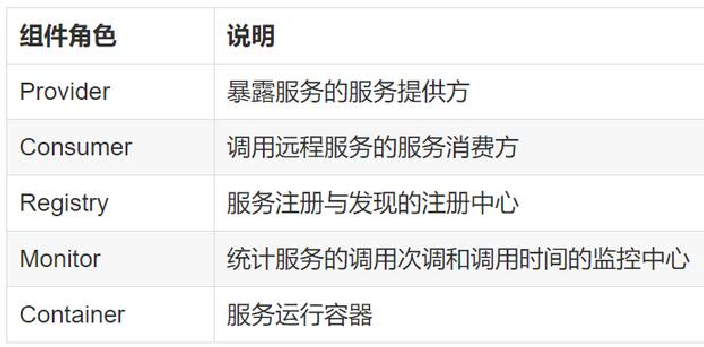
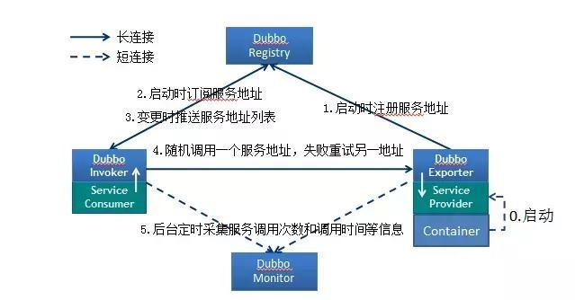
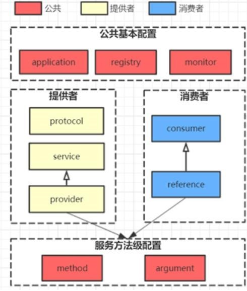
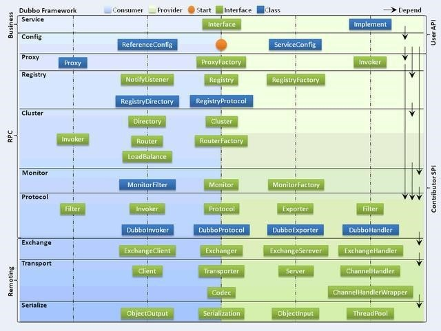
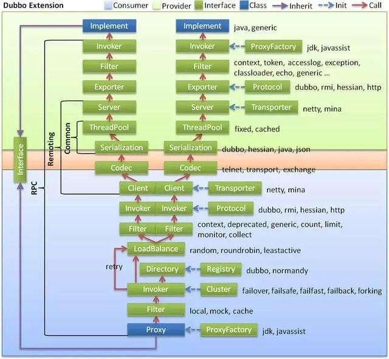
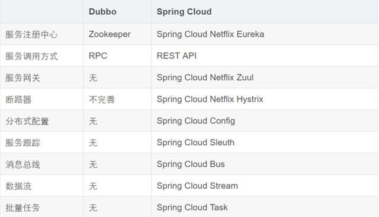

# **Dubbo** **支持哪些协议，每种协议的应用场景，优缺点？** 

•    **dubbo：** 单一长连接和 NIO 异步通讯，适合大并发小数据量的服务调用，以及消费者远大于提供者。传输协议 TCP，异步，Hessian 序列化； 

•    **rmi：** 采用 JDK 标准的 rmi 协议实现，传输参数和返回参数对象需要实现Serializable 接口，使用 java 标准序列化机制，使用阻塞式短连接，传输数据包大小混合，消费者和提供者个数差不多，可传文件，传输协议 TCP。 多个短连接，TCP 协议传输，同步传输，适用常规的远程服务调用和 rmi 互操作。在依赖低版本的 Common-Collections 包，java 序列化存在安全漏洞； 

•    **webservice：** 基于 WebService 的远程调用协议，集成 CXF 实现，提供和原生 WebService 的互操作。多个短连接，基于 HTTP 传输，同步传输，适用系统集成和跨语言调用； 

•    **http：** 基于 Http 表单提交的远程调用协议，使用 Spring 的 HttpInvoke 实现。多个短连接，传输协议HTTP，传入参数大小混合，提供者个数多于消费者，需要给应用程序和浏览器 JS 调用； 

•    **hessian：** 集成 Hessian 服务，基于 HTTP 通讯，采用 Servlet 暴露服务， Dubbo 内嵌 Jetty 作为服务器时默认实现，提供与 Hession 服务互操作。多个短连接，同步 HTTP 传输，Hessian 序列化，传入参数较大，提供者大于消费者，提供者压力较大，可传文件； 

•    **memcache：** 基于 memcached 实现的 RPC 协议 

•    **redis：** 基于 redis 实现的 RPC 协议 

# **Dubbo** **超时时间怎样设置？** 

　Dubbo 超时时间设置有两种方式： 

•    服务提供者端设置超时时间，在 Dubbo 的用户文档中，推荐如果能在服务端多配置就尽量多配置，因为服务提供者比消费者更清楚自己提供的服务特性。 

•    服务消费者端设置超时时间，如果在消费者端设置了超时时间，以消费者端为主，即优先级更高。因为服务调用方设置超时时间控制性更灵活。如果消费方超时，服务端线程不会定制，会产生警告。 

# **Dubbo** **有些哪些注册中心？** 

•    **Multicast** **注册中心：** Multicast 注册中心不需要任何中心节点，只要广播地址，就能进行服务注册和发现。基于网络中组播传输实现； 

•    **Zookeeper** **注册中心：** 基于分布式协调系统 Zookeeper 实现，采用Zookeeper 的 watch 机制实现数据变更； 

•    **redis** **注册中心：** 基于 redis 实现，采用 key/Map 存储，往 key 存储服务名和类型，Map 中 key 存储服务 URL，value 服务过期时间。基于 redis 的发布/订阅模式通知数据变更； 

•    **Simple** **注册中心** 

# **Dubbo** **集群的负载均衡有哪些策略**　　 

　Dubbo 提供了常见的集群策略实现，并预扩展点予以自行实现。 

•    **Random LoadBalance:** 随机选取提供者策略，有利于动态调整提供者权重。截面碰撞率高，调用次数越多，分布越均匀； 

•    **RoundRobin LoadBalance:** 轮循选取提供者策略，平均分布，但是存在请求累积的问题； 

•    **LeastActive LoadBalance:** 最少活跃调用策略，解决慢提供者接收更少的请求； 

•    **ConstantHash LoadBalance:** 一致性 Hash 策略，使相同参数请求总是发到同一提供者，一台机器宕机，可以基于虚拟节点，分摊至其他提供者，避免引起提供者的剧烈变动； 

# Dubbo 是什么？ 

 Dubbo 是一个分布式、高性能、透明化的 RPC 服务框架，提供服务自动注册、自动发现等高效服务治理方案， 可以和 Spring 框架无缝集成。 

# Dubbo 的主要应用场景？ 

•    透明化的远程方法调用，就像调用本地方法一样调用远程方法，只需简单配置，没有任何 API 侵入。 

•    软负载均衡及容错机制，可在内网替代 F5 等硬件负载均衡器，降低成本，减少单点。 

•    服务自动注册与发现，不再需要写死服务提供方地址，注册中心基于接口名查询服务提供者的 IP 地址，并且能够平滑添加或删除服务提供者。 

# Dubbo 的核心功能？ 

主要就是如下 3 个核心功能： 

§ **Remoting：**网络通信框架，提供对多种 NIO 框架抽象封装，包括“同步转异步”和“请求-响应”模式的信息交换方式。 

§ **Cluster：服务框架**，提供基于接口方法的透明远程过程调用，包括多协议支持，以及软负载均衡，失败容错，地址路由，动态配置等集群支持。 

§ **Registry：服务注册**，基于注册中心目录服务，使服务消费方能动态的查找服务提供方，使地址透明，使服务提供方可以平滑增加或减少机器。

#  **Dubbo** **的核心组件？** 



# Dubbo 服务注册与发现的流程？ 



## 流程说明：

§ Provider(提供者)绑定指定端口并启动服务 

§ 指供者连接注册中心，并发本机 IP、端口、应用信息和提供服务信息发送至注册中心存储 

§ Consumer(消费者），连接注册中心 ，并发送应用信息、所求服务信息至注册中心 

§ 注册中心根据 消费 者所求服务信息匹配对应的提供者列表发送至Consumer 应用缓存。 

§ Consumer 在发起远程调用时基于缓存的消费者列表择其一发起调用。 

Provider 状态变更会实时通知注册中心、在由注册中心实时推送至Consumer 

## 设计的原因： 

-  Consumer 与 Provider 解偶，双方都可以横向增减节点数。 
-  注册中心对本身可做对等集群，可动态增减节点，并且任意一台宕掉后，将自动切换到另一台 
-  去中心化，双方不直接依懒注册中心，即使注册中心全部宕机短时间内也不会影响服务的调用 
-  服务提供者无状态，任意一台宕掉后，不影响使用 



# Dubbo 的架构设计？



# Dubbo 框架设计一共划分了 10 个层： 

-  **服务接口层（Service）**：该层是与实际业务逻辑相关的，根据服务提供方和服务消费方的业务设计对应的接口和实现。 
-  **配置层（Config）**：对外配置接口，以 ServiceConfig 和ReferenceConfig 为中心。 
- **服务代理层（Proxy**）：服务接口透明代理，生成服务的客户端 Stub 和服务器端 Skeleton。 
-  **服务注册层（Registry）**：封装服务地址的注册与发现，以服务 URL为中心。 

-  **集群层（Cluster）**：封装多个提供者的路由及负载均衡，并桥接注册中心，以 Invoker 为中心。 
-  **监控层（Monitor）**：RPC 调用次数和调用时间监控。 
-  **远程调用层（Protocol）**：封将 RPC 调用，以 Invocation 和 Result为中心，扩展接口为 Protocol、Invoker 和 Exporter。 
-  **信息交换层（Exchange）**：封装请求响应模式，同步转异步，以Request 和 Response 为中心。 
-  **网络传输层（Transport）**：抽象 mina 和 netty 为统一接口，以message 为中心。 

# Dubbo 的服务调用流程？ 



# Dubbo 支持哪些协议，每种协议的应用场景，优缺点？ 

-  **dubbo：** 单一长连接和 NIO 异步通讯，适合大并发小数据量的服务调用，以及消费者远大于提供者。传输协议 TCP，异步，Hessian 序列化；
-   **rmi：** 采用 JDK 标准的 rmi 协议实现，传输参数和返回参数对象需要实现 Serializable 接口，使用 java 标准序列化机制，使用阻塞式短连接，传输数据包大小混合，消费者和提供者个数差不多，可传文件，传输协议 TCP。 多个短连接，TCP 协议传输，同步传输，适用常规的远程服务调用和 rmi 互操作。在依赖低版本的 Common-Collections包，java 序列化存在安全漏洞； 
-  **webservice：** 基于 WebService 的远程调用协议，集成 CXF 实现，提供和原生 WebService 的互操作。多个短连接，基于 HTTP 传输，同步传输，适用系统集成和跨语言调用； 
-  **http：** 基于 Http 表单提交的远程调用协议，使用 Spring 的HttpInvoke 实现。多个短连接，传输协议 HTTP，传入参数大小混合，提供者个数多于消费者，需要给应用程序和浏览器 JS 调用； 
-  **hessian：** 集成 Hessian 服务，基于 HTTP 通讯，采用 Servlet 暴露服务，Dubbo 内嵌 Jetty 作为服务器时默认实现，提供与 Hession 服务互操作。多个短连接，同步 HTTP 传输，Hessian 序列化，传入参数较大，提供者大于消费者，提供者压力较大，可传文件； 
-  **memcache：** 基于 memcached 实现的 RPC 协议 
-  **redis：** 基于 redis 实现的 RPC 协议
-  **dubbo** **推荐用什么协议？**
    默认使用 dubbo 协议 

# Dubbo 有些哪些注册中心？ 

-  **Multicast** **注册中心：** Multicast 注册中心不需要任何中心节点，只要广播地址，就能进行服务注册和发现。基于网络中组播传输实现； 
- **Zookeeper** **注册中心：** 基于分布式协调系统 Zookeeper 实现，采用Zookeeper 的 watch 机制实现数据变更； 
-  **redis** **注册中心：** 基于 redis 实现，采用 key/Map 存储，住 key 存储服务名和类型，Map 中 key 存储服务 URL，value 服务过期时间。基于 redis 的发布/订阅模式通知数据变更； 
- **Simple** **注册中心** 

**Dubbo** **默认采用注册中心？** 

采用 Zookeeper 

# 为什么需要服务治理？ 


-  过多的服务 URL 配置困难 
-  负载均衡分配节点压力过大的情况下也需要部署集群服务依赖混乱，启动顺序不清晰 
-  过多服务导致性能指标分析难度较大，需要监控 

# Dubbo 的注册中心集群挂掉，发布者和订阅者之间还能通信么？ 

可以的，启动 dubbo 时，消费者会从 zookeeper 拉取注册的生产者的地址接口等数据，缓存在本地。 

每次调用时，按照本地存储的地址进行调用。 

# Dubbo 与 Spring 的关系？ 

Dubbo 采用全 Spring 配置方式，透明化接入应用，对应用没有任何API 侵入，只需用 Spring 加载 Dubbo 的配置即可，Dubbo 基于Spring 的 Schema 扩展进行加载。 

**Dubbo** **使用的是什么通信框架?** 

默认使用 NIO Netty 框架 

# Dubbo 集群提供了哪些负载均衡策略？ 

-  **Random LoadBalance:** 随机选取提供者策略，有利于动态调整提供者权重。截面碰撞率高，调用次数越多，分布越均匀； 
-  **RoundRobin LoadBalance:** 轮循选取提供者策略，平均分布，但是存在请求累积的问题； 
-  LeastActive LoadBalance: 最少活跃调用策略，解决慢提供者接收更少的请求； 
-  **ConstantHash LoadBalance:** 一致性 Hash 策略，使相同参数请求总是发到同一提供者，一台机器宕机，可以基于虚拟节点，分摊至其他提供者，避免引起提供者的剧烈变动； 

缺省时为 Random 随机调用 

# **Dubbo** **的集群容错方案有哪些？** 

Failover Cluster : 失败自动切换，当出现失败，重试其它服务器。通常用于读操作，但重试会带来更长延迟。 

Failfast Cluster : 快速失败，只发起一次调用，失败立即报错。通常用于非幂等性的写操作，比如新增记录。 

**Failsafe Cluster**: 失败安全，出现异常时，直接忽略。通常用于写入审计日志等操作。 

Failback Cluster :失败自动恢复，后台记录失败请求，定时重发。通常用于消息通知操作。 

**Forking Cluster**: 并行调用多个服务器，只要一个成功即返回。通常用于实时性要求较高的读操作，但需要浪费更多服务资源。可通过 forks="2" 来设置最大并行数。 

roadcast Cluster :广播调用所有提供者，逐个调用，任意一台报错则报错 。通常用于通知所有提供者更新缓存或日志等本地资源信息。 

**Dubbo** **的默认集群容错方案？** 

Failover Cluster 

# Dubbo 支持哪些序列化方式？ 

默认使用 Hessian 序列化，还有 Duddo、FastJson、Java 自带序列化。 

# Dubbo 超时时间怎样设置？ 

Dubbo 超时时间设置有两种方式： 

- 服务提供者端设置超时时间，在 Dubbo 的用户文档中，推荐如果能在服务端多配置就尽量多配置，因为服务提供者比消费者更清楚自己提供的服务特性。 
- 服务消费者端设置超时时间，如果在消费者端设置了超时时间，以消费者端为主，即优先级更高。因为服务调用方设置超时时间控制性更灵活。如果消费方超时，服务端线程不会定制，会产生警告。 

**服务调用超时问题怎么解决？** 

dubbo 在调用服务不成功时，默认是会重试两次的。 

# Dubbo 在安全机制方面是如何解决？ 

Dubbo 通过 Token 令牌防止用户绕过注册中心直连，然后在注册中心上管理授权。Dubbo 还提供服务黑白名单，来控制服务所允许的调用方。 

# Dubbo 和 Dubbox 之间的区别？ 

dubbox 基于 dubbo 上做了一些扩展，如加了服务可 restful 调用，更新了开源组件等。 

# Dubbo 和 Spring Cloud 的关系？ 

Dubbo 是 SOA 时代的产物，它的关注点主要在于服务的调用，流量分发、流量监控和熔断。而 Spring Cloud 诞生于微服务架构时代，考虑的是微服务治理的方方面面，另外由于依托了 Spirng、Spirng Boot 的优势之上，两个框架在开始目标就不一致，Dubbo 定位服务治理、Spirng Cloud 是一个生态。 

# Dubbo 和 Spring Cloud 的区别？ 



最大的区别：Dubbo 底层是使用 Netty 这样的 NIO 框架，是基于TCP 协议传输的，配合以 Hession 序列化完成 RPC 通信。 

而 SpringCloud 是基于 Http 协议+Rest 接口调用远程过程的通信，相对来说，Http 请求会有更大的报文，占的带宽也会更多。但是REST 相比 RPC 更为灵活，服务提供方和调用方的依赖只依靠一纸契约，不存在代码级别的强依赖。 

# 1.**Dubbo** **中** **zookeeper** **做注册中心，如果注册中心集群都挂掉，发布者和订阅者之间还能通信么？** 

可以通信的，启动 dubbo 时，消费者会从 zk 拉取注册的生产者的地址接口等数据，缓存在本地。每次调用时，按照本地存储的地址进行调用； 

注册中心对等集群，任意一台宕机后，将会切换到另一台；注册中心全部宕机后，服务的提供者和消费者仍能通过本地缓存通讯。服务提供者无状态，任一台 宕机后，不影响使用；服务提供者全部宕机，服务消费者会无法使用，并无限次重连等待服务者恢复； 

挂掉是不要紧的，但前提是你没有增加新的服务，如果你要调用新的服务，则是不能办到的。 

# **2.dubbo** **服务负载均衡策略？** 

l Random LoadBalance 

  随机，按权重设置随机概率。在一个截面上碰撞的概率高，但调用量越大分布越均匀，而且按概率使用权重后也比较均匀，有利于动态调整提供者权重。(权重可以在 dubbo 管控台配置) 

| 1    | <dubbo:parameter key="hash.arguments" value="0,1" /> |
| ---- | ---------------------------------------------------- |
|      |                                                      |

| 1    | <dubbo:parameter key="hash.nodes" value="320" /> |
| ---- | ------------------------------------------------ |
|      |                                                  |

l RoundRobin LoadBalance 

  轮循，按公约后的权重设置轮循比率。存在慢的提供者累积请求问题，比如：第二台机器很慢，但没挂，当请求调到第二台时就卡在那，久而久之，所有请求都卡在调到第二台上。 

l LeastActive LoadBalance 

  最少活跃调用数，相同活跃数的随机，活跃数指调用前后计数差。使慢的提供者收到更少请求，因为越慢的提供者的

调用前后计数差会越大。 

l ConsistentHash LoadBalance 

一致性 Hash，相同参数的请求总是发到同一提供者。当某一台提供者挂时，原本发往该提供者的请求，基于虚拟节点，平摊到其它提供者，不会引起剧烈变动。缺省只对第一个参数 Hash，如果要修改，请配置 

`<dubbo:parameter key="hash.arguments" value="0,1" />`

缺省用 160 份虚拟节点，如果要修改，请配置 

` <dubbo:parameter key="hash.nodes" value="320" /> `

# 3. **Dubbo** **在安全机制方面是如何解决的** 

Dubbo 通过 Token 令牌防止用户绕过注册中心直连，然后在注册中心上管理授权。Dubbo 还提供服务黑白名单，来控制服务所允许的调用方。 

# 4. **dubbo** **连接注册中心和直连的区别** 

在开发及测试环境下，经常需要绕过注册中心，只测试指定服务提供者，这时候可能需要点对点直连， 

点对点直联方式，将以服务接口为单位，忽略注册中心的提供者列表， 

服务注册中心，动态的注册和发现服务，使服务的位置透明，并通过在消费方获取服务提供方地址列表，实现软负载均衡和 Failover， 注册中心返回服务提供者地址列表给消费者，如果有变更，注册中心将基于长连接推送变更数据给消费者。 

服务消费者，从提供者地址列表中，基于软负载均衡算法，选一台提供者进行调用，如果调用失败，再选另一台调用。注册中心负责服务地址的注册与查找，相当于目录服务，服务提供者和消费者只在启动时与注册中心交互，注册中心不转发请求，服务消费者向注册中心获取服务提供者地址列表，并根据负载算法直接调用提供者，注册中心，服务提供者，服务消费者三者之间均为长连接，监控中心除外，注册中心通过长连接感知服务提供者的存在，服务提供者宕机，注册中心将立即推送事件通知消费者 

注册中心和监控中心全部宕机，不影响已运行的提供者和消费者，消费者在本地缓存了提供者列表注册中心和监控中心都是可选的，服务消费者可以直连服务提供者。 

# **dubbo** **服务集群配置（集群容错模式）** 

在集群调用失败时，Dubbo 提供了多种容错方案，缺省为 failover 重试。可以自行扩展集群容错策略 

l Failover Cluster(默认) 

  失败自动切换，当出现失败，重试其它服务器。(缺省)通常用于读操作，但重试会带来更长延迟。可通过retries="2"来设置重试次数(不含第一次)。

```
<dubbo:service retries="2" cluster="failover"/>      
或：        
<dubbo:reference retries="2" cluster="failover"/>         
cluster="failover"可以不用写,因为默认就是 failover   
```

l Failfast Cluster 

快速失败，只发起一次调用，失败立即报错。通常用于非幂等性的写操作，比如新增记录。 

```
dubbo:service cluster="failfast" />      或：        
<dubbo:reference cluster="failfast" />   
cluster="failfast"和 把 cluster="failover"、retries="0"是一样的效果,retries="0"就是不重试   
```

l Failsafe Cluster 

  失败安全，出现异常时，直接忽略。通常用于写入审计日志等操作。

```
<dubbo:service cluster="failsafe" />          或： 
<dubbo:reference cluster="failsafe" />
```

l Failback Cluster 

  失败自动恢复，后台记录失败请求，定时重发。通常用于消息通知操作。

```
<dubbo:service cluster="failback" />          或： 
         <dubbo:reference cluster="failback" /> 
```

l Forking Cluster 

  并行调用多个服务器，只要一个成功即返回。通常用于实时性要求较高的读操作，但需要浪费更多服务资源。可通过forks="2"来设置最大并行数。 

```
<dubbo:service cluster=“forking" forks="2"/>          或： 
         <dubbo:reference cluster=“forking" forks="2"/> 
```

l 配置 

```
服务端服务级别
<dubbo:service interface="..."  loadbalance="roundrobin" />
客户端服务级别
<dubbo:reference interface="..." loadbalance="roundrobin" />
服务端方法级别
<dubbo:service interface="...">   <dubbo:method name="..." loadbalance="roundrobin"/>
客户端方法级别
<dubbo:reference interface="..">	<dubbo:method name="..."  loadbalance="roundrobin"/>

```

## 1. **dubbo** **通信协议** **dubbo** **协议为什么要消费者比提供者个数多：** 

因 dubbo 协议采用单一长连接，假设网络为千兆网卡(1024Mbit=128MByte)， 

根据测试经验数据每条连接最多只能压满 7MByte(不同的环境可能不一样，供参考)，理论上 1 个服务提供者需要 20个服务消费者才能压满网卡。 

 

## 2. **dubbo** **通信协议** **dubbo** **协议为什么不能传大包：**

因 dubbo 协议采用单一长连接， 

如果每次请求的数据包大小为 500KByte，假设网络为千兆网卡(1024Mbit=128MByte)，每条连接最大 7MByte(不同的环境可能不一样，供参考)， 

单个服务提供者的 TPS(每秒处理事务数)最大为：128MByte / 500KByte = 262。 

单个消费者调用单个服务提供者的 TPS(每秒处理事务数)最大为：7MByte / 500KByte = 14。如果能接受，可以考虑使用，否则网络将成为瓶颈。 

## 3. **dubbo** **通信协议** **dubbo** **协议为什么采用异步单一长连接：**

因为服务的现状大都是服务提供者少，通常只有几台机器，而服务的消费者多，可能整个网站都在访问该服务， 比如 Morgan 的提供者只有 6 台提供者，却有上百台消费者，每天有 1.5 亿次调用，如果采用常规的 hessian 服务，服务提供者很容易就被压跨，通过单一连接，保证单一消费者不会压死提供者，长连接，减少连接握手验证等， 并使用异步 IO，复用线程池，防止 C10K 问题。 

## 4. **dubbo** **通信协议** **dubbo** **协议适用范围和适用场景** 

适用范围：传入传出参数数据包较小（建议小于100K），消费者比提供者个数多，单一消费者无法压满提供者，尽量不要用dubbo协议传输大文件或超大字符串。 

适用场景：常规远程服务方法调用 dubbo协议补充： 

连接个数：单连接连接方式：长连接传输协议：TCP 

传输方式：NIO 异步传输 

序列化：Hessian 二进制序列化 

## 5. **RMI** **协议** 

RMI协议采用JDK标准的java.rmi.*实现，采用阻塞式短连接和JDK标准序列化方式，Java标准的远程调用协议。 

连接个数：多连接; 连接方式：短连接  ;传输协议：TCP ;传输方式：同步传输;序列化：Java标准二进制序列化 

适用范围：传入传出参数数据包大小混合，消费者与提供者个数差不多，可传文件。 

适用场景：常规远程服务方法调用，与原生RMI服务互操作 

## 6. **Hessian** **协议** 

Hessian协议用于集成Hessian的服务，Hessian底层采用Http通讯，采用Servlet暴露服务，Dubbo缺省内嵌Jetty作为服务器实现基于Hessian的远程调用协议。 

连接个数：多连接;连接方式：短连接;传输协议：HTTP ;传输方式：同步传输 

序列化：Hessian二进制序列化;适用范围：传入传出参数数据包较大，提供者比消费者个数多，提供者压力较大，可传文件。 

适用场景：页面传输，文件传输，或与原生hessian服务互操作 

## 7. **http** 

采用Spring的HttpInvoker实现基于http表单的远程调用协议。 

连接个数：多连接;连接方式：短连接;传输协议：HTTP; 传输方式：同步传;输序列化：表单序列化（JSON） 

适用范围：传入传出参数数据包大小混合，提供者比消费者个数多，可用浏览器查看，可用表单或URL传入参数，暂不支持传文件。适用场景：需同时给应用程序和浏览器JS使用的服务。 

## 8. **Webservice** 

基于CXF的frontend-simple和transports-http实现基于WebService的远程调用协议。 

连接个数：多连接;连接方式：短连接;传输协议：HTTP ;传输方式：同步传输 

序列化：SOAP文本序列化适用场景：系统集成，跨语言调用。 

## 9. **Thrif** 

Thrift是Facebook捐给Apache的一个RPC框架，当前 dubbo 支持的 thrift 协议是对 thrift 原生协议的扩展，在原生协议的基础上添加了一些额外的头信息，比如service name，magic number等 