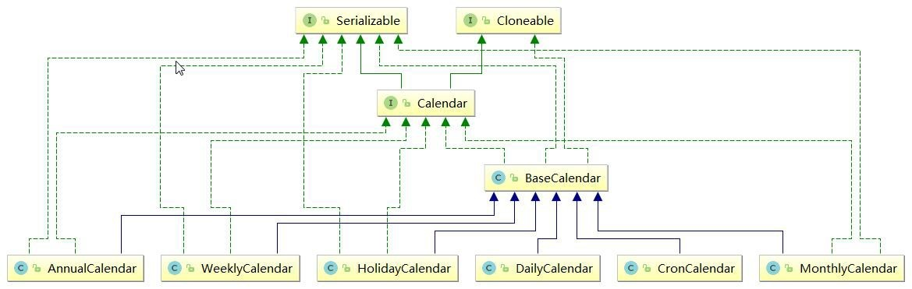

## 一·spring

1、 ScheduledAnnotationBeanPostProcessor 的 postProcessAfterInitialization 方法将@Scheduled 的方法包装为指定的 task
添加到 ScheduledTaskRegistrar 中
2、 ScheduledAnnotationBeanPostProcessor 会监听 Spring 的容器初始化事件，在 Spring 容器初始化完成后进行
TaskScheduler 实现类实例的查找，若发现有 SchedulingConfigurer 的实现类实例，则跳过 3
3、 查找 TaskScheduler 的实现类实例默认是通过类型查找，若有多个实现则会查找名字为"taskScheduler"的实现 Bean，
若没有找到则在 ScheduledTaskRegistrar 调度任务的时候会创建一个 newSingleThreadScheduledExecutor ，将TaskScheduler 的实现类实例设置到 ScheduledTaskRegistrar 属性中
4、 ScheduledTaskRegistrar 的 scheduleTasks 方法触发任务调度
5、 真正调度任务的类是 TaskScheduler 实现类中的 ScheduledExecutorService，由 J.U.C 提供

@Scheduled 也是用 JUC 的 ScheduledExecutorService 实现的Scheduled(cron = “0 15 10 15 * ?”)

## 二·Quartz 

特点：

精确到毫秒级别的调度
可以独立运行，也可以集成到容器中支持事务（JobStoreCMT ）
支持集群
支持持久化

体系结构总结：

### Trigger

| **子接口**               | **描述**                 | **特点**                                                     |
| ------------------------ | ------------------------ | ------------------------------------------------------------ |
| SimpleTrigger            | 简单触发器               | 固定时刻或时间间隔，毫秒                                     |
| CalendarIntervalTrigger  | 基于日历的触发器         | 比简单触发器更多时间单位，支持非固定时  间的触发，例如一年可能 365/366，一个月可能 28/29/30/31 |
| DailyTimeIntervalTrigger | 基于日期的触发器         | 每天的某个时间段                                             |
| CronTrigger              | 基于 Cron 表达式的触发器 |                                                              |

#### Cron 表达式

|位置	|时间域		|特殊值|
| ------------------------ | ------------------------ | ------------------------------------------------------------ |
|1	|秒	0-59	|, - * /|
|2	|分钟	0-59	|, - * /|
|3	|小时	0-23	|, - * /|
|4	|日期	1-31	|, - * ? / L W C|
|5	|月份	1-12	|, - * /|
|6	|星期	1-7	|, - * ? / L W C|
|7	|年份（可选）	1-31	|, - * /|

星号(*)：可用在所有字段中，表示对应时间域的每一个时刻，例如，在分钟字段时，表示“每分钟”；  

问号（?）：该字符只在日期和星期字段中使用，它通常指定为“无意义的值”，相当于点位符；

减号(-)：表达一个范围，如在小时字段中使用“10-12”，则表示从 10 到 12 点，即 10,11,12；

逗号(,)：表达一个列表值，如在星期字段中使用“MON,WED,FRI”，则表示星期一，星期三和星期五；

斜杠(/)：x/y 表达一个等步长序列，x 为起始值，y 为增量步长值。如在分钟字段中使用 0/15，则表示为 0,15,30 和45 秒，而 5/15 在分钟字段中表示 5,20,35,50，你也可以使用*/y，它等同于 0/y；

 

L：该字符只在日期和星期字段中使用，代表“Last”的意思，但它在两个字段中意思不同。L 在日期字段中，表示这个月份的最后一天，如一月的 31 号，非闰年二月的 28 号；如果 L 用在星期中，则表示星期六，等同于 7。但是，如果 L 出现在星期字段里，而且在前面有一个数值 X，则表示“这个月的最后 X 天”，例如，6L 表示该月的最后星期五；

W：该字符只能出现在日期字段里，是对前导日期的修饰，表示离该日期最近的工作日。例如 15W 表示离该月 15

号最近的工作日，如果该月 15 号是星期六，则匹配 14 号星期五；如果 15 日是星期日，则匹配 16 号星期一；如果 15

号是星期二，那结果就是 15 号星期二。但必须注意关联的匹配日期不能够跨月，如你指定 1W，如果 1 号是星期六， 结果匹配的是 3 号星期一，而非上个月最后的那天。W 字符串只能指定单一日期，而不能指定日期范围；

LW 组合：在日期字段可以组合使用 LW，它的意思是当月的最后一个工作日；

井号(#)：该字符只能在星期字段中使用，表示当月某个工作日。如 6#3 表示当月的第三个星期五(6 表示星期五，

\#3 表示当前的第三个)，而 4#5 表示当月的第五个星期三，假设当月没有第五个星期三，忽略不触发；

C：该字符只在日期和星期字段中使用，代表“Calendar”的意思。它的意思是计划所关联的日期，如果日期没有被关联，则相当于日历中所有日期。例如 5C 在日期字段中就相当于日历 5 日以后的第一天。1C 在星期字段中相当于星期日后的第一天。

Cron 表达式对特殊字符的大小写不敏感，对代表星期的缩写英文大小写也不敏感

#### 基于 Calendar 的排除规则

 

如果要在触发器的基础上，排除一些时间区间不执行任务，就要用到 Quartz 的Calendar 类（注意不是 JDK 的 Calendar)。可以按年、月、周、日、特定日期、Cron 表达式排除。

调用 Trigger 的 modifiedByCalendar() 添加到触发器中， 并且调用调度器的addCalendar()方法注册排除规则。

| **Calendar**  **名称** | **用法**                                                     |
| ---------------------- | ------------------------------------------------------------ |
| BaseCalendar           | 为高级的 Calendar 实现了基本的功能，实现了 org.quartz.Calendar  接口 |
| AnnualCalendar         | 排除年中一天或多天                                           |
| CronCalendar           | 日历的这种实现排除了由给定的 CronExpression 表达的时间集合。 例如， 您可以使用此日历使用表达式“* * 0-7,18-23？* *”每天排除所有营业时间（上午 8 点至下午 5 点）。 如果 CronTrigger  具有给定的 cron 表达式并且与具有相同表达式的  CronCalendar 相关联，则日历将排除触发器包含的  所有时间，并且它们将彼此抵消。 |
| DailyCalendar          | 您可以使用此日历来排除营业时间（ 上午 8 点 - 5 点） 每天。 每个DailyCalendar 仅允许指定单个时间范围，并且该时间范围可能不会跨越每日边界（即，您不能指定从上午 8 点至凌晨 5 点的时间范围）。  如果属性 invertTimeRange 为 false（默认），则时间范围定义触发器不允许触发的时间范围。 如果 invertTimeRange 为 true，则时间范围被反转 - 也就是  排除在定义的时间范围之外的所有时间。 |
| HolidayCalendar        | 特别的用于从 Trigger 中排除节假日                            |
| MonthlyCalendar        | 排除月份中的指定数天，例如，可用于排除每月的最后一天         |
| WeeklyCalendar         | 排除星期中的任意周几，例如，可用于排除周末，默认周六和周日   |