# 网络&IO模型


```
常见问题
1，【网络到分布式lvs+redis+zk】http://mashibing.com/pc.html
2，网络的小课
3，内存与IO，磁盘IO，网络IO

从程序员的角度理解网络通信

面试突击班怎么学，自己时间衡量，一点带面，能够应付变种问题
你有点体系的基础
查漏补缺，建立体系的过程

做规划，面试辅导，又几个进了腾讯：redis+网络+IO
```


1. TCP三次握手

   backlog：

     cat /proc/sys/net/core/somaxconn   ACCEPT队列  你可以给出backlog 取min

   每个人顾好自己，每个人处理好对别人的打扰

     cat /proc/sys/net/ipv4/tcp_max_syn_backlog  DDOS

   backlog满了 accept队列满了，新客户端直接Connection refused

2. TCP四次分手

3. TCP连接状态

4. Connection refused

5. OSI七层参考模型

6. 什么是长连接和短连接？有状态，无状态？

   TCP是长连接吗？

   tcp只是连接，受应用层协议

   连接是不是一个“复用”载体

   举一个例子：http 1.0 ，1.1 没有开启keepalive保持，连接只负责一次同步阻塞的请求+响应，短连接！

   举一个例子：http 1.0,1.1 开启了keepalive保持，同步复用连接：多次(请求+响应)，以上是无状态通信，长连接！

   举一个列子：dubbo协议(rpc)，打开连接，同步/异步复用连接：多次（请求+响应）（请求请求）（响应响应），当复用连接的时候，需要消息的ID，而且客户端和服务端同时完成这个约束  有状态通信，长连接！

7. IO模型

   0：IO是程序对着内核的socket-queue的包装

   BIO：读取，一直等queue里有才返回，阻塞模型，每连接对应一个线程

   NIO：读取，立刻返回：两种结果，读到，没读到，程序逻辑要自己维护，nio noblock

   多路复用器：内核增加select，poll，epoll新增的和数据接收，连接接受实质无关的调用，得到是对应socket的事件(listen socket ，socket)，可以有效地去再次accept，R/W

   

   AIO*

8. 同步阻塞，同步非阻塞

   BIO,NIO,多路复用器，在IO模型上都是同步的，都是程序自己accpet，R/W

9. 粘包，粘包，拆包

   有程序，有内核，程序和内核协调工作

   有一些是内核做的事情，三次握手，数据发送出去，接受进来，内核，TCP，分包

   到我们自己的程序，即便在一个socket里，也可能收到多个消息在一个字节数组中，我们要自己拆解

   

# 深入理解socket网络异常

在各种网络异常情况的背后，TCP是怎么处理的？又是怎样把处理结果反馈给上层应用的？本文就来讨论这个问题。

分为两个场景来讨论

## **建立连接**

### 1 正常情况下

 进过三次握手，客户端连接成功，服务端有一个新连接到来。

1、LISTENING状态
FTP服务启动后首先处于侦听（LISTENING）状态。

2、ESTABLISHED状态
ESTABLISHED的意思是**建立连接。表示两台机器正在通信**。

3、CLOSE_WAIT

  对方主动关闭连接或者网络异常导致连接中断，这时我方的状态会变成CLOSE_WAIT 此时我方要调用close()来使得连接正确关闭

4、TIME_WAIT

  **我方主动调用close()断开连接，收到对方确认后状态变为TIME_WAIT**。


### 2 客户端连接了服务端未监听的端口

在这种情况下，服务端会对收到的SYN回应一个RST（RFC 793 3.4），客户端收到RST之后，终止连接，并进入CLOSED状态。

客户端的connect返回ECONNREFUSED 111  Connection refused 。


### 3 客户端与服务器之间的网络不通

这又分两种情况

1. connect返回主机不可达
   具体信息在不同系统上不一样，比如linux上的定义是EHOSTUNREACH 113 /* No route to host */。明显给出了一个不可访问的地址（例如，访问一个不存在的本地网络地址，或者DNS解析失败会导致这种情况。
2. connect返回连接超时
   这种情况下，客户端发送的SYN丢失在网络中，没有得到确认，客户端的TCP会超时重发SYN。以ubuntu 12.04为例，重发SYN的时间,系列是：
   0,1,3,7,15,31,63(2n-1-1)。即发送7个SYN后等待一个超时时间（例如：127秒），如果在这段时间内仍然没有收到ACK，则connect返回超时。

在这两种情况下， 服务端的状态没有变化，对服务端来讲什么也没发生。

### 4 建立连接的过程中包丢失

三次握手发送的包系列是SYN > SYN-ACK > ACK

1. SYN丢失
   这种情况就是3种的第2种情况。
2. SYN-ACK丢失
   从客户端的角度来讲以前面一种情况类似。从服务端的角度来讲，由LISTEN状态进入SYN_REVD状态。服务端的TCP会重发SYN-ACK，直到超时。SYN攻击正是利用这一原理，攻击方伪造大量的SYN包发送到服务器，服务器对收到的SYN包不断回应SYN-ACK，直到超时。这会浪费服务器大量的资源，甚至导致奔溃。对服务端的应用层来讲，什么也没有发生。因为TCP只有在经过3次握手之后才回通知应用层，有新的连接到来。
   
3. ACK丢失
   这对服务端来讲与2相同。对于客户端来讲，由SYN_SENT状态进入了ESTABLISED状态，即连接成功了。连接成功后客户端就可以发送数据了。但实际上数据是发送不到服务端的（我们假设客户端收到SYN-ACK之后，客户端与服务端之间的网络就断开了），客户端发送出去的数据得不到确认，一般重发3次左右就会处于等待ACK的状态（win7）。而ubuntu 12.10下，调用send会返回成功，直到TCP的缓冲被填满（测试环境：局域网，感觉这个不是很合理，按照书上所说：应该是使用“指数退避”进行重传 -- TCP/IP协议详解， 大概是我的测试环境中有NAT所致吧）。最终，客户端产生一个复位信号并终止连接。返回给应用程序的结果是Connection time out（errno:110）

## **通信过程**

下面来看看连接建立成功后出现异常情况的处理

### 1 客户端与服务器的网络断开，双方不再发送数据

  这样，双方都不知道网络已经不通，会一直保持ESTABLISHDED状态，除非打开了SO_KEEPALIVE选项。

### 2 网络断开，一方给另一方发送数据

这种情况下，接收一方不知道网络出问题，会一直等待数据到来。

对于发送方，理论上的情况是，重传一定次数后，返回连接超时。

不过实际，很可能是这样的情况，发送方显示发送数据成功（send返回发送的数据长度），但实际接收方还没有接收到数据。

对于已经发送成功的数据有3种可能情况：

​	1 在本机的TCP缓存中

​	2 在网络上的某个NAT的缓存中

​	3 对方已经成功接收到

在实验的过程中发现，即使网络断开了，发送方仍然收到了对数据的ACK（在有NAT的情况下），猜测是NAT把数据缓存起来并发送了ACK。

当网络恢复时，那些被缓存的数据会被发送到接收方。鉴于这样的结果，给我们一个提示：不能依赖于TCP的可靠性，认为我发送成功的数据，对方一定能收到。

TCP可以保证可靠、有序的传输，这意思是说保证收到的数据时有序正确的，并没有说已经发送成功的数据，对方一定就收到了。

在ubuntu 12.10上，发送方一直在发送数据，直到缓冲区满。而在win7下，重发3次就会停止，进入等待ACK状态。

解决的办法是：应用层对数据是否接收完成进行确认（需要的时候）。

### 3 网络断开，一方等待着另一方发送数据

这种情况下，等待数据的一方将一直等待下去。接收方无法直接知道网络已经断开，一般是设置一个超时时间，超时时间到就判断为网络已断开。发送数据的一方的反应如2所述。

### 4 一方crash，另一方继续发送/接收数据

 这依赖于TCP协议栈对crash的反应。与系统相关性很大 例如：

 在windows下：按ctrl+c结束程序，会发送RST段。而在linux下，按ctrl+c结束程序，会调用close。

 在windows7下，如果没有调用close而结束程序，TCP会发送RST。而Ubuntu12.10上，则会发送FIN段。

1. crash的一端发送FIN，相当于调用了close没有crash的一端接收数据具体的反应与系统有关例如

   linux 3.8.0-29-generic调用recv返回-1，errno被设置为22， Invalid argument，而linux3.3.6-030306-generic调用recv返回0.在TCP内部，调用recv时，发送FIN，终止连接(Linux)。
   windows情况以此不同，recv返回0，表示对方调用了shutdown。TCP内部发送一个RST。

   但共同点是recv都会立即返回失败。
   没有crash的一端发送数据第一次调用send返回成功，数据会被发送到crash的一端，crash的一端会回应一个RST，再次调用send返回-1， errno被设置为32， Broken pipe。 注意：这会向应用程序发送SIGPIPE信号，你的程序会莫名其妙退出。这是因为程序对SIGPIPE的默认处理就是结束程序。
   这是编写服务器程序是最需要注意的一个问题。最简单的处理方法是忽略该信号 -- signal(SIGPIPE,SIG_IGN);
   windows下行为是一样的， 不同的是返回的错误是10053 - WSAECONNABORTED， 由于软件错误，造成一个已经建立的连
   接被取消。

   共同点第一次send成功，之后就出错。

2. crash的一端发送RST
   没有crash的一端接收数据
   调用recv返回-1，errno被设置为104， Connection reset by peer。在TCP内部，当收到RST时，把错误号设为ECONNRESET。
   没有crash的一端发送数据
   调用send返回-1，errno被设置为104， Connection reset by peer。在TCP内部，当收到RST时，把错误号设为ECONNRESET

   

3. crash的一端即没发送FIN也没发送RST
   没有crash的一端接收数据
   调用recv会一直阻塞等待数据到来
   没有crash的一端发送数据
   重传一定次数后，返回connection time out。

5 一端关闭连接

  这种情况与一端crash并发送FIN 的情况相同，参看4.1

## 总结  

上面分析的目的是：当程序出现网络异常时，能够知道问题的原因在哪？

作为开发者，我们主要关心应用层面的返回状态。一般出错的地方是调用connect, recv, send的时候。

下面做一个总结

connect函数返回状态及其原因


recv函数返回状态及其原因


send函数返回状态及其原因


各种不同步的状态，都是通过发送RST来恢复的，理解这些状况的关键在于理解何时产生RST，以及在各种状态下，对RST段如何处理。


# 访问 www.taobao.com过程

* 首先是查找浏览器缓存，浏览器会保存一段时间你之前访问过的一些网址的DNS信息，不同浏览器保存的时常不等。如果没有找到对应的记录，这个时候浏览器会尝试调用系统缓存来继续查找这个网址的对应DNS信息。

* 如果还是没找到对应的IP，那么接着会发送一个请求到路由器上，然后路由器在自己的路由器缓存上查找记录，路由器一般也存有DNS信息。

* 如果还是没有，这个请求就会被发送到ISP（注：Internet Service Provider，互联网服务提供商，就是那些拉网线到你家里的运营商，中国电信中国移动什么的），ISP也会有相应的ISP DNS服务器，一听中国电信就知道这个DNS服务器的规模肯定不会小，所以基本上都能在这里找得到。题外话：会跑到这里进行查询是因为你没有改动过"网络中心"的"ipv4"的DNS地址，万恶的电信联通可以改动了这个DNS服务器，换句话说他们可以让你的浏览器跳转到他们设定的页面上，这也就是人尽皆知的DNS和HTTP劫持，ISP们还美名曰“免费推送服务”。强烈鄙视这种霸王行为。我们也可以自行修改DNS服务器来防止DNS被ISP污染。

* 如果还是没有的话， 你的ISP的DNS服务器会将请求发向根域名服务器进行搜索。根域名服务器就是面向全球的顶级DNS服务器，共有13台逻辑上的服务器，从A到M命名，真正的实体服务器则有几百台，分布于全球各大洲。所以这些服务器有真正完整的DNS数据库。如果到了这里还是找不到域名的对应信息，那只能说明一个问题：这个域名本来就不存在，它没有在网上正式注册过。或者卖域名的把它回收掉了（通常是因为欠费）。

这也就是为什么打开一个新页面会有点慢，因为本地没什么缓存，要这样递归地查询下去。

多说一句，例如"mp3.baidu.com"，域名先是解析出这是个.com的域名，然后跑到管理.com域名的服务器上进行进一步查询，然后是.baidu，最后是mp3，

所以域名结构为：三级域名.二级域名.一级域名。

* 浏览器终于得到了IP以后，浏览器接着给这个IP的服务器发送了一个http请求，方式为get，例如访问nbut.cn

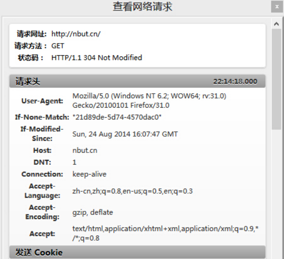

这个get请求包含了主机（host）、用户代理(User-Agent)，用户代理就是自己的浏览器，它是你的"代理人"，Connection（连接属性）中的keep-alive表示浏览器告诉对方服务器在传输完现在请求的内容后不要断开连接，不断开的话下次继续连接速度就很快了。其他的顾名思义就行了。还有一个重点是Cookies，Cookies保存了用户的登陆信息，在每次向服务器发送请求的时候会重复发送给服务器。Corome上的F12与Firefox上的firebug(快捷键shift+F5)均可查看这些信息。

发送完请求接下来就是等待回应了

* 当然了，服务器收到浏览器的请求以后（其实是WEB服务器接收到了这个请求，WEB服务器有iis、apache等），它会解析这个请求（读请求头），然后生成一个响应头和具体响应内容。接着服务器会传回来一个响应头和一个响应，响应头告诉了浏览器一些必要的信息，例如重要的Status Code，2开头如200表示一切正常，3开头表示重定向，4开头，如404，呵呵。响应就是具体的页面编码，就是那个<html>......</html>，浏览器先读了关于这个响应的说明书（响应头），然后开始解析这个响应并在页面上显示出来。在下一次CF的时候（不是穿越火线，是http://codeforces.com/），由于经常难以承受几千人的同时访问，所以CF页面经常会出现崩溃页面，到时候可以点开火狐的firebug或是Chrome的F12看看状态，不过这时候一般都急着看题和提交代码，似乎根本就没心情理会这个状态吧-.-。

* 如果是个静态页面，那么基本上到这一步就没了，但是如今的网站几乎没有静态的了吧，基本全是动态的。所以这时候事情还没完，根据我们的经验，浏览器打开一个网址的时候会慢慢加载这个页面，一部分一部分的显示，直到完全显示，最后标签栏上的圈圈就不转了。


这是因为，主页（index）页面框架传送过来以后，浏览器还要继续向服务器发送请求，请求的内容是主页里面包含的一些资源，如图片，视频，css样式等等。这些"非静态"的东西要一点点地请求过来，所以标签栏转啊转，内容刷啊刷，最后全部请求并加载好了就终于好了。


需要说明的是，对于静态的页面内容，浏览器通常会进行缓存，而对于动态的内容，浏览器通常不会进行缓存。缓存的内容通常也不会保存很久，因为难保网站不会被改动。

# DNS域名解析的过程


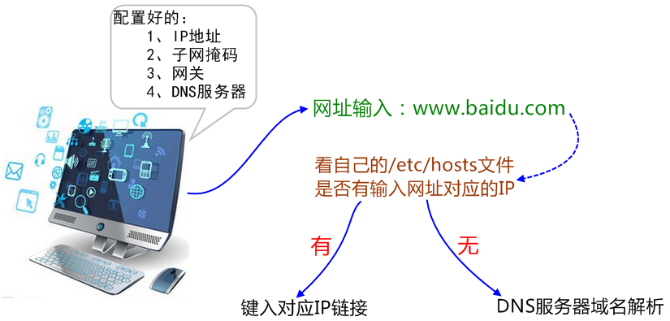

**一、主机解析域名的顺序**

　　1、找缓存

　　2、找本机的hosts文件

　　3、找DNS服务器

注意：

　　配置IP和主机名时，要记得修改/etc/hosts文件，因为有些应用程序在主机内的进程之间通信的时候，会本机的主机名，如果主机名不能正确解析到一个正常的IP地址，那么就会导致进程通信有问题。

 

 

**二、概念解释** 

DNS（Domain Name System，域名系统）

​    1、因特网上作为域名和IP(Internet Protocol Address)地址相互映射的一个分布式数据库，能够使用户更方便的访问互联网，而不用去记住能够被机器直接读取的IP数串。

​    2、通过主机名，最终得到该主机名对应的IP地址的过程叫做域名解析（或主机名解析）。

​    3、DNS协议运行在UDP协议之上，使用端口号53。

​    4、在整个互联网体系中，约定俗成的用于标识网络上设备的地址是IP，然而我们输入的是DNS，因为域名更方便人们记忆，不然那么多网站，人怎么可能记住所有的IP地址。

 

Q：浏览器如何通过域名去查询URL对应的IP（对应服务器地址）呢？

A：

　　1、浏览器缓存：浏览器会按照一定的频率缓存DNS记录。

　　2、操作系统缓存：如果浏览器缓存中找不到需要的DNS记录，那就去操作系统中找。

　　3、路由缓存：路由器也有DNS缓存。

　　4、ISP的DNS服务器：ISP是互联网服务提供商(Internet Service Provider)的简称，ISP有专门的DNS服务器应对DNS查询请求。

　　5、根服务器：ISP的DNS服务器还找不到的话，它就会向根服务器发出请求，进行递归查询（DNS服务器先问根域名服务器.com域名服务器的IP地址，然后再问.com域名服务器，依次类推）。


Q：在网上查到某个网站的IP地址，在自己的浏览器上输入，却为什么连接不上？

A：大的高并发网站可能不止一个IP地址，根据不同的网络他们会有很多的IP来做集群。有的是通过DNS来实现负载均衡，有的是用squid来实现的。

# OSI七层协议模型和TCP/IP四层模型比较


TCP/IP参考模型
　　
　　ISO制定的OSI参考模型的过于庞大、复杂招致了许多批评。与此对照，由技术人员自己开发的TCP/IP协议栈获得了更为广泛的应用。如图2-1所示，是TCP/IP参考模型和OSI参考模型的对比示意图。


图2-1　 TCP/IP参考模型

　　2.1　TCP/IP参考模型的层次结构
　　TCP/IP协议栈是美国国防部高级研究计划局计算机网（Advanced Research Projects Agency Network，ARPANET）和其后继因特网使用的参考模型。ARPANET是由美国国防部（U.S．Department of Defense，DoD）赞助的研究网络。最初，它只连接了美国境内的四所大学。随后的几年中，它通过租用的电话线连接了数百所大学和政府部门。最终ARPANET发展成为全球规模最大的互连网络-因特网。最初的ARPANET于1990年永久性地关闭。　　
　　TCP/IP参考模型分为四个层次：应用层、传输层、网络互连层和主机到网络层。如图2-2所示。

图2-2　 TCP/IP参考模型的层次结构

　　在TCP/IP参考模型中，去掉了OSI参考模型中的会话层和表示层（这两层的功能被合并到应用层实现）。同时将OSI参考模型中的数据链路层和物理层合并为主机到网络层。下面，分别介绍各层的主要功能。
　　
　　1、主机到网络层　　
　　实际上TCP/IP参考模型没有真正描述这一层的实现，只是要求能够提供给其上层-网络互连层一个访问接口，以便在其上传递IP分组。由于这一层次未被定义，所以其具体的实现方法将随着网络类型的不同而不同。　　
　　2、网络互连层　　
　　网络互连层是整个TCP/IP协议栈的核心。它的功能是把分组发往目标网络或主机。同时，为了尽快地发送分组，可能需要沿不同的路径同时进行分组传递。因此，分组到达的顺序和发送的顺序可能不同，这就需要上层必须对分组进行排序。　　
　　网络互连层定义了分组格式和协议，即IP协议（Internet Protocol）。　　
　　网络互连层除了需要完成路由的功能外，也可以完成将不同类型的网络（异构网）互连的任务。除此之外，网络互连层还需要完成拥塞控制的功能。　　
　　3、传输层　　
　　在TCP/IP模型中，传输层的功能是使源端主机和目标端主机上的对等实体可以进行会话。在传输层定义了两种服务质量不同的协议。即：传输控制协议TCP（transmission control protocol）和用户数据报协议UDP（user datagram protocol）。　　
　　TCP协议是一个面向连接的、可靠的协议。它将一台主机发出的字节流无差错地发往互联网上的其他主机。在发送端，它负责把上层传送下来的字节流分成报文段并传递给下层。在接收端，它负责把收到的报文进行重组后递交给上层。TCP协议还要处理端到端的流量控制，以避免缓慢接收的接收方没有足够的缓冲区接收发送方发送的大量数据。　　
　　UDP协议是一个不可靠的、无连接协议，主要适用于不需要对报文进行排序和流量控制的场合。　　
　　4、应用层　　
　　TCP/IP模型将OSI参考模型中的会话层和表示层的功能合并到应用层实现。　　
　　应用层面向不同的网络应用引入了不同的应用层协议。其中，有基于TCP协议的，如文件传输协议（File Transfer Protocol，FTP）、虚拟终端协议（TELNET）、超文本链接协议（Hyper Text Transfer Protocol，HTTP），也有基于UDP协议的。

　　2.2　TCP/IP报文格式　　
　　1、IP报文格式　　
　　IP协议是TCP/IP协议族中最为核心的协议。它提供不可靠、无连接的服务，也即依赖其他层的协议进行差错控制。在局域网环境，IP协议往往被封装在以太网帧中传送。而所有的TCP、UDP、ICMP、IGMP数据都被封装在IP数据报中传送。如图2-3所示：

图2-3　 TCP/IP报文封装

　　图2-4是IP头部（报头）格式：（RFC 791）。

图2-4　 IP头部格式
　　其中：　　
　　●版本（Version）字段：占4比特。用来表明IP协议实现的版本号，当前一般为IPv4，即0100。　　
　　●报头长度（Internet Header Length，IHL）字段：占4比特。是头部占32比特的数字，包括可选项。普通IP数据报（没有任何选项），该字段的值是5，即160比特=20字节。此字段最大值为60字节。　　
　　●服务类型（Type of Service ，TOS）字段：占8比特。其中前3比特为优先权子字段（Precedence，现已被忽略）。第8比特保留未用。第4至第7比特分别代表延迟、吞吐量、可靠性和花费。当它们取值为1时分别代表要求最小时延、最大吞吐量、最高可靠性和最小费用。这4比特的服务类型中只能置其中1比特为1。可以全为0，若全为0则表示一般服务。服务类型字段声明了数据报被网络系统传输时可以被怎样处理。例如：TELNET协议可能要求有最小的延迟，FTP协议（数据）可能要求有最大吞吐量，SNMP协议可能要求有最高可靠性，NNTP（Network News Transfer Protocol，网络新闻传输协议）可能要求最小费用，而ICMP协议可能无特殊要求（4比特全为0）。实际上，大部分主机会忽略这个字段，但一些动态路由协议如OSPF（Open Shortest Path First Protocol）、IS-IS（Intermediate System to Intermediate System Protocol）可以根据这些字段的值进行路由决策。　　
　　●总长度字段：占16比特。指明整个数据报的长度（以字节为单位）。最大长度为65535字节。　　
　　●标志字段：占16比特。用来唯一地标识主机发送的每一份数据报。通常每发一份报文，它的值会加1。　　
　　●标志位字段：占3比特。标志一份数据报是否要求分段。　　
　　●段偏移字段：占13比特。如果一份数据报要求分段的话，此字段指明该段偏移距原始数据报开始的位置。　　
　　●生存期（TTL：Time to Live）字段：占8比特。用来设置数据报最多可以经过的路由器数。由发送数据的源主机设置，通常为32、64、128等。每经过一个路由器，其值减1，直到0时该数据报被丢弃。　　
　　●协议字段：占8比特。指明IP层所封装的上层协议类型，如ICMP（1）、IGMP（2） 、TCP（6）、UDP（17）等。　　
　　●头部校验和字段：占16比特。内容是根据IP头部计算得到的校验和码。计算方法是：对头部中每个16比特进行二进制反码求和。（和ICMP、IGMP、TCP、UDP不同，IP不对头部后的数据进行校验）。　　
　　●源IP地址、目标IP地址字段：各占32比特。用来标明发送IP数据报文的源主机地址和接收IP报文的目标主机地址。　　
　　可选项字段：占32比特。用来定义一些任选项：如记录路径、时间戳等。这些选项很少被使用，同时并不是所有主机和路由器都支持这些选项。可选项字段的长度必须是32比特的整数倍，如果不足，必须填充0以达到此长度要求。　
　
　　2、TCP数据段格式　　
　　TCP是一种可靠的、面向连接的字节流服务。源主机在传送数据前需要先和目标主机建立连接。然后，在此连接上，被编号的数据段按序收发。同时，要求对每个数据段进行确认，保证了可靠性。如果在指定的时间内没有收到目标主机对所发数据段的确认，源主机将再次发送该数据段。　　
　　如图2-5所示，是TCP头部结构（RFC 793、1323）。

图2-5　 TCP头部结构　　
　　●源、目标端口号字段：占16比特。TCP协议通过使用"端口"来标识源端和目标端的应用进程。端口号可以使用0到65535之间的任何数字。在收到服务请求时，操作系统动态地为客户端的应用程序分配端口号。在服务器端，每种服务在"众所周知的端口"（Well-Know Port）为用户提供服务。
　　●顺序号字段：占32比特。用来标识从TCP源端向TCP目标端发送的数据字节流，它表示在这个报文段中的第一个数据字节。　　
　　●确认号字段：占32比特。只有ACK标志为1时，确认号字段才有效。它包含目标端所期望收到源端的下一个数据字节。　　
　　●头部长度字段：占4比特。给出头部占32比特的数目。没有任何选项字段的TCP头部长度为20字节；最多可以有60字节的TCP头部。　　
　　●标志位字段（U、A、P、R、S、F）：占6比特。各比特的含义如下：　　
　　◆URG：紧急指针（urgent pointer）有效。　　
　　◆ACK：确认序号有效。　　
　　◆PSH：接收方应该尽快将这个报文段交给应用层。　　
　　◆RST：重建连接。　　
　　◆SYN：发起一个连接。　　
　　◆FIN：释放一个连接。　　
　　●窗口大小字段：占16比特。此字段用来进行流量控制。单位为字节数，这个值是本机期望一次接收的字节数。　　
　　●TCP校验和字段：占16比特。对整个TCP报文段，即TCP头部和TCP数据进行校验和计算，并由目标端进行验证。　　
　　●紧急指针字段：占16比特。它是一个偏移量，和序号字段中的值相加表示紧急数据最后一个字节的序号。　　
　　●选项字段：占32比特。可能包括"窗口扩大因子"、"时间戳"等选项。
　　
　　3、UDP数据段格式　　
　　UDP是一种不可靠的、无连接的数据报服务。源主机在传送数据前不需要和目标主机建立连接。数据被冠以源、目标端口号等UDP报头字段后直接发往目的主机。这时，每个数据段的可靠性依靠上层协议来保证。在传送数据较少、较小的情况下，UDP比TCP更加高效。　　
　　如图2-6所示，是UDP头部结构（RFC 793、1323）：

　　●源、目标端口号字段：占16比特。作用与TCP数据段中的端口号字段相同，用来标识源端和目标端的应用进程。　　
　　●长度字段：占16比特。标明UDP头部和UDP数据的总长度字节。　　
　　●校验和字段：占16比特。用来对UDP头部和UDP数据进行校验。和TCP不同的是，对UDP来说，此字段是可选项，而TCP数据段中的校验和字段是必须有的。　　

　　2.3　套接字　　
　　在每个TCP、UDP数据段中都包含源端口和目标端口字段。有时，我们把一个IP地址和一个端口号合称为一个套接字（Socket），而一个套接字对（Socket pair）可以唯一地确定互连网络中每个TCP连接的双方（客户IP地址、客户端口号、服务器IP地址、服务器端口号）。
　　
　　如图2-7所示，是常见的一些协议和它们对应的服务端口号。

图2-7　 常见协议和对应的端口号
　　
　　需要注意的是，不同的应用层协议可能基于不同的传输层协议，如FTP、TELNET、SMTP协议基于可靠的TCP协议。TFTP、SNMP、RIP基于不可靠的UDP协议。　　
　　同时，有些应用层协议占用了两个不同的端口号，如FTP的20、21端口，SNMP的161、162端口。这些应用层协议在不同的端口提供不同的功能。如FTP的21端口用来侦听用户的连接请求，而20端口用来传送用户的文件数据。再如，SNMP的161端口用于SNMP管理进程获取SNMP代理的数据，而162端口用于SNMP代理主动向SNMP管理进程发送数据。　　
　　还有一些协议使用了传输层的不同协议提供的服务。如DNS协议同时使用了TCP 53端口和UDP 53端口。DNS协议在UDP的53端口提供域名解析服务，在TCP的53端口提供DNS区域文件传输服务。

　　2.4　TCP连接建立、释放时的握手过程　　
　　1、TCP建立连接的三次握手过程　　
　　TCP会话通过三次握手来初始化。三次握手的目标是使数据段的发送和接收同步。同时也向其他主机表明其一次可接收的数据量（窗口大小），并建立逻辑连接。这三次握手的过程可以简述如下：　　
　　●源主机发送一个同步标志位（SYN）置1的TCP数据段。此段中同时标明初始序号（Initial Sequence Number，ISN）。ISN是一个随时间变化的随机值。　　
　　●目标主机发回确认数据段，此段中的同步标志位（SYN）同样被置1，且确认标志位（ACK）也置1，同时在确认序号字段表明目标主机期待收到源主机下一个数据段的序号（即表明前一个数据段已收到并且没有错误）。此外，此段中还包含目标主机的段初始序号。　　
　　●源主机再回送一个数据段，同样带有递增的发送序号和确认序号。　　
　　至此为止，TCP会话的三次握手完成。接下来，源主机和目标主机可以互相收发数据。整个过程可用图2-8表示。

　　2、TCP释放连接的四次握手过程


# TCP/IP协议详解笔记——ARP协议和RARP协议


## ARP：地址解析协议

对于以太网，数据链路层上是根据48bit的以太网地址来确定目的接口，设备驱动程序从不检查IP数据报中的目的IP地址。ARP协议为IP地址到对应的硬件地址之间提供动态映射。

### 工作过程

在以太网（ARP协议只适用于局域网）中，如果本地主机想要向某一个IP地址的主机（路由表中的下一跳路由器或者直连的主机，注意此处IP地址不一定是IP数据报中的目的IP）发包，但是并不知道其硬件地址，此时利用ARP协议提供的机制来获取硬件地址，具体过程如下：

1) 本地主机在局域网中广播ARP请求，ARP请求数据帧中包含目的主机的IP地址。意思是“如果你是这个IP地址的拥有者，请回答你的硬件地址”。

2) 目的主机的ARP层解析这份广播报文，识别出是询问其硬件地址。于是发送ARP应答包，里面包含IP地址及其对应的硬件地址。

3) 本地主机收到ARP应答后，知道了目的地址的硬件地址，之后的数据报就可以传送了。

点对点链路不使用ARP协议。

### 帧格式

 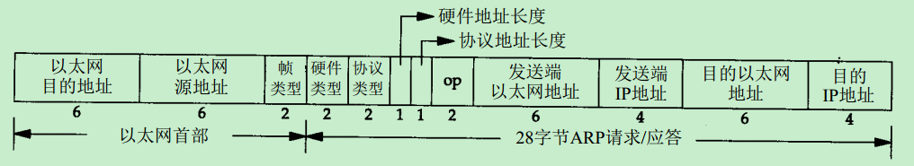

- 以太网目的地址：目的主机的硬件地址。目的地址全为1的特殊地址是广播地址。
- 以太网源地址：源主机的硬件地址。
- 帧类型：对于ARP协议，该字段为0x0806。对于RARP协议，该字段为0x8035。
- 硬件类型：表示硬件地址的类型。值为1时表示以太网地址。也就是说ARP协议不仅仅应用于以太网协议，还可以支持别的链路层协议。
- 协议类型：表示要映射的协议地址类型。值为0x0800时表示IP协议。
- 硬件地址长度：与硬件类型对应的硬件地址的长度，以字节为单位。如果是以太网，则是6字节（MAC长度）。
- 协议地址长度：与协议类型对应的协议地址长度，以字节为单位。如果是IP协议，则是4字节（IP地址长度）。
- 操作类型（op）：四中操作类型。ARP请求（1），ARP应答（2），RARP请求（3），RARP应答（4）。
- 发送端硬件地址：如果是以太网，则是源主机以太网地址，此处和以太网头中的源地址对应。
- 发送端协议地址：如果是IP协议，则表示源主机的IP地址。
- 目的端硬件地址：如果是以太网，则是目的以太网地址，和以太网头中的目的地址对应。
- 目的端协议地址：如果是IP协议，则表示源主机要请求硬件地址的IP地址。
- 对应ARP请求包来说，目的端的硬件地址字段无须填充，其他字段都需要填充。对于ARP回复包来说，所有字段都需要填充。

APR请求包是广播的，但是ARP应答帧是单播的。

以太网数据报最小长度是60字节（14字节的以太网头，不包含4字节的FCS），ARP数据包长度为42字节（14字节的以太网头和28字节的ARP数据），需要加入填充字符到以太网最小长度要求：60字节。

### ARP高速缓存

每个主机都有一个ARP高速缓存表，这样避免每次发包时都需要发送ARP请求来获取硬件地址。默认老化时间是20分钟。利用arp -a命令可以查看显示系统中高速缓存的内容。

Windows下“arp -d”命令可以清除arp高速缓存表。

有时候需要手动清除arp缓存，曾经就是因为arp缓存没有做清理，导致迷惑了很久。遇到的问题：

1) 制作了一个写路由器MAC地址的工具，每次写完MAC地址，重启路由器，会发现无法telnet登陆路由器。IP地址没变，但是MAC地址更改了，而ARP缓存表中IP地址映射的仍然是旧的MAC地址。

2) 类似的问题，有两个路由器具有相同的IP地址。先连接一个路由器，登陆成功后，再去连接另一台路由器，却发现登陆不了。

### ARP代理

如果ARP请求时从一个网络的主机发往另一个网络上的主机，那么连接这两个网络的路由器可以回答该请求，这个过程称作委托ARP或者ARP代理。这样可以欺骗发起ARP请求的发送端，使它误以为路由器就是目的主机。

## RARP：逆地址解析协议

将局域网中某个主机的物理地址转换为IP地址，比如局域网中有一台主机只知道物理地址而不知道IP地址，那么可以通过RARP协议发出征求自身IP地址的广播请求，然后由RARP服务器负责回答。RARP协议广泛应用于无盘工作站引导时获取IP地址。

RARP允许局域网的物理机器从网管服务器ARP表或者缓存上请求其IP地址。

### 帧格式

帧格式同ARP协议，帧类型字段和操作类型不同，具体见ARP帧格式描述。

### 工作原理

\1. 主机发送一个本地的RARP广播，在此广播包中，声明自己的MAC地址并且请求任何收到此请求的RARP服务器分配一个IP地址。

\2. 本地网段上的RARP服务器收到此请求后，检查其RARP列表，查找该MAC地址对应的IP地址。

\3. 如果存在，RARP服务器就给源主机发送一个响应数据包并将此IP地址提供给对方主机使用。

\4. 如果不存在，RARP服务器对此不做任何的响应。

\5. 源主机收到从RARP服务器的响应信息，就利用得到的IP地址进行通讯；如果一直没有收到RARP服务器的响应信息，表示初始化失败。

# HTTP请求报文和HTTP响应报文

**简介：**

HTTP报文是面向文本的，报文中的每一个字段都是一些ASCII码串，各个字段的长度是不确定的。HTTP有两类报文：请求报文和响应报文。

HTTP请求报文

一个HTTP请求报文由请求行（request line）、请求头部（header）、空行和请求数据4个部分组成，下面给出了请求报文的一般格式。

```sh
＜request-line＞
＜headers＞
＜blank line＞
[＜request-body＞
```

### 1.请求头

请求行由请求方法字段、URL字段和HTTP协议版本字段3个字段组成，它们用空格分隔。例如，GET /index.html HTTP/1.1。

HTTP协议的请求方法有GET、POST、HEAD、PUT、DELETE、OPTIONS、TRACE、CONNECT。

而常见的有如下几种：

**1).GET**

最常见的一种请求方式，当客户端要从服务器中读取文档时，当点击网页上的链接或者通过在浏览器的地址栏输入网址来浏览网页的，使用的都是GET方式。GET方法**要求服务器将URL定位的资源放在响应报文的数据部分，回送给客户端**。使用GET方法时，请求参数和对应的值附加在URL后面，利用一个问号（“?”）代表URL的结尾与请求参数的开始，**传递参数长度受限制**。例如，/index.jsp?id=100&op=bind,这样通过GET方式传递的数据直接表示在地址中，所以我们可以把请求结果以链接的形式发送给好友。以用google搜索domety为例，Request格式如下：

```sh
GET /search?hl=zh-CN&source=hp&q=domety&aq=f&oq= HTTP/1.1  
Accept: image/gif, image/x-xbitmap, image/jpeg, image/pjpeg, application/vnd.ms-excel, application/vnd.ms-powerpoint, 
application/msword, application/x-silverlight, application/x-shockwave-flash, */*  
Referer: <a href="http://www.google.cn/">http://www.google.cn/</a>  
Accept-Language: zh-cn  
Accept-Encoding: gzip, deflate  
User-Agent: Mozilla/4.0 (compatible; MSIE 6.0; Windows NT 5.1; SV1; .NET CLR 2.0.50727; TheWorld)  
Host: <a href="http://www.google.cn">www.google.cn</a>  
Connection: Keep-Alive  
Cookie: PREF=ID=80a06da87be9ae3c:U=f7167333e2c3b714:NW=1:TM=1261551909:LM=1261551917:S=ybYcq2wpfefs4V9g; 
NID=31=ojj8d-IygaEtSxLgaJmqSjVhCspkviJrB6omjamNrSm8lZhKy_yMfO2M4QMRKcH1g0iQv9u-2hfBW7bUFwVh7pGaRUb0RnHcJU37y-
FxlRugatx63JLv7CWMD6UB_O_r
```

可以看到，GET方式的请求一般不包含”请求内容”部分，请求数据以地址的形式表现在请求行。地址链接如下：

```html
<a href="http://www.google.cn/search?hl=zh-CN&source=hp&q=domety&aq=f&oq=">http://www.google.cn/search?hl=zh-CN&source=hp
&q=domety&aq=f&oq=</a> 
```

地址中”?”之后的部分就是通过GET发送的请求数据，我们可以在地址栏中清楚的看到，各个数据之间用”&”符号隔开。显然，这种方式**不适合传送私密数据**。另外，由于不同的浏览器对地址的字符限制也有所不同，一般最多只能识别1024个字符，所以如果**需要传送大量数据的时候，也不适合使用GET方式**。

**2).POST**

对于上面提到的不适合使用GET方式的情况，可以考虑使用POST方式，因为使用POST方法可以允许客户端给服务器提供信息较多。POST方法将请求参数封装在HTTP请求数据中，以名称/值的形式出现，可以传输大量数据，这样POST方式对传送的数据大小没有限制，而且也不会显示在URL中。还以上面的搜索domety为例，如果使用POST方式的话，格式如下：

```sh
POST /search HTTP/1.1  
Accept: image/gif, image/x-xbitmap, image/jpeg, image/pjpeg, application/vnd.ms-excel, application/vnd.ms-powerpoint, 
application/msword, application/x-silverlight, application/x-shockwave-flash, */*  
Referer: <a href="http://www.google.cn/">http://www.google.cn/</a>  
Accept-Language: zh-cn  
Accept-Encoding: gzip, deflate  
User-Agent: Mozilla/4.0 (compatible; MSIE 6.0; Windows NT 5.1; SV1; .NET CLR 2.0.50727; TheWorld)  
Host: <a href="http://www.google.cn">www.google.cn</a>  
Connection: Keep-Alive  
Cookie: PREF=ID=80a06da87be9ae3c:U=f7167333e2c3b714:NW=1:TM=1261551909:LM=1261551917:S=ybYcq2wpfefs4V9g; 
NID=31=ojj8d-IygaEtSxLgaJmqSjVhCspkviJrB6omjamNrSm8lZhKy_yMfO2M4QMRKcH1g0iQv9u-2hfBW7bUFwVh7pGaRUb0RnHcJU37y-
FxlRugatx63JLv7CWMD6UB_O_r  

hl=zh-CN&source=hp&q=domety
```

可以看到，POST方式请求行中不包含数据字符串，这些数据保存在”请求内容”部分，各数据之间也是使用”&”符号隔开。POST方式大多用于页面的表单中。因为POST也能完成GET的功能，因此多数人在设计表单的时候一律都使用POST方式，其实这是一个误区。GET方式也有自己的特点和优势，我们应该根据不同的情况来选择是使用GET还是使用POST。

**3).HEAD**

HEAD就像GET，只不过服务端接受到HEAD请求后只返回响应头，而不会发送响应内容。当我们只需要查看某个页面的状态的时候，使用HEAD是非常高效的，因为在传输的过程中省去了页面内容。

### 2.请求头部

请求头部由**关键字/值对组成，每行一对，关键字和值用英文冒号“:”分隔**。请求头部通知服务器有关于客户端请求的信息，典型的请求头有：

User-Agent：产生请求的浏览器类型。

Accept：客户端可识别的内容类型列表。

Host：请求的主机名，允许多个域名同处一个IP地址，即虚拟主机。

### 3.空行

最后一个请求头之后是一个空行，发送回车符和换行符，通知服务器以下不再有请求头。

### 4.请求数据

**请求数据不在GET方法中使用，而是在POST方法中使用**。POST方法适用于需要客户填写表单的场合。与请求数据相关的最常使用的请求头是Content-Type和Content-Length。

### HTTP报文

HTTP响应也由三个部分组成，分别是：**状态行、消息报头、响应正文**。

如下所示，HTTP响应的格式与请求的格式十分类似：

```sh
＜status-line＞
＜headers＞
＜blank line＞
[＜response-body＞]
```

正如你所见，在响应中唯一真正的区别在于第一行中用状态信息代替了请求信息。状态行（status line）通过提供一个状态码来说明所请求的资源情况。

状态行格式如下：

HTTP-Version Status-Code Reason-Phrase CRLF

其中，HTTP-Version表示服务器HTTP协议的版本；Status-Code表示服务器发回的响应状态代码；Reason-Phrase表示状态代码的文本描述。状态代码由三位数字组成，第一个数字定义了响应的类别，且有五种可能取值。

- 1xx：指示信息--表示请求已接收，继续处理。
- 2xx：成功--表示请求已被成功接收、理解、接受。
- 3xx：重定向--要完成请求必须进行更进一步的操作。
- 4xx：客户端错误--请求有语法错误或请求无法实现。
- 5xx：服务器端错误--服务器未能实现合法的请求。

常见状态代码、状态描述的说明如下。

- 200 OK：客户端请求成功。
- 400 Bad Request：客户端请求有语法错误，不能被服务器所理解。
- 401 Unauthorized：请求未经授权，这个状态代码必须和WWW-Authenticate报头域一起使用。
- 403 Forbidden：服务器收到请求，但是拒绝提供服务。
- 404 Not Found：请求资源不存在，举个例子：输入了错误的URL。
- 500 Internal Server Error：服务器发生不可预期的错误。
- 503 Server Unavailable：服务器当前不能处理客户端的请求，一段时间后可能恢复正常，举个例子：HTTP/1.1 200 OK（CRLF）。

下面给出一个HTTP响应报文例子

```sh
HTTP/1.1 200 OK
Date: Sat, 31 Dec 2005 23:59:59 GMT
Content-Type: text/html;charset=ISO-8859-1
Content-Length: 122

＜html＞
＜head＞
＜title＞Wrox Homepage＜/title＞
＜/head＞
＜body＞
＜!-- body goes here --＞
＜/body＞
＜/html＞
```

### 关于HTTP请求GET和POST的区别

#### 1.**GET提交，请求的数据会附在URL之后（就是把数据放置在HTTP协议头＜request-line＞中）**

以?分割URL和传输数据，多个参数用&连接;例如：login.action?name=hyddd&password=idontknow&verify=%E4%BD%A0 %E5%A5%BD。如果数据是英文字母/数字，原样发送，如果是空格，转换为+，如果是中文/其他字符，则直接把字符串用BASE64加密，得出如： %E4%BD%A0%E5%A5%BD，其中％XX中的XX为该符号以16进制表示的ASCII。

POST提交：**把提交的数据放置在是HTTP包的包体＜request-body＞中**。

上文示例中加粗字体标明的就是实际的传输数据

因此，**GET提交的数据会在地址栏中显示出来，而POST提交，地址栏不会改变**

2.传输数据的大小：

首先声明,**HTTP协议没有对传输的数据大小进行限制，HTTP协议规范也没有对URL长度进行限制**。 而在实际开发中存在的限制主要有：

- GET:**特定浏览器和服务器对URL长度有限制**，例如IE对URL长度的限制是2083字节(2K+35)。对于其他浏览器，如Netscape、FireFox等，理论上没有长度限制，其限制取决于操作系统的支持。

  因此对于GET提交时，传输数据就会受到URL长度的限制。

- POST:由于不是通过URL传值，理论上数据不受限。但实际各个WEB服务器会规定对post提交数据大小进行限制，Apache、IIS6都有各自的配置。

3.安全性：

POST的安全性要比GET的安全性高。注意：这里所说的安全性和上面GET提到的“安全”不是同个概念。上面“安全”的含义仅仅是不作数据修改，而这里安全的含义是真正的Security的含义，比如：通过GET提交数据，用户名和密码将明文出现在URL上，因为(1)登录页面有可能被浏览器缓存， (2)其他人查看浏览器的历史纪录，那么别人就可以拿到你的账号和密码了。

# HTTPS协议，SSL协议及完整交互过程


## SSL

\1.    安全套接字（Secure Socket Layer，SSL）协议是Web浏览器与Web服务器之间安全交换信息的协议。

\2.  SSL协议的三个特性

Ø 保密：在握手协议中定义了会话密钥后，所有的消息都被加密。

Ø 鉴别：可选的客户端认证，和强制的服务器端认证。

Ø 完整性：传送的消息包括消息完整性检查（使用MAC）。

\3.  SSL的位置


## HTTPS

\1.   HTTPS基于SSL的HTTP协议。

\2.   HTTPS使用与HTTP不同的端口(，一个加密、身份验证层（HTTP与TCP之间）)。

\3.   提供了身份验证与加密通信方法，被广泛用于互联网上安全敏感的通信。

## 交互过程

客户端在使用HTTPS方式与Web服务器通信时有以下几个步骤

1)  客户端请求建立SSL连接，并将自己支持的一套加密规则发送给网站。

2)  网站从中选出一组加密算法与HASH算法，并将自己的身份信息以证书的形式发回给浏览器。证书里面包含了网站地址，加密公钥，以及证书的颁发机构等信息

3)  获得网站证书之后浏览器要做以下工作：

Ø 验证证书的合法性

Ø 如果证书受信任，浏览器会生成一串随机数的密码，并用证书中提供的公钥加密。

Ø 使用约定好的HASH***\*计算握手消息\****，

Ø 使用生成的随机数**对消息进行加密**，最后将之前生成的所有信息发送给网站。

4)  网站接收浏览器发来的数据之后要做以下的操作：

Ø 使用自己的私钥将信息解密**取出密码**

Ø 使用密码**解密**浏览器发来的握手消息，并验证HASH是否与浏览器发来的一致。

Ø ***\*使用密码加密\****一段握手消息，发送给浏览器

5)  浏览器解密并计算握手消息的***\*HASH\****，如果与服务端发来的HASH一致，此时握手结束。

6)  使用**随机密码**和**对称加密算法**对传输的数据加密，传输。

\4.   密与HASH算法如下：

1)   非对称加密算法：RSA，DSA/DSS，用于在握手过程中加密生成的密码。

2)   对称加密算法：AES，RC4，3DES，用于对真正传输的数据进行加密。

3)   HASH算法：MD5，SHA1，SHA256，验证数据的完整性。

\5.   HTTP与HTTPS的区别：

1)   https协议需要申请证书。

2)   http是超文本传输协议，明文传输；https使用的是具有安全性的SSL加密传输协议。

3)   http端口80,；https端口443。

4)   http连接简单无状态；https由SSL+HTTP协议构件的可进行加密传输、身份验证的网络协议。

# 计算机网络体系结构

在计算机网络的基本概念中，分层次的体系结构是  基本的。计算机网络体系结

构的抽象概念较多，在学习时要多思考。这些概念对后面的学习很有帮助。

## 网络协议是什么？ 

在计算机网络要做到有条不紊地交换数据，就必须遵守一些事先约定好的规则， 比如交换数据的格式、是否需要发送一个应答信息。这些规则被称为网络协议。 

## 为什么要对网络协议分层？

-  简化问题难度和复杂度。由于各层之间独立，我们可以分割大问题为小问题。 
-  灵活性好。当其中一层的技术变化时，只要层间接口关系保持不变，其他层不受 影响。 
-  易于实现和维护。 
-  促进标准化工作。分开后，每层功能可以相对简单地被描述。 

网络协议分层的缺点： 功能可能出现在多个层里，产生了额外开销。 为了使不同体系结构的计算机网络都能互联，国际标准化组织 ISO 于1977年提 出了一个试图使各种计算机在世界范围内互联成网的标准框架，即著名的开放系统互联基本参考模型 OSI/RM，简称为OSI。 

OSI 的七层协议体系结构的概念清楚，理论也较完整，但它既复杂又不实用， TCP/IP 体系结构则不同，但它现在却得到了非常广泛的应用。TCP/IP 是一个四 层体系结构，它包含应用层，传输层，网络层和网络接口层（用网络层这个名字 是强调这一层是为了解决不同网络的互连问题），不过从实质上讲，TCP/IP 只 有上面的三层，因为下面的网络接口层并没有什么具体内容，因此在学习计 算机网络的原理时往往采用折中的办法，即综合 OSI 和 TCP/IP 的优点，采用 一种只有五层协议的体系结构，这样既简洁又能将概念阐述清楚，有时为了方 便，也可把底下两层称为网络接口层。 

- 四层协议，五层协议和七层协议的关系如下： 
- TCP/IP是一个四层的体系结构，主要包括：应用层、传输层、网络层和网络接口层。 
- 五层协议的体系结构主要包括：应用层、传输层、网络层，数据链路层和物理层。 
- OSI七层协议模型主要包括是：应用层（Application）、表示层 （Presentation）、会话层（Session）、运输层（Transport）、网络层 （Network）、数据链路层（Data Link）、物理层（Physical）。


注：五层协议的体系结构只是为了介绍网络原理而设计的，实际应用还是  TCP/IP 四层体系结构。 

# TCP/IP 四层体系结构。 TCP/IP 协议族

## 应用层 

应用层( application-layer ）的任务是通过应用进程间的交互来完成特定网络应 用。应用层协议定义的是应用进程（进程：主机中正在运行的程序）间的通信和 交互的规则。 

对于不同的网络应用需要不同的应用层协议。在互联网中应用层协议很多，如域 名系统 DNS，支持万维网应用的 HTTP 协议，支持电子邮件的 SMTP 协议等 等。 

## 传输层 

传输层(transport layer)的主要任务就是负责向两台主机进程之间的通信提供通 用的数据传输服务。应用进程利用该服务传送应用层报文。 运输层主要使用一下两种协议 

1. 传输控制协议-TCP：提供面向连接的，可靠的数据传输服务。 
2. 用户数据协议-UDP：提供无连接的，尽大努力的数据传输服务（不 保证数据传输的可靠性）。

|               | UDP                                             | TCP                                        |
| ------------- | ----------------------------------------------- | ------------------------------------------ |
| 是否连接      | 无连接                                          | 面向连接                                   |
| 是否可靠      | 不可靠传 输，不使 用流量控 制和拥塞 控制        | 可靠传 输，使用 流量控制 和拥塞控 制       |
| 连接对象 个数 | 支持一对 一，一对 多，多对 一和多对 多交互通 信 | 只能是一 对一通信                          |
| 传输方式      | 面向报文                                        | 面向字节 流                                |
| 首部开销      | 首部开销 小，仅8字 节                           | 首部小 20字节， 大60字 节                  |
| 场景          | 适用于实 时应用 （IP电 话、视频会议、直 播等）  | 适用于要 求可靠传 输的应 用，例如 文件传输 |

每一个应用层（TCP/IP参考模型的最高层）协议一般都会使用到两个传输层协 议之一： 

运行在TCP协议上的协议： 

- **HTTP（Hypertext Transfer Protocol，超文本传输协议）**，主要用于普通浏 览。 
- **HTTPS（HTTP over SSL，安全超文本传输协议）**,HTTP协议的安全版本。 
- **FTP（File Transfer Protocol，文件传输协议）**，用于文件传输。 
- **POP3（Post Office Protocol, version 3，邮局协议）**，收邮件用。 
- **SMTP（Simple Mail Transfer Protocol，简单邮件传输协议）**，用来发送电子 邮件。 
- **TELNET（Teletype over the Network，网络电传）**，通过一个终端 （terminal）登陆到网络。 
- **SSH（Secure Shell，用于替代安全性差的TELNET）**，用于加密安全登陆用。 运行在UDP协议上的协议： 
- **BOOTP（Boot Protocol，启动协议）**，应用于无盘设备。 
- **NTP（Network Time Protocol，网络时间协议）**，用于网络同步。 
- **DHCP（Dynamic Host Configuration Protocol，动态主机配置协议）**，动态 配置IP地址。 运行在TCP和UDP协议上： 
- **DNS（Domain Name Service，域名服务）**，用于完成地址查找，邮件转发等 工作。 

## 网络层 

网络层的任务就是选择合适的网间路由和交换结点，确保计算机通信的数据及时 传送。在发送数据时，网络层把运输层产生的报文段或用户数据报封装成分组和 包进行传送。在 TCP/IP 体系结构中，由于网络层使用 IP 协议，因此分组也叫  IP 数据报 ，简称数据报。 

互联网是由大量的异构（heterogeneous）网络通过路由器（router）相互连 接起来的。互联网使用的网络层协议是无连接的网际协议（Intert Prococol） 和许多路由选择协议，因此互联网的网络层也叫做网际层或 IP 层。 

## 数据链路层

数据链路层(data link layer)通常简称为链路层。两台主机之间的数据传输，总是在一段一段的链路上传送的，这就需要使用专门的链路层的协议。 

在两个相邻节点之间传送数据时，数据链路层将网络层交下来的 IP 数据报组装 成帧，在两个相邻节点间的链路上传送帧。每一帧包括数据和必要的控制信息 （如同步信息，地址信息，差错控制等）。 

在接收数据时，控制信息使接收端能够知道一个帧从哪个比特开始和到哪个比特 结束。 

一般的web应用的通信传输流是这样的：


发送端在层与层之间传输数据时，每经过一层时会被打上一个该层所属的首部信 息。反之，接收端在层与层之间传输数据时，每经过一层时会把对应的首部信息 去除。 

## 物理层 

在物理层上所传送的数据单位是比特。 物理层(physical layer)的作用是实现相 邻计算机节点之间比特流的透明传送，尽可能屏蔽掉具体传输介质和物理设备的 差异。使其上面的数据链路层不必考虑网络的具体传输介质是什么。“透明传送 比特流”表示经实际电路传送后的比特流没有发生变化，对传送的比特流来说， 这个电路好像是看不见的。

## TCP/IP 协议族 

在互联网使用的各种协议中重要和著名的就是 TCP/IP 两个协议。现在人们 经常提到的 TCP/IP 并不一定是单指 TCP 和 IP 这两个具体的协议，而往往是表 示互联网所使用的整个 TCP/IP 协议族。


> 互联网协议套件（英语：Internet Protocol Suite，缩写**IPS**）是一个网络通讯模型， 以及一整个网络传输协议家族，为网际网络的基础通讯架构。它常被通称为TCP/IP协 议族（英语：**TCP/IP Protocol Suite**，或**TCP/IP Protocols**），简称**TCP/IP**。因为该 协定家族的两个核心协定：**TCP（传输控制协议）和IP（网际协议）**，为该家族中早 通过的标准。 

划重点： 

**TCP（传输控制协议）和IP（网际协议）** 是先定义的两个核心协议，所以才统称为**TCP/IP协议族**

## TCP的三次握手四次挥手 

TCP是一种面向连接的、可靠的、基于字节流的传输层通信协议，在发送数据 前，通信双方必须在彼此间建立一条连接。所谓的“连接”，其实是客户端和服 务端保存的一份关于对方的信息，如ip地址、端口号等。

TCP可以看成是一种字节流，它会处理IP层或以下的层的丢包、重复以及错误问 题。在连接的建立过程中，双方需要交换一些连接的参数。这些参数可以放在 TCP头部。 

一个TCP连接由一个4元组构成，分别是两个IP地址和两个端口号。一个TCP连 接通常分为三个阶段：连接、数据传输、退出（关闭）。**通过三次握手建立一个 链接，通过四次挥手来关闭一个连接。** 

**当一个连接被建立或被终止时，交换的报文段只包含TCP头部，而没有数据。 **

## TCP报文的头部结构 

在了解TCP连接之前先来了解一下TCP报文的头部结构。


上图中有几个字段需要重点介绍下： 

（1）序号：seq序号，占32位，用来标识从TCP源端向目的端发送的字节流， 发起方发送数据时对此进行标记。 

（2）确认序号：ack序号，占32位，只有ACK标志位为1时，确认序号字段才有效，ack=seq+1。 

（3）标志位：共6个，即URG、ACK、PSH、RST、SYN、FIN等，具体含义如 下： 

- ACK：确认序号有效。 
- FIN：释放一个连接。 
- PSH：接收方应该尽快将这个报文交给应用层。 
- RST：重置连接。 
- SYN：发起一个新连接。 
- URG：紧急指针（urgent pointer）有效。 

需要注意的是： 

- 不要将确认序号ack与标志位中的ACK搞混了。
- 确认方ack=发起方seq+1，两端配对。 

## 三次握手

三次握手的本质是确认通信双方收发数据的能力首先，我让信使运输一份信件给对方，对方收到了，那么他就知道了我的发件能力和他的收件能力是可以的。

于是他给我回信，我若收到了，我便知我的发件能力和他的收件能力是可以的，并且他的发件能力和我的收件能力是可以。

然而此时他还不知道他的发件能力和我的收件能力到底可不可以，于是我 后回馈一次，他若收到了，他便清楚了他的发件能力和我的收件能力是可以的。这，就是三次握手，这样说，你理解了吗？


- 第一次握手：客户端要向服务端发起连接请求，首先客户端随机生成一个起始序列号ISN(比如是100)，那客户端向服务端发送的报文段包含SYN标志位(也就是SYN=1)，序列号seq=100。
- 第二次握手：服务端收到客户端发过来的报文后，发现SYN=1，知道这是一个连接请求，于是将客户端的起始序列号100存起来，并且随机生成一个服务端的起始序列号(比如是300)。然后给客户端回复一段报文，回复报文包含SYN和ACK标志(也就是SYN=1,ACK=1)、序列号seq=300、确认号ack=101(客户端发过来的序列号+1)。
- 第三次握手：客户端收到服务端的回复后发现ACK=1并且ack=101,于是知道服务端已经收到了序列号为100的那段报文；同时发现SYN=1，知道了服务端同意了这次连接，于是就将服务端的序列号300给存下来。然后客户端再回复一段报文给服务端，报文包含ACK标志位(ACK=1)、ack=301(服务端序列号+1)、seq=101(第一次握手时发送报文是占据一个序列号的，所以这次seq就从101开始，需要注意的是不携带数据的ACK报文是不占据序列号的，所以后面第一次正式发送数据时seq还是101)。当服务端收到报文后发现ACK=1并且ack=301，就知道客户端收到序列号为300的报文了，就这样客户端和服务端通过TCP建立了连接。

## 四次挥手

四次挥手的目的是关闭一个连接


比如客户端初始化的序列号ISA=100，服务端初始化的序列号ISA=300。TCP连接成功后客户端总共发送了1000个字节的数据，服务端在客户端发FIN报文前总共回复了2000个字节的数据。

- 第一次挥手：当客户端的数据都传输完成后，客户端向服务端发出连接释放报文(当然数据没发完时也可以发送连接释放报文并停止发送数据)，释放连接报文包含FIN标志位(FIN=1)、序列号seq=1101(100+1+1000，其中的1是建立连接时占的一个序列号)。需要注意的是客户端发出FIN报文段后只是不能发数据了，但是还可以正常收数据；另外FIN报文段即使不携带数据也要占据一个序列号。
- 第二次挥手：服务端收到客户端发的FIN报文后给客户端回复确认报文，确认报文包含ACK标志位(ACK=1)、确认号ack=1102(客户端FIN报文序列号1101+1)、序列号seq=2300(300+2000)。此时服务端处于关闭等待状态，而不是立马给客户端发FIN报文，这个状态还要持续一段时间，因为服务端可能还有数据没发完。
- 第三次挥手：服务端将最后数据(比如50个字节)发送完毕后就向客户端发出连接释放报文，报文包含FIN和ACK标志位(FIN=1,ACK=1)、确认号和第二次挥手一样ack=1102、序列号seq=2350(2300+50)。
- 第四次挥手：客户端收到服务端发的FIN报文后，向服务端发出确认报文，确认报文包含ACK标志位(ACK=1)、确认号ack=2351、序列号seq=1102。注意客户端发出确认报文后不是立马释放TCP连接，而是要经过2MSL(最长报文段寿命的2倍时长)后才释放TCP连接。而服务端一旦收到客户端发出的确认报文就会立马释放TCP连接，所以服务端结束TCP连接的时间要比客户端早一些。

# 常见面试题

## 为什么TCP连接的时候是3次？2次不可以吗？

因为需要考虑连接时丢包的问题，如果只握手2次，第二次握手时如果服务端发给客户端的确认报文段丢失，此时服务端已经准备好了收发数(可以理解服务端已经连接成功)据，而客户端一直没收到服务端的确认报文，所以客户端就不知道服务端是否已经准备好了(可以理解为客户端未连接成功)，这种情况下客户端不会给服务端发数据，也会忽略服务端发过来的数据。

如果是三次握手，即便发生丢包也不会有问题，比如如果第三次握手客户端发的确认ack报文丢失，服务端在一段时间内没有收到确认ack报文的话就会重新进

行第二次握手，也就是服务端会重发SYN报文段，客户端收到重发的报文段后会再次给服务端发送确认ack报文。

## 为什么TCP连接的时候是3次，关闭的时候却是4次？

因为只有在客户端和服务端都没有数据要发送的时候才能断开TCP。而客户端发出FIN报文时只能保证客户端没有数据发了，服务端还有没有数据发客户端是不知道的。而服务端收到客户端的FIN报文后只能先回复客户端一个确认报文来告诉客户端我服务端已经收到你的FIN报文了，但我服务端还有一些数据没发完，等这些数据发完了服务端才能给客户端发FIN报文(所以不能一次性将确认报文和FIN报文发给客户端，就是这里多出来了一次)。

## 为什么客户端发出第四次挥手的确认报文后要等2MSL的时间才能释放TCP连接？

这里同样是要考虑丢包的问题，如果第四次挥手的报文丢失，服务端没收到确认 ack报文就会重发第三次挥手的报文，这样报文一去一回  长时间就是2MSL，所以需要等这么长时间来确认服务端确实已经收到了。

## 如果已经建立了连接，但是客户端突然出现故障了怎么办？

TCP设有一个保活计时器，客户端如果出现故障，服务器不能一直等下去，白白浪费资源。服务器每收到一次客户端的请求后都会重新复位这个计时器，时间通常是设置为2小时，若两小时还没有收到客户端的任何数据，服务器就会发送一个探测报文段，以后每隔75秒钟发送一次。若一连发送10个探测报文仍然没反应，服务器就认为客户端出了故障，接着就关闭连接。

## 什么是HTTP，HTTP 与 HTTPS 的区别

HTTP 是一个在计算机世界里专门在两点之间传输文字、图片、音频、视频等超文本数据的约定和规范

| 区别     | HTTP                                                         | HTTPS                                                        |
| -------- | ------------------------------------------------------------ | ------------------------------------------------------------ |
| 协议     | 运行在   TCP 之上，明文传输，客户端与服务器端都无法验证对方的身份 | 身披 SSL(   Secure   Socket   Layer  )外壳的   HTTP，运行于 SSL 上，SSL 运行于   TCP 之  上，  是添加了加密和认证机制的   HTTP。 |
| 端口     | 80                                                           | 443                                                          |
| 资源消耗 | 较少                                                         | 由于加解密处理，会消耗更  多的 CPU 和内存资源                |
| 开销     | 无需证书                                                     | 需要证书，而证书一般需要向认证机构购买                       |
| 加密机制 | 无                                                           | 共享密钥加密和公开密钥加密并用的混合加密机制                 |
| 安全性   | 弱                                                           | 由于加密机制，安全性强                                       |

## 常用HTTP状态码

HTTP状态码表示客户端HTTP请求的返回结果、标识服务器处理是否正常、表明请求出现的错误等。

状态码的类别：

| 类别 | 原因短语                                              |
| ---- | ----------------------------------------------------- |
| 1XX  | Informational（信息性状态码）接受的请求正在处理       |
| 2XX  | Success（成功状态码）请求正常处理完毕                 |
| 3XX  | Redirection（重定向状态码）需要进行附加操作以完成请求 |
| 4XX  | Client   Error（客户端错误状态码）服务器无法处理请求  |
| 5XX  | Server   Error（服务器错误状态码）服务器处理请求出错  |

常用HTTP状态码：

| 2XX  | 成功（这系列表明请求被正常处理了）                           |
| ---- | ------------------------------------------------------------ |
| 200  | OK，表示从客户端发来的请求在服务器端被正确处理               |
| 204  | No   content，表示请求成功，但响应报文不含实体的主体部分     |
| 206  | Partial   Content  ，进行范围请求成功                        |
| 3XX  | 重定向  （表明浏览器要执行特殊处理）                         |
| 301  | moved permanently，永久  性重定向，表示资源已被分配了新的 URL |
| 302  | found，临时性重定向，表示资源临时被分配了新的   URL          |
| 303  | see   other，表示资源存在着另一个 URL，  应使用   GET 方法获取资源  （对于  301/302/  303响应，几乎所有浏览器都会删除报文主体并  自动用  GET重新请求） |
| 304  | not   modified ，表示服务器允许访问资源，但请求未满足条件的情况（与重定向无关） |
| 307  | temporary   redirect，临时重定  向，和302 含义类似，但是期望客户端保持请求方法不变向新的地址发出请求 |
| 4XX  | 客户端错误                                                   |
| 400  | bad   request，请求报文存在语法错误                          |
| 401  | unauthorized，表示发送的请求需要有通过   HTTP 认证的认证信息 |
| 403  | forbidden  ，表示对请求资源的访问被服务器拒绝，可在实体主体部分返回原因描述 |
| 404  | not   found，表示在服务器上没有找到请求的资源                |
| 5XX  | 服务器错误                                                   |
| 500  | internal   sever   error，表 示服务器端在执行请求时发生了错误 |
| 501  | Not   Implemented，表示服务器不支持当前请求所需要的某个功能  |
| 503  | service unavailable，表明服务器暂时处于超负载或正在停机维护，无法处理请求 |

## GET和POST区别

说道GET和POST，就不得不提HTTP协议，因为浏览器和服务器的交互是通过

HTTP协议执行的，而GET和POST也是HTTP协议中的两种方法。

HTTP全称为Hyper Text Transfer Protocol，中文翻译为超文本传输协议，目的是保证浏览器与服务器之间的通信。HTTP的工作方式是客户端与服务器之间的请求-应答协议。

HTTP协议中定义了浏览器和服务器进行交互的不同方法，基本方法有4种，分别是GET，POST，PUT，DELETE。这四种方法可以理解为，对服务器资源的查，改，增，删。

- GET：从服务器上获取数据，也就是所谓的查，仅仅是获取服务器资源，不进行修改。
- POST：向服务器提交数据，这就涉及到了数据的更新，也就是更改服务器的数据。
- PUT：英文含义是放置，也就是向服务器新添加数据，就是所谓的增。
- DELETE：从字面意思也能看出，这种方式就是删除服务器数据的过程。

GET和POST区别

\1. Get是不安全的，因为在传输过程，数据被放在请求的URL中；Post的所有操作对用户来说都是不可见的。 但是这种做法也不时绝对的，大部分人的做法也是按照上面的说法来的，但是也可以在get请求加上 request body，给 post请求带上 URL 参数。

\2. Get请求提交的url中的数据 多只能是2048字节，这个限制是浏览器或者服务器给添加的，http协议并没有对url长度进行限制，目的是为了保证服务器和浏览器能够正常运行，防止有人恶意发送请求。Post请求则没有大小限制。

\3. Get限制Form表单的数据集的值必须为ASCII字符；而Post支持整个ISO10646字符集。

\4. Get执行效率却比Post方法好。Get是form提交的默认方法。

\5. GET产生一个TCP数据包；POST产生两个TCP数据包。对于GET方式的请求，浏览器会把http header和data一并发送出去，服务器响应200（返回数据）；而对于POST，浏览器先发送header，服务器响应100 continue，浏览器再发送data，服务器响应200 ok（返回数据）。

## 什么是对称加密与非对称加密

对称密钥加密是指加密和解密使用同一个密钥的方式，这种方式存在的最大问题就是密钥发送问题，即如何安全地将密钥发给对方；

而非对称加密是指使用一对非对称密钥，即公钥和私钥，公钥可以随意发布，但私钥只有自己知道。发送密文的一方使用对方的公钥进行加密处理，对方接收到加密信息后，使用自己的私钥进行解密。

由于非对称加密的方式不需要发送用来解密的私钥，所以可以保证安全性；但是和对称加密比起来，非常的慢

## 什么是HTTP2

HTTP2 可以提高了网页的性能。

在 HTTP1 中浏览器限制了同一个域名下的请求数量（Chrome 下一般是六个），当在请求很多资源的时候，由于队头阻塞当浏览器达到  大请求数量时，剩余的资源需等待当前的六个请求完成后才能发起请求。

HTTP2 中引入了多路复用的技术，这个技术可以只通过一个 TCP 连接就可以传输所有的请求数据。多路复用可以绕过浏览器限制同一个域名下的请求数量的问题，进而提高了网页的性能。

## Session、Cookie和Token的主要区别

HTTP协议本身是无状态的。什么是无状态呢，即服务器无法判断用户身份。

### 什么是cookie

cookie是由Web服务器保存在用户浏览器上的小文件（key-value格式），包含用户相关的信息。客户端向服务器发起请求，如果服务器需要记录该用户状态，就使用response向客户端浏览器颁发一个Cookie。客户端浏览器会把Cookie保存起来。当浏览器再请求该网站时，浏览器把请求的网址连同该Cookie一同提交给服务器。服务器检查该Cookie，以此来辨认用户身份。

### 什么是session

session是依赖Cookie实现的。session是服务器端对象

session 是浏览器和服务器会话过程中，服务器分配的一块储存空间。服务器默认为浏览器在cookie中设置 sessionid，浏览器在向服务器请求过程中传输 cookie 包含 sessionid ，服务器根据 sessionid 获取出会话中存储的信息，然后确定会话的身份信息。

### cookie与session区别

* 存储位置与安全性：cookie数据存放在客户端上，安全性较差，session数据放在服务器上，安全性相对更高；

* 存储空间：单个cookie保存的数据不能超过4K，很多浏览器都限制一个站点多保存20个cookie，session无此限制

* 占用服务器资源：session一定时间内保存在服务器上，当访问增多，占用服务器性能，考虑到服务器性能方面，应当使用cookie。

### 什么是Token

Token的引入：Token是在客户端频繁向服务端请求数据，服务端频繁的去数据库查询用户名和密码并进行对比，判断用户名和密码正确与否，并作出相应提示，在这样的背景下，Token便应运而生。

Token的定义：Token是服务端生成的一串字符串，以作客户端进行请求的一个令牌，当第一次登录后，服务器生成一个Token便将此Token返回给客户端，以后客户端只需带上这个Token前来请求数据即可，无需再次带上用户名和密码。使用Token的目的：Token的目的是为了减轻服务器的压力，减少频繁的查询数据库，使服务器更加健壮。

Token 是在服务端产生的。如果前端使用用户名/密码向服务端请求认证，服务端认证成功，那么在服务端会返回 Token 给前端。前端可以在每次请求的时候带上 Token 证明自己的合法地位 session与token区别

- session机制存在服务器压力增大，CSRF跨站伪造请求攻击，扩展性不强等问题；
- session存储在服务器端，token存储在客户端
- token提供认证和授权功能，作为身份认证，token安全性比session好；
- session这种会话存储方式方式只适用于客户端代码和服务端代码运行在同一台服务器上，token适用于项目级的前后端分离（前后端代码运行在不同的服务器下）

## Servlet是线程安全的吗

Servlet不是线程安全的，多线程并发的读写会导致数据不同步的问题。解决的办法是尽量不要定义name属性，而是要把name变量分别定义在doGet() 和doPost()方法内。虽然使用synchronized(name){}语句块可以解决问题，但是会造成线程的等待，不是很科学的办法。

注意：多线程的并发的读写Servlet类属性会导致数据不同步。但是如果只是并发地读取属性而不写入，则不存在数据不同步的问题。因此Servlet里的只读属性最好定义为final类型的。

## Servlet接口中有哪些方法及Servlet生命周期探秘

在Java Web程序中，Servlet主要负责接收用户请求HttpServletRequest，在 doGet()，doPost()中做相应的处理，并将回应HttpServletResponse反馈给用户。Servlet可以设置初始化参数，供Servlet内部使用。

Servlet接口定义了5个方法，其中前三个方法与Servlet生命周期相关：

- void init(ServletConfig config) throws ServletException 
- void service(ServletRequest req, ServletResponse resp) throws ServletException, java.io.IOException
- void destory() 
- java.lang.String getServletInfo() 
- ServletConfig getServletConfig()

生命周期：

Web容器加载Servlet并将其实例化后，Servlet生命周期开始，容器运行其 init()方法进行Servlet的初始化；

请求到达时调用Servlet的service()方法，service()方法会根据需要调用与请求

对应的doGet或doPost等方法；

当服务器关闭或项目被卸载时服务器会将Servlet实例销毁，此时会调用Servlet 的destroy()方法。

init方法和destory方法只会执行一次，service方法客户端每次请求Servlet都会执行。Servlet中有时会用到一些需要初始化与销毁的资源，因此可以把初始化资源的代码放入init方法中，销毁资源的代码放入destroy方法中，这样就不需要每次处理客户端的请求都要初始化与销毁资源。

## 如果客户端禁止 cookie 能实现 session 还能用吗？

Cookie 与 Session，一般认为是两个独立的东西，Session采用的是在服务器端保持状态的方案，而Cookie采用的是在客户端保持状态的方案。

但为什么禁用Cookie就不能得到Session呢？因为Session是用Session ID来确定当前对话所对应的服务器Session，而Session ID是通过Cookie来传递的，禁用Cookie相当于失去了Session ID，也就得不到Session了。

假定用户关闭Cookie的情况下使用Session，其实现途径有以下几种：

1. 手动通过URL传值、隐藏表单传递Session ID。

2. 用文件、数据库等形式保存Session ID，在跨页过程中手动调用。

# Java IO流的框架体系

### 一、IO流的概念

Java的IO流是实现输入/输出的基础，它可以方便地实现数据的输入/输出操作，在Java中把不同的输入/输出源抽象表述为"流"。流是一组有顺序的，有起点和终点的字节集合，是对数据传输的总称或抽象。即数据在两设备间的传输称为流，流的本质是数据传输，根据数据传输特性将流抽象为各种类，方便更直观的进行数据操作。
 **流有输入和输出，输入时是流从数据源流向程序。输出时是流从程序传向数据源，而数据源可以是内存，文件，网络或程序等。**

### 二、IO流的分类

#### 1.输入流和输出流

根据数据流向不同分为：输入流和输出流。

> 输入流:只能从中读取数据，而不能向其写入数据。
> 输出流：只能向其写入数据，而不能从中读取数据。

如下如所示：对程序而言，向右的箭头，表示输入，向左的箭头，表示输出。


#### 2.字节流和字符流

字节流和字符流和用法几乎完全一样，区别在于字节流和字符流所操作的数据单元不同。
 字符流的由来： 因为数据编码的不同，而有了对字符进行高效操作的流对象。本质其实就是基于字节流读取时，去查了指定的码表。字节流和字符流的区别：
 （1）读写单位不同：字节流以字节（8bit）为单位，字符流以字符为单位，根据码表映射字符，一次可能读多个字节。
 （2）处理对象不同：字节流能处理所有类型的数据（如图片、avi等），而字符流只能处理字符类型的数据。

只要是处理纯文本数据，就优先考虑使用字符流。 除此之外都使用字节流。

#### 3.节点流和处理流

按照流的角色来分，可以分为节点流和处理流。
 可以从/向一个特定的IO设备（如磁盘、网络）读/写数据的流，称为节点流，节点流也被成为低级流。
 处理流是对一个已存在的流进行连接或封装，通过封装后的流来实现数据读/写功能，处理流也被称为高级流。

```java
//节点流，直接传入的参数是IO设备
FileInputStream fis = new FileInputStream("test.txt");
//处理流，直接传入的参数是流对象
BufferedInputStream bis = new BufferedInputStream(fis);
```


当使用处理流进行输入/输出时，程序并不会直接连接到实际的数据源，没有和实际的输入/输出节点连接。使用处理流的一个明显好处是，只要使用相同的处理流，程序就可以采用完全相同的输入/输出代码来访问不同的数据源，随着处理流所包装节点流的变化，程序实际所访问的数据源也相应地发生变化。
 实际上，Java使用处理流来包装节点流是一种典型的装饰器设计模式，通过使用处理流来包装不同的节点流，既可以消除不同节点流的实现差异，也可以提供更方便的方法来完成输入/输出功能。

### 三、IO流的四大基类

根据流的流向以及操作的数据单元不同，将流分为了四种类型，每种类型对应一种抽象基类。这四种抽象基类分别为：InputStream,Reader,OutputStream以及Writer。四种基类下，对应不同的实现类，具有不同的特性。在这些实现类中，又可以分为节点流和处理流。下面就是整个由着四大基类支撑下，整个IO流的框架图。


InputStream,Reader,OutputStream以及Writer，这四大抽象基类，本身并不能创建实例来执行输入/输出，但它们将成为所有输入/输出流的模版，所以它们的方法是所有输入/输出流都可以使用的方法。类似于集合中的Collection接口。

#### 1.InputStream

InputStream 是所有的输入字节流的父类，它是一个抽象类，主要包含三个方法：


```go
//读取一个字节并以整数的形式返回(0~255),如果返回-1已到输入流的末尾。 
int read() ； 
//读取一系列字节并存储到一个数组buffer，返回实际读取的字节数，如果读取前已到输入流的末尾返回-1。 
int read(byte[] buffer) ； 
//读取length个字节并存储到一个字节数组buffer，从off位置开始存,最多len， 返回实际读取的字节数，如果读取前以到输入流的末尾返回-1。 
int read(byte[] buffer, int off, int len) ； 
```

#### 2.Reader

Reader 是所有的输入字符流的父类，它是一个抽象类，主要包含三个方法：


```csharp
//读取一个字符并以整数的形式返回(0~255),如果返回-1已到输入流的末尾。 
int read() ； 
//读取一系列字符并存储到一个数组buffer，返回实际读取的字符数，如果读取前已到输入流的末尾返回-1。 
int read(char[] cbuf) ； 
//读取length个字符,并存储到一个数组buffer，从off位置开始存,最多读取len，返回实际读取的字符数，如果读取前以到输入流的末尾返回-1。 
int read(char[] cbuf, int off, int len) 
```

对比InputStream和Reader所提供的方法，就不难发现两个基类的功能基本一样的，只不过读取的数据单元不同。

**在执行完流操作后，要调用`close()`方法来关系输入流，因为程序里打开的IO资源不属于内存资源，垃圾回收机制无法回收该资源，所以应该显式关闭文件IO资源。**

除此之外，InputStream和Reader还支持如下方法来移动流中的指针位置：


```java
//在此输入流中标记当前的位置
//readlimit - 在标记位置失效前可以读取字节的最大限制。
void mark(int readlimit)
// 测试此输入流是否支持 mark 方法
boolean markSupported()
// 跳过和丢弃此输入流中数据的 n 个字节/字符
long skip(long n)
//将此流重新定位到最后一次对此输入流调用 mark 方法时的位置
void reset()
```

#### 3.OutputStream

OutputStream 是所有的输出字节流的父类，它是一个抽象类，主要包含如下四个方法：


```csharp
//向输出流中写入一个字节数据,该字节数据为参数b的低8位。 
void write(int b) ; 
//将一个字节类型的数组中的数据写入输出流。 
void write(byte[] b); 
//将一个字节类型的数组中的从指定位置（off）开始的,len个字节写入到输出流。 
void write(byte[] b, int off, int len); 
//将输出流中缓冲的数据全部写出到目的地。 
void flush();
```

#### 4.Writer

Writer 是所有的输出字符流的父类，它是一个抽象类,主要包含如下六个方法：


```cpp
//向输出流中写入一个字符数据,该字节数据为参数b的低16位。 
void write(int c); 
//将一个字符类型的数组中的数据写入输出流， 
void write(char[] cbuf) 
//将一个字符类型的数组中的从指定位置（offset）开始的,length个字符写入到输出流。 
void write(char[] cbuf, int offset, int length); 
//将一个字符串中的字符写入到输出流。 
void write(String string); 
//将一个字符串从offset开始的length个字符写入到输出流。 
void write(String string, int offset, int length); 
//将输出流中缓冲的数据全部写出到目的地。 
void flush() 
```

可以看出，Writer比OutputStream多出两个方法，主要是支持写入字符和字符串类型的数据。

**使用Java的IO流执行输出时，不要忘记关闭输出流，关闭输出流除了可以保证流的物理资源被回收之外，还能将输出流缓冲区的数据flush到物理节点里（因为在执行close()方法之前，自动执行输出流的flush()方法）**

以上内容就是整个IO流的框架介绍。

# NIO技术概览                                    

NIO（Non-blocking I/O，在Java领域，也称为New I/O），是一种同步非阻塞的I/O模型，也是I/O多路复用的基础，已经被越来越多地应用到大型应用服务器，成为解决高并发与大量连接、I/O处理问题的有效方式。

## IO模型的分类

按照《Unix网络编程》的划分，I/O模型可以分为：阻塞I/O模型、非阻塞I/O模型、I/O复用模型、信号驱动式I/O模型和异步I/O模型，按照POSIX标准来划分只分为两类：同步I/O和异步I/O。

如何区分呢？首先一个I/O操作其实分成了两个步骤：**发起IO请求和实际的IO操作**。同步I/O和异步I/O的区别就在于第二个步骤是否阻塞，如果实际的I/O读写阻塞请求进程，那么就是同步I/O，因此阻塞I/O、非阻塞I/O、I/O复用、信号驱动I/O都是同步I/O，如果不阻塞，而是操作系统帮你做完I/O操作再将结果返回给你，那么就是异步I/O。

阻塞I/O和非阻塞I/O的区别在于第一步，发起I/O请求是否会被阻塞，如果阻塞直到完成那么就是传统的阻塞I/O，如果不阻塞，那么就是非阻塞I/O。

- 阻塞I/O模型 ：在linux中，默认情况下所有的socket都是blocking，一个典型的读操作流程大概是这样：

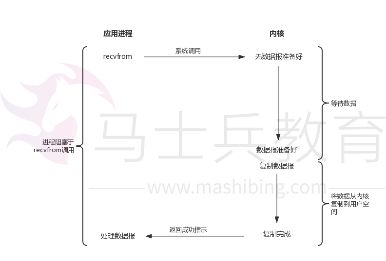

- 非阻塞I/O模型：linux下，可以通过设置socket使其变为non-blocking。当对一个non-blocking socket执行读操作时，流程是这个样子：

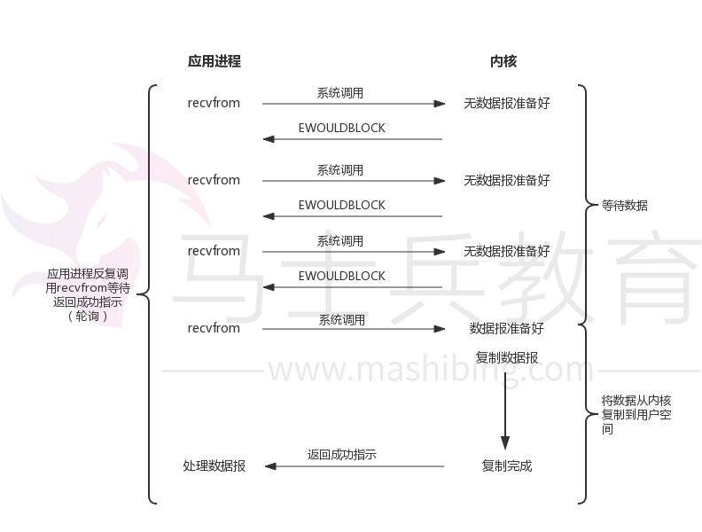

- I/O复用模型：我们可以调用`select`或`poll`，阻塞在这两个系统调用中的某一个之上，而不是真正的IO系统调用上：

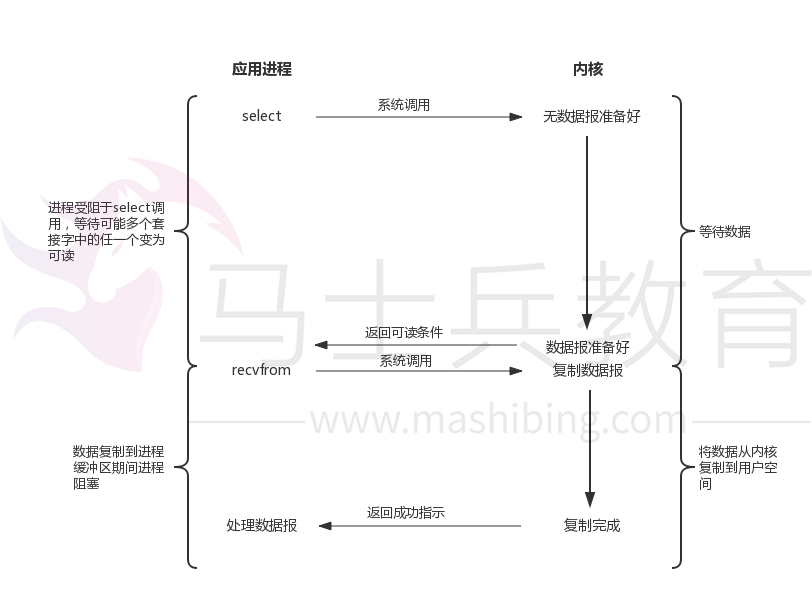

- 信号驱动式I/O模型(signal-driven I/O)：我们可以用信号，让内核在描述符就绪时发送SIGIO信号通知我们：

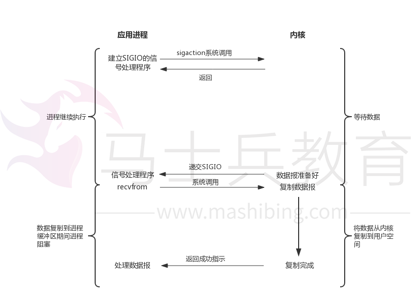

- 异步I/O模型：用户进程发起read操作之后，立刻就可以开始去做其它的事。而另一方面，从内核的角度，当它受到一个asynchronousread之后，首先它会立刻返回，所以不会对用户进程产生任何block。然后，内核会等待数据准备完成，然后将数据拷贝到用户内存，当这一切都完成之后，内核会给用户进程发送一个signal，告诉它read操作完成了：

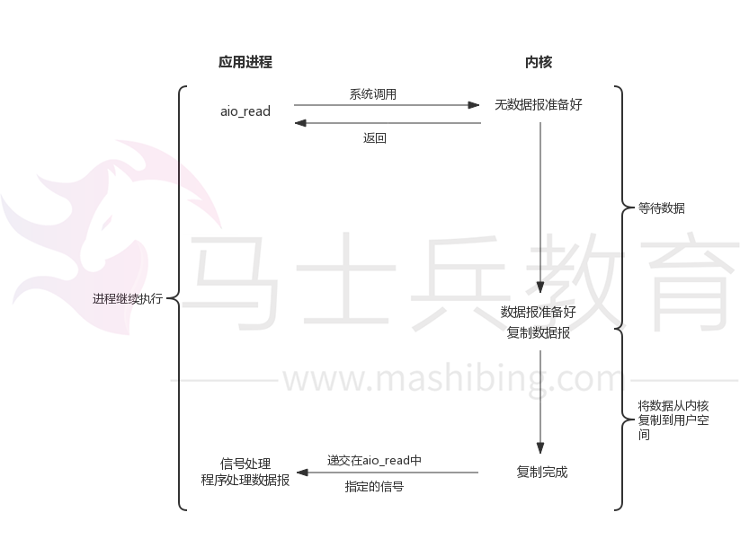

*以上参考自：《UNIX网络编程》*

从前面 I/O 模型的分类中，我们可以看出 AIO 的动机。阻塞模型需要在 I/O 操作开始时阻塞应用程序。这意味着不可能同时重叠进行处理和 I/O 操作。非阻塞模型允许处理和 I/O 操作重叠进行，但是这需要应用程序来检查 I/O 操作的状态。对于异步I/O ，它允许处理和 I/O 操作重叠进行，包括 I/O 操作完成的通知。除了需要阻塞之外，select 函数所提供的功能（异步阻塞 I/O）与 AIO 类似。不过，它是对通知事件进行阻塞，而不是对 I/O 调用进行阻塞。

参考下知乎上的回答：

> - **同步与异步：**同步和异步关注的是消息通信机制 (synchronous communication/ asynchronous communication)。所谓同步，就是在发出一个**调用**时，在没有得到结果之前，该**调用**就不返回。但是一旦调用返回，就得到返回值了。换句话说，就是由**调用者**主动等待这个**调用**的结果；
> - **阻塞与非阻塞：**阻塞和非阻塞关注的是程序在等待调用结果（消息，返回值）时的状态。阻塞调用是指调用结果返回之前，当前线程会被挂起。调用线程只有在得到结果之后才会返回；而非阻塞调用指在不能立刻得到结果之前，该调用不会阻塞当前线程。

## 两种IO多路复用方案：Reactor和Proactor

一般地，I/O多路复用机制都依赖于一个**事件多路分离器(Event Demultiplexer)**。分离器对象可将来自事件源的I/O事件分离出来，并分发到对应的read/write**事件处理器(Event Handler)**。开发人员预先注册需要处理的事件及其事件处理器（或回调函数）；事件分离器负责将请求事件传递给事件处理器。

两个与事件分离器有关的模式是Reactor和Proactor。Reactor模式采用同步I/O，而Proactor采用异步I/O。在Reactor中，事件分离器负责等待文件描述符或socket为读写操作准备就绪，然后将就绪事件传递给对应的处理器，最后由处理器负责完成实际的读写工作。

而在Proactor模式中，处理器或者兼任处理器的事件分离器，只负责发起异步读写操作。I/O操作本身由操作系统来完成。传递给操作系统的参数需要包括用户定义的数据缓冲区地址和数据大小，操作系统才能从中得到写出操作所需数据，或写入从socket读到的数据。事件分离器捕获I/O操作完成事件，然后将事件传递给对应处理器。比如，在windows上，处理器发起一个异步I/O操作，再由事件分离器等待IOCompletion事件。典型的异步模式实现，都建立在操作系统支持异步API的基础之上，我们将这种实现称为“系统级”异步或“真”异步，因为应用程序完全依赖操作系统执行真正的I/O工作。

举个例子，将有助于理解Reactor与Proactor二者的差异，以读操作为例（写操作类似）。

在Reactor中实现读：

- 注册读就绪事件和相应的事件处理器；
- 事件分离器等待事件；
- 事件到来，激活分离器，分离器调用事件对应的处理器；
- 事件处理器完成实际的读操作，处理读到的数据，注册新的事件，然后返还控制权。

在Proactor中实现读：

- 处理器发起异步读操作（注意：操作系统必须支持异步I/O）。在这种情况下，处理器无视I/O就绪事件，它关注的是完成事件；
- 事件分离器等待操作完成事件;
- 在分离器等待过程中，操作系统利用并行的内核线程执行实际的读操作，并将结果数据存入用户自定义缓冲区，最后通知事件分离器读操作完成；
- 事件分离器呼唤处理器；
- 事件处理器处理用户自定义缓冲区中的数据，然后启动一个新的异步操作，并将控制权返回事件分离器。

可以看出，两个模式的相同点，都是对某个I/O事件的事件通知（即告诉某个模块，这个I/O操作可以进行或已经完成）。在结构上，两者的相同点和不同点如下：

- 相同点：demultiplexor负责提交I/O操作（异步）、查询设备是否可操作（同步），然后当条件满足时，就回调handler；
- 不同点：异步情况下（Proactor），当回调handler时，表示I/O操作已经完成；同步情况下（Reactor），回调handler时，表示I/O设备可以进行某个操作（can read or can write）。

## 传统BIO模型

BIO是同步阻塞式IO，通常在while循环中服务端会调用accept方法等待接收客户端的连接请求，一旦接收到一个连接请求，就可以建立通信套接字在这个通信套接字上进行读写操作，此时不能再接收其他客户端连接请求，只能等待同当前连接的客户端的操作执行完成。

如果BIO要能够同时处理多个客户端请求，就必须使用多线程，即每次accept阻塞等待来自客户端请求，一旦受到连接请求就建立通信套接字同时开启一个新的线程来处理这个套接字的数据读写请求，然后立刻又继续accept等待其他客户端连接请求，即为每一个客户端连接请求都创建一个线程来单独处理。

我们看下传统的BIO方式下的编程模型大致如下：

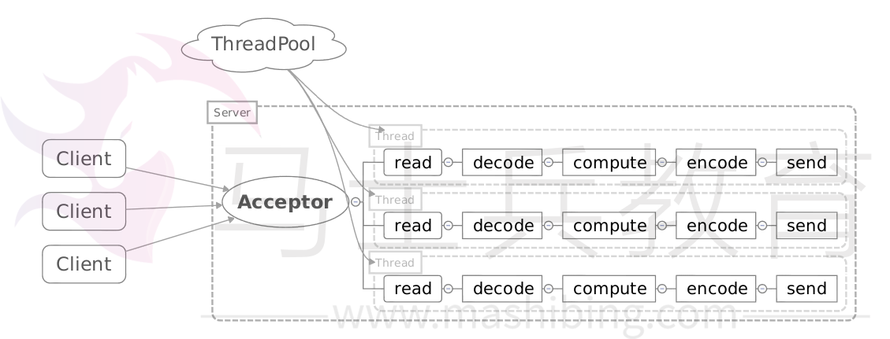

```java
public class BIODemo {

    public static void main(String[] args) throws IOException {

        ExecutorService executor = Executors.newFixedThreadPool(128);

        ServerSocket serverSocket = new ServerSocket();
        serverSocket.bind(new InetSocketAddress(1234));
        // 循环等待新连接
        while (true) {
            Socket socket = serverSocket.accept();
            // 为新的连接创建线程执行任务
            executor.submit(new ConnectionTask(socket));
        }
    }

}

class ConnectionTask extends Thread {
    private Socket socket;

    public ConnectionTask(Socket socket) {
        this.socket = socket;
    }

    public void run() {
        while (true) {
            InputStream inputStream = null;
            OutputStream outputStream = null;
            try {
                inputStream = socket.getInputStream();
                
                // read from socket...
                
                inputStream.read();
                
                outputStream = socket.getOutputStream();

                // write to socket...

                outputStream.write();

            } catch (IOException e) {
                e.printStackTrace();
            } finally {
                // 关闭资源...

            }

        }
    }
}
```

这里之所以使用多线程，是因为socket.accept()、inputStream.read()、outputStream.write()都是同步阻塞的，当一个连接在处理I/O的时候，系统是阻塞的，如果是单线程的话在阻塞的期间不能接受任何请求。所以，使用多线程，就可以让CPU去处理更多的事情。其实这也是所有使用多线程的本质：

- 利用多核。
- 当I/O阻塞系统，但CPU空闲的时候，可以利用多线程使用CPU资源。

使用线程池能够让线程的创建和回收成本相对较低。在活动连接数不是特别高（小于单机1000）的情况下，这种模型是比较不错的，可以让每一个连接专注于自己的I/O并且编程模型简单，也不用过多考虑系统的过载、限流等问题。线程池可以缓冲一些过多的连接或请求。

但这个模型最本质的问题在于，严重依赖于线程。但线程是很”贵”的资源，主要表现在：

1. 线程的创建和销毁成本很高，在Linux这样的操作系统中，线程本质上就是一个进程。创建和销毁都是重量级的系统函数；
2. 线程本身占用较大内存，像Java的线程栈，一般至少分配512K～1M的空间，如果系统中的线程数过千，恐怕整个JVM的内存都会被吃掉一半；
3. 线程的切换成本是很高的。操作系统发生线程切换的时候，需要保留线程的上下文，然后执行系统调用。如果线程数过高，可能执行线程切换的时间甚至会大于线程执行的时间，这时候带来的表现往往是系统load偏高、CPU sy使用率特别高（超过20%以上)，导致系统几乎陷入不可用的状态；
4. 容易造成锯齿状的系统负载。因为系统负载是用活动线程数或CPU核心数，一旦线程数量高但外部网络环境不是很稳定，就很容易造成大量请求的结果同时返回，激活大量阻塞线程从而使系统负载压力过大。

所以，当面对十万甚至百万级连接的时候，传统的BIO模型是无能为力的。随着移动端应用的兴起和各种网络游戏的盛行，百万级长连接日趋普遍，此时，必然需要一种更高效的I/O处理模型。

## NIO的实现原理

NIO本身是基于事件驱动思想来完成的，其主要想解决的是BIO的大并发问题，即在使用同步I/O的网络应用中，如果要同时处理多个客户端请求，或是在客户端要同时和多个服务器进行通讯，就必须使用多线程来处理。也就是说，将每一个客户端请求分配给一个线程来单独处理。这样做虽然可以达到我们的要求，但同时又会带来另外一个问题。由于每创建一个线程，就要为这个线程分配一定的内存空间（也叫工作存储器），而且操作系统本身也对线程的总数有一定的限制。如果客户端的请求过多，服务端程序可能会因为不堪重负而拒绝客户端的请求，甚至服务器可能会因此而瘫痪。

NIO基于Reactor，当socket有流可读或可写入socket时，操作系统会相应的通知应用程序进行处理，应用再将流读取到缓冲区或写入操作系统。

也就是说，这个时候，已经不是一个连接就要对应一个处理线程了，而是有效的请求，对应一个线程，当连接没有数据时，是没有工作线程来处理的。

下面看下代码的实现：

NIO服务端代码（新建连接）：

```java
//获取一个ServerSocket通道
ServerSocketChannel serverChannel = ServerSocketChannel.open();
serverChannel.configureBlocking(false);
serverChannel.socket().bind(new InetSocketAddress(port));
//获取通道管理器
selector = Selector.open();
//将通道管理器与通道绑定，并为该通道注册SelectionKey.OP_ACCEPT事件，
serverChannel.register(selector, SelectionKey.OP_ACCEPT);
```

NIO服务端代码（监听）：

```java
while(true){
    //当有注册的事件到达时，方法返回，否则阻塞。
   selector.select();
   for(SelectionKey key : selector.selectedKeys()){
       if(key.isAcceptable()){
           ServerSocketChannel server =
                (ServerSocketChannel)key.channel();
           SocketChannel channel = server.accept();
           channel.write(ByteBuffer.wrap(
            new String("send message to client").getBytes()));
           //在与客户端连接成功后，为客户端通道注册SelectionKey.OP_READ事件。
           channel.register(selector, SelectionKey.OP_READ);
       }else if(key.isReadable()){//有可读数据事件
           SocketChannel channel = (SocketChannel)key.channel();
           ByteBuffer buffer = ByteBuffer.allocate(10);
           int read = channel.read(buffer);
           byte[] data = buffer.array();
           String message = new String(data);
           System.out.println("receive message from client, size:"
               + buffer.position() + " msg: " + message);
       }
   }
}
```

NIO模型示例如下：

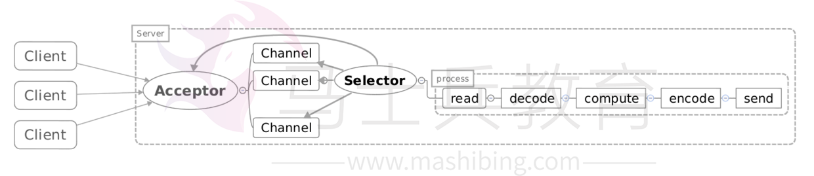

- Acceptor注册Selector，监听accept事件；
- 当客户端连接后，触发accept事件；
- 服务器构建对应的Channel，并在其上注册Selector，监听读写事件；
- 当发生读写事件后，进行相应的读写处理。

## Reactor模型

有关Reactor模型结构，可以参考Doug Lea在 Scalable IO in Java中的介绍。这里简单介绍一下Reactor模式的典型实现：

### Reactor单线程模型

这是最简单的单Reactor单线程模型。Reactor线程负责多路分离套接字、accept新连接，并分派请求到处理器链中。该模型适用于处理器链中业务处理组件能快速完成的场景。不过，这种单线程模型不能充分利用多核资源，所以实际使用的不多。

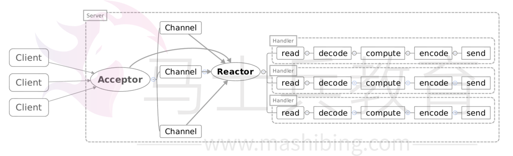

这个模型和上面的NIO流程很类似，只是将消息相关处理独立到了Handler中去了。

代码实现如下：

```java
public class Reactor implements Runnable {

    final Selector selector;

    final ServerSocketChannel serverSocketChannel;

    public static void main(String[] args) throws IOException {
        new Thread(new Reactor(1234)).start();
    }

    public Reactor(int port) throws IOException {
        selector = Selector.open();
        serverSocketChannel = ServerSocketChannel.open();
        serverSocketChannel.socket().bind(new InetSocketAddress(port));
        serverSocketChannel.configureBlocking(false);
        SelectionKey key = serverSocketChannel.register(selector, SelectionKey.OP_ACCEPT);
        key.attach(new Acceptor());
    }

    @Override
    public void run() {
        while (!Thread.interrupted()) {
            try {
                selector.select();
                Set<SelectionKey> selectionKeys = selector.selectedKeys();
                for (SelectionKey selectionKey : selectionKeys) {
                    dispatch(selectionKey);
                }
                selectionKeys.clear();
            } catch (IOException e) {
                e.printStackTrace();
            }
        }

    }

    private void dispatch(SelectionKey selectionKey) {
        Runnable run = (Runnable) selectionKey.attachment();
        if (run != null) {
            run.run();
        }
    }

    class Acceptor implements Runnable {

        @Override
        public void run() {
            try {
                SocketChannel channel = serverSocketChannel.accept();
                if (channel != null) {
                    new Handler(selector, channel);
                }
            } catch (IOException e) {
                e.printStackTrace();
            }

        }

    }


}

class Handler implements Runnable {

    private final static int DEFAULT_SIZE = 1024;

    private final SocketChannel socketChannel;

    private final SelectionKey seletionKey;

    private static final int READING = 0;

    private static final int SENDING = 1;

    private int state = READING;

    ByteBuffer inputBuffer = ByteBuffer.allocate(DEFAULT_SIZE);

    ByteBuffer outputBuffer = ByteBuffer.allocate(DEFAULT_SIZE);

    public Handler(Selector selector, SocketChannel channel) throws IOException {
        this.socketChannel = channel;
        socketChannel.configureBlocking(false);
        this.seletionKey = socketChannel.register(selector, 0);
        seletionKey.attach(this);
        seletionKey.interestOps(SelectionKey.OP_READ);
        selector.wakeup();
    }

    @Override
    public void run() {
        if (state == READING) {
            read();
        } else if (state == SENDING) {
            write();
        }

    }

    class Sender implements Runnable {

        @Override
        public void run() {
            try {
                socketChannel.write(outputBuffer);
            } catch (IOException e) {
                e.printStackTrace();
            }
            if (outIsComplete()) {
                seletionKey.cancel();
            }
        }

    }

    private void write() {
        try {
            socketChannel.write(outputBuffer);
        } catch (IOException e) {
            e.printStackTrace();
        }
        while (outIsComplete()) {
            seletionKey.cancel();
        }

    }

    private void read() {
        try {
            socketChannel.read(inputBuffer);
            if (inputIsComplete()) {
                process();
                System.out.println("接收到来自客户端（" + socketChannel.socket().getInetAddress().getHostAddress()
                        + "）的消息：" + new String(inputBuffer.array()));
                seletionKey.attach(new Sender());
                seletionKey.interestOps(SelectionKey.OP_WRITE);
                seletionKey.selector().wakeup();
            }
        } catch (IOException e) {
            e.printStackTrace();
        }


    }

    public boolean inputIsComplete() {
        return true;
    }

    public boolean outIsComplete() {
        return true;

    }

    public void process() {
        // do something...
    }

}
```

虽然上面说到NIO一个线程就可以支持所有的IO处理。但是瓶颈也是显而易见的。我们看一个客户端的情况，如果这个客户端多次进行请求，如果在Handler中的处理速度较慢，那么后续的客户端请求都会被积压，导致响应变慢！所以引入了Reactor多线程模型。

### Reactor多线程模型

相比上一种模型，该模型在处理器链部分采用了多线程（线程池）：

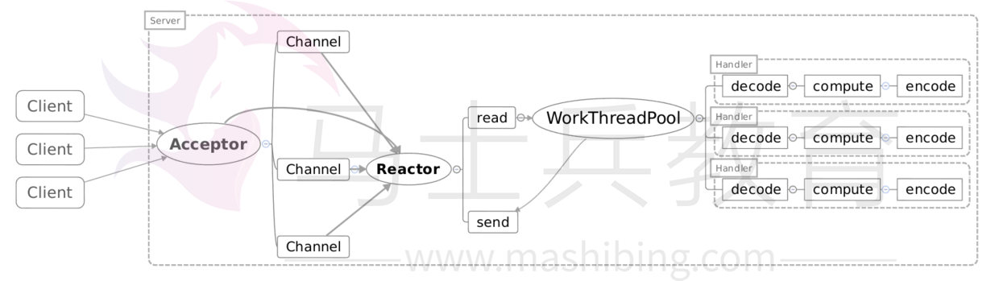

Reactor多线程模型就是将Handler中的IO操作和非IO操作分开，操作IO的线程称为IO线程，非IO操作的线程称为工作线程。这样的话，客户端的请求会直接被丢到线程池中，客户端发送请求就不会堵塞。

可以将Handler做如下修改：

```java
class Handler implements Runnable {

    private final static int DEFAULT_SIZE = 1024;

    private final SocketChannel socketChannel;

    private final SelectionKey seletionKey;

    private static final int READING = 0;

    private static final int SENDING = 1;

    private int state = READING;

    ByteBuffer inputBuffer = ByteBuffer.allocate(DEFAULT_SIZE);

    ByteBuffer outputBuffer = ByteBuffer.allocate(DEFAULT_SIZE);
    
    private Selector selector;

    private static ExecutorService executorService = Executors.newFixedThreadPool(Runtime.getRuntime()
            .availableProcessors());
    private static final int PROCESSING = 3;

    public Handler(Selector selector, SocketChannel channel) throws IOException {
        this.selector = selector;
        this.socketChannel = channel;
        socketChannel.configureBlocking(false);
        this.seletionKey = socketChannel.register(selector, 0);
        seletionKey.attach(this);
        seletionKey.interestOps(SelectionKey.OP_READ);
        selector.wakeup();
    }

    @Override
    public void run() {
        if (state == READING) {
            read();
        } else if (state == SENDING) {
            write();
        }

    }

    class Sender implements Runnable {

        @Override
        public void run() {
            try {
                socketChannel.write(outputBuffer);
            } catch (IOException e) {
                e.printStackTrace();
            }
            if (outIsComplete()) {
                seletionKey.cancel();
            }
        }

    }

    private void write() {
        try {
            socketChannel.write(outputBuffer);
        } catch (IOException e) {
            e.printStackTrace();
        }
        if (outIsComplete()) {
            seletionKey.cancel();
        }

    }

    private void read() {
        try {
            socketChannel.read(inputBuffer);
            if (inputIsComplete()) {
                process();
                executorService.execute(new Processer());
            }
        } catch (IOException e) {
            e.printStackTrace();
        }


    }

    public boolean inputIsComplete() {
        return true;
    }

    public boolean outIsComplete() {
        return true;

    }

    public void process() {

    }

    synchronized void processAndHandOff() {
        process();
        state = SENDING; // or rebind attachment
        seletionKey.interestOps(SelectionKey.OP_WRITE);
        selector.wakeup();
    }
    class Processer implements Runnable {
        public void run() {
            processAndHandOff();
        }
    }

}
```

但是当用户进一步增加的时候，Reactor会出现瓶颈！因为Reactor既要处理IO操作请求，又要响应连接请求。为了分担Reactor的负担，所以引入了主从Reactor模型。

### 主从Reactor多线程模型

主从Reactor多线程模型是将Reactor分成两部分，mainReactor负责监听server socket，accept新连接，并将建立的socket分派给subReactor。subReactor负责多路分离已连接的socket，读写网络数据，对业务处理功能，其扔给worker线程池完成。通常，subReactor个数上可与CPU个数等同：

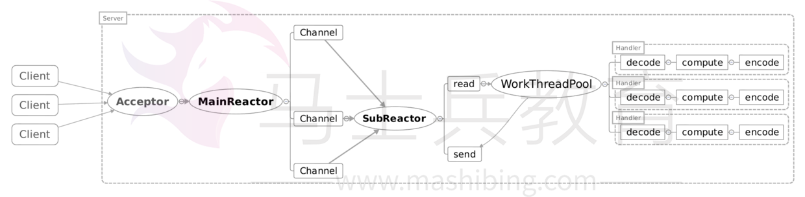

这时可以把Reactor做如下修改：

```java
public class Reactor {


    final ServerSocketChannel serverSocketChannel;

    Selector[] selectors; // also create threads
    AtomicInteger next = new AtomicInteger(0);
    ExecutorService sunReactors = Executors.newFixedThreadPool(Runtime.getRuntime().availableProcessors());

    public static void main(String[] args) throws IOException {
        new Reactor(1234);
    }

    public Reactor(int port) throws IOException {
        serverSocketChannel = ServerSocketChannel.open();
        serverSocketChannel.socket().bind(new InetSocketAddress(port));
        serverSocketChannel.configureBlocking(false);
        selectors = new Selector[4];
        for (int i = 0; i < 4; i++) {
            Selector selector = Selector.open();
            selectors[i] = selector;
            SelectionKey key = serverSocketChannel.register(selector, SelectionKey.OP_ACCEPT);
            key.attach(new Acceptor());
            new Thread(() -> {
                while (!Thread.interrupted()) {
                    try {
                        selector.select();
                        Set<SelectionKey> selectionKeys = selector.selectedKeys();
                        for (SelectionKey selectionKey : selectionKeys) {
                            dispatch(selectionKey);
                        }
                        selectionKeys.clear();
                    } catch (IOException e) {
                        e.printStackTrace();
                    }
                }
            }).start();
        }

    }


    private void dispatch(SelectionKey selectionKey) {
        Runnable run = (Runnable) selectionKey.attachment();
        if (run != null) {
            run.run();
        }
    }

    class Acceptor implements Runnable {

        @Override
        public void run() {
            try {
                SocketChannel connection = serverSocketChannel.accept();
                if (connection != null)
                    sunReactors.execute(new Handler(selectors[next.getAndIncrement() % selectors.length], connection));
            } catch (IOException e) {
                e.printStackTrace();
            }

        }

    }


}
```

可见，主Reactor用于响应连接请求，从Reactor用于处理IO操作请求。

## AIO

与NIO不同，当进行读写操作时，只须直接调用API的read或write方法即可。这两种方法均为异步的，对于读操作而言，当有流可读取时，操作系统会将可读的流传入read方法的缓冲区，并通知应用程序；对于写操作而言，当操作系统将write方法传递的流写入完毕时，操作系统主动通知应用程序。
即可以理解为，read/write方法都是异步的，完成后会主动调用回调函数。
在JDK1.7中，这部分内容被称作NIO.2，主要在java.nio.channels包下增加了下面四个异步通道：

- AsynchronousSocketChannel
- AsynchronousServerSocketChannel
- AsynchronousFileChannel
- AsynchronousDatagramChannel

我们看一下AsynchronousSocketChannel中的几个方法：

```java
public abstract class AsynchronousSocketChannel
    implements AsynchronousByteChannel, NetworkChannel
{
    public abstract Future<Integer> read(ByteBuffer dst);
    
    public abstract <A> void read(ByteBuffer[] dsts,
                                  int offset,
                                  int length,
                                  long timeout,
                                  TimeUnit unit,
                                  A attachment,
                                  CompletionHandler<Long,? super A> handler);

    public abstract <A> void write(ByteBuffer src,
                                   long timeout,
                                   TimeUnit unit,
                                   A attachment,
                                   CompletionHandler<Integer,? super A> handler);

    public final <A> void write(ByteBuffer src,
                                A attachment,
                                CompletionHandler<Integer,? super A> handler)

    {
        write(src, 0L, TimeUnit.MILLISECONDS, attachment, handler);
    }

    public abstract Future<Integer> write(ByteBuffer src);

    public abstract <A> void write(ByteBuffer[] srcs,
                                   int offset,
                                   int length,
                                   long timeout,
                                   TimeUnit unit,
                                   A attachment,
                                   CompletionHandler<Long,? super A> handler);
}
```

其中的read/write方法，有的会返回一个`Future`对象，有的需要传入一个`CompletionHandler`对象，该对象的作用是当执行完读取/写入操作后，直接该对象当中的方法进行回调。

对于`AsynchronousSocketChannel`而言，在windows和linux上的实现类是不一样的。

在windows上，AIO的实现是通过IOCP来完成的，实现类是：

```
WindowsAsynchronousSocketChannelImpl
```

实现的接口是：

```
Iocp.OverlappedChannel
```

而在linux上，实现类是：

```
UnixAsynchronousSocketChannelImpl
```

实现的接口是：

```
Port.PollableChannel
```

AIO是一种接口标准，各家操作系统可以实现也可以不实现。在不同操作系统上在高并发情况下最好都采用操作系统推荐的方式。Linux上还没有真正实现网络方式的AIO。

## select和poll,epoll的区别

当需要读两个以上的I/O的时候，如果使用阻塞式的I/O，那么可能长时间的阻塞在一个描述符上面，另外的描述符虽然有数据但是不能读出来，这样实时性不能满足要求，大概的解决方案有以下几种：

1. 使用多进程或者多线程，但是这种方法会造成程序的复杂，而且对与进程与线程的创建维护也需要很多的开销（Apache服务器是用的子进程的方式，优点可以隔离用户）；
2. 用一个进程，但是使用非阻塞的I/O读取数据，当一个I/O不可读的时候立刻返回，检查下一个是否可读，这种形式的循环为轮询（polling），这种方法比较浪费CPU时间，因为大多数时间是不可读，但是仍花费时间不断反复执行read系统调用；
3. 异步I/O，当一个描述符准备好的时候用一个信号告诉进程，但是由于信号个数有限，多个描述符时不适用；
4. 一种较好的方式为I/O多路复用，先构造一张有关描述符的列表（epoll中为队列），然后调用一个函数，直到这些描述符中的一个准备好时才返回，返回时告诉进程哪些I/O就绪。select和epoll这两个机制都是多路I/O机制的解决方案，select为POSIX标准中的，而epoll为Linux所特有的。

它们的区别主要有三点：

1. select的句柄数目受限，在linux/posix_types.h头文件有这样的声明：`#define __FD_SETSIZE 1024`表示select最多同时监听1024个fd。 一般来说这个数目和系统内存关系很大，具体数目可以cat /proc/sys/fs/file-max察看。32位机默认是1024个。64位机默认是2048.而epoll没有，它的限制是最大的打开文件句柄数目；

2. epoll的最大好处是不会随着FD的数目增长而降低效率，在selec中采用轮询处理，其中的数据结构类似一个数组的数据结构，而epoll是维护一个队列，直接看队列是不是空就可以了。epoll只会对”活跃”的socket进行操作—这是因为在内核实现中epoll是根据每个fd上面的callback函数实现的。那么，只有”活跃”的socket才会主动的去调用 callback函数（把这个句柄加入队列），其他idle状态句柄则不会，在这点上，epoll实现了一个”伪”AIO。但是如果绝大部分的I/O都是“活跃的”，每个I/O端口使用率很高的话，epoll效率不一定比select高（可能是要维护队列复杂）；

3. 使用mmap加速内核与用户空间的消息传递。无论是select,poll还是epoll都需要内核把FD消息通知给用户空间，如何避免不必要的内存拷贝就很重要，在这点上，epoll是通过内核于用户空间mmap同一块内存实现的。

   (1)select==>时间复杂度O(n)

   它仅仅知道了，有I/O事件发生了，却并不知道是哪那几个流（可能有一个，多个，甚至全部），我们只能无差别轮询所有流，找出能读出数据，或者写入数据的流，对他们进行操作。所以select具有O(n)的无差别轮询复杂度，同时处理的流越多，无差别轮询时间就越长。

   (2)poll==>时间复杂度O(n)

   poll本质上和select没有区别，它将用户传入的数组拷贝到内核空间，然后查询每个fd对应的设备状态， 但是它没有最大连接数的限制，原因是它是基于链表来存储的.

   (3)epoll==>时间复杂度O(1)epoll可以理解为event poll，不同于忙轮询和无差别轮询，epoll会把哪个流发生了怎样的I/O事件通知我们。所以我们说epoll实际上是事件驱动（每个事件关联上fd）的，此时我们对这些流的操作都是有意义的。（复杂度降低到了O(1)）

   select，poll，epoll都是IO多路复用的机制。I/O多路复用就通过一种机制，可以监视多个描述符，一旦某个描述符就绪（一般是读就绪或者写就绪），能够通知程序进行相应的读写操作。但select，poll，epoll本质上都是同步I/O，因为他们都需要在读写事件就绪后自己负责进行读写，也就是说这个读写过程是阻塞的，而异步I/O则无需自己负责进行读写，异步I/O的实现会负责把数据从内核拷贝到用户空间。

   epoll跟select都能提供多路I/O复用的解决方案。在现在的[Linux](https://so.csdn.net/so/search?from=pc_blog_highlight&q=Linux)内核里有都能够支持，其中epoll是Linux所特有，而select则应该是POSIX所规定，一般操作系统均有实现.

   

   

   epoll既然是对select和poll的改进，就应该能避免上述缺点。那epoll都是怎么解决的呢？在此之前，我们先看一下epoll和select和poll的调用接口上的不同，select和poll都只提供了一个函数——select或者poll函数。而epoll提供了三个函数，epoll_create,epoll_ctl和epoll_wait，

   epoll_create是创建一个epoll句柄；

   epoll_ctl是注册要监听的事件类型；

   epoll_wait则是等待事件的产生。

   　　对于第一个缺点，epoll的解决方案在epoll_ctl函数中。每次注册新的事件到epoll句柄中时（在epoll_ctl中指定EPOLL_CTL_ADD），会把所有的fd拷贝进内核，而不是在epoll_wait的时候重复拷贝。epoll保证了每个fd在整个过程中只会拷贝一次。

   　　对于第二个缺点，epoll的解决方案不像select或poll一样每次都把current轮流加入fd对应的设备等待队列中，而只在epoll_ctl时把current挂一遍（这一遍必不可少）并为每个fd指定一个回调函数，当设备就绪，唤醒等待队列上的等待者时，就会调用这个回调函数，而这个回调函数会把就绪的fd加入一个就绪链表）。epoll_wait的工作实际上就是在这个就绪链表中查看有没有就绪的fd（利用schedule_timeout()实现睡一会，判断一会的效果，和select实现中的第7步是类似的）。

   　　epoll没有FD个数这个限制，它所支持的FD上限是最大可以打开文件的数目，这个数字一般远大于2048,举个例子,在1GB内存的机器上大约是10万左右，具体数目可以cat /proc/sys/fs/file-max察看,一般来说这个数目和系统内存关系很大。select、poll、epoll 区别总结：
   1、支持一个进程所能打开的最大连接数

   select：单个进程所能打开的最大连接数有FD_SETSIZE宏定义，其大小是32个整数的大小（在32位的机器上，大小就是3232，同理64位机器上FD_SETSIZE为3264），当然我们可以对进行修改，然后重新编译内核，但是性能可能会受到影响，这需要进一步的测试。

   poll：poll本质上和select没有区别，但是它没有最大连接数的限制，原因是它是基于链表来存储的。

   epoll：虽然连接数有上限，但是很大，1G内存的机器上可以打开10万左右的连接，2G内存的机器可以打开20万左右的连接。

   2、FD剧增后带来的IO效率问题

   select：因为每次调用时都会对连接进行线性遍历，所以随着FD的增加会造成遍历速度慢的“线性下降性能问题”。

   poll：同上

   epoll：因为epoll内核中实现是根据每个fd上的callback函数来实现的，只有活跃的socket才会主动调用callback，所以在活跃socket较少的情况下，使用epoll没有前面两者的线性下降的性能问题，但是所有socket都很活跃的情况下，可能会有性能问题。

   3、 消息传递方式

   select：内核需要将消息传递到用户空间，都需要内核拷贝动作

   poll：同上

   epoll：epoll通过内核和用户空间共享一块内存(mmap)来实现的。总结：

   综上，在选择select，poll，epoll时要根据具体的使用场合以及这三种方式的自身特点。

   1、表面上看epoll的性能最好，但是在连接数少并且连接都十分活跃的情况下，select和poll的性能可能比epoll好，毕竟epoll的通知机制需要很多函数回调。

   select，poll实现需要自己不断轮询所有fd集合，直到设备就绪，期间可能要睡眠和唤醒多次交替。而epoll其实也需要调用epoll_wait不断轮询就绪链表，期间也可能多次睡眠和唤醒交替，但是它是设备就绪时，调用回调函数，把就绪fd放入就绪链表中，并唤醒在epoll_wait中进入睡眠的进程。虽然都要睡眠和交替，但是select和poll在“醒着”的时候要遍历整个fd集合，而epoll在“醒着”的时候只要判断一下就绪链表是否为空就行了，这节省了大量的CPU时间。这就是回调机制带来的性能提升。

   2、select低效是因为每次它都需要轮询。但低效也是相对的，视情况而定，也可通过良好的设计改善 

   select，poll每次调用都要把fd集合从用户态往内核态拷贝一次，并且要把current往设备等待队列中挂一次，而epoll只要一次拷贝，而且把current往等待队列上挂也只挂一次（在epoll_wait的开始，注意这里的等待队列并不是设备等待队列，只是一个epoll内部定义的等待队列）。这也能节省不少的开销。

## NIO与epoll

上文说到了select与epoll的区别，再总结一下Java NIO与select和epoll：

- Linux2.6之后支持epoll
- windows支持select而不支持epoll
- 不同系统下nio的实现是不一样的，包括Sunos linux 和windows
- select的复杂度为O(N)
- select有最大fd限制，默认为1024
- 修改sys/select.h可以改变select的fd数量限制
- epoll的事件模型，无fd数量限制，复杂度O(1),不需要遍历fd

以下代码基于Java 8。

下面看下在NIO中Selector的open方法：

```
public static Selector open() throws IOException {    return SelectorProvider.provider().openSelector();}
```

这里使用了SelectorProvider去创建一个Selector，看下provider方法的实现：

```java
    public static SelectorProvider provider() {
        synchronized (lock) {
            if (provider != null) return provider;
            return AccessController.doPrivileged(new PrivilegedAction<SelectorProvider>() {
                public SelectorProvider run() {
                    if (loadProviderFromProperty()) return provider;
                    if (loadProviderAsService()) return provider;
                    provider = sun.nio.ch.DefaultSelectorProvider.create();
                    return provider;
                }
            });
        }
    }
```

看下`sun.nio.ch.DefaultSelectorProvider.create()`方法，该方法在不同的操作系统中的代码是不同的，在windows中的实现如下：

```
public static SelectorProvider create() {    return new WindowsSelectorProvider();}
```

在Mac OS中的实现如下：

```
public static SelectorProvider create() {    return new KQueueSelectorProvider();}
```

在linux中的实现如下：

```java
    public static SelectorProvider create() {
        String str = (String) AccessController.doPrivileged(new GetPropertyAction("os.name"));
        if (str.equals("SunOS")) return createProvider("sun.nio.ch.DevPollSelectorProvider");
        if (str.equals("Linux")) return createProvider("sun.nio.ch.EPollSelectorProvider");
        return new PollSelectorProvider();
    }
```

我们看到create方法中是通过区分操作系统来返回不同的Provider的。其中SunOs就是Solaris返回的是DevPollSelectorProvider，对于Linux，返回的Provder是EPollSelectorProvider，其余操作系统，返回的是PollSelectorProvider。

## Zero Copy

许多web应用都会向用户提供大量的静态内容，这意味着有很多数据从硬盘读出之后，会原封不动的通过socket传输给用户。

这种操作看起来可能不会怎么消耗CPU，但是实际上它是低效的：

1. kernel把从disk读数据；
2. 将数据传输给application；
3. application再次把同样的内容再传回给处于kernel级的socket。

这种场景下，application实际上只是作为一种低效的中间介质，用来把磁盘文件的数据传给socket。

数据每次传输都会经过user和kernel空间都会被copy，这会消耗cpu，并且占用RAM的带宽。

### 传统的数据传输方式

像这种从文件读取数据然后将数据通过网络传输给其他的程序的方式其核心操作就是如下两个调用：

```
File.read(fileDesc,buf,len);Socket.send(socket,buf,len);
```

其上操作看上去只有两个简单的调用，但是其内部过程却要经历四次用户态和内核态的切换以及四次的数据复制操作：

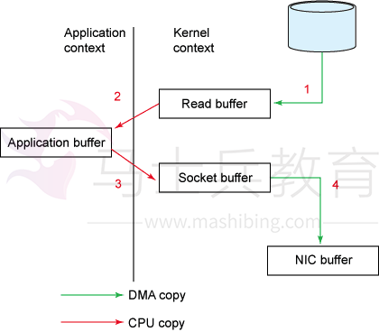

上图展示了数据从文件到socket的内部流程。

下面看下用户态和内核态的切换过程：

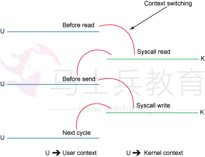


步骤如下：

1. read()的调用引起了从用户态到内核态的切换（看图二），内部是通过sys_read()（或者类似的方法）发起对文件数据的读取。数据的第一次复制是通过DMA（直接内存访问）将磁盘上的数据复制到内核空间的缓冲区中；
2. 数据从内核空间的缓冲区复制到用户空间的缓冲区后，read()方法也就返回了。此时内核态又切换回用户态，现在数据也已经复制到了用户地址空间的缓存中；
3. socket的send()方法的调用又会引起用户态到内核的切换，第三次数据复制又将数据从用户空间缓冲区复制到了内核空间的缓冲区，这次数据被放在了不同于之前的内核缓冲区中，这个缓冲区与数据将要被传输到的socket关联；
4. send()系统调用返回后，就产生了第四次用户态和内核态的切换。随着DMA单独异步的将数据从内核态的缓冲区中传输到协议引擎发送到网络上，有了第四次数据复制。

### Zero Copy的数据传输方式

`java.nio.channels.FileChannel`中定义了两个方法：transferTo( )和 transferFrom( )。

transferTo( )和 transferFrom( )方法允许将一个通道交叉连接到另一个通道，而不需要通过一个中间缓冲区来传递数据。只有 FileChannel 类有这两个方法，因此 **channel-to-channel** 传输中通道之一必须是 FileChannel。您不能在 socket 通道之间直接传输数据，不过 socket 通道实现 `WritableByteChannel` 和 `ReadableByteChannel` 接口，因此文件的内容可以用 `transferTo( )` 方法传输给一个 socket 通道，或者也可以用 transferFrom( )方法将数据从一个 socket 通道直接读取到一个文件中。

下面根据`transferTo()` 方法来说明。

根据上文可知，`transferTo()` 方法可以把bytes直接从调用它的channel传输到另一个WritableByteChannel，中间不经过应用程序。

下面看下该方法的定义：

```
public abstract long transferTo(long position, long count,                                    WritableByteChannel target)        throws IOException;
```

下图展示了通过transferTo实现数据传输的路径：

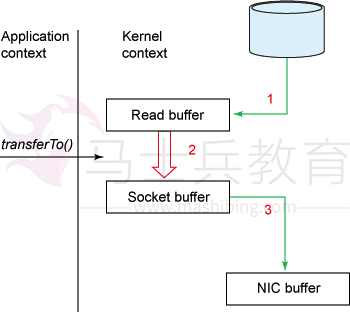

下图展示了内核态、用户态的切换情况：

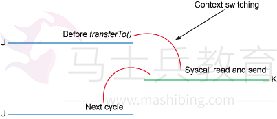

使用transferTo()方式所经历的步骤：

1. transferTo调用会引起DMA将文件内容复制到读缓冲区(内核空间的缓冲区)，然后数据从这个缓冲区复制到另一个与socket输出相关的内核缓冲区中；
2. 第三次数据复制就是DMA把socket关联的缓冲区中的数据复制到协议引擎上发送到网络上。

这次改善，我们是通过将内核、用户态切换的次数从四次减少到两次，将数据的复制次数从四次减少到三次(只有一次用到cpu资源)。但这并没有达到我们零复制的目标。如果底层网络适配器支持收集操作的话，我们可以进一步减少内核对数据的复制次数。在内核为2.4或者以上版本的linux系统上，socket缓冲区描述符将被用来满足这个需求。这个方式不仅减少了内核用户态间的切换，而且也省去了那次需要cpu参与的复制过程。从用户角度来看依旧是调用transferTo()方法，但是其本质发生了变化：

1. 调用transferTo方法后数据被DMA从文件复制到了内核的一个缓冲区中；
2. 数据不再被复制到socket关联的缓冲区中了，仅仅是将一个描述符（包含了数据的位置和长度等信息）追加到socket关联的缓冲区中。DMA直接将内核中的缓冲区中的数据传输给协议引擎，消除了仅剩的一次需要cpu周期的数据复制。

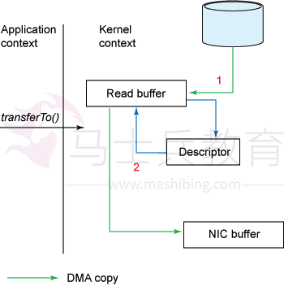

## NIO存在的问题

使用NIO != 高性能，当连接数<1000，并发程度不高或者局域网环境下NIO并没有显著的性能优势。

NIO并没有完全屏蔽平台差异，它仍然是基于各个操作系统的I/O系统实现的，差异仍然存在。使用NIO做网络编程构建事件驱动模型并不容易，陷阱重重。

推荐大家使用成熟的NIO框架，如Netty，MINA等。解决了很多NIO的陷阱，并屏蔽了操作系统的差异，有较好的性能和编程模型。

## 总结

最后总结一下NIO有哪些优势：

- 事件驱动模型

- 避免多线程

- 单线程处理多任务

- 非阻塞I/O，I/O读写不再阻塞

- 基于block的传输，通常比基于流的传输更高效

- 更高级的IO函数，Zero Copy

- I/O多路复用大大提高了Java网络应用的可伸缩性和实用性

#  Netty

## 1. Netty 是什么？ 

Netty是 一个异步事件驱动的网络应用程序框架，用于快速开发可维护的高性能 协议服务器和客户端。Netty是基于nio的，它封装了jdk的nio，让我们使用起 来更加方法灵活。 

## 2. Netty 特点是什么？ 

- 高并发：Netty 是一款基于 NIO（Nonblocking IO，非阻塞IO）开发的网络通 信框架，对比于 BIO（Blocking I/O，阻塞IO），他的并发性能得到了很大提高。 
- 传输快：Netty 的传输依赖于零拷贝特性，尽量减少不必要的内存拷贝，实现了 更高效率的传输。 
- 封装好：Netty 封装了 NIO 操作的很多细节，提供了易于使用调用接口。 

## 3. Netty 的优势有哪些？ 

- 使用简单：封装了 NIO 的很多细节，使用更简单。 
- 功能强大：预置了多种编解码功能，支持多种主流协议。 
- 定制能力强：可以通过 ChannelHandler 对通信框架进行灵活地扩展。 
- 性能高：通过与其他业界主流的 NIO 框架对比，Netty 的综合性能优。 
- 稳定：Netty 修复了已经发现的所有 NIO 的 bug，让开发人员可以专注于业务 本身。 
- 社区活跃：Netty 是活跃的开源项目，版本迭代周期短，bug 修复速度快。 

## 4. Netty 的应用场景有哪些？ 

典型的应用有：阿里分布式服务框架 Dubbo，默认使用 Netty 作为基础通信组 件，还有 RocketMQ 也是使用 Netty 作为通讯的基础。 

## 5. Netty 高性能表现在哪些方面？ 

- IO 线程模型：同步非阻塞，用少的资源做更多的事。 
- 内存零拷贝：尽量减少不必要的内存拷贝，实现了更高效率的传输。 
- 内存池设计：申请的内存可以重用，主要指直接内存。内部实现是用一颗二叉查 找树管理内存分配情况。 
- 串形化处理读写：避免使用锁带来的性能开销。
- 高性能序列化协议：支持 protobuf 等高性能序列化协议。 

## 6. BIO、NIO和AIO的区别？

BIO：一个连接一个线程，客户端有连接请求时服务器端就需要启动一个线程进 行处理。线程开销大。 

伪异步IO：将请求连接放入线程池，一对多，但线程还是很宝贵的资源。 

NIO：一个请求一个线程，但客户端发送的连接请求都会注册到多路复用器上， 多路复用器轮询到连接有I/O请求时才启动一个线程进行处理。 

AIO：一个有效请求一个线程，客户端的I/O请求都是由OS先完成了再通知服务 器应用去启动线程进行处理， 

BIO是面向流的，NIO是面向缓冲区的；BIO的各种流是阻塞的。而NIO是非阻 塞的；BIO的Stream是单向的，而NIO的channel是双向的。 

NIO的特点：事件驱动模型、单线程处理多任务、非阻塞I/O，I/O读写不再阻 塞，而是返回0、基于block的传输比基于流的传输更高效、更高级的IO函数 zero-copy、IO多路复用大大提高了Java网络应用的可伸缩性和实用性。基于 Reactor线程模型。 

在Reactor模式中，事件分发器等待某个事件或者可应用或个操作的状态发生， 事件分发器就把这个事件传给事先注册的事件处理函数或者回调函数，由后者来 做实际的读写操作。如在Reactor中实现读：注册读就绪事件和相应的事件处理 器、事件分发器等待事件、事件到来，激活分发器，分发器调用事件对应的处理 器、事件处理器完成实际的读操作，处理读到的数据，注册新的事件，然后返还 控制权。 

## 7. NIO的组成？ 

Buffer：与Channel进行交互，数据是从Channel读入缓冲区，从缓冲区写入 Channel中的 

flip方法 ： 反转此缓冲区，将position给limit，然后将position置为0，其实就 是切换读写模式 

clear方法 ：清除此缓冲区，将position置为0，把capacity的值给limit。 

rewind方法 ： 重绕此缓冲区，将position置为0 

DirectByteBuffer可减少一次系统空间到用户空间的拷贝。但Buffer创建和销毁 的成本更高，不可控，通常会用内存池来提高性能。直接缓冲区主要分配给那些易受基础系统的本机I/O 操作影响的大型、持久的缓冲区。如果数据量比较小的 中小应用情况下，可以考虑使用heapBuffer，由JVM进行管理。 

Channel：表示 IO 源与目标打开的连接，是双向的，但不能直接访问数据，只 能与Buffer 进行交互。通过源码可知，FileChannel的read方法和write方法都 导致数据复制了两次！ 

Selector可使一个单独的线程管理多个Channel，open方法可创建Selector， register方法向多路复用器器注册通道，可以监听的事件类型：读、写、连接、 accept。注册事件后会产生一个SelectionKey：它表示SelectableChannel 和 Selector 之间的注册关系，wakeup方法：使尚未返回的第一个选择操作立即返 回，唤醒的 

原因是：注册了新的channel或者事件；channel关闭，取消注册；优先级更高 的事件触发（如定时器事件），希望及时处理。 

Selector在Linux的实现类是EPollSelectorImpl，委托给EPollArrayWrapper实 现，其中三个native方法是对epoll的封装，而EPollSelectorImpl.  

implRegister方法，通过调用epoll_ctl向epoll实例中注册事件，还将注册的文 件描述符(fd)与SelectionKey的对应关系添加到fdToKey中，这个map维护了文 件描述符与SelectionKey的映射。 

fdToKey有时会变得非常大，因为注册到Selector上的Channel非常多（百万连 接）；过期或失效的Channel没有及时关闭。fdToKey总是串行读取的，而读取 是在select方法中进行的，该方法是非线程安全的。 

Pipe：两个线程之间的单向数据连接，数据会被写到sink通道，从source通道 读取 

NIO的服务端建立过程：Selector.open()：打开一个Selector； 

ServerSocketChannel.open()：创建服务端的Channel；bind()：绑定到某个 端口上。并配置非阻塞模式；register()：注册Channel和关注的事件到 Selector上；select()轮询拿到已经就绪的事件 

## 8. Netty的线程模型？ 

Netty通过Reactor模型基于多路复用器接收并处理用户请求，内部实现了两个 线程池，boss线程池和work线程池，其中boss线程池的线程负责处理请求的 accept事件，当接收到accept事件的请求时，把对应的socket封装到一个NioSocketChannel中，并交给work线程池，其中work线程池负责请求的read 和write事件，由对应的Handler处理。 

单线程模型：所有I/O操作都由一个线程完成，即多路复用、事件分发和处理都 是在一个Reactor线程上完成的。既要接收客户端的连接请求,向服务端发起连 接，又要发送/读取请求或应答/响应消息。一个NIO 线程同时处理成百上千的 链路，性能上无法支撑，速度慢，若线程进入死循环，整个程序不可用，对于高 负载、大并发的应用场景不合适。 

多线程模型：有一个NIO 线程（Acceptor） 只负责监听服务端，接收客户端的 TCP 连接请求；NIO 线程池负责网络IO 的操作，即消息的读取、解码、编码和 发送；1 个NIO 线程可以同时处理N 条链路，但是1 个链路只对应1 个NIO 线 程，这是为了防止发生并发操作问题。但在并发百万客户端连接或需要安全认证 时，一个Acceptor 线程可能会存在性能不足问题。 

主从多线程模型：Acceptor 线程用于绑定监听端口，接收客户端连接，将 SocketChannel 从主线程池的Reactor 线程的多路复用器上移除，重新注册到 Sub 线程池的线程上，用于处理I/O 的读写等操作，从而保证mainReactor只负 责接入认证、握手等操作； 

## 9. TCP 粘包/拆包的原因及解决方法？ 

TCP是以流的方式来处理数据，一个完整的包可能会被TCP拆分成多个包进行发 送，也可能把小的封装成一个大的数据包发送。 

TCP粘包/分包的原因： 

* 应用程序写入的字节大小大于套接字发送缓冲区的大小，会发生拆包现象，而应用程序写入数据小于套接字缓冲区大小，网卡将应用多次写入的数据发送到网络 上，这将会发生粘包现象； 

* 进行MSS大小的TCP分段，当TCP报文长度-TCP头部长度>MSS的时候将发生拆包 

* 以太网帧的payload（净荷）大于MTU（1500字节）进行ip分片。 

解决方法 :

​	消息定长：FixedLengthFrameDecoder类 

​	包尾增加特殊字符分割： 

	- 行分隔符类：LineBasedFrameDecoder
	- 或自定义分隔符类 ：DelimiterBasedFrameDecoder 

​	将消息分为消息头和消息体：LengthFieldBasedFrameDecoder类。分为有头部的拆包与粘包、长度字段在前且有头部的拆包与粘包、多扩展头部的拆包与粘包。 

## 10. 什么是 Netty 的零拷贝？ 

Netty 的零拷贝主要包含三个方面： 

- Netty 的接收和发送 ByteBuffer 采用 DIRECT BUFFERS，使用堆外直接内存进行 Socket 读写，不需要进行字节缓冲区的二次拷贝。如果使用传统的堆内存 （HEAP BUFFERS）进行 Socket 读写，JVM 会将堆内存 Buffer 拷贝一份到直接内存中，然后才写入 Socket 中。相比于堆外直接内存，消息在发送过程中多了一次缓冲区的内存拷贝。 
- Netty 提供了组合 Buffer 对象，可以聚合多个 ByteBuffer 对象，用户可以像操作一个 Buffer 那样方便的对组合 Buffer 进行操作，避免了传统通过内存拷贝的方式 将几个小 Buffer 合并成一个大的 Buffer。 
- Netty 的文件传输采用了 transferTo 方法，它可以直接将文件缓冲区的数据发 送到目标 Channel，避免了传统通过循环 write 方式导致的内存拷贝问题。 

## 11.Netty 中有哪种重要组件？

-  Channel：Netty 网络操作抽象类，它除了包括基本的 I/O 操作，如 bind、 connect、read、write 等。
-  EventLoop：主要是配合 Channel 处理 I/O 操作，用来处理连接的生命周期中所发生的事情。
-  ChannelFuture：Netty 框架中所有的 I/O 操作都为异步的，因此我们需要 ChannelFuture 的 addListener()注册一个ChannelFutureListener 监听事件，当操作执行成功或者失败时，监听就会自动触发返回结果。
-  ChannelHandler：充当了所有处理入站和出站数据的逻辑容器。ChannelHandler: 主要用来处理各种事件，这里的事件很广泛，比如可以是连接、数据接收、异常、数据转换等。
-  ChannelPipeline：为 ChannelHandler 链提供了容器，当 channel 创建时，就会被自动分配到它专属的 ChannelPipeline，这个关联是永久性的。

## 12.Netty 发送消息有几种方式？

Netty 有两种发送消息的方式：

- 直接写入 Channel 中，消息从 ChannelPipeline 当中尾部开始移动；
- 写入和 ChannelHandler 绑定的 ChannelHandlerContext 中，消息从ChannelPipeline 中的下一个 ChannelHandler 中移动。

# 13.默认情况 Netty 起多少线程？何时启动？

Netty 默认是 CPU 处理器数的两倍，bind 完之后启动。

# 14.了解哪几种序列化协议？

序列化（编码）是将对象序列化为二进制形式（字节数组），主要用于网络传输、数据持久化等；而反序列化（解码）则是将从网络、磁盘等读取的字节数组还原成原始对象，主要用于网络传输对象的解码，以便完成远程调用。

影响序列化性能的关键因素：序列化后的码流大小（网络带宽的占用）、序列化的性能（CPU资源占用）；是否支持跨语言（异构系统的对接和开发语言切换）。

Java默认提供的序列化：无法跨语言、序列化后的码流太大、序列化的性能差 XML，优点：人机可读性好，可指定元素或特性的名称。缺点：序列化数据只包含数据本身以及类的结构，不包括类型标识和程序集信息；只能序列化公共属性和字段；不能序列化方法；文件庞大，文件格式复杂，传输占带宽。适用场景：当做配置文件存储数据，实时数据转换。

JSON，是一种轻量级的数据交换格式，优点：兼容性高、数据格式比较简单，易于读写、序列化后数据较小，可扩展性好，兼容性好、与XML相比，其协议比较简单，解析速度比较快。缺点：数据的描述性比XML差、不适合性能要求为ms级别的情况、额外空间开销比较大。适用场景（可替代ＸＭＬ）：跨防火墙访问、可调式性要求高、基于Web browser的Ajax请求、传输数据量相对小，实时性要求相对低（例如秒级别）的服务。

Fastjson，采用一种“假定有序快速匹配”的算法。优点：接口简单易用、目前 java语言中  快的json库。缺点：过于注重快，而偏离了“标准”及功能性、代码质量不高，文档不全。适用场景：协议交互、Web输出、Android客户端

Thrift，不仅是序列化协议，还是一个RPC框架。优点：序列化后的体积小, 速度快、支持多种语言和丰富的数据类型、对于数据字段的增删具有较强的兼容性、支持二进制压缩编码。缺点：使用者较少、跨防火墙访问时，不安全、不具有可读性，调试代码时相对困难、不能与其他传输层协议共同使用（例如HTTP）、无法支持向持久层直接读写数据，即不适合做数据持久化序列化协议。适用场景：分布式系统的RPC解决方案

Avro，Hadoop的一个子项目，解决了JSON的冗长和没有IDL的问题。优点：支持丰富的数据类型、简单的动态语言结合功能、具有自我描述属性、提高了数据解析速度、快速可压缩的二进制数据形式、可以实现远程过程调用RPC、支持跨编程语言实现。缺点：对于习惯于静态类型语言的用户不直观。适用场景：在

Hadoop中做Hive、Pig和MapReduce的持久化数据格式。

Protobuf，将数据结构以.proto文件进行描述，通过代码生成工具可以生成对应数据结构的POJO对象和Protobuf相关的方法和属性。优点：序列化后码流小，性能高、结构化数据存储格式（XML JSON等）、通过标识字段的顺序，可以实现协议的前向兼容、结构化的文档更容易管理和维护。缺点：需要依赖于工具生成代码、支持的语言相对较少，官方只支持Java 、C++ 、python。适用场景：对性能要求高的RPC调用、具有良好的跨防火墙的访问属性、适合应用层对象的持久化

其它

protostuff 基于protobuf协议，但不需要配置proto文件，直接导包即可

Jboss marshaling 可以直接序列化java类， 无须实java.io.Serializable接口

Message pack 一个高效的二进制序列化格式

Hessian 采用二进制协议的轻量级remoting onhttp工具

kryo 基于protobuf协议，只支持java语言,需要注册（Registration），然后序列化（Output），反序列化（Input）

# 15.如何选择序列化协议？

具体场景

对于公司间的系统调用，如果性能要求在100ms以上的服务，基于XML的SOAP 协议是一个值得考虑的方案。

基于Web browser的Ajax，以及Mobile app与服务端之间的通讯，JSON协议是首选。对于性能要求不太高，或者以动态类型语言为主，或者传输数据载荷很小的的运用场景，JSON也是非常不错的选择。

对于调试环境比较恶劣的场景，采用JSON或XML能够极大的提高调试效率，降低系统开发成本。当对性能和简洁性有极高要求的场景，Protobuf，Thrift，Avro之间具有一定的竞争关系。

对于T级别的数据的持久化应用场景，Protobuf和Avro是首要选择。如果持久化后的数据存储在hadoop子项目里，Avro会是更好的选择。

对于持久层非Hadoop项目，以静态类型语言为主的应用场景，Protobuf会更符合静态类型语言工程师的开发习惯。由于Avro的设计理念偏向于动态类型语言，对于动态语言为主的应用场景，Avro是更好的选择。

如果需要提供一个完整的RPC解决方案，Thrift是一个好的选择。

如果序列化之后需要支持不同的传输层协议，或者需要跨防火墙访问的高性能场景，Protobuf可以优先考虑。

protobuf的数据类型有多种：bool、double、float、int32、int64、string、 bytes、enum、message。protobuf的限定符：required: 必须赋值，不能为

空、optional:字段可以赋值，也可以不赋值、repeated: 该字段可以重复任意次数（包括0次）、枚举；只能用指定的常量集中的一个值作为其值；

protobuf的基本规则：每个消息中必须至少留有一个required类型的字段、包含0个或多个optional类型的字段；repeated表示的字段可以包含0个或多个数据；[1,15]之内的标识号在编码的时候会占用一个字节（常用），[16,2047]之内的标识号则占用2个字节，标识号一定不能重复、使用消息类型，也可以将消息嵌套任意多层，可用嵌套消息类型来代替组。

protobuf的消息升级原则：不要更改任何已有的字段的数值标识；不能移除已经存在的required字段，optional和repeated类型的字段可以被移除，但要保留标号不能被重用。新添加的字段必须是optional或repeated。因为旧版本程序无法读取或写入新增的required限定符的字段。

编译器为每一个消息类型生成了一个.java文件，以及一个特殊的Builder类（该类是用来创建消息类接口的）。如：UserProto.User.Builder builder = 

UserProto.User.newBuilder();builder.build()；

Netty中的使用：ProtobufVarint32FrameDecoder 是用于处理半包消息的解码类；ProtobufDecoder(UserProto.User.getDefaultInstance())这是创建的 UserProto.java文件中的解码类；ProtobufVarint32LengthFieldPrepender 对protobuf协议的消息头上加上一个长度为32的整形字段，用于标志这个消息的长度的类；ProtobufEncoder 是编码类将StringBuilder转换为ByteBuf类型：copiedBuffer()方法

# 16.Netty 支持哪些心跳类型设置？

-  readerIdleTime：为读超时时间（即测试端一定时间内未接受到被测试端消息）。
-  writerIdleTime：为写超时时间（即测试端一定时间内向被测试端发送消息）。
-  allIdleTime：所有类型的超时时间。

# 17.Netty 和 Tomcat 的区别？

-  作用不同：Tomcat 是 Servlet 容器，可以视为 Web 服务器，而 Netty 是异步事件驱动的网络应用程序框架和工具用于简化网络编程，例如TCP和UDP套接字服务器。
-  协议不同：Tomcat 是基于 http 协议的 Web 服务器，而 Netty 能通过编程自定义各种协议，因为 Netty 本身自己能编码/解码字节流，所有 Netty 可以实现， HTTP 服务器、FTP 服务器、UDP 服务器、RPC 服务器、WebSocket 服务器、 Redis 的 Proxy 服务器、MySQL 的 Proxy 服务器等等。

# 18.NIOEventLoopGroup源码？

NioEventLoopGroup(其实是MultithreadEventExecutorGroup) 内部维护一个类型为 EventExecutor children [], 默认大小是处理器核数 * 2, 这样就构成了一个线程池，初始化EventExecutor时NioEventLoopGroup重载newChild方法，所以children元素的实际类型为NioEventLoop。

线程启动时调用SingleThreadEventExecutor的构造方法，执行NioEventLoop 类的run方法，首先会调用hasTasks()方法判断当前taskQueue是否有元素。如果taskQueue中有元素，执行 selectNow() 方法，   终执行 selector.selectNow()，该方法会立即返回。如果taskQueue没有元素，执行 select(oldWakenUp) 方法

select ( oldWakenUp) 方法解决了 Nio 中的 bug，selectCnt 用来记录 selector.select方法的执行次数和标识是否执行过selector.selectNow()，若触发了epoll的空轮询bug，则会反复执行selector.select(timeoutMillis)，变量 selectCnt 会逐渐变大，当selectCnt 达到阈值（默认512），则执行 rebuildSelector方法，进行selector重建，解决cpu占用100%的bug。

rebuildSelector方法先通过openSelector方法创建一个新的selector。然后将

old selector的selectionKey执行cancel。   后将old selector的channel重新注册到新的selector中。rebuild后，需要重新执行方法selectNow，检查是否有已ready的selectionKey。

接下来调用processSelectedKeys 方法（处理I/O任务），当selectedKeys != null时，调用processSelectedKeysOptimized方法，迭代 selectedKeys 获取就绪的 IO 事件的selectkey存放在数组selectedKeys中, 然后为每个事件都调用 processSelectedKey 来处理它，processSelectedKey 中分别处理OP_READ； OP_WRITE；OP_CONNECT事件。

后调用runAllTasks方法（非IO任务），该方法首先会调用

fetchFromScheduledTaskQueue方法，把scheduledTaskQueue中已经超过延迟执行时间的任务移到taskQueue中等待被执行，然后依次从taskQueue中取任务执行，每执行64个任务，进行耗时检查，如果已执行时间超过预先设定的执行时间，则停止执行非IO任务，避免非IO任务太多，影响IO任务的执行。每个NioEventLoop对应一个线程和一个Selector，NioServerSocketChannel 会主动注册到某一个NioEventLoop的Selector上，NioEventLoop负责事件轮询。

Outbound 事件都是请求事件, 发起者是 Channel，处理者是 unsafe，通过 Outbound 事件进行通知，传播方向是 tail到head。Inbound 事件发起者是 unsafe，事件的处理者是 Channel, 是通知事件，传播方向是从头到尾。内存管理机制，首先会预申请一大块内存Arena，Arena由许多Chunk组成，而每个Chunk默认由2048个page组成。Chunk通过AVL树的形式组织Page，每个叶子节点表示一个Page，而中间节点表示内存区域，节点自己记录它在整个 Arena中的偏移地址。当区域被分配出去后，中间节点上的标记位会被标记，这样就表示这个中间节点以下的所有节点都已被分配了。大于8k的内存分配在

poolChunkList中，而PoolSubpage用于分配小于8k的内存，它会把一个page 分割成多段，进行内存分配。

ByteBuf的特点：支持自动扩容（4M），保证put方法不会抛出异常、通过内置的复合缓冲类型，实现零拷贝（zero-copy）；不需要调用flip()来切换读/写模

式，读取和写入索引分开；方法链；引用计数基于AtomicIntegerFieldUpdater 用于内存回收；PooledByteBuf采用二叉树来实现一个内存池，集中管理内存的分配和释放，不用每次使用都新建一个缓冲区对象。UnpooledHeapByteBuf每次都会新建一个缓冲区对象。

# Netty简介

Netty是 一个异步事件驱动的网络应用程(img)序框架，用于快速开发可维护的高性能协议服务器和客户端。

## JDK原生NIO程序的问题

JDK原生也有一套网络应用程序API，但是存在一系列问题，主要如下：

- NIO的类库和API繁杂，使用麻烦，你需要熟练掌握Selector、ServerSocketChannel、SocketChannel、ByteBuffer等
- 需要具备其它的额外技能做铺垫，例如熟悉Java多线程编程，因为NIO编程涉及到Reactor模式，你必须对多线程和网路编程非常熟悉，才能编写出高质量的NIO程序
- 可靠性能力补齐，开发工作量和难度都非常大。例如客户端面临断连重连、网络闪断、半包读写、失败缓存、网络拥塞和异常码流的处理等等，NIO编程的特点是功能开发相对容易，但是可靠性能力补齐工作量和难度都非常大
- JDK NIO的BUG，例如臭名昭著的epoll bug，它会导致Selector空轮询，  终导致CPU 100%。官方声称在JDK1.6版本的update18修复了该问题，但是直到
- JDK1.7版本该问题仍旧存在，只不过该bug发生概率降低了一些而已，它并没有被根本解决

## Netty的特点

- Netty的对JDK自带的NIO的API进行封装，解决上述问题，主要特点有：
- 设计优雅 适用于各种传输类型的统一API - 阻塞和非阻塞Socket 基于灵活且可扩展的事件模型，可以清晰地分离关注点 高度可定制的线程模型 - 单线程，一个或多个线程池 真正的无连接数据报套接字支持（自3.1起）
- 使用方便 详细记录的Javadoc，用户指南和示例 没有其他依赖项，JDK 5（Netty 3.x）或6（Netty 4.x）就足够了
- 高性能 吞吐量更高，延迟更低 减少资源消耗   小化不必要的内存复制安全 完整的SSL / TLS和StartTLS支持
- 社区活跃，不断更新 社区活跃，版本迭代周期短，发现的BUG可以被及时修复，同时，更多的新功能会被加入

## Netty常见使用场景

Netty常见的使用场景如下：

-  互联网行业 在分布式系统中，各个节点之间需要远程服务调用，高性能的RPC 框架必不可少，Netty作为异步高新能的通信框架,往往作为基础通信组件被这些RPC 框架使用。 典型的应用有：阿里分布式服务框架Dubbo的RPC框架使用Dubbo协议进行节点间通信，Dubbo协议默认使用Netty作为基础通信组件，用于实现各进程节点之间的内部通信。
-  游戏行业 无论是手游服务端还是大型的网络游戏，Java语言得到了越来越广泛的应用。Netty作为高性能的基础通信组件，它本身提供了TCP/UDP和HTTP协议栈。 非常方便定制和开发私有协议栈，账号登录服务器，地图服务器之间可以方便的通过Netty进行高性能的通信
-  大数据领域 经典的Hadoop的高性能通信和序列化组件Avro的RPC框架，默认采用Netty进行跨界点通信，它的Netty Service基于Netty框架二次封装实现有兴趣的读者可以了解一下目前有哪些开源项目使用了 Netty：Related projects

# Netty高性能设计

Netty作为异步事件驱动的网络，高性能之处主要来自于其I/O模型和线程处理模型，前者决定如何收发数据，后者决定如何处理数据

## I/O模型

用什么样的通道将数据发送给对方，BIO、NIO或者AIO，I/O模型在很大程度上决定了框架的性能阻塞I/O 传统阻塞型I/O(BIO)可以用下图表示：

特点

 每个请求都需要独立的线程完成数据read，业务处理，数据write的完整操作问题

当并发数较大时，需要创建大量线程来处理连接，系统资源占用较大

连接建立后，如果当前线程暂时没有数据可读，则线程就阻塞在read操作上，造成线程资源浪费

### I/O复用模型


在I/O复用模型中，会用到select，这个函数也会使进程阻塞，但是和阻塞I/O所不同的的，这两个函数可以同时阻塞多个I/O操作，而且可以同时对多个读操作，多个写操作的I/O函数进行检测，直到有数据可读或可写时，才真正调用

I/O操作函数

Netty的非阻塞I/O的实现关键是基于I/O复用模型，这里用Selector对象表示：


Netty的IO线程NioEventLoop由于聚合了多路复用器Selector，可以同时并发处理成百上千个客户端连接。当线程从某客户端Socket通道进行读写数据时，若没有数据可用时，该线程可以进行其他任务。线程通常将非阻塞 IO 的空闲时间用于在其他通道上执行 IO 操作，所以单独的线程可以管理多个输入和输出通道。

由于读写操作都是非阻塞的，这就可以充分提升IO线程的运行效率，避免由于频繁I/O阻塞导致的线程挂起，一个I/O线程可以并发处理N个客户端连接和读写操作，这从根本上解决了传统同步阻塞I/O一连接一线程模型，架构的性能、弹性伸缩能力和可靠性都得到了极大的提升。

### 基于buffer

传统的I/O是面向字节流或字符流的，以流式的方式顺序地从一个Stream 中读取一个或多个字节, 因此也就不能随意改变读取指针的位置。

在NIO中, 抛弃了传统的 I/O流, 而是引入了Channel和Buffer的概念. 在NIO中, 

只能从Channel中读取数据到Buffer中或将数据 Buffer 中写入到 Channel。

基于buffer操作不像传统IO的顺序操作, NIO 中可以随意地读取任意位置的数据线程模型

数据报如何读取？读取之后的编解码在哪个线程进行，编解码后的消息如何派发，线程模型的不同，对性能的影响也非常大。

### 事件驱动模型

通常，我们设计一个事件处理模型的程序有两种思路

 轮询方式 线程不断轮询访问相关事件发生源有没有发生事件，有发生事件就调用事件处理逻辑。

 事件驱动方式 发生事件，主线程把事件放入事件队列，在另外线程不断循环消费事件列表中的事件，调用事件对应的处理逻辑处理事件。事件驱动方式也被称为消息通知方式，其实是设计模式中观察者模式的思路。

以GUI的逻辑处理为例，说明两种逻辑的不同：

轮询方式 线程不断轮询是否发生按钮点击事件，如果发生，调用处理逻辑

事件驱动方式 发生点击事件把事件放入事件队列，在另外线程消费的事件列表中的事件，根据事件类型调用相关事件处理逻辑这里借用O’Reilly 大神关于事件驱动模型解释图


主要包括4个基本组件：

- 事件队列（event queue）：接收事件的入口，存储待处理事件
- 分发器（event mediator）：将不同的事件分发到不同的业务逻辑单元
- 事件通道（event channel）：分发器与处理器之间的联系渠道
- 事件处理器（event processor）：实现业务逻辑，处理完成后会发出事件，触发下一步操作

可以看出，相对传统轮询模式，事件驱动有如下优点：

-  可扩展性好，分布式的异步架构，事件处理器之间高度解耦，可以方便扩展事件处理逻辑
-  高性能，基于队列暂存事件，能方便并行异步处理事件

### Reactor线程模型

Reactor是反应堆的意思，Reactor模型，是指通过一个或多个输入同时传递给服务处理器的服务请求的事件驱动处理模式。 服务端程序处理传入多路请求，并将它们同步分派给请求对应的处理线程，Reactor模式也叫Dispatcher模式，即I/O多了复用统一监听事件，收到事件后分发(Dispatch给某进程)，是编写高性能网络服务器的必备技术之一。

Reactor模型中有2个关键组成：

-  Reactor Reactor在一个单独的线程中运行，负责监听和分发事件，分发给适当的处理程序来对IO事件做出反应。 它就像公司的电话接线员，它接听来自客户的电话并将线路转移到适当的联系人
-  Handlers 处理程序执行I/O事件要完成的实际事件，类似于客户想要与之交谈的公司中的实际官员。Reactor通过调度适当的处理程序来响应I/O事件，处理程序执行非阻塞操作


取决于Reactor的数量和Hanndler线程数量的不同，Reactor模型有3个变种

- 单Reactor单线程
- 单Reactor多线程
- 主从Reactor多线程

可以这样理解，Reactor就是一个执行while (true) { selector.select(); …}循环的线程，会源源不断的产生新的事件，称作反应堆很贴切。

### Netty线程模型

Netty主要基于主从Reactors多线程模型（如下图）做了一定的修改，其中主从

Reactor多线程模型有多个Reactor：MainReactor和SubReactor：

MainReactor负责客户端的连接请求，并将请求转交给SubReactor SubReactor负责相应通道的IO读写请求

非IO请求（具体逻辑处理）的任务则会直接写入队列，等待worker threads进

行处理

这里引用Doug Lee大神的Reactor介绍：Scalable IO in Java里面关于主从 Reactor多线程模型的图


特别说明的是： 虽然Netty的线程模型基于主从Reactor多线程，借用了

MainReactor和SubReactor的结构，但是实际实现上，SubReactor和Worker 线程在同一个线程池中：

```
1	EventLoopGroup bossGroup =newNioEventLoopGroup();
2	EventLoopGroup workerGroup =newNioEventLoopGroup();
3	ServerBootstrap server =newServerBootstrap();
4	server.group(bossGroup, workerGroup).channel(NioServerSocketChannel.class)
```

-  bossGroup线程池则只是在bind某个端口后，获得其中一个线程作为MainReactor，专门处理端口的accept事件，**每个端口对应一个boss线程**   
-  workerGroup线程池会被各个SubReactor和worker线程充分利用

## 异步处理

异步的概念和同步相对。当一个异步过程调用发出后，调用者不能立刻得到结果。实际处理这个调用的部件在完成后，通过状态、通知和回调来通知调用者。

Netty中的I/O操作是异步的，包括bind、write、connect等操作会简单的返回一个ChannelFuture，调用者并不能立刻获得结果，通过Future-Listener机制，用户可以方便的主动获取或者通过通知机制获得IO操作结果。

当future对象刚刚创建时，处于非完成状态，调用者可以通过返回的ChannelFuture来获取操作执行的状态，注册监听函数来执行完成后的操，常见有如下操作：

- 通过isDone方法来判断当前操作是否完成
- 通过isSuccess方法来判断已完成的当前操作是否成功
- 通过getCause方法来获取已完成的当前操作失败的原因
- 通过isCancelled方法来判断已完成的当前操作是否被取消
- 通过addListener方法来注册监听器，当操作已完成(isDone方法返回完成)，将会通知指定的监听器；如果future对象已完成，则理解通知指定的监听器

例如下面的的代码中绑定端口是异步操作，当绑定操作处理完，将会调用相应的监听器处理逻辑

```
1 serverBootstrap.bind(port).addListener(future ‐> {
2 if (future.isSuccess()) {
3 System.out.println(new Date() + ": 端口[" + port + "]绑定成功!");
4 } else {
5 System.err.println("端口[" + port + "]绑定失败!");
6 }
7 });
```

相比传统阻塞I/O，执行I/O操作后线程会被阻塞住, 直到操作完成；异步处理的 好处是不会造成线程阻塞，线程在I/O操作期间可以执行别的程序，在高并发情 形下会更稳定和更高的吞吐量。

# Netty架构设计

前面介绍完Netty相关一些理论介绍，下面从功能特性、模块组件、运作过程来介绍Netty的架构设计功能特性


- 传输服务 支持BIO和NIO
- 容器集成 支持OSGI、JBossMC、Spring、Guice容器
- 协议支持 HTTP、Protobuf、二进制、文本、WebSocket等一系列常见协议都支持。 还支持通过实行编码解码逻辑来实现自定义协议
- Core核心 可扩展事件模型、通用通信API、支持零拷贝的ByteBuf缓冲对象

模块组件

## Bootstrap、ServerBootstrap

Bootstrap意思是引导，一个Netty应用通常由一个Bootstrap开始，主要作用是配置整个Netty程序，串联各个组件，Netty中Bootstrap类是客户端程序的启动引导类，ServerBootstrap是服务端启动引导类。

## Future、ChannelFuture

正如前面介绍，在Netty中所有的IO操作都是异步的，不能立刻得知消息是否被正确处理，但是可以过一会等它执行完成或者直接注册一个监听，具体的实现就是通过Future和ChannelFutures，他们可以注册一个监听，当操作执行成功或失败时监听会自动触发注册的监听事件。

## Channel

Netty网络通信的组件，能够用于执行网络I/O操作。 Channel为用户提供：

- 当前网络连接的通道的状态（例如是否打开？是否已连接？）
- 网络连接的配置参数 （例如接收缓冲区大小）
- 提供异步的网络I/O操作(如建立连接，读写，绑定端口)，异步调用意味着任何I / O调用都将立即返回，并且不保证在调用结束时所请求的I / O操作已完成。调用立即返回一个ChannelFuture实例，通过注册监听器到ChannelFuture上，可以I / O操作成功、失败或取消时回调通知调用方。
- 支持关联I/O操作与对应的处理程序

不同协议、不同的阻塞类型的连接都有不同的 Channel 类型与之对应，下面是一些常用的 Channel 类型

- NioSocketChannel，异步的客户端 TCP Socket 连接
- NioServerSocketChannel，异步的服务器端 TCP Socket 连接
- NioDatagramChannel，异步的 UDP 连接
- NioSctpChannel，异步的客户端 Sctp 连接
- NioSctpServerChannel，异步的 Sctp 服务器端连接 这些通道涵盖了 UDP 和 TCP网络 IO以及文件 IO.

## Selector

Netty基于Selector对象实现I/O多路复用，通过 Selector, 一个线程可以监听多个连接的Channel事件, 当向一个Selector中注册Channel 后，Selector 内部的机制就可以自动不断地查询(select) 这些注册的Channel是否有已就绪的I/O事件(例如可读, 可写, 网络连接完成等)，这样程序就可以很简单地使用一个线程高效地管理多个 Channel 。

## NioEventLoop

NioEventLoop中维护了一个线程和任务队列，支持异步提交执行任务，线程启动时会调用NioEventLoop的run方法，执行I/O任务和非I/O任务：

- I/O任务 即selectionKey中ready的事件，如accept、connect、read、write等，由processSelectedKeys方法触发。
- 非IO任务 添加到taskQueue中的任务，如register0、bind0等任务，由runAllTasks方法触发。

两种任务的执行时间比由变量ioRatio控制，默认为50，则表示允许非IO任务执行的时间与IO任务的执行时间相等。

## NioEventLoopGroup

NioEventLoopGroup，主要管理eventLoop的生命周期，可以理解为一个线程池，内部维护了一组线程，每个线程(NioEventLoop)负责处理多个Channel上的事件，而一个Channel只对应于一个线程。 ChannelHandler

ChannelHandler是一个接口，处理I / O事件或拦截I / O操作，并将其转发到其 ChannelPipeline(业务处理链)中的下一个处理程序。

ChannelHandler本身并没有提供很多方法，因为这个接口有许多的方法需要实现，方便使用期间，可以继承它的子类：

- ChannelInboundHandler用于处理入站I / O事件
- ChannelOutboundHandler用于处理出站I / O操作

或者使用以下适配器类：

- ChannelInboundHandlerAdapter用于处理入站I / O事件
- ChannelOutboundHandlerAdapter用于处理出站I / O操作
- ChannelDuplexHandler用于处理入站和出站事件

ChannelHandlerContext 保存Channel相关的所有上下文信息，同时关联一个ChannelHandler对象 ChannelPipline

保存ChannelHandler的List，用于处理或拦截Channel的入站事件和出站操作。 ChannelPipeline实现了一种高级形式的拦截过滤器模式，使用户可以完全控制事件的处理方式，以及Channel中各个的ChannelHandler如何相互交互。

下图引用Netty的Javadoc4.1中ChannelPipline的说明，描述了 ChannelPipeline中ChannelHandler通常如何处理I/O事件。 I/O事件由

ChannelInboundHandler或ChannelOutboundHandler处理，并通过调用

ChannelHandlerContext中定义的事件传播方法（例如

ChannelHandlerContext.fireChannelRead（Object）和

ChannelOutboundInvoker.write（Object））转发到其 近的处理程序。

```
1   I/O Request
2   via Channel or
3   ChannelHandlerContext
4   |
5   +‐‐‐‐‐‐‐‐‐‐‐‐‐‐‐‐‐‐‐‐‐‐‐‐‐‐‐‐‐‐‐‐‐‐‐‐‐‐‐‐‐‐‐‐‐‐‐‐‐‐‐+‐‐‐‐‐‐‐‐‐‐‐‐‐‐‐+
6   | ChannelPipeline | |
7   | \|/ |
8   | +‐‐‐‐‐‐‐‐‐‐‐‐‐‐‐‐‐‐‐‐‐+ +‐‐‐‐‐‐‐‐‐‐‐+‐‐‐‐‐‐‐‐‐‐+ |
9   | | Inbound Handler N | | Outbound Handler 1 | |
10   | +‐‐‐‐‐‐‐‐‐‐+‐‐‐‐‐‐‐‐‐‐+ +‐‐‐‐‐‐‐‐‐‐‐+‐‐‐‐‐‐‐‐‐‐+ |
11   | /|\ | |
12   | | \|/ |
13   | +‐‐‐‐‐‐‐‐‐‐+‐‐‐‐‐‐‐‐‐‐+ +‐‐‐‐‐‐‐‐‐‐‐+‐‐‐‐‐‐‐‐‐‐+ |
14   | | Inbound Handler N‐1 | | Outbound Handler 2 | |
15   | +‐‐‐‐‐‐‐‐‐‐+‐‐‐‐‐‐‐‐‐‐+ +‐‐‐‐‐‐‐‐‐‐‐+‐‐‐‐‐‐‐‐‐‐+ |
16   | /|\ . |
17   | . . |
18   | ChannelHandlerContext.fireIN_EVT() ChannelHandlerContext.OUT_EVT()|
19   | [ method call] [method call] |
20   | . . |
21   | . \|/ |
22   | +‐‐‐‐‐‐‐‐‐‐+‐‐‐‐‐‐‐‐‐‐+ +‐‐‐‐‐‐‐‐‐‐‐+‐‐‐‐‐‐‐‐‐‐+ |
23   | | Inbound Handler 2 | | Outbound Handler M‐1 | |
24   | +‐‐‐‐‐‐‐‐‐‐+‐‐‐‐‐‐‐‐‐‐+ +‐‐‐‐‐‐‐‐‐‐‐+‐‐‐‐‐‐‐‐‐‐+ |
25   | /|\ | |
26   | | \|/ |
27   | +‐‐‐‐‐‐‐‐‐‐+‐‐‐‐‐‐‐‐‐‐+ +‐‐‐‐‐‐‐‐‐‐‐+‐‐‐‐‐‐‐‐‐‐+ |
28   | | Inbound Handler 1 | | Outbound Handler M | |
29   | +‐‐‐‐‐‐‐‐‐‐+‐‐‐‐‐‐‐‐‐‐+ +‐‐‐‐‐‐‐‐‐‐‐+‐‐‐‐‐‐‐‐‐‐+ 
30   | /|\ | |
31   +‐‐‐‐‐‐‐‐‐‐‐‐‐‐‐+‐‐‐‐‐‐‐‐‐‐‐‐‐‐‐‐‐‐‐‐‐‐‐‐‐‐‐‐‐‐‐‐‐‐‐+‐‐‐‐‐‐‐‐‐‐‐‐‐‐‐+
32   | \|/
33   +‐‐‐‐‐‐‐‐‐‐‐‐‐‐‐+‐‐‐‐‐‐‐‐‐‐‐‐‐‐‐‐‐‐‐‐‐‐‐‐‐‐‐‐‐‐‐‐‐‐‐+‐‐‐‐‐‐‐‐‐‐‐‐‐‐‐+
34   | | | |
35   | [ Socket.read() ] [ Socket.write() ] |
36   | |
37   | Netty Internal I/O Threads (Transport Implementation) |
38   +‐‐‐‐‐‐‐‐‐‐‐‐‐‐‐‐‐‐‐‐‐‐‐‐‐‐‐‐‐‐‐‐‐‐‐‐‐‐‐‐‐‐‐‐‐‐‐‐‐‐‐‐‐‐‐‐‐‐‐‐‐‐‐‐‐‐‐+ 39
40
```

入站事件由自下而上方向的入站处理程序处理，如图左侧所示。 入站Handler处理程序通常处理由图底部的I / O线程生成的入站数据。 通常通过实际输入操作（例如SocketChannel.read（ByteBuffer））从远程读取入站数据。

出站事件由上下方向处理，如图右侧所示。 出站Handler处理程序通常会生成或转换出站传输，例如write请求。 I/O线程通常执行实际的输出操作，例如SocketChannel.write（ByteBuffer）。

在 Netty 中每个 Channel 都有且仅有一个 ChannelPipeline 与之对应, 它们的组成关系如下:


一个 Channel 包含了一个 ChannelPipel(img)ine, 而 ChannelPipeline 中又维护了

一个由 ChannelHandlerContext 组成的双向链表, 并且每个 

ChannelHandlerContext 中又关联着一个 ChannelHandler。入站事件和出站

事件在一个双向链表中，入站事件会从链表head往后传递到  后一个入站的

handler，出站事件会从链表tail往前传递到   前一个出站的handler，两种类型的handler互不干扰。

## 工作原理架构

初始化并启动Netty服务端过程如下：

```
1	public static void main(String[] args) {
2	// 创建mainReactor
3	NioEventLoopGroup boosGroup = new NioEventLoopGroup();
4	// 创建工作线程组
5	NioEventLoopGroup workerGroup = new NioEventLoopGroup();
6
7	final ServerBootstrap serverBootstrap = new ServerBootstrap();
8	serverBootstrap
9	// 组装NioEventLoopGroup
10	.group(boosGroup, workerGroup)
11	// 设置channel类型为NIO类型
12	.channel(NioServerSocketChannel.class)
13	// 设置连接配置参数
14	.option(ChannelOption.SO_BACKLOG, 1024)
15	.childOption(ChannelOption.SO_KEEPALIVE, true)
16	.childOption(ChannelOption.TCP_NODELAY, true)
17	// 配置入站、出站事件handler
18	.childHandler(new ChannelInitializer<NioSocketChannel>() {
19	@Override
20	protected void initChannel(NioSocketChannel ch) {
21	// 配置入站、出站事件channel
22	ch.pipeline().addLast(...); 23 ch.pipeline().addLast(...);
24	}
25	});
26
27	// 绑定端口
28	int port = 8080;
‐>
29	serverBootstrap.bind(port).addListener(future  {
30	if (future.isSuccess()) {
31	System.out.println(new Date() + ": 端口[" + port + "]绑定成功!");
32	} else {
33	System.err.println("端口[" + port + "]绑定失败!");
34	}
35	});36	}
```

基本过程如下：

1 初始化创建2个NioEventLoopGroup，其中boosGroup用于Accetpt连接建立事件并分发请求， workerGroup用于处理I/O读写事件和业务逻辑

2 基于ServerBootstrap(服务端启动引导类)，配置EventLoopGroup、Channel类型，连接参数、配置入站、出站事件handler

3 绑定端口，开始工作结合上面的介绍的Netty Reactor模型，介绍服务端Netty的工作架构图：


server端包含1个Boss NioEventLoopGroup和1个Worker 

NioEventLoopGroup，NioEventLoopGroup相当于1个事件循环组，这个组

里包含多个事件循环NioEventLoop，每个NioEventLoop包含1个selector和1 个事件循环线程。

每个Boss NioEventLoop循环执行的任务包含3步：

1 轮询accept事件

2 处理accept I/O事件，与Client建立连接，生成NioSocketChannel，并将NioSocketChannel注册到某个Worker NioEventLoop的Selector上 *3 处理任务队列中的任务，runAllTasks。任务队列中的任务包括用户调用eventloop.execute或 schedule执行的任务，或者其它线程提交到该eventloop的任务。

每个Worker NioEventLoop循环执行的任务包含3步：

1 轮询read、write事件；

2 处I/O事件，即read、write事件，在NioSocketChannel可读、可写事件发生

时进行处理

​            3 处理任务队列中的任务，runAllTasks。

其中任务队列中的task有3种典型使用场景

​            1 用户程序自定义的普通任务

```
1	ctx.channel().eventLoop().execute(new Runnable() {
2	@Override
3	public void run() { 4 //...
5	}
6	});
```

 2 非当前reactor线程调用channel的各种方法 例如在推送系统的业务线程里面，根据用户的标识，找到对应的channel引用，然后调用write类方法向该用户推送消息，就会进入到这种场景。 终的write会提交到任务队列中后被异步消费。

​           3 用户自定义定时任务

```
1	ctx.channel().eventLoop().schedule(new Runnable() {
2	@Override
3	public void run() {
4
5	}
6	}, 60, TimeUnit.SECONDS);
7	
8
```

# 总结

现在稳定推荐使用的主流版本还是Netty4，Netty5 中使用了 ForkJoinPool，

增加了代码的复杂度，但是对性能的改善却不明显，所以这个版本不推荐使用，官网也没有提供下载链接。

Netty 入门门槛相对较高，其实是因为这方面的资料较少，并不是因为他有多

难，大家其实都可以像搞透 Spring 一样搞透 Netty。在学习之前，建议先理解透整个框架原理结构，运行过程，可以少走很多弯路。
