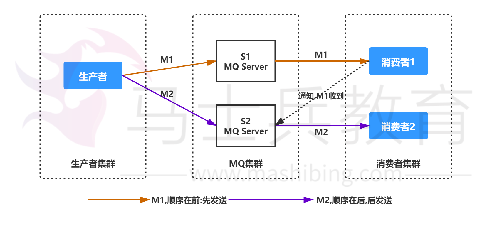
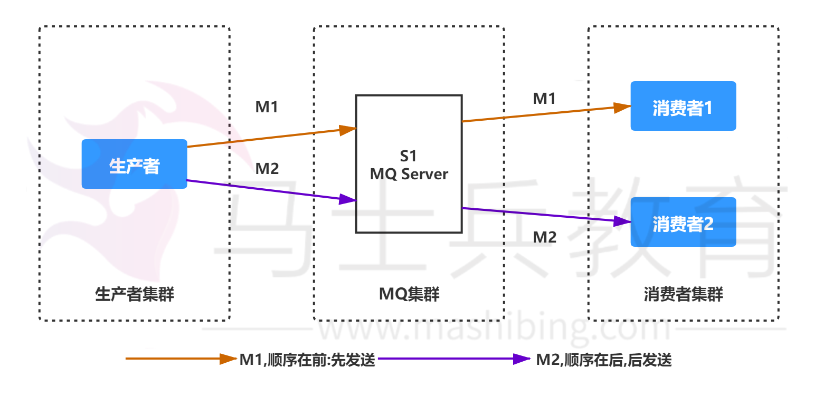
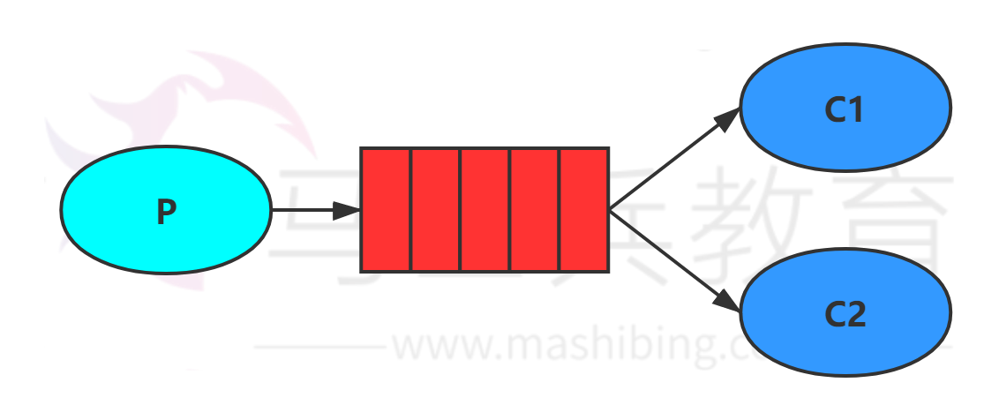
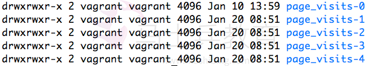
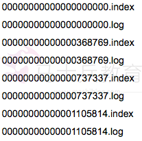

## 为什么使用MQ？MQ的优点 

### 简答 

- 异步处理 - 相比于传统的串行、并行方式，提高了系统吞吐量。 
- 应用解耦 - 系统间通过消息通信，不用关心其他系统的处理。 
- 流量削锋 - 可以通过消息队列长度控制请求量；可以缓解短时间内的高并发请 求。 
- 日志处理 - 解决大量日志传输。 
- 消息通讯 - 消息队列一般都内置了高效的通信机制，因此也可以用在纯的消息通 讯。比如实现点对点消息队列，或者聊天室等。 

### 详答 

主要是：解耦、异步、削峰。 

**解耦：**A 系统发送数据到 BCD 三个系统，通过接口调用发送。如果 E 系统也要 这个数据呢？那如果 C 系统现在不需要了呢？A 系统负责人几乎崩溃…A 系统 跟其它各种乱七八糟的系统严重耦合，A 系统产生一条比较关键的数据，很多系 统都需要 A 系统将这个数据发送过来。如果使用 MQ，A 系统产生一条数据， 发送到 MQ 里面去，哪个系统需要数据自己去 MQ 里面消费。如果新系统需要 数据，直接从 MQ 里消费即可；如果某个系统不需要这条数据了，就取消对  MQ 消息的消费即可。这样下来，A 系统压根儿不需要去考虑要给谁发送数 据，不需要维护这个代码，也不需要考虑人家是否调用成功、失败超时等情况。 就是一个系统或者一个模块，调用了多个系统或者模块，互相之间的调用很复 杂，维护起来很麻烦。但是其实这个调用是不需要直接同步调用接口的，如果用  MQ 给它异步化解耦。 

**异步：**A 系统接收一个请求，需要在自己本地写库，还需要在 BCD 三个系统写 库，自己本地写库要 3ms，BCD 三个系统分别写库要 300ms、450ms、 200ms。最终请求总延时是 3 + 300 + 450 + 200 = 953ms，接近 1s，用户 感觉搞个什么东西，慢死了慢死了。用户通过浏览器发起请求。如果使用  MQ，那么 A 系统连续发送 3 条消息到 MQ 队列中，假如耗时 5ms，A 系统从 接受一个请求到返回响应给用户，总时长是 3 + 5 = 8ms。 

**削峰：**减少高峰时期对服务器压力。

## 消息队列有什么优缺点？

优点上面已经说了，就是**在特殊场景下有其对应的好处，解耦、异步、削峰。 **

缺点有以下几个： 

系统可用性降低 

本来系统运行好好的，现在你非要加入个消息队列进去，那消息队列挂了，你的 系统不是呵呵了。因此，系统可用性会降低； 

系统复杂度提高 

加入了消息队列，要多考虑很多方面的问题，比如：一致性问题、如何保证消息 不被重复消费、如何保证消息可靠性传输等。因此，需要考虑的东西更多，复杂 性增大。 

一致性问题 

A 系统处理完了直接返回成功了，人都以为你这个请求就成功了；但是问题是， 要是 BCD 三个系统那里，BD 两个系统写库成功了，结果 C 系统写库失败了， 咋整？你这数据就不一致了。 

所以消息队列实际是一种非常复杂的架构，你引入它有很多好处，但是也得针对 它带来的坏处做各种额外的技术方案和架构来规避掉，做好之后，你会发现，妈 呀，系统复杂度提升了一个数量级，也许是复杂了 10 倍。但是关键时刻，用， 还是得用的。 

## 你们公司生产环境用的是什么消息中间件？ 

这个首先你可以说下你们公司选用的是什么消息中间件，比如用的是 RabbitMQ，然后可以初步给一些你对不同MQ中间件技术的选型分析。 

举个例子：比如说ActiveMQ是老牌的消息中间件，国内很多公司过去运用的还 是非常广泛的，功能很强大。 

但是问题在于没法确认ActiveMQ可以支撑互联网公司的高并发、高负载以及高 吞吐的复杂场景，在国内互联网公司落地较少。而且使用较多的是一些传统企 业，用ActiveMQ做异步调用和系统解耦。

然后你可以说说RabbitMQ，他的好处在于可以支撑高并发、高吞吐、性能很 高，同时有非常完善便捷的后台管理界面可以使用。 

另外，他还支持集群化、高可用部署架构、消息高可靠支持，功能较为完善。

而且经过调研，国内各大互联网公司落地大规模RabbitMQ集群支撑自身业务的 case较多，国内各种中小型互联网公司使用RabbitMQ的实践也比较多。 

除此之外，RabbitMQ的开源社区很活跃，较高频率的迭代版本，来修复发现的 bug以及进行各种优化，因此综合考虑过后，公司采取了RabbitMQ。 

但是RabbitMQ也有一点缺陷，就是他自身是基于erlang语言开发的，所以导致 较为难以分析里面的源码，也较难进行深层次的源码定制和改造，毕竟需要较为 扎实的erlang语言功底才可以。 

然后可以聊聊RocketMQ，是阿里开源的，经过阿里的生产环境的超高并发、 高吞吐的考验，性能卓越，同时还支持分布式事务等特殊场景。 

而且RocketMQ是基于Java语言开发的，适合深入阅读源码，有需要可以站在 源码层面解决线上生产问题，包括源码的二次开发和改造。 

另外就是Kafka。Kafka提供的消息中间件的功能明显较少一些，相对上述几款 MQ中间件要少很多。 

但是Kafka的优势在于专为超高吞吐量的实时日志采集、实时数据同步、实时数 据计算等场景来设计。 

因此Kafka在大数据领域中配合实时计算技术（比如Spark Streaming、 Storm、Flink）使用的较多。但是在传统的MQ中间件使用场景中较少采用。 

## Kafka、ActiveMQ、RabbitMQ、RocketMQ 有 什么优缺点？ 

|             | ActiveMQ                                                     | RabbitMQ                                                     | RocketMQ                                                     | Kafka                                                        | ZeroMQ               |
| ----------- | ------------------------------------------------------------ | ------------------------------------------------------------ | ------------------------------------------------------------ | ------------------------------------------------------------ | -------------------- |
| 单机吞吐 量 | 比 RabbitM Q低                                               | 2.6w/s（ 消息做持 久化）                                     | 11.6w/s                                                      | 17.3w/s                                                      | 29w/s                |
| 开发语言    | Java                                                         | Erlang                                                       | Java                                                         | Scala/Java                                                   | C                    |
| 主要维护者  | Apache                                                       | Mozilla/Spring                                               | Alibaba                                                      | Apache                                                       | iMatix创始人已去世   |
| 成熟度      | 成熟                                                         | 成熟                                                         | 开源版本不够成熟                                             | 比较成熟                                                     | 只有C、PHP等版本成熟 |
| 订阅形式    | 点对点 (p2p)、广 播（发布订阅）                              | 提供了4 种： direct,  topic,Headers 和 fanout。 fanout就是广播模 式 | 基于 topic/me ssageTag 以及按照消息类 型、属性 进行正则匹配的发布订阅模式 | 基于topic 以及按照 topic进行 正则匹配的发布订 阅模式         | 点对点(P2P)          |
| 持久化      | 支持少量 堆积                                                | 支持少量 堆积                                                | 支持大量 堆积                                                | 支持大量 堆积                                                | 不支持               |
| 顺序消息    | 不支持                                                       | 不支持                                                       | 支持                                                         | 支持                                                         | 不支持               |
| 性能稳定 性 | 好                                                           | 好                                                           | 一般                                                         | 较差                                                         | 很好                 |
| 集群方式    | 支持简单 集群模 式，比 如’主备’，对 高级集群 模式支持 不好。 | 支持简单 集群，'复 制’模 式，对高 级集群模 式支持不 好。     | 常用 多 对’Mast erSlave’ 模 式，开源 版本需手 动切换 Slave变成 Master | 天然 的‘Lead erSlave’无 状态集 群，每台 服务器既 是Master 也是Slave | 不支持               |
| 管理界面    | 一般                                                         | 较好                                                         | 一般                                                         | 无                                                           | 无                   |

综上，各种对比之后，有如下建议： 

一般的业务系统要引入 MQ，最早大家都用 ActiveMQ，但是现在确实大家用 的不多了，没经过大规模吞吐量场景的验证，社区也不是很活跃，所以大家还是 算了吧，我个人不推荐用这个了； 

后来大家开始用 RabbitMQ，但是确实 erlang 语言阻止了大量的 Java 工程师 去深入研究和掌控它，对公司而言，几乎处于不可控的状态，但是确实人家是开 源的，比较稳定的支持，活跃度也高； 

不过现在确实越来越多的公司会去用 RocketMQ，确实很不错，毕竟是阿里出 品，但社区可能有突然黄掉的风险（目前 RocketMQ 已捐给 [Apache](https://github.com/apache/rocketmq)，但  GitHub 上的活跃度其实不算高）对自己公司技术实力有绝对自信的，推荐用  RocketMQ，否则回去老老实实用 RabbitMQ 吧，人家有活跃的开源社区，绝 对不会黄。 

所以**中小型公司**，技术实力较为一般，技术挑战不是特别高，用 RabbitMQ 是 不错的选择；**大型公司**，基础架构研发实力较强，用 RocketMQ 是很好的选 择。

如果是**大数据领域**的实时计算、日志采集等场景，用 Kafka 是业内标准的，绝 对没问题，社区活跃度很高，绝对不会黄，何况几乎是全世界这个领域的事实性 规范。 

## MQ 有哪些常见问题？如何解决这些问题？ 

MQ 的常见问题有： 

1. 消息的顺序问题 
2. 消息的重复问题 

**消息的顺序问题 **

消息有序指的是可以按照消息的发送顺序来消费。 

假如生产者产生了 2 条消息：M1、M2，假定 M1 发送到 S1，M2 发送到  S2，如果要保证 M1 先于 M2 被消费，怎么做？



解决方案： （1）保证生产者 - MQServer - 消费者是一对一对一的关系



缺陷：

- 并行度就会成为消息系统的瓶颈（吞吐量不够） 
- 更多的异常处理，比如：只要消费端出现问题，就会导致整个处理流程阻塞，我 们不得不花费更多的精力来解决阻塞的问题。（2）通过合理的设计或者将问题分解 来规避。 
- 不关注乱序的应用实际大量存在 
- 队列无序并不意味着消息无序 所以从业务层面来保证消息的顺序而不仅仅是依 赖于消息系统，是一种更合理的方式。 

**消息的重复问题 **

造成消息重复的根本原因是：网络不可达。 

所以解决这个问题的办法就是绕过这个问题。那么问题就变成了：如果消费端收 到两条一样的消息，应该怎样处理？ 

消费端处理消息的业务逻辑保持幂等性。只要保持幂等性，不管来多少条重复消 息，最后处理的结果都一样。保证每条消息都有唯一编号且保证消息处理成功与 去重表的日志同时出现。利用一张日志表来记录已经处理成功的消息的 ID，如 果新到的消息 ID 已经在日志表中，那么就不再处理这条消息。 

## 什么是RabbitMQ？ 

RabbitMQ是一款开源的，Erlang编写的，基于AMQP协议的消息中间件 

## Rabbitmq 的使用场景 

（1）服务间异步通信

（2）顺序消费 

（3）定时任务 

（4）请求削峰 

## RabbitMQ基本概念 

- Broker： 简单来说就是消息队列服务器实体 
- Exchange： 消息交换机，它指定消息按什么规则，路由到哪个队列 
- Queue： 消息队列载体，每个消息都会被投入到一个或多个队列 
- Binding： 绑定，它的作用就是把exchange和queue按照路由规则绑定起来 
- Routing Key： 路由关键字，exchange根据这个关键字进行消息投递 
- VHost： vhost 可以理解为虚拟 broker ，即 mini-RabbitMQ server。其内部 均含有独立的 queue、exchange 和 binding 等，但最最重要的是，其拥有独立的 权限系统，可以做到 vhost 范围的用户控制。当然，从 RabbitMQ 的全局角度， vhost 可以作为不同权限隔离的手段（一个典型的例子就是不同的应用可以跑在不同 的 vhost 中）。 
- Producer： 消息生产者，就是投递消息的程序 
- Consumer： 消息消费者，就是接受消息的程序 
- Channel： 消息通道，在客户端的每个连接里，可建立多个channel，每个 channel代表一个会话任务 

由Exchange、Queue、RoutingKey三个才能决定一个从Exchange到Queue的 唯一的线路。 

## RabbitMQ的工作模式 

### 一.simple模式（即最简单的收发模式）



1.消息产生消息，将消息放入队列 

2.消息的消费者(consumer) 监听 消息队列,如果队列中有消息,就消费掉,消息被 拿走后,自动从队列中删除(隐患 消息可能没有被消费者正确处理,已经从队列中消失了,造成消息的丢失，这里可以设置成手动的ack,但如果设置成手动ack，处 理完后要及时发送ack消息给队列，否则会造成内存溢出)。 

### 二.work工作模式(资源的竞争)


1.消息产生者将消息放入队列消费者可以有多个,消费者1,消费者2同时监听同一 个队列,消息被消费。C1 C2共同争抢当前的消息队列内容,谁先拿到谁负责消费 消息(隐患：高并发情况下,默认会产生某一个消息被多个消费者共同使用,可以设 置一个开关(syncronize) 保证一条消息只能被一个消费者使用)。 

### 三.publish/subscribe发布订阅(共享资源)

.png)1、每个消费者监听自己的队列； 

2、生产者将消息发给broker，由交换机将消息转发到绑定此交换机的每个队 列，每个绑定交换机的队列都将接收到消息。 

### 四.routing路由模式

1.消息生产者将消息发送给交换机按照路由判断,路由是字符串(info) 当前产生的 消息携带路由字符(对象的方法),交换机根据路由的key,只能匹配上路由key对应的消息队列,对应的消费者才能消费消息; 

2.根据业务功能定义路由字符串 

3.从系统的代码逻辑中获取对应的功能字符串,将消息任务扔到对应的队列中。

4.业务场景:error 通知;EXCEPTION;错误通知的功能;传统意义的错误通知;客户 通知;利用key路由,可以将程序中的错误封装成消息传入到消息队列中,开发者可 以自定义消费者,实时接收错误;

### 五.topic 主题模式(路由模式的一种)

.png)
1.星号井号代表通配符 

2.星号代表多个单词,井号代表一个单词 

3.路由功能添加模糊匹配 

4.消息产生者产生消息,把消息交给交换机 

5.交换机根据key的规则模糊匹配到对应的队列,由队列的监听消费者接收消息消 费 

（在我的理解看来就是routing查询的一种模糊匹配，就类似sql的模糊查询方 式） 

## 如何保证RabbitMQ消息的顺序性？ 

拆分多个 queue，每个 queue 一个 consumer，就是多一些 queue 而已，确 实是麻烦点；或者就一个 queue 但是对应一个 consumer，然后这个  consumer 内部用内存队列做排队，然后分发给底层不同的 worker 来处理。 

# 消息如何分发？

若该队列至少有一个消费者订阅，消息将以循环（round-robin）的方式发送给消费者。每条消息只会分发给一个订阅的消费者（前提是消费者能够正常处理消息并进行确认）。通过路由可实现多消费的功能

# 消息怎么路由？

消息提供方->路由->一至多个队列消息发布到交换器时，消息将拥有一个路由键（routing key），在消息创建时设定。通过队列路由键，可以把队列绑定到交换器上。消息到达交换器后，RabbitMQ 会将消息的路由键与队列的路由键进行匹配（针对不同的交换器有不同的路由规则）；常用的交换器主要分为一下三种： fanout：如果交换器收到消息，将会广播到所有绑定的队列上 direct：如果路由键完全匹配，消息就被投递到相应的队列

topic：可以使来自不同源头的消息能够到达同一个队列。 使用 topic 交换器时，可以使用通配符

# 消息基于什么传输？

由于 TCP 连接的创建和销毁开销较大，且并发数受系统资源限制，会造成性能瓶颈。RabbitMQ 使用信道的方式来传输数据。信道是建立在真实的 TCP 连接内的虚拟连接，且每条 TCP 连接上的信道数量没有限制。

# 如何保证消息不被重复消费？或者说，如何保证消息消费时的幂等性？

先说为什么会重复消费：正常情况下，消费者在消费消息的时候，消费完毕后，会发送一个确认消息给消息队列，消息队列就知道该消息被消费了，就会将该消息从消息队列中删除；但是因为网络传输等等故障，确认信息没有传送到消息队列，导致消息队列不知道自己已经消费过该消息了，再次将消息分发给其他的消费者。

针对以上问题，一个解决思路是：保证消息的唯一性，就算是多次传输，不要让消息的多次消费带来影响；保证消息等幂性；比如：在写入消息队列的数据做唯一标示，消费消息时，根据唯一标识判断是否消费过；假设你有个系统，消费一条消息就往数据库里插入一条数据，要是你一个消息重复两次，你不就插入了两条，这数据不就错了？但是你要是消费到第二次的时据，从而保证了数据的正确性。

自己判断一下是否已经消费过了，若是就直接扔了，这样不就保留了一条数如何确保消息正确地发送至 RabbitMQ

#  如何确保消息接收方消费了消息？

发送方确认模式将信道设置成 confirm 模式（发送方确认模式），则所有在信道上发布的消息都会被指派一个唯一的 ID。

一旦消息被投递到目的队列后，或者消息被写入磁盘后（可持久化的消息），信道会发送一个确认给生产者（包含消息唯一 ID）。

如果 RabbitMQ 发生内部错误从而导致消息丢失，会发送一条 nack（notacknowledged，未确认）消息。

发送方确认模式是异步的，生产者应用程序在等待确认的同时，可以继续发送消息。当确认消息到达生产者应用程序，生产者应用程序的回调方法就会被触发来处理确认消息。接收方确认机制消费者接收每一条消息后都必须进行确认（消息接收和消息确认是两个不同操作）。只有消费者确认了消息，RabbitMQ 才能安全地把消息从队列中删除。

这里并没有用到超时机制，RabbitMQ 仅通过 Consumer 的连接中断来确认是否需要重新发送消息。也就是说，只要连接不中断，RabbitMQ 给了 

Consumer 足够长的时间来处理消息。保证数据的最终一致性；下面罗列几种特殊情况

-  如果消费者接收到消息，在确认之前断开了连接或取消订阅，RabbitMQ 会认为消息没有被分发，然后重新分发给下一个订阅的消费者。（可能存在消息重复消费的隐患，需要去重）
-  如果消费者接收到消息却没有确认消息，连接也未断开，则 RabbitMQ 认为该消费者繁忙，将不会给该消费者分发更多的消息。

# 如何保证RabbitMQ消息的可靠传输？

消息不可靠的情况可能是消息丢失，劫持等原因；丢失又分为：生产者丢失消息、消息列表丢失消息、消费者丢失消息；生产者丢失消息：从生产者弄丢数据这个角度来看，RabbitMQ提供 transaction和confirm模式来确保生产者不丢消息；

​	1:transaction机制就是说：发送消息前，开启事务（channel.txSelect()）,然后发送消息，如果发送过程中出现什么异常，事务就会回滚

（channel.txRollback()）,如果发送成功则提交事务（channel.txCommit()）。然而，这种方式有个缺点：吞吐量下降；

​	2:confirm模式用的居多：一旦channel进入confirm模式，所有在该信道上发布的消息都将会被指派一个唯一的ID（从1开始），一旦消息被投递到所有匹配的队列之后；rabbitMQ就会发送一个ACK给生产者（包含消息的唯一ID），这就使得生产者知道消息已经正确到达目的队列了；如果rabbitMQ没能处理该消息，则会发送一个Nack消息给你，你可以进行重试操作。

消息队列丢数据：消息持久化。

处理消息队列丢数据的情况，一般是开启持久化磁盘的配置。

这个持久化配置可以和confirm机制配合使用，你可以在消息持久化磁盘后，再给生产者发送一个Ack信号。

这样，如果消息持久化磁盘之前，rabbitMQ阵亡了，那么生产者收不到Ack信号，生产者会自动重发。

那么如何持久化呢？

这里顺便说一下吧，其实也很容易，就下面两步

\1. 将queue的持久化标识durable设置为true,则代表是一个持久的队列

\2. 发送消息的时候将deliveryMode=2

这样设置以后，即使rabbitMQ挂了，重启后也能恢复数据消费者丢失消息：消费者丢数据一般是因为采用了自动确认消息模式，改为手动确认消息即可！消费者在收到消息之后，处理消息之前，会自动回复RabbitMQ已收到消息；如果这时处理消息失败，就会丢失该消息；解决方案：处理消息成功后，手动回复确认消息。

# 为什么不应该对所有的 message 都使用持久化机制？

首先，必然导致性能的下降，因为写磁盘比写 RAM 慢的多，message 的吞吐量可能有 10 倍的差距。

其次，message 的持久化机制用在 RabbitMQ 的内置 cluster 方案时会出现“坑爹”问题。矛盾点在于，若 message 设置了 persistent 属性，但 queue 未设置 durable 属性，那么当该 queue 的 owner node 出现异常后，在未重建该 queue 前，发往该 queue 的 message 将被 blackholed ；若 message 设置了 persistent 属性，同时 queue 也设置了 durable 属性，那么当 queue 的 owner node 异常且无法重启的情况下，则该 queue 无法在其他 node 上重建，只能等待其 owner node 重启后，才能恢复该 queue 的使用，而在这段时间内发送给该 queue 的 message 将被 blackholed 。

所以，是否要对 message 进行持久化，需要综合考虑性能需要，以及可能遇到的问题。若想达到 100,000 条/秒以上的消息吞吐量（单 RabbitMQ 服务

器），则要么使用其他的方式来确保 message 的可靠 delivery ，要么使用非常快速的存储系统以支持全持久化（例如使用 SSD）。另外一种处理原则是：

仅对关键消息作持久化处理（根据业务重要程度），且应该保证关键消息的量不会导致性能瓶颈。

# 如何保证高可用的？RabbitMQ 的集群

RabbitMQ 是比较有代表性的，因为是基于主从（非分布式）做高可用性的，

我们就以 RabbitMQ 为例子讲解第一种 MQ 的高可用性怎么实现。RabbitMQ 有三种模式：单机模式、普通集群模式、镜像集群模式。

单机模式，就是 Demo 级别的，一般就是你本地启动了玩玩儿的?，没人生产用单机模式普通集群模式，意思就是在多台机器上启动多个 RabbitMQ 实例，每个机器启动一个。你创建的 queue，只会放在一个 RabbitMQ 实例上，但是每个实例都同步 queue 的元数据（元数据可以认为是 queue 的一些配置信息，通过元数据，可以找到 queue 所在实例）。你消费的时候，实际上如果连接到了另外一个实例，那么那个实例会从 queue 所在实例上拉取数据过来。这方案主要是提高吞吐量的，就是说让集群中多个节点来服务某个 queue 的读写操作。

镜像集群模式：这种模式，才是所谓的 RabbitMQ 的高可用模式。跟普通集群模式不一样的是，在镜像集群模式下，你创建的 queue，无论元数据还是 queue 里的消息都会存在于多个实例上，就是说，每个 RabbitMQ 节点都有这个 queue 的一个完整镜像，包含 queue 的全部数据的意思。然后每次你写消息到 queue 的时候，都会自动把消息同步到多个实例的 queue 上。

RabbitMQ 有很好的管理控制台，就是在后台新增一个策略，这个策略是镜像集群模式的策略，指定的时候是可以要求数据同步到所有节点的，也可以要求同步到指定数量的节点，再次创建 queue 的时候，应用这个策略，就会自动将数据同步到其他的节点上去了。这样的话，好处在于，你任何一个机器宕机了，没事儿，其它机器（节点）还包含了这个 queue 的完整数据，别的 consumer 都可以到其它节点上去消费数据。坏处在于，第一，这个性能开销也太大了吧，消息需要同步到所有机器上，导致网络带宽压力和消耗很重！RabbitMQ 一个 queue 的数据都是放在一个节点里的，镜像集群下，也是每个节点都放这个queue 的完整数据。 

如何解决消息队列的延时以及过期失效问题？消息队列满了以后该怎么处理？有几百万消息持续积压几小时，说说怎么解决？

消息积压处理办法：临时紧急扩容：

先修复 consumer 的问题，确保其恢复消费速度，然后将现有 cnosumer 都停掉。

新建一个 topic，partition 是原来的 10 倍，临时建立好原先 10 倍的 queue 数量。

然后写一个临时的分发数据的 consumer 程序，这个程序部署上去消费积压的

数据，消费之后不做耗时的处理，直接均匀轮询写入临时建立好的 10 倍数量的 queue。

接着临时征用 10 倍的机器来部署 consumer，每一批 consumer 消费一个临时 queue 的数据。这种做法相当于是临时将 queue 资源和 consumer 资源扩大 10 倍，以正常的 10 倍速度来消费数据。

等快速消费完积压数据之后，得恢复原先部署的架构，重新用原先的 consumer 机器来消费消息。

MQ中消息失效：假设你用的是 RabbitMQ，RabbtiMQ 是可以设置过期时间

的，也就是 TTL。如果消息在 queue 中积压超过一定的时间就会被 RabbitMQ 给清理掉，这个数据就没了。那这就是第二个坑了。这就不是说数据会大量积压在 mq 里，而是大量的数据会直接搞丢。我们可以采取一个方案，就是批量重导，这个我们之前线上也有类似的场景干过。就是大量积压的时候，我们当时就直接丢弃数据了，然后等过了高峰期以后，比如大家一起喝咖啡熬夜到晚上12 点以后，用户都睡觉了。这个时候我们就开始写程序，将丢失的那批数据，写个临时程序，一点一点的查出来，然后重新灌入 mq 里面去，把白天丢的数据给他补回来。也只能是这样了。假设 1 万个订单积压在 mq 里面，没有处理，其中 1000 个订单都丢了，你只能手动写程序把那 1000 个订单给查出来，手动发到 mq 里去再补一次。

mq消息队列块满了：如果消息积压在 mq 里，你很长时间都没有处理掉，此时导致 mq 都快写满了，咋办？这个还有别的办法吗？没有，谁让你第一个方案执行的太慢了，你临时写程序，接入数据来消费，消费一个丢弃一个，都不要

了，快速消费掉所有的消息。然后走第二个方案，到了晚上再补数据吧。

# 设计MQ思路

比如说这个消息队列系统，我们从以下几个角度来考虑一下：首先这个 mq 得支持可伸缩性吧，就是需要的时候快速扩容，就可以增加吞吐量和容量，那怎么搞？设计个分布式的系统呗，参照一下 kafka 的设计理念，

broker -> topic -> partition，每个 partition 放一个机器，就存一部分数据。

如果现在资源不够了，简单啊，给 topic 增加 partition，然后做数据迁移，增加机器，不就可以存放更多数据，提供更高的吞吐量了？其次你得考虑一下这个 mq 的数据要不要落地磁盘吧？那肯定要了，落磁盘才能保证别进程挂了数据就丢了。那落磁盘的时候怎么落啊？顺序写，这样就没有

磁盘随机读写的寻址开销，磁盘顺序读写的性能是很高的，这就是 kafka 的思路。

其次你考虑一下你的 mq 的可用性啊？这个事儿，具体参考之前可用性那个环节讲解的 kafka 的高可用保障机制。多副本 -> leader & follower -> broker 挂了重新选举 leader 即可对外服务。

能不能支持数据 0 丢失啊？可以的，参考我们之前说的那个 kafka 数据零丢失方案。

# Kafka


## 1.Kafka 的设计时什么样的呢？

Kafka 将消息以 topic 为单位进行归纳

将向 Kafka topic 发布消息的程序成为 producers.

将预订 topics 并消费消息的程序成为 consumer.

Kafka 以集群的方式运行，可以由一个或多个服务组成，每个服务叫做一个 broker. 

producers 通过网络将消息发送到 Kafka 集群，集群向消费者提供消息

## 2.数据传输的事物定义有哪三种？

数据传输的事务定义通常有以下三种级别：

（1）最多一次: 消息不会被重复发送，最多被传输一次，但也有可能一次不传输

（2）最少一次: 消息不会被漏发送，最少被传输一次，但也有可能被重复传输.

（3）精确的一次（Exactly once）:不会漏传输也不会重复传输,每个消息都传输被一次而且仅仅被传输一次，这是大家所期望的

## 3.Kafka 判断一个节点是否还活着有那两个条件？

（1）节点必须可以维护和 ZooKeeper 的连接，Zookeeper 通过心跳机制检查每个节点的连接

（2）如果节点是个 follower,他必须能及时的同步 leader 的写操作，延时不能太久

## 4.kafka producer 是否直接将数据发送到 broker 的 leader(主节点)？

producer 直接将数据发送到 broker 的 leader(主节点)，不需要在多个节点进行分发，为了帮助 producer 做到这点，所有的 Kafka 节点都可以及时的告知:哪些节点是活动的，目标topic 目标分区的 leader 在哪。这样 producer 就可以直接将消息发送到目的地了

## 5、Kafa consumer 是否可以消费指定分区消息？

Kafaconsumer 消费消息时，向 broker 发出"fetch"请求去消费特定分区的消息，consumer 指定消息在日志中的偏移量（offset），就可以消费从这个位置开始的消息，customer 拥有了 offset 的控制权，可以向后回滚去重新消费之前的消息，这是很有意义的

## 6、Kafka 消息是采用 Pull 模式，还是 Push 模式？

Kafka 最初考虑的问题是，customer 应该从 brokes 拉取消息还是 brokers 将消息推送到consumer，也就是 pull 还 push。在这方面，Kafka 遵循了一种大部分消息系统共同的传统的设计：producer 将消息推送到 broker，consumer 从 broker 拉取消息,一些消息系统比如 Scribe 和 ApacheFlume 采用了 push 模式，将消息推送到下游的 consumer。这样做有好处也有坏处：由 broker 决定消息推送的速率，对于不同消费速率的 consumer 就不太好处理了。消息系统都致力于让 consumer 以最大的速率最快速的消费消息，但不幸的是，push 模式下，当 broker 推送的速率远大于 consumer 消费的速率时， consumer 恐怕就要崩溃了。最终 Kafka 还是选取了传统的 pull 模式

Pull 模式的另外一个好处是 consumer 可以自主决定是否批量的从 broker 拉取数据。Push 模式必须在不知道下游 consumer 消费能力和消费策略的情况下决定是立即推送每条消息还是缓存之后批量推送。如果为了避免 consumer 崩溃而采用较低的推送速率，将可能导致一次只推送较少的消息而造成浪费。Pull 模式下，consumer 就可以根据自己的消费能力去决定这些策略

Pull 有个缺点是，如果 broker 没有可供消费的消息，将导致 consumer 不断在循环中轮询， 直到新消息到 t 达。为了避免这点，Kafka 有个参数可以让 consumer 阻塞知道新消息到达(当然也可以阻塞知道消息的数量达到某个特定的量这样就可以批量发)

## 7.Kafka 存储在硬盘上的消息格式是什么？

消息由一个固定长度的头部和可变长度的字节数组组成。头部包含了一个版本号和 CRC32校验码。

·消息长度: 4 bytes (value: 1+4+n)

·版本号: 1 byte

·CRC 校验码: 4 bytes

·具体的消息: n bytes

## 8.Kafka 高效文件存储设计特点：

(1).Kafka 把 topic 中一个 parition 大文件分成多个小文件段，通过多个小文件段，就容易定期清除或删除已经消费完文件，减少磁盘占用。

(2).通过索引信息可以快速定位 message 和确定 response 的最大大小。

(3).通过 index 元数据全部映射到 memory，可以避免 segment file 的 IO 磁盘操作。

(4).通过索引文件稀疏存储，可以大幅降低 index 文件元数据占用空间大小。

## 9.Kafka 与传统消息系统之间有三个关键区别

(1).Kafka 持久化日志，这些日志可以被重复读取和无限期保留

(2).Kafka 是一个分布式系统：它以集群的方式运行，可以灵活伸缩，在内部通过复制数据提升容错能力和高可用性

(3).Kafka 支持实时的流式处理

## 10.Kafka 创建 Topic 时如何将分区放置到不同的 Broker 中

·副本因子不能大于 Broker 的个数；

·第一个分区（编号为 0）的第一个副本放置位置是随机从 brokerList 选择的；

·其他分区的第一个副本放置位置相对于第 0 个分区依次往后移。也就是如果我们有 5 个Broker，5 个分区，假设第一个分区放在第四个 Broker 上，那么第二个分区将会放在第五个Broker上；第三个分区将会放在第一个Broker上；第四个分区将会放在第二个Broker 上，依次类推；

·剩余的副本相对于第一个副本放置位置其实是由 nextReplicaShift 决定的，而这个数也是随机产生的

## 11.Kafka 新建的分区会在哪个目录下创建

在启动 Kafka 集群之前，我们需要配置好 log.dirs 参数，其值是 Kafka 数据的存放目录， 这个参数可以配置多个目录，目录之间使用逗号分隔，通常这些目录是分布在不同的磁盘上用于提高读写性能。

## 12.KAFKA：如何做到1秒发布百万级条消息

KAFKA：如何做到1秒发布百万级条消息。

KAFKA是分布式发布-订阅消息系统，是一个分布式的，可划分的，冗余备份的持久性的日志服务。它主要用于处理活跃的流式数据。

现在被广泛地应用于构建实时数据管道和流应用的场景中，具有横向扩展，容错，快等优点，并已经运行在众多大中型公司的生产环境中，成功应用于大数据领域，本文分享一下我所了解的KAFKA。

### 1.KAFKA高吞吐率性能揭秘

KAFKA的第一个突出特定就是“快”，而且是那种变态的“快”，在普通廉价的虚拟机器上，比如一般SAS盘做的虚拟机上，据LINDEDIN统计，最新的数据是每天利用KAFKA处理的消息超过1万亿条，在峰值时每秒钟会发布超过百万条消息，就算是在内存和CPU都不高的情况下，Kafka的速度最高可以达到每秒十万条数据，并且还能持久化存储。

作为消息队列，要承接读跟写两块的功能，首先是写，就是消息日志写入KAFKA，那么，KAFKA在“写”上是怎么做到写变态快呢?

#### 1.1 KAFKA让代码飞起来之写得快

首先，可以使用KAFKA提供的生产端API发布消息到1个或多个Topic(主题)的一个(保证数据的顺序)或者多个分区(并行处理，但不一定保证数据顺序)。Topic可以简单理解成一个数据类别，是用来区分不同数据的。

KAFKA维护一个Topic中的分区log，以顺序追加的方式向各个分区中写入消息，每个分区都是不可变的消息队列。分区中的消息都是以k-v形式存在。

? k表示offset，称之为偏移量，一个64位整型的唯一标识，offset代表了Topic分区中所有消息流中该消息的起始字节位置。

? v就是实际的消息内容，每个分区中的每个offset都是唯一存在的，所有分区的消息都是一次写入，在消息未过期之前都可以调整offset来实现多次读取。

以上提到KAFKA“快”的第一个因素：消息顺序写入磁盘。

我们知道现在的磁盘大多数都还是机械结构(SSD不在讨论的范围内)，如果将消息以随机写的方式存入磁盘，就会按柱面、磁头、扇区的方式进行(寻址过程)，缓慢的机械运动(相对内存)会消耗大量时间，导致磁盘的写入速度只能达到内存写入速度的几百万分之一，为了规避随机写带来的时间消耗，KAFKA采取顺序写的方式存储数据，如下图所示：


新来的消息只能追加到已有消息的末尾，并且已经生产的消息不支持随机删除以及随机访问，但是消费者可以通过重置offset的方式来访问已经消费过的数据。

即使顺序读写，过于频繁的大量小I/O操作一样会造成磁盘的瓶颈，所以KAFKA在此处的处理是把这些消息集合在一起批量发送，这样减少对磁盘IO的过度读写，而不是一次发送单个消息。

另一个是无效率的字节复制，尤其是在负载比较高的情况下影响是显着的。为了避免这种情况，KAFKA采用由Producer，broker和consumer共享的标准化二进制消息格式，这样数据块就可以在它们之间自由传输，无需转换，降低了字节复制的成本开销。

同时，KAFKA采用了MMAP(Memory Mapped Files，内存映射文件)技术。很多现代操作系统都大量使用主存做磁盘缓存，一个现代操作系统可以将内存中的所有剩余空间用作磁盘缓存，而当内存回收的时候几乎没有性能损失。

由于KAFKA是基于JVM的，并且任何与Java内存使用打过交道的人都知道两件事：

? 对象的内存开销非常高，通常是实际要存储数据大小的两倍;

? 随着数据的增加，java的垃圾收集也会越来越频繁并且缓慢。

基于此，使用文件系统，同时依赖页面缓存就比使用其他数据结构和维护内存缓存更有吸引力：

? 不使用进程内缓存，就腾出了内存空间，可以用来存放页面缓存的空间几乎可以翻倍。

? 如果KAFKA重启，进行内缓存就会丢失，但是使用操作系统的页面缓存依然可以继续使用。

可能有人会问KAFKA如此频繁利用页面缓存，如果内存大小不够了怎么办?

KAFKA会将数据写入到持久化日志中而不是刷新到磁盘。实际上它只是转移到了内核的页面缓存。

利用文件系统并且依靠页缓存比维护一个内存缓存或者其他结构要好，它可以直接利用操作系统的页缓存来实现文件到物理内存的直接映射。完成映射之后对物理内存的操作在适当时候会被同步到硬盘上。

#### 1.2 KAFKA让代码飞起来之读得快

KAFKA除了接收数据时写得快，另外一个特点就是推送数据时发得快。

KAFKA这种消息队列在生产端和消费端分别采取的push和pull的方式，也就是你生产端可以认为KAFKA是个无底洞，有多少数据可以使劲往里面推送，消费端则是根据自己的消费能力，需要多少数据，你自己过来KAFKA这里拉取，KAFKA能保证只要这里有数据，消费端需要多少，都尽可以自己过来拿。

▲零拷贝

具体到消息的落地保存，broker维护的消息日志本身就是文件的目录，每个文件都是二进制保存，生产者和消费者使用相同的格式来处理。维护这个公共的格式并允许优化最重要的操作：网络传输持久性日志块。 现代的unix操作系统提供一个优化的代码路径，用于将数据从页缓存传输到socket;在[Linux](https://www.2cto.com/os/linux/)中，是通过sendfile系统调用来完成的。Java提供了访问这个系统调用的方法：FileChannel.transferTo API。

要理解senfile的影响，重要的是要了解将数据从文件传输到socket的公共数据路径，如下图所示，数据从磁盘传输到socket要经过以下几个步骤：


? 操作系统将数据从磁盘读入到内核空间的页缓存

? 应用程序将数据从内核空间读入到用户空间缓存中

? 应用程序将数据写回到内核空间到socket缓存中

? 操作系统将数据从socket缓冲区复制到网卡缓冲区，以便将数据经网络发出

这里有四次拷贝，两次系统调用，这是非常低效的做法。如果使用sendfile，只需要一次拷贝就行：允许操作系统将数据直接从页缓存发送到网络上。所以在这个优化的路径中，只有最后一步将数据拷贝到网卡缓存中是需要的。


常规文件传输和zeroCopy方式的性能对比：


假设一个Topic有多个消费者的情况， 并使用上面的零拷贝优化，数据被复制到页缓存中一次，并在每个消费上重复使用，而不是存储在存储器中，也不在每次读取时复制到用户空间。 这使得以接近网络连接限制的速度消费消息。

这种页缓存和sendfile组合，意味着KAFKA集群的消费者大多数都完全从缓存消费消息，而磁盘没有任何读取活动。

▲批量压缩

在很多情况下，系统的瓶颈不是CPU或磁盘，而是网络带宽，对于需要在广域网上的数据中心之间发送消息的数据流水线尤其如此。所以数据压缩就很重要。可以每个消息都压缩，但是压缩率相对很低。所以KAFKA使用了批量压缩，即将多个消息一起压缩而不是单个消息压缩。

KAFKA允许使用递归的消息集合，批量的消息可以通过压缩的形式传输并且在日志中也可以保持压缩格式，直到被消费者解压缩。

KAFKA支持Gzip和Snappy压缩协议。

2 KAFKA数据可靠性深度解读


KAFKA的消息保存在Topic中，Topic可分为多个分区，为保证数据的安全性，每个分区又有多个Replia。

? 多分区的设计的特点：

1.为了并发读写，加快读写速度;

2.是利用多分区的存储，利于数据的均衡;

3.是为了加快数据的恢复速率，一但某台机器挂了，整个集群只需要恢复一部分数据，可加快故障恢复的时间。


每个Partition分为多个Segment，每个Segment有.log和.index 两个文件，每个log文件承载具体的数据，每条消息都有一个递增的offset，Index文件是对log文件的索引，Consumer查找offset时使用的是二分法根据文件名去定位到哪个Segment，然后解析msg，匹配到对应的offset的msg。

2.1 Partition recovery过程

每个Partition会在磁盘记录一个RecoveryPoint,，记录已经flush到磁盘的最大offset。当broker 失败重启时，会进行loadLogs。首先会读取该Partition的RecoveryPoint，找到包含RecoveryPoint的segment及以后的segment， 这些segment就是可能没有完全flush到磁盘segments。然后调用segment的recover，重新读取各个segment的msg，并重建索引。每次重启KAFKA的broker时，都可以在输出的日志看到重建各个索引的过程。

2.2 数据同步

Producer和Consumer都只与Leader交互，每个Follower从Leader拉取数据进行同步。


如上图所示，ISR是所有不落后的replica集合，不落后有两层含义：距离上次FetchRequest的时间不大于某一个值或落后的消息数不大于某一个值，Leader失败后会从ISR中随机选取一个Follower做Leader，该过程对用户是透明的。

当Producer向Broker发送数据时,可以通过request.required.acks参数设置数据可靠性的级别。

此配置是表明当一次Producer请求被认为完成时的确认值。特别是，多少个其他brokers必须已经提交了数据到它们的log并且向它们的Leader确认了这些信息。

?典型的值：

0： 表示Producer从来不等待来自broker的确认信息。这个选择提供了最小的时延但同时风险最大(因为当server宕机时，数据将会丢失)。

1：表示获得Leader replica已经接收了数据的确认信息。这个选择时延较小同时确保了server确认接收成功。

-1：Producer会获得所有同步replicas都收到数据的确认。同时时延最大，然而，这种方式并没有完全消除丢失消息的风险，因为同步replicas的数量可能是1。如果你想确保某些replicas接收到数据，那么你应该在Topic-level设置中选项min.insync.replicas设置一下。

仅设置 acks= -1 也不能保证数据不丢失,当ISR列表中只有Leader时,同样有可能造成数据丢失。要保证数据不丢除了设置acks=-1，还要保证ISR的大小大于等于2。

?具体参数设置：

request.required.acks:设置为-1 等待所有ISR列表中的Replica接收到消息后采算写成功。

min.insync.replicas: 设置为>=2,保证ISR中至少两个Replica。

Producer：要在吞吐率和数据可靠性之间做一个权衡。

KAFKA作为现代消息中间件中的佼佼者，以其速度和高可靠性赢得了广大市场和用户青睐，其中的很多设计理念都是非常值得我们学习的，本文所介绍的也只是冰山一角，希望能够对大家了解KAFKA有一定的作用。

## 13.kafka的log存储解析——topic的分区partition分段segment以及索引等

Kafka中的Message是以topic为基本单位组织的，不同的topic之间是相互独立的。每个topic又可以分成几个不同的partition(每个topic有几个partition是在创建topic时指定的)，每个partition存储一部分Message。借用官方的一张图，可以直观地看到topic和partition的关系。


partition是以文件的形式存储在文件系统中，比如，创建了一个名为page_visits的topic，其有5个partition，那么在Kafka的数据目录中(由配置文件中的log.dirs指定的)中就有这样5个目录: page_visits-0， page_visits-1，page_visits-2，page_visits-3，page_visits-4，其命名规则为<topic_name>-<partition_id>，里面存储的分别就是这5个partition的数据。

接下来，本文将分析partition目录中的文件的存储格式和相关的代码所在的位置。

### 1.Partition的数据文件

Partition中的每条Message由offset来表示它在这个partition中的偏移量，这个offset不是该Message在partition数据文件中的实际存储位置，而是逻辑上一个值，它唯一确定了partition中的一条Message。因此，可以认为offset是partition中Message的id。partition中的每条Message包含了以下三个属性：

- offset
- MessageSize
- data

其中offset为long型，MessageSize为int32，表示data有多大，data为message的具体内容。它的格式和Kafka通讯协议中介绍的MessageSet格式是一致。

Partition的数据文件则包含了若干条上述格式的Message，按offset由小到大排列在一起。它的实现类为FileMessageSet，类图如下：

它的主要方法如下：

- append: 把给定的ByteBufferMessageSet中的Message写入到这个数据文件中。
- searchFor: 从指定的startingPosition开始搜索找到第一个Message其offset是大于或者等于指定的offset，并返回其在文件中的位置Position。它的实现方式是从startingPosition开始读取12个字节，分别是当前MessageSet的offset和size。如果当前offset小于指定的offset，那么将position向后移动LogOverHead+MessageSize（其中LogOverHead为offset+messagesize，为12个字节）。
- read：准确名字应该是slice，它截取其中一部分返回一个新的FileMessageSet。它不保证截取的位置数据的完整性。
- sizeInBytes: 表示这个FileMessageSet占有了多少字节的空间。
- truncateTo: 把这个文件截断，这个方法不保证截断位置的Message的完整性。
- readInto: 从指定的相对位置开始把文件的内容读取到对应的ByteBuffer中。

我们来思考一下，如果一个partition只有一个数据文件会怎么样？

1. 新数据是添加在文件末尾（调用FileMessageSet的append方法），不论文件数据文件有多大，这个操作永远都是O(1)的。
2. 查找某个offset的Message（调用FileMessageSet的searchFor方法）是顺序查找的。因此，如果数据文件很大的话，查找的效率就低。

那Kafka是如何解决查找效率的的问题呢？有两大法宝：1) 分段 2) 索引。

### 2.数据文件的分段

Kafka解决查询效率的手段之一是将数据文件分段，比如有100条Message，它们的offset是从0到99。假设将数据文件分成5段，第一段为0-19，第二段为20-39，以此类推，每段放在一个单独的数据文件里面，数据文件以该段中最小的offset命名。这样在查找指定offset的Message的时候，用二分查找就可以定位到该Message在哪个段中。

### 3.为数据文件建索引

数据文件分段使得可以在一个较小的数据文件中查找对应offset的Message了，但是这依然需要顺序扫描才能找到对应offset的Message。为了进一步提高查找的效率，Kafka为每个分段后的数据文件建立了索引文件，文件名与数据文件的名字是一样的，只是文件扩展名为.index。
索引文件中包含若干个索引条目，每个条目表示数据文件中一条Message的索引。索引包含两个部分（均为4个字节的数字），分别为相对offset和position。

- 相对offset：因为数据文件分段以后，每个数据文件的起始offset不为0，相对offset表示这条Message相对于其所属数据文件中最小的offset的大小。举例，分段后的一个数据文件的offset是从20开始，那么offset为25的Message在index文件中的相对offset就是25-20 = 5。存储相对offset可以减小索引文件占用的空间。
- position，表示该条Message在数据文件中的绝对位置。只要打开文件并移动文件指针到这个position就可以读取对应的Message了。

index文件中并没有为数据文件中的每条Message建立索引，而是采用了稀疏存储的方式，每隔一定字节的数据建立一条索引。这样避免了索引文件占用过多的空间，从而可以将索引文件保留在内存中。但缺点是没有建立索引的Message也不能一次定位到其在数据文件的位置，从而需要做一次顺序扫描，但是这次顺序扫描的范围就很小了。

在Kafka中，索引文件的实现类为OffsetIndex，它的类图如下：


主要的方法有：

- append方法，添加一对offset和position到index文件中，这里的offset将会被转成相对的offset。
- lookup, 用二分查找的方式去查找小于或等于给定offset的最大的那个offset

### 4.小结

我们以几张图来总结一下Message是如何在Kafka中存储的，以及如何查找指定offset的Message的。

Message是按照topic来组织，每个topic可以分成多个的partition，比如：有5个partition的名为为page_visits的topic的目录结构为：


partition是分段的，每个段叫LogSegment，包括了一个数据文件和一个索引文件，下图是某个partition目录下的文件：

可以看到，这个partition有4个LogSegment。

一张图来展示是如何查找Message的。

比如：要查找绝对offset为7的Message：

1. 首先是用二分查找确定它是在哪个LogSegment中，自然是在第一个Segment中。
2. 打开这个Segment的index文件，也是用二分查找找到offset小于或者等于指定offset的索引条目中最大的那个offset。自然offset为6的那个索引是我们要找的，通过索引文件我们知道offset为6的Message在数据文件中的位置为9807。
3. 打开数据文件，从位置为9807的那个地方开始顺序扫描直到找到offset为7的那条Message。

这套机制是建立在offset是有序的。索引文件被映射到内存中，所以查找的速度还是很快的。

一句话，Kafka的Message存储采用了分区(partition)，分段(LogSegment)和稀疏索引(.index文件)这几个手段来达到了高效性。

## 14：Kafka高效的文件存储设计


### Kafka是什么

> Kafka是最初由Linkedin公司开发，是一个分布式、分区的、多副本的、多订阅者，基于zookeeper协调的分布式日志系统(也可以当做MQ系统)，常见可以用于web/nginx日志、访问日志，消息服务等等，Linkedin于2010年贡献给了Apache基金会并成为顶级开源项目。

一个商业化消息队列的性能好坏，其文件存储机制设计是衡量一个消息队列服务技术水平和最关键指标之一。
下面将从Kafka文件存储机制和物理结构角度，分析Kafka是如何实现高效文件存储，及实际应用效果。

### 1.Kafka文件存储机制

Kafka部分名词解释如下：

- Broker：消息中间件处理结点，一个Kafka节点就是一个broker，多个broker可以组成一个Kafka集群。
- Topic：一类消息，例如page view日志、click日志等都可以以topic的形式存在，Kafka集群能够同时负责多个topic的分发。
- Partition：topic物理上的分组，一个topic可以分为多个partition，每个partition是一个有序的队列。
- Segment：partition物理上由多个segment组成，下面2.2和2.3有详细说明。
- offset：每个partition都由一系列有序的、不可变的消息组成，这些消息被连续的追加到partition中。partition中的每个消息都有一个连续的序列号叫做offset,用于partition唯一标识一条消息.

分析过程分为以下4个步骤：

- topic中partition存储分布
- partiton中文件存储方式
- partiton中segment文件存储结构
- 在partition中如何通过offset查找message

通过上述4过程详细分析，我们就可以清楚认识到kafka文件存储机制的奥秘。

### 2.1 topic中partition存储分布

假设实验环境中Kafka集群只有一个broker，xxx/message-folder为数据文件存储根目录，在Kafka broker中server.properties文件配置(参数log.dirs=xxx/message-folder)，例如创建2个topic名称分别为report_push、launch_info, partitions数量都为partitions=4
存储路径和目录规则为：
xxx/message-folder

```
              |--report_push-0
              |--report_push-1
              |--report_push-2
              |--report_push-3
              |--launch_info-0
              |--launch_info-1
              |--launch_info-2
              |--launch_info-3
```

在Kafka文件存储中，同一个topic下有多个不同partition，每个partition为一个目录，partiton命名规则为topic名称+有序序号，第一个partiton序号从0开始，序号最大值为partitions数量减1。


### 2.2 partiton中文件存储方式

下面示意图形象说明了partition中文件存储方式:


- 每个partion(目录)相当于一个巨型文件被平均分配到多个大小相等segment(段)数据文件中。但每个段segment file消息数量不一定相等，这种特性方便old segment file快速被删除。
- 每个partiton只需要支持顺序读写就行了，segment文件生命周期由服务端配置参数决定。

这样做的好处就是能快速删除无用文件，有效提高磁盘利用率。

### 2.3 partiton中segment文件存储结构

读者从2.2节了解到Kafka文件系统partition存储方式，本节深入分析partion中segment file组成和物理结构。

- segment file组成：由2大部分组成，分别为index file和data file，此2个文件一一对应，成对出现，后缀".index"和“.log”分别表示为segment索引文件、数据文件.

- segment文件命名规则：partion全局的第一个segment从0开始，后续每个segment文件名为上一个segment文件最后一条消息的offset值。数值最大为64位long大小，19位数字字符长度，没有数字用0填充。

  

下面文件列表是笔者在Kafka broker上做的一个实验，创建一个topicXXX包含1 partition，设置每个segment大小为500MB,并启动producer向Kafka broker写入大量数据,如下图2所示segment文件列表形象说明了上述2个规则：

以上述一对segment file文件为例，说明segment中index<—->data file对应关系物理结构如下：

上述索引文件存储大量元数据，数据文件存储大量消息，索引文件中元数据指向对应数据文件中message的物理偏移地址。
其中以索引文件中元数据3,497为例，依次在数据文件中表示第3个message(在全局partiton表示第368772个message)、以及该消息的物理偏移地址为497。

从上述了解到segment data file由许多message组成，下面详细说明message物理结构：
参数说明：

| 关键字              | 解释说明                                                     |
| ------------------- | ------------------------------------------------------------ |
| 8 byte offset       | 在parition(分区)内的每条消息都有一个有序的id号，这个id号被称为偏移(offset),它可以唯一确定每条消息在parition(分区)内的位置。即offset表示partiion的第多少message |
| 4 byte message size | message大小                                                  |
| 4 byte CRC32        | 用crc32校验message                                           |
| 1 byte “magic"      | 表示本次发布Kafka服务程序协议版本号                          |
| 1 byte “attributes" | 表示为独立版本、或标识压缩类型、或编码类型。                 |
| 4 byte key length   | 表示key的长度,当key为-1时，K byte key字段不填                |
| K byte key          | 可选                                                         |
| value bytes payload | 表示实际消息数据。                                           |

### 2.4 在partition中如何通过offset查找message

例如读取offset=368776的message，需要通过下面2个步骤查找。


- 第一步查找segment file
  上述图2为例，其中00000000000000000000.index表示最开始的文件，起始偏移量(offset)为0.第二个文件00000000000000368769.index的消息量起始偏移量为368770 = 368769 + 1.同样，第三个文件00000000000000737337.index的起始偏移量为737338=737337 + 1，其他后续文件依次类推，以起始偏移量命名并排序这些文件，只要根据offset **二分查找**文件列表，就可以快速定位到具体文件。
  当offset=368776时定位到00000000000000368769.index|log
- 第二步通过segment file查找message
  通过第一步定位到segment file，当offset=368776时，依次定位到00000000000000368769.index的元数据物理位置和00000000000000368769.log的物理偏移地址，然后再通过00000000000000368769.log顺序查找直到offset=368776为止。

从上述图3可知这样做的优点，segment index file采取稀疏索引存储方式，它减少索引文件大小，通过mmap可以直接内存操作，稀疏索引为数据文件的每个对应message设置一个元数据指针,它比稠密索引节省了更多的存储空间，但查找起来需要消耗更多的时间。

### 3 Kafka文件存储机制–实际运行效果

实验环境：

- Kafka集群：由2台虚拟机组成
- cpu：4核
- 物理内存：8GB
- 网卡：千兆网卡
- jvm heap: 4GB
- ​           

从上述可以看出，Kafka运行时很少有大量读磁盘的操作，主要是定期批量写磁盘操作，因此操作磁盘很高效。这跟Kafka文件存储中读写message的设计是息息相关的。Kafka中读写message有如下特点:

写message

- 消息从java堆转入page cache(即物理内存)。
- 由异步线程刷盘,消息从page cache刷入磁盘。

读message

- 消息直接从page cache转入socket发送出去。
- 当从page cache没有找到相应数据时，此时会产生磁盘IO,从磁
  盘Load消息到page cache,然后直接从socket发出去

### 4.总结

Kafka高效文件存储设计特点

- Kafka把topic中一个parition大文件分成多个小文件段，通过多个小文件段，就容易定期清除或删除已经消费完文件，减少磁盘占用。
- 通过索引信息可以快速定位message和确定response的最大大小。
- 通过index元数据全部映射到memory，可以避免segment file的IO磁盘操作。
- 通过索引文件稀疏存储，可以大幅降低index文件元数据占用空间大小。

 kafka与传统的消息中间件对比


**RabbitMQ和kafka从几个角度简单的对比**

业界对于消息的传递有多种方案和产品，本文就比较有代表性的两个MQ(rabbitMQ,kafka)进行阐述和做简单的对比，

在应用场景方面，

RabbitMQ,遵循AMQP协议，由内在高并发的erlanng语言开发，用在实时的对可靠性要求比较高的消息传递上。

kafka是Linkedin于2010年12月份开源的消息发布订阅系统,它主要用于处理活跃的流式数据,大数据量的数据处理上。

1)在架构模型方面，

RabbitMQ遵循AMQP协议，RabbitMQ的broker由Exchange,Binding,queue组成，其中exchange和binding组成了消息的路由键；客户端Producer通过连接channel和server进行通信，Consumer从queue获取消息进行消费（长连接，queue有消息会推送到consumer端，consumer循环从输入流读取数据）。rabbitMQ以broker为中心；有消息的确认机制。

kafka遵从一般的MQ结构，producer，broker，consumer，以consumer为中心，消息的消费信息保存的客户端consumer上，consumer根据消费的点，从broker上批量pull数据；无消息确认机制。

2)在吞吐量，

kafka具有高的吞吐量，内部采用消息的批量处理，zero-copy机制，数据的存储和获取是本地磁盘顺序批量操作，具有O(1)的复杂度，消息处理的效率很高。

rabbitMQ在吞吐量方面稍逊于kafka，他们的出发点不一样，rabbitMQ支持对消息的可靠的传递，支持事务，不支持批量的操作；基于存储的可靠性的要求存储可以采用内存或者硬盘。

3)在可用性方面，

rabbitMQ支持miror的queue，主queue失效，miror queue接管。

kafka的broker支持主备模式。

4)在集群负载均衡方面，

kafka采用zookeeper对集群中的broker、consumer进行管理，可以注册topic到zookeeper上；通过zookeeper的协调机制，producer保存对应topic的broker信息，可以随机或者轮询发送到broker上；并且producer可以基于语义指定分片，消息发送到broker的某分片上。

rabbitMQ的负载均衡需要单独的loadbalancer进行支持。


## 15.Kafka 对比 ActiveMQ

Kafka 是LinkedIn 开发的一个高性能、分布式的消息系统，广泛用于日志收集、流式数据处理、在线和离线消息分发等场景。虽然不是作为传统的MQ来设计，在大部分情况，Kafaka 也可以代替原先ActiveMQ 等传统的消息系统。

Kafka 将消息流按Topic 组织，保存消息的服务器称为Broker，消费者可以订阅一个或者多个Topic。为了均衡负载，一个Topic 的消息又可以划分到多个分区(Partition)，分区越多，Kafka并行能力和吞吐量越高。

Kafka 集群需要zookeeper 支持来实现集群，最新的kafka 发行包中已经包含了zookeeper，部署的时候可以在一台服务器上同时启动一个zookeeper Server 和 一个Kafka Server，也可以使用已有的其他zookeeper集群。

和传统的MQ不同，消费者需要自己保留一个offset，从kafka 获取消息时，只拉去当前offset 以后的消息。Kafka 的scala/java 版的client 已经实现了这部分的逻辑，将offset 保存到zookeeper 上。每个消费者可以选择一个id，同样id 的消费者对于同一条消息只会收到一次。一个Topic 的消费者如果都使用相同的id，就是传统的 Queue；如果每个消费者都使用不同的id, 就是传统的pub-sub.

　　ActiveMQ和Kafka，前者完全实现了JMS的规范，后者看上去有一些“野路子”，并没有纠结于JMS规范，剑走偏锋的设计了另一套吞吐非常高的分布式发布-订阅消息系统，目前非常流行。接下来我们结合三个点（消息安全性，服务器的稳定性容错性以及吞吐量）来分别谈谈这两个消息中间件。今天我们谈Kafka，[ActiveMQ的文章在此。](http://www.liubey.org/mq-activemq/)

　　**01 性能怪兽Kafka**
　　Kafka是LinkedIn开源的分布式发布-订阅消息系统，目前归属于Apache定级项目。”Apache Kafka is publish-subscribe messaging rethought as a distributed commit log.”，官网首页的一句话高度概括其职责。Kafka并没有遵守JMS规范，他只用文件系统来管理消息的生命周期。Kafka的设计目标是：
（1）以时间复杂度为O(1)的方式提供消息持久化能力，即使对TB级以上数据也能保证常数时间复杂度的访问性能。
（2）高吞吐率。即使在非常廉价的商用机器上也能做到单机支持每秒100K条以上消息的传输。
（3）支持Kafka Server间的消息分区，及分布式消费，同时保证每个Partition内的消息顺序传输。
（4）同时支持离线数据处理和实时数据处理。
（5）Scale out：支持在线水平扩展。
　　所以，不像AMQ，Kafka从设计开始极为高可用为目的，天然HA。broker支持集群，消息亦支持负载均衡，还有副本机制。同样，Kafka也是使用Zookeeper管理集群节点信息，包括consumer的消费信息也是保存在zk中，下面我们分话题来谈：
**1）消息的安全性**
Kafka集群中的Leader负责某一topic的某一partition的消息的读写，理论上consumer和producer只与该Leader 节点打交道，一个集群里的某一broker即是Leader的同时也可以担当某一partition的follower，即Replica。Kafka分配Replica的算法如下：
（1）将所有Broker（假设共n个Broker）和待分配的Partition排序
（2）将第i个Partition分配到第（i mod n）个Broker上
（3）将第i个Partition的第j个Replica分配到第（(i + j) mode n）个Broker上
同时，Kafka与Replica既非同步也不是严格意义上的异步。一个典型的Kafka发送-消费消息的过程如下：首先首先Producer消息发送给某Topic的某Partition的Leader，Leader先是将消息写入本地Log，同时follower（如果落后过多将会被踢出出 Replica列表）从Leader上pull消息，并且在未写入log的同时即向Leader发送ACK的反馈，所以对于某一条已经算作commit的消息来讲，在某一时刻，其存在于Leader的log中，以及Replica的内存中。这可以算作一个危险的情况（听起来吓人），因为如果此时集群挂了这条消息就算丢失了，但结合producer的属性（request.required.acks=2 当所有follower都收到消息后返回ack）可以保证在绝大多数情况下消息的安全性。当消息算作commit的时候才会暴露给consumer，并保证at-least-once的投递原则。
**2）服务的稳定容错性**
前面提到过，Kafka天然支持HA，整个leader/follower机制通过zookeeper调度，它在所有broker中选出一个 controller，所有Partition的Leader选举都由controller决定，同时controller也负责增删Topic以及 Replica的重新分配。如果Leader挂了，集群将在ISR（in-sync replicas）中选出新的Leader，选举基本原则是：新的Leader必须拥有原来的Leader commit过的所有消息。假如所有的follower都挂了，Kafka会选择第一个“活”过来的Replica（不一定是ISR中的）作为 Leader，因为如果此时等待ISR中的Replica是有风险的，假如所有的ISR都无法“活”，那此partition将会变成不可用。
**3） 吞吐量**
Leader节点负责某一topic（可以分成多个partition）的某一partition的消息的读写，任何发布到此partition的消息都会被直接追加到log文件的尾部，因为每条消息都被append到该partition中，是顺序写磁盘，因此效率非常高（经验证，顺序写磁盘效率比随机写内存还要高，这是Kafka高吞吐率的一个很重要的保证），同时通过合理的partition，消息可以均匀的分布在不同的partition里面。 Kafka基于时间或者partition的大小来删除消息，同时broker是无状态的，consumer的消费状态(offset)是由 consumer自己控制的（每一个consumer实例只会消费某一个或多个特定partition的数据，而某个partition的数据只会被某一个特定的consumer实例所消费），也不需要broker通过锁机制去控制消息的消费，所以吞吐量惊人，这也是Kafka吸引人的地方。
最后说下由于zookeeper引起的脑裂（Split Brain）问题：每个consumer分别单独通过Zookeeper判断哪些partition down了，那么不同consumer从Zookeeper“看”到的view就可能不一样，这就会造成错误的reblance尝试。而且有可能所有的 consumer都认为rebalance已经完成了，但实际上可能并非如此。

 

如果在MQ的场景下，将Kafka 和 ActiveMQ 相比:

### Kafka 的优点

分布式可高可扩展。Kafka 集群可以透明的扩展，增加新的服务器进集群。

高性能。Kafka 的性能大大超过传统的ActiveMQ、RabbitMQ等MQ 实现，尤其是Kafka 还支持batch 操作。下图是linkedin 的消费者性能压测结果:


容错。Kafka每个Partition的数据都会复制到几台服务器上。当某个Broker故障失效时，ZooKeeper服务将通知生产者和消费者，生产者和消费者转而使用其它Broker。

**Kafka 的不利**

重复消息。Kafka 只保证每个消息至少会送达一次，虽然几率很小，但一条消息有可能会被送达多次。 
消息乱序。虽然一个Partition 内部的消息是保证有序的，但是如果一个Topic 有多个Partition，Partition 之间的消息送达不保证有序。 
复杂性。Kafka需要zookeeper 集群的支持，Topic通常需要人工来创建，部署和维护较一般消息队列成本更高

# Rocket


### 一、Consumer 批量消费（推模式）

可以通过

```
consumer.setConsumeMessageBatchMaxSize(10);//每次拉取10条  
```

这里需要分为2种情况

-  Consumer端先启动  
-  Consumer端后启动.  正常情况下：应该是Consumer需要先启动

注意：如果broker采用推模式的话，consumer先启动，会一条一条消息的消费，consumer后启动会才用批量消费 

Consumer端先启动

**1、Consumer.java**


```java
package quickstart;   
import java.util.List;    
import com.alibaba.rocketmq.client.consumer.DefaultMQPushConsumer;  
import com.alibaba.rocketmq.client.consumer.listener.ConsumeConcurrentlyContext;  
import com.alibaba.rocketmq.client.consumer.listener.ConsumeConcurrentlyStatus;  
import com.alibaba.rocketmq.client.consumer.listener.MessageListenerConcurrently;  
import com.alibaba.rocketmq.client.exception.MQClientException;  
import com.alibaba.rocketmq.common.consumer.ConsumeFromWhere;  
import com.alibaba.rocketmq.common.message.MessageExt;    
/** 
 * Consumer，订阅消息 
 */  
public class Consumer {    
    public static void main(String[] args) throws InterruptedException, MQClientException {  
        DefaultMQPushConsumer consumer = new DefaultMQPushConsumer("please_rename_unique_group_name_4");  
        consumer.setNamesrvAddr("192.168.100.145:9876;192.168.100.146:9876");  
        consumer.setConsumeMessageBatchMaxSize(10);  
        /** 
         * 设置Consumer第一次启动是从队列头部开始消费还是队列尾部开始消费<br> 
         * 如果非第一次启动，那么按照上次消费的位置继续消费 ,（消费顺序消息的时候设置）
         */  
        consumer.setConsumeFromWhere(ConsumeFromWhere.CONSUME_FROM_FIRST_OFFSET);    
        consumer.subscribe("TopicTest", "*");    
        consumer.registerMessageListener(new MessageListenerConcurrently() {    
            public ConsumeConcurrentlyStatus consumeMessage(List<MessageExt> msgs, ConsumeConcurrentlyContext context) {  
                  
                try {  
                    System.out.println("msgs的长度" + msgs.size());  
                    System.out.println(Thread.currentThread().getName() + " Receive New Messages: " + msgs);  
                } catch (Exception e) {  
                    e.printStackTrace();  
                    return ConsumeConcurrentlyStatus.RECONSUME_LATER;  
                }  
                          
                return ConsumeConcurrentlyStatus.CONSUME_SUCCESS;  
            }  
        });  
  
        consumer.start();  
  
        System.out.println("Consumer Started.");  
    }  
}  
```


由于这里是Consumer先启动，所以他回去轮询MQ上是否有订阅队列的消息，由于每次producer插入一条，Consumer就拿一条所以测试结果如下（每次size都是1）

**2、Consumer端后启动，也就是Producer先启动**

由于这里是Consumer后启动，所以MQ上也就堆积了一堆数据，Consumer的

```
consumer.setConsumeMessageBatchMaxSize(10);//每次拉取10条    
```

### 二、消息重试机制：消息重试分为2种

- ### 1、Producer端重试

- ### 2、Consumer端重试

**1、Producer端重试** 

也就是Producer往MQ上发消息没有发送成功，我们可以设置发送失败重试的次数,发送并触发回调函数


```java
          //设置重试的次数  
            producer.setRetryTimesWhenSendFailed(3);  
            //开启生产者  
            producer.start();  
            //创建一条消息  
            Message msg = new Message("PushTopic", "push", "1",   "我是一条普通消息".getBytes());  
            //发送消息  
            SendResult result = producer.send(msg);  
            //发送，并触发回调函数  
            producer.send(msg, new SendCallback() {  
                  
                @Override  
                //成功的回调函数  
                public void onSuccess(SendResult sendResult) {  
                    System.out.println(sendResult.getSendStatus());  
                    System.out.println("成功了");  
                }  
                  
                @Override  
                //出现异常的回调函数  
                public void onException(Throwable e) {  
                System.out.println("失败了"+e.getMessage());  
                      
                }  
            }); 
```

**2、Consumer端重试**

**2.1、exception的情况，一般重复16次 10s、30s、1分钟、2分钟、3分钟等等**

上面的代码中消费异常的情况返回

return ConsumeConcurrentlyStatus.RECONSUME_LATER;//重试

正常则返回：

return ConsumeConcurrentlyStatus.CONSUME_SUCCESS;//成功

```java
package quickstart;  
  
  
import java.util.List;  
  
import com.alibaba.rocketmq.client.consumer.DefaultMQPushConsumer;  
import com.alibaba.rocketmq.client.consumer.listener.ConsumeConcurrentlyContext;  
import com.alibaba.rocketmq.client.consumer.listener.ConsumeConcurrentlyStatus;  
import com.alibaba.rocketmq.client.consumer.listener.MessageListenerConcurrently;  
import com.alibaba.rocketmq.client.exception.MQClientException;  
import com.alibaba.rocketmq.common.consumer.ConsumeFromWhere;  
import com.alibaba.rocketmq.common.message.MessageExt;  
  
/** 
 * Consumer，订阅消息 
 */  
public class Consumer {  
  
    public static void main(String[] args) throws InterruptedException, MQClientException {  
        DefaultMQPushConsumer consumer = new DefaultMQPushConsumer("please_rename_unique_group_name_4");  
        consumer.setNamesrvAddr("192.168.100.145:9876;192.168.100.146:9876");  
        consumer.setConsumeMessageBatchMaxSize(10);  
        /** 
         * 设置Consumer第一次启动是从队列头部开始消费还是队列尾部开始消费<br> 
         * 如果非第一次启动，那么按照上次消费的位置继续消费 
         */  
        consumer.setConsumeFromWhere(ConsumeFromWhere.CONSUME_FROM_FIRST_OFFSET);  
  
        consumer.subscribe("TopicTest", "*");  
  
        consumer.registerMessageListener(new MessageListenerConcurrently() {  
  
            public ConsumeConcurrentlyStatus consumeMessage(List<MessageExt> msgs, ConsumeConcurrentlyContext context) {  
  
                try {  
                    // System.out.println("msgs的长度" + msgs.size());  
                    System.out.println(Thread.currentThread().getName() + " Receive New Messages: " + msgs);  
                    for (MessageExt msg : msgs) {  
                        String msgbody = new String(msg.getBody(), "utf-8");  
                        if (msgbody.equals("Hello RocketMQ 4")) {  
                            System.out.println("======错误=======");  
                            int a = 1 / 0;  
                        }  
                    }  
  
                } catch (Exception e) {  
                    e.printStackTrace();  
                    if(msgs.get(0).getReconsumeTimes()==3){  
                        //记录日志  
                          
                        return ConsumeConcurrentlyStatus.CONSUME_SUCCESS;// 成功  
                    }else{  
                          
                    return ConsumeConcurrentlyStatus.RECONSUME_LATER;// 重试  
                    }  
                }  
  
                return ConsumeConcurrentlyStatus.CONSUME_SUCCESS;// 成功  
            }  
        });  
  
        consumer.start();  
  
        System.out.println("Consumer Started.");  
    }  
}  
```


假如超过了多少次之后我们可以让他不再重试记录 日志。

if(msgs.get(0).getReconsumeTimes()==3){
//记录日志  
return ConsumeConcurrentlyStatus.CONSUME_SUCCESS;// 成功
}

**2.2超时的情况，这种情况MQ会无限制的发送给消费端。**

就是由于网络的情况，MQ发送数据之后，Consumer端并没有收到导致超时。也就是消费端没有给我返回return 任何状态，这样的就认为没有到达Consumer端。

这里模拟Producer只发送一条数据。consumer端暂停1分钟并且不发送接收状态给MQ

 


```
package model;  
  
import java.util.List;  
  
import com.alibaba.rocketmq.client.consumer.DefaultMQPushConsumer;  
import com.alibaba.rocketmq.client.consumer.listener.ConsumeConcurrentlyContext;  
import com.alibaba.rocketmq.client.consumer.listener.ConsumeConcurrentlyStatus;  
import com.alibaba.rocketmq.client.consumer.listener.MessageListenerConcurrently;  
import com.alibaba.rocketmq.client.exception.MQClientException;  
import com.alibaba.rocketmq.common.consumer.ConsumeFromWhere;  
import com.alibaba.rocketmq.common.message.MessageExt;  
  
/** 
 * Consumer，订阅消息 
 */  
public class Consumer {  
  
    public static void main(String[] args) throws InterruptedException, MQClientException {  
        DefaultMQPushConsumer consumer = new DefaultMQPushConsumer("message_consumer");  
        consumer.setNamesrvAddr("192.168.100.145:9876;192.168.100.146:9876");  
        consumer.setConsumeMessageBatchMaxSize(10);  
        /** 
         * 设置Consumer第一次启动是从队列头部开始消费还是队列尾部开始消费<br> 
         * 如果非第一次启动，那么按照上次消费的位置继续消费 
         */  
        consumer.setConsumeFromWhere(ConsumeFromWhere.CONSUME_FROM_FIRST_OFFSET);  
  
        consumer.subscribe("TopicTest", "*");  
  
        consumer.registerMessageListener(new MessageListenerConcurrently() {  
  
            public ConsumeConcurrentlyStatus consumeMessage(List<MessageExt> msgs, ConsumeConcurrentlyContext context) {  
  
                try {  
  
                    // 表示业务处理时间  
                    System.out.println("=========开始暂停===============");  
                    Thread.sleep(60000);  
  
                    for (MessageExt msg : msgs) {  
                        System.out.println(" Receive New Messages: " + msg);  
                    }  
  
                } catch (Exception e) {  
                    e.printStackTrace();  
                    return ConsumeConcurrentlyStatus.RECONSUME_LATER;// 重试  
                }  
  
                return ConsumeConcurrentlyStatus.CONSUME_SUCCESS;// 成功  
            }  
        });  
  
        consumer.start();  
  
        System.out.println("Consumer Started.");  
    }  
}  
 
```

### 三、消费模式

**1、集群消费**

**2、广播消费**

rocketMQ默认是集群消费,我们可以通过在Consumer来支持广播消费

```
consumer.setMessageModel(MessageModel.BROADCASTING);// 广播消费
```

 


```
package model;  
  
import java.util.List;  
  
import com.alibaba.rocketmq.client.consumer.DefaultMQPushConsumer;  
import com.alibaba.rocketmq.client.consumer.listener.ConsumeConcurrentlyContext;  
import com.alibaba.rocketmq.client.consumer.listener.ConsumeConcurrentlyStatus;  
import com.alibaba.rocketmq.client.consumer.listener.MessageListenerConcurrently;  
import com.alibaba.rocketmq.client.exception.MQClientException;  
import com.alibaba.rocketmq.common.consumer.ConsumeFromWhere;  
import com.alibaba.rocketmq.common.message.MessageExt;  
import com.alibaba.rocketmq.common.protocol.heartbeat.MessageModel;  
  
/** 
 * Consumer，订阅消息 
 */  
public class Consumer2 {  
  
    public static void main(String[] args) throws InterruptedException, MQClientException {  
        DefaultMQPushConsumer consumer = new DefaultMQPushConsumer("message_consumer");  
        consumer.setNamesrvAddr("192.168.100.145:9876;192.168.100.146:9876");  
        consumer.setConsumeMessageBatchMaxSize(10);  
        consumer.setMessageModel(MessageModel.BROADCASTING);// 广播消费  
      
        consumer.setConsumeFromWhere(ConsumeFromWhere.CONSUME_FROM_FIRST_OFFSET);  
  
        consumer.subscribe("TopicTest", "*");  
  
        consumer.registerMessageListener(new MessageListenerConcurrently() {  
  
            public ConsumeConcurrentlyStatus consumeMessage(List<MessageExt> msgs, ConsumeConcurrentlyContext context) {  
  
                try {  
  
                    for (MessageExt msg : msgs) {  
                        System.out.println(" Receive New Messages: " + msg);  
                    }  
  
                } catch (Exception e) {  
                    e.printStackTrace();  
                    return ConsumeConcurrentlyStatus.RECONSUME_LATER;// 重试  
                }  
  
                return ConsumeConcurrentlyStatus.CONSUME_SUCCESS;// 成功  
            }  
        });  
  
        consumer.start();  
  
        System.out.println("Consumer Started.");  
    }  
}  
```


### 四、conf下的配置文件说明

异步复制和同步双写主要是主和从的关系。消息需要实时消费的，就需要采用主从模式部署

异步复制:比如这里有一主一从，我们发送一条消息到主节点之后，这样消息就算从producer端发送成功了，然后通过异步复制的方法将数据复制到从节点

同步双写:比如这里有一主一从，我们发送一条消息到主节点之后，这样消息就并不算从producer端发送成功了，需要通过同步双写的方法将数据同步到从节点后， 才算数据发送成功。

 如果rocketMq才用双master部署，Producer往MQ上写入20条数据 其中Master1中拉取了12条 。Master2中拉取了8 条，这种情况下，Master1宕机，那么我们消费数据的时候，只能消费到Master2中的8条，Master1中的12条默认持久化，不会丢失消息，需要Master1恢复之后这12条数据才能继续被消费，如果想保证消息实时消费，就才用双Master双Slave的模式

### 五、刷盘方式

同步刷盘：在消息到达MQ后，RocketMQ需要将数据持久化，同步刷盘是指数据到达内存之后，必须刷到commitlog日志之后才算成功，然后返回producer数据已经发送成功。

异步刷盘：，同步刷盘是指数据到达内存之后,返回producer说数据已经发送成功。，然后再写入commitlog日志。

commitlog：

commitlog就是来存储所有的元信息，包含消息体，类似于MySQL、Oracle的redolog,所以主要有CommitLog在，Consume Queue即使数据丢失，仍然可以恢复出来。

consumequeue：记录数据的位置,以便Consume快速通过consumequeue找到commitlog中的数据

### 事务消息


