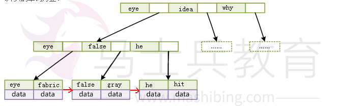
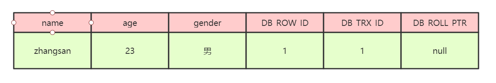
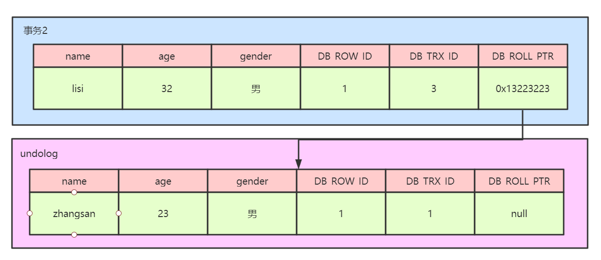

# 数据库基础知识

## 为什么要使用数据库

### 数据保存在内存

优点：存取速度快

缺点：数据不能永久保存

### 数据保存在文件

优点：数据永久保存

缺点：1）速度比内存操作慢，频繁的IO操作。

​			2）查询数据不方便

### 数据保存在数据库

1）数据永久保存

2）使用SQL语句，查询方便效率高。

3）管理数据方便

## 什么是SQL？

结构化查询语言(StructuredQueryLanguage)简称SQL，是一种数据库查询语言。

作用：用于存取数据、查询、更新和管理关系数据库系统。

## 什么是MySQL?

MySQL是一个关系型数据库管理系统，由瑞典MySQLAB公司开发，属于Oracle旗下产品。MySQL是最流行的关系型数据库管理系统之一，在WEB应用方面，MySQL是最好的RDBMS(RelationalDatabaseManagementSystem，关系数据库管理系统)应用软件之一。在Java企业级开发中非常常用，因为MySQL是开源免费的，并且方便扩展。

## 数据库三大范式是什么

第一范式：每个列都不可以再拆分。

第二范式：在第一范式的基础上，非主键列完全依赖于主键，而不能是依赖于主键的一部分。

第三范式：在第二范式的基础上，非主键列只依赖于主键，不依赖于其他非主键。

在设计数据库结构的时候，要尽量遵守三范式，如果不遵守，必须有足够的理由。比如性能。事实上我们经常会为了性能而妥协数据库的设计。

## mysql有关权限的表都有哪几个

MySQL服务器通过权限表来控制用户对数据库的访问，权限表存放在mysql数据库里，由mysql_install_db脚本初始化。这些权限表分别user，db，table_priv，columns_priv和host。下面分别介绍一下这些表的结构和内容：

user权限表：记录允许连接到服务器的用户帐号信息，里面的权限是全局级的。

db权限表：记录各个帐号在各个数据库上的操作权限。

table_priv权限表：记录数据表级的操作权限。

columns_priv权限表：记录数据列级的操作权限。

host权限表：配合db权限表对给定主机上数据库级操作权限作更细致的控制。这个权限表不受GRANT和REVOKE语句的影响。

## MySQL的binlog有有几种录入格式？分别有什么区别？

有三种格式，statement，row和mixed。

- statement模式下，每一条会修改数据的sql都会记录在binlog中。不需要记录每一行的变化，减少了binlog日志量，节约了IO，提高性能。由于sql的执行是有上下文的，因此在保存的时候需要保存相关的信息，同时还有一些使用了函数之类的语句无法被记录复制。
- row级别下，不记录sql语句上下文相关信息，仅保存哪条记录被修改。记录单元为每一行的改动，基本是可以全部记下来但是由于很多操作，会导致大量行的改动(比如altertable)，因此这种模式的文件保存的信息太多，日志量太大。
- mixed，一种折中的方案，普通操作使用statement记录，当无法使用statement的时候使用row。

此外，新版的MySQL中对row级别也做了一些优化，当表结构发生变化的时候，会记录语句而不是逐行记录。

# 数据类型

## mysql有哪些数据类型

| 分类                 | 类型名称                                                   | 说明                  |
| -------------------- | ---------------------------------------------------------- | --------------------- |
| **整数类型**         | tinyInt                                                    | 很小的整数(8位二进制) |
| smallint             | 小的整数(16位二进制)                                       |                       |
| mediumint            | 中等大小的整数(24位二进制)                                 |                       |
| int(integer)         | 普通大小的整数(32位二进制)                                 |                       |
| **小数类型**         | float                                                      | 单精度浮点数          |
| double               | 双精度浮点数                                               |                       |
| decimal(m,d)         | 压缩严格的定点数                                           |                       |
| **日期类型**         | year                                                       | YYYY1901~2155         |
| time                 | HH:MM:SS-838:59:59~838:59:59                               |                       |
| date                 | YYYYMM-DD1000-01-01~9999-12-3                              |                       |
| datetime             | YYYYMM-DDHH:MM:SS1000-01-0100:00:00~9999-12-3123:59:59     |                       |
| timestamp            | YYYYMM-DDHH:MM:SS1970010100:00:01UTC~2038-01-1903:14:07UTC |                       |
| **文本、二进制类型** | **CHAR(M)**                                                | M为0~65535之间的整数  |
| VARCHAR(M)           | M为0~65535之间的整数                                       |                       |
| TINYBLOB             | 允许长度0~255字节                                          |                       |
| BLOB                 | 允许长度0~65535字节                                        |                       |
| MEDIUMBLOB           | 允许长度0~167772150字节                                    |                       |
| LONGBLOB             | 允许长度0~4294967295字节                                   |                       |
| TINYTEXT             | 允许长度0~255字节                                          |                       |
| TEXT                 | 允许长度0~65535字节                                        |                       |
| MEDIUMTEXT           | 允许长度0~167772150字节                                    |                       |
| LONGTEXT             | 允许长度0~4294967295字节                                   |                       |
| VARBINARY(M)         | 允许长度0~M个字节的变长字节字符串                          |                       |
| BINARY(M)            | 允许长度0~M个字节的定长字节字符串                          |                       |

**整数类型**，包括TINYINT、SMALLINT、MEDIUMINT、INT、BIGINT，分别表示1字节、2字节、3字节、4字节、8字节整数。任何整数类型都可以加上UNSIGNED属性，表示数据是无符号的，即非负整数。

长度：整数类型可以被指定长度，例如：INT(11)表示长度为11的INT类型。长度在大多数场景是没有意义的，它不会限制值的合法范围，只会影响显示字符的个数，而且需要和UNSIGNEDZEROFILL属性配合使用才有意义。

例子，假定类型设定为INT(5)，属性为UNSIGNEDZEROFILL，如果用户插入的数据为12的话，那么数据库实际存储数据为00012。

**实数类型**，包括FLOAT、DOUBLE、DECIMAL。DECIMAL可以用于存储比BIGINT还大的整型，能存储精确的小数。而FLOAT和DOUBLE是有取值范围的，并支持使用标准的浮点进行近似计算。
计算时FLOAT和DOUBLE相比DECIMAL效率更高一些，DECIMAL你可以理解成是用字符串进行处理。

**字符串类型**，包括VARCHAR、CHAR、TEXT、BLOBVARCHAR用于存储可变长字符串，它比定长类型更节省空间。
VARCHAR使用额外1或2个字节存储字符串长度。列长度小于255字节时，使用1字节表示，否则使用2字节表示。
VARCHAR存储的内容超出设置的长度时，内容会被截断。
CHAR是定长的，根据定义的字符串长度分配足够的空间。
CHAR会根据需要使用空格进行填充方便比较。
CHAR适合存储很短的字符串，或者所有值都接近同一个长度。
CHAR存储的内容超出设置的长度时，内容同样会被截断。

**使用策略：**

对于经常变更的数据来说，CHAR比VARCHAR更好，因为CHAR不容易产生碎片。

对于非常短的列，CHAR比VARCHAR在存储空间上更有效率。

使用时要注意只分配需要的空间，更长的列排序时会消耗更多内存。尽量避免使用TEXT/BLOB类型，查询时会使用临时表，导致严重的性能开销。

**枚举类型（ENUM）**，把不重复的数据存储为一个预定义的集合。有时可以使用ENUM代替常用的字符串类型。ENUM存储非常紧凑，会把列表值压缩到一个或两个字节。ENUM在内部存储时，其实存的是整数。尽量避免使用数字作为ENUM枚举的常量，因为容易混乱。排序是按照内部存储的整数

**日期和时间类型**，尽量使用timestamp，空间效率高于datetime，用整数保存时间戳通常不方便处理。
如果需要存储微妙，可以使用bigint存储。

看到这里，这道真题是不是就比较容易回答了。

# 引擎

## MySQL存储引擎MyISAM与InnoDB区别

存储引擎Storageengine：MySQL中的数据、索引以及其他对象是如何存储的，是一套文件系统的实现。

常用的存储引擎有以下：

**Innodb引擎：**Innodb引擎提供了对数据库ACID事务的支持。并且还提供了行级锁和外键的约束。它的设计的目标就是处理大数据容量的数据库系统。

**MyIASM引擎(原本Mysql的默认引擎)：**不提供事务的支持，也不支持行级锁和外键。

**MEMORY引擎：**所有的数据都在内存中，数据的处理速度快，但是安全性不高。

**MyISAM与InnoDB区别**

| MyISAM                                                       | Innodb                                                       |                                                              |
| ------------------------------------------------------------ | ------------------------------------------------------------ | ------------------------------------------------------------ |
| 存储结构                                                     | 每张表被存放在三个文件：frm-表格定义、MYD(MYData)-数据文件、MYI(MYIndex)-索引文件 | 所有的表都保存在同一个数据文件中（也可能是多个文件，或者是独立的表空间文件），InnoDB表的大小只受限于操作系统文件的大小，一般为2GB |
| 存储空间                                                     | MyISAM可被压缩，存储空间较小                                 | InnoDB的表需要更多的内存和存储，它会在主内存中建立其专用的缓冲池用于高速缓冲数据和索引 |
| 可移植性、备份及恢复                                         | 由于MyISAM的数据是以文件的形式存储，所以在跨平台的数据转移中会很方便。在备份和恢复时可单独针对某个表进行操作 | 免费的方案可以是拷贝数据文件、备份binlog，或者用mysqldump，在数据量达到几十G的时候就相对痛苦了 |
| 文件格式                                                     | 数据和索引是分别存储的，数据.MYD，索引.MYI                   | 数据和索引是集中存储的，.ibd                                 |
| 记录存储顺序                                                 | 按记录插入顺序保存                                           | 按主键大小有序插入                                           |
| 外键                                                         | 不支持                                                       | 支持                                                         |
| 事务                                                         | 不支持                                                       | 支持                                                         |
| 锁支持（锁是避免资源争用的一个机制，MySQL锁对用户几乎是透明的） | 表级锁定                                                     | 行级锁定、表级锁定，锁定力度小并发能力高                     |
| SELECT                                                       | MyISAM更优                                                   |                                                              |
| INSERT、UPDATE、DELETE                                       |                                                              | InnoDB更优                                                   |
| selectcount(*)                                               | myisam更快，因为myisam内部维护了一个计数器，可以直接调取。   |                                                              |
| 索引的实现方式                                               | B+树索引，myisam是堆表                                       | B+树索引，Innodb是索引组织表                                 |
| 哈希索引                                                     | 不支持                                                       | 支持                                                         |
| 全文索引                                                     | 支持                                                         | 不支持                                                       |

## **MyISAM索引与InnoDB索引的区别？**

- InnoDB索引是聚簇索引，MyISAM索引是非聚簇索引。
- InnoDB的主键索引的叶子节点存储着行数据，因此主键索引非常高效。
- MyISAM索引的叶子节点存储的是行数据地址，需要再寻址一次才能得到数据。
- InnoDB非主键索引的叶子节点存储的是主键和其他带索引的列数据，因此查询时做到覆盖索引会非常高效。

## **InnoDB引擎的4大特性**

- 插入缓冲（insert buffer)
- 二次写(double write)
- 自适应哈希索引(ahi)
- 预读(read ahead)

## 存储引擎选择

如果没有特别的需求，使用默认的Innodb即可。
MyISAM：以读写插入为主的应用程序，比如博客系统、新闻门户网站。
Innodb：更新（删除）操作频率也高，或者要保证数据的完整性；并发量高，支持事务和外键。比如OA自动化办公系统。

# 索引

## 什么是索引？

索引是一种特殊的文件(InnoDB数据表上的索引是表空间的一个组成部分)，它们包含着对数据表里所有记录的引用指针。
索引是一种数据结构。数据库索引，是数据库管理系统中一个排序的数据结构，以协助快速查询、更新数据库表中数据。索引的实现通常使用B树及其变种B+树。
更通俗的说，索引就相当于目录。为了方便查找书中的内容，通过对内容建立索引形成目录。索引是一个文件，它是要占据物理空间的。

## 索引有哪些优缺点？

## 索引使用场景（重点）


上图中，根据id查询记录，因为id字段仅建立了主键索引，因此此SQL执行可选的索引只有主键索引，如果有多个，最终会选一个较优的作为检索的依据。

```
1‐‐增加一个没有建立索引的字段
2altertableinnodb1addsexchar(1);
3‐‐按sex检索时可选的索引为null
4EXPLAINSELECT*frominnodb1wheresex='男';
```

\09-MySQL数据库面试题（2020最新版）-重点.assets\09-MySQL数据库面试题（2020最新版）-重点.jpg)

> 可以尝试在一个字段未建立索引时，根据该字段查询的效率，然后对该字段建立索引（altertable表名addindex(字段名)），同样的SQL执行的效率，你会发现查询效率会有明显的提升（数据量越大越明显）。

order by
当我们使用order by将查询结果按照某个字段排序时，如果该字段没有建立索引，那么执行计划会将查询出的所有数据使用外部排序（将数据从硬盘分批读取到内存使用内部排序，最后合并排序结果），这个操作是很影响性能的，因为需要将查询涉及到的所有数据从磁盘中读到内存（如果单条数据过大或者数据量过多都会降低效率），更无论读到内存之后的排序了。
但是如果我们对该字段建立索引 [alter table 表名 add index(字段名)]，那么由于索引本身是有序的，因此直接按照索引的顺序和映射关系逐条取出数据即可。而且如果分页的，那么只用取出索引表某个范围内的索引对应的数据，而不用像上述那取出所有数据进行排序再返回某个范围内的数据。（从磁盘取数据是最影响性能的）
join
对join语句匹配关系（on）涉及的字段建立索引能够提高效率索引覆盖如果要查询的字段都建立过索引，那么引擎会直接在索引表中查询而不会访问原始数据（否则只要有一个字段没有建立索引就会做全表扫描），这叫索引覆盖。
因此我们需要尽可能的在select后只写必要的查询字段，以增加索引覆盖的几率。
这里值得注意的是不要想着为每个字段建立索引，因为优先使用索引的优势就在于其体积小。

## 索引有哪几种类型？

**主键索引:**数据列不允许重复，不允许为NULL，
一个表只能有一个主键。

**唯一索引:**数据列不允许重复，允许为NULL值，
一个表允许多个列创建唯一索引。

- 可以通过ALTER TABLE  table_name  ADD  UNIQUE(column);
  创建唯一索引
- 可以通过ALTER  TABLE  table_name  ADD UNIQUE(column1,column2);
  创建唯一组合索引

**普通索引:**基本的索引类型，没有唯一性的限制，允许为NULL值。

- 可以通过ALTER  TABLE  table_name  ADD  INDEX  index_name(column);
  创建普通索引
- 可以通过ALTER  TABLE  table_name  ADD  INDEX  index_name(column1,column2,column3);
  创建组合索引

- **全文索引：**是目前搜索引擎使用的一种关键技术。
  可以通过ALTERTABLEtable_nameADDFULLTEXT(column);
  创建全文索引

## 索引的数据结构（b树，hash）

索引的数据结构和具体存储引擎的实现有关，在MySQL中使用较多的索引有Hash索引，B+树索引等，而我们经常使用的InnoDB存储引擎的默认索引实现为：B+树索引。对于哈希索引来说，底层的数据结构就是哈希表，因此在绝大多数需求为单条记录查询的时候，可以选择哈希索引，查询性能快；其余大部分场景，建议选择BTree索引。

1）B树索引mysql通过存储引擎取数据，基本上90%的人用的就是InnoDB了，按照实现方式分，InnoDB的索引类型目前只有两种：BTREE（B树）索引和HASH索引。B树索引是Mysql数据库中使用频繁的索引类型，基本所有存储引擎都支持

BTree索引。通常我们说的索引不出意外指的就是（B树）索引（实际是用B+树实现的，因为在查看表索引时，mysql一律打印BTREE，所以简称为B树索引）


查询方式：

主键索引区:PI(关联保存的时数据的地址)按主键查询,

普通索引区:si(关联的id的地址,然后再到达上面的地址)。所以按主键查询,速度快

1）B+tree性质：

1.）n棵子tree的节点包含n个关键字，不用来保存数据而是保存数据的索引。

2.）所有的叶子结点中包含了全部关键字的信息，及指向含这些关键字记录的指针，且叶子结点本身依关键字的大小自小而大顺序链接。

3.）所有的非终端结点可以看成是索引部分，结点中仅含其子树中的大（或小）关键字。

4.）B+树中，数据对象的插入和删除仅在叶节点上进行。

5.）B+树有2个头指针，一个是树的根节点，一个是小关键码的叶节点。

2）哈希索引简要说下，类似于数据结构中简单实现的HASH表（散列表）一样，当我们在mysql中用哈希索引时，主要就是通过Hash算法（常见的Hash算法有直接定址法、平方取中法、折叠法、除数取余法、随机数法），将数据库字段数据转换成定长的Hash值，与这条数据的行指针一并存入Hash表的对应位置；如果发生

Hash碰撞（两个不同关键字的Hash值相同），则在对应Hash键下以链表形式存储。当然这只是简略模拟图。


### 索引的基本原理

索引用来快速地寻找那些具有特定值的记录。如果没有索引，一般来说执行查询时遍历整张表。

索引的原理很简单，就是把无序的数据变成有序的查询

1. 把创建了索引的列的内容进行排序

2. 对排序结果生成倒排表

3. 在倒排表内容上拼上数据地址链

4. 在查询的时候，先拿到倒排表内容，再取出数据地址链，从而拿到具体数据

### 索引算法有哪些？

索引算法有BTree算法和Hash算法

BTree算法

BTree是常用的mysql数据库索引算法，也是mysql默认的算法。因为它不仅可以被用在=,>,>=,<,<=和between这些比较操作符上，而且还可以用于like操作符，只要它的查询条件是一个不以通配符开头的常量，例如：

```
1	‐‐只要它的查询条件是一个不以通配符开头的常量
2	select*fromuserwherenamelike'jack%';
3	‐‐如果一通配符开头，或者没有使用常量，则不会使用索引，例如：
4	select*fromuserwherenamelike'%jack';
```

Hash算法

HashHash索引只能用于对等比较，例如=,<=>（相当于=）操作符。由于是一次定位数据，不像BTree索引需要从根节点到枝节点，后才能访问到页节点这样多次IO访问，所以检索效率远高于BTree索引。

### 索引设计的原则？

1.适合索引的列是出现在where子句中的列，或者连接子句中指定的列

2.基数较小的类，索引效果较差，没有必要在此列建立索引

3.使用短索引，如果对长字符串列进行索引，应该指定一个前缀长度，这样能够节省大量索引空间

4.不要过度索引。索引需要额外的磁盘空间，并降低写操作的性能。在修改表内容的时候，索引会进行更新甚至重构，索引列越多，这个时间就会越长。所以只保持需要的索引有利于查询即可。

### 创建索引的原则（重中之重）

索引虽好，但也不是无限制的使用，好符合一下几个原则

1）左前缀匹配原则，组合索引非常重要的原则，mysql会一直向右匹配直到遇到范围查询(>、<、between、like)就停止匹配，比如a=1 and b=2 and c>3 and d=4 如果建立(a,b,c,d)顺序的索引，d是用不到索引的，如果建立

(a,b,d,c)的索引则都可以用到，a,b,d的顺序可以任意调整。

2）较频繁作为查询条件的字段才去创建索引

3）更新频繁字段不适合创建索引

4）若是不能有效区分数据的列不适合做索引列(如性别，男女未知，多也就三种，区分度实在太低)

5）尽量的扩展索引，不要新建索引。比如表中已经有a的索引，现在要加(a,b)的索引，那么只需要修改原来的索引即可。

6）定义有外键的数据列一定要建立索引。

7）对于那些查询中很少涉及的列，重复值比较多的列不要建立索引。8）对于定义为text、image和bit的数据类型的列不要建立索引。创建索引的三种方式，删除索引

第一种方式：在执行CREATETABLE时创建索引

```sql
	CREATE TABLE user_index2(
	id INT auto_increment PRIMARYKEY,
	first_name VARCHAR(16),
	last_name VARCHAR(16),
	id_card VARCHAR(18),
	information text,
	KEY name(first_name,last_name),
	FULLTEXT KEY(information),
	UNIQUE KEY(id_card));
```

第二种方式：使用ALTERTABLE命令去增加索引

`ALTER TABLE table_name ADD INDEX index_name(column_list);`

ALTER TABLE用来创建普通索引、UNIQUE索引或PRIMARYKEY索引。

其中table_name是要增加索引的表名，column_list指出对哪些列进行索引，多列时各列之间用逗号分隔。

索引名index_name可自己命名，缺省时，MySQL将根据第一个索引列赋一个名称。另外，ALTERTABLE允许在单个语句中更改多个表，因此可以在同时创建多个索引。

第三种方式：使用CREATEINDEX命令创建

`CREATE INDEX index_name ON table_name(column_list);`

CREATE INDEX可对表增加普通索引或UNIQUE索引。（但是，不能创建PRIMARYKEY索引）

删除索引

根据索引名删除普通索引、唯一索引、全文索引：alter table 表名 drop KEY 索引名

```
	alter table user_index drop KEY name;
	alter table user_index drop KEY id_card;
	alter table user_index drop KEY information;
```

删除主键索引：alter table 表名 drop primary key（因为主键只有一个）。这里值得注意的是，如果主键自增长，那么不能直接执行此操作（自增长依赖于主键索引）：


需要取消自增长再行删除：

```
	alter table user_index
	‐‐重新定义字段
	MODIFY id int,
	drop PRIMARY KEY
```

但通常不会删除主键，因为设计主键一定与业务逻辑无关。

### 创建索引时需要注意什么？

- 非空字段：应该指定列为NOT NULL，除非你想存储NULL。在mysql中，含有空值的列很难进行查询优化，因为它们使得索引、索引的统计信息以及比较运算更加复杂。你应该用0、一个特殊的值或者一个空串代替空值；
- 取值离散大的字段：（变量各个取值之间的差异程度）的列放到联合索引的前面，可以通过count()函数查看字段的差异值，返回值越大说明字段的唯一值越多字段的离散程度高；
- 索引字段越小越好：数据库的数据存储以页为单位一页存储的数据越多一次IO操作获取的数据越大效率越高。

### 使用索引查询一定能提高查询的性能吗？为什么

通常，通过索引查询数据比全表扫描要快。但是我们也必须注意到它的代价。

索引需要空间来存储，也需要定期维护，每当有记录在表中增减或索引列被修改时，索引本身也会被修改。这意味着每条记录的INSERT，DELETE，UPDATE将为此多付出4，5次的磁盘I/O。因为索引需要额外的存储空间和处理，那些不必要的索引反而会使查询反应时间变慢。使用索引查询不一定能提高查询性能，索引范围查询(INDEX RANGE SCAN)适用于两种情况:

基于一个范围的检索，一般查询返回结果集小于表中记录数的30%

基于非唯一性索引的检索

## 百万级别或以上的数据如何删除

关于索引：由于索引需要额外的维护成本，因为索引文件是单独存在的文件,所以当我们对数据的增加,修改,删除,都会产生额外的对索引文件的操作,这些操作需要消耗额外的IO,会降低增/改/删的执行效率。所以，在我们删除数据库百万级别数据的时候，查询MySQL官方手册得知删除数据的速度和创建的索引数量是成正比的。

1. 所以我们想要删除百万数据的时候可以先删除索引（此时大概耗时三分多钟）

2. 然后删除其中无用数据（此过程需要不到两分钟）

3. 删除完成后重新创建索引(此时数据较少了)创建索引也非常快，约十分钟左右。

4. 与之前的直接删除绝对是要快速很多，更别说万一删除中断,一切删除会回滚。那更是坑了。

## 前缀索引

语法：index(field(10))，使用字段值的前10个字符建立索引，默认是使用字段的全部内容建立索引。

前提：前缀的标识度高。比如密码就适合建立前缀索引，因为密码几乎各不相同。

实操的难度：在于前缀截取的长度。

我们可以利用select count(*)/count(distinct left(password,prefixLen));，通过从调整prefixLen的值（从1自增）查看不同前缀长度的一个平均匹配度，接近1时就可以了（表示一个密码的前prefixLen个字符几乎能确定唯一一条记录）

## 什么是最左前缀原则？什么是最左匹配原则

顾名思义，就是最左优先，在创建多列索引时，要根据业务需求，where子句中使用最频繁的一列放在最左边。

最左前缀匹配原则，非常重要的原则，mysql会一直向右匹配直到遇到范围查询(>、<、between、like)就停止匹配，比如a=1and b=2 and c>3 and d=4如果建立(a,b,c,d)顺序的索引，d是用不到索引的，如果建立(a,b,d,c)的索引则都可以用到，a,b,d的顺序可以任意调整。

=和in可以乱序，比如a=1and b=2 and c=3建立(a,b,c)索引可以任意顺序，mysql的查询优化器会帮你优化成索引可以识别的形式

## B树和B+树的区别

在B树中，你可以将键和值存放在内部节点和叶子节点；但在B+树中，内部节点都是键，没有值，叶子节点同时存放键和值。

B+树的叶子节点有一条链相连，而B树的叶子节点各自独立。


## 使用B树的好处

B树可以在内部节点同时存储键和值，因此，把频繁访问的数据放在靠近根节点的地方将会大大提高热点数据的查询效率。这种特性使得B树在特定数据重复多次查询的场景中更加高效。

## 使用B+树的好处

由于B+树的内部节点只存放键，不存放值，因此，一次读取，可以在内存页中获取更多的键，有利于更快地缩小查找范围。B+树的叶节点由一条链相连，因此，当需要进行一次全数据遍历的时候，B+树只需要使用O(logN)时间找到最小的一个节点，然后通过链进行O(N)的顺序遍历即可。而B树则需要对树的每一层进行遍历，这会需要更多的内存置换次数，因此也就需要花费更多的时间

## Hash索引和B+树所有有什么区别或者说优劣呢?

首先要知道Hash索引和B+树索引的底层实现原理：

hash索引底层就是hash表，进行查找时，调用一次hash函数就可以获取到相应的键值，之后进行回表查询获得实际数据。B+树底层实现是多路平衡查找树。

对于每一次的查询都是从根节点出发，查找到叶子节点方可以获得所查键值，然后根据查询判断是否需要回表查询数据。

么可以看出他们有以下的不同：

hash索引进行等值查询更快(一般情况下)，但是却无法进行范围查询。


因为在hash索引中经过hash函数建立索引之后，索引的顺序与原顺序无法保持一致，不能支持范围查询。而B+树的的所有节点皆遵循(左节点小于父节点，右节点大于父节点，多叉树也类似)，天然支持范围。

hash索引不支持使用索引进行排序，原理同上。

hash索引不支持模糊查询以及多列索引的最左前缀匹配。原理也是因为hash函数的不可预测。AAAA和AAAAB的索引没有相关性。

hash索引任何时候都避免不了回表查询数据，而B+树在符合某些条件(聚簇索引，覆盖索引等)的时候可以只通过索引完成查询。

hash索引虽然在等值查询上较快，但是不稳定。性能不可预测，当某个键值存在大量重复的时候，发生hash碰撞，此时效率可能极差。而B+树的查询效率比较稳定，对于所有的查询都是从根节点到叶子节点，且树的高度较低。

因此，在大多数情况下，直接选择B+树索引可以获得稳定且较好的查询速度。

而不需要使用hash索引。

## 数据库为什么使用B+树而不是B树

B树只适合随机检索，而B+树同时支持随机检索和顺序检索；

B+树空间利用率更高，可减少I/O次数，磁盘读写代价更低。一般来说，索引本身也很大，不可能全部存储在内存中，因此索引往往以索引文件的形式存储的磁盘上。这样的话，索引查找过程中就要产生磁盘I/O消耗。B+树的内部结点并没有指向关键字具体信息的指针，只是作为索引使用，其内部结点比B树小，盘块能容纳的结点中关键字数量更多，一次性读入内存中可以查找的关键字也就越多，相对的，IO读写次数也就降低了。而IO读写次数是影响索引检索效率的最大因素；

B+树的查询效率更加稳定。B树搜索有可能会在非叶子结点结束，越靠近根节点的记录查找时间越短，只要找到关键字即可确定记录的存在，其性能等价于在关键字全集内做一次二分查找。而在B+树中，顺序检索比较明显，随机检索时，任何关键字的查找都必须走一条从根节点到叶节点的路，所有关键字的查找路径长度相同，导致每一个关键字的查询效率相当。

B-树在提高了磁盘IO性能的同时并没有解决元素遍历的效率低下的问题。B+树的叶子节点使用指针顺序连接在一起，只要遍历叶子节点就可以实现整棵树的遍历。而且在数据库中基于范围的查询是非常频繁的，而B树不支持这样的操作。

增删文件（节点）时，效率更高。因为B+树的叶子节点包含所有关键字，并以有序的链表结构存储，这样可很好提高增删效率。

## B+树在满足聚簇索引和覆盖索引的时候不需要回表查询数据

在B+树的索引中，叶子节点可能存储了当前的key值，也可能存储了当前的key值以及整行的数据，这就是聚簇索引和非聚簇索引。在InnoDB中，只有主键索引是聚簇索引，如果没有主键，则挑选一个唯一键建立聚簇索引。如果没有唯一键，则隐式的生成一个键来建立聚簇索引。

当查询使用聚簇索引时，在对应的叶子节点，可以获取到整行数据，因此不用再

次进行回表查询。

## 什么是聚簇索引？何时使用聚簇索引与非聚簇索引

聚簇索引：将数据存储与索引放到了一块，找到索引也就找到了数据

非聚簇索引：将数据存储于索引分开结构，索引结构的叶子节点指向了数据的对应行，myisam通过key_buffer把索引先缓存到内存中，当需要访问数据时（通过索引访问数据），在内存中直接搜索索引，然后通过索引找到磁盘相应数据，这也就是为什么索引不在key buffer命中时，速度慢的原因

澄清一个概念：innodb中，在聚簇索引之上创建的索引称之为辅助索引，辅助索引访问数据总是需要二次查找，非聚簇索引都是辅助索引，像复合索引、前缀索引、唯一索引，辅助索引叶子节点存储的不再是行的物理位置，而是主键值

何时使用聚簇索引与非聚簇索引


## 非聚簇索引一定会回表查询吗？

不一定，这涉及到查询语句所要求的字段是否全部命中了索引，如果全部命中了索引，那么就不必再进行回表查询

举个简单的例子，假设我们在员工表的年龄上建立了索引，那么当进行select age from employee where age < 20 的查询时，在索引的叶子节点上，已经包含了age信息，不会再次进行回表查询。

## 联合索引是什么？为什么需要注意联合索引中的顺序？

MySQL可以使用多个字段同时建立一个索引，叫做联合索引。在联合索引中，如果想要命中索引，需要按照建立索引时的字段顺序挨个使用，否则无法命中索引。

具体原因为:

MySQL使用索引时需要索引有序，假设现在建立了"name，age，school"的联合索引，那么索引的排序为: 先按照name排序，如果name相同，则按照age排序，如果age的值也相等，则按照school进行排序。

当进行查询时，此时索引仅仅按照name严格有序，因此必须首先使用name字段进行等值查询，之后对于匹配到的列而言，其按照age字段严格有序，此时可以使用age字段用做索引查找，以此类推。因此在建立联合索引的时候应该注意索引列的顺序，一般情况下，将查询需求频繁或者字段选择性高的列放在前面。此外可以根据特例的查询或者表结构进行单独的调整。

## MySQL索引背后的数据结构及算法原理

### 摘要

本文以MySQL数据库为研究对象，讨论与数据库索引相关的一些话题。特别需要说明的是，MySQL支持诸多存储引擎，而各种存储引擎对索引的支持也各不相同，因此MySQL数据库支持多种索引类型，如BTree索引，哈希索引，全文索引等等。为了避免混乱，本文将只关注于BTree索引，因为这是平常使用MySQL时主要打交道的索引，至于哈希索引和全文索引本文暂不讨论。

文章主要内容分为三个部分。

第一部分主要从数据结构及算法理论层面讨论MySQL数据库索引的数理基础。

第二部分结合MySQL数据库中MyISAM和InnoDB数据存储引擎中索引的架构实现讨论聚集索引、非聚集索引及覆盖索引等话题。

第三部分根据上面的理论基础，讨论MySQL中高性能使用索引的策略。

### 数据结构及算法基础

#### 索引的本质

MySQL官方对索引的定义为：索引（Index）是帮助MySQL高效获取数据的数据结构。提取句子主干，就可以得到索引的本质：索引是数据结构。

我们知道，数据库查询是数据库的最主要功能之一。我们都希望查询数据的速度能尽可能的快，因此数据库系统的设计者会从查询算法的角度进行优化。最基本的查询算法当然是[顺序查找]（linear search），这种复杂度为O(n)的算法在数据量很大时显然是糟糕的，好在计算机科学的发展提供了很多更优秀的查找算法，例如[二分查找]（binary search）、[二叉树查找]（binary tree search）等。如果稍微分析一下会发现，每种查找算法都只能应用于特定的数据结构之上，例如二分查找要求被检索数据有序，而二叉树查找只能应用于二叉查找树上，但是数据本身的组织结构不可能完全满足各种数据结构（例如，理论上不可能同时将两列都按顺序进行组织），所以，在数据之外，数据库系统还维护着满足特定查找算法的数据结构，这些数据结构以某种方式引用（指向）数据，这样就可以在这些数据结构上实现高级查找算法。这种数据结构，就是索引。

看一个例子：


图1

图1展示了一种可能的索引方式。左边是数据表，一共有两列七条记录，最左边的是数据记录的物理地址（注意逻辑上相邻的记录在磁盘上也并不是一定物理相邻的）。为了加快Col2的查找，可以维护一个右边所示的二叉查找树，每个节点分别包含索引键值和一个指向对应数据记录物理地址的指针，这样就可以运用二叉查找在O(log2n)O(log2n)的复杂度内获取到相应数据。

虽然这是一个货真价实的索引，但是实际的数据库系统几乎没有使用二叉查找树或其进化品种红黑树（red-black tree）实现的，原因会在下文介绍。

## B-Tree和B+Tree

目前大部分数据库系统及文件系统都采用B-Tree或其变种B+Tree作为索引结构，在本文的下一节会结合存储器原理及计算机存取原理讨论为什么B-Tree和B+Tree在被如此广泛用于索引，这一节先单纯从数据结构角度描述它们。

### B-Tree

为了描述B-Tree，首先定义一条数据记录为一个二元组[key, data]，key为记录的键值，对于不同数据记录，key是互不相同的；data为数据记录除key外的数据。那么B-Tree是满足下列条件的数据结构：

d为大于1的一个正整数，称为B-Tree的度。

h为一个正整数，称为B-Tree的高度。

每个非叶子节点由n-1个key和n个指针组成，其中d<=n<=2d。

每个叶子节点最少包含一个key和两个指针，最多包含2d-1个key和2d个指针，叶节点的指针均为null 。

所有叶节点具有相同的深度，等于树高h。

key和指针互相间隔，节点两端是指针。

一个节点中的key从左到右非递减排列。

所有节点组成树结构。

每个指针要么为null，要么指向另外一个节点。

如果某个指针在节点node最左边且不为null，则其指向节点的所有key小于v(key1)v(key1)，其中v(key1)v(key1)为node的第一个key的值。

如果某个指针在节点node最右边且不为null，则其指向节点的所有key大于v(keym)v(keym)，其中v(keym)v(keym)为node的最后一个key的值。

如果某个指针在节点node的左右相邻key分别是keyikeyi和keyi+1keyi+1且不为null，则其指向节点的所有key小于v(keyi+1)v(keyi+1)且大于v(keyi)v(keyi)。

图2是一个d=2的B-Tree示意图。


图2

由于B-Tree的特性，在B-Tree中按key检索数据的算法非常直观：首先从根节点进行二分查找，如果找到则返回对应节点的data，否则对相应区间的指针指向的节点递归进行查找，直到找到节点或找到null指针，前者查找成功，后者查找失败。B-Tree上查找算法的伪代码如下：

```
BTree_Search(node, key) {    
	if(node == null) return null;    
	foreach(node.key)    {       
    	if(node.key[i] == key) 
    		return node.data[i];            
    	if(node.key[i] > key) 
    		return BTree_Search(point[i]->node);    
    	}    
    	return BTree_Search(point[i+1]->node);
    }
data = BTree_Search(root, my_key);
```

关于B-Tree有一系列有趣的性质，例如一个度为d的B-Tree，设其索引N个key，则其树高h的上限为logd((N+1)/2)logd((N+1)/2)，检索一个key，其查找节点个数的渐进复杂度为O(logdN)O(logdN)。从这点可以看出，B-Tree是一个非常有效率的索引数据结构。


另外，由于插入删除新的数据记录会破坏B-Tree的性质，因此在插入删除时，需要对树进行一个分裂、合并、转移等操作以保持B-Tree性质，本文不打算完整讨论B-Tree这些内容，因为已经有许多资料详细说明了B-Tree的数学性质及插入删除算法，有兴趣的朋友可以在本文末的参考文献一栏找到相应的资料进行阅读。

### B+Tree

B-Tree有许多变种，其中最常见的是B+Tree，例如MySQL就普遍使用B+Tree实现其索引结构。

与B-Tree相比，B+Tree有以下不同点：

每个节点的指针上限为2d而不是2d+1。

内节点不存储data，只存储key；叶子节点不存储指针。

图3是一个简单的B+Tree示意。


图3

由于并不是所有节点都具有相同的域，因此B+Tree中叶节点和内节点一般大小不同。这点与B-Tree不同，虽然B-Tree中不同节点存放的key和指针可能数量不一致，但是每个节点的域和上限是一致的，所以在实现中B-Tree往往对每个节点申请同等大小的空间。

一般来说，B+Tree比B-Tree更适合实现外存储索引结构，具体原因与外存储器原理及计算机存取原理有关，将在下面讨论。

### 带有顺序访问指针的B+Tree

一般在数据库系统或文件系统中使用的B+Tree结构都在经典B+Tree的基础上进行了优化，增加了顺序访问指针。


图4

如图4所示，在B+Tree的每个叶子节点增加一个指向相邻叶子节点的指针，就形成了带有顺序访问指针的B+Tree。做这个优化的目的是为了提高区间访问的性能，例如图4中如果要查询key为从18到49的所有数据记录，当找到18后，只需顺着节点和指针顺序遍历就可以一次性访问到所有数据节点，极大提到了区间查询效率。

这一节对B-Tree和B+Tree进行了一个简单的介绍，下一节结合存储器存取原理介绍为什么目前B+Tree是数据库系统实现索引的首选数据结构。

## 为什么使用B-Tree（B+Tree）

上文说过，红黑树等数据结构也可以用来实现索引，但是文件系统及数据库系统普遍采用B-/+Tree作为索引结构，这一节将结合计算机组成原理相关知识讨论B-/+Tree作为索引的理论基础。

一般来说，索引本身也很大，不可能全部存储在内存中，因此索引往往以索引文件的形式存储的磁盘上。这样的话，索引查找过程中就要产生磁盘I/O消耗，相对于内存存取，I/O存取的消耗要高几个数量级，所以评价一个数据结构作为索引的优劣最重要的指标就是在查找过程中磁盘I/O操作次数的渐进复杂度。换句话说，索引的结构组织要尽量减少查找过程中磁盘I/O的存取次数。下面先介绍内存和磁盘存取原理，然后再结合这些原理分析B-/+Tree作为索引的效率。

### 主存存取原理

目前计算机使用的主存基本都是随机读写存储器（RAM），现代RAM的结构和存取原理比较复杂，这里本文抛却具体差别，抽象出一个十分简单的存取模型来说明RAM的工作原理。


图5

从抽象角度看，主存是一系列的存储单元组成的矩阵，每个存储单元存储固定大小的数据。每个存储单元有唯一的地址，现代主存的编址规则比较复杂，这里将其简化成一个二维地址：通过一个行地址和一个列地址可以唯一定位到一个存储单元。图5展示了一个4 x 4的主存模型。

主存的存取过程如下：

当系统需要读取主存时，则将地址信号放到地址总线上传给主存，主存读到地址信号后，解析信号并定位到指定存储单元，然后将此存储单元数据放到数据总线上，供其它部件读取。

写主存的过程类似，系统将要写入单元地址和数据分别放在地址总线和数据总线上，主存读取两个总线的内容，做相应的写操作。

这里可以看出，主存存取的时间仅与存取次数呈线性关系，因为不存在机械操作，两次存取的数据的“距离”不会对时间有任何影响，例如，先取A0再取A1和先取A0再取D3的时间消耗是一样的。

### 磁盘存取原理

上文说过，索引一般以文件形式存储在磁盘上，索引检索需要磁盘I/O操作。与主存不同，磁盘I/O存在机械运动耗费，因此磁盘I/O的时间消耗是巨大的。

图6是磁盘的整体结构示意图。


图6

一个磁盘由大小相同且同轴的圆形盘片组成，磁盘可以转动（各个磁盘必须同步转动）。在磁盘的一侧有磁头支架，磁头支架固定了一组磁头，每个磁头负责存取一个磁盘的内容。磁头不能转动，但是可以沿磁盘半径方向运动（实际是斜切向运动），每个磁头同一时刻也必须是同轴的，即从正上方向下看，所有磁头任何时候都是重叠的（不过目前已经有多磁头独立技术，可不受此限制）。

图7是磁盘结构的示意图。


图7

盘片被划分成一系列同心环，圆心是盘片中心，每个同心环叫做一个磁道，所有半径相同的磁道组成一个柱面。磁道被沿半径线划分成一个个小的段，每个段叫做一个扇区，每个扇区是磁盘的最小存储单元。为了简单起见，我们下面假设磁盘只有一个盘片和一个磁头。

当需要从磁盘读取数据时，系统会将数据逻辑地址传给磁盘，磁盘的控制电路按照寻址逻辑将逻辑地址翻译成物理地址，即确定要读的数据在哪个磁道，哪个扇区。为了读取这个扇区的数据，需要将磁头放到这个扇区上方，为了实现这一点，磁头需要移动对准相应磁道，这个过程叫做寻道，所耗费时间叫做寻道时间，然后磁盘旋转将目标扇区旋转到磁头下，这个过程耗费的时间叫做旋转时间。

### 局部性原理与磁盘预读

由于存储介质的特性，磁盘本身存取就比主存慢很多，再加上机械运动耗费，磁盘的存取速度往往是主存的几百分分之一，因此为了提高效率，要尽量减少磁盘I/O。为了达到这个目的，磁盘往往不是严格按需读取，而是每次都会预读，即使只需要一个字节，磁盘也会从这个位置开始，顺序向后读取一定长度的数据放入内存。这样做的理论依据是计算机科学中著名的局部性原理：

当一个数据被用到时，其附近的数据也通常会马上被使用。

程序运行期间所需要的数据通常比较集中。

由于磁盘顺序读取的效率很高（不需要寻道时间，只需很少的旋转时间），因此对于具有局部性的程序来说，预读可以提高I/O效率。

预读的长度一般为页（page）的整倍数。页是计算机管理存储器的逻辑块，硬件及操作系统往往将主存和磁盘存储区分割为连续的大小相等的块，每个存储块称为一页（在许多操作系统中，页得大小通常为4k），主存和磁盘以页为单位交换数据。当程序要读取的数据不在主存中时，会触发一个缺页异常，此时系统会向磁盘发出读盘信号，磁盘会找到数据的起始位置并向后连续读取一页或几页载入内存中，然后异常返回，程序继续运行。

### B-/+Tree索引的性能分析

到这里终于可以分析B-/+Tree索引的性能了。

上文说过一般使用磁盘I/O次数评价索引结构的优劣。先从B-Tree分析，根据B-Tree的定义，可知检索一次最多需要访问h个节点。数据库系统的设计者巧妙利用了磁盘预读原理，将一个节点的大小设为等于一个页，这样每个节点只需要一次I/O就可以完全载入。为了达到这个目的，在实际实现B-Tree还需要使用如下技巧：

每次新建节点时，直接申请一个页的空间，这样就保证一个节点物理上也存储在一个页里，加之计算机存储分配都是按页对齐的，就实现了一个node只需一次I/O。

B-Tree中一次检索最多需要h-1次I/O（根节点常驻内存），渐进复杂度为O(h)=O(logdN)O(h)=O(logdN)。一般实际应用中，出度d是非常大的数字，通常超过100，因此h非常小（通常不超过3）。

综上所述，用B-Tree作为索引结构效率是非常高的。

而红黑树这种结构，h明显要深的多。由于逻辑上很近的节点（父子）物理上可能很远，无法利用局部性，所以红黑树的I/O渐进复杂度也为O(h)，效率明显比B-Tree差很多。

上文还说过，B+Tree更适合外存索引，原因和内节点出度d有关。从上面分析可以看到，d越大索引的性能越好，而出度的上限取决于节点内key和data的大小：

dmax=floor(pagesize/(keysize+datasize+pointsize))

dmax=floor(pagesize/(keysize+datasize+pointsize))

floor表示向下取整。由于B+Tree内节点去掉了data域，因此可以拥有更大的出度，拥有更好的性能。

这一章从理论角度讨论了与索引相关的数据结构与算法问题，下一章将讨论B+Tree是如何具体实现为MySQL中索引，同时将结合MyISAM和InnDB存储引擎介绍非聚集索引和聚集索引两种不同的索引实现形式。

## MySQL索引实现

在MySQL中，索引属于存储引擎级别的概念，不同存储引擎对索引的实现方式是不同的，本文主要讨论MyISAM和InnoDB两个存储引擎的索引实现方式。

### MyISAM索引实现

MyISAM引擎使用B+Tree作为索引结构，叶节点的data域存放的是数据记录的地址。下图是MyISAM索引的原理图：


图8

这里设表一共有三列，假设我们以Col1为主键，则图8是一个MyISAM表的主索引（Primary key）示意。可以看出MyISAM的索引文件仅仅保存数据记录的地址。在MyISAM中，主索引和辅助索引（Secondary key）在结构上没有任何区别，只是主索引要求key是唯一的，而辅助索引的key可以重复。如果我们在Col2上建立一个辅助索引，则此索引的结构如下图所示：


图9

同样也是一颗B+Tree，data域保存数据记录的地址。因此，MyISAM中索引检索的算法为首先按照B+Tree搜索算法搜索索引，如果指定的Key存在，则取出其data域的值，然后以data域的值为地址，读取相应数据记录。

MyISAM的索引方式也叫做“非聚集”的，之所以这么称呼是为了与InnoDB的聚集索引区分。

### InnoDB索引实现

虽然InnoDB也使用B+Tree作为索引结构，但具体实现方式却与MyISAM截然不同。

第一个重大区别是InnoDB的数据文件本身就是索引文件。从上文知道，MyISAM索引文件和数据文件是分离的，索引文件仅保存数据记录的地址。而在InnoDB中，表数据文件本身就是按B+Tree组织的一个索引结构，这棵树的叶节点data域保存了完整的数据记录。这个索引的key是数据表的主键，因此InnoDB表数据文件本身就是主索引。


图10

图10是InnoDB主索引（同时也是数据文件）的示意图，可以看到叶节点包含了完整的数据记录。这种索引叫做聚集索引。因为InnoDB的数据文件本身要按主键聚集，所以InnoDB要求表必须有主键（MyISAM可以没有），如果没有显式指定，则MySQL系统会自动选择一个可以唯一标识数据记录的列作为主键，如果不存在这种列，则MySQL自动为InnoDB表生成一个隐含字段作为主键，这个字段长度为6个字节，类型为长整形。

第二个与MyISAM索引的不同是InnoDB的辅助索引data域存储相应记录主键的值而不是地址。换句话说，InnoDB的所有辅助索引都引用主键作为data域。例如，图11为定义在Col3上的一个辅助索引：


图11

这里以英文字符的ASCII码作为比较准则。聚集索引这种实现方式使得按主键的搜索十分高效，但是辅助索引搜索需要检索两遍索引：首先检索辅助索引获得主键，然后用主键到主索引中检索获得记录。

了解不同存储引擎的索引实现方式对于正确使用和优化索引都非常有帮助，例如知道了InnoDB的索引实现后，就很容易明白为什么不建议使用过长的字段作为主键，因为所有辅助索引都引用主索引，过长的主索引会令辅助索引变得过大。再例如，用非单调的字段作为主键在InnoDB中不是个好主意，因为InnoDB数据文件本身是一颗B+Tree，非单调的主键会造成在插入新记录时数据文件为了维持B+Tree的特性而频繁的分裂调整，十分低效，而使用自增字段作为主键则是一个很好的选择。

下一章将具体讨论这些与索引有关的优化策略。

## 索引使用策略及优化

MySQL的优化主要分为结构优化（Scheme optimization）和查询优化（Query optimization）。本章讨论的高性能索引策略主要属于结构优化范畴。本章的内容完全基于上文的理论基础，实际上一旦理解了索引背后的机制，那么选择高性能的策略就变成了纯粹的推理，并且可以理解这些策略背后的逻辑。

### 示例数据库

为了讨论索引策略，需要一个数据量不算小的数据库作为示例。本文选用MySQL官方文档中提供的示例数据库之一：employees。这个数据库关系复杂度适中，且数据量较大。下图是这个数据库的E-R关系图（引用自MySQL官方手册）：


图12

MySQL官方文档中关于此数据库的页面为http://dev.mysql.com/doc/employee/en/employee.html。里面详细介绍了此数据库，并提供了下载地址和导入方法，如果有兴趣导入此数据库到自己的MySQL可以参考文中内容。

### 最左前缀原理与相关优化

高效使用索引的首要条件是知道什么样的查询会使用到索引，这个问题和B+Tree中的“最左前缀原理”有关，下面通过例子说明最左前缀原理。

这里先说一下联合索引的概念。在上文中，我们都是假设索引只引用了单个的列，实际上，MySQL中的索引可以以一定顺序引用多个列，这种索引叫做联合索引，一般的，一个联合索引是一个有序元组<a1, a2, …, an>，其中各个元素均为数据表的一列，实际上要严格定义索引需要用到关系代数，但是这里我不想讨论太多关系代数的话题，因为那样会显得很枯燥，所以这里就不再做严格定义。另外，单列索引可以看成联合索引元素数为1的特例。

以employees.titles表为例，下面先查看其上都有哪些索引：

```
SHOW INDEX FROM employees.titles;
+--------+------------+----------+--------------+-------------+-----------+-------------+------+-----------+
| Table  | Non_unique | Key_name | Seq_in_index | Column_name | Collation | Cardinality | Null | Index_type|
+--------+------------+----------+--------------+-------------+-----------+-------------+------+-----------+
| titles |          0 | PRIMARY  |            1 | emp_no      | A         |        NULL |      | BTREE    |
| titles |          0 | PRIMARY  |            2 | title       | A         |        NULL |      | BTREE    |
| titles |          0 | PRIMARY  |            3 | from_date   | A         |      443308 |      | BTREE    |
| titles |          1 | emp_no   |            1 | emp_no      | A         |      443308 |      | BTREE   |
+--------+------------+----------+--------------+-------------+-----------+-------------+------+-----------+
```

从结果中可以到titles表的主索引为<emp_no, title, from_date>，还有一个辅助索引<emp_no>。为了避免多个索引使事情变复杂（MySQL的SQL优化器在多索引时行为比较复杂），这里我们将辅助索引drop掉：

```
ALTER TABLE employees.titles DROP INDEX emp_no;
```

这样就可以专心分析索引PRIMARY的行为了。

### 情况一：全列匹配。

```
EXPLAIN SELECT * FROM employees.titles WHERE emp_no='10001' AND title='Senior Engineer' AND from_date='1986-06-26';
+----+-------------+--------+-------+---------------+---------+---------+-------------------+------+-------+
| id | select_type | table  | type  | possible_keys | key     | key_len | ref               | rows | Extra |
+----+-------------+--------+-------+---------------+---------+---------+-------------------+------+-------+
|  1 | SIMPLE      | titles | const | PRIMARY       | PRIMARY | 59      | const,const,const |    1 |       |
+----+-------------+--------+-------+---------------+---------+---------+-------------------+------+-------+
```

很明显，当按照索引中所有列进行精确匹配（这里精确匹配指“=”或“IN”匹配）时，索引可以被用到。这里有一点需要注意，理论上索引对顺序是敏感的，但是由于MySQL的查询优化器会自动调整where子句的条件顺序以使用适合的索引，例如我们将where中的条件顺序颠倒：

```
EXPLAIN SELECT * FROM employees.titles WHERE from_date='1986-06-26' AND emp_no='10001' AND title='Senior Engineer';
+----+-------------+--------+-------+---------------+---------+---------+-------------------+------+-------+
| id | select_type | table  | type  | possible_keys | key     | key_len | ref               | rows | Extra |
+----+-------------+--------+-------+---------------+---------+---------+-------------------+------+-------+
|  1 | SIMPLE      | titles | const | PRIMARY       | PRIMARY | 59      | const,const,const |    1 |       |
+----+-------------+--------+-------+---------------+---------+---------+-------------------+------+-------+
```

效果是一样的。

### 情况二：最左前缀匹配。

```
EXPLAIN SELECT * FROM employees.titles WHERE emp_no='10001';
+----+-------------+--------+------+---------------+---------+---------+-------+------+-------+
| id | select_type | table  | type | possible_keys | key     | key_len | ref   | rows | Extra |
+----+-------------+--------+------+---------------+---------+---------+-------+------+-------+
|  1 | SIMPLE      | titles | ref  | PRIMARY       | PRIMARY | 4       | const |    1 |       |
+----+-------------+--------+------+---------------+---------+---------+-------+------+-------+
```

当查询条件精确匹配索引的左边连续一个或几个列时，如<emp_no>或<emp_no, title>，所以可以被用到，但是只能用到一部分，即条件所组成的最左前缀。上面的查询从分析结果看用到了PRIMARY索引，但是key_len为4，说明只用到了索引的第一列前缀。

### 情况三：查询条件用到了索引中列的精确匹配，但是中间某个条件未提供。

```
EXPLAIN SELECT * FROM employees.titles WHERE emp_no='10001' AND from_date='1986-06-26';
+----+-------------+--------+------+---------------+---------+---------+-------+------+-------------+
| id | select_type | table  | type | possible_keys | key     | key_len | ref   | rows | Extra       |
+----+-------------+--------+------+---------------+---------+---------+-------+------+-------------+
|  1 | SIMPLE      | titles | ref  | PRIMARY       | PRIMARY | 4       | const |    1 | Using where |
+----+-------------+--------+------+---------------+---------+---------+-------+------+-------------+
```

此时索引使用情况和情况二相同，因为title未提供，所以查询只用到了索引的第一列，而后面的from_date虽然也在索引中，但是由于title不存在而无法和左前缀连接，因此需要对结果进行扫描过滤from_date（这里由于emp_no唯一，所以不存在扫描）。如果想让from_date也使用索引而不是where过滤，可以增加一个辅助索引<emp_no, from_date>，此时上面的查询会使用这个索引。除此之外，还可以使用一种称之为“隔离列”的优化方法，将emp_no与from_date之间的“坑”填上。

首先我们看下title一共有几种不同的值：

```
SELECT DISTINCT(title) FROM employees.titles;
+--------------------+
| title              |
+--------------------+
| Senior Engineer    || Staff              || Engineer           || Senior Staff       || Assistant Engineer || Technique Leader   || Manager            |
+--------------------+
```

只有7种。在这种成为“坑”的列值比较少的情况下，可以考虑用“IN”来填补这个“坑”从而形成最左前缀：

```
EXPLAIN SELECT * FROM employees.titlesWHERE emp_no='10001'AND title IN ('Senior Engineer', 'Staff', 'Engineer', 'Senior Staff', 'Assistant Engineer', 'Technique Leader', 'Manager')AND from_date='1986-06-26';
+----+-------------+--------+-------+---------------+---------+---------+------+------+-------------+
| id | select_type | table  | type  | possible_keys | key     | key_len | ref  | rows | Extra       |
+----+-------------+--------+-------+---------------+---------+---------+------+------+-------------+
|  1 | SIMPLE      | titles | range | PRIMARY       | PRIMARY | 59      | NULL |    7 | Using where |
+----+-------------+--------+-------+---------------+---------+---------+------+------+-------------+
```

这次key_len为59，说明索引被用全了，但是从type和rows看出IN实际上执行了一个range查询，这里检查了7个key。看下两种查询的性能比较：

```
SHOW PROFILES;
+----------+------------+-------------------------------------------------------------------------------+
| Query_ID | Duration   | Query                                                                         |
+----------+------------+-------------------------------------------------------------------------------+
|       10 | 0.00058000 | SELECT * FROM employees.titles WHERE emp_no='10001' AND from_date='1986-06-26'|
|       11 | 0.00052500 | SELECT * FROM employees.titles WHERE emp_no='10001' AND title IN ...          |
+----------+------------+-------------------------------------------------------------------------------+
```

“填坑”后性能提升了一点。如果经过emp_no筛选后余下很多数据，则后者性能优势会更加明显。当然，如果title的值很多，用填坑就不合适了，必须建立辅助索引。

### 情况四：查询条件没有指定索引第一列。

```
EXPLAIN SELECT * FROM employees.titles WHERE from_date='1986-06-26';
+----+-------------+--------+------+---------------+------+---------+------+--------+-------------+
| id | select_type | table  | type | possible_keys | key  | key_len | ref  | rows   | Extra       |
+----+-------------+--------+------+---------------+------+---------+------+--------+-------------+
|  1 | SIMPLE      | titles | ALL  | NULL          | NULL | NULL    | NULL | 443308 | Using where |
+----+-------------+--------+------+---------------+------+---------+------+--------+-------------+
```

由于不是最左前缀，索引这样的查询显然用不到索引。

### 情况五：匹配某列的前缀字符串。

```
EXPLAIN SELECT * FROM employees.titles WHERE emp_no='10001' AND title LIKE 'Senior%';
+----+-------------+--------+-------+---------------+---------+---------+------+------+-------------+
| id | select_type | table  | type  | possible_keys | key     | key_len | ref  | rows | Extra       |
+----+-------------+--------+-------+---------------+---------+---------+------+------+-------------+
|  1 | SIMPLE      | titles | range | PRIMARY       | PRIMARY | 56      | NULL |    1 | Using where |
+----+-------------+--------+-------+---------------+---------+---------+------+------+-------------+
```

此时可以用到索引，~~但是如果通配符不是只出现在末尾，则无法使用索引。~~（原文表述有误，如果通配符%不出现在开头，则可以用到索引，但根据具体情况不同可能只会用其中一个前缀）

### 情况六：范围查询。

```
EXPLAIN SELECT * FROM employees.titles WHERE emp_no < '10010' and title='Senior Engineer';
+----+-------------+--------+-------+---------------+---------+---------+------+------+-------------+
| id | select_type | table  | type  | possible_keys | key     | key_len | ref  | rows | Extra       |
+----+-------------+--------+-------+---------------+---------+---------+------+------+-------------+
|  1 | SIMPLE      | titles | range | PRIMARY       | PRIMARY | 4       | NULL |   16 | Using where |
+----+-------------+--------+-------+---------------+---------+---------+------+------+-------------+
```

范围列可以用到索引（必须是最左前缀），但是范围列后面的列无法用到索引。同时，索引最多用于一个范围列，因此如果查询条件中有两个范围列则无法全用到索引。

```
EXPLAIN SELECT * FROM employees.titlesWHERE emp_no < '10010'AND title='Senior Engineer'AND from_date BETWEEN '1986-01-01' AND '1986-12-31';
+----+-------------+--------+-------+---------------+---------+---------+------+------+-------------+
| id | select_type | table  | type  | possible_keys | key     | key_len | ref  | rows | Extra       |
+----+-------------+--------+-------+---------------+---------+---------+------+------+-------------+
|  1 | SIMPLE      | titles | range | PRIMARY       | PRIMARY | 4       | NULL |   16 | Using where |
+----+-------------+--------+-------+---------------+---------+---------+------+------+-------------+
```

可以看到索引对第二个范围索引无能为力。这里特别要说明MySQL一个有意思的地方，那就是仅用explain可能无法区分范围索引和多值匹配，因为在type中这两者都显示为range。同时，用了“between”并不意味着就是范围查询，例如下面的查询：

```
EXPLAIN SELECT * FROM employees.titlesWHERE emp_no BETWEEN '10001' AND '10010'AND title='Senior Engineer'AND from_date BETWEEN '1986-01-01' AND '1986-12-31';
+----+-------------+--------+-------+---------------+---------+---------+------+------+-------------+
| id | select_type | table  | type  | possible_keys | key     | key_len | ref  | rows | Extra       |
+----+-------------+--------+-------+---------------+---------+---------+------+------+-------------+
|  1 | SIMPLE      | titles | range | PRIMARY       | PRIMARY | 59      | NULL |   16 | Using where |
+----+-------------+--------+-------+---------------+---------+---------+------+------+-------------+
```

看起来是用了两个范围查询，但作用于emp_no上的“BETWEEN”实际上相当于“IN”，也就是说emp_no实际是多值精确匹配。可以看到这个查询用到了索引全部三个列。因此在MySQL中要谨慎地区分多值匹配和范围匹配，否则会对MySQL的行为产生困惑。

### 情况七：查询条件中含有函数或表达式。

很不幸，如果查询条件中含有函数或表达式，则MySQL不会为这列使用索引（虽然某些在数学意义上可以使用）。例如：

```
EXPLAIN SELECT * FROM employees.titles WHERE emp_no='10001' AND left(title, 6)='Senior';
+----+-------------+--------+------+---------------+---------+---------+-------+------+-------------+
| id | select_type | table  | type | possible_keys | key     | key_len | ref   | rows | Extra       |
+----+-------------+--------+------+---------------+---------+---------+-------+------+-------------+
|  1 | SIMPLE      | titles | ref  | PRIMARY       | PRIMARY | 4       | const |    1 | Using where |
+----+-------------+--------+------+---------------+---------+---------+-------+------+-------------+
```

虽然这个查询和情况五中功能相同，但是由于使用了函数left，则无法为title列应用索引，而情况五中用LIKE则可以。再如：


```
EXPLAIN SELECT * FROM employees.titles WHERE emp_no - 1='10000';+----+-------------+--------+------+---------------+------+---------+------+--------+-------------+| id | select_type | table  | type | possible_keys | key  | key_len | ref  | rows   | Extra       |+----+-------------+--------+------+---------------+------+---------+------+--------+-------------+|  1 | SIMPLE      | titles | ALL  | NULL          | NULL | NULL    | NULL | 443308 | Using where |+----+-------------+--------+------+---------------+------+---------+------+--------+-------------+
```

显然这个查询等价于查询emp_no为10001的函数，但是由于查询条件是一个表达式，MySQL无法为其使用索引。看来MySQL还没有智能到自动优化常量表达式的程度，因此在写查询语句时尽量避免表达式出现在查询中，而是先手工私下代数运算，转换为无表达式的查询语句。

### 索引选择性与前缀索引

既然索引可以加快查询速度，那么是不是只要是查询语句需要，就建上索引？

答案是否定的。因为索引虽然加快了查询速度，但索引也是有代价的：索引文件本身要消耗存储空间，同时索引会加重插入、删除和修改记录时的负担，另外，MySQL在运行时也要消耗资源维护索引，因此索引并不是越多越好。一般两种情况下不建议建索引。

第一种情况是表记录比较少，例如一两千条甚至只有几百条记录的表，没必要建索引，让查询做全表扫描就好了。至于多少条记录才算多，这个个人有个人的看法，我个人的经验是以2000作为分界线，记录数不超过 2000可以考虑不建索引，超过2000条可以酌情考虑索引。

另一种不建议建索引的情况是索引的选择性较低。所谓索引的选择性（Selectivity），是指不重复的索引值（也叫基数，Cardinality）与表记录数（#T）的比值：

Index Selectivity = Cardinality / #T

显然选择性的取值范围为(0, 1]，选择性越高的索引价值越大，这是由B+Tree的性质决定的。例如，上文用到的employees.titles表，如果title字段经常被单独查询，是否需要建索引，我们看一下它的选择性：

```
SELECT count(DISTINCT(title))/count(*) AS Selectivity FROM employees.titles;
+-------------+
| Selectivity |
+-------------+
|      0.0000 |
+-------------+
```

title的选择性不足0.0001（精确值为0.00001579），所以实在没有什么必要为其单独建索引。

有一种与索引选择性有关的索引优化策略叫做前缀索引，就是用列的前缀代替整个列作为索引key，当前缀长度合适时，可以做到既使得前缀索引的选择性接近全列索引，同时因为索引key变短而减少了索引文件的大小和维护开销。下面以employees.employees表为例介绍前缀索引的选择和使用。

从图12可以看到employees表只有一个索引<emp_no>，那么如果我们想按名字搜索一个人，就只能全表扫描了：

```
EXPLAIN SELECT * FROM employees.employees WHERE first_name='Eric' AND last_name='Anido';
+----+-------------+-----------+------+---------------+------+---------+------+--------+-------------+
| id | select_type | table     | type | possible_keys | key  | key_len | ref  | rows   | Extra       |
+----+-------------+-----------+------+---------------+------+---------+------+--------+-------------+
|  1 | SIMPLE      | employees | ALL  | NULL          | NULL | NULL    | NULL | 300024 | Using where |
+----+-------------+-----------+------+---------------+------+---------+------+--------+-------------+
```

如果频繁按名字搜索员工，这样显然效率很低，因此我们可以考虑建索引。有两种选择，建<first_name>或<first_name, last_name>，看下两个索引的选择性：

```
SELECT count(DISTINCT(first_name))/count(*) AS Selectivity FROM employees.employees;
+-------------+
| Selectivity |
+-------------+
|      0.0042 |
+-------------+
SELECT count(DISTINCT(concat(first_name, last_name)))/count(*) AS Selectivity FROM employees.employees;
+-------------+
| Selectivity |
+-------------+
|      0.9313 |
+-------------+
```

<first_name>显然选择性太低，<first_name, last_name>选择性很好，但是first_name和last_name加起来长度为30，有没有兼顾长度和选择性的办法？

可以考虑用first_name和last_name的前几个字符建立索引，例如<first_name, left(last_name, 3)>，看看其选择性：

```
SELECT count(DISTINCT(concat(first_name, left(last_name, 3))))/count(*) AS Selectivity FROM employees.employees;
+-------------+
| Selectivity |
+-------------+
|      0.7879 |
+-------------+
```

选择性还不错，但离0.9313还是有点距离，那么把last_name前缀加到4：

```
SELECT count(DISTINCT(concat(first_name, left(last_name, 4))))/count(*) AS Selectivity FROM employees.employees;
+-------------+
| Selectivity |
+-------------+
|      0.9007 |
+-------------+
```

这时选择性已经很理想了，而这个索引的长度只有18，比<first_name, last_name>短了接近一半，我们把这个前缀索引 建上：

```
ALTER TABLE employees.employeesADD INDEX `first_name_last_name4` (first_name, last_name(4));
```

此时再执行一遍按名字查询，比较分析一下与建索引前的结果：

```
SHOW PROFILES;
+----------+------------+---------------------------------------------------------------------------------+
| Query_ID | Duration   | Query                                                                          |
+----------+------------+---------------------------------------------------------------------------------+
|       87 | 0.11941700 | SELECT * FROM employees.employees WHERE first_name='Eric' AND last_name='Anido' |
|       90 | 0.00092400 | SELECT * FROM employees.employees WHERE first_name='Eric' AND last_name='Anido' |
+----------+------------+---------------------------------------------------------------------------------+
```

性能的提升是显著的，查询速度提高了120多倍。

前缀索引兼顾索引大小和查询速度，但是其缺点是不能用于ORDER BY和GROUP BY操作，也不能用于Covering index（即当索引本身包含查询所需全部数据时，不再访问数据文件本身）。

### InnoDB的主键选择与插入优化

在使用InnoDB存储引擎时，如果没有特别的需要，请永远使用一个与业务无关的自增字段作为主键。

经常看到有帖子或博客讨论主键选择问题，有人建议使用业务无关的自增主键，有人觉得没有必要，完全可以使用如学号或身份证号这种唯一字段作为主键。不论支持哪种论点，大多数论据都是业务层面的。如果从数据库索引优化角度看，使用InnoDB引擎而不使用自增主键绝对是一个糟糕的主意。

上文讨论过InnoDB的索引实现，InnoDB使用聚集索引，数据记录本身被存于主索引（一颗B+Tree）的叶子节点上。这就要求同一个叶子节点内（大小为一个内存页或磁盘页）的各条数据记录按主键顺序存放，因此每当有一条新的记录插入时，MySQL会根据其主键将其插入适当的节点和位置，如果页面达到装载因子（InnoDB默认为15/16），则开辟一个新的页（节点）。

如果表使用自增主键，那么每次插入新的记录，记录就会顺序添加到当前索引节点的后续位置，当一页写满，就会自动开辟一个新的页。如下图所示：


图13

这样就会形成一个紧凑的索引结构，近似顺序填满。由于每次插入时也不需要移动已有数据，因此效率很高，也不会增加很多开销在维护索引上。

如果使用非自增主键（如果身份证号或学号等），由于每次插入主键的值近似于随机，因此每次新纪录都要被插到现有索引页得中间某个位置：


图14

此时MySQL不得不为了将新记录插到合适位置而移动数据，甚至目标页面可能已经被回写到磁盘上而从缓存中清掉，此时又要从磁盘上读回来，这增加了很多开销，同时频繁的移动、分页操作造成了大量的碎片，得到了不够紧凑的索引结构，后续不得不通过OPTIMIZE TABLE来重建表并优化填充页面。

因此，只要可以，请尽量在InnoDB上采用自增字段做主键。

### 后记

其实数据库索引调优是一项技术活，不能仅仅靠理论，因为实际情况千变万化，而且MySQL本身存在很复杂的机制，如查询优化策略和各种引擎的实现差异等都会使情况变得更加复杂。但同时这些理论是索引调优的基础，只有在明白理论的基础上，才能对调优策略进行合理推断并了解其背后的机制，然后结合实践中不断的实验和摸索，从而真正达到高效使用MySQL索引的目的。

另外，MySQL索引及其优化涵盖范围非常广，本文只是涉及到其中一部分。如与排序（ORDER BY）相关的索引优化及覆盖索引（Covering index）的话题本文并未涉及，同时除B-Tree索引外MySQL还根据不同引擎支持的哈希索引、全文索引等等本文也并未涉及。如果有机会，希望再对本文未涉及的部分进行补充吧。


## MySQL索引失效的几种情况

### **1.索引不存储null值**

更准确的说，单列索引不存储null值，复合索引不存储全为null的值。索引不能存储Null，所以对这列采用is null条件时，因为索引上根本

没Null值，不能利用到索引，只能全表扫描。

为什么索引列不能存Null值？

将索引列值进行建树，其中必然涉及到诸多的比较操作。Null值的特殊性就在于参与的运算大多取值为null。

这样的话，null值实际上是不能参与进建索引的过程。也就是说，null值不会像其他取值一样出现在索引树的叶子节点上。

### **2.不适合键值较少的列（重复数据较多的列）**

假如索引列TYPE有5个键值，如果有1万条数据，那么 WHERE TYPE = 1将访问表中的2000个数据块。

再加上访问索引块，一共要访问大于200个的数据块。

如果全表扫描，假设10条数据一个数据块，那么只需访问1000个数据块，既然全表扫描访问的数据块少一些，肯定就不会利用索引了。

### **3.前导模糊查询不能利用索引(like '%XX'或者like '%XX%')**

假如有这样一列code的值为'AAA','AAB','BAA','BAB' ,如果where code like '%AB'条件，由于前面是模糊的，所以不能利用索引的顺序，必须一个个去找，看是否满足条件。这样会导致全索引扫描或者全表扫描。如果是这样的条件where code like 'A % '，就可以查找CODE中A开头的CODE的位置，当碰到B开头的数据时，就可以停止查找了，因为后面的数据一定不满足要求。这样就可以利用索引了。

### **4.索引失效的几种情况**

**1.如果条件中有or，即使其中有条件带索引也不会使用(这也是为什么尽量少用or的原因)**要想使用or，又想让索引生效，只能将or条件中的每个列都加上索引**

**2.对于多列索引，不是使用的第一部分，则不会使用索引**

**3.like查询以%开头**

**4.如果列类型是字符串，那一定要在条件中将数据使用引号引用起来,否则不使用索引**

**5.如果mysql估计使用全表扫描要比使用索引快,则不使用索引**

### **5.MySQL主要提供2种方式的索引：B-Tree索引，Hash索引**

B树索引具有**范围查找和前缀查找的能力**，对于有N节点的B树，检索一条记录的复杂度为O(LogN)。相当于二分查找。

哈希索引只能做等于查找，但是无论多大的Hash表，查找复杂度都是O(1)。

显然，如果值的差异性大，并且以等值查找（=、 <、>、in）为主，Hash索引是更高效的选择，它有O(1)的查找复杂度。

如果值的差异性相对较差，并且以范围查找为主，B树是更好的选择，它支持范围查找。

## mysql索引原理之聚簇索引

索引分为聚簇索引和非聚簇索引。

以一本英文课本为例，要找第8课，直接翻书，若先翻到第5课，则往后翻，再翻到第10课，则又往前翻。这本书本身就是一个索引，即“聚簇索引”。

如果要找"fire”这个单词，会翻到书后面的附录，这个附录是按字母排序的，找到F字母那一块，再找到"fire”，对应的会是它在第几课。这个附录，为“非聚簇索引”。

由此可见，聚簇索引，索引的顺序就是数据存放的顺序，所以，很容易理解，一张数据表只能有一个聚簇索引。

聚簇索引要比非聚簇索引查询效率高很多，特别是范围查询的时候。所以，至于聚簇索引到底应该为主键，还是其他字段，这个可以再讨论。

**1、MYSQL的索引**

mysql中，不同的存储引擎对索引的实现方式不同，大致说下MyISAM和InnoDB两种存储引擎。

MyISAM的B+Tree的叶子节点上的data，并不是数据本身，而是数据存放的地址。主索引和辅助索引没啥区别，只是主索引中的key一定得是唯一的。这里的索引都是非聚簇索引。

MyISAM还采用压缩机制存储索引，比如，第一个索引为“her”，第二个索引为“here”，那么第二个索引会被存储为“3,e”，这样的缺点是同一个节点中的索引只能采用顺序查找。


InnoDB的数据文件本身就是索引文件，B+Tree的叶子节点上的data就是数据本身，key为主键，这是聚簇索引。非聚簇索引，叶子节点上的data是主键(所以聚簇索引的key，不能过长)。为什么存放的主键，而不是记录所在地址呢，理由相当简单，因为记录所在地址并不能保证一定不会变，但主键可以保证。

至于为什么主键通常建议使用自增id呢？

**2、聚簇索引**

聚簇索引的数据的物理存放顺序与索引顺序是一致的，即：只要索引是相邻的，那么对应的数据一定也是相邻地存放在磁盘上的。如果主键不是自增id，那么可以想象，它会干些什么，不断地调整数据的物理地址、分页，当然也有其他一些措施来减少这些操作，但却无法彻底避免。但，如果是自增的，那就简单了，它只需要一页一页地写，索引结构相对紧凑，磁盘碎片少，效率也高。

聚簇索引不但在检索上可以大大滴提高效率，在数据读取上也一样。比如：需要查询f~t的所有单词。

一个使用MyISAM的主索引，一个使用InnoDB的聚簇索引。两种索引的B+Tree检索时间一样，但读取时却有了差异。

因为MyISAM的主索引并非聚簇索引，那么他的数据的物理地址必然是凌乱的，拿到这些物理地址，按照合适的算法进行I/O读取，于是开始不停的寻道不停的旋转。聚簇索引则只需一次I/O。

不过，如果涉及到大数据量的排序、全表扫描、count之类的操作的话，还是MyISAM占优势些，因为索引所占空间小，这些操作是需要在内存中完成的。

鉴于聚簇索引的范围查询效率，很多人认为使用主键作为聚簇索引太多浪费，毕竟几乎不会使用主键进行范围查询。但若再考虑到聚簇索引的存储，就不好定论了。

## mysql索引原理之B+/-Tree

索引，是为了更快的查询数据，查询算法有很多，对应的数据结构也不少，数据库常用的索引数据结构一般为B+Tree。

**1、B-Tree**

关于B-Tree的官方定义个人觉得比较难懂，通俗一点就是举个例子。假如：一本英文字典，单词+详细解释组成了一条记录，现在需要索引单词，那么以单词为key，单词+详细解释为data，B-Tree就是以一个二元组{key,data}来定义一条记录。如果一个节点有3条记录，那么会有对应的4个指针，用以指向下一个节点。B-Tree是有序且平衡的，所有叶子节点在同一层，即不会出现某个分支层级多，某个分支层级少的情况。


因为B-Tree是有序的，所以它的查找就简单了，先从根节点开始二分查找，找到则返回节点；否则沿着区间指针查找下一个节点。比如，查询false这个单词。

**2、B+Tree**

与B-Tree不同的是，B+Tree每个节点只有key，没有data；而且叶子节点没有指针。也就是说B+Tree的叶子节点和内节点的数据结构是不一样的。


一般数据库采用的是B+Tree，而且经过了一些优化，比如在叶子节点上增加了顺序访问指针，提高区间查询效率。比如：查询首字母为f~t的所有单词。那么只需查到f开头的第一个单词fabric，然后沿着叶子节点的开始遍历，直到找到最后一个以t开头的单词为止。



 

简单介绍了B-/+Tree，至于众多数据结构中，为何数据库索引选择BTree，而且选择B+Tree，下面从计算机存储原理方面简单说说。

**3、读内存和读磁盘**

内存读取和磁盘读取的效率是相差很大的。

简单点说说内存读取，内存是由一系列的存储单元组成的，每个存储单元存储固定大小的数据，且有一个唯一地址。

当需要读内存时，将地址信号放到地址总线上传给内存，内存解析信号并定位到存储单元，然后把该存储单元上的数据放到数据总线上，回传。

写内存时，系统将要写入的数据和单元地址分别放到数据总线和地址总线上，内存读取两个总线的内容，做相应的写操作。

内存存取效率，跟次数有关，先读取A数据还是后读取A数据不会影响存取效率。而磁盘存取就不一样了，磁盘I/O涉及机械操作。

磁盘是由大小相同且同轴的圆形盘片组成，磁盘可以转动(各个磁盘须同时转动)。磁盘的一侧有磁头支架，磁头支架固定了一组磁头，每个磁头负责存取一个磁盘的内容。磁头不动，磁盘转动，但磁臂可以前后动，用于读取不同磁道上的数据。磁道就是以盘片为中心划分出来的一系列同心环(如图标红那圈)。磁道又划分为一个个小段，叫扇区，是磁盘的最小存储单元。


磁盘读取时，系统将数据逻辑地址传给磁盘，磁盘的控制电路会解析出物理地址，即哪个磁道哪个扇区。于是磁头需要前后移动到对应的磁道，消耗的时间叫寻道时间，然后磁盘旋转将对应的扇区转到磁头下，消耗的时间叫旋转时间。所以，适当的操作顺序和数据存放可以减少寻道时间和旋转时间。

为了尽量减少I/O操作，磁盘读取每次都会预读，大小通常为页的整数倍。即使只需要读取一个字节，磁盘也会读取一页的数据(通常为4K)放入内存，内存与磁盘以页为单位交换数据。因为局部性原理认为，通常一个数据被用到，其附近的数据也会立马被用到。

**4、检索性能分析**

B-Tree：如果一次检索需要访问4个节点，数据库系统设计者利用磁盘预读原理，把节点的大小设计为一个页，那读取一个节点只需要一次I/O操作，完成这次检索操作，最多需要3次I/O(根节点常驻内存)。数据记录越小，每个节点存放的数据就越多，树的高度也就越小，I/O操作就少了，检索效率也就上去了。

B+Tree：内节点只存key，大大滴减少了内节点的大小，那么每个节点就可以存放更多的记录，树的更矮了，I/O操作更少了。所以B+Tree拥有更好的性能。

**5、其他索引方式**

散列索引：通过HASH来定位的一种索引，这种索引用的较少，通过用于单值查询。InnoDB的自适应索引就是HASH索引。

位图索引：字段值固定且少，比如性别、状态。在同时对多个这样的字段and/or查询时，效率极高，直接按位与/或就可以得到结果了。所以，应用范围局限。

# 事务

## 什么是数据库事务？

事务是一个不可分割的数据库操作序列，也是数据库并发控制的基本单位，其执行的结果必须使数据库从一种一致性状态变到另一种一致性状态。事务是逻辑上的一组操作，要么都执行，要么都不执行。

事务最经典也经常被拿出来说例子就是转账了。

假如小明要给小红转账1000元，这个转账会涉及到两个关键操作就是：将小明的余额减少1000元，将小红的余额增加1000元。万一在这两个操作之间突然出现错误比如银行系统崩溃，导致小明余额减少而小红的余额没有增加，这样就不对了。事务就是保证这两个关键操作要么都成功，要么都要失败。

## 事物的四大特性(ACID)介绍一下?

关系性数据库需要遵循ACID规则，具体内容如下：

​		原子性通过undo log来实现，持久性通过redo log来实现，隔离性：MVCC+锁


1. A:原子性： 事务是最小的执行单位，不允许分割。事务的原子性确保动作要么全部完成，要么完全不起作用；

2. C:一致性： 执行事务前后，数据保持一致，多个事务对同一个数据读取的结果是相同的；

3. I:隔离性： 并发访问数据库时，一个用户的事务不被其他事务所干扰，各并发事务之间数据库是独立的；

4. D:持久性： 一个事务被提交之后。它对数据库中数据的改变是持久的，即使数据库发生故障也不应该对其有任何影响。

## 什么是脏读？幻读？不可重复读？

脏读(Drity Read)：某个事务已更新一份数据，另一个事务在此时读取了同一份数据，由于某些原因，前一个RollBack了操作，则后一个事务所读取的数据就会是不正确的。

不可重复读(Non-repeatable read): 在一个事务的两次查询之中数据不一致，这可能是两次查询过程中间插入了一个事务更新的原有的数据。

幻读(Phantom Read): 在一个事务的两次查询中数据笔数不一致，例如有一个事务查询了几列(Row)数据，而另一个事务却在此时插入了新的几列数据，先前的事务在接下来的查询中，就会发现有几列数据是它先前所没有的。

## 什么是事务的隔离级别？MySQL的默认隔离级别是什么？

为了达到事务的四大特性，数据库定义了4种不同的事务隔离级别，由低到高依次为Read uncommitted、Read committed、Repeatable read、Serializable，这四个级别可以逐个解决脏读、不可重复读、幻读这几类问题。

| 隔离级别           | 脏读 | 不可重复读 | 幻影读 |
| ------------------ | ---- | ---------- | ------ |
| READ- UNCOM MITTED | √    | √          | √      |
| READ-  COMMIT  TED | ×    | √          | √      |
| REPEATA BLE- READ  | ×    | ×          | √      |
| SERIALIZ  ABLE     | ×    | ×          | ×      |

SQL 标准定义了四个隔离级别：

- READ-UNCOMMITTED(读取未提交)： 最低的隔离级别，允许读取尚未提交的数据变更，可能会导致脏读、幻读或不可重复读。
- READ-COMMITTED(读取已提交)： 允许读取并发事务已经提交的数据，可以阻止脏读，但是幻读或不可重复读仍有可能发生。
- REPEATABLE-READ(可重复读)： 对同一字段的多次读取结果都是一致的，除非数据是被本身事务自己所修改，可以阻止脏读和不可重复读，但幻读仍有可能发生。
- SERIALIZABLE(可串行化)： 最高的隔离级别，完全服从ACID的隔离级别。所有的事务依次逐个执行，这样事务之间就完全不可能产生干扰，也就是说，该级别可以防止脏读、不可重复读以及幻读。

这里需要注意的是：Mysql 默认采用的 REPEATABLE_READ隔离级别 Oracle默认采用的 READ_COMMITTED隔离级别

事务隔离机制的实现基于锁机制和并发调度。其中并发调度使用的是MVVC（多版本并发控制），通过保存修改的旧版本信息来支持并发一致性读和回滚等特性。

因为隔离级别越低，事务请求的锁越少，所以大部分数据库系统的隔离级别都是READ-COMMITTED(读取提交内容):，但是你要知道的是InnoDB 存储引擎默认使用 **REPEATABLE-READ（可重读）**并不会有任何性能损失。

InnoDB 存储引擎在 分布式事务 的情况下一般会用到**SERIALIZABLE(可串行化)**隔离级别。

## Mysql中的MVCC

 Mysql到底是怎么实现MVCC的？这个问题无数人都在问，但google中并无答案，本文尝试从Mysql源码中寻找答案。

 在Mysql中MVCC是在Innodb存储引擎中得到支持的，Innodb为每行记录都实现了三个隐藏字段：


- 6字节的事务ID（`DB_TRX_ID` ）
- 7字节的回滚指针（**DB_ROLL_PTR**）
- 隐藏的ID

6字节的事物ID用来标识该行所述的事务，7字节的回滚指针需要了解下Innodb的事务模型。

### 1. Innodb的事务相关概念

为了支持事务，Innbodb引入了下面几个概念：

- redo log
  redo log就是保存执行的SQL语句到一个指定的Log文件，当Mysql执行recovery时重新执行redo log记录的SQL操作即可。当客户端执行每条SQL（更新语句）时，redo log会被首先写入log buffer；当客户端执行COMMIT命令时，log buffer中的内容会被视情况刷新到磁盘。redo log在磁盘上作为一个独立的文件存在，即Innodb的log文件。
- undo log
  与redo log相反，undo log是为回滚而用，具体内容就是copy事务前的数据库内容（行）到undo buffer，在适合的时间把undo buffer中的内容刷新到磁盘。undo buffer与redo buffer一样，也是环形缓冲，但当缓冲满的时候，undo buffer中的内容会也会被刷新到磁盘；与redo log不同的是，磁盘上不存在单独的undo log文件，所有的undo log均存放在主ibd数据文件中（表空间），即使客户端设置了每表一个数据文件也是如此。
- rollback segment
  回滚段这个概念来自Oracle的事物模型，在Innodb中，undo log被划分为多个段，具体某行的undo log就保存在某个段中，称为回滚段。可以认为undo log和回滚段是同一意思。
- 锁
  Innodb提供了基于行的锁，如果行的数量非常大，则在高并发下锁的数量也可能会比较大，据Innodb文档说，Innodb对锁进行了空间有效优化，即使并发量高也不会导致内存耗尽。
  对行的锁有分两种：排他锁、共享锁。共享锁针对对，排他锁针对写，完全等同读写锁的概念。如果某个事务在更新某行（排他锁），则其他事物无论是读还是写本行都必须等待；如果某个事物读某行（共享锁），则其他读的事物无需等待，而写事物则需等待。通过共享锁，保证了多读之间的无等待性，但是锁的应用又依赖Mysql的事务隔离级别。
- 隔离级别
  隔离级别用来限制事务直接的交互程度，目前有几个工业标准：
  \- READ_UNCOMMITTED：脏读
  \- READ_COMMITTED：读提交
  \- REPEATABLE_READ：重复读
  \- SERIALIZABLE：串行化
  Innodb对四种类型都支持，脏读和串行化应用场景不多，读提交、重复读用的比较广泛，后面会介绍其实现方式。

### 2. 行的更新过程

下面演示下事务对某行记录的更新过程：

#### 1. 初始数据行


F1～F6是某行列的名字，1～6是其对应的数据。后面三个隐含字段分别对应该行的事务号和回滚指针，假如这条数据是刚INSERT的，可以认为ID为1，其他两个字段为空。

#### 2.事务1更改该行的各字段的值


当事务1更改该行的值时，会进行如下操作：

- 用排他锁锁定该行
- 记录redo log
- 把该行修改前的值Copy到undo log，即上图中下面的行
- 修改当前行的值，填写事务编号，使回滚指针指向undo log中的修改前的行

#### 3.事务2修改该行的值


与事务1相同，此时undo log，中有有两行记录，并且通过回滚指针连在一起。

因此，如果undo log一直不删除，则会通过当前记录的回滚指针回溯到该行创建时的初始内容，所幸的时在Innodb中存在purge线程，它会查询那些比现在最老的活动事务还早的undo log，并删除它们，从而保证undo log文件不至于无限增长。

#### 4. 事务提交

当事务正常提交时Innbod只需要更改事务状态为COMMIT即可，不需做其他额外的工作，而Rollback则稍微复杂点，需要根据当前回滚指针从undo log中找出事务修改前的版本，并恢复。如果事务影响的行非常多，回滚则可能会变的效率不高，根据经验值没事务行数在1000～10000之间，Innodb效率还是非常高的。很显然，Innodb是一个COMMIT效率比Rollback高的存储引擎。据说，Postgress的实现恰好与此相反。

#### 5. Insert Undo log

上述过程确切地说是描述了UPDATE的事务过程，其实undo log分insert和update undo log，因为insert时，原始的数据并不存在，所以回滚时把insert undo log丢弃即可，而update undo log则必须遵守上述过程。

### 3. 事务级别

众所周知地是更新（update、insert、delete）是一个事务过程，在Innodb中，查询也是一个事务，只读事务。当读写事务并发访问同一行数据时，能读到什么样的内容则依赖事务级别：

- READ_UNCOMMITTED
  读未提交时，读事务直接读取主记录，无论更新事务是否完成
- READ_COMMITTED
  读提交时，读事务每次都读取undo log中最近的版本，因此两次对同一字段的读可能读到不同的数据（幻读），但能保证每次都读到最新的数据。
- REPEATABLE_READ
  每次都读取指定的版本，这样保证不会产生幻读，但可能读不到最新的数据
- SERIALIZABLE
  锁表，读写相互阻塞，使用较少

读事务一般有SELECT语句触发，在Innodb中保证其非阻塞，但带FOR UPDATE的SELECT除外，带FOR UPDATE的SELECT会对行加排他锁，等待更新事务完成后读取其最新内容。就整个Innodb的设计目标来说，就是提供高效的、非阻塞的查询操作。

### 4. MVCC

上述更新前建立undo log，根据各种策略读取时非阻塞就是MVCC，undo log中的行就是MVCC中的多版本，这个可能与我们所理解的MVCC有较大的出入，一般我们认为MVCC有下面几个特点：

- 每行数据都存在一个版本，每次数据更新时都更新该版本
- 修改时Copy出当前版本随意修改，个事务之间无干扰
- 保存时比较版本号，如果成功（commit），则覆盖原记录；失败则放弃copy（rollback）

就是每行都有版本号，保存时根据版本号决定是否成功，听起来含有乐观锁的味道。。。，而Innodb的实现方式是：

- 事务以排他锁的形式修改原始数据
- 把修改前的数据存放于undo log，通过回滚指针与主数据关联
- 修改成功（commit）啥都不做，失败则恢复undo log中的数据（rollback）

二者最本质的区别是，当修改数据时是否要排他锁定，如果锁定了还算不算是MVCC？ 

Innodb的实现真算不上MVCC，因为并没有实现核心的多版本共存，undo log中的内容只是串行化的结果，记录了多个事务的过程，不属于多版本共存。但理想的MVCC是难以实现的，当事务仅修改一行记录使用理想的MVCC模式是没有问题的，可以通过比较版本号进行回滚；但当事务影响到多行数据时，理想的MVCC据无能为力了。

比如，如果Transaciton1执行理想的MVCC，修改Row1成功，而修改Row2失败，此时需要回滚Row1，但因为Row1没有被锁定，其数据可能又被Transaction2所修改，如果此时回滚Row1的内容，则会破坏Transaction2的修改结果，导致Transaction2违反ACID。

理想MVCC难以实现的根本原因在于企图通过乐观锁代替二段提交。修改两行数据，但为了保证其一致性，与修改两个分布式系统中的数据并无区别，而二提交是目前这种场景保证一致性的唯一手段。二段提交的本质是锁定，乐观锁的本质是消除锁定，二者矛盾，故理想的MVCC难以真正在实际中被应用，Innodb只是借了MVCC这个名字，提供了读的非阻塞而已。

### 5.总结

也不是说MVCC就无处可用，对一些一致性要求不高的场景和对单一数据的操作的场景还是可以发挥作用的，比如多个事务同时更改用户在线数，如果某个事务更新失败则重新计算后重试，直至成功。这样使用MVCC会极大地提高并发数，并消除线程锁。

# 锁

## 对MySQL的锁了解吗

当数据库有并发事务的时候，可能会产生数据的不一致，这时候需要一些机制来保证访问的次序，锁机制就是这样的一个机制。

 就像酒店的房间，如果大家随意进出，就会出现多人抢夺同一个房间的情况，而在房间上装上锁，申请到钥匙的人才可以入住并且将房间锁起来，其他人只有等他使用完毕才可以再次使用。

## 隔离级别与锁的关系

在Read Uncommitted级别下，读取数据不需要加共享锁，这样就不会跟被修改的数据上的排他锁冲突

 在Read Committed级别下，读操作需要加共享锁，但是在语句执行完以后释放共享锁；

在Repeatable Read级别下，读操作需要加共享锁，但是在事务提交之前并不释放共享锁，也就是必须等待事务执行完毕以后才释放共享锁。

 SERIALIZABLE 是限制性最强的隔离级别，因为该级别锁定整个范围的键，并一直持有锁，直到事务完成。

## 按照锁的粒度分数据库锁有哪些？锁机制与InnoDB锁算法

在关系型数据库中，可以按照锁的粒度把数据库锁分为行级锁(INNODB引擎)、表级锁(MYISAM引擎)和页级锁(BDB引擎 )。

MyISAM和InnoDB存储引擎使用的锁：

- MyISAM采用表级锁(table-level locking)。
- InnoDB支持行级锁(row-level locking)和表级锁，默认为行级锁

行级锁，表级锁和页级锁对比：

行级锁 行级锁是Mysql中锁定粒度最细的一种锁，表示只针对当前操作的行进行加锁。行级锁能大大减少数据库操作的冲突。其加锁粒度最小，但加锁的开销也最大。行级锁分为共享锁 和 排他锁。

特点：开销大，加锁慢；会出现死锁；锁定粒度最小，发生锁冲突的概率最低，并发度也最高。

表级锁 表级锁是MySQL中锁定粒度最大的一种锁，表示对当前操作的整张表加锁，它实现简单，资源消耗较少，被大部分MySQL引擎支持。最常使用的MYISAM与INNODB都支持表级锁定。表级锁定分为表共享读锁（共享锁）与表独占写锁（排他锁）。

特点：开销小，加锁快；不会出现死锁；锁定粒度大，发出锁冲突的概率最高，并发度最低。

页级锁 页级锁是MySQL中锁定粒度介于行级锁和表级锁中间的一种锁。表级锁速度快，但冲突多，行级冲突少，但速度慢。所以取了折衷的页级，一次锁定相邻的一组记录。

特点：开销和加锁时间界于表锁和行锁之间；会出现死锁；锁定粒度界于表锁和行锁之间，并发度一般

## 从锁的类别上分MySQL都有哪些锁呢？像上面那样子进行锁定岂不是有点阻碍并发效率了

从锁的类别上来讲，有共享锁和排他锁。

共享锁: 又叫做读锁。 当用户要进行数据的读取时，对数据加上共享锁。共享锁可以同时加上多个。

排他锁: 又叫做写锁。 当用户要进行数据的写入时，对数据加上排他锁。排他锁只可以加一个，他和其他的排他锁，共享锁都相斥。

用上面的例子来说就是用户的行为有两种，一种是来看房，多个用户一起看房是可以接受的。 一种是真正的入住一晚，在这期间，无论是想入住的还是想看房的都不可以。

锁的粒度取决于具体的存储引擎，InnoDB实现了行级锁，页级锁，表级锁。

他们的加锁开销从大到小，并发能力也是从大到小。

## MySQL中InnoDB引擎的行锁是怎么实现的？

答：InnoDB是基于索引来完成行锁

例: select * from tab_with_index where id = 1 for update;

for update 可以根据条件来完成行锁锁定，并且 id 是有索引键的列，如果 id不是索引键那么InnoDB将完成表锁，并发将无从谈起

## InnoDB存储引擎的锁的算法有三种

- Record lock：记录锁，单个行记录上的锁
- Gap lock：间隙锁，锁定一个范围，不包括记录本身
- Next-key lock：record+gap 锁定一个范围，包含记录本身

相关知识点：

1. innodb对于行的查询使用next-key lock 

2. Next-locking keying为了解决Phantom Problem幻读问题

3. 当查询的索引含有唯一属性时，将next-key lock降级为record key

4. Gap锁设计的目的是为了阻止多个事务将记录插入到同一范围内，而这会导致幻读问题的产生

5. 有两种方式显式关闭gap锁：（除了外键约束和唯一性检查外，其余情况仅使用record lock） A. 将事务隔离级别设置为RC B. 将参数innodb_locks_unsafe_for_binlog设置为1

## 什么是死锁？怎么解决？

死锁是指两个或多个事务在同一资源上相互占用，并请求锁定对方的资源，从而导致恶性循环的现象。

常见的解决死锁的方法

1、如果不同程序会并发存取多个表，尽量约定以相同的顺序访问表，可以大大降低死锁机会。

2、在同一个事务中，尽可能做到一次锁定所需要的所有资源，减少死锁产生概率；

3、对于非常容易产生死锁的业务部分，可以尝试使用升级锁定颗粒度，通过表级锁定来减少死锁产生的概率；

如果业务处理不好可以用分布式事务锁或者使用乐观锁

## 数据库的乐观锁和悲观锁是什么？怎么实现的？

数据库管理系统（DBMS）中的并发控制的任务是确保在多个事务同时存取数据库中同一数据时不破坏事务的隔离性和统一性以及数据库的统一性。乐观并发控制（乐观锁）和悲观并发控制（悲观锁）是并发控制主要采用的技术手段。

悲观锁：假定会发生并发冲突，屏蔽一切可能违反数据完整性的操作。在查询完数据的时候就把事务锁起来，直到提交事务。实现方式：使用数据库中的锁机制乐观锁：假设不会发生并发冲突，只在提交操作时检查是否违反数据完整性。在修改数据的时候把事务锁起来，通过version的方式来进行锁定。实现方式：一般会使用版本号机制或CAS算法实现。

两种锁的使用场景从上面对两种锁的介绍，我们知道两种锁各有优缺点，不可认为一种好于另一种，像乐观锁适用于写比较少的情况下（多读场景），即冲突真的很少发生的时候，这样可以省去了锁的开销，加大了系统的整个吞吐量。

但如果是多写的情况，一般会经常产生冲突，这就会导致上层应用会不断的进行retry，这样反倒是降低了性能，所以一般多写的场景下用悲观锁就比较合适。

## mysql的锁--行锁，表锁，乐观锁，悲观锁

### **一 引言--为什么mysql提供了锁**

　　最近看到了mysql有行锁和表锁两个概念，越想越疑惑。为什么mysql要提供锁机制，而且这种机制不是一个摆设，还有很多人在用。在现代数据库里几乎有事务机制，acid的机制应该能解决并发调度的问题了，为什么还要主动加锁呢？

　　后来看到一篇，“防止更新丢失，并不能单靠数据库事务控制器来解决，需要应用程序对要更新的数据**加必要的锁**来解决”。瞬间，世界观都崩塌了。非常不敢相信，于是自己写了代码检验一下。

　　数据库表是这样的。用count字段来做100次累加。


　　为了保证实验的科学性，先确认了数据库是InnoDB的，这样才有事务机制；也确认了隔离性级别


定义一个任务，读count值--程序count++--写数据库


```java
public class LostUpdate implements Runnable{
    private CountDownLatch countDown;
    public LostUpdate(CountDownLatch countDown){
        this.countDown = countDown;
    }
    
    @Override
    public void run() {
        Connection conn=null;
        try {
            Class.forName("com.mysql.jdbc.Driver");
            conn = DriverManager.getConnection("jdbc:mysql://localhost:3306/test?useUnicode=true&characterEncoding=UTF-8",
                    "root", "123");
        } catch (Exception e) {
            e.printStackTrace();
            return;
        }
        
        try {
            conn.setAutoCommit(false);
            //不加锁的情况
            PreparedStatement ps =conn.prepareStatement("select * from LostUpdate where id =1");
            //加锁的情况
            //PreparedStatement ps =conn.prepareStatement("select * from LostUpdate where id =1 for update");
            ResultSet rs=ps.executeQuery();
            int count = 0;
            while(rs.next()){
                count= rs.getInt("count");
            }
            
            count++;
            ps =conn.prepareStatement("update LostUpdate set count=? where id =1");
            ps.setInt(1, count);
            ps.executeUpdate();
            
            conn.commit();
        } catch (Exception e) {
            try {
                conn.rollback();
            } catch (SQLException e1) {
                e1.printStackTrace();
            }
            e.printStackTrace();
        }
        //表示一次任务完成
        countDown.countDown();
    }
}
```


 主线程下创建子线程，模拟多线程环境


```java
public class TestLock {    
    public static void main(String[] args) throws InterruptedException {
        //创建线程池，里面有10个线程，共执行100次+1操作
        final int THREAD_COUNT=10;
        final int RUN_TIME=100;
        
        ExecutorService threadPool=Executors.newFixedThreadPool(THREAD_COUNT);
        //用CountDownLatch保证主线程等待所有任务完成
        CountDownLatch count=new CountDownLatch(RUN_TIME);
        
        for(int i=0;i<RUN_TIME;i++)
            threadPool.execute(new LostUpdate(count));
        
        threadPool.shutdown();
        count.await();
        //提示所有任务执行完
        System.out.println("finish");
    }
}
```


运行结果是：


　　大概解释一下程序，就是创建了一个线程池，里面10个线程，执行100次任务。每个任务就是 读count值--程序count++--写数据库，经典的银行存款（丢失修改）问题。事实胜于雄辩，结论就是上面的橙色字，解决丢失修改不能靠事务，要加必要的锁，所以数据库提供的锁不是个摆设。

 

### **二 数据库事务机制**

　　为了找到问题的根源，为了拯救我崩溃的世界观，我又去回顾了数据库事务的知识。

　　**数据库的acid属性**

- 原性性（Actomicity）：事务是一个原子操作单元，其对数据的修改，要么全都执行，要么全都不执行。
- 一致性（Consistent）：在事务开始和完成时，数据都必须保持一致状态。这意味着所有相关的数据规则都必须应用于事务的修改，以操持完整性；事务结束时，所有的内部数据结构（如B树索引或双向链表）也都必须是正确的。
- 隔离性（Isolation）：数据库系统提供一定的隔离机制，保证事务在不受外部并发操作影响的“独立”环境执行。这意味着事务处理过程中的中间状态对外部是不可见的，反之亦然。
- 持久性（Durable）：事务完成之后，它对于数据的修改是永久性的，即使出现系统故障也能够保持。

　　说好的一致性呢，童话里都是骗人的！！　　

　　**事务并发调度的问题**

1. 脏读（dirty read）：A事务读取B事务尚未提交的更改数据，并在这个数据基础上操作。如果B事务回滚，那么A事务读到的数据根本不是合法的，称为脏读。在oracle中，由于有version控制，不会出现脏读。
2. 不可重复读（unrepeatable read）：A事务读取了B事务已经提交的更改（或删除）数据。比如A事务第一次读取数据，然后B事务更改该数据并提交，A事务再次读取数据，两次读取的数据不一样。
3. 幻读（phantom read）：A事务读取了B事务已经提交的新增数据。注意和不可重复读的区别，这里是新增，不可重复读是更改（或删除）。这两种情况对策是不一样的，对于不可重复读，只需要采取行级锁防止该记录数据被更改或删除，然而对于幻读必须加表级锁，防止在这个表中新增一条数据。
4. 第一类丢失更新：A事务撤销时，把已提交的B事务的数据覆盖掉。
5. 第二类丢失更新：A事务提交时，把已提交的B事务的数据覆盖掉。

　　**三级封锁协议**

1. 一级封锁协议：事务T中如果对数据R有写操作，必须在这个事务中对R的第一次读操作前对它加X锁，直到事务结束才释放。事务结束包括正常结束（COMMIT）和非正常结束（ROLLBACK）。
2. 二级封锁协议：一级封锁协议加上事务T在读取数据R之前必须先对其加S锁，读完后方可释放S锁。 
3. 三级封锁协议 ：一级封锁协议加上事务T在读取数据R之前必须先对其加S锁，直到事务结束才释放。

　　可见，三级锁操作一个比一个厉害（满足高级锁则一定满足低级锁）。但有个非常致命的地方，一级锁协议就要在第一次读加x锁，直到事务结束。几乎就要在整个事务加写锁了，效率非常低。三级封锁协议只是一个理论上的东西，实际数据库常用另一套方法来解决事务并发问题。

　　**隔离性级别**

　　mysql用意向锁（另一种机制）来解决事务并发问题，为了区别封锁协议，弄了一个新概念隔离性级别：包括Read Uncommitted、Read Committed、Repeatable Read、Serializable。mysql 一般默认Repeatable Read。

　


　　终于发现自己为什么会误会事务能解决丢失修改了。至于为什么隔离性级别不解决丢失修改，我猜是有更好的解决方案吧。

　　总结一下，repeatable read能解决脏读和不可重复读，但不嗯呢该解决丢失修改。

　　

### **三 mysql的行锁和表锁**

　　说了那么久，终于入正题了，先来说说什么是行锁和表锁。

- 表级锁：每次操作锁住整张表。开销小，加锁快；不会出现死锁；锁定粒度大，发生锁冲突的概率最高，并发度最低；
- 行级锁：每次操作锁住一行数据。开销大，加锁慢；会出现死锁；锁定粒度最小，发生锁冲突的概率最低，并发度也最高；
- 页面锁：开销和加锁时间界于表锁和行锁之间；会出现死锁；锁定粒度界于表锁和行锁之间，并发度一般。没弄懂，有空再看。？

#### **1 MyISAM的锁**

　　稍微提一下MyISAM，只说和InnoDB不同的。

　　a. MyISAM只有表锁，锁又分为读锁和写锁。　


　　b. 没有事务，不用考虑并发问题，世界和平~

　　c. 由于锁的粒度太大，所以当该表写并发量较高时，要等待的查询就会很多了。

#### **2 InnoDB的行锁和表锁**

　　没有特定的语法。mysql的行锁是通过索引体现的。

　　如果where条件中只用到索引项，则加的是行锁；否则加的是表锁。比如说主键索引，唯一索引和聚簇索引等。如果sql的where是全表扫描的，想加行锁也爱莫能助。

　　行锁和表锁对我们编程有什么影响，要在where中尽量只用索引项，否则就会触发表锁。另一个可能是，我们发疯了地想优化查询，但where子句中就是有非索引项，于是我们自己写连接？

　　行锁和表锁各适合怎么样的应用，待求证？。

**3 读锁和写锁**

　　InnoDB用意向锁？实现隔离性级别，原理未名，贴张图：


　　回想锁协议，对什么操作加什么锁是一个问题，加锁加到什么时候有是一个问题。锁协议里常常会看到“加锁直到事务结束”的烦心字样。而在InnoDB中，select,insert,update,delete等语句执行时都会自动加解锁。select的锁一般执行完就释放了，修改操作的X锁会持有到事务结束，效率高很多。至于详细的加锁原理，见[这里](http://blog.csdn.net/xifeijian/article/details/20313977)，搜“InnoDB存储引擎中不同SQL在不同隔离级别下锁比较”

　　mysql也给用户提供了加锁的机会，只要在sql后加LOCK IN SHARE MODE 或FOR UPDATE

　　共享锁（S）：SELECT * FROM table_name WHERE ... LOCK IN SHARE MODE
　　排他锁（X）：SELECT * FROM table_name WHERE ... FOR UPDATE

　　值得注意的是，自己加的锁没有释放锁的语句，所以锁会持有到事务结束。

　　mysql 还提供了LOCK TABLES，UNLOCK TABLES，用于加表锁，怎么用还不太清楚？

**4 考察加锁的情况**

　　加了读锁还是写锁，加了行锁还是表锁，说什么时候释放，可以从原理上分析。但刚开始时我不太懂原理，于是又写了个程序。


```java
public class ForUpdate1  implements Runnable{
    private CountDownLatch countDown;
    public ForUpdate1(CountDownLatch countDown){
        this.countDown = countDown;
    }
    @Override
    public void run() {
        Connection conn=null;
        try {
            Class.forName("com.mysql.jdbc.Driver");
            conn = DriverManager.getConnection("jdbc:mysql://localhost:3306/test?useUnicode=true&characterEncoding=UTF-8",
                    "root", "123");
        } catch (Exception e) {
            e.printStackTrace();
            return;
        }
        
        try {
            conn.setAutoCommit(false);
            /*PreparedStatement ps =conn.prepareStatement("select * from LostUpdate where id =1 for update");
            ps.executeQuery();*/        
            PreparedStatement ps =conn.prepareStatement("update LostUpdate set count =1 where id =1");
            ps.executeUpdate();
            Thread.sleep(10000);
            
            conn.commit();
            System.out.println("test 1 finish");
            countDown.countDown();
        } catch (Exception e) {
            try {
                conn.rollback();
            } catch (SQLException e1) {
                e1.printStackTrace();
            }
            e.printStackTrace();
        }    
    }
}
```


```java
public class ForUpdate2  implements Runnable{
    private CountDownLatch countDown;
    public ForUpdate2(CountDownLatch countDown){
        this.countDown = countDown;
    }
    
    @Override
    public void run() {
        Connection conn=null;
        try {
            Class.forName("com.mysql.jdbc.Driver");
            conn = DriverManager.getConnection("jdbc:mysql://localhost:3306/test?useUnicode=true&characterEncoding=UTF-8",
                    "root", "123");
        } catch (Exception e) {
            e.printStackTrace();
            return;
        }
        
        try {
            Thread.sleep(2000);
            conn.setAutoCommit(false);
            PreparedStatement ps =conn.prepareStatement("select * from LostUpdate where id =1 for update");
            ps.executeQuery();
            /*PreparedStatement ps =conn.prepareStatement("update LostUpdate set count =1 where id =1");
            ps.executeUpdate();*/        
            
            conn.commit();
            System.out.println("test 2 finish");
            countDown.countDown();
        } catch (Exception e) {
            try {
                conn.rollback();
            } catch (SQLException e1) {
                e1.printStackTrace();
            }
            e.printStackTrace();
        }    
    }
}
```


```java
public class TestForUpdate {    
    public static void main(String[] args) throws InterruptedException {
        final int THREAD_COUNT=10;
        
        ExecutorService threadPool=Executors.newFixedThreadPool(THREAD_COUNT);
        CountDownLatch count=new CountDownLatch(2);
        
        threadPool.execute(new ForUpdate1(count));
        threadPool.execute(new ForUpdate2(count));
        
        threadPool.shutdown();
        count.await();
        System.out.println("finish");
    }
}
```


　　只有两个线程，ForUpdate1先执行sql语句之后等10s，ForUpdate2先等待2s再执行sql语句。所以如果ForUpdate1持有锁，而且ForUpdate2等待，输出就应该是test 1 finish->test 2 finish->finish；否则就是test 2 finish->test 1 finish->finish。

　　这个程序改一下能测试上面说的理论：

- repeatable read能解决脏读和不可重复读
- 比如行锁真的只锁住一行
- s，x，is和ix的关系

　　判断加锁情况，mysql应该有工具，但没找到？

　　可以通过检查InnoDB_row_lock状态变量来分析系统上的行锁的争夺情况：
　　mysql> show status like 'innodb_row_lock%';


　　如果发现锁争用比较严重，如InnoDB_row_lock_waits和InnoDB_row_lock_time_avg的值比较高，还可以通过设置InnoDB Monitors来进一步观察发生锁冲突的表、数据行等，并分析锁争用的原因。不明觉厉？，看[这篇](http://blog.csdn.net/xifeijian/article/details/20313977)

　　总结一下这一章，mysql提供了行锁和表锁，我们写语句时应该尽量启动行锁，以提高效率；另一方面，也说了一下读锁和写锁的原理。好了武器（原理）我们都懂了，那就看怎么优化了。

 

**四 解决丢失修改--乐观锁和悲观锁**

　　首先为什么要加锁，加锁就是为了解决丢失修改（也不知道这么说对不对）。如果一个事务中只有一句sql，数据库是可以保证它是并发安全的。丢失修改的特征就是在一个事务中先读P数据，再写P数据，注意是同一个数据（也不知道这么说对不对）。只是自己推理了一下，没有太强的理据。所谓丢失修改，一般是A事务有两个操作，后一个操作依赖于前一个操作，之后后一个操作覆盖了B事务的写操作，可以表示为这样。

　

　　pro1可能是Read(P),Write(P),Read(Q),Write(Q),其中P=2Q，数据库中的冗余导致的关联关系是很常见的。

1. pro1=Read(P)，就是我们结论中的情况；
2. pro1=Write(P)，pro1处会对P加IX锁？，IX锁会直至事务结束，不会丢失修改；
3. pro1=Read(Q)或Write(Q)，虽然语法上回发生这种情况，但既然数据时关联的，那在两个事务中都应该同时操作P，Q。这样就规范到第一种情况。

　　综上，如果一个事务先读后写**同一份数据**，就可能发生丢失修改，要做一些处理。可以用下面的乐观锁和悲观锁解决。

　　

　　**悲观锁和乐观锁**的概念：

　　悲观锁（Pessimistic Concurrency Control，PCC）：假定会发生并发冲突，屏蔽一切可能违反数据完整性的操作。至于怎么加锁，加锁的范围也没讲。

　　乐观锁（Optimistic Concurrency Control，OCC）：假设不会发生并发冲突，只在提交操作时检查是否违反数据完整性。也没具体指定怎么检查。

　　就是这么概念，什么都不说清楚。毕竟乐观锁和悲观锁也不仅仅能用在数据库中，也能用在线程中。

　　悲观的缺陷是不论是页锁还是行锁，加锁的时间可能会很长，这样可能会长时间的限制其他用户的访问，也就是说悲观锁的并发访问性不好。

　　乐观锁不能解决脏读，加锁的时间要比悲观锁短（只是在执行sql时加了基本的锁保证隔离性级别），乐观锁可以用较大的锁粒度获得较好的并发访问性能。但是如果第二个用户恰好在第一个用户提交更改之前读取了该对象，那么当他完成了自己的更改进行提交时，数据库就会发现该对象已经变化了，这样，第二个用户不得不重新读取该对象并作出更改。

　　可见，乐观锁更适合解决冲突概率极小的情况；而悲观锁则适合解决并发竞争激烈的情况，尽量用行锁，缩小加锁粒度，以提高并发处理能力，即便加行锁的时间比加表锁的要长。

　　

　　**悲观锁的例子**

　　并没有人说悲观锁要怎么加锁，加锁的范围如何。这里仅仅提供一种解决丢失修改的悲观锁例子。

　　丢失修改我们用第一章讲到的累积100次的例子。综合前面讲到的结论，丢失修改的特征就是在一个事务中先读P数据，再写P数据。而且一级锁协议能解决丢失修改，所以如果事务A 中写P，我们只要在A中第一次读P前加X锁。做法在第一章程序中有：

```
//把
PreparedStatement ps =conn.prepareStatement("select * from LostUpdate where id =1");
//换成
PreparedStatement ps =conn.prepareStatement("select * from LostUpdate where id =1 for update");
```

　　

　　**乐观锁的例子**

　　乐观锁也没有指定怎么检测并发冲突，下面是常见的两种做法：

1. 使用数据版本（Version）。在P数据上（通常每一行）加version字段(int)，A事务在读数据P 时同时读出版本号，在修改数据前检测最新版本号是否等于先前取出的版本号，如果是，则修改，同时把版本号+1；否则要么回滚，要么重新执行事务。另外，数据P的所有修改操作都要把版本号+1。有一个非常重要的点，版本号是用来查看被读的变量有无变化，而不是针对被写的变量，作用是防止被依赖的变量有修改。
2. 使用时间戳(TimeStamp)。做法类似于1中。

　　下面写两个例子，背景还是一开始的累积100次的丢失修改问题，都是用version解决的。

　　1 当发生冲突时回滚并抛异常

　　任务类

```java
public class LostUpdateOccDiscard implements Runnable{
    private CountDownLatch countDown;
    public LostUpdateOccDiscard(CountDownLatch countDown){
        this.countDown = countDown;
    }
    
    @Override
    public void run() {
        Connection conn=null;
        try {
            Class.forName("com.mysql.jdbc.Driver");
            conn = DriverManager.getConnection("jdbc:mysql://localhost:3306/test?useUnicode=true&characterEncoding=UTF-8",
                    "root", "123");
        } catch (Exception e) {
            e.printStackTrace();
            return;
        }
        
        try {
            conn.setAutoCommit(false);
            //读的时候一并读出version
            PreparedStatement ps =conn.prepareStatement("select * from LostUpdate where id =1");
            ResultSet rs=ps.executeQuery();
            int count = 0;
            int version = 0;
            while(rs.next()){
                count= rs.getInt("count");
                version= rs.getInt("version");
            }
            
            count++;
            
            //更新操作，用cas原子操作来更新
            ps =conn.prepareStatement("update LostUpdate set count=?, version=version+1 where id =1 and version=?");
            ps.setInt(1, count);
            ps.setInt(2, version);
            int result = ps.executeUpdate();
            
            //检查有无因冲突导致执行失败
            //成功，则commit，完成任务
            if(result>0) {    
                conn.commit();
            }
            //失败，回滚，抛异常提醒调用者出现冲突。
            else{
                conn.rollback();
                throw new Exception("更新count出现冲突");
            }            
        } catch (SQLException e) {
            try {
                conn.rollback();
            } catch (SQLException e1) {
                e1.printStackTrace();
            }
            e.printStackTrace();
        }
        catch (Exception e) {
            System.out.println(e.getMessage());
        }
        //表示一次任务完成
        countDown.countDown();
    }
}
```


　　　主线程，和前面差不多，创建10个线程，执行100个任务。

```java
    public class TestLockOcc {
        public static void main(String[] args) throws InterruptedException {
            //创建线程池，里面有10个线程，共执行100次+1操作        
            final int THREAD_COUNT = 10;
            final int RUN_TIME = 100;
            ExecutorService threadPool = Executors.newFixedThreadPool(THREAD_COUNT);
            //用CountDownLatch保证主线程等待所有任务完成        
            CountDownLatch count = new CountDownLatch(RUN_TIME);
            for (int i = 0; i < RUN_TIME; i++) {
                threadPool.execute(new LostUpdateOccDiscard(count));
                threadPool.shutdown();
                count.await();
                //提示所有任务执行完        
               System.out.println("finish");    
            }
        }
    }
```


　　输出结果：在console里出了一堆异常，看数据库，大概累积了10-12次

　　不要怀疑，程序没有问题。

　　a. 对着上面说的version方法的原理，程序也比较好懂。

　　b. 更新时要用cas（compare and set）的原子操作，一步搞定。而不是先读一次version，比较完再执行依据update。想想也知道后者在多线程有问题。

 　至于为什么只累积了10-12次，原因是这个累加的并发量是10，就是有10个线程在争夺着修改权。九死一生啊，1个线程commit了，就意味着9个线程要rollback抛异常。

　　2 当发生冲突时重试，有时我们我们不希望程序里那么多异常

　　任务类　　


```java
public class LostUpdateOcc implements Runnable {
    private CountDownLatch countDown;

    public LostUpdateOcc(CountDownLatch countDown) {
        this.countDown = countDown;
    }

    @Override
    public void run() {
        Connection conn = null;
        try {
            Class.forName("com.mysql.jdbc.Driver");
            conn = DriverManager.getConnection("jdbc:mysql://localhost:3306/test?useUnicode=true&characterEncoding=UTF-8", "root", "123");
        } catch (Exception e) {
            e.printStackTrace();
            return;
        }
        try {
            int try_times = 100;
            int count;
            int version;
            PreparedStatement ps;
            ResultSet rs;                        //把循环条件放在里面if里           
            while (try_times > 0) {                //开始事务               
                try_times--;
                conn.setAutoCommit(false);
                //读操作                
                ps = conn.prepareStatement("select * from LostUpdate where id =1");
                rs = ps.executeQuery();
                //判断事务执行的条件，首先是能执行，其次是需要执行            
                if (rs.next()) {
                    count = rs.getInt("count");
                    version = rs.getInt("version");
                    count++;
                    //更新操作，用cas原子操作来更新                   
                    ps = conn.prepareStatement("update LostUpdate set count=?, version=version+1 where id =1 and version=?");
                    ps.setInt(1, count);
                    ps.setInt(2, version);
                    int result = ps.executeUpdate();
                    //每次执行完更新操作，检测一次冲突                    
                    // 成功，则继续事务                    
                    // 失败，回滚，睡100ms，避开竞争。结束这次循环，开启新事务。                  
                    if (result == 0) {
                        conn.rollback();
                        Thread.sleep(100);
                        continue;
                    }
                    //事务一路顺风，没遇到冲突，事务提交，跳出while     
                    conn.commit();
                    break;
                }                
                //作为while条件不成立时的处理，比如该行数据被删除。              
                else {
                    conn.rollback();
                    break;
                }
            }
            if (try_times <= 0) throw new Exception("冲突重试的此时过多，事务失败");
            System.out.println(try_times);
        } catch (SQLException e) {
            try {
                conn.rollback();
            } catch (SQLException e1) {
                e1.printStackTrace();
            }
            e.printStackTrace();
        } catch (Exception e) {
            System.out.println(e.getMessage());
        }
        //表示一次任务完成   
        countDown.countDown();
    }
}
```

　　主线程，和前面差不多，创建10个线程，执行100个任务。

```java
public class TestLockOcc {
    public static void main(String[] args) throws InterruptedException {
        //创建线程池，里面有10个线程，共执行100次+1操作       
        final int THREAD_COUNT = 10;
        final int RUN_TIME = 100;
        ExecutorService threadPool = Executors.newFixedThreadPool(THREAD_COUNT);
        //用CountDownLatch保证主线程等待所有任务完成       
        CountDownLatch count = new CountDownLatch(RUN_TIME);
        for (int i = 0; i < RUN_TIME; i++)
            threadPool.execute(new LostUpdateOcc(count));

        threadPool.shutdown();
        count.await();
        //提示所有任务执行完        
        System.out.println("finish");
    }
}
```


　　任务类里就有比较多要注意的

　　a.  为了不断的重试，用了一个while。因为while的终止条件一般要读了数据后才知道，所以while只放了try_times，把结束条件放在了里面的if。

　　b. 在while里的每一次循环就重新起一个事务。因为更新失败我们要回滚的。下一次要重起一个。

　　c. 这里的事务执行条件，能执行且需要执行。比如id=1的记录被删掉了，那就不能执行了；需要执行，比如程序为了把商品记录status由未上架改为已上架，但发现已经被改了，那就不需要执行。可想而知，在多线程条件每次都要判断的。

　　d. try_times这个东西还是设置一下。至于设多少，要看并发量。

　　e. 每次更新，都要检测一次冲突

　　f. 冲突了，要睡一阵子再重试，避开冲突。怎么设置这个值，我突然想起计网的拥塞控制，说笑的~

　　顺手做了个小实验，还是执行100次，冲突睡眠100ms，

　　

　　总结一下：

　　乐观锁更适合并发竞争少的情况，最好隔那么3-5分钟才有一次冲突。当并发量为10时就能明显感觉乐观锁更慢；

　　上面只是一读一写。考虑如果一个事务中有3个写，如果每次写都是九死一生，事务提交比小蝌蚪找妈妈还难，这时就更要考虑是不是要用乐观锁了。

　　但是，当分布式数据库规模大到一定程度后，又另说了。基于悲观锁的分布式锁在集群大到一定程度后（从几百台扩展到几千台时），性能开销就打得无法接受。所以目前的趋势是大规模的分布式数据库更倾向于用乐观锁来达成external consistency。

## 　我的Mysql死锁排查过程（案例分析）


以前接触到的数据库死锁，都是批量更新时加锁顺序不一致而导致的死锁，但是上周却遇到了一个很难理解的死锁。借着这个机会又重新学习了一下mysql的死锁知识以及常见的死锁场景。在多方调研以及和同事们的讨论下终于发现了这个死锁问题的成因，收获颇多。虽然是后端程序员，我们不需要像DBA一样深入地去分析与锁相关的源码，但是如果我们能够掌握基本的死锁排查方法，对我们的日常开发还是大有裨益的。

### 死锁起因

先介绍一下数据库和表情况，因为涉及到公司内部真是的数据，所以以下都做了模拟，不会影响具体的分析。

我们采用的是5.5版本的mysql数据库，事务隔离级别是默认的RR（Repeatable-Read），采用innodb引擎。假设存在test表：

```sql
CREATE TABLE `test` (
  `id` int(11) unsigned NOT NULL AUTO_INCREMENT,
  `a` int(11) unsigned DEFAULT NULL,
  PRIMARY KEY (`id`),
  UNIQUE KEY `a` (`a`)
)
```

表的结构很简单，一个主键id，另一个唯一索引a。表里的数据如下：

```html
mysql> select * from test;
+----+------+
| id | a    |
+----+------+
|  1 |    1 |
|  2 |    2 |
|  4 |    4 |
+----+------+
3 rows in set (0.00 sec)
```

出现死锁的操作如下：

| 步骤 | 事务1                                                        | 事务2                                    |
| :--- | :----------------------------------------------------------- | :--------------------------------------- |
| 1    |                                                              | begin                                    |
| 2    |                                                              | delete from test where a = 2;            |
| 3    | begin                                                        |                                          |
| 4    | delete from test where a = 2; （事务1卡住）                  |                                          |
| 5    | 提示出现死锁：ERROR 1213 (40001): Deadlock found when trying to get lock; try restarting transaction | insert into test (id, a) values (10, 2); |

然后我们可以通过 SHOW ENGINE INNODB STATUS; 来查看死锁日志：

```html
SHOW ENGINE INNODB STATUS;
------------------------
LATEST DETECTED DEADLOCK
------------------------
170219 13:31:31
*** (1) TRANSACTION:
TRANSACTION 2A8BD, ACTIVE 11 sec starting index read
mysql tables in use 1, locked 1
LOCK WAIT 2 lock struct(s), heap size 376, 1 row lock(s)
MySQL thread id 448218, OS thread handle 0x2abe5fb5d700, query id 18923238 renjun.fangcloud.net 121.41.41.92 root updating
delete from test where a = 2
*** (1) WAITING FOR THIS LOCK TO BE GRANTED:
RECORD LOCKS space id 0 page no 923 n bits 80 index `a` of table `oauthdemo`.`test` trx id 2A8BD lock_mode X waiting
Record lock, heap no 3 PHYSICAL RECORD: n_fields 2; compact format; info bits 32
 0: len 4; hex 00000002; asc     ;;
 1: len 4; hex 00000002; asc     ;;
*** (2) TRANSACTION:
TRANSACTION 2A8BC, ACTIVE 18 sec inserting
mysql tables in use 1, locked 1
4 lock struct(s), heap size 1248, 3 row lock(s), undo log entries 2
MySQL thread id 448217, OS thread handle 0x2abe5fd65700, query id 18923239 renjun.fangcloud.net 121.41.41.92 root update
insert into test (id,a) values (10,2)
*** (2) HOLDS THE LOCK(S):
RECORD LOCKS space id 0 page no 923 n bits 80 index `a` of table `oauthdemo`.`test` trx id 2A8BC lock_mode X locks rec but not gap
Record lock, heap no 3 PHYSICAL RECORD: n_fields 2; compact format; info bits 32
 0: len 4; hex 00000002; asc     ;;
 1: len 4; hex 00000002; asc     ;;
*** (2) WAITING FOR THIS LOCK TO BE GRANTED:
RECORD LOCKS space id 0 page no 923 n bits 80 index `a` of table `oauthdemo`.`test` trx id 2A8BC lock mode S waiting
Record lock, heap no 3 PHYSICAL RECORD: n_fields 2; compact format; info bits 32
 0: len 4; hex 00000002; asc     ;;
 1: len 4; hex 00000002; asc     ;;
*** WE ROLL BACK TRANSACTION (1)
```


### 分析

#### 阅读死锁日志

遇到死锁，第一步就是阅读死锁日志。死锁日志通常分为两部分，上半部分说明了事务1在等待什么锁：

```html
170219 13:31:31
*** (1) TRANSACTION:
TRANSACTION 2A8BD, ACTIVE 11 sec starting index read
mysql tables in use 1, locked 1
LOCK WAIT 2 lock struct(s), heap size 376, 1 row lock(s)
MySQL thread id 448218, OS thread handle 0x2abe5fb5d700, query id 18923238 renjun.fangcloud.net 121.41.41.92 root updating
delete from test where a = 2
*** (1) WAITING FOR THIS LOCK TO BE GRANTED:
RECORD LOCKS space id 0 page no 923 n bits 80 index `a` of table `oauthdemo`.`test` trx id 2A8BD lock_mode X waiting
Record lock, heap no 3 PHYSICAL RECORD: n_fields 2; compact format; info bits 32
 0: len 4; hex 00000002; asc     ;;
 1: len 4; hex 00000002; asc     ;;
```

从日志里我们可以看到事务1当前正在执行 delete from test where a = 2 ，该条语句正在申请索引a的X锁，所以提示 lock_mode X waiting 。

然后日志的下半部分说明了事务2当前持有的锁以及等待的锁：

```html
*** (2) TRANSACTION:
TRANSACTION 2A8BC, ACTIVE 18 sec inserting
mysql tables in use 1, locked 1
4 lock struct(s), heap size 1248, 3 row lock(s), undo log entries 2
MySQL thread id 448217, OS thread handle 0x2abe5fd65700, query id 18923239 renjun.fangcloud.net 121.41.41.92 root update
insert into test (id,a) values (10,2)
*** (2) HOLDS THE LOCK(S):
RECORD LOCKS space id 0 page no 923 n bits 80 index `a` of table `oauthdemo`.`test` trx id 2A8BC lock_mode X locks rec but not gap
Record lock, heap no 3 PHYSICAL RECORD: n_fields 2; compact format; info bits 32
 0: len 4; hex 00000002; asc     ;;
 1: len 4; hex 00000002; asc     ;;
*** (2) WAITING FOR THIS LOCK TO BE GRANTED:
RECORD LOCKS space id 0 page no 923 n bits 80 index `a` of table `oauthdemo`.`test` trx id 2A8BC lock mode S waiting
Record lock, heap no 3 PHYSICAL RECORD: n_fields 2; compact format; info bits 32
 0: len 4; hex 00000002; asc     ;;
 1: len 4; hex 00000002; asc     ;;
```

从日志的 HOLDS THE LOCKS(S) 块中我们可以看到事务2持有索引a的X锁，并且是记录锁（Record Lock）。该锁是通过事务2在步骤2执行的delete语句申请的。由于是RR隔离模式下的基于唯一索引的等值查询（Where a = 2），所以会申请一个记录锁，而非next-key锁。

从日志的 WAITING FOR THIS LOCK TO BE GRANTED 块中我们可以看到事务2正在申请S锁，也就是共享锁。该锁是 insert into test (id,a) values (10,2) 语句申请的。 insert语句在普通情况下是会申请排他锁，也就是X锁，但是这里出现了S锁。这是因为a字段是一个唯一索引，所以insert语句会在插入前进行一次duplicate key的检查，为了使这次检查成功，需要申请S锁防止其他事务对a字段进行修改。

那么为什么该S锁会失败呢？这是 **对同一个字段的锁的申请是需要排队的** 。S锁前面还有一个未申请成功的X锁，所以S锁必须等待，所以形成了循环等待，死锁出现了。

通过阅读死锁日志，我们可以清楚地知道两个事务形成了怎样的循环等待，再加以分析，就可以逆向推断出循环等待的成因，也就是死锁形成的原因。

#### 死锁形成流程图

为了让大家更好地理解死锁形成的原因，我们再通过表格的形式阐述死锁形成的流程：

| 步骤 | 事务1                                                        | 事务2                                                        |
| :--- | :----------------------------------------------------------- | :----------------------------------------------------------- |
| 1    |                                                              | begin                                                        |
| 2    |                                                              | delete from test where a = 2; 执行成功，事务2占有a=2下的X锁，类型为记录锁。 |
| 3    | begin                                                        |                                                              |
| 4    | delete from test where a = 2; 事务1希望申请a=2下的X锁，但是由于事务2已经申请了一把X锁，两把X锁互斥，所以X锁申请进入锁请求队列。 |                                                              |
| 5    | 出现死锁，事务1权重较小，所以被选择回滚（成为牺牲品）。      | insert into test (id, a) values (10, 2); 由于a字段建立了唯一索引，所以需要申请S锁以便检查duplicate key，由于插入的a的值还是2，所以排在X锁后面。但是前面的X锁的申请只有在事务2commit或者rollback之后才能成功，此时形成了循环等待，死锁产生。 |

### 拓展

在排查死锁的过程中，有个同事还发现了上述场景会产生另一种死锁，该场景无法通过手工复现，只有高并发场景下才有可能复现。

该死锁对应的日志这里就不贴出了，与上一个死锁的核心差别是事务2等待的锁从S锁换成了X锁，也就是 lock_mode X locks gap before rec insert intention waiting 。我们还是通过表格来详细说明该死锁产生的流程：

| 步骤 | 事务1                                                        | 事务2                                                        |
| :--- | :----------------------------------------------------------- | :----------------------------------------------------------- |
| 1    |                                                              | begin                                                        |
| 2    |                                                              | delete from test where a = 2; 执行成功，事务2占有a=2下的X锁，类型为记录锁。 |
| 3    | begin                                                        |                                                              |
| 4    |                                                              | 【insert第1阶段】insert into test (id, a) values (10, 2); 事务2申请S锁进行duplicate key进行检查。检查成功。 |
| 5    | delete from test where a = 2; 事务1希望申请a=2下的X锁，但是由于事务2已经申请了一把X锁，两把X锁互斥，所以X锁申请进入锁请求队列。 |                                                              |
| 6    | 出现死锁，事务1权重较小，所以被选择回滚（成为牺牲品）。      | 【insert第2阶段】insert into test (id, a) values (10, 2); 事务2开始插入数据，S锁升级为X锁，类型为insert intention。同理，X锁进入队列排队，形成循环等待，死锁产生。 |

### 总结

排查死锁时，首先需要根据死锁日志分析循环等待的场景，然后根据当前各个事务执行的SQL分析出加锁类型以及顺序，逆向推断出如何形成循环等待，这样就能找到死锁产生的原因了。　

# 视图

## 为什么要使用视图？什么是视图？

为了提高复杂SQL语句的复用性和表操作的安全性，MySQL数据库管理系统提供了视图特性。所谓视图，本质上是一种虚拟表，在物理上是不存在的，其内容与真实的表相似，包含一系列带有名称的列和行数据。但是，视图并不在数据库中以储存的数据值形式存在。行和列数据来自定义视图的查询所引用基本表，并且在具体引用视图时动态生成。

视图使开发者只关心感兴趣的某些特定数据和所负责的特定任务，只能看到视图中所定义的数据，而不是视图所引用表中的数据，从而提高了数据库中数据的安全性

## 视图有哪些特点？

视图的特点如下:

- 视图的列可以来自不同的表，是表的抽象和在逻辑意义上建立的新关系。
- 视图是由基本表(实表)产生的表(虚表)。
- 视图的建立和删除不影响基本表。
- 对视图内容的更新(添加，删除和修改)直接影响基本表。
- 当视图来自多个基本表时，不允许添加和删除数据。视图的操作包括创建视图，查看视图，删除视图和修改视图。

## 视图的使用场景有哪些？

视图根本用途：简化sql查询，提高开发效率。如果说还有另外一个用途那就是兼容老的表结构。

下面是视图的常见使用场景：重用SQL语句；

- 简化复杂的SQL操作。在编写查询后，可以方便的重用它而不必知道它的基本查询细节；使用表的组成部分而不是整个表；
- 保护数据。可以给用户授予表的特定部分的访问权限而不是整个表的访问权限；
- 更改数据格式和表示。视图可返回与底层表的表示和格式不同的数据

## 视图的优点

1. 查询简单化。视图能简化用户的操作

2. 数据安全性。视图使用户能以多种角度看待同一数据，能够对机密数据提供安全保护逻辑数据独立性。视图对重构数据库提供了一定程度的逻辑独立性

## 视图的缺点

1. 性能。数据库必须把视图的查询转化成对基本表的查询，如果这个视图是由一个复杂的多表查询所定义，那么，即使是视图的一个简单查询，数据库也把它变成一个复杂的结合体，需要花费一定的时间。

2. 修改限制。当用户试图修改视图的某些行时，数据库必须把它转化为对基本表的某些行的修改。事实上，当从视图中插入或者删除时，情况也是这样。对于简单视图来说，这是很方便的，但是，对于比较复杂的视图，可能是不可修改的这些视图有如下特征：
   1. 有UNIQUE等集合操作符的视图。
   2. 有GROUP BY子句的视图。
   3. 有诸如AVG\SUM\MAX等聚合函数的视图。 
   4. 使用DISTINCT关键字的视图。
   5. 连接表的视图（其中有些例外）

## 什么是游标？

游标是系统为用户开设的一个数据缓冲区，存放SQL语句的执行结果，每个游标区都有一个名字。用户可以通过游标逐一获取记录并赋给主变量，交由主语言进一步处理

# 存储过程与函数

## 什么是存储过程？有哪些优缺点？

存储过程是一个预编译的SQL语句，优点是允许模块化的设计，就是说只需要创建一次，以后在该程序中就可以调用多次。如果某次操作需要执行多次SQL，使用存储过程比单纯SQL语句执行要快。

优点

1）     存储过程是预编译过的，执行效率高。

2）     存储过程的代码直接存放于数据库中，通过存储过程名直接调用，减少网络通讯。

3）     安全性高，执行存储过程需要有一定权限的用户。

4）     存储过程可以重复使用，减少数据库开发人员的工作量。

缺点

1）     调试麻烦，但是用 PL/SQL Developer 调试很方便！弥补这个缺点。

2）     移植问题，数据库端代码当然是与数据库相关的。但是如果是做工程型项目，基本不存在移植问题。

3）     重新编译问题，因为后端代码是运行前编译的，如果带有引用关系的对象发生改变时，受影响的存储过程、包将需要重新编译（不过也可以设置成运行时刻自动编译）。

4）     如果在一个程序系统中大量的使用存储过程，到程序交付使用的时候随着用户需求的增加会导致数据结构的变化，接着就是系统的相关问题了，   后如果用户想维护该系统可以说是很难很难、而且代价是空前的，维护起来更麻烦。

# 触发器

## 什么是触发器？触发器的使用场景有哪些？

触发器是用户定义在关系表上的一类由事件驱动的特殊的存储过程。触发器是指一段代码，当触发某个事件时，自动执行这些代码。

使用场景

- 可以通过数据库中的相关表实现级联更改。
- 实时监控某张表中的某个字段的更改而需要做出相应的处理。
- 例如可以生成某些业务的编号。
- 注意不要滥用，否则会造成数据库及应用程序的维护困难。
- 大家需要牢记以上基础知识点，重点是理解数据类型CHAR和VARCHAR的差异，表存储引擎InnoDB和MyISAM的区别。

## MySQL中都有哪些触发器？

- Before Insert
- After Insert
- Before Update
- After Update
- Before Delete 
- After Delete

# 常用SQL语句

## SQL语句主要分为哪几类

数据定义语言DDL（Data Ddefinition Language）CREATE，DROP，ALTER 主要为以上操作 即对逻辑结构等有操作的，其中包括表结构，视图和索引。

数据查询语言DQL（Data Query Language）SELECT

这个较为好理解 即查询操作，以select关键字。各种简单查询，连接查询等 都属于DQL。

数据操纵语言DML（Data Manipulation Language）INSERT，UPDATE，

DELETE

主要为以上操作 即对数据进行操作的，对应上面所说的查询操作 DQL与DML共同构建了多数初级程序员常用的增删改查操作。而查询是较为特殊的一种 被划分到DQL中。

数据控制功能DCL（Data Control Language）GRANT，REVOKE，

COMMIT，ROLLBACK

主要为以上操作 即对数据库安全性完整性等有操作的，可以简单的理解为权限控制等

## 超键、候选键、主键、外键分别是什么？

 超键：在关系中能唯一标识元组的属性集称为关系模式的超键。一个属性可以为作为一个超键，多个属性组合在一起也可以作为一个超键。超键包含候选键和主键。

​             候选键：是  小超键，即没有冗余元素的超键。

主键：数据库表中对储存数据对象予以唯一和完整标识的数据列或属性的组合。

一个数据列只能有一个主键，且主键的取值不能缺失，即不能为空值（Null）。

​            外键：在一个表中存在的另一个表的主键称此表的外键。

## SQL约束有哪几种？

SQL 约束有哪几种？

NOT NULL: 用于控制字段的内容一定不能为空（NULL）。

UNIQUE: 控件字段内容不能重复，一个表允许有多个 Unique 约束。

PRIMARY KEY: 也是用于控件字段内容不能重复，但它在一个表只允许出现一个。

 FOREIGN KEY: 用于预防破坏表之间连接的动作，也能防止非法数据插入外键列，因为它必须是它指向的那个表中的值之一。

​            CHECK: 用于控制字段的值范围。

## 六种关联查询

交叉连接（CROSS JOIN）

内连接（INNER JOIN）

外连接（LEFT JOIN/RIGHT JOIN）

联合查询（UNION与UNION ALL）

全连接（FULL JOIN）

交叉连接（CROSS JOIN）

SELECT * FROM A,B(,C)或者SELECT * FROM A CROSS JOIN B (CROSS JOIN C)#没有任何关联条件，结果是笛卡尔积，结果集会很大，没有意义，很少使用内连接（INNER 

JOIN）SELECT * FROM A,B WHERE A.id=B.id或者SELECT * FROM A INNER JOIN B 

ON A.id=B.id多表中同时符合某种条件的数据记录的集合，INNER JOIN可以缩写为JOIN

​            

内连接分为三类

等值连接：ON A.id=B.id 不等值连接：ON A.id > B.id

自连接：SELECT * FROM A T1 INNER JOIN A T2 ON T1.id=T2.pid

外连接（LEFT JOIN/RIGHT JOIN） 

左外连接：LEFT OUTER JOIN, 以左表为主，先查询出左表，按照ON后的关联

条件匹配右表，没有匹配到的用NULL填充，可以简写成LEFT JOIN 

右外连接：RIGHT OUTER JOIN, 以右表为主，先查询出右表，按照ON后的关

联条件匹配左表，没有匹配到的用NULL填充，可以简写成RIGHT JOIN

联合查询（UNION与UNION ALL）

SELECT * FROM A UNION SELECT * FROM B UNION ...

1

就是把多个结果集集中在一起，UNION前的结果为基准，需要注意的是联合查

询的列数要相等，相同的记录行会合并如果使用UNION ALL，不会合并重复的记录行效率 UNION 高于 UNION ALL

全连接（FULL JOIN）

MySQL不支持全连接

可以使用LEFT JOIN 和UNION和RIGHT JOIN联合使用

SELECT * FROM A LEFT JOIN B ON A.id=B.id UNION SELECT * FROM A RIGHT JOIN B ON A.id=B.id

​            1

表连接面试题有2张表，1张R、1张S，R表有ABC三列，S表有CD两列，表中各有三条记录。

R表

| A    | B    | C    |
| ---- | ---- | ---- |
| a1   | b1   | c1   |
| a2   | b2   | c2   |
| a3   | b3   | c3   |

S表

| C    | D    |
| ---- | ---- |
| c1   | d1   |
| c2   | d2   |
| c4   | d3   |

1. 交叉连接(笛卡尔积):

select r.*,s.* from r,s

| A    | B    | C    | C    | D    |
| ---- | ---- | ---- | ---- | ---- |
| a1   | b1   | c1   | c1   | d1   |
| a2   | b2   | c2   | c1   | d1   |
| a3   | b3   | c3   | c1   | d1   |
| a1   | b1   | c1   | c2   | d2   |
| a2   | b2   | c2   | c2   | d2   |
| a3   | b3   | c3   | c2   | d2   |
| a1   | b1   | c1   | c4   | d3   |
| a2   | b2   | c2   | c4   | d3   |
| a3   | b3   | c3   | c4   | d3   |

1. 内连接结果：

select r.*,s.* from r inner join s on r.c=s.c

| A    | B    | C    | C    | D    |
| ---- | ---- | ---- | ---- | ---- |
| a1   | b1   | c1   | c1   | d1   |
| a2   | b2   | c2   | c2   | d2   |

1. 左连接结果：

select r.*,s.* from r left join s on r.c=s.c

| A    | B    | C    | C    | D    |
| ---- | ---- | ---- | ---- | ---- |
| a1   | b1   | c1   | c1   | d1   |
| a2   | b2   | c2   | c2   | d2   |
| a3   | b3   | c3   |      |      |

1. 右连接结果：

select r.*,s.* from r right join s on r.c=s.c

| A    | B    | C    | C    | D    |
| ---- | ---- | ---- | ---- | ---- |
| a1   | b1   | c1   | c1   | d1   |
| a2   | b2   | c2   | c2   | d2   |
| c4   | d3   |      |      |      |

1. 全表连接的结果（MySql不支持，Oracle支持）：

select r.*,s.* from r full join s on r.c=s.c

| A    | B    | C    | C    | D    |
| ---- | ---- | ---- | ---- | ---- |
| a1   | b1   | c1   | c1   | d1   |
| a2   | b2   | c2   | c2   | d2   |
| a3   | b3   | c3   |      |      |
| c4   | d3   |      |      |      |

## 什么是子查询

1. 条件：一条SQL语句的查询结果做为另一条查询语句的条件或查询结果 
2. 嵌套：多条SQL语句嵌套使用，内部的SQL查询语句称为子查询。

## 子查询的三种情况

1. 子查询是单行单列的情况：结果集是一个值，父查询使用：=、 <、 > 等运算符

```
1	‐‐ 查询工资最高的员工是谁？
2	select * from employee where salary=(select max(salary) from employee);
```

2. 子查询是多行单列的情况：结果集类似于一个数组，父查询使用：in 运算符

```
1	‐‐ 查询工资最高的员工是谁？
2	select * from employee where salary=(select max(salary) from employee);
```

3. 子查询是多行多列的情况：结果集类似于一张虚拟表，不能用于where 条件，用于select子句中做为子表

```
1	‐‐ 1) 查询出2011年以后入职的员工信息
2	‐‐ 2) 查询所有的部门信息，与上面的虚拟表中的信息比对，找出所有部门ID相等的员工。
3	select * from dept d, (select * from employee where join_date >'2011‐1‐
1') e where e.dept_id = d.id;
4	‐‐ 使用表连接：
5	select d.*, e.* from dept d inner join employee e on d.id = e.dept_id whe re e.join_date >'2011‐1‐1'
```

## mysql中in和exists区别

mysql中的in语句是把外表和内表作hash 连接，而exists语句是对外表作loop循环，每次loop循环再对内表进行查询。一直大家都认为exists比in语句的效率要高，这种说法其实是不准确的。这个是要区分环境的。

1. 如果查询的两个表大小相当，那么用in和exists差别不大。

2. 如果两个表中一个较小，一个是大表，则子查询表大的用exists，子查询表小的用in。

3. not in 和not exists：如果查询语句使用了not in，那么内外表都进行全表扫描，没有用到索引；而not extsts的子查询依然能用到表上的索引。所以无论那个表大，用not exists都比not in要快。

## varchar与char的区别

char的特点

char表示定长字符串，长度是固定的；如果插入数据的长度小于char的固定长度时，则用空格填充；

因为长度固定，所以存取速度要比varchar快很多，甚至能快50%，但正因为其长度固定，所以会占据多余的空间，是空间换时间的做法； 

   对于char来说，最多能存放的字符个数为255，和编码无关 varchar的特点

varchar表示可变长字符串，长度是可变的；

插入的数据是多长，就按照多长来存储；

varchar在存取方面与char相反，它存取慢，因为长度不固定，但正因如此，不占据多余的空间，是时间换空间的做法；

 对于varchar来说,最多能存放的字符个数为65532 总之，结合性能角度（char更快）和节省磁盘空间角度（varchar更小），具体情况还需具体来设计数据库才是妥当的做法。

## varchar(50)中50的涵义

最多存放50个字符，varchar(50)和(200)存储hello所占空间一样，但后者在排序时会消耗更多内存，因为order by col采用fixed_length计算col长度(memory引擎也一样)。在早期 MySQL 版本中， 50 代表字节数，现在代表字符数。

## int(20)中20的涵义

是指显示字符的长度。20表示 最大显示宽度为20，但仍占4字节存储，存储范围不变；

不影响内部存储，只是影响带 zerofill 定义的 int 时，前面补多少个 0，易于报表展示

## mysql为什么这么设计

对大多数应用没有意义，只是规定一些工具用来显示字符的个数；int(1)和 int(20)存储和计算均一样；

## mysql中int(10)和char(10)以及varchar(10)的区别

- int(10)的10表示显示的数据的长度，不是存储数据的大小； chart(10)和varchar(10)的10表示存储数据的大小，即表示存储多少个字符。

int(10) 10位的数据长度 9999999999，占32个字节，int型4位 char(10) 10位固定字符串，不足补空格   多10个字符

varchar(10) 10位可变字符串，不足补空格  多10个字符

- char(10)表示存储定长的10个字符，不足10个就用空格补齐，占用更多的存储空间
- varchar(10)表示存储10个变长的字符，存储多少个就是多少个，空格也按一个字符存储，这一点是和char(10)的空格不同的，char(10)的空格表示占位不算一个字符

## FLOAT和DOUBLE的区别是什么？

FLOAT类型数据可以存储至多8位十进制数，并在内存中占4字节。

DOUBLE类型数据可以存储至多18位十进制数，并在内存中占8字节。

## drop、delete与truncate的区别

### 三者都表示删除，但是三者有一些差别：

| Delete   | Truncate                                 | Drop                           |                                                      |
| -------- | ---------------------------------------- | ------------------------------ | ---------------------------------------------------- |
| 类型     | 属于DML                                  | 属于DDL                        | 属于DDL                                              |
| 回滚     | 可回滚                                   | 不可回滚                       | 不可回滚                                             |
| 删除内容 | 表结构还在，删除表的全部或者一部分数据行 | 表结构还在，删除表中的所有数据 | 从数据库中删除表，所有的数据行，索引和权限也会被删除 |
| 删除速度 | 删除速度慢，需要逐行删除                 | 删除速度快                     | 删除速度快                                           |

因此，在不再需要一张表的时候，用drop；在想删除部分数据行时候，用 delete；在保留表而删除所有数据的时候用truncate。

## UNION与UNIONALL的区别？

如果使用UNION ALL，不会合并重复的记录行 

sql union all的执行效率要比sql union效率要高很多，这是因为，使用sql union需要进行排重，而sql union All 是不需要排重的，这一点非常重要，因为对于一些单纯地使用分表来提高效率的查询，完全可以使用sql union All。

# SQL优化

## 如何定位及优化SQL语句的性能问题？创建的索引有没有被使用到?或者说怎么才可以知道这条语句运行很慢的原因？

对于低性能的SQL语句的定位， 重要也是 有效的方法就是使用执行计划， MySQL提供了explain命令来查看语句的执行计划。 我们知道，不管是哪种数据库，或者是哪种数据库引擎，在对一条SQL语句进行执行的过程中都会做很多相关的优化，对于查询语句，最重要的优化方式就是使用索引。 而执行计划，就是显示数据库引擎对于SQL语句的执行的详细情况，其中包含了是否使用索引，使用什么索引，使用的索引的相关信息等。


执行计划包含的信息 id 有一组数字组成。表示一个查询中各个子查询的执行顺序;

- id相同执行顺序由上至下。
- id不同，id值越大优先级越高，越先被执行。
- id为null时表示一个结果集，不需要使用它查询，常出现在包含union等查询语句中。

select_type 每个子查询的查询类型，一些常见的查询类型。

| id   | select_ty pe | descripti on                           |
| ---- | ------------ | -------------------------------------- |
| 1    | SIMPLE       | 不包含任何子查询  或union等查询        |
| 2    | PRIMARY      | 包含子查询  外层查询就显示为   PRIMARY |
| 3    | SUBQUER Y    | 在select或  where字句中包含的查询      |
| 4    | DERIVED      | from字句中包含的查询                   |
| 5    | UNION        | 出现在  union后的查询语句中            |
| 6    | UNION RESULT | 从UNION 中获取结果集，例如上文的       |
|      |              | 第三个例子                             |

table 查询的数据表，当从衍生表中查数据时会显示 x 表示对应的执行计划id 

partitions 表分区、表创建的时候可以指定通过那个列进行表分区。 举个例子：

```sql
create table tmp (
	id int unsigned not null AUTO_INCREMENT,
	name varchar(255),
	PRIMARY KEY(id)
)
engine=innodb 
partition by key(id) partitions 5;
```

type(非常重要，可以看到有没有走索引) 访问类型

ALL 扫描全表数据 index 遍历索引 range 索引范围查找 index_subquery 在子查询中使用 ref unique_subquery 在子查询中使用 eq_ref ref_or_null 对Null进行索引的优化的 ref fulltext 使用全文索引

ref 使用非唯一索引查找数据 eq_ref 在join查询中使用PRIMARY KEYorUNIQUE NOT NULL索引关联。

possible_keys 可能使用的索引，注意不一定会使用。查询涉及到的字段上若存在索引，则该索引将被列出来。当该列为 NULL时就要考虑当前的SQL是否需要优化了。

key 显示MySQL在查询中实际使用的索引，若没有使用索引，显示为NULL。 TIPS:查询中若使用了覆盖索引(覆盖索引：索引的数据覆盖了需要查询的所有数据)，则该索引仅出现在key列表中

key_length 索引长度

ref 表示上述表的连接匹配条件，即哪些列或常量被用于查找索引列上的值 rows 返回估算的结果集数目，并不是一个准确的值。

extra 的信息非常丰富，常见的有：

1. Using index 使用覆盖索引

2. Using where 使用了用where子句来过滤结果集

3. Using filesort 使用文件排序，使用非索引列进行排序时出现，非常消耗性能，尽量优化。

4. Using temporary 使用了临时表 sql优化的目标可以参考阿里开发手册

【推荐】SQL性能优化的目标：至少要达到 range 级别，要求是ref级别，如果可以是consts 好。

 说明： 

1） consts 单表中  多只有一个匹配行（主键或者唯一索引），在优化阶段即可读取到数据。 

2） ref 指的是使用普通的索引（normal index）。 

3） range 对索引进行范围检索。 反例：explain表的结果，type=index，索引物理文件全扫描，速度非常慢，这个index级别比较range还低，与全表扫描是小巫见大巫。

## SQL的生命周期？

1. 应用服务器与数据库服务器建立一个连接

2. 数据库进程拿到请求sql

3. 解析并生成执行计划，执行

4. 读取数据到内存并进行逻辑处理

5. 通过步骤一的连接，发送结果到客户端

6. 关掉连接，释放资源


## 大表数据查询，怎么优化

1. 优化shema、sql语句+索引；

2. 第二加缓存，memcached, redis；

3. 主从复制，读写分离；

4. 垂直拆分，根据你模块的耦合度，将一个大的系统分为多个小的系统，也就是分布式系统；

5. 水平切分，针对数据量大的表，这一步 麻烦， 能考验技术水平，要选择一个合理的sharding key, 为了有好的查询效率，表结构也要改动，做一定的冗余，应用也要改，sql中尽量带sharding key，将数据定位到限定的表上去查，而不是扫描全部的表；

## 超大分页怎么处理？

超大的分页一般从两个方向上来解决.

- 数据库层面,这也是我们主要集中关注的(虽然收效没那么大),类似于select * from table where age > 20 limit 1000000,10这种查询其实也是有可以优化的余地的. 这条语句需要load1000000数据然后基本上全部丢弃,只取10条当然比较慢. 当时我们可以修改为select * from table where id in (select id from table where age > 20 limit 1000000,10).这样虽然也load了一百万的数据,但是由于索引覆盖,要查询的所有字段都在索引中,所以速度会很快. 同时如果ID连续的好,我们还可以select * from table where id > 1000000 limit 10,效率也是不错的,优化的可能性有许多种, 但是核心思想都一样,就是减少load的数据.
- 从需求的角度减少这种请求…主要是不做类似的需求(直接跳转到几百万页之后的具体某一页.只允许逐页查看或者按照给定的路线走,这样可预测,可缓存)以及防止ID泄漏且连续被人恶意攻击.

解决超大分页,其实主要是靠缓存,可预测性的提前查到内容,缓存至redis等k-V数据库中,直接返回即可.

在阿里巴巴《Java开发手册》中,对超大分页的解决办法是类似于上面提到的第一种.

【推荐】利用延迟关联或者子查询优化超多分页场景。 说明：MySQL并不是跳过offset行，而是取offset+N行，然后返回放弃前offset行，返回N行，那当offset特别大的时候，效率就非常的低下，要么控制返回的总页数，要么对超过特定阈值的页数进行SQL改写。 正例：先快速定位需要获取的id段，然后再关联：

` SELECT a.* FROM 表1 a,(select id from 表1 where 条件 LIMIT 100000,20) b w here a.id=b.id`

## mysql分页

LIMIT 子句可以被用于强制 SELECT 语句返回指定的记录数。LIMIT 接受一个或两个数字参数。参数必须是一个整数常量。如果给定两个参数，第一个参数指定第一个返回记录行的偏移量，第二个参数指定返回记录行的  大数目。初始记录行的偏移量是 0(而不是 1)

mysql> SELECT * FROM table LIMIT 5,10; // 检索记录行 6-15 

​            1

为了检索从某一个偏移量到记录集的结束所有的记录行，可以指定第二个参数为 

-1：

mysql> SELECT * FROM table LIMIT 95,-1; // 检索记录行 96-last. 

​            1

如果只给定一个参数，它表示返回 大的记录行数目： mysql> SELECT * FROM table LIMIT 5; //检索前 5 个记录行 

​            1

换句话说，LIMIT n 等价于 LIMIT 0,n。

## 慢查询日志

用于记录执行时间超过某个临界值的SQL日志，用于快速定位慢查询，为我们的优化做参考。

开启慢查询日志

配置项：slow_query_log 可以使用show variables like ‘slov_query_log’查看是否开启，如果状态值为OFF，可以使用set GLOBAL slow_query_log = on来开启，它会在datadir下产生一个xxx-slow.log的文件。

设置临界时间

配置项：long_query_time 查看：show VARIABLES like 'long_query_time'，单位秒设置：set long_query_time=0.5实操时应该从长时间设置到短的时间，即将 慢的SQL优化掉

查看日志，一旦SQL超过了我们设置的临界时间就会被记录到xxx-slow.log中

## 关心过业务系统里面的sql耗时吗？统计过慢查询吗？对慢查询都怎么优化过？

### 慢查询都怎么优化过？

在业务系统中，除了使用主键进行的查询，其他的我都会在测试库上测试其耗时，慢查询的统计主要由运维在做，会定期将业务中的慢查询反馈给我们。慢查询的优化首先要搞明白慢的原因是什么？ 是查询条件没有命中索引？是 load了不需要的数据列？还是数据量太大？所以优化也是针对这三个方向来的，

 首先分析语句，看看是否load了额外的数据，可能是查询了多余的行并且抛弃掉了，可能是加载了许多结果中并不需要的列，对语句进行分析以及重写。

 分析语句的执行计划，然后获得其使用索引的情况，之后修改语句或者修改索引，使得语句可以尽可能的命中索引。

如果对语句的优化已经无法进行，可以考虑表中的数据量是否太大，如果是的话可以进行横向或者纵向的分表。

## 为什么要尽量设定一个主键？

主键是数据库确保数据行在整张表唯一性的保障，即使业务上本张表没有主键，也建议添加一个自增长的ID列作为主键。设定了主键之后，在后续的删改查的时候可能更加快速以及确保操作数据范围安全。

## 主键使用自增ID还是UUID？

推荐使用自增ID，不要使用UUID。

因为在InnoDB存储引擎中，主键索引是作为聚簇索引存在的，也就是说，主键索引的B+树叶子节点上存储了主键索引以及全部的数据(按照顺序)，如果主键索引是自增ID，那么只需要不断向后排列即可，如果是UUID，由于到来的ID与原来的大小不确定，会造成非常多的数据插入，数据移动，然后导致产生很多的内存碎片，进而造成插入性能的下降。

总之，在数据量大一些的情况下，用自增主键性能会好一些。

关于主键是聚簇索引，如果没有主键，InnoDB会选择一个唯一键来作为聚簇索引，如果没有唯一键，会生成一个隐式的主键。

## 字段为什么要求定义为not null？

null值会占用更多的字节，且会在程序中造成很多与预期不符的情况。

## 如果要存储用户的密码散列，应该使用什么字段进行存储？

密码散列，盐，用户身份证号等固定长度的字符串应该使用char而不是varchar 来存储，这样可以节省空间且提高检索效率。

## 优化查询过程中的数据访问

访问数据太多导致查询性能下降确定应用程序是否在检索大量超过需要的数据，可能是太多行或列确认MySQL服务器是否在分析大量不必要的数据行避免犯如下SQL语句错误

查询不需要的数据。解决办法：使用limit解决多表关联返回全部列。

解决办法：指定列名

总是返回全部列。解决办法：避免使用SELECT * 重复查询相同的数据。解决办法：可以缓存数据，下次直接读取缓存是否在扫描额外的记录。解决办法：

使用explain进行分析，如果发现查询需要扫描大量的数据，但只返回少数的行，可以通过如下技巧去优化：

 使用索引覆盖扫描，把所有的列都放到索引中，这样存储引擎不需要回表获取对应行就可以返回结果。

改变数据库和表的结构，修改数据表范式

重写SQL语句，让优化器可以以更优的方式执行查询。

## 优化长难的查询语句

一个复杂查询还是多个简单查询

MySQL内部每秒能扫描内存中上百万行数据，相比之下，响应数据给客户端就要慢得多

使用尽可能小的查询是好的，但是有时将一个大的查询分解为多个小的查询是很有必要的。

切分查询将一个大的查询分为多个小的相同的查询

一次性删除1000万的数据要比一次删除1万，暂停一会的方案更加损耗服务器开销。

分解关联查询，让缓存的效率更高。

执行单个查询可以减少锁的竞争。

在应用层做关联更容易对数据库进行拆分。

查询效率会有大幅提升。

较少冗余记录的查询

## 优化特定类型的查询语句

 count(*)会忽略所有的列，直接统计所有列数，不要使用count(列名) MyISAM中，没有任何where条件的count(*)非常快。

当有where条件时，MyISAM的count统计不一定比其它引擎快。

可以使用explain查询近似值，用近似值替代count(*) 增加汇总表使用缓存

## 优化关联查询

确定ON或者USING子句中是否有索引。

确保GROUP BY和ORDER BY只有一个表中的列，这样MySQL才有可能使用索引

## 优化子查询

用关联查询替代

优化GROUP BY和DISTINCT

这两种查询据可以使用索引来优化，是  有效的优化方法关联查询中，使用标识列分组的效率更高

如果不需要ORDER BY，进行GROUP BY时加ORDER BY NULL，MySQL不会再进行文件排序。

 WITH ROLLUP超级聚合，可以挪到应用程序处理

## 优化LIMIT分页

LIMIT偏移量大的时候，查询效率较低

可以记录上次查询的   大ID，下次查询时直接根据该ID来查询

## 优化UNION查询

UNION ALL的效率高于UNION

## 优化WHERE子句

解题方法对于此类考题，先说明如何定位低效SQL语句，然后根据SQL语句可能低效的原因做排查，先从索引着手，如果索引没有问题，考虑以上几个方面，数据访问的问题，长难查询句的问题还是一些特定类型优化的问题，逐一回答。

SQL语句优化的一些方法？

 1.对查询进行优化，应尽量避免全表扫描，首先应考虑在 where 及 order by 涉及的列上建立索引。

 2.应尽量避免在 where 子句中对字段进行 null 值判断，否则将导致引擎放弃使用索引而进行全表扫描，如：

`1 select id from t where num is null ‐‐ 可以在num上设置默认值0，确保表中num列没有null值，然后这样查询：select id from t where num=0`

 3.应尽量避免在 where 子句中使用!=或<>操作符，否则引擎将放弃使用索引而进行全表扫描。

 4.应尽量避免在 where 子句中使用or 来连接条件，否则将导致引擎放弃使用索引而进行全表扫描，如：

`1 select id from t where num=10 or num=20 ‐‐ 可以这样查询：select id from t where num=10 union all select id from t where num=20`

  5.in 和 not in 也要慎用，否则会导致全表扫描，如：

`1 select id from t where num in(1,2,3) ‐‐ 对于连续的数值，能用 between 就不要用 in 了：select id from t where num between 1 and 3`

 6.下面的查询也将导致全表扫描：select id from t where name like ‘% 李%’若要提高效率，可以考虑全文检索。

 7.如果在 where 子句中使用参数，也会导致全表扫描。因为SQL只有在运行时才会解析局部变量，但优化程序不能将访问计划的选择推迟到运行时；它必须在编译时进行选择。然 而，如果在编译时建立访问计划，变量的值还是未知的，因而无法作为索引选择的输入项。如下面语句将进行全表扫描：

`1 select id from t where num=@num ‐‐可以改为强制查询使用索引：select id from t with (index(索引名)) where num=@num`

 8.应尽量避免在 where 子句中对字段进行表达式操作，这将导致引擎放弃使用索引而进行全表扫描。如：

`1 select id from t where num/2=100 ‐‐ 应改为:select id from t where num=100*2`

 9.应尽量避免在where子句中对字段进行函数操作，这将导致引擎放弃使用索引而进行全表扫描。如：

`1 select id from t where substring(name,1,3)=’abc’ ‐‐ name以abc开头的id应改为: select id from t where name like ‘abc%’`

 10.不要在 where 子句中的“=”左边进行函数、算术运算或其他表达式运算，否则系统将可能无法正确使用索引。

## Innodb引擎下mysql自身配置优化

### 1.简单介绍

InnoDB给MySQL提供了具有提交，回滚和崩溃恢复能力的事务安全（ACID兼容）存储引擎。InnoDB锁定在行级并且也在SELECT语句提供一个Oracle风格一致的非锁定读。这些特色增加了多用户部署和性能。没有在InnoDB中扩大锁定的需要，因为在InnoDB中行级锁定适合非常小的空间。InnoDB也支持FOREIGN KEY强制。在SQL查询中，你可以自由地将InnoDB类型的表与其它MySQL的表的类型混合起来，甚至在同一个查询中也可以混合。

### 2.之所以选用innodb作为存储引擎的考虑

目前来说，InnoDB是为Mysql处理巨大数据量时的最大性能设计。它的CPU效率可能是任何其它基于磁盘的关系数据库引擎所不能匹敌的。在数据量大的网站或是应用中Innodb是倍受青睐的。
另一方面，在数据库的复制操作中Innodb也是能保证master和slave数据一致有一定的作用。

### 3.下面是对线上mysql5.6版本的数据库的配置进行的优化分析记录：

1）内存利用方面：
innodb_buffer_pool_size
这个是Innodb最重要的参数，和MyISAM的key_buffer_size有相似之处，但也是有差别的。
这个参数主要缓存innodb表的索引，数据，插入数据时的缓冲。
该参数分配内存的原则：
这个参数默认分配只有8M，可以说是非常小的一个值。
如果是一个专用DB服务器，那么他可以占到内存的70%-80%。
这个参数不能动态更改，所以分配需多考虑。分配过大，会使Swap占用过多，致使Mysql的查询特慢。
如果你的数据比较小，那么可分配是你的数据大小+10%左右做为这个参数的值。
例如：数据大小为50M,那么给这个值分配innodb_buffer_pool_size＝64M
设置方法，在my.cnf文件里：
innodb_buffer_pool_size=4G
\----------------------------------------------------------------------------------------------------------
注意：
在Mysql5.7版本之前，调整innodb_buffer_pool_size大小必须在my.cnf配置里修改，然后重启mysql进程才可以生效。
如今到了Mysql5.7版本，就可以直接动态调整这个参数，方便了很多。

尤其是在服务器内存增加之后，运维人员不能粗心大意，要记得调大Innodb_Buffer_Pool_size这个参数。
数据库配置后，要注意检查Innodb_Buffer_Pool_size这个参数的设置是否合理

需要注意的地方：
在调整innodb_buffer_pool_size 期间，用户的请求将会阻塞，直到调整完毕，所以请勿在白天调整，在凌晨3-4点低峰期调整。
调整时，内部把数据页移动到一个新的位置，单位是块。如果想增加移动的速度，需要调整innodb_buffer_pool_chunk_size参数的大小，默认是128M。

Mysql5.7中动态调整这个参数的操作记录（例如由128M增大为384M）：
134217728/1024*1024=128M
mysql> SELECT @@innodb_buffer_pool_size;

+---------------------------+

| @@innodb_buffer_pool_size |

+---------------------------+

| 134217728 |

+---------------------------+

1 row in set (0.00 sec)

mysql> SELECT @@innodb_buffer_pool_chunk_size;

+---------------------------------+

| @@innodb_buffer_pool_chunk_size |

+---------------------------------+

| 134217728 |

+---------------------------------+

1 row in set (0.00 sec)

mysql> SET GLOBAL innodb_buffer_pool_size=402653184;

Query OK, 0 rows affected (0.01 sec)

mysql> SELECT @@innodb_buffer_pool_size;

+---------------------------+

| @@innodb_buffer_pool_size |

+---------------------------+

| 402653184 |

+---------------------------+

1 row in set (0.00 sec)


innodb_buffer_pool_chunk_size的大小，计算公式是innodb_buffer_pool_size/innodb_buffer_pool_instances

比如现在初始化innodb_buffer_pool_size为2G，innodb_buffer_pool_instances实例为4，innodb_buffer_pool_chunk_size设置为1G，那么会自动把innodb_buffer_pool_chunk_size 1G调整为512M.
例：
./mysqld --innodb_buffer_pool_size=2147483648 --innodb_buffer_pool_instances=4
--innodb_buffer_pool_chunk_size=1073741824;

mysql> SELECT @@innodb_buffer_pool_size;

+---------------------------+

| @@innodb_buffer_pool_size |

+---------------------------+

| 2147483648 |

+---------------------------+

1 row in set (0.00 sec)


mysql> SELECT @@innodb_buffer_pool_instances;

+--------------------------------+

| @@innodb_buffer_pool_instances |

+--------------------------------+

| 4 |

+--------------------------------+

1 row in set (0.00 sec)


\# Chunk size was set to 1GB (1073741824 bytes) on startup but was

\# truncated to innodb_buffer_pool_size / innodb_buffer_pool_instances

mysql> SELECT @@innodb_buffer_pool_chunk_size;

+---------------------------------+

| @@innodb_buffer_pool_chunk_size |

+---------------------------------+

| 536870912 |

+---------------------------------+

1 row in set (0.00 sec)


监控Buffer Pool调整进程

mysql> SHOW STATUS WHERE Variable_name='InnoDB_buffer_pool_resize_status';

+----------------------------------+----------------------------------+

| Variable_name | Value |

+----------------------------------+----------------------------------+

| Innodb_buffer_pool_resize_status | Resizing also other hash tables. |

+----------------------------------+----------------------------------+

1 row in set (0.00 sec)


查看错误日志：
（增大）

[Note] InnoDB: Resizing buffer pool from 134217728 to 4294967296. (unit=134217728)

[Note] InnoDB: disabled adaptive hash index.

[Note] InnoDB: buffer pool 0 : 31 chunks (253952 blocks) was added.

[Note] InnoDB: buffer pool 0 : hash tables were resized.

[Note] InnoDB: Resized hash tables at lock_sys, adaptive hash index, dictionary.

[Note] InnoDB: completed to resize buffer pool from 134217728 to 4294967296.

[Note] InnoDB: re-enabled adaptive hash index.


（减少）

[Note] InnoDB: Resizing buffer pool from 4294967296 to 134217728. (unit=134217728)

[Note] InnoDB: disabled adaptive hash index.

[Note] InnoDB: buffer pool 0 : start to withdraw the last 253952 blocks.

[Note] InnoDB: buffer pool 0 : withdrew 253952 blocks from free list. tried to relocate 0 pages. (253952/253952)

[Note] InnoDB: buffer pool 0 : withdrawn target 253952 blocks.

[Note] InnoDB: buffer pool 0 : 31 chunks (253952 blocks) was freed.

[Note] InnoDB: buffer pool 0 : hash tables were resized.

[Note] InnoDB: Resized hash tables at lock_sys, adaptive hash index, dictionary.

[Note] InnoDB: completed to resize buffer pool from 4294967296 to 134217728.

[Note] InnoDB: re-enabled adaptive hash index.

\----------------------------------------------------------------------------------------------------------

innodb_additional_mem_pool_size
用来存放Innodb的内部目录，这个值不用分配太大，系统可以自动调。通常设置16Ｍ够用了，如果表比较多，可以适当的增大。
设置方法，在my.cnf文件里：
innodb_additional_mem_pool_size = 16M

2）关于日志方面：
innodb_log_file_size
作用：指定在一个日志组中，每个log的大小。
结合innodb_buffer_pool_size设置其大小，25%-100%。避免不需要的刷新。
注意：这个值分配的大小和数据库的写入速度，事务大小，异常重启后的恢复有很大的关系。一般取256M可以兼顾性能和recovery的速度。
分配原则：几个日值成员大小加起来差不多和你的innodb_buffer_pool_size相等。上限为每个日值上限大小为4G.一般控制在几个Log文件相加大小在2G以内为佳。具体情况还需要看你的事务大小，数据大小为依据。
说明：这个值分配的大小和数据库的写入速度，事务大小，异常重启后的恢复有很大的关系。
设置方法：在my.cnf文件里：
innodb_log_file_size = 256M

innodb_log_files_in_group
作用：指定你有几个日值组。
分配原则：　一般我们可以用2-3个日值组。默认为两个。
设置方法：在my.cnf文件里：
innodb_log_files_in_group=3

innodb_log_buffer_size：
作用：事务在内存中的缓冲，也就是日志缓冲区的大小， 默认设置即可，具有大量事务的可以考虑设置为16M。
如果这个值增长过快，可以适当的增加innodb_log_buffer_size
另外如果你需要处理大理的TEXT，或是BLOB字段，可以考虑增加这个参数的值。
设置方法：在my.cnf文件里：
innodb_log_buffer_size=3M

innodb_flush_logs_at_trx_commit
作用：控制事务的提交方式,也就是控制log的刷新到磁盘的方式。
分配原则：这个参数只有3个值（0，1，2）.默认为1，性能更高的可以设置为0或是2，这样可以适当的减少磁盘IO（但会丢失一秒钟的事务。），游戏库的MySQL建议设置为0。主库请不要更改了。
其中：
0：log buffer中的数据将以每秒一次的频率写入到log file中，且同时会进行文件系统到磁盘的同步操作，但是每个事务的commit并不会触发任何log buffer 到log file的刷新或者文件系统到磁盘的刷新操作；
1：（默认为1）在每次事务提交的时候将logbuffer 中的数据都会写入到log file，同时也会触发文件系统到磁盘的同步；
2：事务提交会触发log buffer 到log file的刷新，但并不会触发磁盘文件系统到磁盘的同步。此外，每秒会有一次文件系统到磁盘同步操作。
说明：
这个参数的设置对Ｉｎｎｏｄｂ的性能有很大的影响，所以在这里给多说明一下。
当这个值为1时：innodb 的事务LOG在每次提交后写入日值文件，并对日值做刷新到磁盘。这个可以做到不丢任何一个事务。
当这个值为2时：在每个提交，日志缓冲被写到文件，但不对日志文件做到磁盘操作的刷新,在对日志文件的刷新在值为2的情况也每秒发生一次。但需要注意的是，由于进程调用方面的问题，并不能保证每秒１００％的发生。从而在性能上是最快的。但操作系统崩溃或掉电才会删除最后一秒的事务。
当这个值为0时：日志缓冲每秒一次地被写到日志文件，并且对日志文件做到磁盘操作的刷新，但是在一个事务提交不做任何操作。mysqld进程的崩溃会删除崩溃前最后一秒的事务。
从以上分析，当这个值不为１时，可以取得较好的性能，但遇到异常会有损失，所以需要根据自已的情况去衡量。
设置方法：在my.cnf文件里：
innodb_flush_logs_at_trx_commit=1

3）文件IO分配，空间占用方面
innodb_file_per_table
作用：使每个Innodb的表，有自已独立的表空间。如删除文件后可以回收那部分空间。默认是关闭的，建议打开（innodb_file_per_table=1）
分配原则：只有使用不使用。但DB还需要有一个公共的表空间。
设置方法：在my.cnf文件里：
innodb_file_per_table=1

innodb_file_io_threads
作用：文件读写IO数，这个参数只在Windows上起作用。在Linux上只会等于4，默认即可！
设置方法：在my.cnf文件里：
innodb_file_io_threads=4

innodb_open_files
作用：限制Innodb能打开的表的数据。
分配原则：这个值默认是300。如果库里的表特别多的情况，可以适当增大为1000。innodb_open_files的大小对InnoDB效率的影响比较小。但是在InnoDBcrash的情况下，innodb_open_files设置过小会影响recovery的效率。所以用InnoDB的时候还是把innodb_open_files放大一些比较合适。
设置方法：在my.cnf文件里：
innodb_open_files=800

innodb_data_file_path
指定表数据和索引存储的空间，可以是一个或者多个文件。最后一个数据文件必须是自动扩充的，也只有最后一个文件允许自动扩充。这样，当空间用完后，自动扩充数据文件就会自动增长（以8MB为单位）以容纳额外的数据。
例如： innodb_data_file_path=/disk1/ibdata1:900M;/disk2/ibdata2:50M:autoextend 两个数据文件放在不同的磁盘上。数据首先放在ibdata1 中，当达到900M以后，数据就放在ibdata2中。
设置方法，在my.cnf文件里：
innodb_data_file_path =ibdata1:1G;ibdata2:1G;ibdata3:1G;ibdata4:1G;ibdata5:1G;ibdata6:1G:autoextend

innodb_data_home_dir
放置表空间数据的目录，默认在mysql的数据目录，设置到和MySQL安装文件不同的分区可以提高性能。
设置方法，在my.cnf文件里：（比如mysql的数据目录是/data/mysql/data，这里可以设置到不通的分区/home/mysql下）
innodb_data_home_dir = /home/mysql

4）其它相关参数（适当的增加table_cache）
这里说明一个比较重要的参数：
innodb_flush_method
作用：Innodb和系统打交道的一个IO模型
分配原则：
Windows不用设置。
linux可以选择：O_DIRECT
直接写入磁盘，禁止系统Cache了
设置方法：在my.cnf文件里：
innodb_flush_method=O_DIRECT

innodb_max_dirty_pages_pct
作用：在buffer pool缓冲中，允许Innodb的脏页的百分比，值在范围1-100,默认为90，建议保持默认。
这个参数的另一个用处：当Innodb的内存分配过大，致使Swap占用严重时，可以适当的减小调整这个值，使达到Swap空间释放出来。建义：这个值最大在90%，最小在15%。太大，缓存中每次更新需要致换数据页太多，太小，放的数据页太小，更新操作太慢。
设置方法：在my.cnf文件里：
innodb_max_dirty_pages_pct＝90
动态更改需要有管理员权限：
set global innodb_max_dirty_pages_pct=50;

innodb_thread_concurrency
同时在Innodb内核中处理的线程数量。建议默认值。
设置方法，在my.cnf文件里：
innodb_thread_concurrency = 16

5）公共参数调优
skip-external-locking
MyISAM存储引擎也同样会使用这个参数，MySQL4.0之后，这个值默认是开启的。
作用是避免MySQL的外部锁定(老版本的MySQL此参数叫做skip-locking)，减少出错几率增强稳定性。建议默认值。
设置方法，在my.cnf文件里：
skip-external-locking

skip-name-resolve
禁止MySQL对外部连接进行DNS解析（默认是关闭此项设置的，即默认解析DNS），使用这一选项可以消除MySQL进行DNS解析的时间。
但需要注意，如果开启该选项，则所有远程主机连接授权都要使用IP地址方式，否则MySQL将无法正常处理连接请求！如果需要，可以设置此项。
设置方法，在my.cnf文件里：（我这线上mysql数据库中打开了这一设置）
skip-name-resolve

max_connections
设置最大连接（用户）数，每个连接MySQL的用户均算作一个连接，max_connections的默认值为100。此值需要根据具体的连接数峰值设定。
设置方法，在my.cnf文件里：
max_connections = 3000

query_cache_size
查询缓存大小，如果表的改动非常频繁，或者每次查询都不同，查询缓存的结果会减慢系统性能。可以设置为0。
设置方法，在my.cnf文件里：
query_cache_size = 512M

sort_buffer_size
connection级的参数，排序缓存大小。一般设置为2-4MB即可。
设置方法，在my.cnf文件里：
sort_buffer_size = 1024M

read_buffer_size
connection级的参数。一般设置为2-4MB即可。
设置方法，在my.cnf文件里：
read_buffer_size = 1024M

max_allowed_packet
网络包的大小，为避免出现较大的网络包错误，建议设置为16M
设置方法，在my.cnf文件里：
max_allowed_packet = 16M

table_open_cache
当某一连接访问一个表时，MySQL会检查当前已缓存表的数量。如果该表已经在缓存中打开，则会直接访问缓存中的表，以加快查询速度；如果该表未被缓存，则会将当前的表添加进缓存并进行查询。
通过检查峰值时间的状态值Open_tables和Opened_tables，可以决定是否需要增加table_open_cache的值。
如果发现open_tables等于table_open_cache，并且opened_tables在不断增长，那么就需要增加table_open_cache的值;设置为512即可满足需求。
设置方法，在my.cnf文件里：
table_open_cache = 512

myisam_sort_buffer_size
实际上这个myisam_sort_buffer_size参数意义不大，这是个字面上蒙人的参数，它用于ALTER TABLE, OPTIMIZE TABLE, REPAIR TABLE 等命令时需要的内存。默认值即可。
设置方法，在my.cnf文件里：
myisam_sort_buffer_size = 8M

thread_cache_size
线程缓存，如果一个客户端断开连接，这个线程就会被放到thread_cache_size中（缓冲池未满），SHOW STATUS LIKE 'threads%';如果 Threads_created 不断增大，那么当前值设置要改大，改到 Threads_connected 值左右。（通常情况下，这个值改善性能不大），默认8即可
设置方法，在my.cnf文件里：
thread_cache_size = 8

innodb_thread_concurrency
线程并发数，建议设置为CPU内核数*2
设置方法，在my.cnf文件里：
innodb_thread_concurrency = 8

key_buffer_size
仅作用于 MyISAM存储引擎，用来设置用于缓存 MyISAM存储引擎中索引文件的内存区域大小。如果我们有足够的内存，这个缓存区域最好是能够存放下我们所有的 MyISAM 引擎表的所有索引，以尽可能提高性能。不要设置超过可用内存的30%。即使不用MyISAM表，也要设置该值8-64M，用于临时表。
设置方法，在my.cnf文件里：
key_buffer_size = 8M

**－－－－－－－－－－－影响InnoDB性能的一些重要参数－－－－－－－－－－－－－－**
1）InnoDB_buffer_pool_size
这个参数定义InnoDB存储引擎的表数据和索引数据的最大内存缓冲区,InnoDB_buffer_pool_size参数同时提供为数据块和索引块做缓存.这个值设置的越高,访问表中数据需要的磁盘IO就越少.

2）InnoDB_flush_log_at_trx_commit
这个参数控制缓冲区的数据写入到日志文件以及日志文件数据刷新到磁盘的操作时机.在正式环境中建议设置成1。
设置0时日志缓冲每秒一次被写到日志文件,并且对日志文件做向磁盘刷新的操作,但是在一个事物提交不做任何操作.
设置1时在每个事物提交时,日志缓冲被写到日志文件,并且对日志文件做向磁盘刷新的操作
设置2时在每个事物提交时,日志缓冲被写到日志文件,但不对日志文件做向磁盘刷新的操作,对日志文件每秒向磁盘做一次刷新操作.

3）InnoDB_additional_mem_pool_size
这个参数是InnoDB用来存储数据库结构和其他内部数据结构的内存池.应用程序的表越多,则需要从这里分配越多的内存,如果用光这个池,则会从OS层分配.

4）InnoDB_lock_wait_timeout
这个参数自动检测行锁导致的死锁并进行相应处理,但是对于表锁导致的死锁不能自动检测默认值为50秒.

5）InnoDB_support_xa
这个参数设置MySQL是否支持分布式事务

6）InnoDB_log_buffer_size
这个参数日志缓冲大小

7）InnoDB_log_file_size
这个参数是一个日志组中每个日志文件的大小,此参数在高写入负载尤其是大数据集的情况下很重要.这个值越大则性能相对越高,但好似副作用是一旦系统崩溃恢复的时间会加长.

8）Innodb_io_capacity
这个参数刷新脏页数量和合并插入数量，改善磁盘IO处理能力

9）Innodb_use_native_aio
异步I/O在一定程度上提高系统的并发能力，在Linux系统上，可以通过将MySQL的服务器此参数的值设定为ON设定InnoDB可以使用Linux的异步I/O子系统.

10）Innodb_read_io_threads
这个参数可调整的读请求的后台线程数

11）Innodb_write_io_threads
这个参数可调整的写请求的后台线程数

12）InnoDB_buffer_pool_instances
这个参数能较好的运行于多核处理器，支持使用 此参数对服务器变量建立多个缓冲池实例，每个缓冲池实例分别自我管理空闲列表、列表刷写、LRU以及其它跟缓冲池相关的数据结构，并通过各自的互斥锁进行保护

13）InnoDB_purge_threads
MySQL5.5以前碎片回收操作是主线程的一部分，这经定期调度的方式运行，但会阻塞数据库的其他操作.到5.5以后，可以将这个线程独立出来 ；这个能让碎片回收得更及时而且不影响其他线程的操作

14）Innodb_flush_method
这个参数控制着innodb数据文件及redo log的打开、刷写模式，对于这个参数，文档上是这样描述的：
有三个值：fdatasync(默认)，O_DSYNC，O_DIRECT
默认是fdatasync，调用fsync()去刷数据文件与redo log的buffer
为O_DSYNC时，innodb会使用O_SYNC方式打开和刷写redo log,使用fsync()刷写数据文件
为O_DIRECT时，innodb使用O_DIRECT打开数据文件，使用fsync()刷写数据文件跟redo log
总结一下三者写数据方式：
fdatasync模式：写数据时，write这一步并不需要真正写到磁盘才算完成（可能写入到操作系统buffer中就会返回完成），真正完成是flush操作，buffer交给操作系统去flush,并且文件的元数据信息也都需要更新到磁盘。
O_DSYNC模式：写日志操作是在write这步完成，而数据文件的写入是在flush这步通过fsync完成
O_DIRECT模式：数据文件的写入操作是直接从mysql innodb buffer到磁盘的，并不用通过操作系统的缓冲，而真正的完成也是在flush这步,日志还是要经过OS缓冲

使用下面命令就可以查看到上面参数的设置：
mysql> show variables like "%innodb%";

\-----------------------------------------------------------------------------------------------------------------------------------------------
下面是线上mysql（innodb）的my.cnf配置参考：
[client]
port = 3306
socket = /usr/local/mysql/var/mysql.sock

[mysqld]
port = 3306
socket = /usr/local/mysql/var/mysql.sock

basedir = /usr/local/mysql/
datadir = /data/mysql/data
pid-file = /data/mysql/data/mysql.pid
user = mysql
bind-address = 0.0.0.0
server-id = 1
sync_binlog=1
log_bin = mysql-bin

skip-name-resolve
back_log = 600

max_connections = 3000
max_connect_errors = 3000
table_open_cache = 512
max_allowed_packet = 16M
binlog_cache_size = 16M
max_heap_table_size = 16M
tmp_table_size = 256M

read_buffer_size = 1024M
read_rnd_buffer_size = 1024M
sort_buffer_size = 1024M
join_buffer_size = 1024M
key_buffer_size = 8192M

thread_cache_size = 8

query_cache_size = 512M
query_cache_limit = 1024M

ft_min_word_len = 4

binlog_format = mixed
expire_logs_days = 30

log_error = /data/mysql/data/mysql-error.log
slow_query_log = 1
long_query_time = 1
slow_query_log_file = /data/mysql/data/mysql-slow.log

performance_schema = 0
explicit_defaults_for_timestamp

skip-external-locking

 

default_storage_engine = InnoDB
innodb_file_per_table = 1
innodb_open_files = 500
innodb_buffer_pool_size = 1024M
innodb_write_io_threads = 1000
innodb_read_io_threads = 1000
innodb_thread_concurrency = 8
innodb_purge_threads = 1
innodb_flush_log_at_trx_commit = 2
innodb_log_buffer_size = 4M
innodb_log_file_size = 32M
innodb_log_files_in_group = 3
innodb_max_dirty_pages_pct = 90
innodb_lock_wait_timeout = 120

bulk_insert_buffer_size = 8M
myisam_sort_buffer_size = 8M
myisam_max_sort_file_size = 10G
myisam_repair_threads = 1

interactive_timeout = 28800
wait_timeout = 28800

[mysqldump]
quick
max_allowed_packet = 16M

[myisamchk]
key_buffer_size = 8M
sort_buffer_size = 8M
read_buffer = 4M
write_buffer = 4M

sql_mode=NO_ENGINE_SUBSTITUTION,STRICT_TRANS_TABLES
port = 3306

\--------------------------------------------------------------------------------------------------------------------------------------

下面分享一个mysql5.6下my.cnf的优化配置，能使mysql性能大大提升：
\# For advice on how to change settings please see
\# http://dev.mysql.com/doc/refman/5.6/en/server-configuration-defaults.html
\# *** DO NOT EDIT THIS FILE. It's a template which will be copied to the
\# *** default location during install, and will be replaced if you
\# *** upgrade to a newer version of MySQL.
[mysqld]
\# Remove leading # and set to the amount of RAM for the most important data
\# cache in MySQL. Start at 70% of total RAM for dedicated server, else 10%.
\# innodb_buffer_pool_size = 128M
\# Remove leading # to turn on a very important data integrity option: logging
\# changes to the binary log between backups.
\# log_bin
\# These are commonly set, remove the # and set as required.
\# basedir = .....
\# datadir = .....
\# port = .....
\# server_id = .....
\# socket = .....

\# Remove leading # to set options mainly useful for reporting servers.
\# The server defaults are faster for transactions and fast SELECTs.
\# Adjust sizes as needed, experiment to find the optimal values.
\##################################################
\#innodb
user=mysql
innodb_buffer_pool_size=6G
innodb_log_file_size=4G
innodb_log_buffer_size = 8M
innodb_flush_log_at_trx_commit=2
innodb_file_per_table=1
innodb_file_io_threads=4
innodb_flush_method=O_DIRECT
innodb_io_capacity=2000
innodb_io_capacity_max=6000
innodb_lru_scan_depth=2000
innodb_thread_concurrency = 0
innodb_additional_mem_pool_size=16M
innodb_autoinc_lock_mode = 2
\##################################################
\# Binary log/replication
log-bin
sync_binlog=1
sync_relay_log=1
relay-log-info-repository=TABLE
master-info-repository=TABLE
expire_logs_days=7
binlog_format=ROW
transaction-isolation=READ-COMMITTED
\#################################################
\#cache
tmp_table_size=512M
character-set-server=utf8
collation-server=utf8_general_ci
skip-external-locking
back_log=1024
key_buffer_size=1024M
thread_stack=256k
read_buffer_size=8M
thread_cache_size=64
query_cache_size=128M
max_heap_table_size=256M
query_cache_type=1
binlog_cache_size = 2M
table_open_cache=128
thread_cache=1024
thread_concurrency=8
wait_timeout=30
join_buffer_size = 1024M
sort_buffer_size = 8M
read_rnd_buffer_size = 8M
\#################################################
\#connect
max-connect-errors=100000
max-connections=1000
\#################################################
explicit_defaults_for_timestamp=true
sql_mode=NO_ENGINE_SUBSTITUTION,STRICT_TRANS_TABLES
\##################################################

参数解释：

\# Binary log/replication(这里主要是复制功能，也就是主从,提前配置好，后面讲主从配置)

\#二进制日志
log-bin
\#为了在最大程序上保证复制的InnoDB事务持久性和一致性
sync_binlog=1
sync_relay_log=1
\#启用此两项,可用于实现在崩溃时保证二进制及从服务器安全的功能
relay-log-info-repository=TABLE
master-info-repository=TABLE
\#设置清除日志时间
expire_logs_days=7
\#行复制
binlog_format=ROW
\#mysql数据库事务隔离级别有四种(READ UNCOMMITTED,READ COMMITTED,REPEATABLE READ,SERIALIZABLE)
transaction-isolation=READ-COMMITTED

\#cache
\#内部内存临时表的最大值
tmp_table_size=512M
character-set-server=utf8
collation-server=utf8_general_ci
\#即跳过外部锁定
skip-external-locking
\#MySQL能暂存的连接数量(根据实际设置)
back_log=1024
\#指定索引缓冲区的大小,只对MyISAM表起作用,这里写上也没有关系
key_buffer_size=1024M
\#这条指令限定用于每个数据库线程的栈大小
thread_stack=256k
\#当一个查询不断地扫描某一个表,MySQL会为它分配一段内存缓冲区
read_buffer_size=8M
\#线程缓存
thread_cache_size=64
\#查询缓存大小
query_cache_size=128M
\#内部内存临时表的最大值,每个线程都要分配
max_heap_table_size=256M
\#将查询结果放入查询缓存中
query_cache_type=1
\#代表在事务过程中容纳二进制日志SQL语句的缓存大小
binlog_cache_size = 2M
\#同样是缓存表大小
table_open_cache=128
\#缓存线程
thread_cache=1024
\#推荐设置为服务器 CPU核数的2倍
thread_concurrency=8
wait_timeout=30
\#表和表联接的缓冲区的大小
join_buffer_size = 1024M
\#是一个connection级参数,在每个connection第一次需要使用这个buffer的时候,一次性分配设置的内存
sort_buffer_size=8M
\#随机读取数据缓冲区使用内存
read_rnd_buffer_size = 8M

\#connect
\#是一个MySQL中与安全有关的计数器值,它负责阻止过多尝试失败的客户端以防止暴力破解密码
max-connect-errors=100000
\#连接数
max-connections=1000
\#开启查询缓存
explicit_defaults_for_timestamp=true
\#mysql服务器能够工作在不同的模式下,并能针对不同的客户端以不同的方式应用这些模式
sql_mode=NO_ENGINE_SUBSTITUTION,STRICT_TRANS_TABLES

下面列出了对性能优化影响较大的主要变量，主要分为连接请求的变量和缓冲区变量。
1.连接请求的变量：

1) max_connections
   MySQL的最大连接数，增加该值增加mysqld 要求的文件描述符的数量。如果服务器的并发连接请求量比较大，建议调高此值，以增加并行连接数量，当然这建立在机器能支撑的情况下，因为如果连接数越多， 介于MySQL会为每个连接提供连接缓冲区，就会开销越多的内存，所以要适当调整该值，不能盲目提高设值。
   数值过小会经常出现ERROR 1040: Too many connections错误，可以过’conn%’通配符查看当前状态的连接数量，以定夺该值的大小。
   show variables like ‘max_connections’ 最大连接数
   show status like ‘max_used_connections’响应的连接数
   如下：
   mysql> show variables like ‘max_connections‘;
   +———————–+——-+
   | Variable_name　| Value |
   +———————–+——-+
   | max_connections | 256　　|
   +———————–+——-+
   mysql> show status like ‘max%connections‘;
   +———————–+——-+
   | Variable_name　 | Value |
   +—————————-+——-+
   | max_used_connections | 256|
   +—————————-+——-+
   max_used_connections / max_connections * 100% （理想值≈ 85%）
   如果max_used_connections跟max_connections相同 那么就是max_connections设置过低或者超过服务器负载上限了，低于10%则设置过大。
2) back_log
   MySQL能暂存的连接数量。当主要MySQL线程在一个很短时间内得到非常多的连接请求，这就起作用。如果MySQL的连接数据达到 max_connections时，新来的请求将会被存在堆栈中，以等待某一连接释放资源，该堆栈的数量即back_log，如果等待连接的数量超过 back_log，将不被授予连接资源。
   back_log值指出在MySQL暂时停止回答新请求之前的短时间内有多少个请求可以被存在堆栈中。只有如果期望在一个短时间内有很多连接，你需要增加它，换句话说，这值对到来的TCP/IP连接的侦听队列的大小。
   当观察你主机进程列表（mysql> show full processlist），发现大量264084 | unauthenticated user | xxx.xxx.xxx.xxx | NULL | Connect | NULL | login | NULL 的待连接进程时，就要加大back_log 的值了。
   默认数值是50，可调优为128，对系统设置范围为小于512的整数。
3) interactive_timeout
   一个交互连接在被服务器在关闭前等待行动的秒数。一个交互的客户被定义为对mysql_real_connect()使用CLIENT_INTERACTIVE 选项的客户。
   默认数值是28800，可调优为7200。
   \2. 缓冲区变量
   全局缓冲：
4) key_buffer_size
   key_buffer_size指定索引缓冲区的大小，它决定索引处理的速度，尤其是索引读的速度。通过检查状态值 Key_read_requests和Key_reads，可以知道key_buffer_size设置是否合理。比例key_reads / key_read_requests应该尽可能的低，至少是1:100，1:1000更好（上述状态值可以使用SHOW STATUS LIKE ‘key_read%’获得）。
   key_buffer_size只对MyISAM表起作用。即使你不使用MyISAM表，但是内部的临时磁盘表是MyISAM表，也要使用该值。可以使用检查状态值created_tmp_disk_tables得知详情。
   举例如下：
   mysql> show variables like ‘key_buffer_size‘;
   +——————-+————+
   | Variable_name | Value |
   +———————+————+
   | key_buffer_size | 536870912 |
   +———— ———-+————+
   key_buffer_size为512MB，我们再看一下key_buffer_size的使用情况：
   mysql> show global status like ‘key_read%‘;
   +————————+————-+
   | Variable_name　 | Value |
   +————————+————-+
   | Key_read_requests| 27813678764 |
   | Key_reads　　　| 6798830 |
   +————————+————-+
   一共有27813678764个索引读取请求，有6798830个请求在内存中没有找到直接从硬盘读取索引，计算索引未命中缓存的概率：
   key_cache_miss_rate ＝Key_reads / Key_read_requests * 100%，设置在1/1000左右较好
   默认配置数值是8388600(8M)，主机有4GB内存，可以调优值为268435456(256MB)。
5) query_cache_size
   使用查询缓冲，MySQL将查询结果存放在缓冲区中，今后对于同样的SELECT语句（区分大小写），将直接从缓冲区中读取结果。
   通过检查状态值Qcache_*，可以知道query_cache_size设置是否合理（上述状态值可以使用SHOW STATUS LIKE ‘Qcache%’获得）。如果Qcache_lowmem_prunes的值非常大，则表明经常出现缓冲不够的情况，如果Qcache_hits的值也 非常大，则表明查询缓冲使用非常频繁，此时需要增加缓冲大小；如果Qcache_hits的值不大，则表明你的查询重复率很低，这种情况下使用查询缓冲反 而会影响效率，那么可以考虑不用查询缓冲。此外，在SELECT语句中加入SQL_NO_CACHE可以明确表示不使用查询缓冲。

与查询缓冲有关的参数还有query_cache_type、query_cache_limit、query_cache_min_res_unit。
query_cache_type指定是否使用查询缓冲，可以设置为0、1、2，该变量是SESSION级的变量。
query_cache_limit指定单个查询能够使用的缓冲区大小，缺省为1M。
query_cache_min_res_unit是在4.1版本以后引入的，它指定分配缓冲区空间的最小单位，缺省为4K。检查状态值 Qcache_free_blocks，如果该值非常大，则表明缓冲区中碎片很多，这就表明查询结果都比较小，此时需要减小 query_cache_min_res_unit。
举例如下：
mysql> show global status like ‘qcache%‘;
+——————————-+—————–+
| Variable_name | Value　 |
+——————————-+—————–+
| Qcache_free_blocks　 | 22756　 |
| Qcache_free_memory　 | 76764704 |
| Qcache_hits　　　　　 | 213028692 |
| Qcache_inserts　　　　 | 208894227 |
| Qcache_lowmem_prunes | 4010916 |
| Qcache_not_cached　| 13385031 |
| Qcache_queries_in_cache | 43560　|
| Qcache_total_blocks | 111212　 |
+——————————-+—————–+
mysql> show variables like ‘query_cache%‘;
+————————————–+————–+
| Variable_name　　　　　 | Value　 |
+————————————–+———–+
| query_cache_limit　　　　　 | 2097152 |
| query_cache_min_res_unit　 | 4096　　 |
| query_cache_size　　　　　 | 203423744 |
| query_cache_type　　　　　 | ON　 |
| query_cache_wlock_invalidate | OFF　 |
+————————————–+—————+
查询缓存碎片率= Qcache_free_blocks / Qcache_total_blocks * 100%
如果查询缓存碎片率超过20%，可以用FLUSH QUERY CACHE整理缓存碎片，或者试试减小query_cache_min_res_unit，如果你的查询都是小数据量的话。
查询缓存利用率= (query_cache_size – Qcache_free_memory) / query_cache_size * 100%
查询缓存利用率在25%以下的话说明query_cache_size设置的过大，可适当减小；查询缓存利用率在80％以上而且Qcache_lowmem_prunes > 50的话说明query_cache_size可能有点小，要不就是碎片太多。
查询缓存命中率= (Qcache_hits – Qcache_inserts) / Qcache_hits * 100%
示例服务器查询缓存碎片率＝20.46％，查询缓存利用率＝62.26％，查询缓存命中率＝1.94％，命中率很差，可能写操作比较频繁吧，而且可能有些碎片。
每个连接的缓冲

6) record_buffer_size
   每个进行一个顺序扫描的线程为其扫描的每张表分配这个大小的一个缓冲区。如果你做很多顺序扫描，你可能想要增加该值。
   默认数值是131072(128K)，可改为16773120 (16M)
7) read_rnd_buffer_size
   随机读缓冲区大小。当按任意顺序读取行时(例如，按照排序顺序)，将分配一个随机读缓存区。进行排序查询时，MySQL会首先扫描一遍该缓冲，以避 免磁盘搜索，提高查询速度，如果需要排序大量数据，可适当调高该值。但MySQL会为每个客户连接发放该缓冲空间，所以应尽量适当设置该值，以避免内存开 销过大。
   一般可设置为16M
8) sort_buffer_size
   每个需要进行排序的线程分配该大小的一个缓冲区。增加这值加速ORDER BY或GROUP BY操作。
   默认数值是2097144(2M)，可改为16777208 (16M)。
9) join_buffer_size
   联合查询操作所能使用的缓冲区大小
   record_buffer_size，read_rnd_buffer_size，sort_buffer_size，join_buffer_size为每个线程独占，也就是说，如果有100个线程连接，则占用为16M*100
10) table_cache
    表高速缓存的大小。每当MySQL访问一个表时，如果在表缓冲区中还有空间，该表就被打开并放入其中，这样可以更快地访问表内容。通过检查峰值时间的状态值Open_tables和Opened_tables，可以决定是否需要增加table_cache的值。如 果你发现open_tables等于table_cache，并且opened_tables在不断增长，那么你就需要增加table_cache的值了 （上述状态值可以使用SHOW STATUS LIKE ‘Open%tables’获得）。注意，不能盲目地把table_cache设置成很大的值。如果设置得太高，可能会造成文件描述符不足，从而造成性能 不稳定或者连接失败。
    1G内存机器，推荐值是128－256。内存在4GB左右的服务器该参数可设置为256M或384M。
11) max_heap_table_size
    用户可以创建的内存表(memory table)的大小。这个值用来计算内存表的最大行数值。这个变量支持动态改变，即set @max_heap_table_size=#
    这个变量和tmp_table_size一起限制了内部内存表的大小。如果某个内部heap（堆积）表大小超过tmp_table_size，MySQL可以根据需要自动将内存中的heap表改为基于硬盘的MyISAM表。
12) tmp_table_size
    通过设置tmp_table_size选项来增加一张临时表的大小，例如做高级GROUP BY操作生成的临时表。如果调高该值，MySQL同时将增加heap表的大小，可达到提高联接查询速度的效果，建议尽量优化查询，要确保查询过程中生成的临时表在内存中，避免临时表过大导致生成基于硬盘的MyISAM表。
    mysql> show global status like ‘created_tmp%‘;
    +——————————–+———+
    | Variable_name　　 | Value　|
    +———————————-+———+
    | Created_tmp_disk_tables | 21197 |
    | Created_tmp_files　　　| 58　　|
    | Created_tmp_tables　　| 1771587 |
    +——————————–+———–+
    每次创建临时表，Created_tmp_tables增加，如果临时表大小超过tmp_table_size，则是在磁盘上创建临时 表，Created_tmp_disk_tables也增加,Created_tmp_files表示MySQL服务创建的临时文件文件数，比较理想的配 置是：
    Created_tmp_disk_tables / Created_tmp_tables * 100% <= 25%比如上面的服务器Created_tmp_disk_tables / Created_tmp_tables * 100% ＝1.20%，应该相当好了
    默认为16M，可调到64-256最佳，线程独占，太大可能内存不够I/O堵塞
13) thread_cache_size
    可以复用的保存在中的线程的数量。如果有，新的线程从缓存中取得，当断开连接的时候如果有空间，客户的线置在缓存中。如果有很多新的线程，为了提高性能可以这个变量值。
    通过比较 Connections和Threads_created状态的变量，可以看到这个变量的作用。
    默认值为110，可调优为80。
14) thread_concurrency
    推荐设置为服务器 CPU核数的2倍，例如双核的CPU, 那么thread_concurrency的应该为4；2个双核的cpu, thread_concurrency的值应为8。默认为8
15) wait_timeout
    指定一个请求的最大连接时间，对于4GB左右内存的服务器可以设置为5-10。
    \3. 配置InnoDB的几个变量
    innodb_buffer_pool_size
    对于InnoDB表来说，innodb_buffer_pool_size的作用就相当于key_buffer_size对于MyISAM表的作用一样。InnoDB使用该参数指定大小的内存来缓冲数据和索引。对于单独的MySQL数据库服务器，最大可以把该值设置成物理内存的80%。
    根据MySQL手册，对于2G内存的机器，推荐值是1G（50%）。

innodb_flush_log_at_trx_commit
主要控制了innodb将log buffer中的数据写入日志文件并flush磁盘的时间点，取值分别为0、1、2三个。0，表示当事务提交时，不做日志写入操作，而是每秒钟将log buffer中的数据写入日志文件并flush磁盘一次；1，则在每秒钟或是每次事物的提交都会引起日志文件写入、flush磁盘的操作，确保了事务的 ACID；设置为2，每次事务提交引起写入日志文件的动作，但每秒钟完成一次flush磁盘操作。
实际测试发现，该值对插入数据的速度影响非常大，设置为2时插入10000条记录只需要2秒，设置为0时只需要1秒，而设置为1时则需要229秒。因此，MySQL手册也建议尽量将插入操作合并成一个事务，这样可以大幅提高速度。
根据MySQL手册，在允许丢失最近部分事务的危险的前提下，可以把该值设为0或2。

innodb_log_buffer_size
log缓存大小，一般为1-8M，默认为1M，对于较大的事务，可以增大缓存大小。
可设置为4M或8M。

innodb_additional_mem_pool_size
该参数指定InnoDB用来存储数据字典和其他内部数据结构的内存池大小。缺省值是1M。通常不用太大，只要够用就行，应该与表结构的复杂度有关系。如果不够用，MySQL会在错误日志中写入一条警告信息。
根据MySQL手册，对于2G内存的机器，推荐值是20M，可适当增加。

innodb_thread_concurrency=8
推荐设置为 2*(NumCPUs+NumDisks)，默认一般为8

MySQL 5.6相比于前代GA版本性能提升显著，但默认缓存设置对于小型站点并不合理。通过修改my.ini文件中的performance_schema_max_table_instances参数，能够有效降低内存占用。
以下是5.6默认的设置
performance_schema_max_table_instances 12500
table_definition_cache 1400
table_open_cache 2000
可以调成，或者在小点都可以。

performance_schema_max_table_instances=600
table_definition_cache=400
table_open_cache=256

performance_schema_max_table_instances
The maximum number of instrumented table objects 检测的表对象的最大数目。
table_definition_cache
The number of table definitions (from .frm files) that can be stored in the definition cache. If you use a large number of tables, you can create a large table definition cache to speed up opening of tables. The table definition cache takes less space and does not use file descriptors, unlike the normal table cache. The minimum and default values are both 400.
缓存frm文件

table_open_cache
The number of open tables for all threads. Increasing this value increases the number of file descriptors that mysqld requires.
table_open_cache 指的是缓存数据文件的描述符(Linux/Unix)相关信息
这个很重要啊，之前mount个单独的文件，数据库一直不成功，原来是这个在作怪啊。
chcon -R -t mysqld_db_t /home/myusqldata


mysql> show variables;
一、慢查询
mysql> show variables like '%slow%';
+------------------+-------+
| Variable_name | Value |
+------------------+-------+
| log_slow_queries | ON |
| slow_launch_time | 2 |
+------------------+-------+

mysql> show global status like '%slow%';
+---------------------+-------+
| Variable_name | Value |
+---------------------+-------+
| Slow_launch_threads | 0 |
| Slow_queries | 4148 |
+---------------------+-------+
配置中打开了记录慢查询，执行时间超过2秒的即为慢查询，系统显示有4148个慢查询，你可以分析慢查询日志，找出有问题的SQL语句，慢查询时间不宜设置过长，否则意义不大，最好在5秒以内，如果你需要微秒级别的慢查询，可以考虑给MySQL打补丁，记得找对应的版本。
打开慢查询日志可能会对系统性能有一点点影响，如果你的MySQL是主－从结构，可以考虑打开其中一台从服务器的慢查询日志，这样既可以监控慢查询，对系统性能影响又小。
二、连接数
经常会遇见”MySQL: ERROR 1040: Too manyconnections”的情况，一种是访问量确实很高，MySQL服务器抗不住，这个时候就要考虑增加从服务器分散读压力，另外一种情况是MySQL配置文件中max_connections值过小：
mysql> show variables like 'max_connections';
+-----------------+-------+
| Variable_name | Value |
+-----------------+-------+
| max_connections | 256 |
+-----------------+-------+
这台MySQL服务器最大连接数是256，然后查询一下服务器响应的最大连接数：
mysql> show global status like 'Max_used_connections';
+----------------------+-------+
| Variable_name | Value |
+----------------------+-------+
| Max_used_connections | 245 |
+----------------------+-------+
MySQL服务器过去的最大连接数是245，没有达到服务器连接数上限256，应该没有出现1040错误，比较理想的设置是：
Max_used_connections / max_connections * 100% ≈ 85%
最大连接数占上限连接数的85％左右，如果发现比例在10%以下，MySQL服务器连接数上限设置的过高了。
三、Key_buffer_size
key_buffer_size是对MyISAM表性能影响最大的一个参数，下面一台以MyISAM为主要存储引擎服务器的配置：
mysql> show variables like 'key_buffer_size';
+-----------------+------------+
| Variable_name | Value |
+-----------------+------------+
| key_buffer_size | 536870912 |
+-----------------+------------+
分配了512MB内存给key_buffer_size，我们再看一下key_buffer_size的使用情况：
mysql> show global status like 'key_read%';
+------------------------+-------------+
| Variable_name | Value |
+------------------------+-------------+
| Key_read_requests | 27813678764 |
| Key_reads | 6798830 |
+------------------------+-------------+
一共有27813678764个索引读取请求，有6798830个请求在内存中没有找到直接从硬盘读取索引，计算索引未命中缓存的概率：
key_cache_miss_rate ＝ Key_reads / Key_read_requests * 100%
比 如上面的数据，key_cache_miss_rate为0.0244%，4000个索引读取请求才有一个直接读硬盘，已经很BT 了，key_cache_miss_rate在0.1%以下都很好（每1000个请求有一个直接读硬盘），如果key_cache_miss_rate在 0.01%以下的话，key_buffer_size分配的过多，可以适当减少。
MySQL服务器还提供了key_blocks_*参数：
mysql> show global status like 'key_blocks_u%';
+------------------------+-------------+
| Variable_name | Value |
+------------------------+-------------+
| Key_blocks_unused | 0 |
| Key_blocks_used | 413543 |
+------------------------+-------------+
Key_blocks_unused 表示未使用的缓存簇(blocks)数，Key_blocks_used表示曾经用到的最大的blocks数，比如这台服务器，所有的缓存都用到了，要么 增加key_buffer_size，要么就是过渡索引了，把缓存占满了。比较理想的设置：
Key_blocks_used / (Key_blocks_unused + Key_blocks_used) * 100% ≈ 80%
四、临时表
mysql> show global status like 'created_tmp%';
+-------------------------+---------+
| Variable_name | Value |
+-------------------------+---------+
| Created_tmp_disk_tables | 21197 |
| Created_tmp_files | 58 |
| Created_tmp_tables | 1771587 |
+-------------------------+---------+
每次创建临时表，Created_tmp_tables增加，如果是在磁盘上创建临时表，Created_tmp_disk_tables也增加,Created_tmp_files表示MySQL服务创建的临时文件文件数，比较理想的配置是：
Created_tmp_disk_tables / Created_tmp_tables * 100% <= 25%
比如上面的服务器Created_tmp_disk_tables / Created_tmp_tables * 100% ＝ 1.20%，应该相当好了。我们再看一下MySQL服务器对临时表的配置：
mysql> show variables where Variable_name in ('tmp_table_size', 'max_heap_table_size');
+---------------------+-----------+
| Variable_name | Value |
+---------------------+-----------+
| max_heap_table_size | 268435456 |
| tmp_table_size | 536870912 |
+---------------------+-----------+
只有256MB以下的临时表才能全部放内存，超过的就会用到硬盘临时表。
五、Open Table情况
mysql> show global status like 'open%tables%';
+---------------+-------+
| Variable_name | Value |
+---------------+-------+
| Open_tables | 919 |
| Opened_tables | 1951 |
+---------------+-------+
Open_tables 表示打开表的数量，Opened_tables表示打开过的表数量，如果Opened_tables数量过大，说明配置中 table_cache(5.1.3之后这个值叫做table_open_cache)值可能太小，我们查询一下服务器table_cache值：
mysql> show variables like 'table_cache';
+---------------+-------+
| Variable_name | Value |
+---------------+-------+
| table_cache | 2048 |

+---------------+-------+
比较合适的值为：
Open_tables / Opened_tables * 100% >= 85%
Open_tables / table_cache * 100% <= 95%

六、进程使用情况
mysql> show global status like 'Thread%';
+-------------------+-------+
| Variable_name | Value |
+-------------------+-------+
| Threads_cached | 46 |
| Threads_connected | 2 |
| Threads_created | 570 |
| Threads_running | 1 |
+-------------------+-------+
如 果我们在MySQL服务器配置文件中设置了thread_cache_size，当客户端断开之后，服务器处理此客户的线程将会缓存起来以响应下一个客户 而不是销毁（前提是缓存数未达上限）。Threads_created表示创建过的线程数，如果发现Threads_created值过大的话，表明 MySQL服务器一直在创建线程，这也是比较耗资源，可以适当增加配置文件中thread_cache_size值，查询服务器 thread_cache_size配置：
mysql> show variables like 'thread_cache_size';
+-------------------+-------+
| Variable_name | Value |
+-------------------+-------+
| thread_cache_size | 64 |
+-------------------+-------+
示例中的服务器还是挺健康的。
七、查询缓存(query cache)
mysql> show global status like 'qcache%';
+-------------------------+-----------+
| Variable_name | Value |
+-------------------------+-----------+
| Qcache_free_blocks | 22756 |
| Qcache_free_memory | 76764704 |
| Qcache_hits | 213028692 |
| Qcache_inserts | 208894227 |
| Qcache_lowmem_prunes | 4010916 |
| Qcache_not_cached | 13385031 |
| Qcache_queries_in_cache | 43560 |
| Qcache_total_blocks | 111212 |
+-------------------------+-----------+
MySQL查询缓存变量解释：
Qcache_free_blocks：缓存中相邻内存块的个数。数目大说明可能有碎片。FLUSH QUERY CACHE会对缓存中的碎片进行整理，从而得到一个空闲块。
Qcache_free_memory：缓存中的空闲内存。
Qcache_hits：每次查询在缓存中命中时就增大
Qcache_inserts：每次插入一个查询时就增大。命中次数除以插入次数就是不中比率。
Qcache_lowmem_prunes： 缓存出现内存不足并且必须要进行清理以便为更多查询提供空间的次数。这个数字最好长时间来看；如果这个数字在不断增长，就表示可能碎片非常严重，或者内存 很少。（上面的 free_blocks和free_memory可以告诉您属于哪种情况）
Qcache_not_cached：不适合进行缓存的查询的数量，通常是由于这些查询不是 SELECT 语句或者用了now()之类的函数。
Qcache_queries_in_cache：当前缓存的查询（和响应）的数量。
Qcache_total_blocks：缓存中块的数量。
我们再查询一下服务器关于query_cache的配置：
mysql> show variables like 'query_cache%';
+------------------------------+-----------+
| Variable_name | Value |
+------------------------------+-----------+
| query_cache_limit | 2097152 |
| query_cache_min_res_unit | 4096 |
| query_cache_size | 203423744 |
| query_cache_type | ON |
| query_cache_wlock_invalidate | OFF |
+------------------------------+-----------+
各字段的解释：
query_cache_limit：超过此大小的查询将不缓存
query_cache_min_res_unit：缓存块的最小大小
query_cache_size：查询缓存大小
query_cache_type：缓存类型，决定缓存什么样的查询，示例中表示不缓存 select sql_no_cache 查询
query_cache_wlock_invalidate：当有其他客户端正在对MyISAM表进行写操作时，如果查询在query cache中，是否返回cache结果还是等写操作完成再读表获取结果。
query_cache_min_res_unit的配置是一柄”双刃剑”，默认是4KB，设置值大对大数据查询有好处，但如果你的查询都是小数据查询，就容易造成内存碎片和浪费。
查询缓存碎片率 = Qcache_free_blocks / Qcache_total_blocks * 100%
如果查询缓存碎片率超过20%，可以用FLUSH QUERY CACHE整理缓存碎片，或者试试减小query_cache_min_res_unit，如果你的查询都是小数据量的话。
查询缓存利用率 = (query_cache_size - Qcache_free_memory) / query_cache_size * 100%
查询缓存利用率在25%以下的话说明query_cache_size设置的过大，可适当减小；查询缓存利用率在80％以上而且Qcache_lowmem_prunes > 50的话说明query_cache_size可能有点小，要不就是碎片太多。
查询缓存命中率 = (Qcache_hits - Qcache_inserts) / Qcache_hits * 100%
示例服务器 查询缓存碎片率 ＝ 20.46％，查询缓存利用率 ＝ 62.26％，查询缓存命中率 ＝ 1.94％，命中率很差，可能写操作比较频繁吧，而且可能有些碎片。
八、排序使用情况
mysql> show global status like 'sort%';
+-------------------+------------+
| Variable_name | Value |
+-------------------+------------+
| Sort_merge_passes | 29 |
| Sort_range | 37432840 |
| Sort_rows | 9178691532 |
| Sort_scan | 1860569 |
+-------------------+------------+
Sort_merge_passes 包括两步。MySQL 首先会尝试在内存中做排序，使用的内存大小由系统变量Sort_buffer_size 决定，如果它的大小不够把所有的记录都读到内存中，MySQL 就会把每次在内存中排序的结果存到临时文件中，等MySQL 找到所有记录之后，再把临时文件中的记录做一次排序。这再次排序就会增加 Sort_merge_passes。实际上，MySQL会用另一个临时文件来存再次排序的结果，所以通常会看到 Sort_merge_passes增加的数值是建临时文件数的两倍。因为用到了临时文件，所以速度可能会比较慢，增加 Sort_buffer_size 会减少Sort_merge_passes 和 创建临时文件的次数。但盲目的增加 Sort_buffer_size 并不一定能提高速度，
另外，增加read_rnd_buffer_size(3.2.3是record_rnd_buffer_size)的值对排序的操作也有一点的好处，
九、文件打开数(open_files)
mysql> show global status like 'open_files';
+---------------+-------+
| Variable_name | Value |
+---------------+-------+
| Open_files | 1410 |
+---------------+-------+

mysql> show variables like 'open_files_limit';
+------------------+-------+
| Variable_name | Value |
+------------------+-------+
| open_files_limit | 4590 |
+------------------+-------+
比较合适的设置：Open_files / open_files_limit * 100% <= 75％
十、表锁情况
mysql> show global status like 'table_locks%';
+-----------------------+-----------+
| Variable_name | Value |
+-----------------------+-----------+
| Table_locks_immediate | 490206328 |
| Table_locks_waited | 2084912 |
+-----------------------+-----------+
Table_locks_immediate 表示立即释放表锁数，Table_locks_waited表示需要等待的表锁数，如果Table_locks_immediate / Table_locks_waited >5000，最好采用InnoDB引擎，因为InnoDB是行锁而MyISAM是表锁，对于高并发写入的应用InnoDB效果会好些。示例中的服务 器Table_locks_immediate / Table_locks_waited ＝ 235，MyISAM就足够了。
十一、表扫描情况
mysql> show global status like 'handler_read%';
+-----------------------+-------------+
| Variable_name | Value |
+-----------------------+-------------+
| Handler_read_first | 5803750 |
| Handler_read_key | 6049319850 |
| Handler_read_next | 94440908210 |
| Handler_read_prev | 34822001724 |
| Handler_read_rnd | 405482605 |
| Handler_read_rnd_next | 18912877839 |
+-----------------------+-------------+
各字段解释参见,调出服务器完成的查询请求次数：
mysql> show global status like 'com_select';
+---------------+-----------+
| Variable_name | Value |
+---------------+-----------+
| Com_select | 222693559 |
+---------------+-----------+
计算表扫描率：
表扫描率 ＝ Handler_read_rnd_next / Com_select
如果表扫描率超过4000，说明进行了太多表扫描，很有可能索引没有建好，增加read_buffer_size值会有一些好处，但最好不要超过8MB。

要查看死锁，你要show engine innodb status\G;
在MySQL5.6版本，在my.cnf配置文件里，加入
innodb_print_all_deadlocks = 1
就可以把死锁信息打印到错误日志里

## 数据库优化

## 为什么要优化

系统的吞吐量瓶颈往往出现在数据库的访问速度上随着应用程序的运行，数据库的中的数据会越来越多，处理时间会相应变慢数据是存放在磁盘上的，读写速度无法和内存相比优化原则：减少系统瓶颈，减少资源占用，增加系统的反应速度。

## 数据库结构优化

一个好的数据库设计方案对于数据库的性能往往会起到事半功倍的效果。

需要考虑数据冗余、查询和更新的速度、字段的数据类型是否合理等多方面的内容。

将字段很多的表分解成多个表对于字段较多的表，如果有些字段的使用频率很低，可以将这些字段分离出来形成新表。

因为当一个表的数据量很大时，会由于使用频率低的字段的存在而变慢。

增加中间表对于需要经常联合查询的表，可以建立中间表以提高查询效率。

通过建立中间表，将需要通过联合查询的数据插入到中间表中，然后将原来的联合查询改为对中间表的查询。

增加冗余字段设计数据表时应尽量遵循范式理论的规约，尽可能的减少冗余字段，让数据库设计看起来精致、优雅。但是，合理的加入冗余字段可以提高查询速度。

表的规范化程度越高，表和表之间的关系越多，需要连接查询的情况也就越多，性能也就越差。

注意：

冗余字段的值在一个表中修改了，就要想办法在其他表中更新，否则就会导致数据不一致的问题

## MySQL数据库cpu飙升到500%的话他怎么处理？

当 cpu 飙升到 500%时，先用操作系统命令 top 命令观察是不是 mysqld 占用导致的，如果不是，找出占用高的进程，并进行相关处理。

如果是 mysqld 造成的， show processlist，看看里面跑的 session 情况，是不是有消耗资源的 sql 在运行。找出消耗高的 sql，看看执行计划是否准确， index 是否缺失，或者实在是数据量太大造成。

一般来说，肯定要 kill 掉这些线程(同时观察 cpu 使用率是否下降)，等进行相应的调整(比如说加索引、改 sql、改内存参数)之后，再重新跑这些 SQL。

也有可能是每个 sql 消耗资源并不多，但是突然之间，有大量的 session 连进来导致 cpu 飙升，这种情况就需要跟应用一起来分析为何连接数会激增，再做出相应的调整,比如说限制连接数等

## 大表怎么优化？某个表有近千万数据，CRUD比较慢，如何优化？分库分表了是怎么做的？分表分库了有什么问题？有用到中间件么？他们的原理知道么？

当MySQL单表记录数过大时，数据库的CRUD性能会明显下降，一些常见的优化措施如下：

1. 限定数据的范围： 务必禁止不带任何限制数据范围条件的查询语句。比如：我们当用户在查询订单历史的时候，我们可以控制在一个月的范围内。；

2. 读/写分离： 经典的数据库拆分方案，主库负责写，从库负责读；

3. 缓存： 使用MySQL的缓存，另外对重量级、更新少的数据可以考虑使用应用级别的缓存；

有就是通过分库分表的方式进行优化，主要有垂直分表和水平分表

1. 垂直分区：

根据数据库里面数据表的相关性进行拆分。 例如，用户表中既有用户的登录信息又有用户的基本信息，可以将用户表拆分成两个单独的表，甚至放到单独的库做分库。

简单来说垂直拆分是指数据表列的拆分，把一张列比较多的表拆分为多张表。 如下图所示，这样来说大家应该就更容易理解了。


垂直拆分的优点： 可以使得行数据变小，在查询时减少读取的Block数，减少

I/O次数。此外，垂直分区可以简化表的结构，易于维护。

垂直拆分的缺点： 主键会出现冗余，需要管理冗余列，并会引起Join操作，可

以通过在应用层进行Join来解决。此外，垂直分区会让事务变得更加复杂；

### 垂直分表

把主键和一些列放在一个表，然后把主键和另外的列放在另一个表中


#### 适用场景

1、    如果一个表中某些列常用，另外一些列不常用

2、    可以使数据行变小，一个数据页能存储更多数据，查询时减少I/O次数

#### 缺点

 有些分表的策略基于应用层的逻辑算法，一旦逻辑算法改变，整个分表逻辑都会改变，扩展性较差 对于应用层来说，逻辑算法增加开发成本管理冗余列，查询所有数据需要join操作

2. 水平分区：

保持数据表结构不变，通过某种策略存储数据分片。这样每一片数据分散到不同的表或者库中，达到了分布式的目的。 水平拆分可以支撑非常大的数据量。

水平拆分是指数据表行的拆分，表的行数超过200万行时，就会变慢，这时可以把一张的表的数据拆成多张表来存放。举个例子：我们可以将用户信息表拆分成多个用户信息表，这样就可以避免单一表数据量过大对性能造成影响。


水品拆分可以支持非常大的数据量。需要注意的一点是:分表仅仅是解决了单一表数据过大的问题，但由于表的数据还是在同一台机器上，其实对于提升

MySQL并发能力没有什么意义，所以 水平拆分最好分库 。

水平拆分能够 支持非常大的数据量存储，应用端改造也少，但 分片事务难以解决 ，跨界点Join性能较差，逻辑复杂。

《Java工程师修炼之道》的作者推荐 尽量不要对数据进行分片，因为拆分会带来逻辑、部署、运维的各种复杂度 ，一般的数据表在优化得当的情况下支撑千万以下的数据量是没有太大问题的。如果实在要分片，尽量选择客户端分片架构，这样可以减少一次和中间件的网络I/O。

### 水平分表：

表很大，分割后可以降低在查询时需要读的数据和索引的页数，同时也降低了索引的层数，提高查询次数


### 适用场景

 1、表中的数据本身就有独立性，例如表中分表记录各个地区的数据或者不同时期的数据，特别是有些数据常用，有些不常用。

2、需要把数据存放在多个介质上。

水平切分的缺点

 1、给应用增加复杂度，通常查询时需要多个表名，查询所有数据都需UNION操作

 2、在许多数据库应用中，这种复杂度会超过它带来的优点，查询时会增加读一个索引层的磁盘次数

下面补充一下数据库分片的两种常见方案：

 客户端代理：分片逻辑在应用端，封装在jar包中，通过修改或者封装JDBC层来实现。 当当网的 Sharding-

JDBC 、阿里的TDDL是两种比较常用的实现。

 中间件代理：在应用和数据中间加了一个代理层。分片逻辑统一维护在中间件服务中。 我们现在谈的 Mycat 

、360的Atlas、网易的DDB等等都是这种架构的实现。

分库分表后面临的问题

 事务支持 分库分表后，就成了分布式事务了。如果依赖数据库本身的分布式事务管理功能去执行事务，将付出高昂的性能代价； 如果由应用程序去协助控制，形成程序逻辑上的事务，又会造成编程方面的负担。

 跨库join

只要是进行切分，跨节点Join的问题是不可避免的。但是良好的设计和切分却可以减少此类情况的发生。解决这一问题的普遍做法是分两次查询实现。在第一次查询的结果集中找出关联数据的id,根据这些id发起第二次请求得到关联数据。 分库分表方案产品

 跨节点的count,order by,group by以及聚合函数问题 这些是一类问题，因为它们都需要基于全部数据集合进行计算。多数的代理都不会自动处理合并工作。解决方案：与解决跨节点join问题的类似，分别在各个节点上得到结果后在应用程序端进行合并。和join不同的是每个结点的查询可以并行执行，因此很多时候它的速度要比单一大表快很多。但如果结果集很大，对应用程序内存的消耗是一个问题。

 数据迁移，容量规划，扩容等问题 来自淘宝综合业务平台团队，它利用对2的倍数取余具有向前兼容的特性（如对4取余得1的数对2取余也是 1）来分配数据，避免了行级别的数据迁移，但是依然需要进行表级别的迁移，同时对扩容规模和分表数量都有限制。总得来说，这些方案都不是

十分的理想，多多少少都存在一些缺点，这也从一个侧面反映出了Sharding扩容的难度。

ID问题

一旦数据库被切分到多个物理结点上，我们将不能再依赖数据库自身的主键生成机制。一方面，某个分区数据库自生成的ID无法保证在全局上是唯一的；另一方面，应用程序在插入数据之前需要先获得ID,以便进行

SQL路由. 一些常见的主键生成策略

UUID 使用UUID作主键是   简单的方案，但是缺点也是非常明显的。由于

UUID非常的长，除占用大量存储空间外， 主要的问题是在索引上，在建立索引和基于索引进行查询时都存在性能问题。 Twitter的分布式自增ID算法

Snowflake 在分布式系统中，需要生成全局UID的场合还是比较多的，twitter 的snowflake解决了这种需求，实现也还是很简单的，除去配置信息，核心代码就是毫秒级时间41位 机器ID 10位 毫秒内序列12位。

 跨分片的排序分页般来讲，分页时需要按照指定字段进行排序。当排序字段就是分片字段的时候，我们通过分片规则可以比较容易定位到指定的分片，而当排序字段非分片字段的时候，情况就会变得比较复杂了。为了  终结果的准确性，我们需要在不同的分片节点中将数据进行排序并返回，并将不同分片返回的结果集进行汇总和再次排序，  后再返回给用户。如下图所示：


# MySQL分表自增ID解决方案


当我们对MySQL进行分表操作后，将不能依赖MySQL的自动增量来产生唯一ID了，因为数据已经分散到多个表中。

应尽量避免使用自增IP来做为主键，为数据库分表操作带来极大的不便。

在postgreSQL、oracle、db2数据库中有一个特殊的特性---sequence。 任何时候数据库可以根据当前表中的记录数大小和步长来获取到该表下一条记录数。然而，MySQL是没有这种序列对象的。

可以通过下面的方法来实现sequence特性产生唯一ID：
**1. 通过MySQL表生成ID**
在《关于MySQL分表操作的研究》提到了一种方法：
对于插入也就是insert操作，首先就是获取唯一的id了，就需要一个表来专门创建id，插入一条记录，并获取最后插入的ID。代码如下：

```
CREATE TABLE `ttlsa_com`.`create_id` ( 
`id` BIGINT( 20 ) NOT NULL AUTO_INCREMENT PRIMARY KEY
) ENGINE = MYISAM
```


也就是说，当我们需要插入数据的时候，必须由这个表来产生id值，我的php代码的方法如下：

```
<?php 
function get_AI_ID() {  
	$sql = "insert into create_id (id) values('')";  
	$this->db->query($sql); 
	return $this->db->insertID(); 
}
?>
```


这种方法效果很好，但是在高并发情况下，MySQL的AUTO_INCREMENT将导致整个数据库慢。如果存在自增字段，MySQL会维护一个自增锁，innodb会在内存里保存一个计数器来记录auto_increment值，当插入一个新行数据时，就会用一个表锁来锁住这个计数器，直到插入结束。如果是一行一行的插入是没有问题的，但是在高并发情况下，那就悲催了，表锁会引起SQL阻塞，极大的影响性能，还可能会达到max_connections值。
innodb_autoinc_lock_mode：可以设定3个值：0、1、2
0：traditonal （每次都会产生表锁）
1：consecutive （默认,可预判行数时使用新方式，不可时使用表锁，对于simple insert会获得批量的锁，保证连续插入）
2：interleaved （不会锁表，来一个处理一个，并发最高）
对于myisam表引擎是traditional，每次都会进行表锁的。

**2. 通过redis生成ID**

```
function get_next_autoincrement_waitlock($timeout = 60){
	$count = $timeout > 0 ? $timeout : 60; 

	while($r->get("serial:lock")){	
		$count++;	
		sleep(1);	
		if($count >10)
			return false;
	} 
	return true;
} 
function get_next_autoincrement($timeout = 60){	
	// first check if we are locked...	
	if (get_next_autoincrement_waitlock($timeout) == false)		
			return 0; $id = $r->incr("serial"); 
	if ( $id > 1 )	
		return $id; 
	// if ID == 1, we assume we do not have "serial" key... 
	// first we need to get lock.
	if ($r->setnx("serial:lock"), 1){	
		$r->expire("serial:lock", 60  5); 	
		// get max(id) from database.	
		$id = select_db_query("select max(id) from user_posts");	
		// or alternatively:	
		// select id from user_posts order by id desc limit 1 	
		// increase it	
		$id++; 
		// update Redis key	
		$r->set("serial", $id); 
		// release the lock	
		$r->del("serial:lock"); 
		return $id;	
	} 
	// can not get lock.
	return 0;
}
$r = new Redis();
$r->connect("127.0.0.1", "6379"); 

$id = get_next_autoincrement();
if ($id){  
	$sql = "insert into user_posts(id,user,message)values($id,'$user','$message')"  
	$data = exec_db_query($sql);
}
```


**3. 队列方式**
使用队列服务，如redis、memcacheq等等，将一定量的ID预分配在一个队列里，每次插入操作，先从队列中获取一个ID，若插入失败的话，将该ID再次添加到队列中，同时监控队列数量，当小于阀值时，自动向队列中添加元素。

这种方式可以有规划的对ID进行分配，还会带来经济效应，比如ＱＱ号码，各种靓号，明码标价。如网站的userid, 允许uid登陆，推出各种靓号，明码标价，对于普通的ID打乱后再随机分配。

```
<?php 
class common { 

	private $r; 
	
	function construct() { 
		$this->__construct();  
	}  
	public function __construct(){  	
		$this->r=new Redis();
		$this->r->connect('127.0.0.1', 6379); 
	}  

	function set_queue_id($ids){  
		if(is_array($ids) && isset($ids)){  
			foreach ($ids as $id){  		
				$this->r->LPUSH('next_autoincrement',$id);  	
			} 
		} 
	}  
	function get_next_autoincrement(){  
		return $this->r->LPOP('next_autoincrement'); 
	}
}

$createid=array();
while(count($createid)<20){  
	$num=rand(1000,4000); 
	if(!in_array($num,$createid))  
		$createid[]=$num;
} 

$id=new common();
$id->set_queue_id($createid);

var_dump($id->get_next_autoincrement());
```

监控队列数量，并自动补充队列和取到id但并没有使用，相关代码没有贴出来。

# mysql 数据库 分表后 怎么进行分页查询？Mysql分库分表方案?


1.如果只是为了分页，可以考虑这种分表，就是表的id是范围性的，且id是连续的，比如第一张表id是1到10万，第二张是10万到20万，这样分页应该没什么问题。


2.如果是其他的分表方式，建议用sphinx先建索引，然后查询分页，我们公司现在就是这样干的


Mysql分库分表方案

1.为什么要分表：

当一张表的数据达到几千万时，你查询一次所花的时间会变多，如果有联合查询的话，我想有可能会死在那儿了。分表的目的就在于此，减小数据库的负担，缩短查询时间。

mysql中有一种机制是表锁定和行锁定，是为了保证数据的完整性。表锁定表示你们都不能对这张表进行操作，必须等我对表操作完才行。行锁定也一样，别的sql必须等我对这条数据操作完了，才能对这条数据进行操作。

\2. mysql proxy：amoeba

做mysql集群,利用amoeba。

从上层的java程序来讲，不需要知道主服务器和从服务器的来源，即主从数据库服务器对于上层来讲是透明的。可以通过amoeba来配置。

 3.大数据量并且访问频繁的表，将其分为若干个表

比如对于某网站平台的数据库表-公司表，数据量很大，这种能预估出来的大数据量表，我们就事先分出个N个表，这个N是多少，根据实际情况而定。

   某网站现在的数据量至多是5000万条，可以设计每张表容纳的数据量是500万条，也就是拆分成10张表，

那么如何判断某张表的数据是否容量已满呢？可以在程序段对于要新增数据的表，在插入前先做统计表记录数量的操作，当<500万条数据，就直接插入，当已经到达阀值，可以在程序段新创建数据库表（或者已经事先创建好），再执行插入操作。

 \4. 利用merge存储引擎来实现分表

如果要把已有的大数据量表分开比较痛苦，最痛苦的事就是改代码，因为程序里面的sql语句已经写好了。用merge存储引擎来实现分表, 这种方法比较适合.

举例子：

/BAT面试题汇总及详解(进大厂必看)_子文档/mysql数据库分表后怎么进行分页查询.assets/13104102_slb1.jpg)

 ------------------- ----------华丽的分割线--------------------------------------

 数据库架构

1、简单的MySQL主从复制:

MySQL的主从复制解决了数据库的读写分离，并很好的提升了读的性能，其图如下：

/BAT面试题汇总及详解(进大厂必看)_子文档/mysql数据库分表后怎么进行分页查询.assets/13104102_nxBO.jpg)

其主从复制的过程如下图所示：

/BAT面试题汇总及详解(进大厂必看)_子文档/mysql数据库分表后怎么进行分页查询.assets/13104103_7YzJ.jpg)

但是，主从复制也带来其他一系列性能瓶颈问题：

\1. 写入无法扩展

\2. 写入无法缓存

\3. 复制延时

\4. 锁表率上升

\5. 表变大，缓存率下降

那问题产生总得解决的，这就产生下面的优化方案，一起来看看。

2、MySQL垂直分区

  如果把业务切割得足够独立，那把不同业务的数据放到不同的数据库服务器将是一个不错的方案，而且万一其中一个业务崩溃了也不会影响其他业务的正常进行，并且也起到了负载分流的作用，大大提升了数据库的吞吐能力。经过垂直分区后的数据库架构图如下：

/BAT面试题汇总及详解(进大厂必看)_子文档/mysql数据库分表后怎么进行分页查询.assets/13104103_CHZw.jpg)

然而，尽管业务之间已经足够独立了，但是有些业务之间或多或少总会有点联系，如用户，基本上都会和每个业务相关联，况且这种分区方式，也不能解决单张表数据量暴涨的问题，因此为何不试试水平分割呢？

3、MySQL水平分片（Sharding）

这是一个非常好的思路，将用户按一定规则（按id哈希）分组，并把该组用户的数据存储到一个数据库分片中，即一个sharding，这样随着用户数量的增加，只要简单地配置一台服务器即可，原理图如下：

/BAT面试题汇总及详解(进大厂必看)_子文档/mysql数据库分表后怎么进行分页查询.assets/13104104_2qZP.jpg)

如何来确定某个用户所在的shard呢，可以建一张用户和shard对应的数据表，每次请求先从这张表找用户的shard id，再从对应shard中查询相关数据，如下图所示：


# 数据库SQL优化大总结之 百万级数据库优化方案


网上关于SQL优化的教程很多，但是比较杂乱。近日有空整理了一下，写出来跟大家分享一下，其中有错误和不足的地方，还请大家纠正补充。

这篇文章我花费了大量的时间查找资料、修改、排版，希望大家阅读之后，感觉好的话推荐给更多的人，让更多的人看到、纠正以及补充。

 

**一、百万级数据库优化方案**


1.对查询进行优化，要尽量避免全表扫描，首先应考虑在 where 及 order by 涉及的列上建立索引。

2.应尽量避免在 where 子句中对字段进行 null 值判断，否则将导致引擎放弃使用索引而进行全表扫描，如：

```
select id from t where num is null
```

最好不要给数据库留NULL，尽可能的使用 NOT NULL填充数据库.

备注、描述、评论之类的可以设置为 NULL，其他的，最好不要使用NULL。

不要以为 NULL 不需要空间，比如：char(100) 型，在字段建立时，空间就固定了， 不管是否插入值（NULL也包含在内），都是占用 100个字符的空间的，如果是varchar这样的变长字段， null 不占用空间。


可以在num上设置默认值0，确保表中num列没有null值，然后这样查询：

```
select id from t where num = 0
```


3.应尽量避免在 where 子句中使用 != 或 <> 操作符，否则将引擎放弃使用索引而进行全表扫描。

4.应尽量避免在 where 子句中使用 or 来连接条件，如果一个字段有索引，一个字段没有索引，将导致引擎放弃使用索引而进行全表扫描，如：

```
select id from t where num=10 or Name = 'admin'
```

可以这样查询：

```
select id from t where num = 10
union all
select id from t where Name = 'admin'
```


5.in 和 not in 也要慎用，否则会导致全表扫描，如：

```
select id from t where num in(1,2,3)
```

对于连续的数值，能用 between 就不要用 in 了：

```
select id from t where num between 1 and 3
```

很多时候用 exists 代替 in 是一个好的选择：

```
select num from a where num in(select num from b)
```

用下面的语句替换：

```
select num from a where exists(select 1 from b where num=a.num)
```

 

6.下面的查询也将导致全表扫描：

```
select id from t where name like ‘%abc%’
```

若要提高效率，可以考虑全文检索。

7.如果在 where 子句中使用参数，也会导致全表扫描。因为SQL只有在运行时才会解析局部变量，但优化程序不能将访问计划的选择推迟到运行时；它必须在编译时进行选择。然 而，如果在编译时建立访问计划，变量的值还是未知的，因而无法作为索引选择的输入项。如下面语句将进行全表扫描：

```
select id from t where num = @num
```

可以改为强制查询使用索引：

```
select id from t with(index(索引名)) where num = @num
```

.应尽量避免在 where 子句中对字段进行表达式操作，这将导致引擎放弃使用索引而进行全表扫描。如：

```
select id from t where num/2 = 100
```

应改为:

```
select id from t where num = 100*2
```


9.应尽量避免在where子句中对字段进行函数操作，这将导致引擎放弃使用索引而进行全表扫描。如：

```
select id from t where substring(name,1,3) = ’abc’       -–name以abc开头的idselect id from t where datediff(day,createdate,’2005-11-30′) = 0    -–‘2005-11-30’    --生成的id
```

应改为:

```
select id from t where name like 'abc%'select id from t where createdate >= '2005-11-30' and createdate < '2005-12-1'
```


10.不要在 where 子句中的“=”左边进行函数、算术运算或其他表达式运算，否则系统将可能无法正确使用索引。

11.在使用索引字段作为条件时，如果该索引是复合索引，那么必须使用到该索引中的第一个字段作为条件时才能保证系统使用该索引，否则该索引将不会被使用，并且应尽可能的让字段顺序与索引顺序相一致。

12.不要写一些没有意义的查询，如需要生成一个空表结构：

```
select col1,col2 into #t from t where 1=0
```

这类代码不会返回任何结果集，但是会消耗系统资源的，应改成这样：
create table #t(…)

13.Update 语句，如果只更改1、2个字段，不要Update全部字段，否则频繁调用会引起明显的性能消耗，同时带来大量日志。

14.对于多张大数据量（这里几百条就算大了）的表JOIN，要先分页再JOIN，否则逻辑读会很高，性能很差。

15.select count(*) from table；这样不带任何条件的count会引起全表扫描，并且没有任何业务意义，是一定要杜绝的。


16.索引并不是越多越好，索引固然可以提高相应的 select 的效率，但同时也降低了 insert 及 update 的效率，因为 insert 或 update 时有可能会重建索引，所以怎样建索引需要慎重考虑，视具体情况而定。一个表的索引数最好不要超过6个，若太多则应考虑一些不常使用到的列上建的索引是否有 必要。

17.应尽可能的避免更新 clustered 索引数据列，因为 clustered 索引数据列的顺序就是表记录的物理存储顺序，一旦该列值改变将导致整个表记录的顺序的调整，会耗费相当大的资源。若应用系统需要频繁更新 clustered 索引数据列，那么需要考虑是否应将该索引建为 clustered 索引。

18.尽量使用数字型字段，若只含数值信息的字段尽量不要设计为字符型，这会降低查询和连接的性能，并会增加存储开销。这是因为引擎在处理查询和连 接时会逐个比较字符串中每一个字符，而对于数字型而言只需要比较一次就够了。

19.尽可能的使用 varchar/nvarchar 代替 char/nchar ，因为首先变长字段存储空间小，可以节省存储空间，其次对于查询来说，在一个相对较小的字段内搜索效率显然要高些。

20.任何地方都不要使用 select * from t ，用具体的字段列表代替“*”，不要返回用不到的任何字段。

21.尽量使用表变量来代替临时表。如果表变量包含大量数据，请注意索引非常有限（只有主键索引）。

\22. 避免频繁创建和删除临时表，以减少系统表资源的消耗。临时表并不是不可使用，适当地使用它们可以使某些例程更有效，例如，当需要重复引用大型表或常用表中的某个数据集时。但是，对于一次性事件， 最好使用导出表。

23.在新建临时表时，如果一次性插入数据量很大，那么可以使用 select into 代替 create table，避免造成大量 log ，以提高速度；如果数据量不大，为了缓和系统表的资源，应先create table，然后insert。

24.如果使用到了临时表，在存储过程的最后务必将所有的临时表显式删除，先 truncate table ，然后 drop table ，这样可以避免系统表的较长时间锁定。

25.尽量避免使用游标，因为游标的效率较差，如果游标操作的数据超过1万行，那么就应该考虑改写。

26.使用基于游标的方法或临时表方法之前，应先寻找基于集的解决方案来解决问题，基于集的方法通常更有效。

27.与临时表一样，游标并不是不可使用。对小型数据集使用 FAST_FORWARD 游标通常要优于其他逐行处理方法，尤其是在必须引用几个表才能获得所需的数据时。在结果集中包括“合计”的例程通常要比使用游标执行的速度快。如果开发时 间允许，基于游标的方法和基于集的方法都可以尝试一下，看哪一种方法的效果更好。

28.在所有的存储过程和触发器的开始处设置 SET NOCOUNT ON ，在结束时设置 SET NOCOUNT OFF 。无需在执行存储过程和触发器的每个语句后向客户端发送 DONE_IN_PROC 消息。

29.尽量避免大事务操作，提高系统并发能力。

30.尽量避免向客户端返回大数据量，若数据量过大，应该考虑相应需求是否合理。

 

**实际案例分析**：拆分大的 DELETE 或INSERT 语句，批量提交SQL语句
　　如果你需要在一个在线的网站上去执行一个大的 DELETE 或 INSERT 查询，你需要非常小心，要避免你的操作让你的整个网站停止相应。因为这两个操作是会锁表的，表一锁住了，别的操作都进不来了。
　　Apache 会有很多的子进程或线程。所以，其工作起来相当有效率，而我们的服务器也不希望有太多的子进程，线程和数据库链接，这是极大的占服务器资源的事情，尤其是内存。
　　如果你把你的表锁上一段时间，比如30秒钟，那么对于一个有很高访问量的站点来说，这30秒所积累的访问进程/线程，数据库链接，打开的文件数，可能不仅仅会让你的WEB服务崩溃，还可能会让你的整台服务器马上挂了。
　　所以，如果你有一个大的处理，你一定把其拆分，使用 LIMIT oracle(rownum),sqlserver(top)条件是一个好的方法。下面是一个mysql示例：


```
while(1){ 　　//每次只做1000条　　 mysql_query(“delete from logs where log_date <= ’2012-11-01’ limit 1000”); 　　if(mysql_affected_rows() == 0){　　 　　//删除完成，退出！　　 　　break；　　}//每次暂停一段时间，释放表让其他进程/线程访问。usleep(50000)}
```

 

**二、数据库访问性能优化**


特别说明：

1、 本文只是面对数据库应用开发的程序员，不适合专业DBA，DBA在数据库性能优化方面需要了解更多的知识；

2、 本文许多示例及概念是基于Oracle数据库描述，对于其它关系型数据库也可以参考，但许多观点不适合于KV数据库或内存数据库或者是基于SSD技术的数据库；

3、 本文未深入数据库优化中最核心的执行计划分析技术。

 

读者对像：

开发人员：如果你是做数据库开发，那本文的内容非常适合，因为本文是从程序员的角度来谈数据库性能优化。

架构师：如果你已经是数据库应用的架构师，那本文的知识你应该清楚90%，否则你可能是一个喜欢折腾的架构师。

DBA（数据库管理员）：大型数据库优化的知识非常复杂，本文只是从程序员的角度来谈性能优化，DBA除了需要了解这些知识外，还需要深入数据库的内部体系架构来解决问题。

 

   在网上有很多文章介绍数据库优化知识，但是大部份文章只是对某个一个方面进行说明，而对于我们程序员来说这种介绍并不能很好的掌握优化知识，因为很多介绍只是对一些特定的场景优化的，所以反而有时会产生误导或让程序员感觉不明白其中的奥妙而对数据库优化感觉很神秘。

   很多程序员总是问如何学习数据库优化，有没有好的教材之类的问题。在书店也看到了许多数据库优化的专业书籍，但是感觉更多是面向DBA或者是PL/SQL开发方面的知识，个人感觉不太适合普通程序员。而要想做到数据库优化的高手，不是花几周，几个月就能达到的，这并不是因为数据库优化有多高深，而是因为要做好优化一方面需要有非常好的技术功底，对操作系统、存储硬件网络、数据库原理等方面有比较扎实的基础知识，另一方面是需要花大量时间对特定的数据库进行实践测试与总结。

   作为一个程序员，我们也许不清楚线上正式的服务器硬件配置，我们不可能像DBA那样专业的对数据库进行各种实践测试与总结，但我们都应该非常了解我们SQL的业务逻辑，我们清楚SQL中访问表及字段的数据情况，我们其实只关心我们的SQL是否能尽快返回结果。那程序员如何利用已知的知识进行数据库优化？如何能快速定位SQL性能问题并找到正确的优化方向？

面对这些问题，笔者总结了一些面向程序员的基本优化法则，本文将结合实例来坦述数据库开发的优化知识。

   要正确的优化SQL，我们需要快速定位能性的瓶颈点，也就是说快速找到我们SQL主要的开销在哪里？而大多数情况性能最慢的设备会是瓶颈点，如下载时网络速度可能会是瓶颈点，本地复制文件时硬盘可能会是瓶颈点，为什么这些一般的工作我们能快速确认瓶颈点呢，因为我们对这些慢速设备的性能数据有一些基本的认识，如网络带宽是2Mbps，硬盘是每分钟7200转等等。因此，为了快速找到SQL的性能瓶颈点，我们也需要了解我们计算机系统的硬件基本性能指标，下图展示的当前主流计算机性能指标数据。

\BAT面试题汇总及详解(进大厂必看)_子文档\数据库SQL优化大总结之 百万级数据库优化方案.assets\0_1291636622rnbL.png)


从图上可以看到基本上每种设备都有两个指标：

延时（响应时间）：表示硬件的突发处理能力；

带宽（吞吐量）：代表硬件持续处理能力。

 

从上图可以看出，计算机系统硬件性能从高到代依次为：

CPU——Cache(L1-L2-L3)——内存——SSD硬盘——网络——硬盘

由于SSD硬盘还处于快速发展阶段，所以本文的内容不涉及SSD相关应用系统。

根据数据库知识，我们可以列出每种硬件主要的工作内容：

CPU及内存：缓存数据访问、比较、排序、事务检测、SQL解析、函数或逻辑运算；

网络：结果数据传输、SQL请求、远程数据库访问（dblink）；

硬盘：数据访问、数据写入、日志记录、大数据量排序、大表连接。

 

根据当前计算机硬件的基本性能指标及其在数据库中主要操作内容，可以整理出如下图所示的性能基本优化法则：


这个优化法则归纳为5个层次：

1、 减少数据访问（减少磁盘访问）

2、 返回更少数据（减少网络传输或磁盘访问）

3、 减少交互次数（减少网络传输）

4、 减少服务器CPU开销（减少CPU及内存开销）

5、 利用更多资源（增加资源）

 

由于每一层优化法则都是解决其对应硬件的性能问题，所以带来的性能提升比例也不一样。传统数据库系统设计是也是尽可能对低速设备提供优化方法，因此针对低速设备问题的可优化手段也更多，优化成本也更低。我们任何一个SQL的性能优化都应该按这个规则由上到下来诊断问题并提出解决方案，而不应该首先想到的是增加资源解决问题。

以下是每个优化法则层级对应优化效果及成本经验参考：


 \BAT面试题汇总及详解(进大厂必看)_子文档\数据库SQL优化大总结之 百万级数据库优化方案.assets\img.png)

| **优化法则\**     | **性能提升效果\** | **优化成本\** |
| ----------------- | ----------------- | ------------- |
| 减少数据访问      | 1~1000            | 低            |
| 返回更少数据      | 1~100             | 低            |
| 减少交互次数      | 1~20              | 低            |
| 减少服务器CPU开销 | 1~5               | 低            |
| 利用更多资源      | @~10              | 高            |

 

接下来，我们针对5种优化法则列举常用的优化手段并结合实例分析。


接下来，我们针对5种优化法则列举常用的优化手段并结合实例分析。

 

# 二、oracle数据库两个基本概念

数据块是数据库中数据在磁盘中存储的最小单位，也是一次IO访问的最小单位，一个数据块通常可以存储多条记录，数据块大小是DBA在创建数据库或表空间时指定，可指定为2K、4K、8K、16K或32K字节。下图是一个Oracle数据库典型的物理结构，一个数据库可以包括多个数据文件，一个数据文件内又包含多个数据块；


\BAT面试题汇总及详解(进大厂必看)_子文档\数据库SQL优化大总结之 百万级数据库优化方案.assets\0_1291636632fz7h.png)

ROWID是每条记录在数据库中的唯一标识，通过ROWID可以直接定位记录到对应的文件号及数据块位置。ROWID内容包括文件号、对像号、数据块号、记录槽号，如下图所示：

\BAT面试题汇总及详解(进大厂必看)_子文档\数据库SQL优化大总结之 百万级数据库优化方案.assets\0_1291636638QCqG.png)


**三、数据库访问优化法则详解**


## 减少数据访问

### 创建并使用正确的索引


数据库索引的原理非常简单，但在复杂的表中真正能正确使用索引的人很少，即使是专业的DBA也不一定能完全做到最优。

索引会大大增加表记录的DML(INSERT,UPDATE,DELETE)开销，正确的索引可以让性能提升100，1000倍以上，不合理的索引也可能会让性能下降100倍，因此在一个表中创建什么样的索引需要平衡各种业务需求。

索引常见问题：

**索引有哪些种类？\**

常见的索引有B-TREE索引、位图索引、全文索引，位图索引一般用于数据仓库应用，全文索引由于使用较少，这里不深入介绍。B-TREE索引包括很多扩展类型，如组合索引、反向索引、函数索引等等，以下是B-TREE索引的简单介绍：

B-TREE索引也称为平衡树索引(Balance Tree)，它是一种按字段排好序的树形目录结构，主要用于提升查询性能和唯一约束支持。B-TREE索引的内容包括根节点、分支节点、叶子节点。

**叶子节点内容：**索引字段内容+表记录ROWID

**根节点，分支节点内容：**当一个数据块中不能放下所有索引字段数据时，就会形成树形的根节点或分支节点，根节点与分支节点保存了索引树的顺序及各层级间的引用关系。

​     一个普通的BTREE索引结构示意图如下所示：


\BAT面试题汇总及详解(进大厂必看)_子文档\数据库SQL优化大总结之 百万级数据库优化方案.assets\0_1291636647TTAA.png)


如果我们把一个表的内容认为是一本字典，那索引就相当于字典的目录，如下图所示：

\BAT面试题汇总及详解(进大厂必看)_子文档\数据库SQL优化大总结之 百万级数据库优化方案.assets\0_12916366512rkn.png)


\BAT面试题汇总及详解(进大厂必看)_子文档\数据库SQL优化大总结之 百万级数据库优化方案.assets\0_129163667068Da.png)


图中是一个字典按部首+笔划数的目录，相当于给字典建了一个按部首+笔划的组合索引。

一个表中可以建多个索引，就如一本字典可以建多个目录一样（按拼音、笔划、部首等等）。

一个索引也可以由多个字段组成，称为组合索引，如上图就是一个按部首+笔划的组合目录。

**SQL什么条件会使用索引？**

当字段上建有索引时，通常以下情况会使用索引：

INDEX_COLUMN = ?

INDEX_COLUMN > ?

INDEX_COLUMN >= ?

INDEX_COLUMN < ?

INDEX_COLUMN <= ?

INDEX_COLUMN between ? and ?

INDEX_COLUMN in (?,?,...,?)

INDEX_COLUMN like ?||'%'（后导模糊查询）

T1. INDEX_COLUMN=T2. COLUMN1（两个表通过索引字段关联）

 

**SQL什么条件不会使用索引？**

 

 

| **查询条件\**                                                | **不能使用索引原因\**                                        |
| ------------------------------------------------------------ | ------------------------------------------------------------ |
| INDEX_COLUMN <> ?INDEX_COLUMN not in (?,?,...,?)             | 不等于操作不能使用索引                                       |
| function(INDEX_COLUMN) = ?INDEX_COLUMN + 1 = ?INDEX_COLUMN \|\| 'a' = ? | 经过普通运算或函数运算后的索引字段不能使用索引               |
| INDEX_COLUMN like '%'\|\|?INDEX_COLUMN like '%'\|\|?\|\|'%'  | 含前导模糊查询的Like语法不能使用索引                         |
| INDEX_COLUMN is null                                         | B-TREE索引里不保存字段为NULL值记录，因此IS NULL不能使用索引  |
| NUMBER_INDEX_COLUMN='12345'CHAR_INDEX_COLUMN=12345           | Oracle在做数值比较时需要将两边的数据转换成同一种数据类型，如果两边数据类型不同时会对字段值隐式转换，相当于加了一层函数处理，所以不能使用索引。 |
| a.INDEX_COLUMN=a.COLUMN_1                                    | 给索引查询的值应是已知数据，不能是未知字段值。               |
| 注：经过函数运算字段的字段要使用可以使用函数索引，这种需求建议与DBA沟通。有时候我们会使用多个字段的组合索引，如果查询条件中第一个字段不能使用索引，那整个查询也不能使用索引如：我们company表建了一个id+name的组合索引，以下SQL是不能使用索引的Select * from company where name=?Oracle9i后引入了一种index skip scan的索引方式来解决类似的问题，但是通过index skip scan提高性能的条件比较特殊，使用不好反而性能会更差。 |                                                              |

 

**我们一般在什么字段上建索引？\**

这是一个非常复杂的话题，需要对业务及数据充分分析后再能得出结果。主键及外键通常都要有索引，其它需要建索引的字段应满足以下条件：

1、字段出现在查询条件中，并且查询条件可以使用索引；

2、语句执行频率高，一天会有几千次以上；

3、通过字段条件可筛选的记录集很小，**那数据筛选比例是多少才适合？**

这个没有固定值，需要根据表数据量来评估，以下是经验公式，可用于快速评估：

**小表(记录数小于10000行的表)：筛选比例<10%；**

**大表：(筛选返回记录数)<(表总记录数\*单条记录长度)/10000/16**

   **单条记录长度≈字段平均内容长度之和+字段数\*2**

 

以下是一些字段是否需要建B-TREE索引的经验分类：

 

 

|                                                 | **字段类型\**                                            | **常见字段名\**                |
| ----------------------------------------------- | -------------------------------------------------------- | ------------------------------ |
| 需要建索引的字段                                | 主键                                                     | ID,PK                          |
| 外键                                            | PRODUCT_ID,COMPANY_ID,MEMBER_ID,ORDER_ID,TRADE_ID,PAY_ID |                                |
| 有对像或身份标识意义字段                        | HASH_CODE,USERNAME,IDCARD_NO,EMAIL,TEL_NO,IM_NO          |                                |
| 索引慎用字段,需要进行数据分布及使用场景详细评估 | 日期                                                     | GMT_CREATE,GMT_MODIFIED        |
| 年月                                            | YEAR,MONTH                                               |                                |
| 状态标志                                        | PRODUCT_STATUS,ORDER_STATUS,IS_DELETE,VIP_FLAG           |                                |
| 类型                                            | ORDER_TYPE,IMAGE_TYPE,GENDER,CURRENCY_TYPE               |                                |
| 区域                                            | COUNTRY,PROVINCE,CITY                                    |                                |
| 操作人员                                        | CREATOR,AUDITOR                                          |                                |
| 数值                                            | LEVEL,AMOUNT,SCORE                                       |                                |
| 长字符                                          | ADDRESS,COMPANY_NAME,SUMMARY,SUBJECT                     |                                |
| 不适合建索引的字段                              | 描述备注                                                 | DESCRIPTION,REMARK,MEMO,DETAIL |
| 大字段                                          | FILE_CONTENT,EMAIL_CONTENT                               |                                |

 

 

**如何知道SQL是否使用了正确的索引？**

简单SQL可以根据索引使用语法规则判断，复杂的SQL不好办，判断SQL的响应时间是一种策略，但是这会受到数据量、主机负载及缓存等因素的影响，有时数据全在缓存里，可能全表访问的时间比索引访问时间还少。要准确知道索引是否正确使用，需要到数据库中查看SQL真实的执行计划，这个话题比较复杂，详见SQL执行计划专题介绍。

 

**索引对DML(INSERT,UPDATE,DELETE)附加的开销有多少？**

这个没有固定的比例，与每个表记录的大小及索引字段大小密切相关，以下是一个普通表测试数据，仅供参考：

索引对于Insert性能降低56%

索引对于Update性能降低47%

索引对于Delete性能降低29%

因此对于写IO压力比较大的系统，表的索引需要仔细评估必要性，另外索引也会占用一定的存储空间。

 

### 1.2、只通过索引访问数据

有些时候，我们只是访问表中的几个字段，并且字段内容较少，我们可以为这几个字段单独建立一个组合索引，这样就可以直接只通过访问索引就能得到数据，一般索引占用的磁盘空间比表小很多，所以这种方式可以大大减少磁盘IO开销。

如：select id,name from company where type='2';

如果这个SQL经常使用，我们可以在type,id,name上创建组合索引

create index my_comb_index on company(type,id,name);

有了这个组合索引后，SQL就可以直接通过my_comb_index索引返回数据，不需要访问company表。

还是拿字典举例：有一个需求，需要查询一本汉语字典中所有汉字的个数，如果我们的字典没有目录索引，那我们只能从字典内容里一个一个字计数，最后返回结果。如果我们有一个拼音目录，那就可以只访问拼音目录的汉字进行计数。如果一本字典有1000页，拼音目录有20页，那我们的数据访问成本相当于全表访问的50分之一。

**切记，性能优化是无止境的，当性能可以满足需求时即可，不要过度优化。**在实际数据库中我们不可能把每个SQL请求的字段都建在索引里，所以这种只通过索引访问数据的方法一般只用于核心应用，也就是那种对核心表访问量最高且查询字段数据量很少的查询。

### 1.3、优化SQL执行计划

SQL执行计划是关系型数据库最核心的技术之一，它表示SQL执行时的数据访问算法。由于业务需求越来越复杂，表数据量也越来越大，程序员越来越懒惰，SQL也需要支持非常复杂的业务逻辑，但SQL的性能还需要提高，因此，优秀的关系型数据库除了需要支持复杂的SQL语法及更多函数外，还需要有一套优秀的算法库来提高SQL性能。

目前ORACLE有SQL执行计划的算法约300种，而且一直在增加，所以SQL执行计划是一个非常复杂的课题，一个普通DBA能掌握50种就很不错了，就算是资深DBA也不可能把每个执行计划的算法描述清楚。虽然有这么多种算法，但并不表示我们无法优化执行计划，因为我们常用的SQL执行计划算法也就十几个，如果一个程序员能把这十几个算法搞清楚，那就掌握了80%的SQL执行计划调优知识。

由于篇幅的原因，SQL执行计划需要专题介绍，在这里就不多说了。

 

## 2、返回更少的数据

### 2.1、数据分页处理

一般数据分页方式有：

#### 2.1.1、客户端(应用程序或浏览器)分页

将数据从应用服务器全部下载到本地应用程序或浏览器，在应用程序或浏览器内部通过本地代码进行分页处理

优点：编码简单，减少客户端与应用服务器网络交互次数

缺点：首次交互时间长，占用客户端内存

适应场景：客户端与应用服务器网络延时较大，但要求后续操作流畅，如手机GPRS，超远程访问（跨国）等等。

#### 2.1.2、应用服务器分页

将数据从数据库服务器全部下载到应用服务器，在应用服务器内部再进行数据筛选。以下是一个应用服务器端Java程序分页的示例：

List list=executeQuery(“select * from employee order by id”);

Int count= list.size();

List subList= list.subList(10, 20);

 

优点：编码简单，只需要一次SQL交互，总数据与分页数据差不多时性能较好。

缺点：总数据量较多时性能较差。

适应场景：数据库系统不支持分页处理，数据量较小并且可控。

 

#### 2.1.3、数据库SQL分页

采用数据库SQL分页需要两次SQL完成

一个SQL计算总数量

一个SQL返回分页后的数据

优点：性能好

缺点：编码复杂，各种数据库语法不同，需要两次SQL交互。

 

oracle数据库一般采用rownum来进行分页，常用分页语法有如下两种：

 

**直接通过rownum分页：**

select * from (

​     select a.*,rownum rn from

​          (select * from product a where company_id=? order by status) a

​     where rownum<=20)

where rn>10;

数据访问开销=索引IO+索引全部记录结果对应的表数据IO

 

**采用rowid分页语法**

优化原理是通过纯索引找出分页记录的ROWID，再通过ROWID回表返回数据，要求内层查询和排序字段全在索引里。

create index myindex on product(company_id,status);

 

select b.* from (

​     select * from (

​          select a.*,rownum rn from

​              (select rowid rid,status from product a where company_id=? order by status) a

​          where rownum<=20)

​     where rn>10) a, product b

where a.rid=b.rowid;

数据访问开销=索引IO+索引分页结果对应的表数据IO

 

实例：

一个公司产品有1000条记录，要分页取其中20个产品，假设访问公司索引需要50个IO，2条记录需要1个表数据IO。

那么按第一种ROWNUM分页写法，需要550(50+1000/2)个IO，按第二种ROWID分页写法，只需要60个IO(50+20/2);

 

### 2.2、只返回需要的字段

通过去除不必要的返回字段可以提高性能，例：

调整前：select * from product where company_id=?;

调整后：select id,name from product where company_id=?;

 

优点：

1、减少数据在网络上传输开销

2、减少服务器数据处理开销

3、减少客户端内存占用

4、字段变更时提前发现问题，减少程序BUG

5、如果访问的所有字段刚好在一个索引里面，则可以使用纯索引访问提高性能。

缺点：增加编码工作量

由于会增加一些编码工作量，所以一般需求通过开发规范来要求程序员这么做，否则等项目上线后再整改工作量更大。

如果你的查询表中有大字段或内容较多的字段，如备注信息、文件内容等等，那在查询表时一定要注意这方面的问题，否则可能会带来严重的性能问题。如果表经常要查询并且请求大内容字段的概率很低，我们可以采用分表处理，将一个大表分拆成两个一对一的关系表，将不常用的大内容字段放在一张单独的表中。如一张存储上传文件的表：

T_FILE（ID,FILE_NAME,FILE_SIZE,FILE_TYPE,FILE_CONTENT）

我们可以分拆成两张一对一的关系表：

T_FILE（ID,FILE_NAME,FILE_SIZE,FILE_TYPE）

T_FILECONTENT（ID, FILE_CONTENT）

​     通过这种分拆，可以大大提少T_FILE表的单条记录及总大小，这样在查询T_FILE时性能会更好，当需要查询FILE_CONTENT字段内容时再访问T_FILECONTENT表。

 

## 3、减少交互次数

### 3.1、batch DML

数据库访问框架一般都提供了批量提交的接口，jdbc支持batch的提交处理方法，当你一次性要往一个表中插入1000万条数据时，如果采用普通的executeUpdate处理，那么和服务器交互次数为1000万次，按每秒钟可以向数据库服务器提交10000次估算，要完成所有工作需要1000秒。如果采用批量提交模式，1000条提交一次，那么和服务器交互次数为1万次，交互次数大大减少。采用batch操作一般不会减少很多数据库服务器的物理IO，但是会大大减少客户端与服务端的交互次数，从而减少了多次发起的网络延时开销，同时也会降低数据库的CPU开销。

 

假设要向一个普通表插入1000万数据，每条记录大小为1K字节，表上没有任何索引，客户端与数据库服务器网络是100Mbps，以下是根据现在一般计算机能力估算的各种batch大小性能对比值：

 

 

| 单位：ms             | No batch | Batch=10 | Batch=100 | Batch=1000 | Batch=10000 |
| -------------------- | -------- | -------- | --------- | ---------- | ----------- |
| 服务器事务处理时间   | 0.1      | 0.1      | 0.1       | 0.1        | 0.1         |
| 服务器IO处理时间     | 0.02     | 0.2      | 2         | 20         | 200         |
| 网络交互发起时间     | 0.1      | 0.1      | 0.1       | 0.1        | 0.1         |
| 网络数据传输时间     | 0.01     | 0.1      | 1         | 10         | 100         |
| 小计                 | 0.23     | 0.5      | 3.2       | 30.2       | 300.2       |
| 平均每条记录处理时间 | 0.23     | 0.05     | 0.032     | 0.0302     | 0.03002     |

 

 

从上可以看出，Insert操作加大Batch可以对性能提高近8倍性能，一般根据主键的Update或Delete操作也可能提高2-3倍性能，但不如Insert明显，因为Update及Delete操作可能有比较大的开销在物理IO访问。以上仅是理论计算值，实际情况需要根据具体环境测量。

 

### 3.2、In List

很多时候我们需要按一些ID查询数据库记录，我们可以采用一个ID一个请求发给数据库，如下所示：

for :var in ids[] do begin

 select * from mytable where id=:var;

end;

 

我们也可以做一个小的优化， 如下所示，用ID INLIST的这种方式写SQL：

select * from mytable where id in(:id1,id2,...,idn);

 

通过这样处理可以大大减少SQL请求的数量，从而提高性能。那如果有10000个ID，那是不是全部放在一条SQL里处理呢？答案肯定是否定的。首先大部份数据库都会有SQL长度和IN里个数的限制，如**ORACLE的IN里就不允许超过1000个值**。

另外当前数据库一般都是采用基于成本的优化规则，当IN数量达到一定值时有可能改变SQL执行计划，从索引访问变成全表访问，这将使性能急剧变化。随着SQL中IN的里面的值个数增加，SQL的执行计划会更复杂，占用的内存将会变大，这将会增加服务器CPU及内存成本。

评估在IN里面一次放多少个值还需要考虑应用服务器本地内存的开销，有并发访问时要计算本地数据使用周期内的并发上限，否则可能会导致内存溢出。

综合考虑，一般IN里面的值个数超过20个以后性能基本没什么太大变化，也特别说明不要超过100，超过后可能会引起执行计划的不稳定性及增加数据库CPU及内存成本，这个需要专业DBA评估。

 

### 3.3、设置Fetch Size

当我们采用select从数据库查询数据时，数据默认并不是一条一条返回给客户端的，也不是一次全部返回客户端的，而是根据客户端fetch_size参数处理，每次只返回fetch_size条记录，当客户端游标遍历到尾部时再从服务端取数据，直到最后全部传送完成。所以如果我们要从服务端一次取大量数据时，可以加大fetch_size，这样可以减少结果数据传输的交互次数及服务器数据准备时间，提高性能。

 

以下是jdbc测试的代码，采用本地数据库，表缓存在数据库CACHE中，因此没有网络连接及磁盘IO开销，客户端只遍历游标，不做任何处理，这样更能体现fetch参数的影响：

String vsql ="select * from t_employee";

PreparedStatement pstmt = conn.prepareStatement(vsql,ResultSet.TYPE_FORWARD_ONLY,ResultSet.CONCUR_READ_ONLY);

pstmt.setFetchSize(1000);

ResultSet rs = pstmt.executeQuery(vsql);

int cnt = rs.getMetaData().getColumnCount();

Object o;

while (rs.next()) {

  for (int i = 1; i <= cnt; i++) {

​    o = rs.getObject(i);

  }

}

 

测试示例中的employee表有100000条记录，每条记录平均长度135字节

 

以下是测试结果，对每种fetchsize测试5次再取平均值：

 

| fetchsize | elapse_time（s） |
| --------- | ---------------- |
| 1         | 20.516           |
| 2         | 11.34            |
| 4         | 6.894            |
| 8         | 4.65             |
| 16        | 3.584            |
| 32        | 2.865            |
| 64        | 2.656            |
| **128**   | **2.44**         |
| 256       | 2.765            |
| 512       | 3.075            |
| 1024      | 2.862            |
| 2048      | 2.722            |
| 4096      | 2.681            |
| 8192      | 2.715            |

 

\BAT面试题汇总及详解(进大厂必看)_子文档\数据库SQL优化大总结之 百万级数据库优化方案.assets\0_1291636674fm6c-1604405023514.png)


Oracle jdbc fetchsize默认值为10，由上测试可以看出fetchsize对性能影响还是比较大的，但是当fetchsize大于100时就基本上没有影响了。fetchsize并不会存在一个最优的固定值，因为整体性能与记录集大小及硬件平台有关。根据测试结果建议当一次性要取大量数据时这个值设置为100左右，不要小于40。注意，fetchsize不能设置太大，如果一次取出的数据大于JVM的内存会导致内存溢出，所以建议不要超过1000，太大了也没什么性能提高，反而可能会增加内存溢出的危险。

注：图中fetchsize在128以后会有一些小的波动，这并不是测试误差，而是由于resultset填充到具体对像时间不同的原因，由于resultset已经到本地内存里了，所以估计是由于CPU的L1,L2 Cache命中率变化造成，由于变化不大，所以笔者也未深入分析原因。

 

iBatis的SqlMapping配置文件可以对每个SQL语句指定fetchsize大小，如下所示：

 

<select id="getAllProduct" resultMap="HashMap" **fetchSize="1000"**>


select * from employee

</select>

 

### 3.4、使用存储过程

大型数据库一般都支持存储过程，合理的利用存储过程也可以提高系统性能。如你有一个业务需要将A表的数据做一些加工然后更新到B表中，但是又不可能一条SQL完成，这时你需要如下3步操作：

a：将A表数据全部取出到客户端；

b：计算出要更新的数据；

c：将计算结果更新到B表。

 

如果采用存储过程你可以将整个业务逻辑封装在存储过程里，然后在客户端直接调用存储过程处理，这样可以减少网络交互的成本。

当然，存储过程也并不是十全十美，存储过程有以下缺点：

a、不可移植性，每种数据库的内部编程语法都不太相同，当你的系统需要兼容多种数据库时最好不要用存储过程。

b、学习成本高，DBA一般都擅长写存储过程，但并不是每个程序员都能写好存储过程，除非你的团队有较多的开发人员熟悉写存储过程，否则后期系统维护会产生问题。

c、业务逻辑多处存在，采用存储过程后也就意味着你的系统有一些业务逻辑不是在应用程序里处理，这种架构会增加一些系统维护和调试成本。

d、存储过程和常用应用程序语言不一样，它支持的函数及语法有可能不能满足需求，有些逻辑就只能通过应用程序处理。

e、如果存储过程中有复杂运算的话，会增加一些数据库服务端的处理成本，对于集中式数据库可能会导致系统可扩展性问题。

f、为了提高性能，数据库会把存储过程代码编译成中间运行代码(类似于java的class文件)，所以更像静态语言。当存储过程引用的对像(表、视图等等)结构改变后，存储过程需要重新编译才能生效，在24*7高并发应用场景，一般都是在线变更结构的，所以在变更的瞬间要同时编译存储过程，这可能会导致数据库瞬间压力上升引起故障(Oracle数据库就存在这样的问题)。

 

个人观点：普通业务逻辑尽量不要使用存储过程，定时性的ETL任务或报表统计函数可以根据团队资源情况采用存储过程处理。

 

### 3.5、优化业务逻辑

要通过优化业务逻辑来提高性能是比较困难的，这需要程序员对所访问的数据及业务流程非常清楚。

举一个案例：

某移动公司推出优惠套参，活动对像为VIP会员并且2010年1，2，3月平均话费20元以上的客户。

那我们的检测逻辑为：

select avg(money) as avg_money from bill where phone_no='13988888888' and date between '201001' and '201003';

select vip_flag from member where phone_no='13988888888';

if avg_money>20 and vip_flag=true then

begin

 执行套参();

end;

 

如果我们修改业务逻辑为:

select avg(money) as avg_money from bill where phone_no='13988888888' and date between '201001' and '201003';

if avg_money>20 then

begin

 select vip_flag from member where phone_no='13988888888';

 if vip_flag=true then

 begin

  执行套参();

 end;

end;

通过这样可以减少一些判断vip_flag的开销，平均话费20元以下的用户就不需要再检测是否VIP了。

 

如果程序员分析业务，VIP会员比例为1%，平均话费20元以上的用户比例为90%，那我们改成如下：

select vip_flag from member where phone_no='13988888888';

if vip_flag=true then

begin

 select avg(money) as avg_money from bill where phone_no='13988888888' and date between '201001' and '201003';

 if avg_money>20 then

 begin

  执行套参();

 end;

end;

这样就只有1%的VIP会员才会做检测平均话费，最终大大减少了SQL的交互次数。

 

以上只是一个简单的示例，实际的业务总是比这复杂得多，所以一般只是高级程序员更容易做出优化的逻辑，但是我们需要有这样一种成本优化的意识。

 

### 3.6、使用ResultSet游标处理记录

现在大部分Java框架都是通过jdbc从数据库取出数据，然后装载到一个list里再处理，list里可能是业务Object，也可能是hashmap。

由于JVM内存一般都小于4G，所以不可能一次通过sql把大量数据装载到list里。为了完成功能，很多程序员喜欢采用分页的方法处理，如一次从数据库取1000条记录，通过多次循环搞定，保证不会引起JVM Out of memory问题。

 

以下是实现此功能的代码示例，t_employee表有10万条记录，设置分页大小为1000：

 

d1 = Calendar.getInstance().getTime();

vsql = "select count(*) cnt from t_employee";

pstmt = conn.prepareStatement(vsql);

ResultSet rs = pstmt.executeQuery();

Integer cnt = 0;

while (rs.next()) {

​     cnt = rs.getInt("cnt");

}

Integer lastid=0;

Integer pagesize=1000;

System.out.println("cnt:" + cnt);

String vsql = "select count(*) cnt from t_employee";

PreparedStatement pstmt = conn.prepareStatement(vsql);

ResultSet rs = pstmt.executeQuery();

Integer cnt = 0;

while (rs.next()) {

​     cnt = rs.getInt("cnt");

}

Integer lastid = 0;

Integer pagesize = 1000;

System.out.println("cnt:" + cnt);

for (int i = 0; i <= cnt / pagesize; i++) {

​     vsql = "select * from (select * from t_employee where id>? order by id) where rownum<=?";

​     pstmt = conn.prepareStatement(vsql);

​     pstmt.setFetchSize(1000);

​     pstmt.setInt(1, lastid);

​     pstmt.setInt(2, pagesize);

​     rs = pstmt.executeQuery();

​     int col_cnt = rs.getMetaData().getColumnCount();

​     Object o;

​     while (rs.next()) {

​          for (int j = 1; j <= col_cnt; j++) {

​              o = rs.getObject(j);

​          }

​          lastid = rs.getInt("id");

​     }

​     rs.close();

​     pstmt.close();

}

 

以上代码实际执行时间为6.516秒

 

很多持久层框架为了尽量让程序员使用方便，封装了jdbc通过statement执行数据返回到resultset的细节，导致程序员会想采用分页的方式处理问题。实际上如果我们采用jdbc原始的resultset游标处理记录，在resultset循环读取的过程中处理记录，这样就可以一次从数据库取出所有记录。显著提高性能。

这里需要注意的是，采用resultset游标处理记录时，应该将游标的打开方式设置为FORWARD_READONLY模式(ResultSet.TYPE_FORWARD_ONLY,ResultSet.CONCUR_READ_ONLY)，否则会把结果缓存在JVM里，造成JVM Out of memory问题。

 

代码示例：

 

String vsql ="select * from t_employee";

PreparedStatement pstmt = conn.prepareStatement(vsql,ResultSet.TYPE_FORWARD_ONLY,ResultSet.CONCUR_READ_ONLY);

pstmt.setFetchSize(100);

ResultSet rs = pstmt.executeQuery(vsql);

int col_cnt = rs.getMetaData().getColumnCount();

Object o;

while (rs.next()) {

​     for (int j = 1; j <= col_cnt; j++) {

​          o = rs.getObject(j);

​     }

}

调整后的代码实际执行时间为3.156秒

 

从测试结果可以看出性能提高了1倍多，如果采用分页模式数据库每次还需发生磁盘IO的话那性能可以提高更多。

iBatis等持久层框架考虑到会有这种需求，所以也有相应的解决方案，在iBatis里我们不能采用queryForList的方法，而应用该采用queryWithRowHandler加回调事件的方式处理，如下所示：

 

MyRowHandler myrh=**new** MyRowHandler();

*sqlmap*.queryWithRowHandler("getAllEmployee", myrh);

 

**class** MyRowHandler **implements** RowHandler {

  **public void** handleRow(Object o) {

​    //todo something

  }

}

 

iBatis的queryWithRowHandler很好的封装了resultset遍历的事件处理，效果及性能与resultset遍历一样，也不会产生JVM内存溢出。

 

## 4、减少数据库服务器CPU运算

### 4.1、使用绑定变量

绑定变量是指SQL中对变化的值采用变量参数的形式提交，而不是在SQL中直接拼写对应的值。

非绑定变量写法：Select * from employee where id=1234567

绑定变量写法：

Select * from employee where id=?

Preparestatement.setInt(1,1234567)

 

Java中Preparestatement就是为处理绑定变量提供的对像，绑定变量有以下优点：

1、防止SQL注入

2、提高SQL可读性

3、提高SQL解析性能，不使用绑定变更我们一般称为硬解析，使用绑定变量我们称为软解析。

第1和第2点很好理解，做编码的人应该都清楚，这里不详细说明。关于第3点，到底能提高多少性能呢，下面举一个例子说明：

 

假设有这个这样的一个数据库主机：

2个4核CPU 

100块磁盘，每个磁盘支持IOPS为160

业务应用的SQL如下：

select * from table where pk=?

这个SQL平均4个IO（3个索引IO+1个数据IO）

IO缓存命中率75%（索引全在内存中，数据需要访问磁盘）

SQL硬解析CPU消耗：1ms （常用经验值）

SQL软解析CPU消耗：0.02ms（常用经验值）

 

假设CPU每核性能是线性增长，访问内存Cache中的IO时间忽略，要求计算系统对如上应用采用硬解析与采用软解析支持的每秒最大并发数：

 

 

| 是否使用绑定变量 | CPU支持最大并发数        | 磁盘IO支持最大并发数 |
| ---------------- | ------------------------ | -------------------- |
| 不使用           | 2*4*1000=**8000**        | 100*160=**16000**    |
| 使用             | 2*4*1000/0.02=**400000** | 100*160=**16000**    |

 

 

从以上计算可以看出，不使用绑定变量的系统当并发达到8000时会在CPU上产生瓶颈，当使用绑定变量的系统当并行达到16000时会在磁盘IO上产生瓶颈。所以如果你的系统CPU有瓶颈时请先检查是否存在大量的硬解析操作。

 

使用绑定变量为何会提高SQL解析性能，这个需要从数据库SQL执行原理说明，一条SQL在Oracle数据库中的执行过程如下图所示：

 

\BAT面试题汇总及详解(进大厂必看)_子文档\数据库SQL优化大总结之 百万级数据库优化方案.assets\0_1291636679Op5Z.png)


当一条SQL发送给数据库服务器后，系统首先会将SQL字符串进行hash运算，得到hash值后再从服务器内存里的SQL缓存区中进行检索，如果有相同的SQL字符，并且确认是同一逻辑的SQL语句，则从共享池缓存中取出SQL对应的执行计划，根据执行计划读取数据并返回结果给客户端。

如果在共享池中未发现相同的SQL则根据SQL逻辑生成一条新的执行计划并保存在SQL缓存区中，然后根据执行计划读取数据并返回结果给客户端。

为了更快的检索SQL是否在缓存区中，首先进行的是SQL字符串hash值对比，如果未找到则认为没有缓存，如果存在再进行下一步的准确对比，所以要命中SQL缓存区应保证SQL字符是完全一致，中间有大小写或空格都会认为是不同的SQL。

如果我们不采用绑定变量，采用字符串拼接的模式生成SQL,那么每条SQL都会产生执行计划，这样会导致共享池耗尽，缓存命中率也很低。

 

一些不使用绑定变量的场景：

a、数据仓库应用，这种应用一般并发不高，但是每个SQL执行时间很长，SQL解析的时间相比SQL执行时间比较小，绑定变量对性能提高不明显。数据仓库一般都是内部分析应用，所以也不太会发生SQL注入的安全问题。

b、数据分布不均匀的特殊逻辑，如产品表，记录有1亿，有一产品状态字段，上面建有索引，有审核中，审核通过，审核未通过3种状态，其中审核通过9500万，审核中1万，审核不通过499万。

要做这样一个查询：

select count(*) from product where status=?

采用绑定变量的话，那么只会有一个执行计划，如果走索引访问，那么对于审核中查询很快，对审核通过和审核不通过会很慢；如果不走索引，那么对于审核中与审核通过和审核不通过时间基本一样；

对于这种情况应该不使用绑定变量，而直接采用字符拼接的方式生成SQL，这样可以为每个SQL生成不同的执行计划，如下所示。

select count(*) from product where status='approved'; //不使用索引

select count(*) from product where status='tbd'; //不使用索引

**select count(\*) from product where status='auditing';//使用索引**

 

### 4.2、合理使用排序

Oracle的排序算法一直在优化，但是总体时间复杂度约等于nLog(n)。普通OLTP系统排序操作一般都是在内存里进行的，对于数据库来说是一种CPU的消耗，曾在PC机做过测试，单核普通CPU在1秒钟可以完成100万条记录的全内存排序操作，所以说由于现在CPU的性能增强，对于普通的几十条或上百条记录排序对系统的影响也不会很大。但是当你的记录集增加到上万条以上时，你需要注意是否一定要这么做了，大记录集排序不仅增加了CPU开销，而且可能会由于内存不足发生硬盘排序的现象，当发生硬盘排序时性能会急剧下降，这种需求需要与DBA沟通再决定，取决于你的需求和数据，所以只有你自己最清楚，而不要被别人说排序很慢就吓倒。

以下列出了可能会发生排序操作的SQL语法：

Order by

Group by

Distinct

Exists子查询

Not Exists子查询

In子查询

Not In子查询

Union（并集），Union All也是一种并集操作，但是不会发生排序，如果你确认两个数据集不需要执行去除重复数据操作，那请使用Union All 代替Union。

Minus（差集）

Intersect（交集）

Create Index

Merge Join，这是一种两个表连接的内部算法，执行时会把两个表先排序好再连接，应用于两个大表连接的操作。如果你的两个表连接的条件都是等值运算，那可以采用Hash Join来提高性能，因为Hash Join使用Hash 运算来代替排序的操作。具体原理及设置参考SQL执行计划优化专题。

 

### 4.3、减少比较操作

我们SQL的业务逻辑经常会包含一些比较操作，如a=b，a<b之类的操作，对于这些比较操作数据库都体现得很好，但是如果有以下操作，我们需要保持警惕：

**Like模糊查询，如下所示：**

a like ‘%abc%’

 

Like模糊查询对于数据库来说不是很擅长，特别是你需要模糊检查的记录有上万条以上时，性能比较糟糕，这种情况一般可以采用专用Search或者采用全文索引方案来提高性能。

**不能使用索引定位的大量In List，如下所示：**

a in (:1,:2,:3,…,:n)  ----n>20

如果这里的a字段不能通过索引比较，那数据库会将字段与in里面的每个值都进行比较运算，如果记录数有上万以上，会明显感觉到SQL的CPU开销加大，这个情况有两种解决方式：

a、 将in列表里面的数据放入一张中间小表，采用两个表Hash Join关联的方式处理；

b、 采用**str2varList**方法将字段串列表转换一个临时表处理，关于**str2varList**方法可以在网上直接查询，这里不详细介绍。

 

以上两种解决方案都需要与中间表Hash Join的方式才能提高性能，如果采用了Nested Loop的连接方式性能会更差。

如果发现我们的系统IO没问题但是CPU负载很高，就有可能是上面的原因，这种情况不太常见，如果遇到了最好能和DBA沟通并确认准确的原因。

 

### 4.4、大量复杂运算在客户端处理

什么是复杂运算，一般我认为是一秒钟CPU只能做10万次以内的运算。如含小数的对数及指数运算、三角函数、3DES及BASE64数据加密算法等等。

如果有大量这类函数运算，尽量放在客户端处理，一般CPU每秒中也只能处理1万-10万次这样的函数运算，放在数据库内不利于高并发处理。

 

## 5、利用更多的资源

### 5.1、客户端多进程并行访问

多进程并行访问是指在客户端创建多个进程(线程)，每个进程建立一个与数据库的连接，然后同时向数据库提交访问请求。当数据库主机资源有空闲时，我们可以采用客户端多进程并行访问的方法来提高性能。如果数据库主机已经很忙时，采用多进程并行访问性能不会提高，反而可能会更慢。所以使用这种方式最好与DBA或系统管理员进行沟通后再决定是否采用。

 

例如：

我们有10000个产品ID，现在需要根据ID取出产品的详细信息，如果单线程访问，按每个IO要5ms计算，忽略主机CPU运算及网络传输时间，我们需要50s才能完成任务。如果采用5个并行访问，每个进程访问2000个ID，那么10s就有可能完成任务。

那是不是并行数越多越好呢，开1000个并行是否只要50ms就搞定，答案肯定是否定的，当并行数超过服务器主机资源的上限时性能就不会再提高，如果再增加反而会增加主机的进程间调度成本和进程冲突机率。

 

以下是一些如何设置并行数的基本建议：

如果瓶颈在服务器主机，但是主机还有空闲资源，那么最大并行数取主机CPU核数和主机提供数据服务的磁盘数两个参数中的最小值，同时要保证主机有资源做其它任务。

如果瓶颈在客户端处理，但是客户端还有空闲资源，那建议不要增加SQL的并行，而是用一个进程取回数据后在客户端起多个进程处理即可，进程数根据客户端CPU核数计算。

如果瓶颈在客户端网络，那建议做数据压缩或者增加多个客户端，采用map reduce的架构处理。

如果瓶颈在服务器网络，那需要增加服务器的网络带宽或者在服务端将数据压缩后再处理了。

 

### 5.2、数据库并行处理

数据库并行处理是指客户端一条SQL的请求，数据库内部自动分解成多个进程并行处理，如下图所示：

\BAT面试题汇总及详解(进大厂必看)_子文档\数据库SQL优化大总结之 百万级数据库优化方案.assets\0_1291636683c2zz.png)

并不是所有的SQL都可以使用并行处理，一般只有对表或索引进行全部访问时才可以使用并行。数据库表默认是不打开并行访问，所以需要指定SQL并行的提示，如下所示：

select **/\*+parallel(a,4)\*/** * from employee;

 

并行的优点：

使用多进程处理，充分利用数据库主机资源（CPU,IO），提高性能。

并行的缺点：

1、单个会话占用大量资源，影响其它会话，所以只适合在主机负载低时期使用；

2、只能采用直接IO访问，不能利用缓存数据，所以执行前会触发将脏缓存数据写入磁盘操作。

 

注：

1、并行处理在OLTP类系统中慎用，使用不当会导致一个会话把主机资源全部占用，而正常事务得不到及时响应，所以一般只是用于数据仓库平台。

2、一般对于百万级记录以下的小表采用并行访问性能并不能提高，反而可能会让性能更差。

## MySQL的复制原理以及流程

主从复制：将主数据库中的DDL和DML操作通过二进制日志（BINLOG）传输到从数据库上，然后将这些日志重新执行（重做）；从而使得从数据库的数据与主数据库保持一致。

主从复制的作用

1. 主数据库出现问题，可以切换到从数据库。

2. 可以进行数据库层面的读写分离。

3. 可以在从数据库上进行日常备份。

MySQL主从复制解决的问题

- 数据分布：随意开始或停止复制，并在不同地理位置分布数据备份负载均衡：降低单个服务器的压力高可用和故障切换：帮助应用程序避免单点失败升级测试：可以用更高版本的MySQL作为从库
- MySQL主从复制工作原理
- 在主库上把数据更高记录到二进制日志从库将主库的日志复制到自己的中继日志
- 从库读取中继日志的事件，将其重放到从库数据中基本原理流程，3个线程以及之间的关联

主：binlog线程——记录下所有改变了数据库数据的语句，放进master上的 binlog中；从：io线程——在使用start slave 之后，负责从master上拉取 binlog 内容，放进自己的relay log中；

从：sql执行线程——执行relay log中的语句；


Binary log：主数据库的二进制日志

Relay log：从服务器的中继日志

第一步：master在每个事务更新数据完成之前，将该操作记录串行地写入到 binlog文件中。

第二步：salve开启一个I/O Thread，该线程在master打开一个普通连接，主要工作是binlog dump process。如果读取的进度已经跟上了master，就进入睡眠状态并等待master产生新的事件。I/O线程 终的目的是将这些事件写入到中继日志中。

第三步：SQL Thread会读取中继日志，并顺序执行该日志中的SQL事件，从而与主数据库中的数据保持一致。

## 读写分离有哪些解决方案？

读写分离是依赖于主从复制，而主从复制又是为读写分离服务的。因为主从复制要求slave不能写只能读（如果对slave执行写操作，那么show slave status将会呈现Slave_SQL_Running=NO，此时你需要按照前面提到的手动同步一下slave）。

方案一

使用mysql-proxy代理

优点：直接实现读写分离和负载均衡，不用修改代码，master和slave用一样的帐号，mysql官方不建议实际生产中使用缺点：降低性能， 不支持事务方案二

使用AbstractRoutingDataSource+aop+annotation在dao层决定数据源。如果采用了mybatis， 可以将读写分离放在ORM层，比如mybatis可以通过

mybatis plugin拦截sql语句，所有的insert/update/delete都访问master库，所有的select 都访问salve库，这样对于dao层都是透明。 plugin实现时可以通过注解或者分析语句是读写方法来选定主从库。不过这样依然有一个问题， 也就是不支持事务， 所以我们还需要重写一下

DataSourceTransactionManager， 将read-only的事务扔进读库， 其余的有读有写的扔进写库。

方案三

使用AbstractRoutingDataSource+aop+annotation在service层决定数据源，可以支持事务. 缺点：类内部方法通过this.xx()方式相互调用时，aop不会进行拦截，需进行特殊处理

## 备份计划，mysqldump以及xtranbackup的实现原理

(1)备份计划视库的大小来定，一般来说 100G 内的库，可以考虑使用 mysqldump 来做，因为 mysqldump更加轻巧灵活，备份时间选在业务低峰期，可以每天进行都进行全量备份(mysqldump 备份出来的文件比较小，压缩之后更小)。

100G 以上的库，可以考虑用 xtranbackup 来做，备份速度明显要比 

mysqldump 要快。一般是选择一周一个全备，其余每天进行增量备份，备份时间为业务低峰期。

(2)备份恢复时间

物理备份恢复快，逻辑备份恢复慢

这里跟机器，尤其是硬盘的速率有关系，以下列举几个仅供参考

20G的2分钟（mysqldump）

80G的30分钟(mysqldump)

111G的30分钟（mysqldump)

288G的3小时（xtra)

3T的4小时（xtra)

逻辑导入时间一般是备份时间的5倍以上

(3)备份恢复失败如何处理首先在恢复之前就应该做足准备工作，避免恢复的时候出错。比如说备份之后的有效性检查、权限检查、空间检查等。如果万一报错，再根据报错的提示来进行相应的调整。

(4)mysqldump和xtrabackup实现原理 mysqldump mysqldump 属于逻辑备份。加入–single-transaction 选项可以进行一致性备份。后台进程会先设置 session 的事务隔离级别为 RR(SET SESSION 

TRANSACTION ISOLATION LEVELREPEATABLE READ)，之后显式开启一个

事务(START TRANSACTION /*!40100 WITH CONSISTENTSNAPSHOT */)，这样就保证了该事务里读到的数据都是事务事务时候的快照。之后再把表的数据读取出来。如果加上–master-data=1 的话，在刚开始的时候还会加一个数据库的读锁(FLUSH TABLES WITH READ LOCK),等开启事务后，再记录下数据库此时 binlog 的位置(showmaster status)，马上解锁，再读取表的数据。等所有的数据都已经导完，就可以结束事务

Xtrabackup:

xtrabackup 属于物理备份，直接拷贝表空间文件，同时不断扫描产生的 redo 日志并保存下来。  后完成 innodb 的备份后，会做一个 flush engine logs 的

操作(老版本在有 bug，在5.6 上不做此操作会丢数据)，确保所有的 redo log 都已经落盘(涉及到事务的两阶段提交

概念，因为 xtrabackup 并不拷贝 binlog，所以必须保证所有的 redo log 都落盘，否则可能会丢 后一组提交事务的数据)。这个时间点就是 innodb 完成备份的时间点，数据文件虽然不是一致性的，但是有这段时间的 redo 就可以让数据文件达到一致性(恢复的时候做的事

情)。然后还需要 flush tables with read lock，把 myisam 等其他引擎的表给备份出来，备份完后解锁。这样就做到了完美的热备。

# Mysql主从同步的实现原理


**1、什么是mysql主从同步？

**

当master(主)库的数据发生变化的时候，变化会实时的同步到slave(从)库。

**2、主从同步有什么好处？**

- 水平扩展数据库的负载能力。
- 容错，高可用。Failover(失败切换)/High Availability
- 数据备份。

**3、主从同步的原理是什么？**

首先我们来了解master-slave的体系结构。

如下图：


不管是delete、update、insert，还是创建函数、存储过程，所有的操作都在master上。当master有操作的时候,slave会快速的接收到这些操作，从而做同步。

**但是，这个机制是怎么实现的呢？**

在master机器上，主从同步事件会被写到特殊的log文件中(binary-log);在slave机器上，slave读取主从同步事件，并根据读取的事件变化，在slave库上做相应的更改。

如此，就实现了主从同步了！

下面我们来详细的了解。

**3.1主从同步事件有哪些

**

上面说到：

在master机器上，主从同步事件会被写到特殊的log文件中(binary-log);

主从同步事件有3种形式:statement、row、mixed。

1. statement：会将对数据库操作的sql语句写入到binlog中。
2. row：会将每一条数据的变化写入到binlog中。
3. mixed：statement与row的混合。Mysql决定什么时候写statement格式的，什么时候写row格式的binlog。

3.2在master机器上的操作

当master上的数据发生改变的时候，该事件(insert、update、delete)变化会按照顺序写入到binlog中。

**binlog dump线程**

当slave连接到master的时候，master机器会为slave开启binlog dump线程。当master 的 binlog发生变化的时候，binlog dump线程会通知slave，并将相应的binlog内容发送给slave。

**3.3在slave机器上的操作**

当主从同步开启的时候，slave上会创建2个线程。

- I/O线程。该线程连接到master机器，master机器上的binlog dump线程会将binlog的内容发送给该I/O线程。该I/O线程接收到binlog内容后，再将内容写入到本地的relay log。
- SQL线程。该线程读取I/O线程写入的relay log。并且根据relay log的内容对slave数据库做相应的操作。

3.4如何在master、slave上查看上述的线程？

使用SHOW PROCESSLIST命令可以查看。

如图，在master机器上查看binlog dump线程。


如图，在slave机器上查看I/O、SQL线程。

\BAT面试题汇总及详解(进大厂必看)_子文档\Mysql主从同步的实现原理.assets\2017031315164037.png)

**4、讲了这么多，一图以蔽之**


## 数据表损坏的修复方式有哪些？

使用 myisamchk 来修复，具体步骤：

1）   修复前将mysql服务停止。

2）   打开命令行方式，然后进入到mysql的/bin目录。

3）   执行myisamchk –recover 数据库所在路径/*.MYI使用repair table 或者 OPTIMIZE table命令来修复，REPAIR TABLE 

table_name 修复表 OPTIMIZE TABLE table_name 优化表 REPAIR TABLE 用于修复被破坏的表。 OPTIMIZE TABLE 用于回收闲置的数据库空间，当表上的数据行被删除时，所占据的磁盘空间并没有立即被回收，使用了OPTIMIZE 

TABLE命令后这些空间将被回收，并且对磁盘上的数据行进行重排（注意：是磁盘上，而非数据库）


# 1、描述一下数据库事务隔离级别？

​		ACID：

​		原子性：undo log（MVCC）

​		一致性:  最核心和最本质的要求

​		隔离性:  锁，mvcc（多版本并发控制）

​		持久性：redo log		

​		数据库的事务隔离级别有四种，分别是读未提交、读已提交、可重复读、序列化，不同的隔离级别下会产生脏读、幻读、不可重复读等相关问题，因此在选择隔离级别的时候要根据应用场景来决定，使用合适的隔离级别。

​		各种隔离级别和数据库异常情况对应情况如下：

| 隔离级别          | 脏读 | 不可重复  读 | 幻读 |
| ----------------- | ---- | ------------ | ---- |
| READ- UNCOMMITTED | √    | √            | √    |
| READ-COMMITTED    | ×    | √            | √    |
| REPEATABLE- READ  | ×    | ×            | √    |
| SERIALIZABLE      | ×    | ×            | ×    |

SQL 标准定义了四个隔离级别：

- READ-UNCOMMITTED(读取未提交)： 事务的修改，即使没有提交，对其他事务也都是可见的。事务能够读取未提交的数据，这种情况称为脏读。
- READ-COMMITTED(读取已提交)： 事务读取已提交的数据，大多数数据库的默认隔离级别。当一个事务在执行过程中，数据被另外一个事务修改，造成本次事务前后读取的信息不一样，这种情况称为不可重复读。
- REPEATABLE-READ(可重复读)： 这个级别是MySQL的默认隔离级别，它解决了脏读的问题，同时也保证了同一个事务多次读取同样的记录是一致的，但这个级别还是会出现幻读的情况。幻读是指当一个事务A读取某一个范围的数据时，另一个事务B在这个范围插入行，A事务再次读取这个范围的数据时，会产生幻读
- SERIALIZABLE(可串行化)： 最高的隔离级别，完全服从ACID的隔离级别。所有的事务依次逐个执行，这样事务之间就完全不可能产生干扰，也就是说，该级别可以防止脏读、不可重复读以及幻读。

事务隔离机制的实现基于锁机制和并发调度。其中并发调度使用的是MVVC（多版本并发控制），通过保存修改的旧版本信息来支持并发一致性读和回滚等特性。

因为隔离级别越低，事务请求的锁越少，所以大部分数据库系统的隔离级别都是READ-COMMITTED(读取提交内容):，但是你要知道的是InnoDB 存储引擎默认使用 **REPEATABLE-READ（可重读）**并不会有任何性能损失。

常看当前数据库的事务隔离级别: show variables like 'tx_isolation'; 设置事务隔离级别：set tx_isolation='REPEATABLE-READ'; Mysql默认的事务隔离级别是可重复读，用Spring开发程序时，如果不设置隔离级别默认用Mysql设置的隔 离级别，如果Spring设置了就用已经设置的隔离级别

# 2、MVCC的实现原理

### 1、MVCC

​		MVCC，全称Multi-Version Concurrency Control，即多版本并发控制。MVCC是一种并发控制的方法，一般在数据库管理系统中，实现对数据库的并发访问，在编程语言中实现事务内存。

 		MVCC在MySQL InnoDB中的实现主要是为了提高数据库并发性能，用更好的方式去处理读写冲突，做到即使有读写冲突时，也能做到不加锁，非阻塞并发读。

### 2、当前读

​		像select lock in share mode(共享锁), select for update ; update, insert ,delete(排他锁)这些操作都是一种当前读，为什么叫当前读？就是它读取的是记录的最新版本，读取时还要保证其他并发事务不能修改当前记录，会对读取的记录进行加锁。

### 3、快照读（提高数据库的并发查询能力）

​		像不加锁的select操作就是快照读，即不加锁的非阻塞读；快照读的前提是隔离级别不是串行级别，串行级别下的快照读会退化成当前读；之所以出现快照读的情况，是基于提高并发性能的考虑，快照读的实现是基于多版本并发控制，即MVCC,可以认为MVCC是行锁的一个变种，但它在很多情况下，避免了加锁操作，降低了开销；既然是基于多版本，即快照读可能读到的并不一定是数据的最新版本，而有可能是之前的历史版本

### 4、当前读、快照读、MVCC关系

​		MVCC多版本并发控制指的是维持一个数据的多个版本，使得读写操作没有冲突，快照读是MySQL为实现MVCC的一个非阻塞读功能。MVCC模块在MySQL中的具体实现是由三个隐式字段，undolog、read view三个组件来实现的。

### 5、MVCC解决的问题

​		数据库并发场景有三种，分别为：

​		1、读读：不存在任何问题，也不需要并发控制

​		2、读写：有线程安全问题，可能会造成事务隔离性问题，可能遇到脏读、幻读、不可重复读

​		3、写写：有线程安全问题，可能存在更新丢失问题

​		MVCC是一种用来解决读写冲突的无锁并发控制，也就是为事务分配单项增长的时间戳，为每个修改保存一个版本，版本与事务时间戳关联，读操作只读该事务开始前的数据库的快照，所以MVCC可以为数据库解决一下问题：

​		1、在并发读写数据库时，可以做到在读操作时不用阻塞写操作，写操作也不用阻塞读操作，提高了数据库并发读写的性能

​		2、解决脏读、幻读、不可重复读等事务隔离问题，但是不能解决更新丢失问题

### 6、MVCC实现原理

​		mvcc的实现原理主要依赖于记录中的三个隐藏字段，undolog，read view来实现的。

​		**隐藏字段**

​		每行记录除了我们自定义的字段外，还有数据库隐式定义的DB_TRX_ID,DB_ROLL_PTR,DB_ROW_ID等字段

​		DB_TRX_ID

​		6字节，最近修改事务id，记录创建这条记录或者最后一次修改该记录的事务id

​		DB_ROLL_PTR

​		7字节，回滚指针，指向这条记录的上一个版本,用于配合undolog，指向上一个旧版本

​		DB_ROW_JD

​		6字节，隐藏的主键，如果数据表没有主键，那么innodb会自动生成一个6字节的row_id

​		记录如图所示：


​		在上图中，DB_ROW_ID是数据库默认为该行记录生成的唯一隐式主键，DB_TRX_ID是当前操作该记录的事务ID，DB_ROLL_PTR是一个回滚指针，用于配合undo日志，指向上一个旧版本

​		**undo log**

​		undolog被称之为回滚日志，表示在进行insert，delete，update操作的时候产生的方便回滚的日志

​		当进行insert操作的时候，产生的undolog只在事务回滚的时候需要，并且在事务提交之后可以被立刻丢弃

​		当进行update和delete操作的时候，产生的undolog不仅仅在事务回滚的时候需要，在快照读的时候也需要，所以不能随便删除，只有在快照读或事务回滚不涉及该日志时，对应的日志才会被purge线程统一清除（当数据发生更新和删除操作的时候都只是设置一下老记录的deleted_bit，并不是真正的将过时的记录删除，因为为了节省磁盘空间，innodb有专门的purge线程来清除deleted_bit为true的记录，如果某个记录的deleted_id为true，并且DB_TRX_ID相对于purge线程的read view 可见，那么这条记录一定时可以被清除的）

​		**下面我们来看一下undolog生成的记录链**

​		1、假设有一个事务编号为1的事务向表中插入一条记录，那么此时行数据的状态为：



​		2、假设有第二个事务编号为2对该记录的name做出修改，改为lisi

​		在事务2修改该行记录数据时，数据库会对该行加排他锁

​		然后把该行数据拷贝到undolog中，作为 旧记录，即在undolog中有当前行的拷贝副本

​		拷贝完毕后，修改该行name为lisi，并且修改隐藏字段的事务id为当前事务2的id，回滚指针指向拷贝到undolog的副本记录中

​		事务提交后，释放锁



​		3、假设有第三个事务编号为3对该记录的age做了修改，改为32

​		在事务3修改该行数据的时，数据库会对该行加排他锁

​		然后把该行数据拷贝到undolog中，作为旧纪录，发现该行记录已经有undolog了，那么最新的旧数据作为链表的表头，插在该行记录的undolog最前面

​		修改该行age为32岁，并且修改隐藏字段的事务id为当前事务3的id，回滚指针指向刚刚拷贝的undolog的副本记录

​		事务提交，释放锁


​		从上述的一系列图中，大家可以发现，不同事务或者相同事务的对同一记录的修改，会导致该记录的undolog生成一条记录版本线性表，即链表，undolog的链首就是最新的旧记录，链尾就是最早的旧记录。

​		**Read View**

​		上面的流程如果看明白了，那么大家需要再深入理解下read view的概念了。

​		Read View是事务进行快照读操作的时候生产的读视图，在该事务执行快照读的那一刻，会生成一个数据系统当前的快照，记录并维护系统当前活跃事务的id，事务的id值是递增的。

​		其实Read View的最大作用是用来做可见性判断的，也就是说当某个事务在执行快照读的时候，对该记录创建一个Read View的视图，把它当作条件去判断当前事务能够看到哪个版本的数据，有可能读取到的是最新的数据，也有可能读取的是当前行记录的undolog中某个版本的数据

​		Read View遵循的可见性算法主要是将要被修改的数据的最新记录中的DB_TRX_ID（当前事务id）取出来，与系统当前其他活跃事务的id去对比，如果DB_TRX_ID跟Read View的属性做了比较，不符合可见性，那么就通过DB_ROLL_PTR回滚指针去取出undolog中的DB_TRX_ID做比较，即遍历链表中的DB_TRX_ID，直到找到满足条件的DB_TRX_ID,这个DB_TRX_ID所在的旧记录就是当前事务能看到的最新老版本数据。

​		Read View的可见性规则如下所示：

​		首先要知道Read View中的三个全局属性：

​		trx_list:一个数值列表，用来维护Read View生成时刻系统正活跃的事务ID（1,2,3）

​		up_limit_id:记录trx_list列表中事务ID最小的ID（1）

​		low_limit_id:Read View生成时刻系统尚未分配的下一个事务ID，（4）

​		具体的比较规则如下：

​		1、首先比较DB_TRX_ID < up_limit_id,如果小于，则当前事务能看到DB_TRX_ID所在的记录，如果大于等于进入下一个判断

​		2、接下来判断DB_TRX_ID >= low_limit_id,如果大于等于则代表DB_TRX_ID所在的记录在Read View生成后才出现的，那么对于当前事务肯定不可见，如果小于，则进入下一步判断

​		3、判断DB_TRX_ID是否在活跃事务中，如果在，则代表在Read View生成时刻，这个事务还是活跃状态，还没有commit，修改的数据，当前事务也是看不到，如果不在，则说明这个事务在Read View生成之前就已经开始commit，那么修改的结果是能够看见的。

### 7、MVCC的整体处理流程

假设有四个事务同时在执行，如下图所示：

|  事务1   |  事务2   |  事务3   |    事务4     |
| :------: | :------: | :------: | :----------: |
| 事务开始 | 事务开始 | 事务开始 |   事务开始   |
|  ......  |  ......  |  ......  | 修改且已提交 |
|  进行中  |  快照读  |  进行中  |              |
|  ......  |  ......  |  ......  |              |

从上述表格中，我们可以看到，当事务2对某行数据执行了快照读，数据库为该行数据生成一个Read View视图，可以看到事务1和事务3还在活跃状态，事务4在事务2快照读的前一刻提交了更新，所以，在Read View中记录了系统当前活跃事务1，3，维护在一个列表中。同时可以看到up_limit_id的值为1，而low_limit_id为5，如下图所示：


在上述的例子中，只有事务4修改过该行记录，并在事务2进行快照读前，就提交了事务，所以该行当前数据的undolog如下所示：


​		当事务2在快照读该行记录的是，会拿着该行记录的DB_TRX_ID去跟up_limit_id,lower_limit_id和活跃事务列表进行比较，判读事务2能看到该行记录的版本是哪个。

​		具体流程如下：先拿该行记录的事务ID（4）去跟Read View中的up_limit_id相比较，判断是否小于，通过对比发现不小于，所以不符合条件，继续判断4是否大于等于low_limit_id,通过比较发现也不大于，所以不符合条件，判断事务4是否处理trx_list列表中，发现不再次列表中，那么符合可见性条件，所以事务4修改后提交的最新结果对事务2 的快照是可见的，因此，事务2读取到的最新数据记录是事务4所提交的版本，而事务4提交的版本也是全局角度的最新版本。如下图所示：


当上述的内容都看明白了的话，那么大家就应该能够搞清楚这几个核心概念之间的关系了，下面我们讲一个不同的隔离级别下的快照读的不同。

### 8、RC、RR级别下的InnoDB快照读有什么不同

​		因为Read View生成时机的不同，从而造成RC、RR级别下快照读的结果的不同

​		1、在RR级别下的某个事务的对某条记录的第一次快照读会创建一个快照即Read View,将当前系统活跃的其他事务记录起来，此后在调用快照读的时候，还是使用的是同一个Read View,所以只要当前事务在其他事务提交更新之前使用过快照读，那么之后的快照读使用的都是同一个Read View,所以对之后的修改不可见

​		2、在RR级别下，快照读生成Read View时，Read View会记录此时所有其他活动和事务的快照，这些事务的修改对于当前事务都是不可见的，而早于Read View创建的事务所做的修改均是可见

​		3、在RC级别下，事务中，每次快照读都会新生成一个快照和Read View,这就是我们在RC级别下的事务中可以看到别的事务提交的更新的原因。

​		**总结：在RC隔离级别下，是每个快照读都会生成并获取最新的Read View,而在RR隔离级别下，则是同一个事务中的第一个快照读才会创建Read View，之后的快照读获取的都是同一个Read View.**

# 3、mysql幻读怎么解决的

​		事务A按照一定条件进行数据读取，期间事务B插入了相同搜索条件的新数据，事务A再次按照原先条件进行读取时，发现了事务B新插入的数据称之为幻读。

```sql
CREATE TABLE `user` (
  `id` int(11) NOT NULL AUTO_INCREMENT,
  `name` varchar(255) DEFAULT NULL,
  `age` int(11) DEFAULT NULL,
  PRIMARY KEY (`id`)
) ENGINE=InnoDB ;

INSERT into user VALUES (1,'1',20),(5,'5',20),(15,'15',30),(20,'20',30);
```

假设有如下业务场景：

| 时间 | 事务1                                                        | 事务2                                       |
| ---- | ------------------------------------------------------------ | ------------------------------------------- |
|      | begin；                                                      |                                             |
| T1   | select * from user where age = 20;2个结果                    |                                             |
| T2   |                                                              | insert into user values(25,'25',20);commit; |
| T3   | select * from user where age =20;2个结果                     |                                             |
| T4   | update user set name='00' where age =20;此时看到影响的行数为3 |                                             |
| T5   | select * from user where age =20;三个结果                    |                                             |

执行流程如下：

1、T1时刻读取年龄为20 的数据，事务1拿到了2条记录

2、T2时刻另一个事务插入一条新的记录，年龄也是20 

3、T3时刻，事务1再次读取年龄为20的数据，发现还是2条记录，事务2插入的数据并没有影响到事务1的事务读取

4、T4时刻，事务1修改年龄为20的数据，发现结果变成了三条，修改了三条数据

5、T5时刻，事务1再次读取年龄为20的数据，发现结果有三条，第三条数据就是事务2插入的数据，此时就产生了幻读情况

此时大家需要思考一个问题，在当下场景里，为什么没有解决幻读问题？

其实通过前面的分析，大家应该知道了快照读和当前读，一般情况下select * from ....where ...是快照读，不会加锁，而 for update,lock in share mode,update,delete都属于当前读，**如果事务中都是用快照读，那么不会产生幻读的问题，但是快照读和当前读一起使用的时候就会产生幻读**。

如果都是当前读的话，如何解决幻读问题呢？

```sql
truncate table user;
INSERT into user VALUES (1,'1',20),(5,'5',20),(15,'15',30),(20,'20',30);
```

| 时间 | 事务1                                        | 事务2                                                |
| ---- | -------------------------------------------- | ---------------------------------------------------- |
|      | begin;                                       |                                                      |
| T1   | select * from user where age =20 for update; |                                                      |
| T2   |                                              | insert into user values(25,'25',20);此时会阻塞等待锁 |
| T3   | select * from user where age =20 for update; |                                                      |

此时，可以看到事务2被阻塞了，需要等待事务1提交事务之后才能完成，其实本质上来说采用的是间隙锁的机制解决幻读问题。

# 4、sql join原理?

​		MySQL是只支持一种Join算法Nested-Loop Join(嵌套循环连接)，并不支持哈希连接和合并连接，不过在mysql中包含了多种变种，能够帮助MySQL提高join执行的效率。

​		**1、Simple Nested-Loop Join**

​		这个算法相对来说就是很简单了，从驱动表中取出R1匹配S表所有列，然后R2，R3,直到将R表中的所有数据匹配完，然后合并数据，可以看到这种算法要对S表进行RN次访问，虽然简单，但是相对来说开销还是太大了。

​		**2、Index Nested-Loop Join**

​		索引嵌套联系由于非驱动表上有索引，所以比较的时候不再需要一条条记录进行比较，而可以通过索引来减少比较，从而加速查询。这也就是平时我们在做关联查询的时候必须要求关联字段有索引的一个主要原因。

​		这种算法在链接查询的时候，驱动表会根据关联字段的索引进行查找，当在索引上找到了符合的值，再回表进行查询，也就是只有当匹配到索引以后才会进行回表。至于驱动表的选择，MySQL优化器一般情况下是会选择记录数少的作为驱动表，但是当SQL特别复杂的时候不排除会出现错误选择。

​		在索引嵌套链接的方式下，如果非驱动表的关联键是主键的话，这样来说性能就会非常的高，如果不是主键的话，关联起来如果返回的行数很多的话，效率就会特别的低，因为要多次的回表操作。先关联索引，然后根据二级索引的主键ID进行回表的操作。这样来说的话性能相对就会很差。

​		**3、Block Nested-Loop Join**

​		在有索引的情况下，MySQL会尝试去使用Index Nested-Loop Join算法，在有些情况下，可能Join的列就是没有索引，那么这时MySQL的选择绝对不会是最先介绍的Simple Nested-Loop Join算法，而是会优先使用Block Nested-Loop Join的算法。

​		Block Nested-Loop Join对比Simple Nested-Loop Join多了一个中间处理的过程，也就是join buffer，使用join buffer将驱动表的查询JOIN相关列都给缓冲到了JOIN BUFFER当中，然后批量与非驱动表进行比较，这也来实现的话，可以将多次比较合并到一次，降低了非驱动表的访问频率。也就是只需要访问一次S表。这样来说的话，就不会出现多次访问非驱动表的情况了，也只有这种情况下才会访问join buffer。

​		在MySQL当中，我们可以通过参数join_buffer_size来设置join buffer的值，然后再进行操作。默认情况下join_buffer_size=256K，在查找的时候MySQL会将所有的需要的列缓存到join buffer当中，包括select的列，而不是仅仅只缓存关联列。在一个有N个JOIN关联的SQL当中会在执行时候分配N-1个join buffer。

# 5、说明一下数据库索引原理、底层索引数据结构，叶子节点存储的是什么，索引失效的情况？

​		索引的实现原理，底层数据结构，叶子节点存储数据需要看视频了解。

​		索引失效的情况：

​		1、组合索引不遵循最左匹配原则

​		2、组合索引的前面索引列使用范围查询(<,>,like),会导致后续的索引失效

​		3、不要在索引上做任何操作（计算，函数，类型转换）

​		4、is null和is not null无法使用索引

​		5、尽量少使用or操作符，否则连接时索引会失效

​		6、字符串不添加引号会导致索引失效

​		7、两表关联使用的条件字段中字段的长度、编码不一致会导致索引失效

​		8、like语句中，以%开头的模糊查询

​		9、如果mysql中使用全表扫描比使用索引快，也会导致索引失效

# 6、mysql如何做分库分表的？

​		使用mycat或者shardingsphere中间件做分库分表，选择合适的中间件，水平分库，水平分表，垂直分库，垂直分表

​		在进行分库分表的时候要尽量遵循以下原则：

​		1、能不切分尽量不要切分；

​		2、如果要切分一定要选择合适的切分规则，提前规划好；

​		3、数据切分尽量通过数据冗余或表分组来降低跨库 Join 的可能；

​		4、由于数据库中间件对数据 Join 实现的优劣难以把握，而且实现高性能难度极大，业务读取尽量少使用多表 Join。

# 7、数据存储引擎有哪些？

​		大家可以通过show engines的方式查看对应的数据库支持的存储引擎。

# 8、描述一下InnoDB和MyISAM的区别？

| 区别     | Innodb                         | MyISAM                             |
| -------- | ------------------------------ | ---------------------------------- |
| 事务     | 支持                           | 不支持                             |
| 外键     | 支持                           | 不支持                             |
| 索引     | 即支持聚簇索引又支持非聚簇索引 | 只支持非聚簇索引                   |
| 行锁     | 支持                           | 不支持                             |
| 表锁     | 支持                           | 支持                               |
| 存储文件 | frm，ibd                       | frm,myi,myd                        |
| 具体行数 | 每次必须要全表扫描统计行数     | 通过变量保存行数（查询不能带条件） |

如何选择？

​		1、是否需要支持事务，如果需要选择innodb，如果不需要选择myisam

​		2、如果表的大部分请求都是读请求，可以考虑myisam，如果既有读也有写，使用innodb

​		现在mysql的默认存储引擎已经变成了Innodb,推荐使用innodb

# 9、描述一下聚簇索引和非聚簇索引的区别？

​		innodb存储引擎在进行数据插入的时候必须要绑定到一个索引列上，默认是主键，如果没有主键，会选择唯一键，如果没有唯一键，那么会选择生成6字节的rowid，跟数据绑定在一起的索引我们称之为聚簇索引，没有跟数据绑定在一起的索引我们称之为非聚簇索引。

​		innodb存储引擎中既有聚簇索引也有非聚簇索引，而myisam存储引擎中只有非聚簇索引。

# 10、事务有哪些隔离级别，分别解决了什么问题？

​		参考问题1

# 11、描述一下mysql主从复制的机制的原理？mysql主从复制主要有几种模式？

​		参考mysql主从复制原理文档

# 12、如何优化sql，查询计划的结果中看哪些些关键数据？

​		参考执行计划文档

# 13、MySQL为什么选择B+树作为它的存储结构，为什么不选择Hash、二叉、红黑树？

​		参考问题5

# 14、描述一下mysql的乐观锁和悲观锁，锁的种类？

​		乐观锁并不是数据库自带的，如果需要使用乐观锁，那么需要自己去实现，一般情况下，我们会在表中新增一个version字段，每次更新数据version+1,在进行提交之前会判断version是否一致。

​		mysql中的绝大部分锁都是悲观锁，按照粒度可以分为行锁和表锁：

​		**行锁：**

​			共享锁：当读取一行记录的时候，为了防止别人修改，则需要添加S锁

​			排它锁：当修改一行记录的时候，为了防止别人同时进行修改，则需要添加X锁

|      |   X    |   S    |
| :--: | :----: | :----: |
|  X   | 不兼容 | 不兼容 |
|  S   | 不兼容 |  兼容  |

​			记录锁：添加在行索引上的锁

​			间隙锁：锁定范围是索引记录之间的间隙，针对可重复读以上隔离级别

​			临键锁：记录锁+间隙锁

​		**表锁：**

​			意向锁：在获取某行的锁之前，必须要获取表的锁，分为意向共享锁，意向排它锁

​			自增锁：对自增字段所采用的特殊表级锁

​		锁模式的含义：

​			IX：意向排它锁

​			X：锁定记录本身和记录之前的间隙

​			S：锁定记录本身和记录之前的间隙

​			X,REC_NOT_GAP：只锁定记录本身

​			S，REC_NOT_GAP：只锁定记录本身

​			X，GAP：间隙锁，不锁定记录本身

​			S，GAP：间隙锁，不锁定记录本身

​			X，GAP,INSERT_INTENTION：插入意向锁

# 15、mysql原子性和持久性是怎么保证的？

​		原子性通过undo log来实现，持久性通过redo log来实现

# mysql行转列、列转行

语句不难，不做多余解释了，看语句时，从内往外一句一句剖析

## 行转列

​    有如图所示的表，现在希望查询的结果将行转成列


​    建表语句如下：

```sql
CREATE TABLE `TEST_TB_GRADE` (
  `ID` int(10) NOT NULL AUTO_INCREMENT,
  `USER_NAME` varchar(20) DEFAULT NULL,
  `COURSE` varchar(20) DEFAULT NULL,
  `SCORE` float DEFAULT '0',
  PRIMARY KEY (`ID`)
) ENGINE=InnoDB AUTO_INCREMENT=1 DEFAULT CHARSET=utf8;1234567
insert into TEST_TB_GRADE(USER_NAME, COURSE, SCORE)  values
("张三", "数学", 34),
("张三", "语文", 58),
("张三", "英语", 58),
("李四", "数学", 45),
("李四", "语文", 87),
("李四", "英语", 45),
("王五", "数学", 76),
("王五", "语文", 34),
("王五", "英语", 89);12345678910
```

​    查询语句：

​    此处用之所以用MAX是为了将无数据的点设为0，防止出现NULL

```sql
SELECT user_name ,
    MAX(CASE course WHEN '数学' THEN score ELSE 0 END ) 数学,
    MAX(CASE course WHEN '语文' THEN score ELSE 0 END ) 语文,
    MAX(CASE course WHEN '英语' THEN score ELSE 0 END ) 英语
FROM test_tb_grade
GROUP BY USER_NAME;123456
```

​    结果展示：


## 列转行

​    有如图所示的表，现在希望查询的结果将列成行


​    建表语句如下：

```sql
CREATE TABLE `TEST_TB_GRADE2` (
  `ID` int(10) NOT NULL AUTO_INCREMENT,
  `USER_NAME` varchar(20) DEFAULT NULL,
  `CN_SCORE` float DEFAULT NULL,
  `MATH_SCORE` float DEFAULT NULL,
  `EN_SCORE` float DEFAULT '0',
  PRIMARY KEY (`ID`)
) ENGINE=InnoDB AUTO_INCREMENT=1 DEFAULT CHARSET=utf8;12345678
insert into TEST_TB_GRADE2(USER_NAME, CN_SCORE, MATH_SCORE, EN_SCORE) values
("张三", 34, 58, 58),
("李四", 45, 87, 45),
("王五", 76, 34, 89);1234
```

查询语句：

```sql
select user_name, '语文' COURSE , CN_SCORE as SCORE from test_tb_grade2
union select user_name, '数学' COURSE, MATH_SCORE as SCORE from test_tb_grade2
union select user_name, '英语' COURSE, EN_SCORE as SCORE from test_tb_grade2
order by user_name,COURSE;1234
```

​    结果展示：


# **前言**

 分布式事务就是指事务的参与者、支持事务的服务器、资源服务器以及事务管理器分别位于不同的分布式系统的不同节点之上。简单的说，就是一次大的操作由不同的小操作组成，这些小的操作分布在不同的服务器上，且属于不同的应用，分布式事务需要保证这些小操作要么全部成功，要么全部失败。本质上来说，分布式事务就是为了保证不同数据库的数据一致性。

 

# **产生原因**

### **数据库分库分表：**

 当数据库单表一年产生的数据超过1000W，那么就要考虑分库分表（具体分库分表的原理在此不做解释），简单的说就是原来的一个数据库变成了多个数据库。这时候，如果一个操作既访问01库，又访问02库，而且要保证数据的一致性，那么就要用到分布式事务。

### **应用SOA化：**

 所谓的SOA化，就是业务的服务化。比如原来单机支撑了整个电商网站，现在对整个网站进行拆解，分离出了订单中心、用户中心、库存中心。对于订单中心，有专门的数据库存储订单信息，用户中心也有专门的数据库存储用户信息，库存中心也会有专门的数据库存储库存信息。这时候如果要同时对订单和库存进行操作，那么就会涉及到订单数据库和库存数据库，为了保证数据一致性，就需要用到分布式事务。

 分布式事务是企业集成中的一个技术难点，也是每一个分布式系统架构中都会涉及到的一个东西，特别是在微服务架构中，几乎可以说是无法避免。

 

# **应用场景**

### **支付、转账：**

 最经典的场景就是支付了，一笔支付，是对买家账户进行扣款，同时对卖家账户进行加钱，这些操作必须在一个事务里执行，要么全部成功，要么全部失败。而对于买家账户属于买家中心，对应的是买家数据库，而卖家账户属于卖家中心，对应的是卖家数据库，对不同数据库的操作必然需要引入分布式事务。

### **在线下单：**

 买家在电商平台下单，往往会涉及到两个动作，一个是扣库存，第二个是更新订单状态，库存和订单一般属于不同的数据库，需要使用分布式事务保证数据一致性。

### **电商场景：流量充值业务**

 中国移动-流量充值能力中心，核心业务流程为：

 1、用户进入流量充值商品购买页面，选择流量商品；

 2、购买流量充值商品，有库存限制则判断库存，生成流量购买订单；

 3、选择对应的支付方式（和包、银联、支付宝、微信）进行支付操作；

 4、支付成功后，近实时流量到账即可使用流量商品；

 此业务流程看似不是很复杂对吧，不涉及到类似电商业务的实物购买，但是我认为其中的区别并不是很大，只是缺少电商中的物流发货流程，其他流程几乎是一样的，也有库存以及优惠折扣等业务存在。

 

# **数据库事务**

 事务是由一组SQL语句组成的逻辑处理单元，事务具有以下4个属性，通常简称为事务的ACID属性：

 原子性（Atomicity）：事务是一个原子操作单元，其对数据的修改，要么全都执行，要么全都不执行。

 一致性（Consistent）：在事务开始和完成时，数据都必须保持一致状态。这意味着所有相关的数据规则都必须应用于事务的修改，以保持数据的完整性；事务结束时，所有的内部数据结构（如B树索引或双向链表）也都必须是正确的。

 隔离性（Isoation）：数据库系统提供一定的隔离机制，保证事务在不受外部并发操作影响的“独立”环境执行。这意味着事务处理过程中的中间状态对外部是不可见的，反之亦然。

 持久性（Durabe）：事务完成之后，它对于数据的修改是永久性的，即使出现系统故障也能够保持。

### **事务类型：**

 JDBC事务：即为上面说的数据库事务中的本地事务，通过connection对象控制管理。

 JTA事务：JTA指Java事务API(JavaTransaction API)，是Java EE数据库事务规范， JTA只提供了事务管理接口，由应用程序服务器厂商（如WebSphere Application Server）提供实现，JTA事务比JDBC更强大，支持分布式事务。

### **隔离级别及引发现象：（略谈）**

| 隔离级别 | 脏读 | 非重复读 | 幻读 |
| -------- | ---- | -------- | ---- |
| 未提交读 | Y    | Y        | Y    |
| 提交读   | N    | Y        | Y    |
| 可重复读 | N    | N        | Y    |
| 序列化   | N    | N        | N    |

### **Spring事务传播行为：（略谈）**

PROPAGATION_REQUIRED：支持当前事务，如当前没有事务，则新建一个。

PROPAGATION_SUPPORTS：支持当前事务，如当前没有事务，则已非事务性执行（源码中提示有个注意点，看不太明白，留待后面考究）。

PROPAGATION_MANDATORY：支持当前事务，如当前没有事务，则抛出异常（强制一定要在一个已经存在的事务中执行，业务方法不可独自发起自己的事务）。

PROPAGATION_REQUIRES_NEW：始终新建一个事务，如当前原来有事务，则把原事务挂起。

PROPAGATION_NOT_SUPPORTED：不支持当前事务，始终已非事务性方式执行，如当前事务存在，挂起该事务。

PROPAGATION_NEVER：不支持当前事务；如果当前事务存在，则引发异常。

PROPAGATION_NESTED：如果当前事务存在，则在嵌套事务中执行，如果当前没有事务，则执行与 PROPAGATION_REQUIRED 类似的操作（注意：当应用到JDBC时，只适用JDBC 3.0以上驱动）。

### **事务种类：**

 本地事务：普通事务，独立一个数据库，能保证在该数据库上操作的ACID。

 分布式事务：涉及两个或多个数据库源的事务，即跨越多台同类或异类数据库的事务（由每台数据库的本地事务组成的），分布式事务旨在保证这些本地事务的所有操作的ACID，使事务可以跨越多台数据库。

 

# **如何保证强一致性**

### **本地事务（mysql 之 InnoDB）：**

 InnoDB支持事务，同Oracle类似，事务提交需要写redo、undo。采用日志先行的策略，将数据的变更在内存中完成，并且将事务记录成redo，顺序的写入redo日志中，即表示该事务已经完成，就可以返回给客户已提交的信息。但是实际上被更改的数据还在内存中，并没有刷新到磁盘，即还没有落地，当达到一定的条件，会触发checkpoint，将内存中的数据（page）合并写入到磁盘，这样就减少了离散写、IOPS，提高性能。

 在这个过程中，如果服务器宕机了，内存中的数据丢失，当重启后，会通过redo日志进行recovery重做。确保不会丢失数据。因此只要redo能够实时的写入到磁盘，InnoDB就不会丢数据。

### **分布式事务：**

 多个数据库中的某个数据库在提交事务的时候突然断电，那么它是怎么样恢复的呢？ 这也是分布式系统复杂的地方，因为分布式的网络环境很复杂，这种“断电”故障要比单机多很多，所以我们在做分布式系统的时候，最先考虑的就是这种情况。这些异常可能有 机器宕机、网络异常、消息丢失、消息乱序、数据错误、不可靠的TCP、存储数据丢失、其他异常等等...

 对分布式系统有过研究的读者， 听说过 "CAP定律"、"Base理论" 等，这里不对这些概念做过多的解释，有兴趣的读者可以查看相关参考资料 。

 在分布式系统中，同时满足 "CAP定律" 中的 "一致性"、"可用性" 和 "分区容错性" 三者是不可能的， 根据不同的业务场景使用不同的方法实现最终一致性，可以根据业务的特性做部分取舍，在业务过程中可以容忍一定时间内的数据不一致。

 

# **实现分布式事务解决方案**

### **基于XA协议的两阶段提交（2PC）**

 XA 是由 X/Open 组织提出的**分布式事务的规范**。

 XA 规范主要 定义了 ( 全局 ) 事务管理器 ( Transaction Manager ) 和 ( 局部 ) 资源管理器 ( Resource Manager ) 之间的接口。 XA 接口是双向的系统接口，在事务管理器（Transaction Manager）以及一个或多个资源管理器（Resource Manager）之间形成通信桥梁。 XA 之所以需要引入事务管理器是因为，在分布式系统中，从理论上讲（参考Fischer等的论文），两台机器理论上无 法达到一致的状态，需要引入一个单点进行协调。 事务管理器控制着全局事务，管理事务生命周期，并协调资源。资源管理器负责控制和管理实际资源（如数据库或 JMS队列）。下图说明了事务管理器、资源管理器，与应用程序之间的关系：


在 JavaEE 平台下，WebLogic、Webshare 等主流商用的应用服务器提供了 JTA 的实现和支持。而在 Tomcat 下是没有实现的（Tomcat 不能算是 JavaEE 应用服务器，比较轻量），这就需要借助第三方的框架 Jotm、Automikos 等来实现，两者均支持 Spring 事务整合。

 在分布式事务的控制中采用了**两阶段提交协议（Two- Phase Commit Protocol）**。即事务的提交分为两个阶段：

　　**预提交阶段(Pre-Commit Phase)**　　**决策后阶段（Post-Decision Phase）**

 为了支持两阶段提交，一个分布式更新事务中涉及到的服务器必须能够相互通信。一般来说一个服务器会被指定为"控制"或"提交"服务器并监控来自其它服务器的信息。

 在一个分布式事务中，必须有一个场地的Server作为协调者(coordinator)，它能向 其它场地的Server发出请求，并对它们的回答作出响应，由它来控制一个分布式事务的提交或撤消。该分布式事务中涉及到的其它场地的Server称为参 与者（Participant）。


事务两阶段提交的过程如下：　　

● 两阶段提交在应用程序向协调者发出一个提交命令时被启动。这时提交进入第一阶段，即预提交阶段。在这一阶段中：

(1) 协调者准备局部（即在本地）提交并在日志中写入"预提交"日志项，并包含有该事务的所有参与者的名字。

(2) 协调者询问参与者能否提交该事务。一个参与者可能由于多种原因不能提交。例如，该Server提供的约束条件（Constraints）的延迟检查不符合 限制条件时，不能提交；参与者本身的Server进程或硬件发生故障，不能提交；或者协调者访问不到某参与者（网络故障），这时协调者都认为是收到了一个 否定的回答。

(3) 如果参与者能够提交，则在其本身的日志中写入"准备提交"日志项，该日志项立即写入硬盘，然后给协调者发回，已准备好提交"的回答。

(4) 协调者等待所有参与者的回答，如果有参与者发回否定的回答，则协调者撤消该事务并给所有参与者发出一个"撤消该事务"的消息，结束该分布式事务，撤消该事务的所有影响。

● 如果所有的参与者都送回"已准备好提交"的消息，则该事务的提交进入第二阶段，即决策后提交阶段。在这一阶段中：　　

(1) 协调者在日志中写入"提交"日志项，并立即写入硬盘。　　

(2) 协调者向参与者发出"提交该事务"的命令。各参与者接到该命令后，在各自的日志中写入"提交"日志项，并立即写入硬盘。然后送回"已提交"的消息，释放该事务占用的资源。 　

(3) 当所有的参与者都送回"已提交"的消息后，协调者在日志中写入"事务提交完成"日志项，释放协调者占用的资源 。这样，完成了该分布式事务的提交。

**优点：** 尽量保证了数据的强一致，适合对数据强一致要求很高的关键领域。

**缺点：** 实现复杂，牺牲了可用性，对性能影响较大，涉及多次节点间的网络通信，通信时间太长，不适合高并发高性能场景。

### **补偿事务（TCC）**

 TCC 其实就是采用的补偿机制，其核心思想是：针对每个操作，都要注册一个与其对应的确认和补偿（撤销）操作。它分为三个阶段：

- Try 阶段主要是对业务系统做检测及资源预留
- Confirm 阶段主要是对业务系统做确认提交，Try 阶段执行成功并开始执行 Confirm 阶段时，默认Confirm 阶段是不会出错的。即：只要 Try 成功，Confirm 一定成功。
- Cancel 阶段主要是在业务执行错误，需要回滚的状态下执行的业务取消，预留资源释放。

举个例子，假入 Bob 要向 Smith 转账，思路大概是：我们有一个本地方法，里面依次调用

1、首先在 Try 阶段，要先调用远程接口把 Smith 和 Bob 的钱给冻结起来。

2、在 Confirm 阶段，执行远程调用的转账的操作，转账成功进行解冻。

3、如果第2步执行成功，那么转账成功，如果第二步执行失败，则调用远程冻结接口对应的解冻方法 (Cancel)。

**优点：** 跟 2PC 比起来，实现以及流程相对简单了一些，但数据的一致性比 2PC 也要差一些。

**缺点：** 缺点还是比较明显的，在2,3步中都有可能失败。TCC 属于应用层的一种补偿方式，所以需要程序员在实现的时候多写很多补偿的代码，在一些场景中，一些业务流程可能用 TCC 不太好定义及处理。

### **本地消息表（MQ 异步确保）**

 这种实现方式的思路，其实是源于ebay，后来通过支付宝等公司的布道，在业内广泛使用。其基本的设计思想是将远程分布式事务拆分成一系列的本地事务。如果不考虑性能及设计优雅，借助关系型数据库中的表即可实现。


基本思路就是：

 消息生产方，需要额外建一个消息表，并记录消息发送状态。消息表和业务数据要在一个事务里提交，也就是说他们要在一个数据库里面。然后消息会经过 MQ 发送到消息的消费方。如果消息发送失败，会进行重试发送。

 消息消费方，需要处理这个消息，并完成自己的业务逻辑。此时如果本地事务处理成功，表明已经处理成功了，如果处理失败，那么就会重试执行。如果是业务上面的失败，可以给生产方发送一个业务补偿消息，通知生产方进行回滚等操作。

 生产方和消费方定时扫描本地消息表，把还没处理完成的消息或者失败的消息再发送一遍。如果有靠谱的自动对账补账逻辑（防止消息会被重复投递，增加消息应用状态表（message_apply），通俗来说就是个账本，用于记录消息的消费情况，每次来一个消息， 在真正执行之前，先去消息应用状态表中查询一遍，如果找到说明是重复消息，丢弃即可，如果没找到才执行，同时插入到消息应用状态表（同一事务）），这种方案还是非常实用的。

 这种方案遵循 BASE 理论，采用的是最终一致性，比较适合实际业务场景的，即不会出现像 2PC 那样复杂的实现(当调用链很长的时候，2PC 的可用性是非常低的)，也不会像 TCC 那样可能出现确认或者回滚不了的情况。

**优点：** 一种非常经典的实现，避免了分布式事务，实现了最终一致性。

**缺点：** 消息表会耦合到业务系统中，如果没有封装好的解决方案，会有很多杂活需要处理，而且，关系型数据库的吞吐量和性能方面存在瓶颈，频繁的读写消息会给数据库造成压力。

### **MQ 事务消息**

 有一些第三方的 MQ 是支持事务消息的，比如 RocketMQ，他们支持事务消息的方式也是类似于采用的二阶段提交，但是市面上一些主流的 MQ 都是不支持事务消息的，比如 RabbitMQ 和 Kafka 都不支持。

 以阿里的 RocketMQ 中间件为例，其思路大致为：

 第一阶段 Prepared 消息，会拿到消息的地址。 第二阶段执行本地事务，第三阶段通过第一阶段拿到的地址去访问消息，并修改状态。

 也就是说在业务方法内要想消息队列提交两次请求，一次发送消息和一次确认消息。如果确认消息发送失败了 RocketMQ 会定期扫描消息集群中的事务消息，这时候发现了 Prepared 消息，它会向消息发送者确认，所以生产方需要实现一个 check 接口，RocketMQ 会根据发送端设置的策略来决定是回滚还是继续发送确认消息。

 这样就保证了消息发送与本地事务同时成功或同时失败，具体原理如下：


 1、A系统向消息中间件发送一条预备消息

2、消息中间件保存预备消息并返回成功

3、A执行本地事务

4、A发送提交消息给消息中间件

通过以上4 步完成了一个消息事务。对于以上的4个步骤，每个步骤都可能产生错误，下面一一分析：

 步骤一出错，则整个事务失败，不会执行A的本地操作

 步骤二出错，则整个事务失败，不会执行A的本地操作

 步骤三出错，这时候需要回滚预备消息，怎么回滚？答案是A系统实现一个消息中间件的回调接口，消息中间件会去不断执行回调接口，检查A事务执行是否执行成功，如果失败则回滚预备消息

 步骤四出错，这时候A的本地事务是成功的，那么消息中间件要回滚A吗？答案是不需要，其实通过回调接口，消息中间件能够检查到A执行成功了，这时候其实不需要A发提交消息了，消息中间件可以自己对消息进行提交，从而完成整个消息事务

 基于消息中间件的两阶段提交往往用在高并发场景下，将一个分布式事务拆成一个消息事务（A系统的本地操作+发消息）+B系统的本地操作，其中B系统的操作由消息驱动，只要消息事务成功，那么A操作一定成功，消息也一定发出来了，这时候B会收到消息去执行本地操作，如果本地操作失败，消息会重投，直到B操作成功，这样就变相地实现了A与B的分布式事务。

**优点：** 实现了最终一致性，不需要依赖本地数据库事务。

**缺点：** 实现难度大，主流MQ不支持，没有.NET客户端，RocketMQ事务消息部分代码也未开源。

### **Sagas 事务模型**

 Saga事务模型又叫做长时间运行的事务（Long-running-transaction）, 它是由普林斯顿大学的H.Garcia-Molina等人提出，它描述的是另外一种在没有两阶段提交的的情况下解决分布式系统中复杂的业务事务问题。

 我们这里说的是一种基于 Sagas 机制的工作流事务模型，这个模型的相关理论目前来说还是比较新的，以至于百度上几乎没有什么相关资料。

 该模型其核心思想就是拆分分布式系统中的长事务为多个短事务，或者叫多个本地事务，然后由 Sagas 工作流引擎负责协调，如果整个流程正常结束，那么就算是业务成功完成，如果在这过程中实现失败，那么Sagas工作流引擎就会以相反的顺序调用补偿操作，重新进行业务回滚。

 比如我们一次关于购买旅游套餐业务操作涉及到三个操作，他们分别是预定车辆，预定宾馆，预定机票，他们分别属于三个不同的远程接口。可能从我们程序的角度来说他们不属于一个事务，但是从业务角度来说是属于同一个事务的。


 他们的执行顺序如上图所示，所以当发生失败时，会依次进行取消的补偿操作。

 因为长事务被拆分了很多个业务流，所以 Sagas 事务模型最重要的一个部件就是工作流或者你也可以叫流程管理器（Process Manager），工作流引擎和Process Manager虽然不是同一个东西，但是在这里，他们的职责是相同的。

 优缺点这里我们就不说了，因为这个理论比较新，目前市面上还没有什么解决方案，即使是 Java 领域，也没有搜索的太多有用的信息。

### **其他补偿方式**

 做过支付宝交易接口的同学都知道，我们一般会在支付宝的回调页面和接口里，解密参数，然后调用系统中更新交易状态相关的服务，将订单更新为付款成功。同时，只有当我们回调页面中输出了success字样或者标识业务处理成功相应状态码时，支付宝才会停止回调请求。否则，支付宝会每间隔一段时间后，再向客户方发起回调请求，直到输出成功标识为止。

 其实这就是一个很典型的补偿例子，跟一些 MQ 重试补偿机制很类似。

 一般成熟的系统中，对于级别较高的服务和接口，整体的可用性通常都会很高。如果有些业务由于瞬时的网络故障或调用超时等问题，那么这种重试机制其实是非常有效的。

 当然，考虑个比较极端的场景，假如系统自身有bug或者程序逻辑有问题，那么重试1W次那也是无济于事的。那岂不是就发生了“明明已经付款，却显示未付款不发货”类似的悲剧？

 其实为了交易系统更可靠，我们一般会在类似交易这种高级别的服务代码中，加入详细日志记录的，一旦系统内部引发类似致命异常，会有邮件通知。同时，后台会有定时任务扫描和分析此类日志，检查出这种特殊的情况，会尝试通过程序来补偿并邮件通知相关人员。

 在某些特殊的情况下，还会有 "人工补偿" 的，这也是最后一道屏障。

### **总结**

 分布式事务，本质上是对多个数据库的事务进行统一控制，按照控制力度可以分为：不控制、部分控制和完全控制。

 具体用哪种方式，最终还是取决于业务场景。作为技术人员，一定不能忘了技术是为业务服务的，不要为了技术而技术，针对不同业务进行技术选型也是一种很重要的能力！