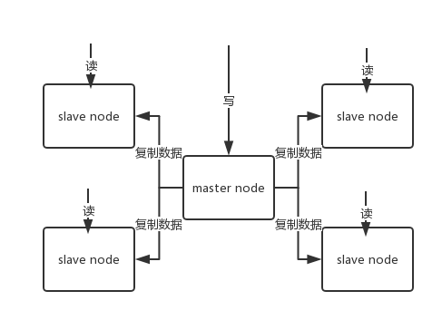

# REDIS常见面试题解析：


Redis 配置

```properties
#修改为守护模式  docker中需要注释
#daemonize yes
 
#设置进程锁文件
#pidfile /data/redis.pid
 
#端口
port 6379

bind 0.0.0.0
 
#客户端超时时间
timeout 300
 
#日志级别
loglevel debug
 
#日志文件位置
logfile /log/log-redis.log
 
#设置数据库的数量，默认数据库为0，可以使用SELECT <dbid>命令在连接上指定数据库id
databases 8
 
##指定在多长时间内，有多少次更新操作，就将数据同步到数据文件，可以多个条件配合
#save <seconds> <changes>
 
#Redis默认配置rdb文件中提供了三个条件：
save 900 1
save 300 10
save 60 10000
 
#指定存储至本地数据库时是否压缩数据，默认为yes，Redis采用LZF压缩，如果为了节省CPU时间，
 
#可以关闭该#选项，但会导致数据库文件变的巨大
rdbcompression yes
 
#指定本地数据库文件名
dbfilename dump.rdb
 
#指定本地数据库路径
#dir /data
 
#指定是否在每次更新操作后进行日志记录，Redis在默认情况下是异步的把数据写入磁盘，如果不开启，可能
#会在断电时导致一段时间内的数据丢失。因为 redis本身同步数据文件是按上面save条件来同步的，所以有
#的数据会在一段时间内只存在于内存中
#(默认no,关闭)表示是否开启AOF持久化
appendonly yes
appendfilename "myappendonly.aof"

# appendfsync no # 由操作系统执行，默认Linux配置最多丢失30秒

#磁盘同步策略 默认每秒一次 
#指定更新日志条件，共有3个可选值：
#no：表示等操作系统进行数据缓存同步到磁盘（快）
#always：表示每次更新操作后手动调用fsync()将数据写到磁盘（慢，安全）
#everysec：表示每秒同步一次（折衷，默认值）
appendfsync everysec

# auto‐aof‐rewrite‐min‐size 64mb //aof文件至少要达到64M才会自动重写，文件太小恢复速度本来就很快，重写的意义不大
# auto‐aof‐rewrite‐percentage 100 //aof文件自上一次重写后文件大小增长了100%则再次触发重写
# 进入redis客户端执行命令bgrewriteaof重写AOF

#Redis 4.0 混合持久化
#如果开启了混合持久化，AOF在重写时，不再是单纯将内存数据转换为RESP命令写入AOF文件，而是将
#重写这一刻之前的内存做RDB快照处理，并且将RDB快照内容和增量的AOF修改内存数据的命令存在一
#起，都写入新的AOF文件，新的文件一开始不叫appendonly.aof，等到重写完新的AOF文件才会进行改
#名，覆盖原有的AOF文件，完成新旧两个AOF文件的替换。
#于是在 Redis 重启的时候，可以先加载 RDB 的内容，然后再重放增量 AOF 日志就可以完全替代之前的
#AOF 全量文件重放，因此重启效率大幅得到提升。
# aof‐use‐rdb‐preamble yes


#通过参数 maxmemory <bytes> 来设定最大内存：不设定该参数默认是无限制的，但是通常会设定其为物理内存的四分之三。
maxmemory 2145386496
#当现有内存大于 maxmemory 时，便会触发redis主动淘汰内存方式，通过设置 maxmemory-policy ，有如下几种淘汰方式：
#1）volatile-lru   利用LRU算法移除设置过过期时间的key (LRU:最近使用 Least Recently Used ) 。
#2）allkeys-lru   利用LRU算法移除任何key （和上一个相比，删除的key包括设置过期时间和不设置过期时间的）。通常使用该方式。
#3）volatile-random 移除设置过过期时间的随机key 。
#4）allkeys-random  无差别的随机移除。
#5）volatile-ttl   移除即将过期的key(minor TTL) 
#6）noeviction 不移除任何key，只是返回一个写错误 ，默认选项，一般不会选用。
maxmemory-policy allkeys-lru

#Redis6.0 这里说 有三个IO 线程，还有一个线程是main线程，main线程负责IO读写和命令执行操作
#开启IO多线程
io-threads-do-reads yes
 
#配置线程数量，如果设为1就是主线程模式。
io-threads 4
```


## 1：Redis五种数据类型介绍

### 概述

Redis的键值可以使用物种数据类型：**字符串，散列表，列表，集合，有序集合**。本文详细介绍这五种数据类型的使用方法。本文命令介绍部分只是列举了基本的命令，至于具体的使用示例，可以参考Redis官方文档：[Redis命令大全](http://redis.readthedocs.org/en/latest/)

### A:字符串类型(String)

字符串是Redis中最基本的数据类型，它能够存储任何类型的字符串，包含二进制数据。可以用于存储邮箱，JSON化的对象，甚至是一张图片，一个字符串允许存储的最大容量为**512MB**。字符串是其他四种类型的基础，与其他几种类型的区别从本质上来说只是组织字符串的方式不同而已。

#### 基本命令

##### 字符串操作

1. **SET** 赋值，用法： `SET key value`
2. **GET** 取值，用法： `GET key`
3. **INCR** 递增数字，仅仅对数字类型的键有用，相当于Java的i++运算，用法： `INCR key`
4. **INCRBY** 增加指定的数字，仅仅对数字类型的键有用，相当于Java的i+=3，用法：`INCRBY key increment`，意思是key自增increment，increment可以为负数，表示减少。
5. **DECR** 递减数字，仅仅对数字类型的键有用，相当于Java的i–，用法：`DECR key`
6. **DECRBY** 减少指定的数字，仅仅对数字类型的键有用，相当于Java的i-=3，用法：`DECRBY key decrement`，意思是key自减decrement，decrement可以为正数，表示增加。
7. **INCRBYFLOAT** 增加指定浮点数，仅仅对数字类型的键有用，用法：`INCRBYFLOAT key increment`
8. **APPEND** 向尾部追加值，相当于Java中的”hello”.append(“ world”)，用法：`APPEND key value`
9. **STRLEN** 获取字符串长度，用法：`STRLEN key`
10. **MSET** 同时设置多个key的值，用法：`MSET key1 value1 [key2 value2 ...]`
11. **MGET** 同时获取多个key的值，用法：`MGET key1 [key2 ...]`

##### 位操作

1. **GETBIT** 获取一个键值的二进制位的指定位置的值(0/1)，用法：`GETBIT key offset`
2. **SETBIT** 设置一个键值的二进制位的指定位置的值(0/1)，用法：`SETBIT key offset value`
3. **BITCOUNT** 获取一个键值的一个范围内的二进制表示的1的个数，用法：`BITCOUNT key [start end]`
4. **BITOP** 该命令可以对多个字符串类型键进行位运算，并将结果存储到指定的键中，BITOP支持的运算包含：**OR,AND,XOR,NOT**，用法：`BITOP OP desKey key1 key2`
5. **BITPOS** 获取指定键的第一个位值为0或者1的位置，用法：`BITPOS key 0/1 [start， end]`

### B:散列类型(Hash)

散列类型相当于Java中的HashMap，他的值是一个字典，保存很多key，value对，每对key，value的值个键都是字符串类型，换句话说，散列类型不能嵌套其他数据类型。一个散列类型键最多可以包含2的32次方-1个字段。

#### 基本命令

1. **HSET** 赋值，用法：`HSET key field value`
2. **HMSET** 一次赋值多个字段，用法：`HMSET key field1 value1 [field2 values]`
3. **HGET** 取值，用法：`HSET key field`
4. **HMGET** 一次取多个字段的值，用法：`HMSET key field1 [field2]`
5. **HGETALL** 一次取所有字段的值，用法：`HGETALL key`
6. **HEXISTS** 判断字段是否存在，用法：`HEXISTS key field`
7. **HSETNX** 当字段不存在时赋值，用法：`HSETNX key field value`
8. **HINCRBY** 增加数字，仅对数字类型的值有用，用法：`HINCRBY key field increment`
9. **HDEL** 删除字段，用法：`HDEL key field`
10. **HKEYS** 获取所有字段名，用法：`HKEYS key`
11. **HVALS** 获取所有字段值，用法：`HVALS key`
12. **HLEN** 获取字段数量，用法：`HLEN key`

### C:列表类型(List)

列表类型(list)用于存储一个有序的字符串列表，常用的操作是向队列两端添加元素或者获得列表的某一片段。列表内部使用的是双向链表（double linked list）实现的，所以向列表两端添加元素的时间复杂度是O(1),获取越接近列表两端的元素的速度越快。但是缺点是使用列表通过索引访问元素的效率太低（需要从端点开始遍历元素）。所以列表的使用场景一般如：朋友圈新鲜事，只关心最新的一些内容。借助列表类型，Redis还可以作为消息队列使用。

可以使用：LPUSH    RPOP两个命令实现队列


#### 基本命令

1. **LPUSH** 向列表左端添加元素，用法：`LPUSH key value`
2. **RPUSH** 向列表右端添加元素，用法：`RPUSH key value`
3. **LPOP** 从列表左端弹出元素，用法：`LPOP key`
4. **RPOP** 从列表右端弹出元素，用法：`RPOP key`
5. **LLEN** 获取列表中元素个数，用法：`LLEN key`
6. **LRANGE** 获取列表中某一片段的元素，用法：`LRANGE key start stop`，index从0开始，-1表示最后一个元素
7. **LREM** 删除列表中指定的值，用法：`LREM key count value`，删除列表中前count个值为value的元素，当count>0时从左边开始数，count<0时从右边开始数，count=0时会删除所有值为value的元素
8. **LINDEX** 获取指定索引的元素值，用法：`LINDEX key index`
9. **LSET** 设置指定索引的元素值，用法：`LSET key index value`
10. **LTRIM** 只保留列表指定片段，用法：`LTRIM key start stop`，包含start和stop
11. **LINSERT** 像列表中插入元素，用法：`LINSERT key BEFORE|AFTER privot value`，从左边开始寻找值为privot的第一个元素，然后根据第二个参数是BEFORE还是AFTER决定在该元素的前面还是后面插入value
12. **RPOPLPUSH** 将元素从一个列表转义到另一个列表，用法：`RPOPLPUSH source destination`

### D:集合类型（Set）

集合在概念在高中课本就学过，集合中每个元素都是不同的，集合中的元素个数最多为2的32次方-1个，集合中的元素师没有顺序的。

#### 基本命令

1. **SADD** 添加元素，用法：`SADD key value1 [value2 value3 ...]`
2. **SREM** 删除元素，用法：`SREM key value2 [value2 value3 ...]`
3. **SMEMBERS** 获得集合中所有元素，用法：`SMEMBERS key`
4. **SISMEMBER** 判断元素是否在集合中，用法：`SISMEMBER key value`
5. **SDIFF** 对集合做差集运算，用法：`SDIFF key1 key2 [key3 ...]`，先计算key1和key2的差集，然后再用结果与key3做差集
6. **SINTER** 对集合做交集运算，用法：`SINTER key1 key2 [key3 ...]`
7. **SUNION** 对集合做并集运算，用法：`SUNION key1 key2 [key3 ...]`
8. **SCARD** 获得集合中元素的个数，用法：`SCARD key`
9. **SDIFFSTORE** 对集合做差集并将结果存储，用法：`SDIFFSTORE destination key1 key2 [key3 ...]`
10. **SINTERSTORE** 对集合做交集运算并将结果存储，用法：`SINTERSTORE destination key1 key2 [key3 ...]`
11. **SUNIONSTORE** 对集合做并集运算并将结果存储，用法：`SUNIONSTORE destination key1 key2 [key3 ...]`
12. **SRANDMEMBER** 随机获取集合中的元素，用法：`SRANDMEMBER key [count]`，当count>0时，会随机中集合中获取count个不重复的元素，当count<0时，随机中集合中获取|count|和可能重复的元素。
13. **SPOP** 从集合中随机弹出一个元素，用法：`SPOP key`

### E:有序集合类型(ZSet)

有序集合类型与集合类型的区别就是他是有序的。有序集合是在集合的基础上为每一个元素关联一个分数，这就让有序集合不仅支持插入，删除，判断元素是否存在等操作外，还支持获取分数最高/最低的前N个元素。有序集合中的每个元素是不同的，但是分数却可以相同。有序集合使用散列表和跳跃表实现，即使读取位于中间部分的数据也很快，时间复杂度为O(log(N))，有序集合比列表更费内存。

#### 基本命令

1. **ZADD** 添加元素，用法：`ZADD key score1 value1 [score2 value2 score3 value3 ...]`
2. **ZSCORE** 获取元素的分数，用法：`ZSCORE key value`
3. **ZRANGE** 获取排名在某个范围的元素，用法：`ZRANGE key start stop [WITHSCORE]`，按照元素从小到大的顺序排序，从0开始编号，包含start和stop对应的元素，WITHSCORE选项表示是否返回元素分数
4. **ZREVRANGE** 获取排名在某个范围的元素，用法：`ZREVRANGE key start stop [WITHSCORE]`，和上一个命令用法一样，只是这个倒序排序的。
5. **ZRANGEBYSCORE** 获取指定分数范围内的元素，用法：`ZRANGEBYSCORE key min max`，包含min和max，`(min`表示不包含min，`(max`表示不包含max，`+inf`表示无穷大
6. **ZINCRBY** 增加某个元素的分数，用法：`ZINCRBY key increment value`
7. **ZCARD** 获取集合中元素的个数，用法：`ZCARD key`
8. **ZCOUNT** 获取指定分数范围内的元素个数，用法：`ZCOUNT key min max`，min和max的用法和5中的一样
9. **ZREM** 删除一个或多个元素，用法：`ZREM key value1 [value2 ...]`
10. **ZREMRANGEBYRANK** 按照排名范围删除元素，用法：`ZREMRANGEBYRANK key start stop`
11. **ZREMRANGEBYSCORE** 按照分数范围删除元素，用法：`ZREMRANGEBYSCORE key min max`，min和max的用法和4中的一样
12. **ZRANK** 获取正序排序的元素的排名，用法：`ZRANK key value`
13. **ZREVRANK** 获取逆序排序的元素的排名，用法：`ZREVRANK key value`
14. **ZINTERSTORE** 计算有序集合的交集并存储结果，用法：`ZINTERSTORE destination numbers key1 key2 [key3 key4 ...] WEIGHTS weight1 weight2 [weight3 weight4 ...] AGGREGATE SUM | MIN | MAX`，numbers表示参加运算的集合个数，weight表示权重，aggregate表示结果取值
15. **ZUNIONSTORE** 计算有序几个的并集并存储结果，用法和14一样，不再赘述。

1. redis是单线程还是多线程？

   ```
   1，无论什么版本，工作线程就是一个
   2，6.x高版本出现了IO多线程
   3，使用上来说，没有变化

   3，[去学一下系统IO课]，你要真正的理解面向IO模型编程的时候，有内核的事，从内核把数据搬运到程序里这是第一步，然后，搬运回来的数据做的计算式第二步，netty
   4，单线程，满足redis的串行原子，只不过IO多线程后，把输入/输出放到更多的线程里去并行，好处如下：1，执行时间缩短，更快；2，更好的压榨系统及硬件的资源(网卡能够高效的使用)；
   *，客户端被读取的顺序不能被保障
   那个顺序时可以被保障的：在一个连接里，socket里
   ```

2. redis存在线程安全的问题吗？为什么？

   ```
   重复2中的单线程串行
   redis可以保障内部串行
   外界使用的时候要保障，业务上要自行保障顺序~！
   ```

3. 遇到过缓存穿透吗？详细描述一下。

4. 遇到过缓存击穿吗？详细描述一下。

5. 如何避免缓存雪崩？

   ```
   以上问题，核心就是避免DB无效/重复请求，结合图去理解
   涉及一些架构思想上的提升
   ```

6. Redis是怎么删除过期key的？

7. 缓存如何回收的？

   ```
   1，后台在轮询，分段分批的删除哪些过期的key
   2，请求的时候判断时候已经过期了
   尽量的把内存无用空间回收回来~！
   ```

8. 缓存是如何淘汰的

   ```
   0，内存空间不足的情况下：
   1，淘汰机制里有不允许淘汰
   2，lru/lfu/random/TTL
   3，全空间
   4，设置过过期的key的集合中
   ```

9. 如何进行缓存预热？

   ```
   1，提前把数据塞入redis，(你知道那些是热数据吗？肯定不知道，会造成上线很多数据没有缓存命中)
   2，开发逻辑上也要规避差集(你没缓存的)，会造成击穿，穿透，雪崩，实施456中的锁方案
   3，一劳永逸，未来也不怕了
   *，结合4，5，6点去看，看图理解
   ```

10. 数据库与缓存不一致如何解决？

    ```
    1，恶心点的，我们可以使用分布式事务来解决，（意义不大），顶多读多，写稀有情况下
    结合图去思考
    1，redis是缓存，更倾向于稍微的有时差
    2，还是减少DB的操作
    3，真的要落地，咱就canal吧
    ```

11. 简述一下主从不一致的问题？

    ```
    1，redis的确默认是弱一致性，异步的同步
    2，锁不能用主从(单实例/分片集群/redlock)==>redisson
    3，在配置中提供了必须有多少个Client连接能同步，你可以配置同步因子，趋向于强制一性
    4，wait 2 0  小心
    5，34点就有点违背redis的初衷了
    ```

12. 描述一下redis持久化原理？

    ```
    当前线程阻塞服务 不聊
    异步后台进程完成持久
    fork  +  cow
    ```

13. Redis有哪些持久化方式？

    ```
    1，RDB，AOF；主从同步也算持久化；
    2，高版本：开启AOF，AOF是可以通过执行日志得到全部内存数据的方式，但是追求性能：
    2.1，体积变大，重复无效指令  重写，后台用线程把内存的kv生成指令写个新的aof
    2.2，4.x 新增更有性能模式：把重写方式换成直接RDB放到aof文件的头部，比2.1的方法快了，再追加日志
    ```

14. Redis也打不住了，万级流量会打到DB上，该怎么处理？

    ```
    见456
    ```

15. redis中的事务三条指令式什么，第三条指令到达后执行失败了，怎么处理

    ```
    见图
    ```

    redis实现分布式锁的指令

## 2:什么是Redis 

Redis(Remote Dictionary Server) 是一个使用 C 语言编写的，开源的（BSD许 可）高性能非关系型（NoSQL）的键值对数据库。 

Redis 可以存储键和五种不同类型的值之间的映射。键的类型只能为字符串，值 支持五种数据类型：字符串、列表、集合、散列表、有序集合。 

与传统数据库不同的是 Redis 的数据是存在内存中的，所以读写速度非常快， 因此 redis 被广泛应用于缓存方向，每秒可以处理超过 10万次读写操作，是已
知性能快的Key-Value DB。

另外，Redis 也经常用来做分布式锁。除此之 外，Redis 支持事务 、持久化、LUA脚本、LRU驱动事件、多种集群方案。 

## 3:Redis有哪些优缺点 

### **优点 **

- 读写性能优异， Redis能读的速度是110000次/s，写的速度是81000次/s。 
- 支持数据持久化，支持AOF和RDB两种持久化方式。 
- 支持事务，Redis的所有操作都是原子性的，同时Redis还支持对几个操作合并 后的原子性执行。 
- 数据结构丰富，除了支持string类型的value外还支持hash、set、zset、list等 数据结构。 
- 支持主从复制，主机会自动将数据同步到从机，可以进行读写分离。 

### **缺点 **

- 数据库容量受到物理内存的限制，不能用作海量数据的高性能读写，因此Redis 适合的场景主要局限在较小数据量的高性能操作和运算上。 
- Redis 不具备自动容错和恢复功能，主机从机的宕机都会导致前端部分读写请求 失败，需要等待机器重启或者手动切换前端的IP才能恢复。 
- 主机宕机，宕机前有部分数据未能及时同步到从机，切换IP后还会引入数据不一 致的问题，降低了系统的可用性。 
- Redis 较难支持在线扩容，在集群容量达到上限时在线扩容会变得很复杂。为避免这一问题，运维人员在系统上线时必须确保有足够的空间，这对资源造成了很大的 浪费。 

## 4:为什么要用 Redis /为什么要用缓存 

主要从“高性能”和“高并发”这两点来看待这个问题。 

### 1:高性能： 

假如用户第一次访问数据库中的某些数据。这个过程会比较慢，因为是从硬盘上 读取的。将该用户访问的数据存在数缓存中，这样下一次再访问这些数据的时候 就可以直接从缓存中获取了。操作缓存就是直接操作内存，所以速度相当快。如果数据库中的对应数据改变的之后，同步改变缓存中相应的数据即可！


### 2:高并发： 

直接操作缓存能够承受的请求是远远大于直接访问数据库的，所以我们可以考虑 把数据库中的部分数据转移到缓存中去，这样用户的一部分请求会直接到缓存这 里而不用经过数据库。


## 5:为什么要用 Redis 而不用 map/guava 做缓存? 

缓存分为本地缓存和分布式缓存。以 Java 为例，使用自带的 map 或者 guava  实现的是本地缓存，主要的特点是轻量以及快速，生命周期随着 jvm 的销毁 而结束，并且在多实例的情况下，每个实例都需要各自保存一份缓存，缓存不具有一致性。 

使用 redis 或 memcached 之类的称为分布式缓存，在多实例的情况下，各实 例共用一份缓存数据，缓存具有一致性。缺点是需要保持 redis 或 memcached 服务的高可用，整个程序架构上较为复杂。 

## 6:Redis为什么这么快 

1. 完全基于内存，绝大部分请求是纯粹的内存操作，非常快速。数据存在内存 中，类似于 HashMap，HashMap 的优势就是查找和操作的时间复杂度都是 O(1)； 
2. 数据结构简单，对数据操作也简单，Redis 中的数据结构是专门进行设计 的；
3. 采用单线程，避免了不必要的上下文切换和竞争条件，也不存在多进程或者 多线程导致的切换而消耗 CPU，不用去考虑各种锁的问题，不存在加锁释放锁 操作，没有因为可能出现死锁而导致的性能消耗； 
4. 使用多路 I/O 复用模型，非阻塞 IO；epoll 模式 
5. 使用底层模型不同，它们之间底层实现方式以及与客户端之间通信的应用协 议不一样，Redis 直接自己构建了 VM 机制 ，因为一般的系统调用系统函数的 话，会浪费一定的时间去移动和请求； 
6. 零拷贝

# 2：数据类型

## Redis有哪些数据类型 

Redis主要有5种数据类型，包括String，List，Set，Zset，Hash，满足大部分 的使用要求 数据类型 可以存储 的值 操作 应用场景

| 数据类型 | 可以存储 的值            | 操作                                                         | 应用场景                                                     |
| :------: | :----------------------- | :----------------------------------------------------------- | :----------------------------------------------------------- |
|  STRING  | 字符串、 整数或者 浮点数 | 对整个字 符串或者 字符串的 其中一部 分执行操 作 对整数和 浮点数执 行自增或 者自减操 作 | 做简单的 键值对缓 存                                         |
|   LIST   | 列表                     | 从两端压 入或者弹 出元素 对单个或 者多个元 素进行修 剪， 只保留一 个范围内 的元素 | 存储一些 列表型的 数据结 构，类似 粉丝列 表、文章 的评论列 表之类的 数据 |
|   SET    | 无序集合                 | 添加、获 取、移除 单个元素 检查一个 元素是否 存在于集 合中   | 交集、并 集、差集 的操作， 比如交 集，可以 把两个人 的粉丝列 |
|   HASH   | 包含键值 对的无序 散列表 | 添加、获 取、移除 单个键值 对 获取所有 键值对  检查某个 键是否存 在 | 结构化的 数据，比 如一个对 象                                |
|   ZSET   | 有序集合                 | 添加、获 取、删除 元素 根据分值 范围或者 成员来获 取元素  计算一个 键的排名 | 去重但可 以排序， 如获取排 名前几名 的用户                   |


# 3：Redis的应用场景 

## 总结一 

### 计数器 

可以对 String 进行自增自减运算，从而实现计数器功能。Redis 这种内存型数 据库的读写性能非常高，很适合存储频繁读写的计数量。 

### 缓存 

将热点数据放到内存中，设置内存的大使用量以及淘汰策略来保证缓存的命中率。 

### 会话缓存 

可以使用 Redis 来统一存储多台应用服务器的会话信息。当应用服务器不再存 储用户的会话信息，也就不再具有状态，一个用户可以请求任意一个应用服务 器，从而更容易实现高可用性以及可伸缩性。 

### 全页缓存（FPC） 

除基本的会话token之外，Redis还提供很简便的FPC平台。以Magento为例， Magento提供一个插件来使用Redis作为全页缓存后端。此外，对WordPress的用户来说，Pantheon有一个非常好的插件 wp-redis，这个插件能帮助你以 快速度加载你曾浏览过的页面。 

### 查找表 

例如 DNS 记录就很适合使用 Redis 进行存储。查找表和缓存类似，也是利用了  Redis 快速的查找特性。但是查找表的内容不能失效，而缓存的内容可以失效， 因为缓存不作为可靠的数据来源。 

### 消息队列(发布/订阅功能) 

List 是一个双向链表，可以通过 lpush 和 rpop 写入和读取消息。不过最好使用  Kafka、RabbitMQ 等消息中间件。 

分布式锁实现 在分布式场景下，无法使用单机环境下的锁来对多个节点上的进程进行同步。可 以使用 Redis 自带的 SETNX 命令实现分布式锁，除此之外，还可以使用官方提 供的 RedLock 分布式锁实现。 

其它 

Set 可以实现交集、并集等操作，从而实现共同好友等功能。ZSet 可以实现有 序性操作，从而实现排行榜等功能。 

## 总结二 

Redis相比其他缓存，有一个非常大的优势，就是支持多种数据类型。 

数据类型说明string字符串，简单的k-v存储hashhash格式，value为field和 value，适合ID-Detail这样的场景。list简单的list，顺序列表，支持首位或者末 尾插入数据set无序list，查找速度快，适合交集、并集、差集处理sorted set有 序的set 

其实，通过上面的数据类型的特性，基本就能想到合适的应用场景了。 

string——适合简单的k-v存储，类似于memcached的存储结构，短信验证 码，配置信息等，就用这种类型来存储。 

hash——一般key为ID或者唯一标示，value对应的就是详情了。如商品详情， 个人信息详情，新闻详情等。

list——因为list是有序的，比较适合存储一些有序且数据相对固定的数据。如省 市区表、字典表等。因为list是有序的，适合根据写入的时间来排序，如：新 的***，消息队列等。

set——可以简单的理解为ID-List的模式，如微博中一个人有哪些好友，set 牛的地方在于，可以对两个set提供交集、并集、差集操作。例如：查找两个人 共同的好友等。 

Sorted Set——是set的增强版本，增加了一个score参数，自动会根据score的 值进行排序。比较适合类似于top 10等不根据插入的时间来排序的数据。 如上所述，虽然Redis不像关系数据库那么复杂的数据结构，但是，也能适合很 多场景，比一般的缓存数据结构要多。了解每种数据结构适合的业务场景，不仅 有利于提升开发效率，也能有效利用Redis的性能。

# 4：持久化

## 1：什么是Redis持久化？ 

持久化就是把内存的数据写到磁盘中去，防止服务宕机了内存数据丢失。 

## 2：Redis 的持久化机制是什么？各自的优缺点？ 

Redis 提供两种持久化机制 RDB（默认） 和 AOF 机制: 

### 1：RDB：是Redis DataBase缩写快照 

RDB是Redis默认的持久化方式。按照一定的时间将内存的数据以快照的形式保 存到硬盘中，对应产生的数据文件为dump.rdb。通过配置文件中的save参数来 定义快照的周期。

```properties
##指定在多长时间内，有多少次更新操作，就将数据同步到数据文件，可以多个条件配合
#save <seconds> <changes>
 
#Redis默认配置rdb文件中提供了三个条件：
save 900 1
save 300 10
save 60 10000
#指定本地数据库文件名
dbfilename dump.rdb
```


#### A:优点：

1. 只有一个文件 dump.rdb，方便持久化。 
2. 容灾性好，一个文件可以保存到安全的磁盘。 
3. 性能大化，fork 子进程来完成写操作，让主进程继续处理命令，所以是  IO 大化。使用单独子进程来进行持久化，主进程不会进行任何 IO 操作，保证了  redis 的高性能 
4. 相对于数据集大时，比 AOF 的启动效率更高。 

#### B:缺点：

1. 数据安全性低。RDB 是间隔一段时间进行持久化，如果持久化之间 redis 发 生故障，会发生数据丢失。所以这种方式更适合数据要求不严谨的时候) 
2. AOF（Append-only file)持久化方式： 是指所有的命令行记录以 redis 命 令请 求协议的格式完全持久化存储)保存为 aof 文件。 

### 2:AOF：持久化 

AOF持久化(即Append Only File持久化)，则是将Redis执行的每次写命令记录 到单独的日志文件中，当重启Redis会重新将持久化的日志中文件恢复数据。 当两种方式同时开启时，数据恢复Redis会优先选择AOF恢复。

```properties
#(默认no,关闭)表示是否开启AOF持久化
appendonly yes
appendfilename "myappendonly.aof"
#磁盘同步策略 默认每秒一次 
#指定更新日志条件，共有3个可选值：
#no：表示等操作系统进行数据缓存同步到磁盘（快）
#always：表示每次更新操作后手动调用fsync()将数据写到磁盘（慢，安全）
#everysec：表示每秒同步一次（折衷，默认值）
appendfsync everysec
```


#### 优点：

1. 数据安全，aof 持久化可以配置 appendfsync 属性，有 always，每进行一 次 命令操作就记录到 aof 文件中一次。 
2. 通过 append 模式写文件，即使中途服务器宕机，可以通过 redis-checkaof 工具解决数据一致性问题。 
3. AOF 机制的 rewrite 模式。AOF 文件没被 rewrite 之前（文件过大时会对命 令 进行合并重写），可以删除其中的某些命令（比如误操作的 flushall）) 

#### 缺点： 

1. AOF 文件比 RDB 文件大，且恢复速度慢。 
2. 数据集大的时候，比 rdb 启动效率低。 

### 优缺点是什么？ 

- AOF文件比RDB更新频率高，优先使用AOF还原数据。 
- AOF比RDB更安全也更大 
- RDB性能比AOF好 
- 如果两个都配了优先加载AOF 

## 3:如何选择合适的持久化方式

- 一般来说， 如果想达到足以媲美PostgreSQL的数据安全性，你应该 同时使用两种持久化功能。在这种情况下，当 Redis 重启的时候会优先载 入AOF文件来恢复原始的数据，因为在通常情况下AOF文件保存的数据集 要比RDB文件保存的数据集要完整。 

- 如果你非常关心你的数据， 但仍然可以承受数分钟以内的数据丢失， 那么你可以只使用RDB持久化。 

- 有很多用户都只使用AOF持久化，但并不推荐这种方式，因为定时生 成RDB快照（snapshot）非常便于进行数据库备份， 并且 RDB 恢复数据 集的速度也要比AOF恢复的速度要快，除此之外，使用RDB还可以避免 AOF程序的bug。 

- 如果你只希望你的数据在服务器运行的时候存在，你也可以不使用任 何持久化方式。 

##  4:混合持久化(4.0之后支持)

  \# aof‐use‐rdb‐preamble yes 开启了混合持久化，AOF在重写时，不再是单纯将内存数据转换为RESP命令写入AOF文件，而是将
  重写这一刻之前的内存做RDB快照处理，并且将RDB快照内容和增量的AOF修改内存数据的命令存在一
  起，都写入新的AOF文件，新的文件一开始不叫appendonly.aof，等到重写完新的AOF文件才会进行改
  名，覆盖原有的AOF文件，完成新旧两个AOF文件的替换。
  于是在 Redis 重启的时候，可以先加载 RDB 的内容，然后再重放增量 AOF 日志就可以完全替代之前的
  AOF 全量文件重放，因此重启效率大幅得到提升。


## 5：Redis持久化数据和缓存怎么做扩容？

如果Redis被当做缓存使用，使用一致性哈希实现动态扩容缩容。

如果Redis被当做一个持久化存储使用，必须使用固定的keys-tonodes映射关系，节点的数量一旦确定不能变化。否则的话(即Redis节点需要动态变化的情况），必须使用可以在运行时进行数据再平衡的一套系统，而当前只有Redis集群可以做到这样。

# 6：过期键的删除策略

## 1：Redis的过期键的删除策略

我们都知道，Redis是key-value数据库，我们可以设置Redis中缓存的key的过期时间。Redis的过期策略就是指当Redis中缓存的key过期了，Redis如何处理。

过期策略通常有以下三种：

* 定时过期：每个设置过期时间的key都需要创建一个定时器，到过期时间就会立即清除。该策略可以立即清除过期的数据，对内存很友好；但是会占用大量的CPU资源去处理过期的数据，从而影响缓存的响应时间和吞吐量。

* 惰性过期：只有当访问一个key时，才会判断该key是否已过期，过期则清除。该策略可以 大化地节省CPU资源，却对内存非常不友好。极端情况可能出现大量的过期key没有再次被访问，从而不会被清除，占用大量内存。

* 定期过期：每隔一定的时间，会扫描一定数量的数据库的expires字典中一定数量的key，并清除其中已过期的key。该策略是前两者的一个折中方案。通过调整定时扫描的时间间隔和每次扫描的限定耗时，可以在不同情况下使得CPU和内存资源达到 优的平衡效果。(expires字典会保存所有设置了过期时间的key的过期时间数据，其中，key是指向键空间中的某个键的指针，value是该键的毫秒精度的UNIX时间戳表示的过期时间。键空间是指该Redis集群中保存的所有键。)

Redis中同时使用了惰性过期和定期过期两种过期策略。

## 2：Redis key的过期时间和永久有效分别怎么设置？

EXPIRE和PERSIST命令。

### 3：我们知道通过expire来设置key 的过期时间，那么对过期的数据怎么处理呢?

除了缓存服务器自带的缓存失效策略之外（Redis默认的有6中策略可供选择），我们还可以根据具体的业务需求进行自定义的缓存淘汰，常见的策略有两种：

1. 定时去清理过期的缓存；(定期过期)

2. 当有用户请求过来时，再判断这个请求所用到的缓存是否过期，过期的话就去底层系统得到新数据并更新缓存。(惰性过期)

两者各有优劣，第一种的缺点是维护大量缓存的key是比较麻烦的，第二种的缺点就是每次用户请求过来都要判断缓存失效，逻辑相对比较复杂！具体用哪种方案，大家可以根据自己的应用场景来权衡。

# 内存相关

MySQL里有2000w数据，redis中只存20w的数据，如何保证redis中的数据都是热点数据

redis内存数据集大小上升到一定大小的时候，就会施行数据淘汰策略。

## Redis的内存淘汰策略有哪些

Redis的内存淘汰策略是指在Redis的用于缓存的内存不足时，怎么处理需要新写入且需要申请额外空间的数据。

全局的键空间选择性移除

* noeviction：不过期，当内存不足以容纳新写入数据时，新写入操作会报错。

* allkeys-lru：当内存不足以容纳新写入数据时，在键空间中，移除近 少使用的key。（这个是最常用的）

* allkeys-random：当内存不足以容纳新写入数据时，在键空间中，随机移除某个key。

设置过期时间的键空间选择性移除

* volatile-lru：当内存不足以容纳新写入数据时，在设置了过期时间的键空间中，移除近少使用的key。

* volatile-random：当内存不足以容纳新写入数据时，在设置了过期时间的键空间中，随机移除某个key。

* volatile-ttl：当内存不足以容纳新写入数据时，在设置了过期时间的键空间中，有更早过期时间的key优先移除。

总结

Redis的内存淘汰策略的选取并不会影响过期的key的处理。内存淘汰策略用于处理内存不足时的需要申请额外空间的数据；过期策略用于处理过期的缓存数据。

### Redis主要消耗什么物理资源？

内存。

## Redis的内存用完了会发生什么？

如果达到设置的上限，Redis的写命令会返回错误信息（但是读命令还可以正常返回。）或者你可以配置内存淘汰机制，当Redis达到内存上限时会冲刷掉旧的内容。

## Redis如何做内存优化？

可以好好利用Hash,list,sorted set,set等集合类型数据，因为通常情况下很多小的Key-Value可以用更紧凑的方式存放到一起。尽可能使用散列表（hashes），散列表（是说散列表里面存储的数少）使用的内存非常小，所以你应该尽可能的将你的数据模型抽象到一个散列表里面。比如你的web系统中有一个用户对象，不要为这个用户的名称，姓氏，邮箱，密码设置单独的key，而是应该把这个用户的所有信息存储到一张散列表里面线程模型

## Redis线程模型

Redis基于Reactor模式开发了网络事件处理器，这个处理器被称为文件事件处

理器（file event handler）。它的组成结构为4部分：多个套接字、IO多路复用程序、文件事件分派器、事件处理器。因为文件事件分派器队列的消费是单线程的，所以Redis才叫单线程模型。

文件事件处理器使用 I/O 多路复用（multiplexing）程序来同时监听多个套接字， 并根据套接字目前执行的任务来为套接字关联不同的事件处理器。

​         当被监听的套接字准备好执行连接应答（accept）、读取（read）、写入（write）、关闭（close）等操作时， 与操作相对应的文件事件就会产生， 这时文件事件处理器就会调用套接字之前关联好的事件处理器来处理这些事件。

虽然文件事件处理器以单线程方式运行， 但通过使用 I/O 多路复用程序来监听多个套接字， 文件事件处理器既实现了高性能的网络通信模型， 又可以很好地与 redis 服务器中其他同样以单线程方式运行的模块进行对接， 这保持了 

Redis 内部单线程设计的简单性。

## 什么是事务？

事务是一个单独的隔离操作：事务中的所有命令都会序列化、按顺序地执行。事务在执行的过程中，不会被其他客户端发送来的命令请求所打断。

事务是一个原子操作：事务中的命令要么全部被执行，要么全部都不执行。

## Redis事务的概念

Redis 事务的本质是通过MULTI、EXEC、WATCH等一组命令的集合。事务支持一次执行多个命令，一个事务中所有命令都会被序列化。在事务执行过程，会按照顺序串行化执行队列中的命令，其他客户端提交的命令请求不会插入到事务执行命令序列中。

总结说：redis事务就是一次性、顺序性、排他性的执行一个队列中的一系列命令。

## Redis事务的三个阶段

1. 事务开始 MULTI

2. 命令入队

3. 事务执行 EXEC

事务执行过程中，如果服务端收到有EXEC、DISCARD、WATCH、MULTI之外的请求，将会把请求放入队列中排队

## Redis事务相关命令

Redis事务功能是通过MULTI、EXEC、DISCARD和WATCH 四个原语实现的

Redis会将一个事务中的所有命令序列化，然后按顺序执行。

1. redis 不支持回滚，“Redis 在事务失败时不进行回滚，而是继续执行余下的命令”， 所以 Redis 的内部可以保持简单且快速。

2. 如果在一个事务中的命令出现错误，那么所有的命令都不会执行；

3. 如果在一个事务中出现运行错误，那么正确的命令会被执行。

 WATCH 命令是一个乐观锁，可以为 Redis 事务提供 check-and-set （CAS）行为。 可以监控一个或多个键，一旦其中有一个键被修改（或删除），之后的事务就不会执行，监控一直持续到EXEC命令。

 MULTI命令用于开启一个事务，它总是返回OK。 MULTI执行之后，客户端可以继续向服务器发送任意多条命令，这些命令不会立即被执行，而是被放到一个队列中，当EXEC命令被调用时，所有队列中的命令才会被执行。

 EXEC：执行所有事务块内的命令。返回事务块内所有命令的返回值，按命令执行的先后顺序排列。 当操作被打断时，返回空值 nil 。

 通过调用DISCARD，客户端可以清空事务队列，并放弃执行事务， 并且客户端会从事务状态中退出。

 UNWATCH命令可以取消watch对所有key的监控。

## 事务管理（ACID）概述

原子性（Atomicity）

原子性是指事务是一个不可分割的工作单位，事务中的操作要么都发生，要么都不发生。

一致性（Consistency）

事务前后数据的完整性必须保持一致。

隔离性（Isolation）

多个事务并发执行时，一个事务的执行不应影响其他事务的执行持久性（Durability）持久性是指一个事务一旦被提交，它对数据库中数据的改变就是永久性的，接下来即使数据库发生故障也不应该对其有任何影响

Redis的事务总是具有ACID中的一致性和隔离性，其他特性是不支持的。当服务器运行在AOF持久化模式下，并且appendfsync选项的值为always时，事务也具有耐久性。

## Redis事务支持隔离性吗

Redis 是单进程程序，并且它保证在执行事务时，不会对事务进行中断，事务可以运行直到执行完所有事务队列中的命令为止。因此，Redis 的事务是总是带有隔离性的。

## Redis事务保证原子性吗，支持回滚吗

Redis中，单条命令是原子性执行的，但事务不保证原子性，且没有回滚。事务中任意命令执行失败，其余的命令仍会被执行。

## Redis事务其他实现

 基于Lua脚本，Redis可以保证脚本内的命令一次性、按顺序地执行，其同时也不提供事务运行错误的回滚，执行过程中如果部分命令运行错误，剩下的命令还是会继续运行完

 基于中间标记变量，通过另外的标记变量来标识事务是否执行完成，读取数据时先读取该标记变量判断是否事务执行完成。但这样会需要额外写代码实现，比较繁琐

## 集群方案

### 哨兵模式


哨兵的介绍

sentinel，中文名是哨兵。哨兵是 redis 集群机构中非常重要的一个组件，主要有以下功能：

集群监控：负责监控 redis master 和 slave 进程是否正常工作。

消息通知：如果某个 redis 实例有故障，那么哨兵负责发送消息作为报警通知给管理员。

故障转移：如果 master node 挂掉了，会自动转移到 slave node 上。

配置中心：如果故障转移发生了，通知 client 客户端新的 master 地址。

哨兵用于实现 redis 集群的高可用，本身也是分布式的，作为一个哨兵集群去运行，互相协同工作。

 故障转移时，判断一个 master node 是否宕机了，需要大部分的哨兵都同意才行，涉及到了分布式选举的问题。

 即使部分哨兵节点挂掉了，哨兵集群还是能正常工作的，因为如果一个作为高可用机制重要组成部分的故障转移系统本身是单点的，那就很坑爹了。

哨兵的核心知识

  哨兵至少需要 3 个实例，来保证自己的健壮性。

 哨兵 + redis 主从的部署架构，是不保证数据零丢失的，只能保证 redis 集群的高可用性。

 对于哨兵 + redis 主从这种复杂的部署架构，尽量在测试环境和生产环境，都进行充足的测试和演练。

### 官方Redis Cluster 方案(服务端路由查询)


redis 集群模式的工作原理能说一下么？在集群模式下，redis 的 key 是如何寻址的？分布式寻址都有哪些算法？了解一致性 hash 算法吗？

简介

Redis Cluster是一种服务端Sharding技术，3.0版本开始正式提供。Redis Cluster并没有使用一致性hash，而是采用slot(槽)的概念，一共分成16384个槽。将请求发送到任意节点，接收到请求的节点会将查询请求发送到正确的节点上执行

#### 方案说明

1. 通过哈希的方式，将数据分片，每个节点均分存储一定哈希槽(哈希值) 区间的数据，默认分配了16384 个槽位

2. 每份数据分片会存储在多个互为主从的多节点上

3. 数据写入先写主节点，再同步到从节点(支持配置为阻塞同步)

4. 同一分片多个节点间的数据不保持一致性

5. 读取数据时，当客户端操作的key没有分配在该节点上时，redis会返回转向指令，指向正确的节点

6. 扩容时时需要需要把旧节点的数据迁移一部分到新节点

在 redis cluster 架构下，每个 redis 要放开两个端口号，比如一个是 6379，另外一个就是 加1w 的端口号，比如 16379。

16379 端口号是用来进行节点间通信的，也就是 cluster bus 的东西，cluster bus 的通信，用来进行故障检测、配置更新、故障转移授权。cluster bus 用了另外一种二进制的协议，gossip 协议，用于节点间进行高效的数据交换，占用更少的网络带宽和处理时间。

#### 节点间的内部通信机制

基本通信原理

集群元数据的维护有两种方式：集中式、Gossip 协议。redis cluster 节点间采用 gossip 协议进行通信。

分布式寻址算法

hash 算法（大量缓存重建）

一致性 hash 算法（自动缓存迁移）+ 虚拟节点（自动负载均衡） redis cluster 的 hash slot 算法优点

无中心架构，支持动态扩容，对业务透明

具备Sentinel的监控和自动Failover(故障转移)能力

客户端不需要连接集群所有节点，连接集群中任何一个可用节点即可高性能，客户端直连redis运维也很复杂，数据迁移需要人工干预只能使用0号数据库

不支持批量操作(pipeline管道操作) 分布式逻辑和存储模块耦合等基于客户端分配


简介

Redis Sharding是Redis Cluster出来之前，业界普遍使用的多Redis实例集群方法。其主要思想是采用哈希算法将Redis数据的key进行散列，通过hash函数，特定的key会映射到特定的Redis节点上。Java redis客户端驱动jedis，支持

Redis Sharding功能，即ShardedJedis以及结合缓存池的ShardedJedisPool 优点

优势在于非常简单，服务端的Redis实例彼此独立，相互无关联，每个Redis实例像单服务器一样运行，非常容易线性扩展，系统的灵活性很强缺点

由于sharding处理放到客户端，规模进一步扩大时给运维带来挑战。

客户端sharding不支持动态增删节点。服务端Redis实例群拓扑结构有变化时，每个客户端都需要更新调整。连接不能共享，当应用规模增大时，资源浪费制约优化基于代理服务器分片


简介客户端发送请求到一个代理组件，代理解析客户端的数据，并将请求转发至正确的节点， 后将结果回复给客户端特征

透明接入，业务程序不用关心后端Redis实例，切换成本低

Proxy 的逻辑和存储的逻辑是隔离的代理层多了一次转发，性能有所损耗业界开源方案

Twtter开源的Twemproxy 豌豆荚开源的Codis

### Redis 主从架构

单机的 redis，能够承载的 QPS 大概就在上万到几万不等。对于缓存来说，一般都是用来支撑读高并发的。因此架构做成主从(master-slave)架构，一主多从，主负责写，并且将数据复制到其它的 slave 节点，从节点负责读。所有的读请求全部走从节点。这样也可以很轻松实现水平扩容，支撑读高



主从复制的过程：


redis replication -> 主从架构 -> 读写分离 -(redis­master­slave)> 水平扩容支撑读高并发 redis replication 的核心机制

 redis 采用异步方式复制数据到 slave 节点，不过 redis2.8 开始，slave node 会周期性地确认自己每次复制的数据量；

一个 master node 是可以配置多个 slave node 的； slave node 也可以连接其他的 slave node；

slave node 做复制的时候，不会 block master node 的正常工作；

slave node 在做复制的时候，也不会 block 对自己的查询操作，它会用旧的数据集来提供服务；但是复制完成的时候，需要删除旧数据集，加载新数据集，这个时候就会暂停对外服务了；

 slave node 主要用来进行横向扩容，做读写分离，扩容的 slave node 可以提高读的吞吐量。

注意，如果采用了主从架构，那么建议必须开启 master node 的持久化，不建议用 slave node 作为 master node 的数据热备，因为那样的话，如果你关掉 master 的持久化，可能在 master 宕机重启的时候数据是空的，然后可能一经过复制， slave node 的数据也丢了。

另外，master 的各种备份方案，也需要做。万一本地的所有文件丢失了，从备份中挑选一份 rdb 去恢复 master，这样才能确保启动的时候，是有数据的，即使采用了后续讲解的高可用机制，slave node 可以自动接管 master node，但也可能 sentinel 还没检测到 master failure，master node 就自动重启了，还是可能导致上面所有的 slave node 数据被清空。

redis 主从复制的核心原理当启动一个 slave node 的时候，它会发送一个 PSYNC 命令给 master node。

如果这是 slave node 初次连接到 master node，那么会触发一次 full resynchronization 全量复制。此时 master 会启动一个后台线程，开始生成一份 RDB 快照文件，同时还会将从客户端 client 新收到的所有写命令缓存在内存中。RDB 文件生成完毕后， master 会将这个 RDB 发送给 slave，slave 会先写入本地磁盘，然后再从本地磁盘加载到内存中，接着 master 会将内存中缓存的写命令发送到 slave，slave 也会同步这些数据。

slave node 如果跟 master node 有网络故障，断开了连接，会自动重连，连接之后 master node 仅会复制给 slave 部分缺少的数据。


1. 当从库和主库建立MS关系后，会向主数据库发送SYNC命令

2. 主库接收到SYNC命令后会开始在后台保存快照(RDB持久化过程)，并将期间接收到的写命令存起来

3. 当快照完成后，主Redis会将快照文件和所有缓存的写命令发送给从Redis

4. 从Redis接收到后，会载入快照文件并且执行收到的缓存的命令

5. 之后，主Redis每当接收到写命令时就会将命令发送从Redis，从而保证数据的一致

   

缺点

所有的slave节点数据的复制和同步都由master节点来处理，会照成master节点压力太大，使用主从从结构来解决

### 主从复制风暴

为了缓解主从复制风暴(多个从节点同时复制主节点导致主节点压力过大)，可以做如
下架构，让部分从节点与从节点(与主节点同步)同步数据

### Redis集群的主从复制模型是怎样的？

为了使在部分节点失败或者大部分节点无法通信的情况下集群仍然可用，所以集群使用了主从复制模型，每个节点都会有N-1个复制品生产环境中的 redis 是怎么部署的？

redis cluster，10 台机器，5 台机器部署了 redis 主实例，另外 5 台机器部署了 redis 的从实例，每个主实例挂了一个从实例，5 个节点对外提供读写服务，每个节点的读写高峰qps可能可以达到每秒 5 万，5 台机器 多是 25 万读写请求/s。

机器是什么配置？32G 内存+ 8 核 CPU + 1T 磁盘，但是分配给 redis 进程的是10g内存，一般线上生产环境，redis 的内存尽量不要超过 10g，超过 10g 可能会有问题。

5 台机器对外提供读写，一共有 50g 内存。

因为每个主实例都挂了一个从实例，所以是高可用的，任何一个主实例宕机，都会自动故障迁移，redis 从实例会自动变成主实例继续提供读写服务。

你往内存里写的是什么数据？每条数据的大小是多少？商品数据，每条数据是 10kb。100 条数据是 1mb，10 万条数据是 1g。常驻内存的是 200 万条商品数据，占用内存是 20g，仅仅不到总内存的 50%。目前高峰期每秒就是 3500 左右的请求量。

其实大型的公司，会有基础架构的 team 负责缓存集群的运维。

### 说说Redis哈希槽的概念？

Redis集群没有使用一致性hash,而是引入了哈希槽的概念，Redis集群有16384 个哈希槽，每个key通过CRC16校验后对16384取模来决定放置哪个槽，集群的每个节点负责一部分hash槽。

### Redis集群会有写操作丢失吗？为什么？

Redis并不能保证数据的强一致性，这意味这在实际中集群在特定的条件下可能会丢失写操作。

Redis集群之间是如何复制的？

异步复制

Redis集群最大节点个数是多少？

16384个

Redis集群如何选择数据库？

Redis集群目前无法做数据库选择，默认在0数据库。

集群是否完整才能对外提供服务？
当redis.conf的配置cluster-require-full-coverage为no时，表示当负责一个插槽的主库下线且没有相应的从
库进行故障恢复时，集群仍然可用，如果为yes则集群不可用。

Redis集群对批量操作命令的支持
对于类似mset，mget这样的多个key的原生批量操作命令，redis集群只支持所有key落在同一slot的情况，如
果有多个key一定要用mset命令在redis集群上操作，则可以在key的前面加上{XX}，这样参数数据分片hash计
算的只会是大括号里的值，这样能确保不同的key能落到同一slot里去，示例如下：

- mset {user1}:1:name zhuge {user1}:1:age 18

假设name和age计算的hash slot值不一样，但是这条命令在集群下执行，redis只会用大括号里的 user1 做hash slot计算，所以算出来的slot值肯定相同，最后都能落在同一slot。

# 分区

## Redis是单线程的，如何提高多核CPU的利用率？

可以在同一个服务器部署多个Redis的实例，并把他们当作不同的服务器来使用，在某些时候，无论如何一个服务器是不够的， 所以，如果你想使用多个

CPU，你可以考虑一下分片（shard）。

## 为什么要做Redis分区？

分区可以让Redis管理更大的内存，Redis将可以使用所有机器的内存。如果没有分区，你最多只能使用一台机器的内存。分区使Redis的计算能力通过简单地增加计算机得到成倍提升，Redis的网络带宽也会随着计算机和网卡的增加而成倍增长。

## 你知道有哪些Redis分区实现方案？

 客户端分区就是在客户端就已经决定数据会被存储到哪个redis节点或者从哪个 redis节点读取。大多数客户端已经实现了客户端分区。

 代理分区 意味着客户端将请求发送给代理，然后代理决定去哪个节点写数据或者读数据。代理根据分区规则决定请求哪些Redis实例，然后根据Redis的响应结果返回给客户端。redis和memcached的一种代理实现就是Twemproxy

 查询路由(Query routing) 的意思是客户端随机地请求任意一个redis实例，然后由Redis将请求转发给正确的Redis节点。Redis Cluster实现了一种混合形式的查询路由，但并不是直接将请求从一个redis节点转发到另一个redis节点，而是在客户端的帮助下直接redirected到正确的redis节点。

## Redis分区有什么缺点？

 涉及多个key的操作通常不会被支持。例如你不能对两个集合求交集，因为他们可能被存储到不同的Redis实例（实际上这种情况也有办法，但是不能直接使用交集指令）。

同时操作多个key,则不能使用Redis事务.

分区使用的粒度是key，不能使用一个非常长的排序key存储一个数据集（The partitioning granularity is the key, so it is not possible to shard a dataset with a single huge key like a very big sorted set）

 当使用分区的时候，数据处理会非常复杂，例如为了备份你必须从不同的Redis 实例和主机同时收集RDB / AOF文件。

 分区时动态扩容或缩容可能非常复杂。Redis集群在运行时增加或者删除Redis 节点，能做到  大程度对用户透明地数据再平衡，但其他一些客户端分区或者代理分区方法则不支持这种特性。然而，有一种预分片的技术也可以较好的解决这个问题。

# 分布式问题

## Redis实现分布式锁

Redis为单进程单线程模式，采用队列模式将并发访问变成串行访问，且多客户

端对Redis的连接并不存在竞争关系Redis中可以使用SETNX命令实现分布式锁。

当且仅当 key 不存在，将 key 的值设为 value。 若给定的 key 已经存在，则

SETNX 不做任何动作

SETNX 是『SET if Not eXists』(如果不存在，则 SET)的简写。

返回值：设置成功，返回 1 。设置失败，返回 0 。


使用SETNX完成同步锁的流程及事项如下(img)：使用SETNX命令获取锁，若返回0（key已存在，锁已存在）则获取失败，反之获取成功为了防止获取锁后程序出现异常，导致其他线程/进程调用SETNX命令总是返回

0而进入死锁状态，需要为该key设置一个“合理”的过期时间释放锁，使用DEL命令将锁数据删除

## 如何解决 Redis 的并发竞争 Key 问题

所谓 Redis 的并发竞争 Key 的问题也就是多个系统同时对一个 key 进行操作，但是 后执行的顺序和我们期望的顺序不同，这样也就导致了结果的不同！

推荐一种方案：分布式锁（zookeeper 和 redis 都可以实现分布式锁）。（如果不存在 Redis 的并发竞争 Key 问题，不要使用分布式锁，这样会影响性能）基于zookeeper临时有序节点可以实现的分布式锁。大致思想为：每个客户端对某个方法加锁时，在zookeeper上的与该方法对应的指定节点的目录下，生成一个唯一的瞬时有序节点。 判断是否获取锁的方式很简单，只需要判断有序节点中序号 小的一个。 当释放锁的时候，只需将这个瞬时节点删除即可。同时，其可以避免服务宕机导致的锁无法释放，而产生的死锁问题。完成业务流程后，删除对应的子节点释放锁。

在实践中，当然是从以可靠性为主。所以首推Zookeeper。

## 分布式Redis是前期做还是后期规模上来了再做好？为什么？

既然Redis是如此的轻量（单实例只使用1M内存），为防止以后的扩容， 好的办法就是一开始就启动较多实例。即便你只有一台服务器，你也可以一开始就让Redis以分布式的方式运行，使用分区，在同一台服务器上启动多个实例。

一开始就多设置几个Redis实例，例如32或者64个实例，对大多数用户来说这操作起来可能比较麻烦，但是从长久来看做这点牺牲是值得的。

这样的话，当你的数据不断增长，需要更多的Redis服务器时，你需要做的就是仅仅将Redis实例从一台服务迁移到另外一台服务器而已（而不用考虑重新分区的问题）。一旦你添加了另一台服务器，你需要将你一半的Redis实例从第一台机器迁移到第二台机器。

## 什么是 RedLock(红锁)


这种实现方式有3大要点（也是面试概率非常高的地方）：

1. set命令要用`set key value px milliseconds nx`；
2. value要具有唯一性；
3. 释放锁时要验证value值，不能误解锁；

下面是红锁（假设有N个Redis master。这些节点**完全互相独立，不存在主从复制或者其他集群协调机制**）：

Redis 官方站提出了一种权威的基于 Redis 实现分布式锁的方式名叫 Redlock，此种方式比原先的单节点的方法更安全。它可以保证以下特性：

1. 安全特性：互斥访问，即永远只有一个 client 能拿到锁

2. 避免死锁： 终 client 都可能拿到锁，不会出现死锁的情况，即使原本锁住某资源的 client crash 了或者出现了网络分区

3. 容错性：只要大部分 Redis 节点存活就可以正常提供服务缓存异常缓存雪崩

### 缓存雪崩

缓存雪崩是指缓存同一时间大面积的失效，所以，后面的请求都会落到数据库上，造成数据库短时间内承受大量请求而崩掉。

解决方案

1. 缓存数据的过期时间设置随机，防止同一时间大量数据过期现象发生。

2. 一般并发量不是特别多的时候，使用   多的解决方案是加锁排队。

3. 给每一个缓存数据增加相应的缓存标记，记录缓存的是否失效，如果缓存标记失效，则更新数据缓存。


## 缓存穿透

缓存穿透是指缓存和数据库中都没有的数据，导致所有的请求都落到数据库上，造成数据库短时间内承受大量请求而崩掉。

解决方案

1. 接口层增加校验，如用户鉴权校验，id做基础校验，id<=0的直接拦截；

2. 从缓存取不到的数据，在数据库中也没有取到，这时也可以将key-

value对写为key-null，缓存有效时间可以设置短点，如30秒（设置太长会导致正常情况也没法使用）。这样可以防止攻击用户反复用同一个id暴力攻击

3. 采用布隆过滤器，将所有可能存在的数据哈希到一个足够大的 bitmap 中，一个一定不存在的数据会被这个 bitmap 拦截掉，从而避免了对底层存储系统的查询压力附加

对于空间的利用到达了一种极致，那就是Bitmap和布隆过滤器(Bloom Filter)。

Bitmap： 典型的就是哈希表缺点是，Bitmap对于每个元素只能记录1bit信息，如果还想完成额外的功能，恐怕只能靠牺牲更多的空间、时间来完成了。

布隆过滤器（推荐）

就是引入了k(k>1)k(k>1)个相互独立的哈希函数，保证在给定的空间、误判率下，完成元素判重的过程。

它的优点是空间效率和查询时间都远远超过一般的算法，缺点是有一定的误识别率和删除困难。

Bloom-Filter算法的核心思想就是利用多个不同的Hash函数来解决“冲突”。

Hash存在一个冲突（碰撞）的问题，用同一个Hash得到的两个URL的值有可能相同。为了减少冲突，我们可以多引入几个Hash，如果通过其中的一个Hash值我们得出某元素不在集合中，那么该元素肯定不在集合中。只有在所有的Hash

函数告诉我们该元素在集合中时，才能确定该元素存在于集合中。这便是Bloom-Filter的基本思想。

Bloom-Filter一般用于在大数据量的集合中判定某元素是否存在。

## 缓存击穿

缓存击穿是指缓存中没有但数据库中有的数据（一般是缓存时间到期），这时由于并发用户特别多，同时读缓存没读到数据，又同时去数据库去取数据，引起数据库压力瞬间增大，造成过大压力。和缓存雪崩不同的是，缓存击穿指并发查同一条数据，缓存雪崩是不同数据都过期了，很多数据都查不到从而查数据库。

解决方案

1.设置热点数据永远不过期。

2.加互斥锁，互斥锁缓存预热

缓存预热就是系统上线后，将相关的缓存数据直接加载到缓存系统。这样就可以避免在用户请求的时候，先查询数据库，然后再将数据缓存的问题！用户直接查询事先被预热的缓存数据！解决方案

1. 直接写个缓存刷新页面，上线时手工操作一下；

2. 数据量不大，可以在项目启动的时候自动进行加载；

3. 定时刷新缓存；

## 缓存降级

当访问量剧增、服务出现问题（如响应时间慢或不响应）或非核心服务影响到核心流程的性能时，仍然需要保证服务还是可用的，即使是有损服务。系统可以根据一些关键数据进行自动降级，也可以配置开关实现人工降级。

缓存降级的  终目的是保证核心服务可用，即使是有损的。而且有些服务是无法降级的（如加入购物车、结算）。

在进行降级之前要对系统进行梳理，看看系统是不是可以丢卒保帅；从而梳理出哪些必须誓死保护，哪些可降级；比如可以参考日志级别设置预案：

1. 一般：比如有些服务偶尔因为网络抖动或者服务正在上线而超时，可以自动降级；

2. 警告：有些服务在一段时间内成功率有波动（如在95~100%之间），可以自动降级或人工降级，并发送告警；

3. 错误：比如可用率低于90%，或者数据库连接池被打爆了，或者访问量突然猛增到系统能承受的 大阀值，此时可以根据情况自动降级或者人工降级；

4. 严重错误：比如因为特殊原因数据错误了，此时需要紧急人工降级。

服务降级的目的，是为了防止Redis服务故障，导致数据库跟着一起发生雪崩问题。因此，对于不重要的缓存数据，可以采取服务降级策略，例如一个比较常见的做法就是，Redis出现问题，不去数据库查询，而是直接返回默认值给用户。

## 热点数据和冷数据

热点数据，缓存才有价值对于冷数据而言，大部分数据可能还没有再次访问到就已经被挤出内存，不仅占用内存，而且价值不大。频繁修改的数据，看情况考虑使用缓存对于热点数据，比如我们的某IM产品，生日祝福模块，当天的寿星列表，缓存以后可能读取数十万次。再举个例子，某导航产品，我们将导航信息，缓存以后可能读取数百万次。

数据更新前至少读取两次，缓存才有意义。这个是  基本的策略，如果缓存还没有起作用就失效了，那就没有太大价值了。

那存不存在，修改频率很高，但是又不得不考虑缓存的场景呢？有！比如，这个读取接口对数据库的压力很大，但是又是热点数据，这个时候就需要考虑通过缓存手段，减少数据库的压力，比如我们的某助手产品的，点赞数，收藏数，分享数等是非常典型的热点数据，但是又不断变化，此时就需要将数据同步保存到Redis缓存，减少数据库压力。

## 缓存热点key

缓存中的一个Key(比如一个促销商品)，在某个时间点过期的时候，恰好在这个时间点对这个Key有大量的并发请求过来，这些请求发现缓存过期一般都会从后端DB加载数据并回设到缓存，这个时候大并发的请求可能会瞬间把后端DB压垮。

解决方案：

对缓存查询加锁，如果KEY不存在，就加锁，然后查DB入缓存，然后解锁；其他进程如果发现有锁就等待，然后等解锁后返回数据或者进入DB查询

常用工具Redis支持的Java客户端都有哪些？官方推荐用哪个？

Redisson、Jedis、lettuce等等，官方推荐使用Redisson。

## Redis和Redisson有什么关系？

Redisson是一个高级的分布式协调Redis客服端，能帮助用户在分布式环境中轻松实现一些Java的对象 (Bloom filter, BitSet, Set, SetMultimap, 

ScoredSortedSet, SortedSet, Map, ConcurrentMap, List, ListMultimap, 

Queue, BlockingQueue, Deque, BlockingDeque, Semaphore, Lock, 

ReadWriteLock, AtomicLong, CountDownLatch, Publish / Subscribe, 

HyperLogLog)。

## Jedis与Redisson对比有什么优缺点？

Jedis是Redis的Java实现的客户端，其API提供了比较全面的Redis命令的支持；

Redisson实现了分布式和可扩展的Java数据结构，和Jedis相比，功能较为简单，不支持字符串操作，不支持排序、事务、管道、分区等Redis特性。

Redisson的宗旨是促进使用者对Redis的关注分离，从而让使用者能够将精力更集中地放在处理业务逻辑上。

# 其他问题

## Redis与Memcached的区别

两者都是非关系型内存键值数据库，现在公司一般都是用 Redis 来实现缓存，而且 Redis 自身也越来越强大了！Redis 与 Memcached 主要有以下不同：

| 对比参数         | Redis                                                        | Memcac hed                                                   |
| ---------------- | ------------------------------------------------------------ | ------------------------------------------------------------ |
| 类型             | 1. 支持内存 2. 非关系型数据库                                | 1. 支持内存 2. 键值对形式 3. 缓存形式                        |
| 数据存储类型     | 1. String 2. List 3.    Set 4.   Hash 5.   Sort Set   【俗称  ZSet】 | 1.    文本型   2.    二进制类型                              |
| 查询【操作】类型 | 1. 批量操作 2. 事务支持 3. 每个类型不同的  CRUD              | 1.常用的  CRUD 2. 少量的其他命令                             |
| 附加功能         | 1.  发布/订阅模式 2. 主从分区 3. 序列化  支持 4. 脚本支持  【Lua脚本】 | 1. 多线程服务支持                                            |
| 网络IO模型       | 1. 单线程的多路 IO 复用模型                                  | 1. 多线程，非阻塞IO模式                                      |
| 事件库           | 自封转简易事件库 AeEvent                                     | 贵族血统的  LibEvent 事件库                                  |
| 持久化支持       | 1. RDB 2.   AOF                                              | 不支持                                                       |
| 集群模式         | 原生支持 cluster 模式，可以实现主从复制，读写分离            | 没有原生的集群模式，需要依靠客户端来实现往集群中分片写入数据 |
|                  |                                                              |                                                              |
| 内存管理机制     | 在 Redis 中，并不是所有数据都一直存储在内存中，可以将一些很久没用  的 value 交换到磁盘 | Memcach ed 的数据则会一直在内存中，  Memcach  ed 将内存分割成特定长度的块来存储数据，以完全解决内存碎片的问题。但是这种方式会使得内存的利用率不高，例如块的大小为 128   bytes，只存储 100 bytes 的数据，那么剩下的 28 bytes 就浪费掉了。 |
|                  | 复杂数据                                                     | 纯key-  value，数据量非常大，并发量非常大的业务              |
| 适用场景         | 结构，有持久化，高可用需求，value 存储内容较大               |                                                              |

(1) memcached所有的值均是简单的字符串，redis作为其替代者，支持更为丰富的数据类型

(2) redis的速度比memcached快很多

(3) redis可以持久化其数据

## 如何保证缓存与数据库双写时的数据一致性？

你只要用缓存，就可能会涉及到缓存与数据库双存储双写，你只要是双写，就一定会有数据一致性的问题，那么你如何解决一致性问题？一般来说，就是如果你的系统不是严格要求缓存+数据库必须一致性的话，缓存可以稍微的跟数据库偶尔有不一致的情况， 好不要做这个方案，读请求和写请求串行化，串到一个内存队列里去，这样就可以保证一定不会出现不一致的情况串行化之后，就会导致系统的吞吐量会大幅度的降低，用比正常情况下多几倍的机器去支撑线上的一个请求。

还有一种方式就是可能会暂时产生不一致的情况，但是发生的几率特别小，就是先更新数据库，然后再删除缓存。

| 问题场景                                       | 描述                                                         | 解决                                                         |
| ---------------------------------------------- | ------------------------------------------------------------ | ------------------------------------------------------------ |
| 先写缓存，再写数据库，缓存写成功，数据库写失败 | 缓存写成功，但写数据库失败或者响应延迟，则下次读取（并发读）缓存时，就出现脏读 | 这个写缓存的方式，本身就是错误的，需要改为先写数据库，把旧缓存置为失效；读取数据的时候，如果缓存不存在，则读取数据库再写缓存 |
| 先写数据库，再写缓存，数据库写成功，缓存写失败 | 写数据库成功，但写缓存失败，则下次读取（并发读）缓存时，则读不到数据 | 缓存使用时，假如读缓存失败，先读数据库，再回写缓存的方式实现 |
| 需要缓存异步刷新                               | 指数据库操作和写缓存不在一个操作步骤中，比如在分布式场景下，无法做到同时写缓存或需要异步刷新（补救措施）时候  | 确定哪些数据适合此类场景，根据经验值确定合理的数据不一致时间，用户数据刷新的时间间隔  |
|                                                |                                                              |                                                              |

解决方案： 

1、对于并发几率很小的数据(如个人维度的订单数据、用户数据等)，这种几乎不用考虑这个问题，很少会发生 缓存不一致，可以给缓存数据加上过期时间，每隔一段时间触发读的主动更新即可。 

2、就算并发很高，如果业务上能容忍短时间的缓存数据不一致(如商品名称，商品分类菜单等)，缓存加上过期 时间依然可以解决大部分业务对于缓存的要求。

3、如果不能容忍缓存数据不一致，可以通过加读写锁保证并发读写或写写的时候按顺序排好队，读读的时候相 当于无锁。 

4、也可以用阿里开源的canal通过监听数据库的binlog日志及时的去修改缓存，但是引入了新的中间件，增加 了系统的复杂度。

## Redis常见性能问题和解决方案？

1. Master 最好不要做任何持久化工作，包括内存快照和AOF日志文件，特别是不要启用内存快照做持久化。

2. 如果数据比较关键，某个Slave开启AOF备份数据，策略为每秒同步一次。

3. 为了主从复制的速度和连接的稳定性，Slave和Master  好在同一个局域网内。

4. 尽量避免在压力较大的主库上增加从库

5. Master调用BGREWRITEAOF重写AOF文件，AOF在重写的时候会占大量的CPU和内存资源，导致服务load过高，出现短暂服务暂停现象。

6. 为了Master的稳定性，主从复制不要用图状结构，用单向链表结构更稳定，即主从关系为：Master<–Slave1<–Slave2<–Slave3…，这样的结构也方便解决单点故障问题，实现Slave对Master的替换，也即，如果Master挂了，可以立马启用Slave1做Master，其他不变。

## Redis官方为什么不提供Windows版本？

因为目前Linux版本已经相当稳定，而且用户量很大，无需开发windows版本，反而会带来兼容性等问题。

## 一个字符串类型的值能存储最大容量是多少？

512M

Redis如何做大量数据插入？ 

Redis2.6开始redis-cli支持一种新的被称之为pipe mode的新模式用于执行大量数据插入工作。

## 假如Redis里面有1亿个key，其中有10w个key是以某个固定的已知的前缀开头的，如果将它们全部找出来？

使用keys指令可以扫出指定模式的key列表。

对方接着追问：如果这个redis正在给线上的业务提供服务，那使用keys指令会有什么问题？

这个时候你要回答redis关键的一个特性：redis的单线程的。keys指令会导致线程阻塞一段时间，线上服务会停顿，直到指令执行完毕，服务才能恢复。这个时候可以使用指令，scan指令可以无阻塞的提取出指定模式的key列表，但是会有一定的重复概率，在客户端做一次去重就可以了，但是整体所花费的时间会比直接用keys指令长。

scan：渐进式遍历键
SCAN cursor [MATCH pattern] [COUNT count]


## 使用Redis做过异步队列吗，是如何实现的

使用list类型保存数据信息，rpush生产消息，lpop消费消息，当lpop没有消息时，可以sleep一段时间，然后再检查有没有信息，如果不想sleep的话，可以使用blpop, 在没有信息的时候，会一直阻塞，直到信息的到来。redis可以通过 pub/sub主题订阅模式实现一个生产者，多个消费者，当然也存在一定的缺点，当消费者下线时，生产的消息会丢失。

## Redis如何实现延时队列

使用sortedset，使用时间戳做score, 消息内容作为key,调用zadd来生产消息，消费者使用zrangbyscore获取n秒之前的数据做轮询处理。

## Redis回收进程如何工作的？

1. 一个客户端运行了新的命令，添加了新的数据。

2. Redis检查内存使用情况，如果大于maxmemory的限制， 则根据设定好的策略进行回收。

3. 一个新的命令被执行，等等。

4. 所以我们不断地穿越内存限制的边界，通过不断达到边界然后不断地回收回到边界以下。

如果一个命令的结果导致大量内存被使用（例如很大的集合的交集保存到一个新的键），不用多久内存限制就会被这个内存使用量超越。

## Redis回收使用的是什么算法？

LRU 算法（Least Recently Used，最近最少使用） 淘汰很久没被访问过的数据，以最近一次访问时间作为参考。

 LFU 算法（Least Frequently Used，最不经常使用） 淘汰最近一段时间被访问次数最少的数据，以次数作为参考。


## Redis分布式锁的正确实现方式

### 分布式锁一般有三种实现方式：

1. 数据库乐观锁；
2. 基于Redis的分布式锁；
3. 基于ZooKeeper的分布式锁。
   首先，为了确保分布式锁可用，我们至少要确保锁的实现同时满足以下四个条件：
   
    1. 互斥性。在任意时刻，只有一个客户端能持有锁。
    2. 不会发生死锁。即使有一个客户端在持有锁的期间崩溃而没有主动解锁，也能保证后续其他客户端能加锁。
    3. 具有容错性。只要大部分的Redis节点正常运行，客户端就可以加锁和解锁。
    4. 解铃还须系铃人。加锁和解锁必须是同一个客户端，客户端自己不能把别人加的锁给解了。

### 代码实现
#### 组件依赖
首先我们要通过Maven引入`Jedis`开源组件，在`pom.xml`文件加入下面的代码：

```
    <dependency>
        <groupId>redis.clients</groupId>
        <artifactId>jedis</artifactId>
        <version>2.9.0</version>
    </dependency>
```
### 加锁代码
```java
    public class RedisTool {
    
        private static final String LOCK_SUCCESS = "OK";
        private static final String SET_IF_NOT_EXIST = "NX";
        private static final String SET_WITH_EXPIRE_TIME = "PX";
    
        /**
         * 尝试获取分布式锁
         * @param jedis Redis客户端
         * @param lockKey 锁
         * @param requestId 请求标识
         * @param expireTime 超期时间
         * @return 是否获取成功
         */
        public static boolean tryGetDistributedLock(Jedis jedis, String lockKey, String requestId, int expireTime) {
    
            String result = jedis.set(lockKey, requestId, SET_IF_NOT_EXIST, SET_WITH_EXPIRE_TIME, expireTime);
    
            if (LOCK_SUCCESS.equals(result)) {
                return true;
            }
            return false;
    
        }
    
    }
```
可以看到，我们加锁就一行代码：

`jedis.set(String key, String value, String nxxx, String expx, int time)`，这个set()方法一共有五个形参：
    

    - 第一个为key，我们使用key来当锁，因为key是唯一的。
    - 第二个为value，我们传的是requestId，很多童鞋可能不明白，有key作为锁不就够了吗，为什么还要用到value？原因就是我们在上面讲到可靠性时，分布式锁要满足第四个条件解铃还须系铃人，通过给value赋值为requestId，我们就知道这把锁是哪个请求加的了，在解锁的时候就可以有依据。requestId可以使用`UUID.randomUUID().toString()`方法生成。
    - 第三个为nxxx，这个参数我们填的是NX，意思是SET IF NOT EXIST，即当key不存在时，我们进行set操作；若key已经存在，则不做任何操作；
    - 第四个为expx，这个参数我们传的是PX，意思是我们要给这个key加一个过期的设置，具体时间由第五个参数决定。
    - 第五个为time，与第四个参数相呼应，代表key的过期时间。
    
    总的来说，执行上面的set()方法就只会导致两种结果：1. 当前没有锁（key不存在），那么就进行加锁操作，并对锁设置个有效期，同时value表示加锁的客户端。2. 已有锁存在，不做任何操作。
    
    心细的童鞋就会发现了，我们的加锁代码满足我们可靠性里描述的三个条件。首先，set()加入了NX参数，可以保证如果已有key存在，则函数不会调用成功，也就是只有一个客户端能持有锁，满足互斥性。其次，由于我们对锁设置了过期时间，即使锁的持有者后续发生崩溃而没有解锁，锁也会因为到了过期时间而自动解锁（即key被删除），不会发生死锁。最后，因为我们将value赋值为requestId，代表加锁的客户端请求标识，那么在客户端在解锁的时候就可以进行校验是否是同一个客户端。由于我们只考虑Redis单机部署的场景，所以容错性我们暂不考虑。
#### 错误示例1
比较常见的错误示例就是使用`jedis.setnx()`和`jedis.expire()`组合实现加锁，代码如下：
```java
public static void wrongGetLock1(Jedis jedis, String lockKey, String requestId, int expireTime) {
    
        Long result = jedis.setnx(lockKey, requestId);
        if (result == 1) {
            // 若在这里程序突然崩溃，则无法设置过期时间，将发生死锁
            jedis.expire(lockKey, expireTime);
        }
    
    }
```
setnx()方法作用就是SET IF NOT EXIST，expire()方法就是给锁加一个过期时间。乍一看好像和前面的set()方法结果一样，然而由于这是两条Redis命令，不具有原子性，如果程序在执行完setnx()之后突然崩溃，导致锁没有设置过期时间。那么将会发生死锁。网上之所以有人这样实现，是因为低版本的jedis并不支持多参数的set()方法。
#### 错误示例2
```java
    public static boolean wrongGetLock2(Jedis jedis, String lockKey, int expireTime) {
    
        long expires = System.currentTimeMillis() + expireTime;
        String expiresStr = String.valueOf(expires);
    
        // 如果当前锁不存在，返回加锁成功
        if (jedis.setnx(lockKey, expiresStr) == 1) {
            return true;
        }
    
        // 如果锁存在，获取锁的过期时间
        String currentValueStr = jedis.get(lockKey);
        if (currentValueStr != null && Long.parseLong(currentValueStr) < System.currentTimeMillis()) {
            // 锁已过期，获取上一个锁的过期时间，并设置现在锁的过期时间
            String oldValueStr = jedis.getSet(lockKey, expiresStr);
            if (oldValueStr != null && oldValueStr.equals(currentValueStr)) {
                // 考虑多线程并发的情况，只有一个线程的设置值和当前值相同，它才有权利加锁
                return true;
            }
        }
            
        // 其他情况，一律返回加锁失败
        return false;
    
    }
```
这一种错误示例就比较难以发现问题，而且实现也比较复杂。实现思路：使用`jedis.setnx()`命令实现加锁，其中key是锁，value是锁的过期时间。执行过程：1. 通过setnx()方法尝试加锁，如果当前锁不存在，返回加锁成功。2. 如果锁已经存在则获取锁的过期时间，和当前时间比较，如果锁已经过期，则设置新的过期时间，返回加锁成功。代码如下：
那么这段代码问题在哪里？

1. 由于是客户端自己生成过期时间，所以需要强制要求分布式下每个客户端的时间必须同步。
2. 当锁过期的时候，如果多个客户端同时执行`jedis.getSet()`方法，那么虽然最终只有一个客户端可以加锁，但是这个客户端的锁的过期时间可能被其他客户端覆盖。

3. 锁不具备拥有者标识，即任何客户端都可以解锁。
## 解锁代码
### 正确姿势
还是先展示代码，再带大家慢慢解释为什么这样实现：
```java
    public class RedisTool {
    
        private static final Long RELEASE_SUCCESS = 1L;
    
        /**
         * 释放分布式锁
         * @param jedis Redis客户端
         * @param lockKey 锁
         * @param requestId 请求标识
         * @return 是否释放成功
         */
        public static boolean releaseDistributedLock(Jedis jedis, String lockKey, String requestId) {
    
            String script = "if redis.call('get', KEYS[1]) == ARGV[1] then return redis.call('del', KEYS[1]) else return 0 end";
            Object result = jedis.eval(script, Collections.singletonList(lockKey), Collections.singletonList(requestId));
    
            if (RELEASE_SUCCESS.equals(result)) {
                return true;
            }
            return false;
    
        }
    
    }
```
可以看到，我们解锁只需要两行代码就搞定了！第一行代码，我们写了一个简单的Lua脚本代码，上一次见到这个编程语言还是在《黑客与画家》里，没想到这次居然用上了。第二行代码，我们将Lua代码传到`jedis.eval()`方法里，并使参数KEYS[1]赋值为lockKey，ARGV[1]赋值为requestId。eval()方法是将Lua代码交给Redis服务端执行。
那么这段Lua代码的功能是什么呢？其实很简单，首先获取锁对应的value值，检查是否与requestId相等，如果相等则删除锁（解锁）。那么为什么要使用Lua语言来实现呢？因为要确保上述操作是原子性的。那么为什么执行eval()方法可以确保原子性，源于Redis的特性，下面是官网对eval命令的部分解释：
简单来说，就是在eval命令执行Lua代码的时候，Lua代码将被当成一个命令去执行，并且直到eval命令执行完成，Redis才会执行其他命令。
### 错误示例1
最常见的解锁代码就是直接使用`jedis.del()`方法删除锁，这种不先判断锁的拥有者而直接解锁的方式，会导致任何客户端都可以随时进行解锁，即使这把锁不是它的。
```java
    public static void wrongReleaseLock1(Jedis jedis, String lockKey) {
        jedis.del(lockKey);
    }
```
### 错误示例2
这种解锁代码乍一看也是没问题，甚至我之前也差点这样实现，与正确姿势差不多，唯一区别的是分成两条命令去执行，代码如下：
```java
    public static void wrongReleaseLock2(Jedis jedis, String lockKey, String requestId) {
            
        // 判断加锁与解锁是不是同一个客户端
        if (requestId.equals(jedis.get(lockKey))) {
            // 若在此时，这把锁突然不是这个客户端的，则会误解锁
            jedis.del(lockKey);
        }
    
    }
```
如代码注释，问题在于如果调用`jedis.del()`方法的时候，这把锁已经不属于当前客户端的时候会解除他人加的锁。那么是否真的有这种场景？答案是肯定的，比如客户端A加锁，一段时间之后客户端A解锁，在执行`jedis.del()`之前，锁突然过期了，此时客户端B尝试加锁成功，然后客户端A再执行del()方法，则将客户端B的锁给解除了。
## 总结
本文主要介绍了如何使用Java代码正确实现Redis分布式锁，对于加锁和解锁也分别给出了两个比较经典的错误示例。其实想要通过Redis实现分布式锁并不难，只要保证能满足可靠性里的四个条件。互联网虽然给我们带来了方便，只要有问题就可以google，然而网上的答案一定是对的吗？其实不然，所以我们更应该时刻保持着质疑精神，多想多验证。
如果你的项目中Redis是多机部署的，那么可以尝试使用`Redisson`实现分布式锁，这是Redis官方提供的Java组件

16. 为什么使用setnx？

    ```
    1，好东西，原子（不存在的情况下完成创建）
    2，如果要做分布式锁，就要用set k v nx ex  (不存在，过期时间，避免死锁)
    ```

17. 分布式锁实现，理论：

    ```
    
    ```

# Redis 底层数据结构

### String

```c

typedef char *sds;

struct __attribute__ ((__packed__)) sdshdr5 {
    unsigned char flags; /* 3 lsb of type, and 5 msb of string length */
    char buf[];
};
struct __attribute__ ((__packed__)) sdshdr8 {
    uint8_t len; /* used */
    uint8_t alloc; /* excluding the header and null terminator */
    unsigned char flags; /* 3 lsb of type, 5 unused bits */
    char buf[];
};
struct __attribute__ ((__packed__)) sdshdr16 {
    uint16_t len; /* used */
    uint16_t alloc; /* excluding the header and null terminator */
    unsigned char flags; /* 3 lsb of type, 5 unused bits */
    char buf[];
};
struct __attribute__ ((__packed__)) sdshdr32 {
    uint32_t len; /* used */
    uint32_t alloc; /* excluding the header and null terminator */
    unsigned char flags; /* 3 lsb of type, 5 unused bits */
    char buf[];
};
struct __attribute__ ((__packed__)) sdshdr64 {

```


### List

List是一个有序(按加入的时序排序)的数据结构，Redis采用quicklist（双端链表） 和 ziplist 作为List的底层实现。

可以通过设置每个ziplist的最大容量，quicklist的数据压缩范围，提升数据存取效率

#### ziplist

**zlbytes**:32bit，表示ziplist占用的字节总数。

**zltail**:  32bit，表示ziplist表中最后一项（entry）在ziplist中的偏移字节数。通过zltail我们可以很方便地找到最后一项，从而可以在ziplist尾端快速地执行push或pop操作

**zlen**:   16bit， 表示ziplist中数据项（entry）的个数。

**entry**:表示真正存放数据的数据项，长度不定

**zlend**: ziplist最后1个字节，是一个结束标记，值固定等于255。

**prerawlen**: 前一个entry的数据长度。

**len**: entry中数据的长度


#### quicklist


### Hash

Hash 数据结构底层实现为一个字典( dict ),也是RedisBb用来存储K-V的数据结构,当数据量比较小，或者单个元素比较小时，底层用ziplist存储，数据大小和元素数量阈值可以通过如下参数设置。 

hash-max-ziplist-entries 512  // ziplist 元素个数超过 512 ，将改为hashtable编码 

hash-max-ziplist-value  64   // 单个元素大小超过 64 byte时，将改为hashtable编码


### Set

Set 为无序的，自动去重的集合数据类型，Set 数据结构底层实现为一个value 为 null 的 字典( dict ),当数据可以用整形表示时，Set集合将被编码为intset数据结构。两个条件任意满足时

Set将用hashtable存储数据。1， 元素个数大于 set-max-intset-entries , 2 ， 元素无法用整形表示 

set-max-intset-entries 512    // intset 能存储的最大元素个数，超过则用hashtable编码

#### intset

整数集合是一个有序的，存储整型数据的结构。整型集合在Redis

中可以保存int16_t,int32_t,int64_t类型的整型数据，并且可以保证

集合中不会出现重复数据。


encoding: 编码类型

length: 元素个数

contents[]: 元素存储


### zset

ZSet 为有序的，自动去重的集合数据类型，ZSet 数据结构底层实现为 字典(dict) + 跳表(skiplist) ,当数据比较少时，用ziplist编码结构存储。

zset-max-ziplist-entries 128  // 元素个数超过128 ，将用skiplist编码

zset-max-ziplist-value   64   // 单个元素大小超过 64 byte, 将用 skiplist编码


skiplist


### GeoHash

通过GeoHash算法，可以将经纬度的二维坐标变成一个可排序、可比较的的字符串编码。 在编码中的

每个字符代表一个区域，并且前面的字符是后面字符的父区域。其算法的过程如下：

根据GeoHash 来计算 纬度的 二进制编码

地球纬度区间是[-90,90]， 如某纬度是39.92324，可以通过下面算法来进行维度编码:


1）区间[-90,90]进行二分为[-90,0),[0,90]，称为左右区间，可以确定39.92324属于右区间[0,90]，给标记为1

2）接着将区间[0,90]进行二分为 [0,45),[45,90]，可以确定39.92324属于左区间 [0,45)，给标记为0

3）递归上述过程39.92324总是属于某个区间[a,b]。随着每次迭代区间[a,b]总在缩小，并越来越逼近39.928167

4）如果给定的纬度（39.92324）属于左区间，则记录0，如果属于右区间则记录1，这样随着算法的进行会 产生一个序列1011 1000 1100 0111 1001，序列的长度跟给定的区间划分次数有关


优点：

GeoHash利用Z阶曲线进行编码，Z阶曲线可以将二维所有点都转换成一阶曲线。地理位置坐标点通过编码转化成一维值，利用 有序数据结构如B树、SkipList等，均可进行范围搜索。因此利用GeoHash算法查找邻近点比较快

缺点：

Z 阶曲线有一个比较严重的问题，虽然有局部保序性，但是它也有突变性。在每个 Z 字母的拐角，都有可能出现顺序的突变。

# Redis6

## io多线程

\#Redis6.0 这里说 有三个IO 线程，还有一个线程是main线程，main线程负责IO读写和命令执行操作

\#开启IO多线程

io-threads-do-reads yes

\#配置线程数量，如果设为1就是主线程模式。

io-threads 4

io‐threads 4 // 这里说 有三个IO 线程，还有一个线程是main线程，main线程负责IO读写和
命令执行操作

## client side caching

客户端缓存：redis 6 提供了服务端追踪key的变化，客户端缓存数据的特性，这需要客户端实现


### ACL 

ACL :是对于命令的访问和执行权限的控制，默认情况下，可以有执行任意的指令，兼容以前版
本
ACL设置有两种方式：

1. 命令方式
ACL SETUSER + 具体的权限规则， 通过 ACL SAVE 进行持久化
2. 对 ACL 配置文件进行编写，并且执行 ACL LOAD 进行加载
ACL存储有两种方式，但是两种方式不能同时配置，否则直接报错退出进程
1.redis 配置文件： redis.conf
2.ACL配置文件, 在redis.conf 中通过 aclfile /path 配置acl文件的路径