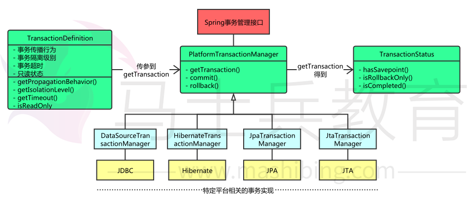

# Spring概述

## 1. 什么是spring? 

Spring是**一个轻量级Java开发框架**，最早由**Rod Johnson**创建，目的是为了解决企业级应用开发的业务逻辑层和其他各层的耦合问题。它是一个分层的 JavaSE/JavaEE full-stack（一站式）轻量级开源框架，为开发Java应用程序提 供全面的基础架构支持。Spring负责基础架构，因此Java开发者可以专注于应 用程序的开发。 Spring最根本的使命是**解决企业级应用开发的复杂性，即简化Java开发。**

Spring可以做很多事情，它为企业级开发提供给了丰富的功能，但是这些功能 的底层都依赖于它的两个核心特性，也就是**依赖注入（dependency  injection，DI）和面向切面编程（aspect-oriented programming， AOP）**。

 为了降低Java开发的复杂性，Spring采取了以下4种关键策略 

- 基于POJO的轻量级和最小侵入性编程； 
- 通过依赖注入和面向接口实现松耦合； 
- 基于切面和惯例进行声明式编程； 
- 通过切面和模板减少样板式代码。 

## 2. Spring框架的设计目标，设计理念，和核心是什么 

**Spring设计目标：** Spring为开发者提供一个一站式轻量级应用开发平台； 

**Spring设计理念：** 在JavaEE开发中，支持POJO和JavaBean开发方式，使应用 面向接口开发，充分支持OO（面向对象）设计方法；Spring通过IoC容器实现 对象耦合关系的管理，并实现依赖反转，将对象之间的依赖关系交给IoC容器， 实现解耦； 

**Spring框架的核心：** IoC容器和AOP模块。通过IoC容器管理POJO对象以及他们之间的耦合关系；通过AOP以动态非侵入的方式增强服务。 IoC让相互协作的组件保持松散的耦合，而AOP编程允许你把遍布于应用各层的 功能分离出来形成可重用的功能组件。 

## 3. Spring的优缺点是什么？ 
**优点**

- 方便解耦，简化开发 
  Spring就是一个大工厂，可以将所有对象的创建和依赖关系的维护，交给 Spring管理。 
- AOP编程的支持 
  Spring提供面向切面编程，可以方便的实现对程序进行权限拦截、运行监控等 功能。 
- 声明式事务的支持 
  只需要通过配置就可以完成对事务的管理，而无需手动编程。 
- 方便程序的测试
  Spring对Junit4支持，可以通过注解方便的测试Spring程序。 
- 方便集成各种优秀框架 
  Spring不排斥各种优秀的开源框架，其内部提供了对各种优秀框架的直接支持 （如：Struts、Hibernate、MyBatis等）。 
- 降低JavaEE API的使用难度 
  Spring对JavaEE开发中非常难用的一些API（JDBC、JavaMail、远程调用 等），都提供了封装，使这些API应用难度大大降低。 

**缺点**
- Spring明明一个很轻量级的框架，却给人感觉大而全 
- Spring依赖反射，反射影响性能 
- 使用门槛升高，入门Spring需要较长时间 

## 4. Spring有哪些应用场景 

**应用场景：** JavaEE企业应用开发，包括SSH、SSM等 

**Spring价值：**

- Spring是非侵入式的框架，目标是使应用程序代码对框架依赖最小化； 
- Spring提供一个一致的编程模型，使应用直接使用POJO开发，与运行环境隔离开来； 
- Spring推动应用设计风格向面向对象和面向接口开发转变，提高了代码的重用性和可测试性； 

## 5. Spring由哪些模块组成？ 

Spring 总共大约有 20 个模块， 由 1300 多个不同的文件构成。 而这些组件被分别整合在**核心容器（Core Container） 、 AOP（Aspect Oriented Programming） 和设备支持（Instrmentation） 、数据访问与集成（Data Access/Integeration） 、  Web、 消息（Messaging） 、 Test**等 6 个模块中。 以下是 Spring 5 的模块结构图：


- spring core：提供了框架的基本组成部分，包括控制反转（Inversion of  Control，IOC）和依赖注入（Dependency Injection，DI）功能。 
- spring beans：提供了BeanFactory，是工厂模式的一个经典实现，Spring将管 理对象称为Bean。 
- spring context：构建于 core 封装包基础上的 context 封装包，提供了一种框 架式的对象访问方法。 
- spring jdbc：提供了一个JDBC的抽象层，消除了烦琐的JDBC编码和数据库厂 商特有的错误代码解析， 用于简化JDBC。 
- spring aop：提供了面向切面的编程实现，让你可以自定义拦截器、切点等。 
- spring Web：提供了针对 Web 开发的集成特性，例如文件上传，利用 servlet  listeners 进行 ioc 容器初始化和针对 Web 的 ApplicationContext。 
- spring test：主要为测试提供支持的，支持使用JUnit或TestNG对Spring组件进 行单元测试和集成测试。 

## 6. Spring 框架中都用到了哪些设计模式？ 

1. 工厂模式：BeanFactory就是简单工厂模式的体现，用来创建对象的实例； 
2. 单例模式：Bean默认为单例模式。
3. 代理模式：Spring的AOP功能用到了JDK的动态代理和CGLIB字节码生 成技术； 
4. 模板方法：用来解决代码重复的问题。比如. RestTemplate,  JmsTemplate, JpaTemplate。 
5. 观察者模式：定义对象键一种一对多的依赖关系，当一个对象的状态发 生改变时，所有依赖于它的对象都会得到通知被制动更新，如Spring中 listener的实现–ApplicationListener。 

## 7.Spring中用到的设计模式? 

单例模式：bean默认都是单例的

原型模式：指定作用域为prototype

工厂模式：BeanFactory

模板方法：postProcessBeanFactory,onRefresh,initPropertyValue

策略模式：XmlBeanDefinitionReader,PropertiesBeanDefinitionReader

观察者模式：listener，event，multicast

适配器模式：Adapter

装饰者模式：BeanWrapper

责任链模式：使用aop的时候会先生成一个拦截器链

代理模式：动态代理

委托者模式：delegate

。。。。。。。。。

# Spring IOC

## 1.谈谈Spring IOC的理解，原理与实现?

**总：**

控制反转：理论思想，原来的对象是由使用者来进行控制，有了spring之后，可以把整个对象交给spring来帮我们进行管理

DI：依赖注入，把对应的属性的值注入到具体的对象中，@Autowired，populateBean完成属性值的注入

容器：存储对象，使用map结构来存储，在spring中一般存在三级缓存，singletonObjects存放完整的bean对象,

整个bean的生命周期，从创建到使用到销毁的过程全部都是由容器来管理（bean的生命周期）

**分：**


1、一般聊ioc容器的时候要涉及到容器的创建过程（beanFactory,DefaultListableBeanFactory）,向bean工厂中设置一些参数（BeanPostProcessor,Aware接口的子类）等等属性

2、加载解析bean对象，准备要创建的bean对象的定义对象beanDefinition,(xml或者注解的解析过程)

3、beanFactoryPostProcessor的处理，此处是扩展点，PlaceHolderConfigurSupport,ConfigurationClassPostProcessor

4、BeanPostProcessor的注册功能，方便后续对bean对象完成具体的扩展功能

5、通过反射的方式讲BeanDefinition对象实例化成具体的bean对象，

6、bean对象的初始化过程（填充属性，调用aware子类的方法，调用BeanPostProcessor前置处理方法，调用init-mehtod方法，调用BeanPostProcessor的后置处理方法）

7、生成完整的bean对象，通过getBean方法可以直接获取

8、销毁过程

面试官，这是我对ioc的整体理解，包含了一些详细的处理过程，您看一下有什么问题，可以指点我一下（允许你把整个流程说完）

您由什么想问的？老师，我没看过源码怎么办？

​		具体的细节我记不太清了，但是spring中的bean都是通过反射的方式生成的，同时其中包含了很多的扩展点，比如最常用的对BeanFactory的扩展，对bean的扩展（对占位符的处理），我们在公司对这方面的使用是比较多的，除此之外，ioc中最核心的也就是填充具体bean的属性，和生命周期（背一下）。

## 2.谈一下spring IOC的底层实现

底层实现：工作原理，过程，数据结构，流程，设计模式，设计思想

你对他的理解和你了解过的实现过程

反射，工厂，设计模式（会的说，不会的不说），关键的几个方法

createBeanFactory，getBean,

doGetBean,

createBean,

doCreateBean,

createBeanInstance(getDeclaredConstructor,newinstance),

populateBean,

initializingBean

1、先通过createBeanFactory创建出一个Bean工厂（DefaultListableBeanFactory）

2、开始循环创建对象，因为容器中的bean默认都是单例的，所以优先通过getBean,doGetBean从容器中查找，找不到的话，

3、通过createBean,doCreateBean方法，以反射的方式创建对象，一般情况下使用的是无参的构造方法（getDeclaredConstructor，newInstance）

4、进行对象的属性填充populateBean

5、进行其他的初始化操作（initializingBean）

(1) BeanFactory

​     Spring Bean的创建是典型的工厂模式，这一系列的Bean工厂，也即IOC容器为开发者管理对象间的依赖关系提供了很多便利和基础服务，在Spring中有许多的IOC容器的实现供用户选择和使用，其相互关系如下：

 

其中BeanFactory作为最顶层的一个接口类，它定义了IOC容器的基本功能规范，BeanFactory 有三个子类：ListableBeanFactory、HierarchicalBeanFactory 和AutowireCapableBeanFactory。但是从上图中我们可以发现最终的默认实现类是 DefaultListableBeanFactory，他实现了所有的接口。那为何要定义这么多层次的接口呢？查阅这些接口的源码和说明发现，每个接口都有他使用的场合，它主要是为了区分在 Spring 内部在操作过程中对象的传递和转化过程中，对对象的数据访问所做的限制。例如 ListableBeanFactory 接口表示这些 Bean 是可列表的，而 HierarchicalBeanFactory 表示的是这些 Bean 是有继承关系的，也就是每个Bean 有可能有父 Bean。AutowireCapableBeanFactory 接口定义 Bean 的自动装配规则。这四个接口共同定义了 Bean 的集合、Bean 之间的关系、以及 Bean 行为.

最基本的IOC容器接口BeanFactory

## 3.描述一下bean的生命周期 ？

背图：记住图中的流程

在表述的时候不要只说图中有的关键点，要学会扩展描述

1、实例化bean：反射的方式生成对象

2、填充bean的属性：populateBean(),循环依赖的问题（三级缓存）

3、调用aware接口相关的方法：invokeAwareMethod(完成BeanName,BeanFactory,BeanClassLoader对象的属性设置)

4、调用BeanPostProcessor中的前置处理方法：使用比较多的有（ApplicationContextPostProcessor,设置ApplicationContext,Environment,ResourceLoader,EmbeddValueResolver等对象）

5、调用initmethod方法：invokeInitmethod(),判断是否实现了initializingBean接口，如果有，调用afterPropertiesSet方法，没有就不调用

6、调用BeanPostProcessor的后置处理方法：spring的aop就是在此处实现的，AbstractAutoProxyCreator

​		注册Destuction相关的回调接口：钩子函数

7、获取到完整的对象，可以通过getBean的方式来进行对象的获取

8、销毁流程，1；判断是否实现了DispoableBean接口，2，调用destroyMethod方法

## 4.Spring 是如何解决循环依赖的问题的？

三级缓存，提前暴露对象，aop

总：什么是循环依赖问题，A依赖B,B依赖A

分：先说明bean的创建过程：实例化，初始化（填充属性）

​		1、先创建A对象，实例化A对象，此时A对象中的b属性为空，填充属性b

​		2、从容器中查找B对象，如果找到了，直接赋值不存在循环依赖问题（不通），找不到直接创建B对象

​		3、实例化B对象，此时B对象中的a属性为空，填充属性a

​		4、从容器中查找A对象，找不到，直接创建

​		形成闭环的原因

​		此时，如果仔细琢磨的话，会发现A对象是存在的，只不过此时的A对象不是一个完整的状态，只完成了实例化但是未完成初始化，如果在程序调用过程中，拥有了某个对象的引用，能否在后期给他完成赋值操作，可以优先把非完整状态的对象优先赋值，等待后续操作来完成赋值，相当于提前暴露了某个不完整对象的引用，所以解决问题的核心在于实例化和初始化分开操作，这也是解决循环依赖问题的关键，

​		当所有的对象都完成实例化和初始化操作之后，还要把完整对象放到容器中，此时在容器中存在对象的几个状态，完成实例化=但未完成初始化，完整状态，因为都在容器中，所以要使用不同的map结构来进行存储，此时就有了一级缓存和二级缓存，如果一级缓存中有了，那么二级缓存中就不会存在同名的对象，因为他们的查找顺序是1，2，3这样的方式来查找的。一级缓存中放的是完整对象，二级缓存中放的是非完整对象

​		为什么需要三级缓存？三级缓存的value类型是ObjectFactory,是一个函数式接口，存在的意义是保证在整个容器的运行过程中同名的bean对象只能有一个。

​		如果一个对象需要被代理，或者说需要生成代理对象，那么要不要优先生成一个普通对象？要

​		普通对象和代理对象是不能同时出现在容器中的，因此当一个对象需要被代理的时候，就要使用代理对象覆盖掉之前的普通对象，在实际的调用过程中，是没有办法确定什么时候对象被使用，所以就要求当某个对象被调用的时候，优先判断此对象是否需要被代理，类似于一种回调机制的实现，因此传入lambda表达式的时候，可以通过lambda表达式来执行对象的覆盖过程，getEarlyBeanReference()

​		因此，所有的bean对象在创建的时候都要优先放到三级缓存中，在后续的使用过程中，如果需要被代理则返回代理对象，如果不需要被代理，则直接返回普通对象

为什么需要二级缓存？ 

​		二级缓存只要是为了分离成熟Bean和纯净Bean(未注入属性)的存放， 防止多线程中在Bean还未创建完成时读取到的Bean时不完整的。所以也是为了保证我们getBean是完整最终的Bean，不会出现不完整的情况。

### 4.1缓存的放置时间和删除时间


```
让我们来分析一下“A的某个field或者setter依赖了B的实例对象，同时B的某个field或者setter依赖了A的实例对象”这种循环依赖的情景。

	1) A doCreateBean()初始化，由于还未创建，从一级缓存查不到，此时只是一个半成品（提前暴露的对象），放入三级缓存singletonFactories;
	2) A发现自己需要B对象，但是三级缓存中未发现B，创建B的半成品，放入singletonFactories;
	3) B发现自己需要A对象，从一级缓存singletonObjects和二级缓存earlySingletonObjects中未发现A，但是在三级缓存singletonFactories中发现A，将A放入二级缓存earlySingletonObjects，同时从三级缓存删除；
	4) 将A注入到对象B中；
	5) B完成属性填充，执行初始化方法，将自己放入第一级缓存中（此时B是一个完整的对象）；
	6) A得到对象B，将B注入到A中；
	7) A完成属性填充，初始化，并放入到一级缓存中。
在创建过程中，都是从三级缓存(对象工程创建不完整对象)，将提前暴露的对象放入到二级缓存，从二级缓存拿到后，完成初始化，放入一级缓存。

```

```java
protected Object doCreateBean(final String beanName, final RootBeanDefinition mbd, Object[] args) throws BeanCreationException {
    BeanWrapper instanceWrapper = null;
    
    if (instanceWrapper == null) {
        //实例化对象
        instanceWrapper = this.createBeanInstance(beanName, mbd, args);
    }

    final Object bean = instanceWrapper != null ? instanceWrapper.getWrappedInstance() : null;
    Class<?> beanType = instanceWrapper != null ? instanceWrapper.getWrappedClass() : null;
   
    //判断是否允许提前暴露对象，如果允许，则直接添加一个 ObjectFactory 到三级缓存
    boolean earlySingletonExposure = (mbd.isSingleton() && this.allowCircularReferences &&
                isSingletonCurrentlyInCreation(beanName));
    if (earlySingletonExposure) {
        //添加三级缓存
        addSingletonFactory(beanName, () -> getEarlyBeanReference(beanName, mbd, bean));
    }

    //填充属性
    this.populateBean(beanName, mbd, instanceWrapper);
    //执行初始化方法，并创建代理
    exposedObject = initializeBean(beanName, exposedObject, mbd);
    return exposedObject;
}
```


三级缓存：createBeanInstance之后：addSingletonFactory

出现的原因： 增加三级缓存，二级缓存先啥也不存。 三级缓存 存一个函数接口， 动态代理还是普通bean的逻辑调用BeanPostProcessor 都放在这里面。 只要调用了就存在二级缓存，无 脑返回就行。 大大减少业务逻辑复杂度

```java
protected void addSingletonFactory(String beanName, ObjectFactory<?> singletonFactory) {
            synchronized (this.singletonObjects) {
                if (!this.singletonObjects.containsKey(beanName)) {
                    //一级缓存没有，放入三级缓存
                    this.singletonFactories.put(beanName, singletonFactory);
                    //从二级缓存删除，确保二级缓存没有该bean
                    this.earlySingletonObjects.remove(beanName);
                    this.registeredSingletons.add(beanName);
                }
            }
        }
```


​		二级缓存：第一次从三级缓存确定对象是代理对象还是普通对象的时候，同时删除三级缓存 getSingleton

```java
//缓存查找bean  如果1级没有，从2级获取,也没有,从3级创建放入2级
protected Object getSingleton(String beanName, boolean allowEarlyReference) {
    Object singletonObject = this.singletonObjects.get(beanName); //1级
    if (singletonObject == null && isSingletonCurrentlyInCreation(beanName)) {
        synchronized (this.singletonObjects) {
            singletonObject = this.earlySingletonObjects.get(beanName); //2级
            if (singletonObject == null && allowEarlyReference) {
                //3级缓存  在doCreateBean中创建了bean的实例后，封装ObjectFactory放入缓存的
                ObjectFactory<?> singletonFactory = this.singletonFactories.get(beanName);
                if (singletonFactory != null) {
                    //创建未赋值的bean
                    singletonObject = singletonFactory.getObject();
                    //放入到二级缓存
                    this.earlySingletonObjects.put(beanName, singletonObject);
                    //从三级缓存删除
                    this.singletonFactories.remove(beanName);
                }
            }
        }
    }
    return singletonObject;
}   
```


​		一级缓存：生成完整对象之后放到一级缓存，删除二三级缓存:addSingleton

```java
 protected void addSingleton(String beanName, Object singletonObject) {
            synchronized (this.singletonObjects) {
                //放入一级缓存
                this.singletonObjects.put(beanName, singletonObject);
                //从三级缓存删除
                this.singletonFactories.remove(beanName);
                //从二级缓存删除
                this.earlySingletonObjects.remove(beanName);
                this.registeredSingletons.add(beanName);
            }
        }
```

为什么Spring不能解决构造器的循环依赖？ 

​	从流程图应该不难看出来，在Bean调用构造器实例化之前，一二三级缓存并没有Bean的任何相关信息，在 实例化之后才放入三级缓存中，因此当getBean的时候缓存并没有命中，这样就抛出了循环依赖的异常了。 

为什么多例Bean不能解决循环依赖？ 我们自己手写了解决循环依赖的代码，可以看到，核心是利用一个map，来解决这个问题的，这个map就相当于缓存。 为什么可以这么做，因为我们的bean是单例的，而且是字段注入（setter注入）的，单例意味着只需要创建一次对象，后面就可以从缓存 中取出来，字段注入，意味着我们无需调用构造方法进行注入。 如果是原型bean，那么就意味着每次都要去创建对象，无法利用缓存； 如果是构造方法注入，那么就意味着需要调用构造方法注入，也无法利用缓存。

循环依赖可以关闭吗? 可以，Spring提供了这个功能，我们需要这么写：

```java
 public class Main { 
     public static void main(String[] args) { 
          AnnotationConfigApplicationContext applicationContext = new AnnotationConfigApplicationContext(); 
          applicationContext.setAllowCircularReferences(false); 
          applicationContext.register(AppConfig.class); 
          applicationContext.refresh(); 
      } 
 } 
```

 如何进行拓展？ bean可以通过实现SmartInstantiationAwareBeanPostProcessor接口（一般这个接口供spring内部使用）的 getEarlyBeanReference方法进行拓展


## 5.Bean Factory与FactoryBean有什么区别？

相同点：都是用来创建bean对象的

不同点：使用BeanFactory创建对象的时候，必须要遵循严格的生命周期流程，太复杂了，，如果想要简单的自定义某个对象的创建，同时创建完成的对象想交给spring来管理，那么就需要实现FactroyBean接口了

​			isSingleton:是否是单例对象

​			getObjectType:获取返回对象的类型

​			getObject:自定义创建对象的过程(new，反射，动态代理)

```
 BeanFactory

　　BeanFactory，以Factory结尾，表示它是一个工厂类(接口)， 它负责生产和管理bean的一个工厂。在Spring中，BeanFactory是IOC容器的核心接口，它的职责包括：实例化、定位、配置应用程序中的对象及建立这些对象间的依赖。BeanFactory只是个接口，并不是IOC容器的具体实现，但是Spring容器给出了很多种实现，如 DefaultListableBeanFactory、XmlBeanFactory、ApplicationContext等，其中XmlBeanFactory就是常用的一个，该实现将以XML方式描述组成应用的对象及对象间的依赖关系。XmlBeanFactory类将持有此XML配置元数据，并用它来构建一个完全可配置的系统或应用。

FactoryBean

一般情况下，Spring通过反射机制利用<bean>的class属性指定实现类实例化Bean，在某些情况下，实例化Bean过程比较复杂，如果按照传统的方式，则需要在<bean>中提供大量的配置信息。配置方式的灵活性是受限的，这时采用编码的方式可能会得到一个简单的方案。Spring为此提供了一个org.springframework.bean.factory.FactoryBean的工厂类接口，用户可以通过实现该接口定制实例化Bean的逻辑。FactoryBean接口对于Spring框架来说占用重要的地位，Spring自身就提供了70多个FactoryBean的实现。它们隐藏了实例化一些复杂Bean的细节，给上层应用带来了便利。从Spring3.0开始，FactoryBean开始支持泛型，即接口声明改为FactoryBean<T>的形式

以Bean结尾，表示它是一个Bean，不同于普通Bean的是：它是实现了FactoryBean<T>接口的Bean，根据该Bean的ID从BeanFactory中获取的实际上是FactoryBean的getObject()返回的对象，而不是FactoryBean本身，如果要获取FactoryBean对象，请在id前面加一个&符号来获取。


FactoryBean是什么，有什么用处？
<bean>标签 的class属性如果配置为FactoryBean时，通过getBean()方法返回的不是FactoryBean本身，而是FactoryBean#getObject()方法返回的对象，这主要是Spring通过反射机制检查配置的class属性配置的类是否实现了FactoryBean接口，如果实现了这个接口则Spring就会调用其getObject方法。

如果希望返回FactoryBean实现类本身，则需要在getBean(beanName)中的beanName前显示的加上"&"前缀，比如getBean("&aBeanName")
```

原理弄明白了，下面通过代码测试验证上面的流程，先定义一个Bean实现FactoryBean接口。

```java
@Component
public class MyBean implements FactoryBean {
    private String message;
    public MyBean() {
        this.message = "通过构造方法初始化实例";
    }
    @Override
    public Object getObject() throws Exception {
        MyBean myBean = new MyBean();
        myBean.message = "通过FactoryBean.getObject()创建实例";
        // 这里并不一定要返回MyBean自身的实例，可以是其他任何对象的实例
        return myBean;
    }
    @Override
    public Class<?> getObjectType() {
        return MyBean.class;
    }
    public String getMessage() {
        return message;
    }
}
```

MyBean实现了FactoryBean接口的两个方法，getObject()是可以返回任何对象的实例的，这里测试就返回MyBean自身实例，且返回前给message字段赋值。同时在构造方法中也为message赋值。然后测试代码中先通过名称获取Bean实例，打印message的内容，再通过'&'+名称获取实例并打印message内容。

```java
@RunWith(SpringRunner.class)
@SpringBootTest(classes = TestApplication.class)
public class FactoryBeanTest {
    @Autowired
    private ApplicationContext context;
    @Test
    public void test() {
        MyBean myBean1 = (MyBean) context.getBean("myBean");
        System.out.println("myBean1 = " + myBean1.getMessage());
        MyBean myBean2 = (MyBean) context.getBean("&myBean");
        System.out.println("myBean2 = " + myBean2.getMessage());
        System.out.println("myBean1.equals(myBean2) = " + myBean1.equals(myBean2));
    }
}
复制代码
myBean1 = 通过FactoryBean.getObject()初始化实例
myBean2 = 通过构造方法初始化实例
myBean1.equals(myBean2) = false
复制代码
```


## BeanFactory 和 ApplicationContext有什么区别？

BeanFactory和ApplicationContext是Spring的两大核心接口，都可以当做 Spring的容器。其中ApplicationContext是BeanFactory的子接口。

依赖关系

BeanFactory：是Spring里面最底层的接口，包含了各种Bean的定义，读取 bean配置文档，管理bean的加载、实例化，控制bean的生命周期，维护bean 之间的依赖关系。

ApplicationContext接口作为BeanFactory的派生，除了提供BeanFactory所具有的功能外，还提供了更完整的框架功能：

- 继承MessageSource，因此支持国际化。统一的资源文件访问方式。
- 提供在监听器中注册bean的事件。
- 同时加载多个配置文件。
- 载入多个（有继承关系）上下文 ，使得每一个上下文都专注于一个特定的层次，比如应用的web层。

加载方式

BeanFactroy采用的是延迟加载形式来注入Bean的，即只有在使用到某个Bean 时(调用getBean())，才对该Bean进行加载实例化。这样，我们就不能发现一些存在的Spring的配置问题。如果Bean的某一个属性没有注入，BeanFacotry加载后，直至第一次使用调用getBean方法才会抛出异常。

ApplicationContext，它是在容器启动时，一次性创建了所有的Bean。这样，在容器启动时，我们就可以发现Spring中存在的配置错误，这样有利于检查所依赖属性是否注入。 ApplicationContext启动后预载入所有的单实例Bean，通过预载入单实例bean ,确保当你需要的时候，你就不用等待，因为它们已经创建好了。

相对于基本的BeanFactory，ApplicationContext 唯一的不足是占用内存空间。当应用程序配置Bean较多时，程序启动较慢。

创建方式

BeanFactory通常以编程的方式被创建，ApplicationContext还能以声明的方式创建，如使用ContextLoader。

注册方式

BeanFactory和ApplicationContext都支持BeanPostProcessor、

BeanFactoryPostProcessor的使用，但两者之间的区别是：BeanFactory需要手动注册，而ApplicationContext则是自动注册。

## Spring 如何设计容器的，BeanFactory和 ApplicationContext的关系详解

Spring 作者 Rod Johnson 设计了两个接口用以表示容器。

- BeanFactory
- ApplicationContext

BeanFactory 简单粗暴，可以理解为就是个 HashMap，Key 是 BeanName，Value 是 Bean 实例。通常只提供注册（put），获取（get）这两个功能。我们可以称之为 “低级容器”。

ApplicationContext 可以称之为 “高级容器”。因为他比 BeanFactory 多了更多的功能。他继承了多个接口。因此具备了更多的功能。例如资源的获取，支持多种消息（例如 JSP tag 的支持），对 BeanFactory 多了工具级别的支持等待。所以你看他的名字，已经不是 BeanFactory 之类的工厂了，而是 “应用上下文”， 代表着整个大容器的所有功能。该接口定义了一个 refresh 方法，此方法是所有阅读 Spring 源码的人的最熟悉的方法，用于刷新整个容器，即重新加载/刷新所有的 bean。

当然，除了这两个大接口，还有其他的辅助接口，这里就不介绍他们了。

BeanFactory和ApplicationContext的关系

为了更直观的展示 “低级容器” 和 “高级容器” 的关系，这里通过常用的 

ClassPathXmlApplicationContext 类来展示整个容器的层级 UML 关系。


有点复杂？ 先不要慌，我来解释一下。

最上面的是 BeanFactory，下面的 3 个绿色的，都是功能扩展接口，这里就不展开讲。

看下面的隶属 ApplicationContext 粉红色的 “高级容器”，依赖着 “低级容器”，这里说的是依赖，不是继承哦。他依赖着 “低级容器” 的 getBean 功能。而高级容器有更多的功能：支持不同的信息源头，可以访问文件资源，支持应用事件（Observer 模式）。

通常用户看到的就是 “高级容器”。 但 BeanFactory 也非常够用啦！左边灰色区域的是 “低级容器”， 只负载加载 Bean，获取 Bean。容器其他的高级功能是没有的。例如上图画的 refresh 刷新 Bean 工厂所有配置，生命周期事件回调等。

### 小结

说了这么多，不知道你有没有理解Spring IoC？ 这里小结一下：IoC 在 Spring 里，只需要低级容器就可以实现，2 个步骤：

1. 加载配置文件，解析成 BeanDefinition 放在 Map 里。

2. 调用 getBean 的时候，从 BeanDefinition 所属的 Map 里，拿出 Class 对象进行实例化，同时，如果有依赖关系，将递归调用 getBean 方法 —— 完成依赖注入。

上面就是 Spring 低级容器（BeanFactory）的 IoC。

至于高级容器 ApplicationContext，他包含了低级容器的功能，当他执行 refresh 模板方法的时候，将刷新整个容器的 Bean。同时其作为高级容器，包含了太多的功能。一句话，他不仅仅是 IoC。他支持不同信息源头，支持 BeanFactory 工具类，支持层级容器，支持访问文件资源，支持事件发布通知，支持接口回调等等。

## ApplicationContext通常的实现是什么？

FileSystemXmlApplicationContext ：此容器从一个XML文件中加载beans 的定义，XML Bean 配置文件的全路径名必须提供给它的构造函数。

ClassPathXmlApplicationContext：此容器也从一个XML文件中加载beans 的定义，这里，你需要正确设置classpath因为这个容器将在classpath里找 bean配置。

WebXmlApplicationContext：此容器加载一个XML文件，此文件定义了一个WEB应用的所有bean。

### 什么是Spring的依赖注入？

控制反转IoC是一个很大的概念，可以用不同的方式来实现。其主要实现方式有两种：依赖注入和依赖查找依赖注入：相对于IoC而言，依赖注入(DI)更加准确地描述了IoC的设计理念。所谓依赖注入（Dependency Injection），即组件之间的依赖关系由容器在应用系统运行期来决定，也就是由容器动态地将某种依赖关系的目标对象实例注入到应用系统中的各个关联的组件之中。组件不做定位查询，只提供普通的Java方法让容器去决定依赖关系。

## 依赖注入的基本原则

依赖注入的基本原则是：应用组件不应该负责查找资源或者其他依赖的协作对象。配置对象的工作应该由IoC容器负责，“查找资源”的逻辑应该从应用组件的代码中抽取出来，交给IoC容器负责。容器全权负责组件的装配，它会把符合依赖关系的对象通过属性（JavaBean中的setter）或者是构造器传递给需要的对象。

## 依赖注入有什么优势

依赖注入之所以更流行是因为它是一种更可取的方式：让容器全权负责依赖查询，受管组件只需要暴露JavaBean的setter方法或者带参数的构造器或者接

口，使容器可以在初始化时组装对象的依赖关系。其与依赖查找方式相比，主要优势为：

- 查找定位操作与应用代码完全无关。
- 不依赖于容器的API，可以很容易地在任何容器以外使用应用对象。
- 不需要特殊的接口，绝大多数对象可以做到完全不必依赖容器。

## 有哪些不同类型的依赖注入实现方式？

依赖注入是时下最流行的IoC实现方式，依赖注入分为接口注入（Interface Injection），Setter方法注入（Setter Injection）和构造器注入（Constructor 

Injection）三种方式。其中接口注入由于在灵活性和易用性比较差，现在从Spring4开始已被废弃。

构造器依赖注入：构造器依赖注入通过容器触发一个类的构造器来实现的，该类有一系列参数，每个参数代表一个对其他类的依赖。

Setter方法注入：Setter方法注入是容器通过调用无参构造器或无参static工厂 方法实例化bean之后，调用该bean的setter方法，即实现了基于setter的依赖注入。

## 构造器依赖注入和 Setter方法注入的区别

| 构造函数注入               | setter注 入                |
| -------------------------- | -------------------------- |
| 没有部分注入               | 有部分注入                 |
| 不会覆盖 setter 属 性      | 会覆盖 setter 属 性        |
| 任意修改都会创建一个新实例 | 任意修改不会创建一个新实例 |
| 适用于设置很多属性         | 适用于设置少量属性         |

两种依赖方式都可以使用，构造器注入和Setter方法注入。最好的解决方案是用构造器参数实现强制依赖，setter方法实现可选依赖。

## 什么是Spring beans？

Spring beans 是那些形成Spring应用的主干的java对象。它们被Spring IOC容器初始化，装配，和管理。这些beans通过容器中配置的元数据创建。比如，以XML文件中 的形式定义。

## 一个 Spring Bean 定义包含什么？

一个Spring Bean 的定义包含容器必知的所有配置元数据，包括bean，它的生命周期详情及它的依赖。

### 如何创建一个如何给Spring 容器提供配置元数据？Spring有几种配置方式

这里有三种重要的方法给Spring 容器提供配置元数据。

- XML配置文件。
- 基于注解的配置。
- 基于java的配置。

### Spring配置文件包含了哪些信息

Spring配置文件是个XML 文件，这个文件包含了类信息，描述了如何配置它们，以及如何相互调用。

## Spring基于xml注入bean的几种方式

1. Set方法注入；

2. 构造器注入：①通过index设置参数的位置；②通过type设置参数类型；

3. 静态工厂注入；

4. 实例工厂；

## 你怎样定义类的作用域？

当定义一个 在Spring里，我们还能给这个bean声明一个作用域。它可以通过 bean 定义中的scope属性来定义。如，当Spring要在需要的时候每次生产一个新的bean实例，bean的scope属性被指定为prototype。另一方面，一个bean 每次使用的时候必须返回同一个实例，这个bean的scope 属性 必须设为 singleton。

## 解释Spring支持的几种bean的作用域

Spring框架支持以下五种bean的作用域：

- singleton : bean在每个Spring ioc 容器中只有一个实例。
- prototype：一个bean的定义可以有多个实例。
- request：每次http请求都会创建一个bean，该作用域仅在基于web的SpringApplicationContext情形下有效。
- session：在一个HTTP Session中，一个bean定义对应一个实例。该作用域仅在基于web的Spring ApplicationContext情形下有效。
- global-session：在一个全局的HTTP Session中，一个bean定义对应一个

实例。该作用域仅在基于web的Spring ApplicationContext情形下有效。

注意： 缺省的Spring bean 的作用域是Singleton。使用 prototype 作用域需要慎重的思考，因为频繁创建和销毁 bean 会带来很大的性能开销。

## Spring框架中的单例bean是线程安全的吗？

不是，Spring框架中的单例bean不是线程安全的。

spring 中的 bean 默认是单例模式，spring 框架并没有对单例 bean 进行多线程的封装处理。

实际上大部分时候 spring bean 无状态的（比如 dao 类），所有某种程度上来说 bean 也是安全的，但如果 bean 有状态的话（比如 view model 对象），那就要开发者自己去保证线程安全了，最简单的就是改变 bean 的作用域，

把“singleton”变更为“prototype”，这样请求 bean 相当于 new Bean() 了，所以就可以保证线程安全了。

- 有状态就是有数据存储功能。
- 无状态就是不会保存数据。

## Spring如何处理线程并发问题？

在一般情况下，只有无状态的Bean才可以在多线程环境下共享，在Spring中，绝大部分Bean都可以声明为singleton作用域，因为Spring对一些Bean中非线程安全状态采用ThreadLocal进行处理，解决线程安全问题。

ThreadLocal和线程同步机制都是为了解决多线程中相同变量的访问冲突问题。同步机制采用了“时间换空间”的方式，仅提供一份变量，不同的线程在访问前需要获取锁，没获得锁的线程则需要排队。而ThreadLocal采用了“空间换时间”的方式。

ThreadLocal会为每一个线程提供一个独立的变量副本，从而隔离了多个线程对数据的访问冲突。因为每一个线程都拥有自己的变量副本，从而也就没有必要对该变量进行同步了。ThreadLocal提供了线程安全的共享对象，在编写多线程代码时，可以把不安全的变量封装进ThreadLocal。解释Spring框架中bean的生命周期

在传统的Java应用中，bean的生命周期很简单。使用Java关键字new进行bean 实例化，然后该bean就可以使用了。一旦该bean不再被使用，则由Java自动进行垃圾回收。相比之下，Spring容器中的bean的生命周期就显得相对复杂多了。正确理解Spring bean的生命周期非常重要，因为你或许要利用Spring提供的扩展点来自定义bean的创建过程。下图展示了bean装载到Spring应用上下文中的一个典型的生命周期过程。


bean在Spring容器中从创建到销毁经历了若干阶段，每一阶段都可以针对 Spring如何管理bean进行个性化定制。

正如你所见，在bean准备就绪之前，bean工厂执行了若干启动步骤。

我们对上图进行详细描述：

Spring对bean进行实例化；

Spring将值和bean的引用注入到bean对应的属性中；

如果bean实现了BeanNameAware接口，Spring将bean的ID传递给setBeanName()方法；

如果bean实现了BeanFactoryAware接口，Spring将调用setBeanFactory()方

法，将BeanFactory容器实例传入；

如果bean实现了ApplicationContextAware接口，Spring将调用 setApplicationContext()方法，将bean所在的应用上下文的引用传入进来；

如果bean实现了BeanPostProcessor接口，Spring将调用它们的post-ProcessBeforeInitialization()方法；

如果bean实现了InitializingBean接口，Spring将调用它们的afterPropertiesSet()方法。类似地，如果bean使用initmethod声明了初始化方法，

该方法也会被调用；

如果bean实现了BeanPostProcessor接口，Spring将调用它们的post-ProcessAfterInitialization()方法；此时，bean已经准备就绪，可以被应用程序使用了，它们将一直驻留在应用上下文中，直到该应用上下文被销毁；

如果bean实现了DisposableBean接口，Spring将调用它的destroy()接口方

法。同样，如果bean使用destroy-method声明了销毁方法，该方法也会被调用。

现在你已经了解了如何创建和加载一个Spring容器。但是一个空的容器并没有太大的价值，在你把东西放进去之前，它里面什么都没有。为了从Spring的

DI(依赖注入)中受益，我们必须将应用对象装配进Spring容器中。

## 哪些是重要的bean生命周期方法？ 你能重载它们吗？

有两个重要的bean 生命周期方法，第一个是setup ， 它是在容器加载bean的时候被调用。第二个方法是 teardown 它是在容器卸载类的时候被调用。

bean 标签有两个重要的属性（init-method和destroy-method）。用它们你可以自己定制初始化和注销方法。它们也有相应的注解（@PostConstruct和@PreDestroy）。

## 什么是Spring的内部bean？什么是Spring inner beans？

在Spring框架中，当一个bean仅被用作另一个bean的属性时，它能被声明为一个内部bean。内部bean可以用setter注入“属性”和构造方法注入“构造参数”的方式来实现，内部bean通常是匿名的，它们的Scope一般是prototype。

## 在 Spring中如何注入一个java集合？

Spring提供以下几种集合的配置元素：类型用于注入一列值，允许有相同的值。

类型用于注入一组值，不允许有相同的值。

类型用于注入一组键值对，键和值都只能为String类型。

## 什么是bean装配？

装配，或bean 装配是指在Spring 容器中把bean组装到一起，前提是容器需要知道bean的依赖关系，如何通过依赖注入来把它们装配到一起。

## 什么是bean的自动装配？

在Spring框架中，在配置文件中设定bean的依赖关系是一个很好的机制，

Spring 容器能够自动装配相互合作的bean，这意味着容器不需要和配置，能通过Bean工厂自动处理bean之间的协作。这意味着 Spring可以通过向Bean 

Factory中注入的方式自动搞定bean之间的依赖关系。自动装配可以设置在每个bean上，也可以设定在特定的bean上。

##  解释不同方式的自动装配，spring 自动装配 bean 有哪些方式？

在spring中，对象无需自己查找或创建与其关联的其他对象，由容器负责把需要相互协作的对象引用赋予各个对象，使用autowire来配置自动装载模式。

在Spring框架xml配置中共有5种自动装配：

- no：默认的方式是不进行自动装配的，通过手工设置ref属性来进行装配bean。
- byName：通过bean的名称进行自动装配，如果一个bean的 property 与另一bean 的name 相同，就进行自动装配。
- byType：通过参数的数据类型进行自动装配。
- constructor：利用构造函数进行装配，并且构造函数的参数通过 byType进行装配。
- autodetect：自动探测，如果有构造方法，通过 construct的方式自动装配，否则使用 byType的方式自动装配。

## 使用@Autowired注解自动装配的过程是怎样的？

使用@Autowired注解来自动装配指定的bean。在使用@Autowired注解之前需要在Spring配置文件进行配置，。

在启动spring IoC时，容器自动装载了一个AutowiredAnnotationBeanPostProcessor后置处理器，当容器扫描到@Autowied、@Resource或@Inject时，就会在IoC容器自动查找需要的 bean，并装配给该对象的属性。在使用@Autowired时，首先在容器中查询对应类型的bean：  

- 如果查询结果刚好为一个，就将该bean装配给@Autowired指定的数据；
- 如果查询的结果不止一个，那么@Autowired会根据名称来查找；
- 如果上述查找的结果为空，那么会抛出异常。解决方法时，使用required=false。

## 自动装配有哪些局限性？

自动装配的局限性是：重写：你仍需用 和 配置来定义依赖，意味着总要重写自动装配。

基本数据类型：你不能自动装配简单的属性，如基本数据类型，String字符串，和类。

模糊特性：自动装配不如显式装配精确，如果有可能，建议使用显式装配。

### 你可以在Spring中注入一个null 和一个空字符串吗？

可以

# Spring系列之beanFactory与ApplicationContext


**一、BeanFactory**
BeanFactory 是 Spring 的“心脏”。它就是 Spring IoC 容器的真面目。Spring 使用 BeanFactory 来实例化、配置和管理 Bean。

BeanFactory：是IOC容器的核心接口， 它定义了IOC的基本功能，我们看到它主要定义了getBean方法。getBean方法是IOC容器获取bean对象和引发依赖注入的起点。方法的功能是返回特定的名称的Bean。

BeanFactory 是初始化 Bean 和调用它们生命周期方法的“吃苦耐劳者”。注意，BeanFactory 只能管理单例（Singleton）Bean 的生命周期。它不能管理原型(prototype,非单例)Bean 的生命周期。这是因为原型 Bean 实例被创建之后便被传给了客户端,容器失去了对它们的引用。

BeanFactory有着庞大的继承、实现体系，有众多的子接口、实现类。来看一下BeanFactory的基本类体系结构（接口为主）：


这是我画的BeanFactory基本的类体系结构，这里没有包括强大的ApplicationContext体系。
具体：

　　1、BeanFactory作为一个主接口不继承任何接口，暂且称为**一级接口**。

　　2、有3个子接口继承了它，进行功能上的增强。这3个子接口称为**二级接口**。

　　3、ConfigurableBeanFactory可以被称为**三级接口**，对二级接口HierarchicalBeanFactory进行了再次增强，它还继承了另一个外来的接口SingletonBeanRegistry

　　4、ConfigurableListableBeanFactory是一个更强大的接口，继承了上述的所有接口，无所不包，称为**四级接口**。
　　（这4级接口是BeanFactory的基本接口体系。继续，下面是继承关系的2个抽象类和2个实现类：）

　　5、AbstractBeanFactory作为一个抽象类，实现了三级接口ConfigurableBeanFactory大部分功能。

　　6、AbstractAutowireCapableBeanFactory同样是抽象类，继承自AbstractBeanFactory，并额外实现了二级接口AutowireCapableBeanFactory

　　7、DefaultListableBeanFactory继承自AbstractAutowireCapableBeanFactory，实现了最强大的四级接口ConfigurableListableBeanFactory，并实现了一个外来接口BeanDefinitionRegistry，它并非抽象类。

　　8、最后是最强大的XmlBeanFactory，继承自DefaultListableBeanFactory，重写了一些功能，使自己更强大。

总结：
　　BeanFactory的类体系结构看似繁杂混乱，实际上由上而下井井有条，非常容易理解。

再来看一下BeanFactory的源码：

```java
package org.springframework.beans.factory;

public interface BeanFactory {

    /**
     * 用来引用一个实例，或把它和工厂产生的Bean区分开，就是说，如果一个FactoryBean的名字为a，那么，&a会得到那个Factory
     */
    String FACTORY_BEAN_PREFIX = "&";

    /*
     * 四个不同形式的getBean方法，获取实例
     */
    Object getBean(String name) throws BeansException;

    <T> T getBean(String name, Class<T> requiredType) throws BeansException;

    <T> T getBean(Class<T> requiredType) throws BeansException;

    Object getBean(String name, Object... args) throws BeansException;

    boolean containsBean(String name); // 是否存在

    boolean isSingleton(String name) throws NoSuchBeanDefinitionException;// 是否为单实例

    boolean isPrototype(String name) throws NoSuchBeanDefinitionException;// 是否为原型（多实例）

    boolean isTypeMatch(String name, Class<?> targetType)
            throws NoSuchBeanDefinitionException;// 名称、类型是否匹配

    Class<?> getType(String name) throws NoSuchBeanDefinitionException; // 获取类型

    String[] getAliases(String name);// 根据实例的名字获取实例的别名

}
```


具体：

　　1、4个获取实例的方法。getBean的重载方法。

　　2、4个判断的方法。判断是否存在，是否为单例、原型，名称类型是否匹配。

　　3、1个获取类型的方法、一个获取别名的方法。根据名称获取类型、根据名称获取别名。一目了然！

总结：
　　这10个方法，很明显，这是一个典型的工厂模式的工厂接口。

BeanFactory最常见的实现类为XmlBeanFactory，可以从classpath或文件系统等获取资源。

```
（1）File file = new File("fileSystemConfig.xml");
Resource resource = new FileSystemResource(file);
BeanFactory beanFactory = new XmlBeanFactory(resource);
（2）
Resource resource = new ClassPathResource("classpath.xml"); 
BeanFactory beanFactory = new XmlBeanFactory(resource);
```

XmlBeanFactory可以加载xml的配置文件。假设我们有一个Car类：
```java
package spring.ioc.demo1;

public class Car {

    private String brand;

    private String color;

    private int maxSpeed;

    public String getBrand() {
        return brand;
    }

    public void setBrand(String brand) {
        this.brand = brand;
    }

    public String getColor() {
        return color;
    }

    public void setColor(String color) {
        this.color = color;
    }

    public int getMaxSpeed() {
        return maxSpeed;
    }

    public void setMaxSpeed(int maxSpeed) {
        this.maxSpeed = maxSpeed;
    }
    
    public String toString(){
        return "the car is:"+ getBrand() + ", color is:" +getColor() +", maxspeed is:"+getMaxSpeed();
    }

    public Car() {

    }

    public Car(String brand, String color, int maxSpeed) {
        this.brand = brand;
        this.color = color;
        this.maxSpeed = maxSpeed;
    }

    public void introduce() {
        System.out.println("brand:" + brand + ";color:" + color + ";maxSpeed:"
                + maxSpeed);
    }

}
```


我们通过在applicationContext.xml中配置：

```
<bean id="car1" class="spring.ioc.demo1.Car"
        p:brand="spring注入-红旗001" 
        p:color="spring注入-紫色" 
        p:maxSpeed="520" />
```

通过XmlBeanFactory实现启动Spring IoC容器：


```java
public static void main(String[] args) {

    　ResourcePatternResolver resolver = new PathMatchingResourcePatternResolver();
      Resource res = resolver.getResource("classpath:applicationContext.xml");
      BeanFactory factory = new XmlBeanFactory(res);　　　　 　　　　//ApplicationContext factory=new ClassPathXmlApplicationContext("applicationContext.xml"); 
            
       Car car = factory.getBean("car1",Car.class);
       System.out.println("car对象已经初始化完成");
       System.out.println(car.getMaxSpeed());
}
```
1. XmlBeanFactory通过Resource装载Spring配置信息冰启动IoC容器，然后就可以通过factory.getBean从IoC容器中获取Bean了。
2. 通过BeanFactory启动IoC容器时，并不会初始化配置文件中定义的Bean，初始化动作发生在第一个调用时。
3. 对于单实例（singleton）的Bean来说，BeanFactory会缓存Bean实例，所以第二次使用getBean时直接从IoC容器缓存中获取Bean。

**二、ApplicationContext**

如果说BeanFactory是Spring的心脏，那么ApplicationContext就是完整的躯体了，ApplicationContext由BeanFactory派生而来，提供了更多面向实际应用的功能。在BeanFactory中，很多功能需要以编程的方式实现，而在ApplicationContext中则可以通过配置实现。

BeanFactorty接口提供了配置框架及基本功能，但是无法支持spring的aop功能和web应用。而ApplicationContext接口作为BeanFactory的派生，因而提供BeanFactory所有的功能。而且ApplicationContext还在功能上做了扩展，相较于BeanFactorty，ApplicationContext还提供了以下的功能： 

（1）MessageSource, 提供国际化的消息访问 

（2）资源访问，如URL和文件 

（3）事件传播特性，即支持aop特性

（4）载入多个（有继承关系）上下文 ，使得每一个上下文都专注于一个特定的层次，比如应用的web层 

ApplicationContext：是IOC容器另一个重要接口， 它继承了BeanFactory的基本功能， 同时也继承了容器的高级功能，如：MessageSource（国际化资源接口）、ResourceLoader（资源加载接口）、ApplicationEventPublisher（应用事件发布接口）等。

**三、二者区别**

1.BeanFactroy采用的是延迟加载形式来注入Bean的，即只有在使用到某个Bean时(调用getBean())，才对该Bean进行加载实例化，这样，我们就不能发现一些存在的Spring的配置问题。而ApplicationContext则相反，它是在容器启动时，一次性创建了所有的Bean。这样，在容器启动时，我们就可以发现Spring中存在的配置错误。 相对于基本的BeanFactory，ApplicationContext 唯一的不足是占用内存空间。当应用程序配置Bean较多时，程序启动较慢。

BeanFacotry延迟加载,如果Bean的某一个属性没有注入，BeanFacotry加载后，直至第一次使用调用getBean方法才会抛出异常；而ApplicationContext则在初始化自身是检验，这样有利于检查所依赖属性是否注入；所以通常情况下我们选择使用 ApplicationContext。
应用上下文则会在上下文启动后预载入所有的单实例Bean。通过预载入单实例bean ,确保当你需要的时候，你就不用等待，因为它们已经创建好了。

2.BeanFactory和ApplicationContext都支持BeanPostProcessor、BeanFactoryPostProcessor的使用，但两者之间的区别是：BeanFactory需要手动注册，而ApplicationContext则是自动注册。（Applicationcontext比 beanFactory 加入了一些更好使用的功能。而且 beanFactory 的许多功能需要通过编程实现而 Applicationcontext 可以通过配置实现。比如后处理 bean ， Applicationcontext 直接配置在配置文件即可而 beanFactory 这要在代码中显示的写出来才可以被容器识别。 ）

3.beanFactory主要是面对与 spring 框架的基础设施，面对 spring 自己。而 Applicationcontex 主要面对与 spring 使用的开发者。基本都会使用 Applicationcontex 并非 beanFactory 。

**四、总结**

作用：
1. BeanFactory负责读取bean配置文档，管理bean的加载，实例化，维护bean之间的依赖关系，负责bean的声明周期。

2. ApplicationContext除了提供上述BeanFactory所能提供的功能之外，还提供了更完整的框架功能：
a. 国际化支持
b. 资源访问：Resource rs = ctx. getResource(“classpath:config.properties”), “file:c:/config.properties”
c. 事件传递：通过实现ApplicationContextAware接口

3. 常用的获取ApplicationContext

FileSystemXmlApplicationContext：从文件系统或者url指定的xml配置文件创建，参数为配置文件名或文件名数组，有相对路径与绝对路径。

```
ApplicationContext factory=new FileSystemXmlApplicationContext("src/applicationContext.xml");
ApplicationContext factory=new FileSystemXmlApplicationContext("E:/Workspaces/MyEclipse 8.5/Hello/src/applicationContext.xml");
```

ClassPathXmlApplicationContext：从classpath的xml配置文件创建，可以从jar包中读取配置文件。ClassPathXmlApplicationContext 编译路径总有三种方式：

```
ApplicationContext factory = new ClassPathXmlApplicationContext("classpath:applicationContext.xml");
ApplicationContext factory = new ClassPathXmlApplicationContext("applicationContext.xml"); 
ApplicationContext factory = new ClassPathXmlApplicationContext("file:E:/Workspaces/MyEclipse 8.5/Hello/src/applicationContext.xml");
```

XmlWebApplicationContext：从web应用的根目录读取配置文件，需要先在web.xml中配置，可以配置监听器或者servlet来实现

```
<listener>
<listener-class>org.springframework.web.context.ContextLoaderListener</listener-class>
</listener>
```

或

```
<servlet>
<servlet-name>context</servlet-name>
<servlet-class>org.springframework.web.context.ContextLoaderServlet</servlet-class>
<load-on-startup>1</load-on-startup>
</servlet>
```

这两种方式都默认配置文件为web-inf/applicationContext.xml，也可使用context-param指定配置文件

```
<context-param>
<param-name>contextConfigLocation</param-name>
<param-value>/WEB-INF/myApplicationContext.xml</param-value>
</context-param>
```

# Spring循环依赖的三种方式


  **引言：循环依赖就是N个类中循环嵌套引用，如果在日常开发中我们用new 对象的方式发生这种循环依赖的话程序会在运行时一直循环调用，直至内存溢出报错。下面说一下Spring是如果解决循环依赖的。**


## 第一种：构造器参数循环依赖

Spring容器会将每一个正在创建的Bean 标识符放在一个“当前创建Bean池”中，Bean标识符在创建过程中将一直保持
在这个池中，因此如果在创建Bean过程中发现自己已经在“当前创建Bean池”里时将抛出
BeanCurrentlyInCreationException异常表示循环依赖；而对于创建完毕的Bean将从“当前创建Bean池”中清除掉。


首先我们先初始化三个Bean。

```java
public class StudentA {
    private StudentB studentB;

    public void setStudentB(StudentB studentB) {
        this.studentB = studentB;
    }

    public StudentA() {
    }

    public StudentA(StudentB studentB) {
        this.studentB = studentB;
    }
}
```

```java

public class StudentB {
    private StudentC studentC;

    public void setStudentC(StudentC studentC) {
        this.studentC = studentC;
    }

    public StudentB() {
    }

    public StudentB(StudentC studentC) {
        this.studentC = studentC;
    }
}

public class StudentC {
    private StudentA studentA;

    public void setStudentA(StudentA studentA) {
        this.studentA = studentA;
    }

    public StudentC() {
    }

    public StudentC(StudentA studentA) {
        this.studentA = studentA;
    }
}

```


OK，上面是很基本的3个类，，StudentA有参构造是StudentB。StudentB的有参构造是StudentC，StudentC的有参构造是StudentA ，这样就产生了一个循环依赖的情况，


我们都把这三个Bean交给Spring管理，并用有参构造实例化


```html
 <bean id="a" class="com.zfx.student.StudentA">		
     <constructor-arg index="0" ref="b"></constructor-arg>	
 </bean>	
 <bean id="b" class="com.zfx.student.StudentB">		
     <constructor-arg index="0" ref="c"></constructor-arg>	
</bean>	
 <bean id="c" class="com.zfx.student.StudentC">		
     <constructor-arg index="0" ref="a"></constructor-arg>	
</bean> 
```

下面是测试类：


```java

public class Test {
    public static void main(String[] args) {
        ApplicationContext context = new ClassPathXmlApplicationContext("com/zfx/student/applicationContext.xml");
        System.out.println(context.getBean("a", StudentA.class));

    }
}
```
执行结果报错信息为：

```java
Caused by: org.springframework.beans.factory.BeanCurrentlyInCreationException: 	Error creating bean with name 'a': Requested bean is currently in creation: Is there an unresolvable circular reference?
```
如果大家理解开头那句话的话，这个报错应该不惊讶，Spring容器先创建单例StudentA，StudentA依赖StudentB，然后将A放在“当前创建Bean池”中，此时创建StudentB,StudentB依赖StudentC ,然后将B放在“当前创建Bean池”中,此时创建StudentC，StudentC又依赖StudentA， 但是，此时Student已经在池中，所以会报错，，因为在池中的Bean都是未初始化完的，所以会依赖错误 ，（初始化完的Bean会从池中移除）

## **第二种：setter方式单例，默认方式**
如果要说setter方式注入的话，我们最好先看一张Spring中Bean实例化的图


如图中前两步骤得知：**Spring是先将Bean对象实例化之后再设置对象属性的**

修改配置文件为set方式注入
```html
<!--scope="singleton"(默认就是单例方式)  -->	
<bean id="a" class="com.zfx.student.StudentA" scope="singleton">		    
    <property name="studentB" ref="b"></property>
</bean>	
<bean id="b" class="com.zfx.student.StudentB" scope="singleton">		
    <property name="studentC" ref="c"></property>	
</bean>	
<bean id="c" class="com.zfx.student.StudentC" scope="singleton">		
    <property name="studentA" ref="a"></property>	
</bean>
```


下面是测试类：

```java
public class Test {
        public static void main(String[] args) {        
            ApplicationContext context = new ClassPathXmlApplicationContext("com/zfx/student/applicationContext.xml");
            System.out.println(context.getBean("a", StudentA.class));    
        }
}
```
打印结果为：
```java
com.zfx.student.StudentA@1fbfd6
```
为什么用set方式就不报错了呢 ？
  **我们结合上面那张图看，Spring先是用构造实例化Bean对象 ，此时Spring会将这个实例化结束的对象放到一个Map中，并且Spring提供了获取这个未设置属性的实例化对象引用的方法。  结合我们的实例来看，，当Spring实例化了StudentA、StudentB、StudentC后，紧接着会去设置对象的属性，此时StudentA依赖StudentB，就会去Map中取出存在里面的单例StudentB对象，以此类推，不会出来循环的问题喽、**

下面是Spring源码中的实现方法，。以下的源码在Spring的Bean包中的**DefaultSingletonBeanRegistry.java**类中
```java
/** Cache of singleton objects: bean name --> bean instance（缓存单例实例化对象的Map集合） */	private final Map<String, Object> singletonObjects = new ConcurrentHashMap<String, Object>(64);		/** Cache of singleton factories: bean name --> ObjectFactory（单例的工厂Bean缓存集合） */	private final Map<String, ObjectFactory> singletonFactories = new HashMap<String, ObjectFactory>(16);		/** Cache of early singleton objects: bean name --> bean instance（早期的单身对象缓存集合） */	private final Map<String, Object> earlySingletonObjects = new HashMap<String, Object>(16);		/** Set of registered singletons, containing the bean names in registration order（单例的实例化对象名称集合） */	private final Set<String> registeredSingletons = new LinkedHashSet<String>(64);	/**	 * 添加单例实例	 * 解决循环引用的问题	 * Add the given singleton factory for building the specified singleton	 * if necessary.	 * <p>To be called for eager registration of singletons, e.g. to be able to	 * resolve circular references.	 * @param beanName the name of the bean	 * @param singletonFactory the factory for the singleton object	 */	protected void addSingletonFactory(String beanName, ObjectFactory singletonFactory) {		Assert.notNull(singletonFactory, "Singleton factory must not be null");		synchronized (this.singletonObjects) {			if (!this.singletonObjects.containsKey(beanName)) {				this.singletonFactories.put(beanName, singletonFactory);				this.earlySingletonObjects.remove(beanName);				this.registeredSingletons.add(beanName);			}		}	}
```

## **第三种：setter方式原型，prototype**

修改配置文件为：


```html
<bean id="a" class="com.zfx.student.StudentA" scope="prototype">		<property name="studentB" ref="b"></property>	</bean>	<bean id="b" class="com.zfx.student.StudentB" scope="prototype">		<property name="studentC" ref="c"></property>	</bean>	<bean id="c" class="com.zfx.student.StudentC" scope="prototype">		<property name="studentA" ref="a"></property>	</bean>
```


scope="prototype" 意思是 每次请求都会创建一个实例对象。两者的区别是：有状态的bean都使用Prototype作用域，无状态的一般都使用singleton单例作用域。


测试用例：


```java
public class Test {    public static void main(String[] args) {        ApplicationContext context = new ClassPathXmlApplicationContext("com/zfx/student/applicationContext.xml");        //此时必须要获取Spring管理的实例，因为现在scope="prototype" 只有请求获取的时候才会实例化对象        System.out.println(context.getBean("a", StudentA.class));    }}
```


打印结果：


```java
Caused by: org.springframework.beans.factory.BeanCurrentlyInCreationException: 	Error creating bean with name 'a': Requested bean is currently in creation: Is there an unresolvable circular reference?
```


为什么原型模式就报错了呢 ？


**对于“prototype”作用域Bean，Spring容器无法完成依赖注入，因为“prototype”作用域的Bean，Spring容器不进行缓存，因此无法提前暴露一个创建中的Bean。**

# spring中用到哪些设计模式


1.工厂模式，这个很明显，在各种BeanFactory以及ApplicationContext创建中都用到了；

2.模版模式，这个也很明显，在各种BeanFactory以及ApplicationContext实现中也都用到了；

3.代理模式，在Aop实现中用到了JDK的动态代理；

4.单例模式，这个比如在创建bean的时候。

5.Tomcat中有很多场景都使用到了外观模式，因为Tomcat中有很多不同的组件，每个组件需要相互通信，但又不能将自己内部数据过多地暴露给其他组件。用外观模式隔离数据是个很好的方法。

6.策略模式在Java中的应用，这个太明显了，因为Comparator这个接口简直就是为策略模式而生的。Comparable和Comparator的区别一文中，详细讲了Comparator的使用。比方说Collections里面有一个sort方法，因为集合里面的元素有可能是复合对象，复合对象并不像基本数据类型，可以根据大小排序，复合对象怎么排序呢？基于这个问题考虑，Java要求如果定义的复合对象要有排序的功能，就自行实现Comparable接口或Comparator接口.

7.原型模式：使用原型模式创建对象比直接new一个对象在性能上好得多，因为Object类的clone()方法是一个native方法，它直接操作内存中的二进制流，特别是复制大对象时，性能的差别非常明显。

8.迭代器模式：Iterable接口和Iterator接口 这两个都是迭代相关的接口，可以这么认为，实现了Iterable接口，则表示某个对象是可被迭代的；Iterator接口相当于是一个迭代器，实现了Iterator接口，等于具体定义了这个可被迭代的对象时如何进行迭代的

# Spring AOP

## 7.Spring的AOP的底层实现原理? 

动态代理

aop是ioc的一个扩展功能，先有的ioc，再有的aop，只是在ioc的整个流程中新增的一个扩展点而已：BeanPostProcessor

总：aop概念，应用场景，动态代理

分：

​		bean的创建过程中有一个步骤可以对bean进行扩展实现，aop本身就是一个扩展功能，所以在BeanPostProcessor的后置处理方法中来进行实现

​		1、代理对象的创建过程（advice，切面，切点）

​		2、通过jdk或者cglib的方式来生成代理对象

​		3、在执行方法调用的时候，会调用到生成的字节码文件中，直接回找到DynamicAdvisoredInterceptor类中的intercept方法，从此方法开始执行

​		4、根据之前定义好的通知来生成拦截器链

​		5、从拦截器链中依次获取每一个通知开始进行执行，在执行过程中，为了方便找到下一个通知是哪个，会有一个CglibMethodInvocation的对象，找的时候是从-1的位置一次开始查找并且执行的。


AOP（Aspect Orient Programming），作为面向对象编程的一种补充，广泛应用于处理一些具有横切性质的系统级服务，如事务管理、安全检查、缓存、对象池管理等。AOP 实现的关键就在于 AOP 框架自动创建的 AOP 代理，AOP 代理则可分为静态代理和动态代理两大类，其中静态代理是指使用 AOP 框架提供的命令进行编译，从而在编译阶段就可生成 AOP 代理类，因此也称为编译时增强；而动态代理则在运行时借助于 JDK 动态代理、CGLIB 等在内存中”临时”生成 AOP 动态代理类，因此也被称为运行时增强。

## 什么是AOP

OOP(Object-Oriented Programming)面向对象编程，允许开发者定义纵向的关系，但并适用于定义横向的关系，导致了大量代码的重复，而不利于各个模块的重用。

AOP(Aspect-Oriented Programming)，一般称为面向切面编程，作为面向对象的一种补充，用于将那些与业务无关，但却对多个对象产生影响的公共行为和逻辑，抽取并封装为一个可重用的模块，这个模块被命名为“切面”（Aspect），减少系统中的重复代码，降低了模块间的耦合度，同时提高了系统的可维护性。可用于权限认证、日志、事务处理等。

## Spring AOP and AspectJ AOP 有什么区别？AOP 有哪些实现方式？

AOP实现的关键在于 代理模式，AOP代理主要分为静态代理和动态代理。静态代理的代表为AspectJ；动态代理则以Spring AOP为代表。

（1）  AspectJ是静态代理的增强，所谓静态代理，就是AOP框架会在编译阶段生成AOP代理类，因此也称为编译时增强，他会在编译阶段将AspectJ(切面)织入到Java字节码中，运行的时候就是增强之后的AOP对象。

（2）  Spring AOP使用的动态代理，所谓的动态代理就是说AOP框架不会去修改字节码，而是每次运行时在内存中临时为方法生成一个AOP对象，这个AOP

对象包含了目标对象的全部方法，并且在特定的切点做了增强处理，并回调原对象的方法。

## JDK动态代理和CGLIB动态代理的区别

Spring AOP中的动态代理主要有两种方式，JDK动态代理和CGLIB动态代理：

-  JDK动态代理只提供接口的代理，不支持类的代理。核心InvocationHandler接口和Proxy类，InvocationHandler 通过invoke()方法反射来调用目标类中的代码，动态地将横切逻辑和业务编织在一起；接着，Proxy利用 InvocationHandler动态创建一个符合某一接口的的实例, 生成目标类的代理对象。
-  如果代理类没有实现 InvocationHandler 接口，那么Spring AOP会选择使用CGLIB来动态代理目标类。CGLIB（Code Generation Library），是一个代码生成的类库，可以在运行时动态的生成指定类的一个子类对象，并覆盖其中特定方法并添加增强代码，从而实现AOP。CGLIB是通过继承的方式做的动态代理，因此如果某个类被标记为final，那么它是无法使用CGLIB做动态代理的。

静态代理与动态代理区别在于生成AOP代理对象的时机不同，相对来说AspectJ 的静态代理方式具有更好的性能，但是AspectJ需要特定的编译器进行处理，而

Spring AOP则无需特定的编译器处理。

### InvocationHandler 的 invoke(Object proxy,Method method,Object[] args)：

proxy是最终生成的代理实例; method 是被代理目标实例的某个具体方法; args 是被代理目标实例某个方法的具体入参, 在方法反射调用时使用。

## 如何理解 Spring 中的代理？

将 Advice 应用于目标对象后创建的对象称为代理。在客户端对象的情况下，目标对象和代理对象是相同的。

Advice + Target Object = Proxy

## 解释一下Spring AOP里面的几个名词

（1）  切面（Aspect）：切面是通知和切点的结合。通知和切点共同定义了切面的全部内容。 在Spring AOP中，切面可以使用通用类（基于模式的风格） 或者在普通类中以 @AspectJ 注解来实现。

（2）  连接点（Join point）：指方法，在Spring AOP中，一个连接点 总是 代表一个方法的执行。 应用可能有数以千计的时机应用通知。这些时机被称为连接点。连接点是在应用执行过程中能够插入切面的一个点。这个点可以是调用方法时、抛出异常时、甚至修改一个字段时。切面代码可以利用这些点插入到应用的正常流程之中，并添加新的行为。

（3）  通知（Advice）：在AOP术语中，切面的工作被称为通知。

（4）  切入点（Pointcut）：切点的定义会匹配通知所要织入的一个或多个连接点。我们通常使用明确的类和方法名称，或是利用正则表达式定义所匹配的类和方法名称来指定这些切点。

（5）  引入（Introduction）：引入允许我们向现有类添加新方法或属性。

（6）  目标对象（Target Object）： 被一个或者多个切面（aspect）所通知（advise）的对象。它通常是一个代理对象。也有人把它叫做 被通知(adviced） 对象。 既然Spring AOP是通过运行时代理实现的，这个对象永远是一个 被代理（proxied） 对象。

（7）  织入（Weaving）：织入是把切面应用到目标对象并创建新的代理对象的过程。在目标对象的生命周期里有多少个点可以进行织入：

-  编译期：切面在目标类编译时被织入。AspectJ的织入编译器是以这种方式织入切面的。
-  类加载期：切面在目标类加载到JVM时被织入。需要特殊的类加载器，它可以在目标类被引入应用之前增强该目标类的字节码。AspectJ5的加载时织入就支持以这种方式织入切面。
-  运行期：切面在应用运行的某个时刻被织入。一般情况下，在织入切面时，AOP 容器会为目标对象动态地创建一个代理对象。SpringAOP就是以这种方式织入切面。

## Spring在运行时通知对象

通过在代理类中包裹切面，Spring在运行期把切面织入到Spring管理的bean中。代理封装了目标类，并拦截被通知方法的调用，再把调用转发给真正的目标 bean。当代理拦截到方法调用时，在调用目标bean方法之前，会执行切面逻辑。

直到应用需要被代理的bean时，Spring才创建代理对象。如果使用的是ApplicationContext的话，在ApplicationContext从BeanFactory中加载所有 bean的时候，Spring才会创建被代理的对象。因为Spring运行时才创建代理对象，所以我们不需要特殊的编译器来织入SpringAOP的切面。

Spring只支持方法级别的连接点

因为Spring基于动态代理，所以Spring只支持方法连接点。Spring缺少对字段可以利用Aspect来补充。

## 连接点的支持，而且它不支持构造器连接点。方法之外的连接点拦截功能，我们在Spring AOP 中，关注点和横切关注的区别是什么？在 spring aop 中 concern 和 cross-cutting concern 的不同之处

关注点（concern）是应用中一个模块的行为，一个关注点可能会被定义成一个我们想实现的一个功能。

横切关注点（cross-cutting concern）是一个关注点，此关注点是整个应用都会使用的功能，并影响整个应用，比如日志，安全和数据传输，几乎应用的每个模块都需要的功能。因此这些都属于横切关注点。

## Spring通知有哪些类型？

在AOP术语中，切面的工作被称为通知，实际上是程序执行时要通过SpringAOP框架触发的代码段。

Spring切面可以应用5种类型的通知：

1. 前置通知（Before）：在目标方法被调用之前调用通知功能；

2. 后置通知（After）：在目标方法完成之后调用通知，此时不会关心方法的输出是什么；

3. 返回通知（After-returning ）：在目标方法成功执行之后调用通知；

4. 异常通知（After-throwing）：在目标方法抛出异常后调用通知；

5. 环绕通知（Around）：通知包裹了被通知的方法，在被通知的方法调用之前和调用之后执行自定义的行为。

同一个aspect，不同advice的执行顺序：

①没有异常情况下的执行顺序：

around before>> advice before >>advice target method>> 执行 >>around after>> advice after>> adviceafterReturning

②有异常情况下的执行顺序： 
around before >>advice before >>advice target method >>执行 >>around after >>advice after advice  >>afterThrowing:异常发生 java.lang.RuntimeException: 异常发生

## 什么是切面 Aspect？

aspect 由 pointcount 和 advice 组成，切面是通知和切点的结合。 它既包含了横切逻辑的定义, 也包括了连接点的定义. Spring AOP 就是负责实施切面的框架, 它将切面所定义的横切逻辑编织到切面所指定的连接点中.

AOP 的工作重心在于如何将增强编织目标对象的连接点上, 这里包含两个工作:

- 如何通过 pointcut 和 advice 定位到特定的 joinpoint 上
- 如何在 advice 中编写切面代码.

可以简单地认为, 使用 @Aspect 注解的类就是切面.


## 解释基于XML Schema方式的切面实现

在这种情况下，切面由常规类以及基于XML的配置实现。解释基于注解的切面实现

在这种情况下(基于@AspectJ的实现)，涉及到的切面声明的风格与带有java5标注的普通java类一致。

## 有几种不同类型的自动代理？

BeanNameAutoProxyCreator

DefaultAdvisorAutoProxyCreator

Metadata autoproxying

# 事务

## 8.Spring的事务是如何回滚的?

​		spring的事务管理是如何实现的？


​		总：spring的事务是由aop来实现的，首先要生成具体的代理对象，然后按照aop的整套流程来执行具体的操作逻辑，正常情况下要通过通知来完成核心功能，但是事务不是通过通知来实现的，而是通过一个TransactionInterceptor来实现的，然后调用invoke来实现具体的逻辑

分：

1、先做准备工作，解析各个方法上事务相关的属性，根据具体的属性来判断是否开始新事务

2、当需要开启的时候，获取数据库连接，关闭自动提交功能，开起事务

​3、执行具体的sql逻辑操作

​4、在操作过程中，如果执行失败了，那么会通过completeTransactionAfterThrowing看来完成事务的回滚操作，回滚的具体逻辑是通过doRollBack方法来实现的，实现的时候也是要先获取连接对象，通过连接对象来回滚

​5、如果执行过程中，没有任何意外情况的发生，那么通过commitTransactionAfterReturning来完成事务的提交操作，提交的具体逻辑是通过doCommit方法来实现的，实现的时候也是要获取连接，通过连接对象来提交

6、当事务执行完毕之后需要清除相关的事务信息cleanupTransactionInfo

如果想要聊的更加细致的话，需要知道TransactionInfo,TransactionStatus,


## 9.谈一下spring事务传播？

​			传播特性有几种？7种

​			Required,Requires_new,nested,Support,Not_Support,Never,Mandatory

​			某一个事务嵌套另一个事务的时候怎么办？

​			A方法调用B方法，AB方法都有事务，并且传播特性不同，那么A如果有异常，B怎么办，B如果有异常，A怎么办？

--------

​			总：事务的传播特性指的是不同方法的嵌套调用过程中，事务应该如何进行处理，是用同一个事务还是不同的事务，当出现异常的时候会回滚还是提交，两个方法之间的相关影响，在日常工作中，使用比较多的是required，Requires_new,nested

​			分：1、先说事务的不同分类，可以分为三类：支持当前事务，不支持当前事务，嵌套事务

​					2、如果外层方法是required，内层方法是，required,requires_new,nested

​					3、如果外层方法是requires_new，内层方法是，required,requires_new,nested

​					4、如果外层方法是nested，内层方法是，required,requires_new,nested

​	

## Spring支持的事务管理类型， spring 事务实现方式有哪些？

Spring支持两种类型的事务管理：编程式事务管理：这意味你通过编程的方式管理事务，给你带来极大的灵活性，但是难维护。

声明式事务管理：这意味着你可以将业务代码和事务管理分离，你只需用注解和XML配置来管理事务。

## Spring事务的实现方式和实现原理

Spring事务的本质其实就是数据库对事务的支持，没有数据库的事务支持，

spring是无法提供事务功能的。真正的数据库层的事务提交和回滚是通过 binlog或者redo log实现的。

## 说一下Spring的事务传播行为

spring事务的传播行为说的是，当多个事务同时存在的时候，spring如何处理这些事务的行为。

① PROPAGATION_REQUIRED：如果当前没有事务，就创建一个新事务，如果当前存在事务，就加入该事务，该设置是最常用的设置。

② PROPAGATION_SUPPORTS：支持当前事务，如果当前存在事务，就加入该事务，如果当前不存在事务，就以非事务执行。

③ PROPAGATION_MANDATORY：支持当前事务，如果当前存在事务，就加入该事务，如果当前不存在事务，就抛出异常。

④ PROPAGATION_REQUIRES_NEW：创建新事务，无论当前存不存在事务，都创建新事务。

⑤ PROPAGATION_NOT_SUPPORTED：以非事务方式执行操作，如果当前存在事务，就把当前事务挂起。

⑥ PROPAGATION_NEVER：以非事务方式执行，如果当前存在事务，则抛出异常。

⑦ PROPAGATION_NESTED：如果当前存在事务，则在嵌套事务内执行。如果当前没有事务，则按REQUIRED属性执行。

## 说一下 spring 的事务隔离？

spring 有五大隔离级别，默认值为 ISOLATION_DEFAULT（使用数据库的设置），其他四个隔离级别和数据库的隔离级别一致：

\1.    ISOLATION_DEFAULT：用底层数据库的设置隔离级别，数据库设置的是什么我就用什么；

\2.    ISOLATION_READ_UNCOMMITTED：未提交读，最低隔离级别、事务未提交前，就可被其他事务读取（会出现幻读、脏读、不可重复读）； 3. ISOLATION_READ_COMMITTED：提交读，一个事务提交后才能被其他事务读取到（会造成幻读、不可重复读），SQL server 的默认级别；

\4.    ISOLATION_REPEATABLE_READ：可重复读，保证多次读取同一个数据时，其值都和事务开始时候的内容是一致，禁止读取到别的事务未提交的数据（会造成幻读），MySQL 的默认级别；

\5.    ISOLATION_SERIALIZABLE：序列化，代价最高最可靠的隔离级别，该隔离级别能防止脏读、不可重复读、幻读。

脏读 ：表示一个事务能够读取另一个事务中还未提交的数据。比如，某个事务尝试插入记录 A，此时该事务还未提交，然后另一个事务尝试读取到了记录 A。

不可重复读 ：是指在一个事务内，多次读同一数据。

幻读 ：指同一个事务内多次查询返回的结果集不一样。比如同一个事务 A 第一次查询时候有 n 条记录，但是第二次同等条件下查询却有 n+1 条记录，这就好像产生了幻觉。发生幻读的原因也是另外一个事务新增或者删除或者修改了第一个事务结果集里面的数据，同一个记录的数据内容被修改了，所有数据行的记录就变多或者变少了。

## Spring框架的事务管理有哪些优点？

-  为不同的事务API 如 JTA，JDBC，Hibernate，JPA 和JDO，提供一个不变的编程模式。
-  为编程式事务管理提供了一套简单的API而不是一些复杂的事务API 支持声明式事务管理。
-  和Spring各种数据访问抽象层很好得集成。

## 你更倾向用那种事务管理类型？

大多数Spring框架的用户选择声明式事务管理，因为它对应用代码的影响最小，因此更符合一个无侵入的轻量级容器的思想。声明式事务管理要优于编程式事务管理，虽然比编程式事务管理（这种方式允许你通过代码控制事务）少了一点灵活性。唯一不足地方是，最细粒度只能作用到方法级别，无法做到像编程式事务那样可以作用到代码块级别。


# Spring事务管理（详解+实例）


# 1 初步理解

理解事务之前，先讲一个你日常生活中最常干的事：取钱。
比如你去ATM机取1000块钱，大体有两个步骤：首先输入密码金额，银行卡扣掉1000元钱；然后ATM出1000元钱。这两个步骤必须是要么都执行要么都不执行。如果银行卡扣除了1000块但是ATM出钱失败的话，你将会损失1000元；如果银行卡扣钱失败但是ATM却出了1000块，那么银行将损失1000元。所以，如果一个步骤成功另一个步骤失败对双方都不是好事，如果不管哪一个步骤失败了以后，整个取钱过程都能回滚，也就是完全取消所有操作的话，这对双方都是极好的。
事务就是用来解决类似问题的。事务是一系列的动作，它们综合在一起才是一个完整的工作单元，这些动作必须全部完成，如果有一个失败的话，那么事务就会回滚到最开始的状态，仿佛什么都没发生过一样。
在企业级应用程序开发中，事务管理必不可少的技术，用来确保数据的完整性和一致性。
事务有四个特性：ACID

> - 原子性（Atomicity）：事务是一个原子操作，由一系列动作组成。事务的原子性确保动作要么全部完成，要么完全不起作用。
> - 一致性（Consistency）：一旦事务完成（不管成功还是失败），系统必须确保它所建模的业务处于一致的状态，而不会是部分完成部分失败。在现实中的数据不应该被破坏。
> - 隔离性（Isolation）：可能有许多事务会同时处理相同的数据，因此每个事务都应该与其他事务隔离开来，防止数据损坏。
> - 持久性（Durability）：一旦事务完成，无论发生什么系统错误，它的结果都不应该受到影响，这样就能从任何系统崩溃中恢复过来。通常情况下，事务的结果被写到持久化存储器中。

# 2 核心接口

Spring事务管理的实现有许多细节，如果对整个接口框架有个大体了解会非常有利于我们理解事务，下面通过讲解Spring的事务接口来了解Spring实现事务的具体策略。
Spring事务管理涉及的接口的联系如下：



## 2.1 事务管理器

Spring并不直接管理事务，而是提供了多种事务管理器，他们将事务管理的职责委托给Hibernate或者JTA等持久化机制所提供的相关平台框架的事务来实现。
Spring事务管理器的接口是org.springframework.transaction.PlatformTransactionManager，通过这个接口，Spring为各个平台如JDBC、Hibernate等都提供了对应的事务管理器，但是具体的实现就是各个平台自己的事情了。此接口的内容如下：

```
Public interface PlatformTransactionManager()...{  
    // 由TransactionDefinition得到TransactionStatus对象
    TransactionStatus getTransaction(TransactionDefinition definition) throws TransactionException; 
    // 提交
    Void commit(TransactionStatus status) throws TransactionException;  
    // 回滚
    Void rollback(TransactionStatus status) throws TransactionException;  
    } 
```

从这里可知具体的具体的事务管理机制对Spring来说是透明的，它并不关心那些，那些是对应各个平台需要关心的，所以Spring事务管理的一个优点就是为不同的事务API提供一致的编程模型，如JTA、JDBC、Hibernate、JPA。下面分别介绍各个平台框架实现事务管理的机制。

### 2.1.1 JDBC事务

如果应用程序中直接使用JDBC来进行持久化，DataSourceTransactionManager会为你处理事务边界。为了使用DataSourceTransactionManager，你需要使用如下的XML将其装配到应用程序的上下文定义中：

```
    <bean id="transactionManager" class="org.springframework.jdbc.datasource.DataSourceTransactionManager">
        <property name="dataSource" ref="dataSource" />
    </bean>
```

实际上，DataSourceTransactionManager是通过调用java.sql.Connection来管理事务，而后者是通过DataSource获取到的。通过调用连接的commit()方法来提交事务，同样，事务失败则通过调用rollback()方法进行回滚。

### 2.1.2 Hibernate事务

如果应用程序的持久化是通过Hibernate实习的，那么你需要使用HibernateTransactionManager。对于Hibernate3，需要在Spring上下文定义中添加如下的`<bean>`声明：

```
    <bean id="transactionManager" class="org.springframework.orm.hibernate3.HibernateTransactionManager">
        <property name="sessionFactory" ref="sessionFactory" />
    </bean>
```

sessionFactory属性需要装配一个Hibernate的session工厂，HibernateTransactionManager的实现细节是它将事务管理的职责委托给org.hibernate.Transaction对象，而后者是从Hibernate Session中获取到的。当事务成功完成时，HibernateTransactionManager将会调用Transaction对象的commit()方法，反之，将会调用rollback()方法。

### 2.1.3 Java持久化API事务（JPA）

Hibernate多年来一直是事实上的Java持久化标准，但是现在Java持久化API作为真正的Java持久化标准进入大家的视野。如果你计划使用JPA的话，那你需要使用Spring的JpaTransactionManager来处理事务。你需要在Spring中这样配置JpaTransactionManager：

```
    <bean id="transactionManager" class="org.springframework.orm.jpa.JpaTransactionManager">
        <property name="sessionFactory" ref="sessionFactory" />
    </bean>
```

JpaTransactionManager只需要装配一个JPA实体管理工厂（javax.persistence.EntityManagerFactory接口的任意实现）。JpaTransactionManager将与由工厂所产生的JPA EntityManager合作来构建事务。

### 2.1.4 Java原生API事务

如果你没有使用以上所述的事务管理，或者是跨越了多个事务管理源（比如两个或者是多个不同的数据源），你就需要使用JtaTransactionManager：

```
    <bean id="transactionManager" class="org.springframework.transaction.jta.JtaTransactionManager">        <property name="transactionManagerName" value="java:/TransactionManager" />    </bean>
```

JtaTransactionManager将事务管理的责任委托给javax.transaction.UserTransaction和javax.transaction.TransactionManager对象，其中事务成功完成通过UserTransaction.commit()方法提交，事务失败通过UserTransaction.rollback()方法回滚。

## 2.2 基本事务属性的定义

上面讲到的事务管理器接口PlatformTransactionManager通过getTransaction(TransactionDefinition definition)方法来得到事务，这个方法里面的参数是TransactionDefinition类，这个类就定义了一些基本的事务属性。
那么什么是事务属性呢？事务属性可以理解成事务的一些基本配置，描述了事务策略如何应用到方法上。事务属性包含了5个方面，如图所示：

/BAT面试题汇总及详解(进大厂必看)_子文档/Spring事务管理（详解+实例）.assets/20160325003448793.png)

而TransactionDefinition接口内容如下：

```
public interface TransactionDefinition {    int getPropagationBehavior(); // 返回事务的传播行为    int getIsolationLevel(); // 返回事务的隔离级别，事务管理器根据它来控制另外一个事务可以看到本事务内的哪些数据    int getTimeout();  // 返回事务必须在多少秒内完成    boolean isReadOnly(); // 事务是否只读，事务管理器能够根据这个返回值进行优化，确保事务是只读的} 
```

我们可以发现TransactionDefinition正好用来定义事务属性，下面详细介绍一下各个事务属性。

### 2.2.1 传播行为

事务的第一个方面是传播行为（propagation behavior）。当事务方法被另一个事务方法调用时，必须指定事务应该如何传播。例如：方法可能继续在现有事务中运行，也可能开启一个新事务，并在自己的事务中运行。Spring定义了七种传播行为：

| 传播行为                  | 含义                                                         |
| ------------------------- | ------------------------------------------------------------ |
| PROPAGATION_REQUIRED      | 表示当前方法必须运行在事务中。如果当前事务存在，方法将会在该事务中运行。否则，会启动一个新的事务 |
| PROPAGATION_SUPPORTS      | 表示当前方法不需要事务上下文，但是如果存在当前事务的话，那么该方法会在这个事务中运行 |
| PROPAGATION_MANDATORY     | 表示该方法必须在事务中运行，如果当前事务不存在，则会抛出一个异常 |
| PROPAGATION_REQUIRED_NEW  | 表示当前方法必须运行在它自己的事务中。一个新的事务将被启动。如果存在当前事务，在该方法执行期间，当前事务会被挂起。如果使用JTATransactionManager的话，则需要访问TransactionManager |
| PROPAGATION_NOT_SUPPORTED | 表示该方法不应该运行在事务中。如果存在当前事务，在该方法运行期间，当前事务将被挂起。如果使用JTATransactionManager的话，则需要访问TransactionManager |
| PROPAGATION_NEVER         | 表示当前方法不应该运行在事务上下文中。如果当前正有一个事务在运行，则会抛出异常 |
| PROPAGATION_NESTED        | 表示如果当前已经存在一个事务，那么该方法将会在嵌套事务中运行。嵌套的事务可以独立于当前事务进行单独地提交或回滚。如果当前事务不存在，那么其行为与PROPAGATION_REQUIRED一样。注意各厂商对这种传播行为的支持是有所差异的。可以参考资源管理器的文档来确认它们是否支持嵌套事务 |


*注：以下具体讲解传播行为的内容参考自Spring事务机制详解
（1）PROPAGATION_REQUIRED 如果存在一个事务，则支持当前事务。如果没有事务则开启一个新的事务。

```
//事务属性 PROPAGATION_REQUIREDmethodA{    ……    methodB();    ……}//事务属性 PROPAGATION_REQUIREDmethodB{   ……}
```

使用spring声明式事务，spring使用AOP来支持声明式事务，会根据事务属性，自动在方法调用之前决定是否开启一个事务，并在方法执行之后决定事务提交或回滚事务。

单独调用methodB方法：

```
main{     metodB(); }  
```

相当于

```
Main{     Connection con=null;     try{         con = getConnection();         con.setAutoCommit(false);         //方法调用        methodB();         //提交事务        con.commit();     } Catch(RuntimeException ex) {         //回滚事务        con.rollback();       } finally {         //释放资源        closeCon();     } } 
```

Spring保证在methodB方法中所有的调用都获得到一个相同的连接。在调用methodB时，没有一个存在的事务，所以获得一个新的连接，开启了一个新的事务。
单独调用MethodA时，在MethodA内又会调用MethodB.

执行效果相当于：

```
main{     Connection con = null;     try{         con = getConnection();         methodA();         con.commit();     } catch(RuntimeException ex) {         con.rollback();     } finally {            closeCon();     }  } 
```

调用MethodA时，环境中没有事务，所以开启一个新的事务.当在MethodA中调用MethodB时，环境中已经有了一个事务，所以methodB就加入当前事务。

（2）PROPAGATION_SUPPORTS 如果存在一个事务，支持当前事务。如果没有事务，则非事务的执行。但是对于事务同步的事务管理器，PROPAGATION_SUPPORTS与不使用事务有少许不同。

```
//事务属性 PROPAGATION_REQUIREDmethodA(){  methodB();}//事务属性 PROPAGATION_SUPPORTSmethodB(){  ……}
```

单纯的调用methodB时，methodB方法是非事务的执行的。当调用methdA时,methodB则加入了methodA的事务中,事务地执行。

（3）PROPAGATION_MANDATORY 如果已经存在一个事务，支持当前事务。如果没有一个活动的事务，则抛出异常。

```
//事务属性 PROPAGATION_REQUIREDmethodA(){    methodB();}//事务属性 PROPAGATION_MANDATORY    methodB(){    ……}
```

当单独调用methodB时，因为当前没有一个活动的事务，则会抛出异常throw new IllegalTransactionStateException(“Transaction propagation ‘mandatory’ but no existing transaction found”);当调用methodA时，methodB则加入到methodA的事务中，事务地执行。

（4）PROPAGATION_REQUIRES_NEW 总是开启一个新的事务。如果一个事务已经存在，则将这个存在的事务挂起。

```
//事务属性 PROPAGATION_REQUIREDmethodA(){    doSomeThingA();    methodB();    doSomeThingB();}//事务属性 PROPAGATION_REQUIRES_NEWmethodB(){    ……}
```

调用A方法：

```
main(){    methodA();}
```

相当于

```
main(){    TransactionManager tm = null;    try{        //获得一个JTA事务管理器        tm = getTransactionManager();        tm.begin();//开启一个新的事务        Transaction ts1 = tm.getTransaction();        doSomeThing();        tm.suspend();//挂起当前事务        try{            tm.begin();//重新开启第二个事务            Transaction ts2 = tm.getTransaction();            methodB();            ts2.commit();//提交第二个事务        } Catch(RunTimeException ex) {            ts2.rollback();//回滚第二个事务        } finally {            //释放资源        }        //methodB执行完后，恢复第一个事务        tm.resume(ts1);        doSomeThingB();        ts1.commit();//提交第一个事务    } catch(RunTimeException ex) {        ts1.rollback();//回滚第一个事务    } finally {        //释放资源    }}
```

在这里，我把ts1称为外层事务，ts2称为内层事务。从上面的代码可以看出，ts2与ts1是两个独立的事务，互不相干。Ts2是否成功并不依赖于 ts1。如果methodA方法在调用methodB方法后的doSomeThingB方法失败了，而methodB方法所做的结果依然被提交。而除了 methodB之外的其它代码导致的结果却被回滚了。使用PROPAGATION_REQUIRES_NEW,需要使用 JtaTransactionManager作为事务管理器。

（5）PROPAGATION_NOT_SUPPORTED 总是非事务地执行，并挂起任何存在的事务。使用PROPAGATION_NOT_SUPPORTED,也需要使用JtaTransactionManager作为事务管理器。（代码示例同上，可同理推出）

（6）PROPAGATION_NEVER 总是非事务地执行，如果存在一个活动事务，则抛出异常。

（7）PROPAGATION_NESTED如果一个活动的事务存在，则运行在一个嵌套的事务中. 如果没有活动事务, 则按TransactionDefinition.PROPAGATION_REQUIRED 属性执行。这是一个嵌套事务,使用JDBC 3.0驱动时,仅仅支持DataSourceTransactionManager作为事务管理器。需要JDBC 驱动的java.sql.Savepoint类。有一些JTA的事务管理器实现可能也提供了同样的功能。使用PROPAGATION_NESTED，还需要把PlatformTransactionManager的nestedTransactionAllowed属性设为true;而 nestedTransactionAllowed属性值默认为false。

```
//事务属性 PROPAGATION_REQUIREDmethodA(){    doSomeThingA();    methodB();    doSomeThingB();}//事务属性 PROPAGATION_NESTEDmethodB(){    ……}
```

如果单独调用methodB方法，则按REQUIRED属性执行。如果调用methodA方法，相当于下面的效果：

```
main(){    Connection con = null;    Savepoint savepoint = null;    try{        con = getConnection();        con.setAutoCommit(false);        doSomeThingA();        savepoint = con2.setSavepoint();        try{            methodB();        } catch(RuntimeException ex) {            con.rollback(savepoint);        } finally {            //释放资源        }        doSomeThingB();        con.commit();    } catch(RuntimeException ex) {        con.rollback();    } finally {        //释放资源    }}
```

当methodB方法调用之前，调用setSavepoint方法，保存当前的状态到savepoint。如果methodB方法调用失败，则恢复到之前保存的状态。但是需要注意的是，这时的事务并没有进行提交，如果后续的代码(doSomeThingB()方法)调用失败，则回滚包括methodB方法的所有操作。

嵌套事务一个非常重要的概念就是内层事务依赖于外层事务。外层事务失败时，会回滚内层事务所做的动作。而内层事务操作失败并不会引起外层事务的回滚。

PROPAGATION_NESTED 与PROPAGATION_REQUIRES_NEW的区别:它们非常类似,都像一个嵌套事务，如果不存在一个活动的事务，都会开启一个新的事务。使用 PROPAGATION_REQUIRES_NEW时，内层事务与外层事务就像两个独立的事务一样，一旦内层事务进行了提交后，外层事务不能对其进行回滚。两个事务互不影响。两个事务不是一个真正的嵌套事务。同时它需要JTA事务管理器的支持。

使用PROPAGATION_NESTED时，外层事务的回滚可以引起内层事务的回滚。而内层事务的异常并不会导致外层事务的回滚，它是一个真正的嵌套事务。DataSourceTransactionManager使用savepoint支持PROPAGATION_NESTED时，需要JDBC 3.0以上驱动及1.4以上的JDK版本支持。其它的JTA TrasactionManager实现可能有不同的支持方式。

PROPAGATION_REQUIRES_NEW 启动一个新的, 不依赖于环境的 “内部” 事务. 这个事务将被完全 commited 或 rolled back 而不依赖于外部事务, 它拥有自己的隔离范围, 自己的锁, 等等. 当内部事务开始执行时, 外部事务将被挂起, 内务事务结束时, 外部事务将继续执行。

另一方面, PROPAGATION_NESTED 开始一个 “嵌套的” 事务, 它是已经存在事务的一个真正的子事务. 潜套事务开始执行时, 它将取得一个 savepoint. 如果这个嵌套事务失败, 我们将回滚到此 savepoint. 潜套事务是外部事务的一部分, 只有外部事务结束后它才会被提交。

由此可见, PROPAGATION_REQUIRES_NEW 和 PROPAGATION_NESTED 的最大区别在于, PROPAGATION_REQUIRES_NEW 完全是一个新的事务, 而 PROPAGATION_NESTED 则是外部事务的子事务, 如果外部事务 commit, 嵌套事务也会被 commit, 这个规则同样适用于 roll back.

PROPAGATION_REQUIRED应该是我们首先的事务传播行为。它能够满足我们大多数的事务需求。

### 2.2.2 隔离级别

事务的第二个维度就是隔离级别（isolation level）。隔离级别定义了一个事务可能受其他并发事务影响的程度。
（1）并发事务引起的问题
在典型的应用程序中，多个事务并发运行，经常会操作相同的数据来完成各自的任务。并发虽然是必须的，但可能会导致一下的问题。

> - 脏读（Dirty reads）——脏读发生在一个事务读取了另一个事务改写但尚未提交的数据时。如果改写在稍后被回滚了，那么第一个事务获取的数据就是无效的。
> - 不可重复读（Nonrepeatable read）——不可重复读发生在一个事务执行相同的查询两次或两次以上，但是每次都得到不同的数据时。这通常是因为另一个并发事务在两次查询期间进行了更新。
> - 幻读（Phantom read）——幻读与不可重复读类似。它发生在一个事务（T1）读取了几行数据，接着另一个并发事务（T2）插入了一些数据时。在随后的查询中，第一个事务（T1）就会发现多了一些原本不存在的记录。

**不可重复读与幻读的区别**

不可重复读的重点是修改:
同样的条件, 你读取过的数据, 再次读取出来发现值不一样了
例如：在事务1中，Mary 读取了自己的工资为1000,操作并没有完成

```
    con1 = getConnection();      select salary from employee empId ="Mary";  
```

在事务2中，这时财务人员修改了Mary的工资为2000,并提交了事务.

```
    con2 = getConnection();      update employee set salary = 2000;      con2.commit();  
```

在事务1中，Mary 再次读取自己的工资时，工资变为了2000

```
    //con1      select salary from employee empId ="Mary"; 
```

在一个事务中前后两次读取的结果并不一致，导致了不可重复读。

幻读的重点在于新增或者删除：
同样的条件, 第1次和第2次读出来的记录数不一样
例如：目前工资为1000的员工有10人。事务1,读取所有工资为1000的员工。

```
    con1 = getConnection();      Select * from employee where salary =1000; 
```

共读取10条记录

这时另一个事务向employee表插入了一条员工记录，工资也为1000

```
    con2 = getConnection();      Insert into employee(empId,salary) values("Lili",1000);      con2.commit();  
```

事务1再次读取所有工资为1000的员工

```
    //con1      select * from employee where salary =1000;  
```

共读取到了11条记录，这就产生了幻像读。

从总的结果来看, 似乎不可重复读和幻读都表现为两次读取的结果不一致。但如果你从控制的角度来看, 两者的区别就比较大。
对于前者, 只需要锁住满足条件的记录。
对于后者, 要锁住满足条件及其相近的记录。

（2）隔离级别

| 隔离级别                   | 含义                                                         |
| -------------------------- | ------------------------------------------------------------ |
| ISOLATION_DEFAULT          | 使用后端数据库默认的隔离级别                                 |
| ISOLATION_READ_UNCOMMITTED | 最低的隔离级别，允许读取尚未提交的数据变更，可能会导致脏读、幻读或不可重复读 |
| ISOLATION_READ_COMMITTED   | 允许读取并发事务已经提交的数据，可以阻止脏读，但是幻读或不可重复读仍有可能发生 |
| ISOLATION_REPEATABLE_READ  | 对同一字段的多次读取结果都是一致的，除非数据是被本身事务自己所修改，可以阻止脏读和不可重复读，但幻读仍有可能发生 |
| ISOLATION_SERIALIZABLE     | 最高的隔离级别，完全服从ACID的隔离级别，确保阻止脏读、不可重复读以及幻读，也是最慢的事务隔离级别，因为它通常是通过完全锁定事务相关的数据库表来实现的 |

### 2.2.3 只读

事务的第三个特性是它是否为只读事务。如果事务只对后端的数据库进行该操作，数据库可以利用事务的只读特性来进行一些特定的优化。通过将事务设置为只读，你就可以给数据库一个机会，让它应用它认为合适的优化措施。

### 2.2.4 事务超时

为了使应用程序很好地运行，事务不能运行太长的时间。因为事务可能涉及对后端数据库的锁定，所以长时间的事务会不必要的占用数据库资源。事务超时就是事务的一个定时器，在特定时间内事务如果没有执行完毕，那么就会自动回滚，而不是一直等待其结束。

### 2.2.5 回滚规则

事务五边形的最后一个方面是一组规则，这些规则定义了哪些异常会导致事务回滚而哪些不会。默认情况下，事务只有遇到运行期异常时才会回滚，而在遇到检查型异常时不会回滚（这一行为与EJB的回滚行为是一致的）
但是你可以声明事务在遇到特定的检查型异常时像遇到运行期异常那样回滚。同样，你还可以声明事务遇到特定的异常不回滚，即使这些异常是运行期异常。

## 2.3 事务状态

上面讲到的调用PlatformTransactionManager接口的getTransaction()的方法得到的是TransactionStatus接口的一个实现，这个接口的内容如下：

```
public interface TransactionStatus{    boolean isNewTransaction(); // 是否是新的事物    boolean hasSavepoint(); // 是否有恢复点    void setRollbackOnly();  // 设置为只回滚    boolean isRollbackOnly(); // 是否为只回滚    boolean isCompleted; // 是否已完成} 
```

可以发现这个接口描述的是一些处理事务提供简单的控制事务执行和查询事务状态的方法，在回滚或提交的时候需要应用对应的事务状态。

# 3 编程式事务

## 3.1 编程式和声明式事务的区别

Spring提供了对编程式事务和声明式事务的支持，编程式事务允许用户在代码中精确定义事务的边界，而声明式事务（基于AOP）有助于用户将操作与事务规则进行解耦。
简单地说，编程式事务侵入到了业务代码里面，但是提供了更加详细的事务管理；而声明式事务由于基于AOP，所以既能起到事务管理的作用，又可以不影响业务代码的具体实现。

## 3.2 如何实现编程式事务？

Spring提供两种方式的编程式事务管理，分别是：使用TransactionTemplate和直接使用PlatformTransactionManager。

### 3.2.1 使用TransactionTemplate

采用TransactionTemplate和采用其他Spring模板，如JdbcTempalte和HibernateTemplate是一样的方法。它使用回调方法，把应用程序从处理取得和释放资源中解脱出来。如同其他模板，TransactionTemplate是线程安全的。代码片段：

```
    TransactionTemplate tt = new TransactionTemplate(); // 新建一个TransactionTemplate    Object result = tt.execute(        new TransactionCallback(){              public Object doTransaction(TransactionStatus status){                  updateOperation();                  return resultOfUpdateOperation();              }      }); // 执行execute方法进行事务管理
```

使用TransactionCallback()可以返回一个值。如果使用TransactionCallbackWithoutResult则没有返回值。

### 3.2.2 使用PlatformTransactionManager

示例代码如下：

```
    DataSourceTransactionManager dataSourceTransactionManager = new DataSourceTransactionManager(); //定义一个某个框架平台的TransactionManager，如JDBC、Hibernate    dataSourceTransactionManager.setDataSource(this.getJdbcTemplate().getDataSource()); // 设置数据源    DefaultTransactionDefinition transDef = new DefaultTransactionDefinition(); // 定义事务属性    transDef.setPropagationBehavior(DefaultTransactionDefinition.PROPAGATION_REQUIRED); // 设置传播行为属性    TransactionStatus status = dataSourceTransactionManager.getTransaction(transDef); // 获得事务状态    try {        // 数据库操作        dataSourceTransactionManager.commit(status);// 提交    } catch (Exception e) {        dataSourceTransactionManager.rollback(status);// 回滚    }
```

# 4 声明式事务

## 4.1 配置方式

*注：以下配置代码参考自Spring事务配置的五种方式

根据代理机制的不同，总结了五种Spring事务的配置方式，配置文件如下：

（1）每个Bean都有一个代理

```
<?xml version="1.0" encoding="UTF-8"?><beans xmlns="http://www.springframework.org/schema/beans"    xmlns:xsi="http://www.w3.org/2001/XMLSchema-instance"    xmlns:context="http://www.springframework.org/schema/context"    xmlns:aop="http://www.springframework.org/schema/aop"    xsi:schemaLocation="http://www.springframework.org/schema/beans           http://www.springframework.org/schema/beans/spring-beans-2.5.xsd           http://www.springframework.org/schema/context           http://www.springframework.org/schema/context/spring-context-2.5.xsd           http://www.springframework.org/schema/aop http://www.springframework.org/schema/aop/spring-aop-2.5.xsd">    <bean id="sessionFactory"             class="org.springframework.orm.hibernate3.LocalSessionFactoryBean">         <property name="configLocation" value="classpath:hibernate.cfg.xml" />         <property name="configurationClass" value="org.hibernate.cfg.AnnotationConfiguration" />    </bean>     <!-- 定义事务管理器（声明式的事务） -->     <bean id="transactionManager"        class="org.springframework.orm.hibernate3.HibernateTransactionManager">        <property name="sessionFactory" ref="sessionFactory" />    </bean>    <!-- 配置DAO -->    <bean id="userDaoTarget" class="com.bluesky.spring.dao.UserDaoImpl">        <property name="sessionFactory" ref="sessionFactory" />    </bean>    <bean id="userDao"         class="org.springframework.transaction.interceptor.TransactionProxyFactoryBean">            <!-- 配置事务管理器 -->            <property name="transactionManager" ref="transactionManager" />            <property name="target" ref="userDaoTarget" />          <property name="proxyInterfaces" value="com.bluesky.spring.dao.GeneratorDao" />        <!-- 配置事务属性 -->         <property name="transactionAttributes">             <props>                 <prop key="*">PROPAGATION_REQUIRED</prop>            </props>         </property>     </bean> </beans>
```

（2）所有Bean共享一个代理基类

```
<?xml version="1.0" encoding="UTF-8"?><beans xmlns="http://www.springframework.org/schema/beans"    xmlns:xsi="http://www.w3.org/2001/XMLSchema-instance"    xmlns:context="http://www.springframework.org/schema/context"    xmlns:aop="http://www.springframework.org/schema/aop"    xsi:schemaLocation="http://www.springframework.org/schema/beans           http://www.springframework.org/schema/beans/spring-beans-2.5.xsd           http://www.springframework.org/schema/context           http://www.springframework.org/schema/context/spring-context-2.5.xsd           http://www.springframework.org/schema/aop http://www.springframework.org/schema/aop/spring-aop-2.5.xsd">    <bean id="sessionFactory"             class="org.springframework.orm.hibernate3.LocalSessionFactoryBean">         <property name="configLocation" value="classpath:hibernate.cfg.xml" />         <property name="configurationClass" value="org.hibernate.cfg.AnnotationConfiguration" />    </bean>     <!-- 定义事务管理器（声明式的事务） -->     <bean id="transactionManager"        class="org.springframework.orm.hibernate3.HibernateTransactionManager">        <property name="sessionFactory" ref="sessionFactory" />    </bean>    <bean id="transactionBase"             class="org.springframework.transaction.interceptor.TransactionProxyFactoryBean"             lazy-init="true" abstract="true">         <!-- 配置事务管理器 -->         <property name="transactionManager" ref="transactionManager" />         <!-- 配置事务属性 -->         <property name="transactionAttributes">             <props>                 <prop key="*">PROPAGATION_REQUIRED</prop>             </props>         </property>     </bean>       <!-- 配置DAO -->    <bean id="userDaoTarget" class="com.bluesky.spring.dao.UserDaoImpl">        <property name="sessionFactory" ref="sessionFactory" />    </bean>    <bean id="userDao" parent="transactionBase" >         <property name="target" ref="userDaoTarget" />      </bean></beans>
```

（3）使用拦截器

```
<?xml version="1.0" encoding="UTF-8"?><beans xmlns="http://www.springframework.org/schema/beans"    xmlns:xsi="http://www.w3.org/2001/XMLSchema-instance"    xmlns:context="http://www.springframework.org/schema/context"    xmlns:aop="http://www.springframework.org/schema/aop"    xsi:schemaLocation="http://www.springframework.org/schema/beans           http://www.springframework.org/schema/beans/spring-beans-2.5.xsd           http://www.springframework.org/schema/context           http://www.springframework.org/schema/context/spring-context-2.5.xsd           http://www.springframework.org/schema/aop http://www.springframework.org/schema/aop/spring-aop-2.5.xsd">    <bean id="sessionFactory"             class="org.springframework.orm.hibernate3.LocalSessionFactoryBean">         <property name="configLocation" value="classpath:hibernate.cfg.xml" />         <property name="configurationClass" value="org.hibernate.cfg.AnnotationConfiguration" />    </bean>     <!-- 定义事务管理器（声明式的事务） -->     <bean id="transactionManager"        class="org.springframework.orm.hibernate3.HibernateTransactionManager">        <property name="sessionFactory" ref="sessionFactory" />    </bean>     <bean id="transactionInterceptor"         class="org.springframework.transaction.interceptor.TransactionInterceptor">         <property name="transactionManager" ref="transactionManager" />         <!-- 配置事务属性 -->         <property name="transactionAttributes">             <props>                 <prop key="*">PROPAGATION_REQUIRED</prop>             </props>         </property>     </bean>    <bean class="org.springframework.aop.framework.autoproxy.BeanNameAutoProxyCreator">         <property name="beanNames">             <list>                 <value>*Dao</value>            </list>         </property>         <property name="interceptorNames">             <list>                 <value>transactionInterceptor</value>             </list>         </property>     </bean>     <!-- 配置DAO -->    <bean id="userDao" class="com.bluesky.spring.dao.UserDaoImpl">        <property name="sessionFactory" ref="sessionFactory" />    </bean></beans>
```

（4）使用tx标签配置的拦截器

```
<?xml version="1.0" encoding="UTF-8"?><beans xmlns="http://www.springframework.org/schema/beans"    xmlns:xsi="http://www.w3.org/2001/XMLSchema-instance"    xmlns:context="http://www.springframework.org/schema/context"    xmlns:aop="http://www.springframework.org/schema/aop"    xmlns:tx="http://www.springframework.org/schema/tx"    xsi:schemaLocation="http://www.springframework.org/schema/beans           http://www.springframework.org/schema/beans/spring-beans-2.5.xsd           http://www.springframework.org/schema/context           http://www.springframework.org/schema/context/spring-context-2.5.xsd           http://www.springframework.org/schema/aop http://www.springframework.org/schema/aop/spring-aop-2.5.xsd           http://www.springframework.org/schema/tx http://www.springframework.org/schema/tx/spring-tx-2.5.xsd">    <context:annotation-config />    <context:component-scan base-package="com.bluesky" />    <bean id="sessionFactory"             class="org.springframework.orm.hibernate3.LocalSessionFactoryBean">         <property name="configLocation" value="classpath:hibernate.cfg.xml" />         <property name="configurationClass" value="org.hibernate.cfg.AnnotationConfiguration" />    </bean>     <!-- 定义事务管理器（声明式的事务） -->     <bean id="transactionManager"        class="org.springframework.orm.hibernate3.HibernateTransactionManager">        <property name="sessionFactory" ref="sessionFactory" />    </bean>    <tx:advice id="txAdvice" transaction-manager="transactionManager">        <tx:attributes>            <tx:method name="*" propagation="REQUIRED" />        </tx:attributes>    </tx:advice>    <aop:config>        <aop:pointcut id="interceptorPointCuts"            expression="execution(* com.bluesky.spring.dao.*.*(..))" />        <aop:advisor advice-ref="txAdvice"            pointcut-ref="interceptorPointCuts" />           </aop:config>     </beans>
```

（5）全注解

```
<?xml version="1.0" encoding="UTF-8"?><beans xmlns="http://www.springframework.org/schema/beans"    xmlns:xsi="http://www.w3.org/2001/XMLSchema-instance"    xmlns:context="http://www.springframework.org/schema/context"    xmlns:aop="http://www.springframework.org/schema/aop"    xmlns:tx="http://www.springframework.org/schema/tx"    xsi:schemaLocation="http://www.springframework.org/schema/beans           http://www.springframework.org/schema/beans/spring-beans-2.5.xsd           http://www.springframework.org/schema/context           http://www.springframework.org/schema/context/spring-context-2.5.xsd           http://www.springframework.org/schema/aop http://www.springframework.org/schema/aop/spring-aop-2.5.xsd           http://www.springframework.org/schema/tx http://www.springframework.org/schema/tx/spring-tx-2.5.xsd">    <context:annotation-config />    <context:component-scan base-package="com.bluesky" />    <tx:annotation-driven transaction-manager="transactionManager"/>    <bean id="sessionFactory"             class="org.springframework.orm.hibernate3.LocalSessionFactoryBean">         <property name="configLocation" value="classpath:hibernate.cfg.xml" />         <property name="configurationClass" value="org.hibernate.cfg.AnnotationConfiguration" />    </bean>     <!-- 定义事务管理器（声明式的事务） -->     <bean id="transactionManager"        class="org.springframework.orm.hibernate3.HibernateTransactionManager">        <property name="sessionFactory" ref="sessionFactory" />    </bean></beans>
```

此时在DAO上需加上@Transactional注解，如下：

```
package com.bluesky.spring.dao;import java.util.List;import org.hibernate.SessionFactory;import org.springframework.beans.factory.annotation.Autowired;import org.springframework.orm.hibernate3.support.HibernateDaoSupport;import org.springframework.stereotype.Component;import com.bluesky.spring.domain.User;@Transactional@Component("userDao")public class UserDaoImpl extends HibernateDaoSupport implements UserDao {    public List<User> listUsers() {        return this.getSession().createQuery("from User").list();    }  }
```

## 4.2 一个声明式事务的实例

*注：该实例参考自Spring中的事务管理实例详解

**首先是数据库表**
book(isbn, book_name, price)
account(username, balance)
book_stock(isbn, stock)

**然后是XML配置**

```
<beans xmlns="http://www.springframework.org/schema/beans"xmlns:xsi="http://www.w3.org/2001/XMLSchema-instance"xmlns:context="http://www.springframework.org/schema/context"xmlns:aop="http://www.springframework.org/schema/aop"xmlns:tx="http://www.springframework.org/schema/tx"xsi:schemaLocation="http://www.springframework.org/schema/beanshttp://www.springframework.org/schema/beans/spring-beans-3.0.xsdhttp://www.springframework.org/schema/contexthttp://www.springframework.org/schema/context/spring-context-3.0.xsdhttp://www.springframework.org/schema/aop http://www.springframework.org/schema/aop/spring-aop-2.5.xsdhttp://www.springframework.org/schema/tx http://www.springframework.org/schema/tx/spring-tx-2.5.xsd">    <import resource="applicationContext-db.xml" />    <context:component-scan        base-package="com.springinaction.transaction">    </context:component-scan>    <tx:annotation-driven transaction-manager="txManager"/>    <bean id="transactionManager" class="org.springframework.jdbc.datasource.DataSourceTransactionManager">        <property name="dataSource" ref="dataSource" />    </bean></beans>
```

**使用的类**
BookShopDao

```
package com.springinaction.transaction;public interface BookShopDao {    // 根据书号获取书的单价    public int findBookPriceByIsbn(String isbn);    // 更新书的库存，使书号对应的库存-1    public void updateBookStock(String isbn);    // 更新用户的账户余额：account的balance-price    public void updateUserAccount(String username, int price);}
```

BookShopDaoImpl

```
package com.springinaction.transaction;import org.springframework.beans.factory.annotation.Autowired;import org.springframework.jdbc.core.JdbcTemplate;import org.springframework.stereotype.Repository;@Repository("bookShopDao")public class BookShopDaoImpl implements BookShopDao {    @Autowired    private JdbcTemplate JdbcTemplate;    @Override    public int findBookPriceByIsbn(String isbn) {        String sql = "SELECT price FROM book WHERE isbn = ?";        return JdbcTemplate.queryForObject(sql, Integer.class, isbn);    }    @Override    public void updateBookStock(String isbn) {        //检查书的库存是否足够，若不够，则抛出异常        String sql2 = "SELECT stock FROM book_stock WHERE isbn = ?";        int stock = JdbcTemplate.queryForObject(sql2, Integer.class, isbn);        if (stock == 0) {            throw new BookStockException("库存不足！");        }        String sql = "UPDATE book_stock SET stock = stock - 1 WHERE isbn = ?";        JdbcTemplate.update(sql, isbn);    }    @Override    public void updateUserAccount(String username, int price) {        //检查余额是否不足，若不足，则抛出异常        String sql2 = "SELECT balance FROM account WHERE username = ?";        int balance = JdbcTemplate.queryForObject(sql2, Integer.class, username);        if (balance < price) {            throw new UserAccountException("余额不足！");        }               String sql = "UPDATE account SET balance = balance - ? WHERE username = ?";        JdbcTemplate.update(sql, price, username);    }}
```

BookShopService

```
package com.springinaction.transaction;public interface BookShopService {     public void purchase(String username, String isbn);}
```

BookShopServiceImpl

```
package com.springinaction.transaction;import org.springframework.beans.factory.annotation.Autowired;import org.springframework.stereotype.Service;import org.springframework.transaction.annotation.Isolation;import org.springframework.transaction.annotation.Propagation;import org.springframework.transaction.annotation.Transactional;@Service("bookShopService")public class BookShopServiceImpl implements BookShopService {    @Autowired    private BookShopDao bookShopDao;    /**     * 1.添加事务注解     * 使用propagation 指定事务的传播行为，即当前的事务方法被另外一个事务方法调用时如何使用事务。     * 默认取值为REQUIRED，即使用调用方法的事务     * REQUIRES_NEW：使用自己的事务，调用的事务方法的事务被挂起。     *     * 2.使用isolation 指定事务的隔离级别，最常用的取值为READ_COMMITTED     * 3.默认情况下 Spring 的声明式事务对所有的运行时异常进行回滚，也可以通过对应的属性进行设置。通常情况下，默认值即可。     * 4.使用readOnly 指定事务是否为只读。 表示这个事务只读取数据但不更新数据，这样可以帮助数据库引擎优化事务。若真的是一个只读取数据库值得方法，应设置readOnly=true     * 5.使用timeOut 指定强制回滚之前事务可以占用的时间。     */    @Transactional(propagation=Propagation.REQUIRES_NEW,            isolation=Isolation.READ_COMMITTED,            noRollbackFor={UserAccountException.class},            readOnly=true, timeout=3)    @Override    public void purchase(String username, String isbn) {        //1.获取书的单价        int price = bookShopDao.findBookPriceByIsbn(isbn);        //2.更新书的库存        bookShopDao.updateBookStock(isbn);        //3.更新用户余额        bookShopDao.updateUserAccount(username, price);    }}
```

Cashier

```
package com.springinaction.transaction;import java.util.List;public interface Cashier {    public void checkout(String username, List<String>isbns);}
```

CashierImpl：CashierImpl.checkout和bookShopService.purchase联合测试了事务的传播行为

```
package com.springinaction.transaction;import java.util.List;import org.springframework.beans.factory.annotation.Autowired;import org.springframework.stereotype.Service;import org.springframework.transaction.annotation.Transactional;@Service("cashier")public class CashierImpl implements Cashier {    @Autowired    private BookShopService bookShopService;    @Transactional    @Override    public void checkout(String username, List<String> isbns) {        for(String isbn : isbns) {            bookShopService.purchase(username, isbn);        }    }}
```

BookStockException

```
package com.springinaction.transaction;public class BookStockException extends RuntimeException {    private static final long serialVersionUID = 1L;    public BookStockException() {        super();        // TODO Auto-generated constructor stub    }    public BookStockException(String arg0, Throwable arg1, boolean arg2,            boolean arg3) {        super(arg0, arg1, arg2, arg3);        // TODO Auto-generated constructor stub    }    public BookStockException(String arg0, Throwable arg1) {        super(arg0, arg1);        // TODO Auto-generated constructor stub    }    public BookStockException(String arg0) {        super(arg0);        // TODO Auto-generated constructor stub    }    public BookStockException(Throwable arg0) {        super(arg0);        // TODO Auto-generated constructor stub    }}
```

UserAccountException

```
package com.springinaction.transaction;public class UserAccountException extends RuntimeException {    private static final long serialVersionUID = 1L;    public UserAccountException() {        super();        // TODO Auto-generated constructor stub    }    public UserAccountException(String arg0, Throwable arg1, boolean arg2,            boolean arg3) {        super(arg0, arg1, arg2, arg3);        // TODO Auto-generated constructor stub    }    public UserAccountException(String arg0, Throwable arg1) {        super(arg0, arg1);        // TODO Auto-generated constructor stub    }    public UserAccountException(String arg0) {        super(arg0);        // TODO Auto-generated constructor stub    }    public UserAccountException(Throwable arg0) {        super(arg0);        // TODO Auto-generated constructor stub    }}
```

测试类

```
package com.springinaction.transaction;import java.util.Arrays;import org.junit.Test;import org.springframework.context.ApplicationContext;import org.springframework.context.support.ClassPathXmlApplicationContext;public class SpringTransitionTest {    private ApplicationContext ctx = null;    private BookShopDao bookShopDao = null;    private BookShopService bookShopService = null;    private Cashier cashier = null;    {        ctx = new ClassPathXmlApplicationContext("config/transaction.xml");        bookShopDao = ctx.getBean(BookShopDao.class);        bookShopService = ctx.getBean(BookShopService.class);        cashier = ctx.getBean(Cashier.class);    }    @Test    public void testBookShopDaoFindPriceByIsbn() {        System.out.println(bookShopDao.findBookPriceByIsbn("1001"));    }    @Test    public void testBookShopDaoUpdateBookStock(){        bookShopDao.updateBookStock("1001");    }    @Test    public void testBookShopDaoUpdateUserAccount(){        bookShopDao.updateUserAccount("AA", 100);    }    @Test    public void testBookShopService(){        bookShopService.purchase("AA", "1001");    }    @Test    public void testTransactionPropagation(){        cashier.checkout("AA", Arrays.asList("1001", "1002"));    }}
```

# spring事务管理(详解和实例)

# 1 初步理解

理解事务之前，先讲一个你日常生活中最常干的事：取钱。
比如你去ATM机取1000块钱，大体有两个步骤：首先输入密码金额，银行卡扣掉1000元钱；然后ATM出1000元钱。这两个步骤必须是要么都执行要么都不执行。如果银行卡扣除了1000块但是ATM出钱失败的话，你将会损失1000元；如果银行卡扣钱失败但是ATM却出了1000块，那么银行将损失1000元。所以，如果一个步骤成功另一个步骤失败对双方都不是好事，如果不管哪一个步骤失败了以后，整个取钱过程都能回滚，也就是完全取消所有操作的话，这对双方都是极好的。
事务就是用来解决类似问题的。事务是一系列的动作，它们综合在一起才是一个完整的工作单元，这些动作必须全部完成，如果有一个失败的话，那么事务就会回滚到最开始的状态，仿佛什么都没发生过一样。
在企业级应用程序开发中，事务管理必不可少的技术，用来确保数据的完整性和一致性。
事务有四个特性：ACID

> - 原子性（Atomicity）：事务是一个原子操作，由一系列动作组成。事务的原子性确保动作要么全部完成，要么完全不起作用。
> - 一致性（Consistency）：一旦事务完成（不管成功还是失败），系统必须确保它所建模的业务处于一致的状态，而不会是部分完成部分失败。在现实中的数据不应该被破坏。
> - 隔离性（Isolation）：可能有许多事务会同时处理相同的数据，因此每个事务都应该与其他事务隔离开来，防止数据损坏。
> - 持久性（Durability）：一旦事务完成，无论发生什么系统错误，它的结果都不应该受到影响，这样就能从任何系统崩溃中恢复过来。通常情况下，事务的结果被写到持久化存储器中。

# 2 核心接口

Spring事务管理的实现有许多细节，如果对整个接口框架有个大体了解会非常有利于我们理解事务，下面通过讲解Spring的事务接口来了解Spring实现事务的具体策略。
Spring事务管理涉及的接口的联系如下：

/BAT面试题汇总及详解(进大厂必看)_子文档/spring事务管理(详解和实例).assets/20160324011156424.png)

## 2.1 事务管理器

Spring并不直接管理事务，而是提供了多种事务管理器，他们将事务管理的职责委托给Hibernate或者JTA等持久化机制所提供的相关平台框架的事务来实现。
Spring事务管理器的接口是org.springframework.transaction.PlatformTransactionManager，通过这个接口，Spring为各个平台如JDBC、Hibernate等都提供了对应的事务管理器，但是具体的实现就是各个平台自己的事情了。此接口的内容如下：

```
Public interface PlatformTransactionManager()...{      // 由TransactionDefinition得到TransactionStatus对象    TransactionStatus getTransaction(TransactionDefinition definition) throws TransactionException;     // 提交    Void commit(TransactionStatus status) throws TransactionException;      // 回滚    Void rollback(TransactionStatus status) throws TransactionException;      } 
```

从这里可知具体的具体的事务管理机制对Spring来说是透明的，它并不关心那些，那些是对应各个平台需要关心的，所以Spring事务管理的一个优点就是为不同的事务API提供一致的编程模型，如JTA、JDBC、Hibernate、JPA。下面分别介绍各个平台框架实现事务管理的机制。

### 2.1.1 JDBC事务

如果应用程序中直接使用JDBC来进行持久化，DataSourceTransactionManager会为你处理事务边界。为了使用DataSourceTransactionManager，你需要使用如下的XML将其装配到应用程序的上下文定义中：

```
    <bean id="transactionManager" class="org.springframework.jdbc.datasource.DataSourceTransactionManager">        <property name="dataSource" ref="dataSource" />    </bean>
```

实际上，DataSourceTransactionManager是通过调用java.sql.Connection来管理事务，而后者是通过DataSource获取到的。通过调用连接的commit()方法来提交事务，同样，事务失败则通过调用rollback()方法进行回滚。

### 2.1.2 Hibernate事务

如果应用程序的持久化是通过Hibernate实习的，那么你需要使用HibernateTransactionManager。对于Hibernate3，需要在Spring上下文定义中添加如下的`<bean>`声明：

```
    <bean id="transactionManager" class="org.springframework.orm.hibernate3.HibernateTransactionManager">        <property name="sessionFactory" ref="sessionFactory" />    </bean>
```

sessionFactory属性需要装配一个Hibernate的session工厂，HibernateTransactionManager的实现细节是它将事务管理的职责委托给org.hibernate.Transaction对象，而后者是从Hibernate Session中获取到的。当事务成功完成时，HibernateTransactionManager将会调用Transaction对象的commit()方法，反之，将会调用rollback()方法。

### 2.1.3 Java持久化API事务（JPA）

Hibernate多年来一直是事实上的Java持久化标准，但是现在Java持久化API作为真正的Java持久化标准进入大家的视野。如果你计划使用JPA的话，那你需要使用Spring的JpaTransactionManager来处理事务。你需要在Spring中这样配置JpaTransactionManager：

```
    <bean id="transactionManager" class="org.springframework.orm.jpa.JpaTransactionManager">        <property name="sessionFactory" ref="sessionFactory" />    </bean>
```

JpaTransactionManager只需要装配一个JPA实体管理工厂（javax.persistence.EntityManagerFactory接口的任意实现）。JpaTransactionManager将与由工厂所产生的JPA EntityManager合作来构建事务。

### 2.1.4 Java原生API事务

如果你没有使用以上所述的事务管理，或者是跨越了多个事务管理源（比如两个或者是多个不同的数据源），你就需要使用JtaTransactionManager：

```
    <bean id="transactionManager" class="org.springframework.transaction.jta.JtaTransactionManager">        <property name="transactionManagerName" value="java:/TransactionManager" />    </bean>
```

JtaTransactionManager将事务管理的责任委托给javax.transaction.UserTransaction和javax.transaction.TransactionManager对象，其中事务成功完成通过UserTransaction.commit()方法提交，事务失败通过UserTransaction.rollback()方法回滚。

## 2.2 基本事务属性的定义

上面讲到的事务管理器接口PlatformTransactionManager通过getTransaction(TransactionDefinition definition)方法来得到事务，这个方法里面的参数是TransactionDefinition类，这个类就定义了一些基本的事务属性。
那么什么是事务属性呢？事务属性可以理解成事务的一些基本配置，描述了事务策略如何应用到方法上。事务属性包含了5个方面，如图所示：

/BAT面试题汇总及详解(进大厂必看)_子文档/spring事务管理(详解和实例).assets/20160325003448793.png)

而TransactionDefinition接口内容如下：

```
public interface TransactionDefinition {    int getPropagationBehavior(); // 返回事务的传播行为    int getIsolationLevel(); // 返回事务的隔离级别，事务管理器根据它来控制另外一个事务可以看到本事务内的哪些数据    int getTimeout();  // 返回事务必须在多少秒内完成    boolean isReadOnly(); // 事务是否只读，事务管理器能够根据这个返回值进行优化，确保事务是只读的}
```

我们可以发现TransactionDefinition正好用来定义事务属性，下面详细介绍一下各个事务属性。

### 2.2.1 传播行为

事务的第一个方面是传播行为（propagation behavior）。当事务方法被另一个事务方法调用时，必须指定事务应该如何传播。例如：方法可能继续在现有事务中运行，也可能开启一个新事务，并在自己的事务中运行。Spring定义了七种传播行为：

| 传播行为                  | 含义                                                         |
| ------------------------- | ------------------------------------------------------------ |
| PROPAGATION_REQUIRED      | 表示当前方法必须运行在事务中。如果当前事务存在，方法将会在该事务中运行。否则，会启动一个新的事务 |
| PROPAGATION_SUPPORTS      | 表示当前方法不需要事务上下文，但是如果存在当前事务的话，那么该方法会在这个事务中运行 |
| PROPAGATION_MANDATORY     | 表示该方法必须在事务中运行，如果当前事务不存在，则会抛出一个异常 |
| PROPAGATION_REQUIRED_NEW  | 表示当前方法必须运行在它自己的事务中。一个新的事务将被启动。如果存在当前事务，在该方法执行期间，当前事务会被挂起。如果使用JTATransactionManager的话，则需要访问TransactionManager |
| PROPAGATION_NOT_SUPPORTED | 表示该方法不应该运行在事务中。如果存在当前事务，在该方法运行期间，当前事务将被挂起。如果使用JTATransactionManager的话，则需要访问TransactionManager |
| PROPAGATION_NEVER         | 表示当前方法不应该运行在事务上下文中。如果当前正有一个事务在运行，则会抛出异常 |
| PROPAGATION_NESTED        | 表示如果当前已经存在一个事务，那么该方法将会在嵌套事务中运行。嵌套的事务可以独立于当前事务进行单独地提交或回滚。如果当前事务不存在，那么其行为与PROPAGATION_REQUIRED一样。注意各厂商对这种传播行为的支持是有所差异的。可以参考资源管理器的文档来确认它们是否支持嵌套事务 |


*注：以下具体讲解传播行为的内容参考自[Spring事务机制详解](http://www.open-open.com/lib/view/open1350865116821.html)*
（1）PROPAGATION_REQUIRED 如果存在一个事务，则支持当前事务。如果没有事务则开启一个新的事务。

```
//事务属性 PROPAGATION_REQUIREDmethodA{    ……    methodB();    ……}123456//事务属性 PROPAGATION_REQUIREDmethodB{   ……}
```

使用spring声明式事务，spring使用AOP来支持声明式事务，会根据事务属性，自动在方法调用之前决定是否开启一个事务，并在方法执行之后决定事务提交或回滚事务。

单独调用methodB方法：

```
main{     metodB(); } 
```

相当于

```
Main{     Connection con=null;     try{         con = getConnection();         con.setAutoCommit(false);         //方法调用        methodB();         //提交事务        con.commit();     } Catch(RuntimeException ex) {         //回滚事务        con.rollback();       } finally {         //释放资源        closeCon();     } } 
```

Spring保证在methodB方法中所有的调用都获得到一个相同的连接。在调用methodB时，没有一个存在的事务，所以获得一个新的连接，开启了一个新的事务。
单独调用MethodA时，在MethodA内又会调用MethodB.

执行效果相当于：

```
main{     Connection con = null;     try{         con = getConnection();         methodA();         con.commit();     } catch(RuntimeException ex) {         con.rollback();     } finally {            closeCon();     }  } 
```

调用MethodA时，环境中没有事务，所以开启一个新的事务.当在MethodA中调用MethodB时，环境中已经有了一个事务，所以methodB就加入当前事务。

（2）PROPAGATION_SUPPORTS 如果存在一个事务，支持当前事务。如果没有事务，则非事务的执行。但是对于事务同步的事务管理器，PROPAGATION_SUPPORTS与不使用事务有少许不同。

```
//事务属性 PROPAGATION_REQUIREDmethodA(){  methodB();}//事务属性 PROPAGATION_SUPPORTSmethodB(){  ……}
```

单纯的调用methodB时，methodB方法是非事务的执行的。当调用methdA时,methodB则加入了methodA的事务中,事务地执行。

（3）PROPAGATION_MANDATORY 如果已经存在一个事务，支持当前事务。如果没有一个活动的事务，则抛出异常。

```
//事务属性 PROPAGATION_REQUIREDmethodA(){    methodB();}//事务属性 PROPAGATION_MANDATORY    methodB(){    ……}
```

当单独调用methodB时，因为当前没有一个活动的事务，则会抛出异常throw new IllegalTransactionStateException(“Transaction propagation ‘mandatory’ but no existing transaction found”);当调用methodA时，methodB则加入到methodA的事务中，事务地执行。

（4）PROPAGATION_REQUIRES_NEW 总是开启一个新的事务。如果一个事务已经存在，则将这个存在的事务挂起。

```
//事务属性 PROPAGATION_REQUIREDmethodA(){    doSomeThingA();    methodB();    doSomeThingB();}//事务属性 PROPAGATION_REQUIRES_NEWmethodB(){    ……}
```

调用A方法：

```
main(){    methodA();}
```

相当于

```
main(){    TransactionManager tm = null;    try{        //获得一个JTA事务管理器        tm = getTransactionManager();        tm.begin();//开启一个新的事务        Transaction ts1 = tm.getTransaction();        doSomeThing();        tm.suspend();//挂起当前事务        try{            tm.begin();//重新开启第二个事务            Transaction ts2 = tm.getTransaction();            methodB();            ts2.commit();//提交第二个事务        } Catch(RunTimeException ex) {            ts2.rollback();//回滚第二个事务        } finally {            //释放资源        }        //methodB执行完后，恢复第一个事务        tm.resume(ts1);        doSomeThingB();        ts1.commit();//提交第一个事务    } catch(RunTimeException ex) {        ts1.rollback();//回滚第一个事务    } finally {        //释放资源    }}
```

在这里，我把ts1称为外层事务，ts2称为内层事务。从上面的代码可以看出，ts2与ts1是两个独立的事务，互不相干。Ts2是否成功并不依赖于 ts1。如果methodA方法在调用methodB方法后的doSomeThingB方法失败了，而methodB方法所做的结果依然被提交。而除了 methodB之外的其它代码导致的结果却被回滚了。使用PROPAGATION_REQUIRES_NEW,需要使用 JtaTransactionManager作为事务管理器。

（5）PROPAGATION_NOT_SUPPORTED 总是非事务地执行，并挂起任何存在的事务。使用PROPAGATION_NOT_SUPPORTED,也需要使用JtaTransactionManager作为事务管理器。（代码示例同上，可同理推出）

（6）PROPAGATION_NEVER 总是非事务地执行，如果存在一个活动事务，则抛出异常。

（7）PROPAGATION_NESTED如果一个活动的事务存在，则运行在一个嵌套的事务中. 如果没有活动事务, 则按TransactionDefinition.PROPAGATION_REQUIRED 属性执行。这是一个嵌套事务,使用JDBC 3.0驱动时,仅仅支持DataSourceTransactionManager作为事务管理器。需要JDBC 驱动的java.sql.Savepoint类。有一些JTA的事务管理器实现可能也提供了同样的功能。使用PROPAGATION_NESTED，还需要把PlatformTransactionManager的nestedTransactionAllowed属性设为true;而 nestedTransactionAllowed属性值默认为false。

```
//事务属性 PROPAGATION_REQUIREDmethodA(){    doSomeThingA();    methodB();    doSomeThingB();}//事务属性 PROPAGATION_NESTEDmethodB(){    ……}
```

如果单独调用methodB方法，则按REQUIRED属性执行。如果调用methodA方法，相当于下面的效果：

```
main(){    Connection con = null;    Savepoint savepoint = null;    try{        con = getConnection();        con.setAutoCommit(false);        doSomeThingA();        savepoint = con2.setSavepoint();        try{            methodB();        } catch(RuntimeException ex) {            con.rollback(savepoint);        } finally {            //释放资源        }        doSomeThingB();        con.commit();    } catch(RuntimeException ex) {        con.rollback();    } finally {        //释放资源    }}
```

当methodB方法调用之前，调用setSavepoint方法，保存当前的状态到savepoint。如果methodB方法调用失败，则恢复到之前保存的状态。但是需要注意的是，这时的事务并没有进行提交，如果后续的代码(doSomeThingB()方法)调用失败，则回滚包括methodB方法的所有操作。

嵌套事务一个非常重要的概念就是内层事务依赖于外层事务。外层事务失败时，会回滚内层事务所做的动作。而内层事务操作失败并不会引起外层事务的回滚。

PROPAGATION_NESTED 与PROPAGATION_REQUIRES_NEW的区别:它们非常类似,都像一个嵌套事务，如果不存在一个活动的事务，都会开启一个新的事务。使用 PROPAGATION_REQUIRES_NEW时，内层事务与外层事务就像两个独立的事务一样，一旦内层事务进行了提交后，外层事务不能对其进行回滚。两个事务互不影响。两个事务不是一个真正的嵌套事务。同时它需要JTA事务管理器的支持。

使用PROPAGATION_NESTED时，外层事务的回滚可以引起内层事务的回滚。而内层事务的异常并不会导致外层事务的回滚，它是一个真正的嵌套事务。DataSourceTransactionManager使用savepoint支持PROPAGATION_NESTED时，需要JDBC 3.0以上驱动及1.4以上的JDK版本支持。其它的JTA TrasactionManager实现可能有不同的支持方式。

PROPAGATION_REQUIRES_NEW 启动一个新的, 不依赖于环境的 “内部” 事务. 这个事务将被完全 commited 或 rolled back 而不依赖于外部事务, 它拥有自己的隔离范围, 自己的锁, 等等. 当内部事务开始执行时, 外部事务将被挂起, 内务事务结束时, 外部事务将继续执行。

另一方面, PROPAGATION_NESTED 开始一个 “嵌套的” 事务, 它是已经存在事务的一个真正的子事务. 潜套事务开始执行时, 它将取得一个 savepoint. 如果这个嵌套事务失败, 我们将回滚到此 savepoint. 潜套事务是外部事务的一部分, 只有外部事务结束后它才会被提交。

由此可见, PROPAGATION_REQUIRES_NEW 和 PROPAGATION_NESTED 的最大区别在于, PROPAGATION_REQUIRES_NEW 完全是一个新的事务, 而 PROPAGATION_NESTED 则是外部事务的子事务, 如果外部事务 commit, 嵌套事务也会被 commit, 这个规则同样适用于 roll back.

PROPAGATION_REQUIRED应该是我们首先的事务传播行为。它能够满足我们大多数的事务需求。

### 2.2.2 隔离级别

事务的第二个维度就是隔离级别（isolation level）。隔离级别定义了一个事务可能受其他并发事务影响的程度。
（1）并发事务引起的问题
在典型的应用程序中，多个事务并发运行，经常会操作相同的数据来完成各自的任务。并发虽然是必须的，但可能会导致一下的问题。

> - 脏读（Dirty reads）——脏读发生在一个事务读取了另一个事务改写但尚未提交的数据时。如果改写在稍后被回滚了，那么第一个事务获取的数据就是无效的。
> - 不可重复读（Nonrepeatable read）——不可重复读发生在一个事务执行相同的查询两次或两次以上，但是每次都得到不同的数据时。这通常是因为另一个并发事务在两次查询期间进行了更新。
> - 幻读（Phantom read）——幻读与不可重复读类似。它发生在一个事务（T1）读取了几行数据，接着另一个并发事务（T2）插入了一些数据时。在随后的查询中，第一个事务（T1）就会发现多了一些原本不存在的记录。

**不可重复读与幻读的区别**

不可重复读的重点是修改:
同样的条件, 你读取过的数据, 再次读取出来发现值不一样了
例如：在事务1中，Mary 读取了自己的工资为1000,操作并没有完成

```
    con1 = getConnection();      select salary from employee empId ="Mary";  
```

在事务2中，这时财务人员修改了Mary的工资为2000,并提交了事务.

```
    con2 = getConnection();      update employee set salary = 2000;      con2.commit();  
```

在事务1中，Mary 再次读取自己的工资时，工资变为了2000

```
    //con1      select salary from employee empId ="Mary"; 
```

在一个事务中前后两次读取的结果并不一致，导致了不可重复读。

幻读的重点在于新增或者删除：
同样的条件, 第1次和第2次读出来的记录数不一样
例如：目前工资为1000的员工有10人。事务1,读取所有工资为1000的员工。

```
    con1 = getConnection();      Select * from employee where salary =1000; 
```

共读取10条记录

这时另一个事务向employee表插入了一条员工记录，工资也为1000

```
    con2 = getConnection();      Insert into employee(empId,salary) values("Lili",1000);      con2.commit(); 
```

事务1再次读取所有工资为1000的员工

```
    //con1      select * from employee where salary =1000;  
```

共读取到了11条记录，这就产生了幻像读。

从总的结果来看, 似乎不可重复读和幻读都表现为两次读取的结果不一致。但如果你从控制的角度来看, 两者的区别就比较大。
对于前者, 只需要锁住满足条件的记录。
对于后者, 要锁住满足条件及其相近的记录。

（2）隔离级别

| 隔离级别                   | 含义                                                         |
| -------------------------- | ------------------------------------------------------------ |
| ISOLATION_DEFAULT          | 使用后端数据库默认的隔离级别                                 |
| ISOLATION_READ_UNCOMMITTED | 最低的隔离级别，允许读取尚未提交的数据变更，可能会导致脏读、幻读或不可重复读 |
| ISOLATION_READ_COMMITTED   | 允许读取并发事务已经提交的数据，可以阻止脏读，但是幻读或不可重复读仍有可能发生 |
| ISOLATION_REPEATABLE_READ  | 对同一字段的多次读取结果都是一致的，除非数据是被本身事务自己所修改，可以阻止脏读和不可重复读，但幻读仍有可能发生 |
| ISOLATION_SERIALIZABLE     | 最高的隔离级别，完全服从ACID的隔离级别，确保阻止脏读、不可重复读以及幻读，也是最慢的事务隔离级别，因为它通常是通过完全锁定事务相关的数据库表来实现的 |

### 2.2.3 只读

事务的第三个特性是它是否为只读事务。如果事务只对后端的数据库进行该操作，数据库可以利用事务的只读特性来进行一些特定的优化。通过将事务设置为只读，你就可以给数据库一个机会，让它应用它认为合适的优化措施。

### 2.2.4 事务超时

为了使应用程序很好地运行，事务不能运行太长的时间。因为事务可能涉及对后端数据库的锁定，所以长时间的事务会不必要的占用数据库资源。事务超时就是事务的一个定时器，在特定时间内事务如果没有执行完毕，那么就会自动回滚，而不是一直等待其结束。

### 2.2.5 回滚规则

事务五边形的最后一个方面是一组规则，这些规则定义了哪些异常会导致事务回滚而哪些不会。默认情况下，事务只有遇到运行期异常时才会回滚，而在遇到检查型异常时不会回滚（这一行为与EJB的回滚行为是一致的）
但是你可以声明事务在遇到特定的检查型异常时像遇到运行期异常那样回滚。同样，你还可以声明事务遇到特定的异常不回滚，即使这些异常是运行期异常。

## 2.3 事务状态

上面讲到的调用PlatformTransactionManager接口的getTransaction()的方法得到的是TransactionStatus接口的一个实现，这个接口的内容如下：

```
public interface TransactionStatus{    boolean isNewTransaction(); // 是否是新的事物    boolean hasSavepoint(); // 是否有恢复点    void setRollbackOnly();  // 设置为只回滚    boolean isRollbackOnly(); // 是否为只回滚    boolean isCompleted; // 是否已完成} 
```

可以发现这个接口描述的是一些处理事务提供简单的控制事务执行和查询事务状态的方法，在回滚或提交的时候需要应用对应的事务状态。

# 3 编程式事务

## 3.1 编程式和声明式事务的区别

Spring提供了对编程式事务和声明式事务的支持，编程式事务允许用户在代码中精确定义事务的边界，而声明式事务（基于AOP）有助于用户将操作与事务规则进行解耦。
简单地说，编程式事务侵入到了业务代码里面，但是提供了更加详细的事务管理；而声明式事务由于基于AOP，所以既能起到事务管理的作用，又可以不影响业务代码的具体实现。

## 3.2 如何实现编程式事务？

Spring提供两种方式的编程式事务管理，分别是：使用TransactionTemplate和直接使用PlatformTransactionManager。

### 3.2.1 使用TransactionTemplate

采用TransactionTemplate和采用其他Spring模板，如JdbcTempalte和HibernateTemplate是一样的方法。它使用回调方法，把应用程序从处理取得和释放资源中解脱出来。如同其他模板，TransactionTemplate是线程安全的。代码片段：

```
    TransactionTemplate tt = new TransactionTemplate(); // 新建一个TransactionTemplate    Object result = tt.execute(        new TransactionCallback(){              public Object doTransaction(TransactionStatus status){                  updateOperation();                  return resultOfUpdateOperation();              }      }); // 执行execute方法进行事务管理
```

使用TransactionCallback()可以返回一个值。如果使用TransactionCallbackWithoutResult则没有返回值。

### 3.2.2 使用PlatformTransactionManager

示例代码如下：

```
    DataSourceTransactionManager dataSourceTransactionManager = new DataSourceTransactionManager(); //定义一个某个框架平台的TransactionManager，如JDBC、Hibernate    dataSourceTransactionManager.setDataSource(this.getJdbcTemplate().getDataSource()); // 设置数据源    DefaultTransactionDefinition transDef = new DefaultTransactionDefinition(); // 定义事务属性    transDef.setPropagationBehavior(DefaultTransactionDefinition.PROPAGATION_REQUIRED); // 设置传播行为属性    TransactionStatus status = dataSourceTransactionManager.getTransaction(transDef); // 获得事务状态    try {        // 数据库操作        dataSourceTransactionManager.commit(status);// 提交    } catch (Exception e) {        dataSourceTransactionManager.rollback(status);// 回滚    }
```

# 4 声明式事务

## 4.1 配置方式

*注：以下配置代码参考自[Spring事务配置的五种方式](http://www.blogjava.net/robbie/archive/2009/04/05/264003.html)*

根据代理机制的不同，总结了五种Spring事务的配置方式，配置文件如下：

（1）每个Bean都有一个代理

```
<?xml version="1.0" encoding="UTF-8"?><beans xmlns="http://www.springframework.org/schema/beans"    xmlns:xsi="http://www.w3.org/2001/XMLSchema-instance"    xmlns:context="http://www.springframework.org/schema/context"    xmlns:aop="http://www.springframework.org/schema/aop"    xsi:schemaLocation="http://www.springframework.org/schema/beans           http://www.springframework.org/schema/beans/spring-beans-2.5.xsd           http://www.springframework.org/schema/context           http://www.springframework.org/schema/context/spring-context-2.5.xsd           http://www.springframework.org/schema/aop http://www.springframework.org/schema/aop/spring-aop-2.5.xsd">    <bean id="sessionFactory"             class="org.springframework.orm.hibernate3.LocalSessionFactoryBean">         <property name="configLocation" value="classpath:hibernate.cfg.xml" />         <property name="configurationClass" value="org.hibernate.cfg.AnnotationConfiguration" />    </bean>     <!-- 定义事务管理器（声明式的事务） -->     <bean id="transactionManager"        class="org.springframework.orm.hibernate3.HibernateTransactionManager">        <property name="sessionFactory" ref="sessionFactory" />    </bean>    <!-- 配置DAO -->    <bean id="userDaoTarget" class="com.bluesky.spring.dao.UserDaoImpl">        <property name="sessionFactory" ref="sessionFactory" />    </bean>    <bean id="userDao"         class="org.springframework.transaction.interceptor.TransactionProxyFactoryBean">            <!-- 配置事务管理器 -->            <property name="transactionManager" ref="transactionManager" />            <property name="target" ref="userDaoTarget" />          <property name="proxyInterfaces" value="com.bluesky.spring.dao.GeneratorDao" />        <!-- 配置事务属性 -->         <property name="transactionAttributes">             <props>                 <prop key="*">PROPAGATION_REQUIRED</prop>            </props>         </property>     </bean> </beans>
```

（2）所有Bean共享一个代理基类

```
<?xml version="1.0" encoding="UTF-8"?><beans xmlns="http://www.springframework.org/schema/beans"    xmlns:xsi="http://www.w3.org/2001/XMLSchema-instance"    xmlns:context="http://www.springframework.org/schema/context"    xmlns:aop="http://www.springframework.org/schema/aop"    xsi:schemaLocation="http://www.springframework.org/schema/beans           http://www.springframework.org/schema/beans/spring-beans-2.5.xsd           http://www.springframework.org/schema/context           http://www.springframework.org/schema/context/spring-context-2.5.xsd           http://www.springframework.org/schema/aop http://www.springframework.org/schema/aop/spring-aop-2.5.xsd">    <bean id="sessionFactory"             class="org.springframework.orm.hibernate3.LocalSessionFactoryBean">         <property name="configLocation" value="classpath:hibernate.cfg.xml" />         <property name="configurationClass" value="org.hibernate.cfg.AnnotationConfiguration" />    </bean>     <!-- 定义事务管理器（声明式的事务） -->     <bean id="transactionManager"        class="org.springframework.orm.hibernate3.HibernateTransactionManager">        <property name="sessionFactory" ref="sessionFactory" />    </bean>    <bean id="transactionBase"             class="org.springframework.transaction.interceptor.TransactionProxyFactoryBean"             lazy-init="true" abstract="true">         <!-- 配置事务管理器 -->         <property name="transactionManager" ref="transactionManager" />         <!-- 配置事务属性 -->         <property name="transactionAttributes">             <props>                 <prop key="*">PROPAGATION_REQUIRED</prop>             </props>         </property>     </bean>       <!-- 配置DAO -->    <bean id="userDaoTarget" class="com.bluesky.spring.dao.UserDaoImpl">        <property name="sessionFactory" ref="sessionFactory" />    </bean>    <bean id="userDao" parent="transactionBase" >         <property name="target" ref="userDaoTarget" />      </bean></beans>
```

（3）使用拦截器

```
<?xml version="1.0" encoding="UTF-8"?><beans xmlns="http://www.springframework.org/schema/beans"    xmlns:xsi="http://www.w3.org/2001/XMLSchema-instance"    xmlns:context="http://www.springframework.org/schema/context"    xmlns:aop="http://www.springframework.org/schema/aop"    xsi:schemaLocation="http://www.springframework.org/schema/beans           http://www.springframework.org/schema/beans/spring-beans-2.5.xsd           http://www.springframework.org/schema/context           http://www.springframework.org/schema/context/spring-context-2.5.xsd           http://www.springframework.org/schema/aop http://www.springframework.org/schema/aop/spring-aop-2.5.xsd">    <bean id="sessionFactory"             class="org.springframework.orm.hibernate3.LocalSessionFactoryBean">         <property name="configLocation" value="classpath:hibernate.cfg.xml" />         <property name="configurationClass" value="org.hibernate.cfg.AnnotationConfiguration" />    </bean>     <!-- 定义事务管理器（声明式的事务） -->     <bean id="transactionManager"        class="org.springframework.orm.hibernate3.HibernateTransactionManager">        <property name="sessionFactory" ref="sessionFactory" />    </bean>     <bean id="transactionInterceptor"         class="org.springframework.transaction.interceptor.TransactionInterceptor">         <property name="transactionManager" ref="transactionManager" />         <!-- 配置事务属性 -->         <property name="transactionAttributes">             <props>                 <prop key="*">PROPAGATION_REQUIRED</prop>             </props>         </property>     </bean>    <bean class="org.springframework.aop.framework.autoproxy.BeanNameAutoProxyCreator">         <property name="beanNames">             <list>                 <value>*Dao</value>            </list>         </property>         <property name="interceptorNames">             <list>                 <value>transactionInterceptor</value>             </list>         </property>     </bean>     <!-- 配置DAO -->    <bean id="userDao" class="com.bluesky.spring.dao.UserDaoImpl">        <property name="sessionFactory" ref="sessionFactory" />    </bean></beans>
```

（4）使用tx标签配置的拦截器

```
<?xml version="1.0" encoding="UTF-8"?><beans xmlns="http://www.springframework.org/schema/beans"    xmlns:xsi="http://www.w3.org/2001/XMLSchema-instance"    xmlns:context="http://www.springframework.org/schema/context"    xmlns:aop="http://www.springframework.org/schema/aop"    xmlns:tx="http://www.springframework.org/schema/tx"    xsi:schemaLocation="http://www.springframework.org/schema/beans           http://www.springframework.org/schema/beans/spring-beans-2.5.xsd           http://www.springframework.org/schema/context           http://www.springframework.org/schema/context/spring-context-2.5.xsd           http://www.springframework.org/schema/aop http://www.springframework.org/schema/aop/spring-aop-2.5.xsd           http://www.springframework.org/schema/tx http://www.springframework.org/schema/tx/spring-tx-2.5.xsd">    <context:annotation-config />    <context:component-scan base-package="com.bluesky" />    <bean id="sessionFactory"             class="org.springframework.orm.hibernate3.LocalSessionFactoryBean">         <property name="configLocation" value="classpath:hibernate.cfg.xml" />         <property name="configurationClass" value="org.hibernate.cfg.AnnotationConfiguration" />    </bean>     <!-- 定义事务管理器（声明式的事务） -->     <bean id="transactionManager"        class="org.springframework.orm.hibernate3.HibernateTransactionManager">        <property name="sessionFactory" ref="sessionFactory" />    </bean>    <tx:advice id="txAdvice" transaction-manager="transactionManager">        <tx:attributes>            <tx:method name="*" propagation="REQUIRED" />        </tx:attributes>    </tx:advice>    <aop:config>        <aop:pointcut id="interceptorPointCuts"            expression="execution(* com.bluesky.spring.dao.*.*(..))" />        <aop:advisor advice-ref="txAdvice"            pointcut-ref="interceptorPointCuts" />           </aop:config>     </beans>
```

（5）全注解

```
<?xml version="1.0" encoding="UTF-8"?><beans xmlns="http://www.springframework.org/schema/beans"    xmlns:xsi="http://www.w3.org/2001/XMLSchema-instance"    xmlns:context="http://www.springframework.org/schema/context"    xmlns:aop="http://www.springframework.org/schema/aop"    xmlns:tx="http://www.springframework.org/schema/tx"    xsi:schemaLocation="http://www.springframework.org/schema/beans           http://www.springframework.org/schema/beans/spring-beans-2.5.xsd           http://www.springframework.org/schema/context           http://www.springframework.org/schema/context/spring-context-2.5.xsd           http://www.springframework.org/schema/aop http://www.springframework.org/schema/aop/spring-aop-2.5.xsd           http://www.springframework.org/schema/tx http://www.springframework.org/schema/tx/spring-tx-2.5.xsd">    <context:annotation-config />    <context:component-scan base-package="com.bluesky" />    <tx:annotation-driven transaction-manager="transactionManager"/>    <bean id="sessionFactory"             class="org.springframework.orm.hibernate3.LocalSessionFactoryBean">         <property name="configLocation" value="classpath:hibernate.cfg.xml" />         <property name="configurationClass" value="org.hibernate.cfg.AnnotationConfiguration" />    </bean>     <!-- 定义事务管理器（声明式的事务） -->     <bean id="transactionManager"        class="org.springframework.orm.hibernate3.HibernateTransactionManager">        <property name="sessionFactory" ref="sessionFactory" />    </bean></beans>
```

此时在DAO上需加上@Transactional注解，如下：

```
package com.bluesky.spring.dao;import java.util.List;import org.hibernate.SessionFactory;import org.springframework.beans.factory.annotation.Autowired;import org.springframework.orm.hibernate3.support.HibernateDaoSupport;import org.springframework.stereotype.Component;import com.bluesky.spring.domain.User;@Transactional@Component("userDao")public class UserDaoImpl extends HibernateDaoSupport implements UserDao {    public List<User> listUsers() {        return this.getSession().createQuery("from User").list();    }  }
```

## 4.2 一个声明式事务的实例

*注：该实例参考自[Spring中的事务管理实例详解](http://www.jb51.net/article/57589.htm)*

**首先是数据库表**
book(isbn, book_name, price)
account(username, balance)
book_stock(isbn, stock)

**然后是XML配置**

```
<beans xmlns="http://www.springframework.org/schema/beans"xmlns:xsi="http://www.w3.org/2001/XMLSchema-instance"xmlns:context="http://www.springframework.org/schema/context"xmlns:aop="http://www.springframework.org/schema/aop"xmlns:tx="http://www.springframework.org/schema/tx"xsi:schemaLocation="http://www.springframework.org/schema/beanshttp://www.springframework.org/schema/beans/spring-beans-3.0.xsdhttp://www.springframework.org/schema/contexthttp://www.springframework.org/schema/context/spring-context-3.0.xsdhttp://www.springframework.org/schema/aop http://www.springframework.org/schema/aop/spring-aop-2.5.xsdhttp://www.springframework.org/schema/tx http://www.springframework.org/schema/tx/spring-tx-2.5.xsd">    <import resource="applicationContext-db.xml" />    <context:component-scan        base-package="com.springinaction.transaction">    </context:component-scan>    <tx:annotation-driven transaction-manager="txManager"/>    <bean id="transactionManager" class="org.springframework.jdbc.datasource.DataSourceTransactionManager">        <property name="dataSource" ref="dataSource" />    </bean></beans>
```

**使用的类**
BookShopDao

```
package com.springinaction.transaction;public interface BookShopDao {    // 根据书号获取书的单价    public int findBookPriceByIsbn(String isbn);    // 更新书的库存，使书号对应的库存-1    public void updateBookStock(String isbn);    // 更新用户的账户余额：account的balance-price    public void updateUserAccount(String username, int price);}
```

BookShopDaoImpl

```
package com.springinaction.transaction;import org.springframework.beans.factory.annotation.Autowired;import org.springframework.jdbc.core.JdbcTemplate;import org.springframework.stereotype.Repository;@Repository("bookShopDao")public class BookShopDaoImpl implements BookShopDao {    @Autowired    private JdbcTemplate JdbcTemplate;    @Override    public int findBookPriceByIsbn(String isbn) {        String sql = "SELECT price FROM book WHERE isbn = ?";        return JdbcTemplate.queryForObject(sql, Integer.class, isbn);    }    @Override    public void updateBookStock(String isbn) {        //检查书的库存是否足够，若不够，则抛出异常        String sql2 = "SELECT stock FROM book_stock WHERE isbn = ?";        int stock = JdbcTemplate.queryForObject(sql2, Integer.class, isbn);        if (stock == 0) {            throw new BookStockException("库存不足！");        }        String sql = "UPDATE book_stock SET stock = stock - 1 WHERE isbn = ?";        JdbcTemplate.update(sql, isbn);    }    @Override    public void updateUserAccount(String username, int price) {        //检查余额是否不足，若不足，则抛出异常        String sql2 = "SELECT balance FROM account WHERE username = ?";        int balance = JdbcTemplate.queryForObject(sql2, Integer.class, username);        if (balance < price) {            throw new UserAccountException("余额不足！");        }               String sql = "UPDATE account SET balance = balance - ? WHERE username = ?";        JdbcTemplate.update(sql, price, username);    }}
```

BookShopService

```
package com.springinaction.transaction;public interface BookShopService {     public void purchase(String username, String isbn);}
```

BookShopServiceImpl

```
package com.springinaction.transaction;import org.springframework.beans.factory.annotation.Autowired;import org.springframework.stereotype.Service;import org.springframework.transaction.annotation.Isolation;import org.springframework.transaction.annotation.Propagation;import org.springframework.transaction.annotation.Transactional;@Service("bookShopService")public class BookShopServiceImpl implements BookShopService {    @Autowired    private BookShopDao bookShopDao;    /**     * 1.添加事务注解     * 使用propagation 指定事务的传播行为，即当前的事务方法被另外一个事务方法调用时如何使用事务。     * 默认取值为REQUIRED，即使用调用方法的事务     * REQUIRES_NEW：使用自己的事务，调用的事务方法的事务被挂起。     *     * 2.使用isolation 指定事务的隔离级别，最常用的取值为READ_COMMITTED     * 3.默认情况下 Spring 的声明式事务对所有的运行时异常进行回滚，也可以通过对应的属性进行设置。通常情况下，默认值即可。     * 4.使用readOnly 指定事务是否为只读。 表示这个事务只读取数据但不更新数据，这样可以帮助数据库引擎优化事务。若真的是一个只读取数据库值得方法，应设置readOnly=true     * 5.使用timeOut 指定强制回滚之前事务可以占用的时间。     */    @Transactional(propagation=Propagation.REQUIRES_NEW,            isolation=Isolation.READ_COMMITTED,            noRollbackFor={UserAccountException.class},            readOnly=true, timeout=3)    @Override    public void purchase(String username, String isbn) {        //1.获取书的单价        int price = bookShopDao.findBookPriceByIsbn(isbn);        //2.更新书的库存        bookShopDao.updateBookStock(isbn);        //3.更新用户余额        bookShopDao.updateUserAccount(username, price);    }}
```

Cashier

```
package com.springinaction.transaction;import java.util.List;public interface Cashier {    public void checkout(String username, List<String>isbns);}
```

CashierImpl：CashierImpl.checkout和bookShopService.purchase联合测试了事务的传播行为

```
package com.springinaction.transaction;import java.util.List;import org.springframework.beans.factory.annotation.Autowired;import org.springframework.stereotype.Service;import org.springframework.transaction.annotation.Transactional;@Service("cashier")public class CashierImpl implements Cashier {    @Autowired    private BookShopService bookShopService;    @Transactional    @Override    public void checkout(String username, List<String> isbns) {        for(String isbn : isbns) {            bookShopService.purchase(username, isbn);        }    }}
```

BookStockException

```
package com.springinaction.transaction;public class BookStockException extends RuntimeException {    private static final long serialVersionUID = 1L;    public BookStockException() {        super();        // TODO Auto-generated constructor stub    }    public BookStockException(String arg0, Throwable arg1, boolean arg2,            boolean arg3) {        super(arg0, arg1, arg2, arg3);        // TODO Auto-generated constructor stub    }    public BookStockException(String arg0, Throwable arg1) {        super(arg0, arg1);        // TODO Auto-generated constructor stub    }    public BookStockException(String arg0) {        super(arg0);        // TODO Auto-generated constructor stub    }    public BookStockException(Throwable arg0) {        super(arg0);        // TODO Auto-generated constructor stub    }}
```

UserAccountException

```
package com.springinaction.transaction;public class UserAccountException extends RuntimeException {    private static final long serialVersionUID = 1L;    public UserAccountException() {        super();        // TODO Auto-generated constructor stub    }    public UserAccountException(String arg0, Throwable arg1, boolean arg2,            boolean arg3) {        super(arg0, arg1, arg2, arg3);        // TODO Auto-generated constructor stub    }    public UserAccountException(String arg0, Throwable arg1) {        super(arg0, arg1);        // TODO Auto-generated constructor stub    }    public UserAccountException(String arg0) {        super(arg0);        // TODO Auto-generated constructor stub    }    public UserAccountException(Throwable arg0) {        super(arg0);        // TODO Auto-generated constructor stub    }}
```

测试类

```
package com.springinaction.transaction;import java.util.Arrays;import org.junit.Test;import org.springframework.context.ApplicationContext;import org.springframework.context.support.ClassPathXmlApplicationContext;public class SpringTransitionTest {    private ApplicationContext ctx = null;    private BookShopDao bookShopDao = null;    private BookShopService bookShopService = null;    private Cashier cashier = null;    {        ctx = new ClassPathXmlApplicationContext("config/transaction.xml");        bookShopDao = ctx.getBean(BookShopDao.class);        bookShopService = ctx.getBean(BookShopService.class);        cashier = ctx.getBean(Cashier.class);    }    @Test    public void testBookShopDaoFindPriceByIsbn() {        System.out.println(bookShopDao.findBookPriceByIsbn("1001"));    }    @Test    public void testBookShopDaoUpdateBookStock(){        bookShopDao.updateBookStock("1001");    }    @Test    public void testBookShopDaoUpdateUserAccount(){        bookShopDao.updateUserAccount("AA", 100);    }    @Test    public void testBookShopService(){        bookShopService.purchase("AA", "1001");    }    @Test    public void testTransactionPropagation(){        cashier.checkout("AA", Arrays.asList("1001", "1002"));    }}
```

# Spring事务管理及几种简单的实现


事务是逻辑上的一组操作，这组操作要么全部成功，要么全部失败，最为典型的就是银行转账的案例：

A要向B转账，现在A，B各自账户中有1000元，A要给B转200元，那么这个转账就必须保证是一个事务，防止中途因为各种原因导致A账户资金减少而B账户资金未添加，或者B账户资金添加而A账户资金未减少，这样不是用户有损失就是银行有损失，为了保证转账前后的一致性就必须保证转账操作是一个事务。

事务具有的ACID特性

首先，这篇文章先提及一些Spring中事务有关的API，然后分别实现编程式事务管理和声明式事务管理，其中声明式事务管理分别使用基于`TransactionProxyFactoryBean`的方式、基于AspectJ的XML方式、基于注解方式进行实现。

首先，我们简单看一下Spring事务管理需要提及的接口，Spring事务管理高层抽象主要包括3个接口

`PlatformTransactionManager` :事务管理器(用来管理事务，包含事务的提交，回滚)
`TransactionDefinition` :事务定义信息(隔离，传播，超时，只读)
`TransactionStatus` :事务具体运行状态

Spring根据事务定义信息(TransactionDefinition)由平台事务管理器(PlatformTransactionManager)真正进行事务的管理，在进行事务管理的过程中，事务会产生运行状态，状态保存在TransactionStatus中

**PlatformTransactionManager**:

Spring为不同的持久化框架提供了不同的PlatformTransactionManager如:
在使用Spring JDBC或iBatis进行持久化数据时，采用DataSourceTransactionManager
在使用Hibernate进行持久化数据时使用HibernateTransactionManager

**TransactionDefinition**:

`TransactionDefinition`接口中定义了一组常量，包括事务的隔离级别，事务的传播行为，超时信息，其中还定义了一些方法，可获得事务的隔离级别，超时信息，是否只读。

传播行为**主要解决**业务层方法之间的相互调用产生的事务应该如何传递的问题。

`TransactionDefinition`中定义的属性常量如下：

| Field(属性)                  | Description(描述)                                            |
| ---------------------------- | ------------------------------------------------------------ |
| ISOLATION_DEFAULT            | 使用底层数据存储的默认隔离级别                               |
| ISOLATION_READ_COMMITTED     | 表示防止脏读;可能会发生不可重复的读取和幻像读取              |
| ISOLATION_READ_UNCOMMITTED   | 表示可能会发生脏读，不可重复的读取和幻像读取                 |
| ISOLATION_REPEATABLE_READ    | 表示禁止脏读和不可重复读;可以发生幻影读取                    |
| ISOLATION_SERIALIZABLE       | 表示可以防止脏读，不可重复的读取和幻像读取                   |
| PROPAGATION_MANDATORY        | 支持当前交易;如果不存在当前事务，则抛出异常                  |
| **PROPAGATION_NESTED**       | 如果当前事务存在，则在嵌套事务中执行，其行为类似于PROPAGATION_REQUIRED |
| PROPAGATION_NEVER            | 不支持当前交易;如果当前事务存在，则抛出异常                  |
| PROPAGATION_NOT_SUPPORTED    | 不支持当前交易;而是总是非事务地执行                          |
| **PROPAGATION_REQUIRED**     | 支持当前交易;如果不存在，创建一个新的                        |
| **PROPAGATION_REQUIRES_NEW** | 创建一个新的事务，挂起当前事务（如果存在）                   |
| PROPAGATION_SUPPORTS         | 支持当前交易;如果不存在，则执行非事务性的                    |
| TIMEOUT_DEFAULT              | 使用底层事务系统的默认超时，如果不支持超时，则为none         |

TransationStatus:

在该接口中提供了一些方法:

| Method             | Description                                                  |
| ------------------ | ------------------------------------------------------------ |
| flush()            | 将基础会话刷新到数据存储（如果适用）：例如，所有受影响的Hibernate / JPA会话 |
| hasSavepoint()     | 返回此事务是否内部携带保存点，也就是基于保存点创建为嵌套事务 |
| isCompleted()      | 返回此事务是否完成，即是否已经提交或回滚                     |
| isNewTransaction() | 返回当前交易是否是新的（否则首先参与现有交易，或者潜在地不会在实际交易中运行） |
| isRollbackOnly()   | 返回事务是否已被标记为仅回滚（由应用程序或由事务基础结构）   |
| setRollbackOnly()  | 设置事务回滚                                                 |

了解了上述接口，接下来我们通过转账案例来实现Spring的事务管理：

数据库中account表如下：

|      | id   | name | money |
| ---- | ---- | ---- | ----- |
| 1    | 1    | aaa  | 1000  |
| 2    | 2    | bbb  | 1000  |
| 3    | 3    | ccc  | 1000  |
| .... | .... | .... | ....  |


------

**1.编程式事务管理实现**：

AccountDao.java:

```
package com.spring.demo1;/** * Created by zhuxinquan on 17-4-27. */public interface AccountDao {    public void outMoney(String out, Double money);    public void inMoney(String in, Double money);}
```

AccountDaoImp.java

```
package com.spring.demo1;import org.springframework.jdbc.core.support.JdbcDaoSupport;/** * Created by zhuxinquan on 17-4-27. */public class AccountDaoImp extends JdbcDaoSupport implements AccountDao {    public void outMoney(String out, Double money) {        String sql = "update account set money = money - ? where name = ?";        this.getJdbcTemplate().update(sql, money, out);    }    public void inMoney(String in, Double money) {        String sql = "update account set money = money + ? where name = ?";        this.getJdbcTemplate().update(sql, money, in);    }}
```

AccountService.java

```
package com.spring.demo1;/** * Created by zhuxinquan on 17-4-27. */public interface AccountService {    public void transfer(String out, String in, Double money);}
```

AccountServiceImp.java

```
package com.spring.demo1;import org.springframework.transaction.TransactionStatus;import org.springframework.transaction.support.TransactionCallbackWithoutResult;import org.springframework.transaction.support.TransactionTemplate;/** * Created by zhuxinquan on 17-4-27. */public class AccountServiceImp implements AccountService{    private AccountDao accountDao;    //    注入事务管理的模板    private TransactionTemplate transactionTemplate;    public void setTransactionTemplate(TransactionTemplate transactionTemplate) {        this.transactionTemplate = transactionTemplate;    }    public void setAccountDao(AccountDao accountDao) {        this.accountDao = accountDao;    }    public void transfer(final String out, final String in, final Double money) {        transactionTemplate.execute(new TransactionCallbackWithoutResult() {            @Override            protected void doInTransactionWithoutResult(TransactionStatus transactionStatus) {                accountDao.outMoney(out, money);                //此处除0模拟转账发生异常                int i = 1 / 0;                accountDao.inMoney(in, money);            }        });    }}package com.spring.demo1;import org.springframework.transaction.TransactionStatus;import org.springframework.transaction.support.TransactionCallbackWithoutResult;import org.springframework.transaction.support.TransactionTemplate;/** * Created by zhuxinquan on 17-4-27. */public class AccountServiceImp implements AccountService{    private AccountDao accountDao;    //    注入事务管理的模板    private TransactionTemplate transactionTemplate;    public void setTransactionTemplate(TransactionTemplate transactionTemplate) {        this.transactionTemplate = transactionTemplate;    }    public void setAccountDao(AccountDao accountDao) {        this.accountDao = accountDao;    }    public void transfer(final String out, final String in, final Double money) {        transactionTemplate.execute(new TransactionCallbackWithoutResult() {            @Override            protected void doInTransactionWithoutResult(TransactionStatus transactionStatus) {                accountDao.outMoney(out, money);                int i = 1 / 0;                accountDao.inMoney(in, money);            }        });    }}
```

创建Spring配置文件applicationContext.xml:

```
<?xml version="1.0" encoding="UTF-8"?><beans xmlns="http://www.springframework.org/schema/beans"       xmlns:xsi="http://www.w3.org/2001/XMLSchema-instance"       xmlns:context="http://www.springframework.org/schema/context"       xsi:schemaLocation="http://www.springframework.org/schema/beans http://www.springframework.org/schema/beans/spring-beans.xsd http://www.springframework.org/schema/context http://www.springframework.org/schema/context/spring-context.xsd">    <context:property-placeholder location="classpath:jdbc.properties"/>    <!--配置c3p0连接池-->    <bean id="dataSource" class="com.mchange.v2.c3p0.ComboPooledDataSource">        <property name="driverClass" value="${jdbc.Driver}"/>        <property name="jdbcUrl" value="${jdbc.URL}"/>        <property name="user" value="${jdbc.USERNAME}"/>        <property name="password" value="${jdbc.PASSWD}"/>    </bean>    <!--配置业务层类-->    <bean id="accountService" class="com.spring.demo1.AccountServiceImp">        <property name="accountDao" ref="accountDao"/>        <property name="transactionTemplate" ref="transactionTemplate"/>    </bean>    <!--配置Dao的类-->    <bean id="accountDao" class="com.spring.demo1.AccountDaoImp">        <property name="dataSource" ref="dataSource"/>    </bean>    <!--配置事务管理器-->    <bean id="transactionManager" class="org.springframework.jdbc.datasource.DataSourceTransactionManager">        <property name="dataSource" ref="dataSource"/>    </bean>    <!--配置事务管理模板,Spring为了简化事务管理的代码而提供的类-->    <bean id="transactionTemplate" class="org.springframework.transaction.support.TransactionTemplate">        <property name="transactionManager" ref="transactionManager"/>    </bean></beans>
```

编写测试类如下：
SpringDemoTest1.java

```
import com.spring.demo1.AccountService;import org.junit.Test;import org.junit.runner.RunWith;import org.springframework.context.annotation.Configuration;import org.springframework.test.context.ContextConfiguration;import org.springframework.test.context.junit4.SpringJUnit4ClassRunner;import javax.annotation.Resource;/** * Created by zhuxinquan on 17-4-27. * Spring编程式事务管理 */@RunWith(SpringJUnit4ClassRunner.class)@ContextConfiguration("classpath:applicationContext.xml")public class SpringDemoTest1 {    @Resource(name = "accountService")    private AccountService accountService;    @Test    public void demo1(){        accountService.transfer("aaa", "bbb", 200d);    }}
```

------

**2.基于TransactionProxyFactoryBean的声明式事务管理**

Dao与Service代码与1中相同，applicationContext2.xml如下：

```
<?xml version="1.0" encoding="UTF-8"?><beans xmlns="http://www.springframework.org/schema/beans"       xmlns:xsi="http://www.w3.org/2001/XMLSchema-instance"       xmlns:context="http://www.springframework.org/schema/context"       xsi:schemaLocation="http://www.springframework.org/schema/beans http://www.springframework.org/schema/beans/spring-beans.xsd http://www.springframework.org/schema/context http://www.springframework.org/schema/context/spring-context.xsd">    <context:property-placeholder location="classpath:jdbc.properties"/>    <!--配置c3p0连接池-->    <bean id="dataSource" class="com.mchange.v2.c3p0.ComboPooledDataSource">        <property name="driverClass" value="${jdbc.Driver}"/>        <property name="jdbcUrl" value="${jdbc.URL}"/>        <property name="user" value="${jdbc.USERNAME}"/>        <property name="password" value="${jdbc.PASSWD}"/>    </bean>    <!--配置业务层类-->    <bean id="accountService" class="com.spring.demo2.AccountServiceImp">        <property name="accountDao" ref="accountDao"/>    </bean>    <!--配置Dao的类-->    <bean id="accountDao" class="com.spring.demo2.AccountDaoImp">        <property name="dataSource" ref="dataSource"/>    </bean>    <!--配置事务管理器-->    <bean id="transactionManager" class="org.springframework.jdbc.datasource.DataSourceTransactionManager">        <property name="dataSource" ref="dataSource"/>    </bean>    <!--配置业务层代理-->    <bean id="accountServiceProxy" class="org.springframework.transaction.interceptor.TransactionProxyFactoryBean">        <!--配置目标对象-->        <property name="target" ref="accountService"/>        <!--注入事务管理器-->        <property name="transactionManager" ref="transactionManager"/>        <!--注入事务的属性-->        <property name="transactionAttributes">            <props>                <!--                prop格式                    * PROPAGATION   :事务的传播行为                    * ISOLATION     :事务的隔离级别                    * readOnly      :只读(不可以进行修改，插入，删除的操作)                    * -Exception    :发生哪些异常回滚事务                    * +Exception    :发生哪些异常不回滚事务                -->                <prop key="transfer">PROPAGATION_REQUIRED</prop>                <!--<prop key="transfer">PROPAGATION_REQUIRED,readOnly</prop>-->                <!--<prop key="transfer">PROPAGATION_REQUIRED, +java.lang.ArithmeticException</prop>-->            </props>        </property>    </bean></beans>
```

此时注入时需要选择代理类，因为在代理类中进行增强操作，测试代码如下：
SpringDemoTest2.java

```
import com.spring.demo2.AccountService;import org.junit.Test;import org.junit.runner.RunWith;import org.springframework.test.context.ContextConfiguration;import org.springframework.test.context.junit4.SpringJUnit4ClassRunner;import javax.annotation.Resource;/** * Created by zhuxinquan on 17-4-27. * Spring声明式事务管理:基于TransactionProxyFactoryBean的方式 */@RunWith(SpringJUnit4ClassRunner.class)@ContextConfiguration("classpath:applicationContext2.xml")public class SpringDemoTest2 {    /*    此时需要注入代理类：因为代理类进行增强操作     *///    @Resource(name = "accountService")    @Resource(name = "accountServiceProxy")    private AccountService accountService;    @Test    public void demo1(){        accountService.transfer("aaa", "bbb", 200d);    }}
```

------

**3.基于AspectJ的XML声明式事务管理**

在这种方式下Dao和Service的代码也没有改变，applicationContext3.xml如下：
applicationContext3.xml

```
<?xml version="1.0" encoding="UTF-8"?><beans xmlns="http://www.springframework.org/schema/beans"       xmlns:xsi="http://www.w3.org/2001/XMLSchema-instance"       xmlns:context="http://www.springframework.org/schema/context"       xmlns:aop="http://www.springframework.org/schema/aop"       xmlns:tx="http://www.springframework.org/schema/tx"       xmlns:task="http://www.springframework.org/schema/task"       xsi:schemaLocation="http://www.springframework.org/schema/beans       http://www.springframework.org/schema/beans/spring-beans-3.1.xsd       http://www.springframework.org/schema/context       http://www.springframework.org/schema/context/spring-context-3.1.xsd       http://www.springframework.org/schema/aop       http://www.springframework.org/schema/aop/spring-aop-3.1.xsd       http://www.springframework.org/schema/tx       http://www.springframework.org/schema/tx/spring-tx-3.1.xsd       http://www.springframework.org/schema/task       http://www.springframework.org/schema/task/spring-task-3.1.xsd">    <context:property-placeholder location="classpath:jdbc.properties"/>    <!--配置c3p0连接池-->    <bean id="dataSource" class="com.mchange.v2.c3p0.ComboPooledDataSource">        <property name="driverClass" value="${jdbc.Driver}"/>        <property name="jdbcUrl" value="${jdbc.URL}"/>        <property name="user" value="${jdbc.USERNAME}"/>        <property name="password" value="${jdbc.PASSWD}"/>    </bean>    <!--配置业务层类-->    <bean id="accountService" class="com.spring.demo3.AccountServiceImp">        <property name="accountDao" ref="accountDao"/>    </bean>    <!--配置Dao的类-->    <bean id="accountDao" class="com.spring.demo3.AccountDaoImp">        <property name="dataSource" ref="dataSource"/>    </bean>    <!--配置事务管理器-->    <bean id="transactionManager" class="org.springframework.jdbc.datasource.DataSourceTransactionManager">        <property name="dataSource" ref="dataSource"/>    </bean>    <!--配置事务的通知：(事务的增强)-->    <tx:advice id="txAdvice" transaction-manager="transactionManager">        <tx:attributes>            <!--                propagation     :事务传播行为                isolation       :事务的隔离级别                read-only       :只读                rollback-for    :发生哪些异常回滚                no-rollback-for :发生哪些异常不回滚                timeout         :过期信息            -->            <tx:method name="transfer" propagation="REQUIRED"/>        </tx:attributes>    </tx:advice>    <!--配置切面-->    <aop:config>        <!--配置切入点-->        <aop:pointcut id="pointcut1" expression="execution(* com.spring.demo3.AccountService+.*(..))"/>        <!--配置切面-->        <aop:advisor advice-ref="txAdvice" pointcut-ref="pointcut1"/>    </aop:config></beans>
```

测试类与1中相同，增强是动态织入的，所以此时注入的还是accountService。

------

**4.基于注解的声明式事务管理**

基于注解的方式需要在业务层上添加一个@Transactional的注解。
如下：
AccountServiceImp.java

```
package com.spring.demo4;import org.springframework.transaction.annotation.Propagation;import org.springframework.transaction.annotation.Transactional;/** * Created by zhuxinquan on 17-4-27. * propagation  :事务的传播行为 * isolation    :事务的隔离级别 * readOnly     :只读 * rollbackFor  :发生哪些异常回滚 */@Transactional(propagation = Propagation.REQUIRED)public class AccountServiceImp implements AccountService {    private AccountDao accountDao;    public void setAccountDao(AccountDao accountDao) {        this.accountDao = accountDao;    }    public void transfer(String out, String in, Double money) {        accountDao.outMoney(out, money);        int i = 1 / 0;        accountDao.inMoney(in, money);    }}
```

此时需要在Spring配置文件中开启注解事务，打开事务驱动
applicationContext4.xml

```
<?xml version="1.0" encoding="UTF-8"?><beans xmlns="http://www.springframework.org/schema/beans"       xmlns:xsi="http://www.w3.org/2001/XMLSchema-instance"       xmlns:context="http://www.springframework.org/schema/context"       xmlns:aop="http://www.springframework.org/schema/aop"       xmlns:tx="http://www.springframework.org/schema/tx"       xmlns:task="http://www.springframework.org/schema/task"       xsi:schemaLocation="http://www.springframework.org/schema/beans       http://www.springframework.org/schema/beans/spring-beans-3.1.xsd       http://www.springframework.org/schema/context       http://www.springframework.org/schema/context/spring-context-3.1.xsd       http://www.springframework.org/schema/aop       http://www.springframework.org/schema/aop/spring-aop-3.1.xsd       http://www.springframework.org/schema/tx       http://www.springframework.org/schema/tx/spring-tx-3.1.xsd       http://www.springframework.org/schema/task       http://www.springframework.org/schema/task/spring-task-3.1.xsd">    <context:property-placeholder location="classpath:jdbc.properties"/>    <!--配置c3p0连接池-->    <bean id="dataSource" class="com.mchange.v2.c3p0.ComboPooledDataSource">        <property name="driverClass" value="${jdbc.Driver}"/>        <property name="jdbcUrl" value="${jdbc.URL}"/>        <property name="user" value="${jdbc.USERNAME}"/>        <property name="password" value="${jdbc.PASSWD}"/>    </bean>    <!--配置业务层类-->    <bean id="accountService" class="com.spring.demo4.AccountServiceImp">        <property name="accountDao" ref="accountDao"/>    </bean>    <!--配置Dao的类-->    <bean id="accountDao" class="com.spring.demo4.AccountDaoImp">        <property name="dataSource" ref="dataSource"/>    </bean>    <!--配置事务管理器-->    <bean id="transactionManager" class="org.springframework.jdbc.datasource.DataSourceTransactionManager">        <property name="dataSource" ref="dataSource"/>    </bean>    <!--开启注解事务  打开事务驱动-->    <tx:annotation-driven transaction-manager="transactionManager"/></beans>
```

测试类与1中相同


# 事件 

## 8. Spring框架中有哪些不同类型的事件 

Spring 提供了以下5种标准的事件： 

1. 上下文更新事件（ContextRefreshedEvent）：在调用 ConfigurableApplicationContext 接口中的refresh()方法时被触发。 
2. 上下文开始事件（ContextStartedEvent）：当容器调用 ConfigurableApplicationContext的Start()方法开始/重新开始容器时触 发该事件。
3. 上下文停止事件（ContextStoppedEvent）：当容器调用 ConfigurableApplicationContext的Stop()方法停止容器时触发该事件。 
4. 上下文关闭事件（ContextClosedEvent）：当ApplicationContext被 关闭时触发该事件。容器被关闭时，其管理的所有单例Bean都被销毁。
5. 请求处理事件（RequestHandledEvent）：在Web应用中，当一个 http请求（request）结束触发该事件。如果一个bean实现了 ApplicationListener接口，当一个ApplicationEvent 被发布以后，bean 会自动被通知。  


# Spring注解

## 什么是基于Java的Spring注解配置? 给一些注解的例子

基于Java的配置，允许你在少量的Java注解的帮助下，进行你的大部分Spring 配置而非通过XML文件。

以@Configuration 注解为例，它用来标记类可以当做一个bean的定义，被

Spring IOC容器使用。

另一个例子是@Bean注解，它表示此方法将要返回一个对象，作为一个bean注册进Spring应用上下文。

```
1	@Configuration
2	public class StudentConfig {
3	@Bean
4	public StudentBean myStudent() {
5	return new StudentBean();
6	}
7	}
```

## 怎样开启注解装配？

注解装配在默认情况下是不开启的，为了使用注解装配，我们必须在Spring配置文件中配置 元素。

## @Component, @Controller, @Repository, @Service 有何区别？

@Component：这将 java 类标记为 bean。它是任何 Spring 管理组件的通用构造型。spring 的组件扫描机制现在可以将其拾取并将其拉入应用程序环境中。

@Controller：这将一个类标记为 Spring Web MVC 控制器。标有它的 Bean 会自动导入到 IoC 容器中。

@Service：此注解是组件注解的特化。它不会对 @Component 注解提供任何其他行为。您可以在服务层类中使用 @Service 而不是 @Component，因为它以更好的方式指定了意图。

@Repository：这个注解是具有类似用途和功能的 @Component 注解的特化。它为 DAO 提供了额外的好处。它将 DAO 导入 IoC 容器，并使未经检查的异常有资格转换为 Spring DataAccessException。

## @Required 注解有什么作用

这个注解表明bean的属性必须在配置的时候设置，通过一个bean定义的显式的属性值或通过自动装配，若@Required注解的bean属性未被设置，容器将抛出

BeanInitializationException。示例：

```
1	public class Employee {
2	private String name;
3	@Required
4	public void setName(String name){
5	this.name=name;
6	}
7	public string getName(){
8	return name;
9	}
10	}
```

## @Autowired 注解有什么作用

@Autowired默认是按照类型装配注入的，默认情况下它要求依赖对象必须存在（可以设置它required属性为false）。@Autowired 注解提供了更细粒度的控制，包括在何处以及如何完成自动装配。它的用法和@Required一样，修饰 setter方法、构造器、属性或者具有任意名称和/或多个参数的PN方法。

```
1	public class Employee {
2	private String name;
3	@Autowired
4	public void setName(String name) {
5	this.name=name;
6	}
7	public string getName(){
8	return name;
9	}
10	}

```

## @Autowired和@Resource之间的区别

@Autowired可用于：构造函数、成员变量、Setter方法

@Autowired和@Resource之间的区别

@Autowired默认是按照类型装配注入的，默认情况下它要求依赖对象必须存在（可以设置它required属性为false）。

@Resource默认是按照名称来装配注入的，只有当找不到与名称匹配的bean才会按照类型来装配注入。 

###  @Qualifier 注解有什么作用

当您创建多个相同类型的 bean 并希望仅使用属性装配其中一个 bean 时，您可以使用@Qualifier 注解和 @Autowired 通过指定应该装配哪个确切的 bean 来消除歧义。

## @RequestMapping 注解有什么用？

@RequestMapping 注解用于将特定 HTTP 请求方法映射到将处理相应请求的控制器中的特定类/方法。此注释可应用于两个级别：

- 类级别：映射请求的 URL 
- 方法级别：映射 URL 以及 HTTP 请求方法

# Spring数据访问

## 解释对象/关系映射集成模块

Spring 通过提供ORM模块，支持我们在直接JDBC之上使用一个对象/关系映射映射(ORM)工具，Spring 支持集成主流的ORM框架，如Hiberate，JDO和 iBATIS，JPA，TopLink，JDO，OJB 。Spring的事务管理同样支持以上所有ORM框架及JDBC。

## 在Spring框架中如何更有效地使用JDBC？

使用Spring JDBC 框架，资源管理和错误处理的代价都会被减轻。所以开发者

只需写statements 和 queries从数据存取数据，JDBC也可以在Spring框架提供的模板类的帮助下更有效地被使用，这个模板叫JdbcTemplate

### 解释JDBC抽象和DAO模块

通过使用JDBC抽象和DAO模块，保证数据库代码的简洁，并能避免数据库资源错误关闭导致的问题，它在各种不同的数据库的错误信息之上，提供了一个统一的异常访问层。它还利用Spring的AOP 模块给Spring应用中的对象提供事务管理服务。

## spring DAO 有什么用？

Spring DAO（数据访问对象） 使得 JDBC，Hibernate 或 JDO 这样的数据访

问技术更容易以一种统一的方式工作。这使得用户容易在持久性技术之间切换。

它还允许您在编写代码时，无需考虑捕获每种技术不同的异常。

## spring JDBC API 中存在哪些类？

JdbcTemplate

SimpleJdbcTemplate

NamedParameterJdbcTemplate

SimpleJdbcInsert

SimpleJdbcCall

## JdbcTemplate是什么

JdbcTemplate 类提供了很多便利的方法解决诸如把数据库数据转变成基本数据类型或对象，执行写好的或可调用的数据库操作语句，提供自定义的数据错误处理。

## 使用Spring通过什么方式访问Hibernate？使用 Spring 访问 Hibernate 的方法有哪些？

在Spring中有两种方式访问Hibernate：

- 使用 Hibernate 模板和回调进行控制反转
- ernateDAOSupport 并应用 AOP 拦截器节点

## 如何通扩展 Hib过HibernateDaoSupport将Spring和Hibernate 结合起来？

用Spring的 SessionFactory 调用 LocalSessionFactory。集成过程分三步：

- 配置the Hibernate SessionFactory
- 继承HibernateDaoSupport实现一个DAO
- 在AOP支持的事务中装配


# Spring MVC

## 什么是Spring MVC？简单介绍下你对Spring MVC的理解？ 

Spring MVC是一个基于Java的实现了MVC设计模式的请求驱动类型的轻量级 Web框架，通过把模型-视图-控制器分离，将web层进行职责解耦，把复杂的 web应用分成逻辑清晰的几部分，简化开发，减少出错，方便组内开发人员之间 的配合。 

## Spring MVC的优点 

（1）可以支持各种视图技术,而不仅仅局限于JSP； 

（2）与Spring框架集成（如IoC容器、AOP等）； 

（3）清晰的角色分配：前端控制器(dispatcherServlet) , 请求到处理器映射 （handlerMapping), 处理器适配器（HandlerAdapter), 视图解析器 （ViewResolver）。 

（4） 支持各种请求资源的映射策略。 

# 核心组件

## Spring MVC的主要组件？ 

（1）前端控制器 DispatcherServlet（不需要程序员开发） 
作用：接收请求、响应结果，相当于转发器，有了DispatcherServlet 就减少了 其它组件之间的耦合度。 

（2）处理器映射器HandlerMapping（不需要程序员开发） 
作用：根据请求的URL来查找Handler 

（3）处理器适配器HandlerAdapter
注意：在编写Handler的时候要按照HandlerAdapter要求的规则去编写，这样适配器HandlerAdapter才可以正确的去执行Handler。 

（4）处理器Handler（需要程序员开发） 

（5）视图解析器 ViewResolver（不需要程序员开发） 
作用：进行视图的解析，根据视图逻辑名解析成真正的视图（view） 

（6）视图View（需要程序员开发jsp） 
View是一个接口， 它的实现类支持不同的视图类型（jsp，freemarker，pdf等 等） 

## 什么是DispatcherServlet 

Spring的MVC框架是围绕DispatcherServlet来设计的，它用来处理所有的 HTTP请求和响应。

## 什么是Spring MVC框架的控制器？ 

控制器提供一个访问应用程序的行为，此行为通常通过服务接口实现。控制器解 析用户输入并将其转换为一个由视图呈现给用户的模型。Spring用一个非常抽 象的方式实现了一个控制层，允许用户创建多种用途的控制器。 

## Spring MVC的控制器是不是单例模式,如果是,有什么问题,怎么解决？ 

答：是单例模式,所以在多线程访问的时候有线程安全问题,不要用同步,会影响性 能的,解决方案是在控制器里面不能写字段。 

## Spring MVC 工作原理

### 请描述Spring MVC的工作流程？描述一下  DispatcherServlet 的工作流程？ 

（1）用户发送请求至前端控制器DispatcherServlet； 

（2） DispatcherServlet收到请求后，调用HandlerMapping处理器映射器， 请求获取Handle； 

（3）处理器映射器根据请求url找到具体的处理器，生成处理器对象及处理器拦 截器(如果有则生成)一并返回给DispatcherServlet； 

（4）DispatcherServlet 调用 HandlerAdapter处理器适配器；

（5）HandlerAdapter 经过适配调用 具体处理器(Handler，也叫后端控制 器)； 

（6）Handler执行完成返回ModelAndView； 

（7）HandlerAdapter将Handler执行结果ModelAndView返回给 DispatcherServlet； 

（8）DispatcherServlet将ModelAndView传给ViewResolver视图解析器进行 解析；

（9）ViewResolver解析后返回具体View； 

（10）DispatcherServlet对View进行渲染视图（即将模型数据填充至视图中） 

（11）DispatcherServlet响应用户。


## MVC是什么？MVC设计模式的好处有哪些 

mvc是一种设计模式（设计模式就是日常开发中编写代码的一种好的方法和经验 的总结）。模型（model）-视图（view）-控制器（controller），三层架构的 设计模式。用于实现前端页面的展现与后端业务数据处理的分离。 

mvc设计模式的好处 

1.分层设计，实现了业务系统各个组件之间的解耦，有利于业务系统的可扩展 性，可维护性。 

2.有利于系统的并行开发，提升开发效率。 

## MVC 常用注解

### 注解原理是什么 

注解本质是一个继承了Annotation的特殊接口，其具体实现类是Java运行时生 成的动态代理类。我们通过反射获取注解时，返回的是Java运行时生成的动态代 理对象。通过代理对象调用自定义注解的方法，会终调用 AnnotationInvocationHandler的invoke方法。该方法会从memberValues这 个Map中索引出对应的值。而memberValues的来源是Java常量池。 

### Spring MVC常用的注解有哪些？ 

@RequestMapping：用于处理请求 url 映射的注解，可用于类或方法上。用 于类上，则表示类中的所有响应请求的方法都是以该地址作为父路径。 

@RequestBody：注解实现接收http请求的json数据，将json转换为java对 象。 

@ResponseBody：注解实现将conreoller方法返回对象转化为json对象响应给 客户。

### SpingMvc中的控制器的注解一般用哪个,有没有别的注解可以替代？

答：一般用@Controller注解,也可以使用@RestController,@RestController 注解相当于@ResponseBody ＋ @Controller,表示是表现层,除此之外，一般不用别的注解代替。

### @Controller注解的作用

在Spring MVC 中，控制器Controller 负责处理由DispatcherServlet 分发的请求，它把用户请求的数据经过业务处理层处理之后封装成一个Model ，然后再把该Model 返回给对应的View 进行展示。在Spring MVC 中提供了一个非常简

便的定义Controller 的方法，你无需继承特定的类或实现特定的接口，只需使

用@Controller 标记一个类是Controller ，然后使用@RequestMapping 和 @RequestParam 等一些注解用以定义URL 请求和Controller 方法之间的映射，这样的Controller 就能被外界访问到。此外Controller 不会直接依赖于

HttpServletRequest 和HttpServletResponse 等HttpServlet 对象，它们可以通过Controller 的方法参数灵活的获取到。

@Controller 用于标记在一个类上，使用它标记的类就是一个Spring MVC 

Controller 对象。分发处理器将会扫描使用了该注解的类的方法，并检测该方

法是否使用了@RequestMapping 注解。@Controller 只是定义了一个控制器类，而使用@RequestMapping 注解的方法才是真正处理请求的处理器。单单使用@Controller 标记在一个类上还不能真正意义上的说它就是Spring MVC 的一个控制器类，因为这个时候Spring 还不认识它。那么要如何做Spring 才能认识它呢？这个时候就需要我们把这个控制器类交给Spring 来管理。有两种方式：

- 在Spring MVC 的配置文件中定义MyController 的bean 对象。
- 在Spring MVC 的配置文件中告诉Spring 该到哪里去找标记为@Controller 的Controller 控制器。

### @RequestMapping注解的作用

RequestMapping是一个用来处理请求地址映射的注解，可用于类或方法上。

用于类上，表示类中的所有响应请求的方法都是以该地址作为父路径。

RequestMapping注解有六个属性，下面我们把她分成三类进行说明（下面有相应示例）。

value， method

value： 指定请求的实际地址，指定的地址可以是URI Template 模式（后面将会说明）；

method： 指定请求的method类型， GET、POST、PUT、DELETE等； consumes，produces

consumes： 指定处理请求的提交内容类型（Content-Type），例如 application/json, text/html;

produces: 指定返回的内容类型，仅当request请求头中的(Accept)类型中包含该指定类型才返回； params，headers

params： 指定request中必须包含某些参数值是，才让该方法处理。

headers： 指定request中必须包含某些指定的header值，才能让该方法处理请求。

### @ResponseBody注解的作用

作用： 该注解用于将Controller的方法返回的对象，通过适当的

HttpMessageConverter转换为指定格式后，写入到Response对象的body数据区。

使用时机：返回的数据不是html标签的页面，而是其他某种格式的数据时（如json、xml等）使用；

### @PathVariable和@RequestParam的区别

请求路径上有个id的变量值，可以通过@PathVariable来获取 

@RequestMapping(value = “/page/{id}”, method = 

RequestMethod.GET)

@RequestParam用来获得静态的URL请求入参 spring注解时action里用到。

## 其他

### Spring MVC与Struts2区别

相同点都是基于mvc的表现层框架，都用于web项目的开发。

不同点

1.前端控制器不一样。Spring MVC的前端控制器是servlet：

DispatcherServlet。struts2的前端控制器是filter：

StrutsPreparedAndExcutorFilter。

2.请求参数的接收方式不一样。Spring MVC是使用方法的形参接收请求的参数，基于方法的开发，线程安全，可以设计为单例或者多例的开发，推荐使用单例模式的开发（执行效率更高），默认就是单例开发模式。struts2是通过类的成员变量接收请求的参数，是基于类的开发，线程不安全，只能设计为多例的开发。

3.Struts采用值栈存储请求和响应的数据，通过OGNL存取数据，Spring MVC 通过参数解析器是将request请求内容解析，并给方法形参赋值，将数据和视图封装成ModelAndView对象，   后又将ModelAndView中的模型数据通过 reques域传输到页面。Jsp视图解析器默认使用jstl。

4.与spring整合不一样。Spring MVC是spring框架的一部分，不需要整合。在企业项目中，Spring MVC使用更多一些。

### Spring MVC怎么样设定重定向和转发的？

（1）  转发：在返回值前面加"forward:"，譬如"forward:user.do?name=method4"

（2）  重定向：在返回值前面加"redirect:"，譬如"redirect:http://www.baidu.com"

### Spring MVC怎么和AJAX相互调用的？

通过Jackson框架就可以把Java里面的对象直接转化成Js可以识别的Json对象。

具体步骤如下 ：

（1）  加入Jackson.jar

（2）  在配置文件中配置json的映射

（3）  在接受Ajax方法里面可以直接返回Object,List等,但方法前面要加上@ResponseBody注解。

### 如何解决POST请求中文乱码问题，GET的又如何处理呢？

（1）  解决post请求乱码问题：

在web.xml中配置一个CharacterEncodingFilter过滤器，设置成utf-8；

```
1 <filter>
2 <filter‐name>CharacterEncodingFilter</filter‐name>
3 <filter‐class>org.springframework.web.filter.CharacterEncodingFilter</fi
lter‐class>
4
5 <init‐param>
6 <param‐name>encoding</param‐name>
7 <param‐value>utf‐8</param‐value>
8 </init‐param>
9 </filter>
10
11 <filter‐mapping>
12 <filter‐name>CharacterEncodingFilter</filter‐name>
13 <url‐pattern>/*</url‐pattern>
14 </filter‐mapping>
```

（2）get请求中文参数出现乱码解决方法有两个： 

①修改tomcat配置文件添加编码与工程编码一致，如下：

```
1 <ConnectorURIEncoding="utf‐8" connectionTimeout="20000" port="8080" proto
col="HTTP/1.1" redirectPort="8443"/>
```

②另外一种方法对参数进行重新编码：

String userName = new 

String(request.getParamter(“userName”).getBytes(“ISO8859-

1”),“utf-8”)

ISO8859-1是tomcat默认编码，需要将tomcat编码后的内容按utf-8编码。

### Spring MVC的异常处理？

答：可以将异常抛给Spring框架，由Spring框架来处理；我们只需要配置简单的异常处理器，在异常处理器中添视图页面即可。

### 如果在拦截请求中，我想拦截get方式提交的方法,怎么配置

答：可以在@RequestMapping注解里面加上 method=RequestMethod.GET。

## 怎样在方法里面得到Request,或者Session？

答：直接在方法的形参中声明request,Spring MVC就自动把request对象传入。

### 如果想在拦截的方法里面得到从前台传入的参数,怎么得到？

答：直接在形参里面声明这个参数就可以,但必须名字和传过来的参数一样。

### 如果前台有很多个参数传入,并且这些参数都是一个对象的,那么怎么样快速得到这个对象？

答：直接在方法中声明这个对象,Spring MVC就自动会把属性赋值到这个对象里面。

## Spring MVC中函数的返回值是什么？

答：返回值可以有很多类型,有String, ModelAndView。ModelAndView类把视图和数据都合并的一起的，但一般用String比较好。

### Spring MVC用什么对象从后台向前台传递数据的？

答：通过ModelMap对象,可以在这个对象里面调用put方法,把对象加到里面,前台就可以通过el表达式拿到。

### 怎么样把ModelMap里面的数据放入Session里面？

答：可以在类上面加上@SessionAttributes注解,里面包含的字符串就是要放入session里面的key。

## Spring MVC里面拦截器是怎么写的

有两种写法,一种是实现HandlerInterceptor接口，另外一种是继承适配器类，接着在接口方法当中，实现处理逻辑；然后在Spring MVC的配置文件中配置拦截器即可：

```
1 <!‐‐ 配置Spring MVC的拦截器 ‐‐>
2 <mvc:interceptors>
3 <!‐‐ 配置一个拦截器的Bean就可以了 默认是对所有请求都拦截 ‐‐>
4 <bean id="myInterceptor" class="com.zwp.action.MyHandlerInterceptor"></b
ean>
5 <!‐‐ 只针对部分请求拦截 ‐‐>
6 <mvc:interceptor>
7 <mvc:mapping path="/modelMap.do" />
8 <bean class="com.zwp.action.MyHandlerInterceptorAdapter" />
9 </mvc:interceptor>
10 </mvc:interceptors>
```

## 介绍一下 WebApplicationContext

WebApplicationContext 继承了ApplicationContext 并增加了一些WEB应用必备的特有功能，它不同于一般的ApplicationContext ，因为它能处理主题，并找到被关联的servlet。


# Spring MVC工作原理 及注解说明


# SpringMVC框架介绍

    1) [spring](http://lib.csdn.net/base/javaee) MVC属于SpringFrameWork的后续产品，已经融合在Spring Web Flow里面。

> Spring 框架提供了构建 Web 应用程序的全功能 MVC 模块。使用 Spring 可插入的 MVC [架构](http://lib.csdn.net/base/architecture)，可以选择是使用内置的 Spring Web 框架还是 Struts 这样的 Web 框架。通过策略接口，Spring 框架是高度可配置的，而且包含多种视图技术，例如 JavaServer Pages（JSP）技术、Velocity、Tiles、iText 和 POI。Spring MVC 框架并不知道使用的视图，所以不会强迫您只使用 JSP 技术。

​    Spring MVC 分离了控制器、模型对象、分派器以及处理程序对象的角色，这种分离让它们更容易进行定制。

    2) Spring的MVC框架主要由DispatcherServlet、处理器映射、处理器(控制器)、视图解析器、视图组成。

# SpringMVC原理图

\BAT面试题汇总及详解(进大厂必看)_子文档\Spring MVC工作原理 及注解说明.assets\755158-20170820204340928-1798923114.png)

 

# SpringMVC接口解释

DispatcherServlet接口：

> Spring提供的前端控制器，所有的请求都有经过它来统一分发。在DispatcherServlet将请求分发给Spring Controller之前，需要借助于Spring提供的HandlerMapping定位到具体的Controller。

HandlerMapping接口：

> 能够完成客户请求到Controller映射。

Controller接口：

> 需要为并发用户处理上述请求，因此实现Controller接口时，必须保证线程安全并且可重用。
>
> Controller将处理用户请求，这和Struts Action扮演的角色是一致的。一旦Controller处理完用户请求，则返回ModelAndView对象给DispatcherServlet前端控制器，ModelAndView中包含了模型（Model）和视图（View）。
>
> 从宏观角度考虑，DispatcherServlet是整个Web应用的控制器；从微观考虑，Controller是单个Http请求处理过程中的控制器，而ModelAndView是Http请求过程中返回的模型（Model）和视图（View）。

ViewResolver接口：

 

Spring提供的视图解析器（ViewResolver）在Web应用中查找View对象，从而将相应结果渲染给客户。

# SpringMVC运行原理

> \1. 客户端请求提交到DispatcherServlet
>
> \2. 由DispatcherServlet控制器查询一个或多个HandlerMapping，找到处理请求的Controller
>
> \3. DispatcherServlet将请求提交到Controller
>
> \4. Controller调用业务逻辑处理后，返回ModelAndView
>
> \5. DispatcherServlet查询一个或多个ViewResoler视图解析器，找到ModelAndView指定的视图
>
> \6. 视图负责将结果显示到客户端

DispatcherServlet是整个Spring MVC的核心。它负责接收HTTP请求组织协调Spring MVC的各个组成部分。其主要工作有以下三项：

​    \1. 截获符合特定格式的URL请求。
​    \2. 初始化DispatcherServlet上下文对应的WebApplicationContext，并将其与业务层、持久化层的WebApplicationContext建立关联。
​    \3. 初始化Spring MVC的各个组成组件，并装配到DispatcherServlet中。

 

 

 

<mvc:annotation-driven /> 说明:

 

是一种简写形式，可以让初学者快速成应用默认的配置方案，会默认注册 DefaultAnnotationHandleMapping以及AnnotionMethodHandleAdapter 这两个 Bean, 这两个 Bean ，前者对应类级别， 后者对应到方法级别；

 

上在面的 DefaultAnnotationHandlerMapping和AnnotationMethodHandlerAdapter 是 Spring 为 @Controller 分发请求所必需的。

 

annotation-driven 扫描指定包中类上的注解，常用的注解有:

 

复制代码

@Controller 声明Action组件

@Service 声明Service组件 @Service("myMovieLister")

@Repository 声明Dao组件

@Component 泛指组件, 当不好归类时.

@RequestMapping("/menu") 请求映射

@Resource 用于注入，( j2ee提供的 ) 默认按名称装配，@Resource(name="beanName")

@Autowired 用于注入，(srping提供的) 默认按类型装配

@Transactional( rollbackFor={Exception.class}) 事务管理

@ResponseBody

@Scope("prototype") 设定bean的作用域


# springMVC一个Controller处理所有用户请求的并发问题


有状态和无状态的对象基本概念： 
有状态对象(Stateful Bean)，就是有实例变量的对象 ，可以保存数据，是非线程安全的。一般是prototype scope。
无状态对象(Stateless Bean)，就是没有实例变量的对象，不能保存数据，是不变类，是线程安全的。一般是singleton scope。

如Struts2中的Action，假如内部有实例变量User，当调用新增用户方法时，user是用来保存数据，那么此action是有状态对象。多个线程同时访问此action时 会造成user变量的不一致。所以action的scope要设计成prototype，或者，User类放到threadLocal里来保持多个线程不会造成User变量的乱串（此种场景没必要放到threadLocal内）。

而Service内部一般只有dao实例变量 如userDao, 因为userDao是无状态的对象（内部无实例变量且不能保存数据），所以service也是无状态的对象。

***\*public  class\**** XxxAction{

　　 // 由于多线程环境下，user是引用对象，是非线程安全的 

　　***\*public\**** User user;

　　......

}

***\*public  class\**** XxxService {  

　　// 虽然有billDao属性，但billDao是没有状态信息的，是Stateless Bean.  

　　BillDao billDao;  

　　......

}

对于那些会以多线程运行的单例类

局部变量不会受多线程影响，
成员变量会受到多线程影响。

多个线程调用同一个对象的同一个方法： 
如果方法里无局部变量，那么不受任何影响；
如果方法里有局部变量，只有读操作，不受影响；存在写操作，考虑多线程影响值；

例如Web应用中的Servlet，每个方法中对局部变量的操作都是在线程自己独立的内存区域内完成的，所以是线程安全的。 
对于成员变量的操作，可以使用ThreadLocal来保证线程安全。 


springMVC中，一般Controller、service、DAO层的scope均是singleton；

每个请求都是单独的线程,即使同时访问同一个Controller对象，因为并没有修改Controller对象，相当于针对Controller对象而言，只是读操作，没有写操作，不需要做同步处理。

 

Service层、Dao层用默认singleton就行，虽然Service类也有dao这样的属性，但dao这些类都是没有状态信息的，也就是 相当于不变(immutable)类，所以不影响。

Struts2中的Action因为会有User、BizEntity这样的实例对象，是有状态信息 的，在多线程环境下是不安全的，所以Struts2默认的实现是Prototype模式。在Spring中，Struts2的Action中scope 要配成prototype作用域。

 

 

### Spring并发访问的线程安全性问题 

由于Spring MVC默认是Singleton的，所以会产生一个潜在的安全隐患。根本核心是instance变量保持状态的问题。这意味着每个request过来，系统都会用原有的instance去处理，这样导致了两个结果：
一是我们不用每次创建Controller，
二是减少了对象创建和垃圾收集的时间；
由于只有一个Controller的instance，当多个线程同时调用它的时候，它里面的instance变量就不是线程安全的了，会发生窜数据的问题。
当然大多数情况下，我们根本不需要考虑线程安全的问题，比如dao,service等，除非在bean中声明了实例变量。因此，我们在使用spring mvc 的contrller时，应避免在controller中定义实例变量。 
如：

```
publicclassControllerextendsAbstractCommandController{
......
protectedModelAndView handle(HttpServletRequest request,HttpServletResponse response,
Object command,BindException errors)throwsException{
company =................;
}
protectedCompany company;
}
```

 

在这里有声明一个变量company，这里就存在并发线程安全的问题。
如果控制器是使用单例形式，且controller中有一个私有的变量a,所有请求到同一个controller时，使用的a变量是共用的，即若是某个请求中修改了这个变量a，则，在别的请求中能够读到这个修改的内容。。

有几种解决方法：
1、在控制器中不使用实例变量
2、将控制器的作用域从单例改为原型，即在spring配置文件Controller中声明 scope="prototype"，每次都创建新的controller
3、在Controller中使用ThreadLocal变量

这几种做法有好有坏，第一种，需要开发人员拥有较高的编程水平与思想意识，在编码过程中力求避免出现这种BUG，而第二种则是容器自动的对每个请求产生一个实例，由JVM进行垃圾回收，因此做到了线程安全。
使用第一种方式的好处是实例对象只有一个，所有的请求都调用该实例对象，速度和性能上要优于第二种，不好的地方，就是需要程序员自己去控制实例变量的状态保持问题。第二种由于每次请求都创建一个实例，所以会消耗较多的内存空间。
所以在使用spring开发web 时要注意，默认Controller、Dao、Service都是单例的

# Spring4新特性

## Groovy Bean定义DSL


Spring4支持使用Groovy DSL来进行Bean定义配置，其类似于XML，不过因为是Groovy DSL，可以实现任何复杂的语法配置，但是对于配置，我们需要那么复杂吗？本着学习的态度试用了下其Groovy DSL定义Bean，其主要缺点：

1、DSL语法规则不足，需要其后续维护；

2、编辑器的代码补全需要跟进，否则没有代码补全，写这个很痛苦；

3、出错提示不友好，排错难；

4、当前对于一些配置还是需要XML的支持，所以还不是100%的纯Groovy DSL；

5、目前对整个Spring生态支持还是不够的，比如Web，需要观望。

其优点就是其本质是Groovy脚本，所以可以做非常复杂的配置，如果以上问题能够解决，其也是一个不错的选择。在Groovy中的话使用这种配置感觉不会有什么问题，但是在纯Java开发环境下也是有它，给我的感觉是这个功能其目的是去推广它的groovy。比较怀疑它的动机。

## 一、对比

对于我来说，没有哪个好/坏，只有适用不适用；开发方便不方便。接下来我们来看一下各种类型的配置吧：

**XML风格配置**


```
    <context:component-scan base-package="com.sishuok.spring4"/>    <bean class="org.springframework.validation.beanvalidation.MethodValidationPostProcessor">        <property name="validator" ref="validator"/>    </bean>    <mvc:annotation-driven validator="validator"/>    <bean id="validator" class="org.springframework.validation.beanvalidation.LocalValidatorFactoryBean">        <property name="providerClass" value="org.hibernate.validator.HibernateValidator"/>        <property name="validationMessageSource" ref="messageSource"/>    </bean>
```

 

**注解风格配置** 

```
@Configuration@EnableWebMvc@ComponentScan(basePackages = "com.sishuok.spring4")public class MvcConfiguration extends WebMvcConfigurationSupport {    @Override    protected Validator getValidator() {        LocalValidatorFactoryBean localValidatorFactoryBean =                new LocalValidatorFactoryBean();        localValidatorFactoryBean.setProviderClass(HibernateValidator.class);        localValidatorFactoryBean.setValidationMessageSource(messageSource());        return localValidatorFactoryBean;    }}
```

 

**Groovy DSL风格配置**

```
import org.hibernate.validator.HibernateValidatorimport org.springframework.context.support.ReloadableResourceBundleMessageSourceimport org.springframework.validation.beanvalidation.LocalValidatorFactoryBeanbeans {    xmlns context: "http://www.springframework.org/schema/context"    xmlns mvc: "http://www.springframework.org/schema/mvc"    context.'component-scan'('base-package': "com,sishuok.spring4")    mvc.'annotation-driven'('validator': "validator")    validator(LocalValidatorFactoryBean) {        providerClass = HibernateValidator.class        validationMessageSource = ref("messageSource")    }}
```

因为Spring4 webmvc没有提供用于Web环境的Groovy DSL实现的WebApplicationContext，所以为了在web环境使用，单独写了一个WebGenricGroovyApplicationContext，可以到源码中查找。

 

 

可以看到，它们之前差别不是特别大；以上只提取了部分配置，完整的配置可以参考我的github：[spring4-showcase](https://github.com/zhangkaitao/spring4-showcase)

 

对于注解风格的配置，如果在Servlet3容器中使用的话，可以借助WebApplicationInitializer实现无配置：

```
public class AppInitializer implements WebApplicationInitializer {    @Override    public void onStartup(javax.servlet.ServletContext sc) throws ServletException {//        AnnotationConfigWebApplicationContext rootContext = new AnnotationConfigWebApplicationContext();//        rootContext.register(AppConfig.class);//        sc.addListener(new ContextLoaderListener(rootContext));        //2、springmvc上下文        AnnotationConfigWebApplicationContext springMvcContext = new AnnotationConfigWebApplicationContext();        springMvcContext.register(MvcConfiguration.class);        //3、DispatcherServlet        DispatcherServlet dispatcherServlet = new DispatcherServlet(springMvcContext);        ServletRegistration.Dynamic dynamic = sc.addServlet("dispatcherServlet", dispatcherServlet);        dynamic.setLoadOnStartup(1);        dynamic.addMapping("/");        //4、CharacterEncodingFilter        FilterRegistration filterRegistration =                sc.addFilter("characterEncodingFilter", CharacterEncodingFilter.class);        filterRegistration.addMappingForUrlPatterns(EnumSet.of(DispatcherType.REQUEST), false, "/*");    }}
```

 

到底好还是不好，需要根据自己项目大小等一些因素来衡量。对于Servlet3可以参考我github的示例：[servlet3-showcase ](https://github.com/zhangkaitao/servlet3-showcase) 

 

对于Groovy风格配置，如果语法足够丰富、Spring内部支持完善，且编辑器支持也非常好的话，也是不错的选择。

 

 

## 二、Groovy Bean定义

接下来我们来看下groovy DSL的具体使用吧：

1、安装环境

```
        <dependency>            <groupId>org.codehaus.groovy</groupId>            <artifactId>groovy-all</artifactId>            <version>${groovy.version}</version>        </dependency>
```

我使用的groovy版本是2.2.1

 

2、相关组件类

此处使用Spring Framework官网的hello world，可以前往http://projects.spring.io/spring-framework/ 主页查看 

 

3、Groovy Bean定义配置文件

```
import com.sishuok.spring4.xml.MessageServiceImplimport com.sishuok.spring4.xml.MessagePrinterbeans {    messageService(MessageServiceImpl) {//名字(类型)         message = "hello"  //注入的属性    }    messagePrinter(MessagePrinter, messageService) //名字（类型，构造器参数列表）}
```

从此处可以看到 如果仅仅是简单的Bean定义，确实比XML简洁。

 

 

4、测试

如果不测试环境可以这样测试：

```
public class XmlGroovyBeanDefinitionTest1 {    @Test    public void test() {        ApplicationContext ctx = new GenericGroovyApplicationContext("classpath:spring-config-xml.groovy");        MessagePrinter messagePrinter = (MessagePrinter) ctx.getBean("messagePrinter");        messagePrinter.printMessage();    }}
```

使用GenericGroovyApplicationContext加载groovy配置文件。 

 

 

如果想集成到Spring Test中，可以这样：

```
@RunWith(SpringJUnit4ClassRunner.class)@ContextConfiguration(locations = "classpath:spring-config-xml.groovy", loader = GenericGroovyContextLoader.class)public class XmlGroovyBeanDefinitionTest2 {    @Autowired    private MessagePrinter messagePrinter;    @Test    public void test() {        messagePrinter.printMessage();    }}
```

此处需要定义我们自己的bean loader，即从groovy配置文件加载：

```
public class GenericGroovyContextLoader extends AbstractGenericContextLoader {    @Override    protected String getResourceSuffix() {        throw new UnsupportedOperationException(                "GenericGroovyContextLoader does not support the getResourceSuffix() method");    }    @Override    protected BeanDefinitionReader createBeanDefinitionReader(GenericApplicationContext context) {        return new GroovyBeanDefinitionReader(context);    }}
```

使用GroovyBeanDefinitionReader来加载groovy配置文件。 

 

到此基本的使用就结束了，还算是比较简洁，但是我们已经注意到了，在纯Java环境做测试还是比较麻烦的。 比如没有给我们写好相关的测试支撑类。另外大家可以前往Spring的github看看在groovy中的单元测试：[GroovyBeanDefinitionReaderTests.groovy](https://github.com/spring-projects/spring-framework/blob/master/spring-context/src/test/groovy/org/springframework/context/groovy/GroovyBeanDefinitionReaderTests.groovy)

 

再看一下我们使用注解方式呢：

```
@Componentpublic class MessageServiceImpl implements MessageService {    @Autowired    @Qualifier("message")    private String message;    ……}
```


```
@Componentpublic class MessagePrinter {    private MessageService messageService;    @Autowired    public MessagePrinter(MessageService messageService) {        this.messageService = messageService;    }……}
```

 

 

Groovy配置文件：

```
beans {    xmlns context: "http://www.springframework.org/schema/context"    //导入命名空间    context.'component-scan'('base-package': "com.sishuok.spring4") {        'exclude-filter'('type': "aspectj", 'expression': "com.sishuok.spring4.xml.*")    }    message(String, "hello") {}}
```

在该配置文件中支持导入xml命名空间， 其中context.'component-scan'部分等价于XML中的：

```
    <context:component-scan base-package="com.sishuok.spring4">        <context:exclude-filter type="aspectj" expression="com.sishuok.spring4.xml.*"/>    </context:component-scan>            
```

 从这里可以看出，其还没能完全从XML风格配置中走出来，不是纯Groovy DSL。 

 

测试方式和之前的一样就不重复了，可以查看[XmlGroovyBeanDefinitionTest2.java](https://github.com/zhangkaitao/spring4-showcase/blob/master/spring4-groovy/src/test/java/com/sishuok/spring4/XmlGroovyBeanDefinitionTest2.java)。

 

## 三、Groovy Bean定义 DSL语法

到目前为止，基本的helloworld就搞定了；接下来看看Groovy DSL都支持哪些配置吧：

**创建Bean**

 

构造器

```
    validator(LocalValidatorFactoryBean) { //名字（类型）        providerClass = HibernateValidator.class  //属性=值        validationMessageSource = ref("messageSource") //属性 = 引用，当然也支持如 validationMessageSource=messageSource 但是这种方式缺点是messageSource必须在validator之前声明    } 
```

静态工厂方法

```
def bean = factory(StaticFactory) {    prop = 1}bean.factoryMethod = "getInstance"
```

或者 

```
bean(StaticFactory) { bean ->    bean.factoryMethod = "getInstance"    prop = 1}
```

 

实例工厂方法 

```
beanFactory(Factory)bean(beanFactory : "newInstance", "args") {    prop = 1}
```

或者

```
beanFactory(Factory)bean("bean"){bean ->    bean.factoryBean="beanFactory"    bean.factoryMethod="newInstance"    prop = 1}
```

 

**依赖注入**

 

属性注入

```
    beanName(BeanClass) { //名字（类型）        str = "123" // 常量直接注入        bean = ref("bean") //属性 = 引用 ref("bean", true) 这样的话是引用父容器的        beans = [bean1, bean2] //数组/集合        props = [key1:"value1", key2:"value2"] // Properties / Map    }
```

 

构造器注入 

```
bean(Bean, "args1", "args2") 
```

 

静态工厂注入/实例工厂注入，请参考创建bean部分

 

 

**匿名内部Bean**


```
outer(OuterBean) {   prop = 1   inner =  { InnerBean bean ->  //匿名内部Bean                          prop =2            }}
```


```
outer(OuterBean) {   prop = 1   inner =  { bean ->  //匿名内部Bean 通过实例工厂方法创建                          bean.factoryBean = "innerBean"                          bean.factoryMethod = "create"                          prop = 2            }}
```

**单例/非单例/作用域**


```
singletonBean(Bean1) { bean ->    bean.singleton = true}nonSingletonBean(Bean1) { bean ->    bean.singleton = false}prototypeBean(Bean1) { bean ->    bean.scope = "prototype"}
```

 

其中bean可以理解为xml中的<bean> 标签，即bean定义。 

 

 

**父子Bean**


```
parent(Bean1){ bean ->     bean.'abstract' = true //抽象的    prop = 123}child { bean ->    bean.parent = parent //指定父bean}
```

 

**命名空间**


```
    xmlns aop:"http://www.springframework.org/schema/aop"    myAspect(MyAspect)    aop {        config("proxy-target-class":true) {            aspect( id:"test",ref:"myAspect" ) {                before method:"before", pointcut: "execution(void com.sishuok.spring4..*.*(..))"            }        }    }
```

以上是AOP的，可以自己推到其他相关的配置； 

 

```
    xmlns context: "http://www.springframework.org/schema/context"       context.'component-scan'('base-package': "com.sishuok.spring4") {        'exclude-filter'('type': "aspectj", 'expression': "com.sishuok.spring4.xml.*")    }
```

以上是component-scan，之前介绍过了。 

```
xmlns aop:"http://www.springframework.org/schema/aop"scopedList(ArrayList) { bean ->    bean.scope = "haha"    aop.'scoped-proxy'()  }
```

 等价于 

```
    <bean id="scopedList" class="java.util.ArrayList" scope="haha">        <aop:scoped-proxy/>    </bean>
```

 

```
    xmlns util:"http://www.springframework.org/schema/util"    util.list(id : 'list') {        value 1        value 2    }
```

等价于XML： 

```
    <util:list id="list">        <value>1</value>        <value>2</value>    </util:list>
```

 

```
    xmlns util:"http://www.springframework.org/schema/util"    util.map(id : 'map') {        entry(key : 1, value :1)        entry('key-ref' : "messageService", 'value-ref' : "messageService")    }
```

 等价于 

```
    <util:map id="map">        <entry key="1" value="1"/>        <entry key-ref="messageService" value-ref="messageService"/>    </util:map>
```

**引入其他配置文件**

```
importBeans "classpath:org/springframework/context/groovy/test.xml"
```

当然也能引入XML的。 

 

对于DSL新的更新大家可以关注：[GroovyBeanDefinitionReaderTests.groovy](https://github.com/spring-projects/spring-framework/blob/master/spring-context/src/test/groovy/org/springframework/context/groovy/GroovyBeanDefinitionReaderTests.groovy#L47)，本文也是根据其编写的。

 

再来看看groovy bean定义的另一个好处：

我们可以直接在groovy bean定义文件中声明类，然后使用


```
@Controllerdef class GroovyController {    @RequestMapping("/groovy")    @ResponseBody    public String hello() {        return "hello";    }}beans {    groovyController(GroovyController)}
```

 

 另一种Spring很早就支持的方式是引入外部groovy文件，如：

```
xmlns lang: "http://www.springframework.org/schema/lang"lang.'groovy'(id: 'groovyController2', 'script-source': 'classpath:com/sishuok/spring4/controller/GroovyController2.groovy')
```

使用其lang命名空间引入外部脚本文件。

 

 

到此，Groovy Bean定义DSL就介绍完了，其没有什么特别之处，只是换了种写法而已，我认为目前试试即可，还不能用到真实环境。

##  JSR310日期时间API的支持


JSR310 日期与时间规范主要API如下：

**Clock**

时钟，类似于钟表的概念，提供了如系统时钟、固定时钟、特定时区的时钟

```
        //时钟提供给我们用于访问某个特定 时区的 瞬时时间、日期 和 时间的。        Clock c1 = Clock.systemUTC(); //系统默认UTC时钟（当前瞬时时间 System.currentTimeMillis()）        System.out.println(c1.millis()); //每次调用将返回当前瞬时时间（UTC）        Clock c2 = Clock.systemDefaultZone(); //系统默认时区时钟（当前瞬时时间）        Clock c31 = Clock.system(ZoneId.of("Europe/Paris")); //巴黎时区        System.out.println(c31.millis()); //每次调用将返回当前瞬时时间（UTC）        Clock c32 = Clock.system(ZoneId.of("Asia/Shanghai"));//上海时区        System.out.println(c32.millis());//每次调用将返回当前瞬时时间（UTC）        Clock c4 = Clock.fixed(Instant.now(), ZoneId.of("Asia/Shanghai"));//固定上海时区时钟        System.out.println(c4.millis());        Thread.sleep(1000);        System.out.println(c4.millis()); //不变 即时钟时钟在那一个点不动        Clock c5 = Clock.offset(c1, Duration.ofSeconds(2)); //相对于系统默认时钟两秒的时钟        System.out.println(c1.millis());        System.out.println(c5.millis());
```

 

 

**Instant**

瞬时时间，等价于以前的System.currentTimeMillis()

```
        //瞬时时间 相当于以前的System.currentTimeMillis()        Instant instant1 = Instant.now();        System.out.println(instant1.getEpochSecond());//精确到秒 得到相对于1970-01-01 00:00:00 UTC的一个时间        System.out.println(instant1.toEpochMilli()); //精确到毫秒        Clock clock1 = Clock.systemUTC(); //获取系统UTC默认时钟        Instant instant2 = Instant.now(clock1);//得到时钟的瞬时时间        System.out.println(instant2.toEpochMilli());        Clock clock2 = Clock.fixed(instant1, ZoneId.systemDefault()); //固定瞬时时间时钟        Instant instant3 = Instant.now(clock2);//得到时钟的瞬时时间        System.out.println(instant3.toEpochMilli());//equals instant1
```

 

**LocalDateTime、LocalDate、LocalTime** 

提供了对java.util.Date的替代，另外还提供了新的DateTimeFormatter用于对格式化/解析的支持

```
        //使用默认时区时钟瞬时时间创建 Clock.systemDefaultZone() -->即相对于 ZoneId.systemDefault()默认时区        LocalDateTime now = LocalDateTime.now();        System.out.println(now);        //自定义时区        LocalDateTime now2= LocalDateTime.now(ZoneId.of("Europe/Paris"));        System.out.println(now2);//会以相应的时区显示日期        //自定义时钟        Clock clock = Clock.system(ZoneId.of("Asia/Dhaka"));        LocalDateTime now3= LocalDateTime.now(clock);        System.out.println(now3);//会以相应的时区显示日期        //不需要写什么相对时间 如java.util.Date 年是相对于1900 月是从0开始        //2013-12-31 23:59        LocalDateTime d1 = LocalDateTime.of(2013, 12, 31, 23, 59);        //年月日 时分秒 纳秒        LocalDateTime d2 = LocalDateTime.of(2013, 12, 31, 23, 59,59, 11);        //使用瞬时时间 + 时区        Instant instant = Instant.now();        LocalDateTime d3 = LocalDateTime.ofInstant(Instant.now(), ZoneId.systemDefault());        System.out.println(d3);        //解析String--->LocalDateTime        LocalDateTime d4 = LocalDateTime.parse("2013-12-31T23:59");        System.out.println(d4);        LocalDateTime d5 = LocalDateTime.parse("2013-12-31T23:59:59.999");//999毫秒 等价于999000000纳秒        System.out.println(d5);        //使用DateTimeFormatter API 解析 和 格式化        DateTimeFormatter formatter = DateTimeFormatter.ofPattern("yyyy/MM/dd HH:mm:ss");        LocalDateTime d6 = LocalDateTime.parse("2013/12/31 23:59:59", formatter);        System.out.println(formatter.format(d6));        //时间获取        System.out.println(d6.getYear());        System.out.println(d6.getMonth());        System.out.println(d6.getDayOfYear());        System.out.println(d6.getDayOfMonth());        System.out.println(d6.getDayOfWeek());        System.out.println(d6.getHour());        System.out.println(d6.getMinute());        System.out.println(d6.getSecond());        System.out.println(d6.getNano());        //时间增减        LocalDateTime d7 = d6.minusDays(1);        LocalDateTime d8 = d7.plus(1, IsoFields.QUARTER_YEARS);        //LocalDate 即年月日 无时分秒        //LocalTime即时分秒 无年月日        //API和LocalDateTime类似就不演示了
```

 

**ZonedDateTime**

带有时区的date-time 存储纳秒、时区和时差（避免与本地date-time歧义）；API和LocalDateTime类似，只是多了时差(如2013-12-20T10:35:50.711+08:00[Asia/Shanghai])  

```
        //即带有时区的date-time 存储纳秒、时区和时差（避免与本地date-time歧义）。        //API和LocalDateTime类似，只是多了时差(如2013-12-20T10:35:50.711+08:00[Asia/Shanghai])        ZonedDateTime now = ZonedDateTime.now();        System.out.println(now);        ZonedDateTime now2= ZonedDateTime.now(ZoneId.of("Europe/Paris"));        System.out.println(now2);        //其他的用法也是类似的 就不介绍了        ZonedDateTime z1 = ZonedDateTime.parse("2013-12-31T23:59:59Z[Europe/Paris]");        System.out.println(z1);
```

 

 

**Duration**

表示两个瞬时时间的时间段 

 

```
        //表示两个瞬时时间的时间段        Duration d1 = Duration.between(Instant.ofEpochMilli(System.currentTimeMillis() - 12323123), Instant.now());        //得到相应的时差        System.out.println(d1.toDays());        System.out.println(d1.toHours());        System.out.println(d1.toMinutes());        System.out.println(d1.toMillis());        System.out.println(d1.toNanos());        //1天时差 类似的还有如ofHours()        Duration d2 = Duration.ofDays(1);        System.out.println(d2.toDays());
```

 

 

Chronology

用于对年历系统的支持，是java.util.Calendar的替代者

```
        //提供对java.util.Calendar的替换，提供对年历系统的支持        Chronology c  = HijrahChronology.INSTANCE;        ChronoLocalDateTime d = c.localDateTime(LocalDateTime.now());        System.out.println(d);
```

 

**其他**

如果提供了年、年月、月日、周期的API支持

```
        Year year = Year.now();        YearMonth yearMonth = YearMonth.now();        MonthDay monthDay = MonthDay.now();        System.out.println(year);//年        System.out.println(yearMonth); //年-月        System.out.println(monthDay); // 月-日        //周期，如表示10天前  3年5个月钱        Period period1 = Period.ofDays(10);        System.out.println(period1);        Period period2 = Period.of(3, 5, 0);        System.out.println(period2);
```


我们只需要在实体/Bean上使用DateTimeFormat注解：

```
    @DateTimeFormat(pattern = "yyyy-MM-dd HH:mm:ss")    private LocalDateTime dateTime;    @DateTimeFormat(pattern = "yyyy-MM-dd")    private LocalDate date;    @DateTimeFormat(pattern = "HH:mm:ss")    private LocalTime time;
```

比如我们在springmvc中：

```
    @RequestMapping("/test")    public String test(@ModelAttribute("entity") Entity entity) {        return "test";    }
```

当前端页面请求：

localhost:9080/spring4/test?dateTime=2013-11-11 11:11:11&date=2013-11-11&time=12:12:12

会自动进行类型转换。

 

另外spring4也提供了对TimeZone的支持；比如在springmvc中注册了LocaleContextResolver相应实现的话（如CookieLocaleResolver），我们就可以使用如下两种方式得到相应的TimeZone：

RequestContextUtils.getTimeZone(request)

LocaleContextHolder.getTimeZone()

 

不过目前的缺点是不能像Local那样自动的根据当前请求得到相应的TimeZone，如果需要这种功能需要覆盖相应的如CookieLocaleResolver中的如下方法来得到：

```
	protected TimeZone determineDefaultTimeZone(HttpServletRequest request) {		return getDefaultTimeZone();	}
```

 

另外还提供了DateTimeContextHolder，其用于线程绑定DateTimeContext；而DateTimeContext提供了如：Chronology、ZoneId、DateTimeFormatter等上下文数据，如果需要这种上下文信息的话，可以使用这个API进行绑定。比如在进行日期格式化时，就会去查找相应的DateTimeFormatter，因此如果想自定义相应的格式化格式，那么使用DateTimeContextHolder绑定即可。 

spring4只是简单的对jsr310提供了相应的支持，没有太多的增强。

 

## Web开发的增强


从Spring4开始，Spring以Servlet3为进行开发，如果用Spring MVC 测试框架的话需要指定Servlet3兼容的jar包（因为其Mock的对象都是基于Servlet3的）。另外为了方便Rest开发，通过新的@RestController指定在控制器上，这样就不需要在每个@RequestMapping方法上加 `@ResponseBody了。而且添加了一个``AsyncRestTemplate` ，支持REST客户端的异步无阻塞支持。


```
@RestControllerpublic class UserController {    private UserService userService;    @Autowired    public UserController(UserService userService) {        this.userService = userService;    }    @RequestMapping("/test")      public User view() {        User user = new User();        user.setId(1L);        user.setName("haha");        return user;    }    @RequestMapping("/test2")    public String view2() {        return "{\"id\" : 1}";    }}
```

 其实现就是在@@RestController中加入@ResponseBody：

```
@org.springframework.stereotype.Controller@org.springframework.web.bind.annotation.ResponseBodypublic @interface RestController {}
```

这样当你开发Rest服务器端的时候，spring-mvc配置文件需要的代码极少，可能就仅需如下一行：

```
    <context:component-scan base-package="com.sishuok.spring4"/>    <mvc:annotation-driven/>
```

 

**2、mvc:annotation-driven配置变化**

统一风格；将 enableMatrixVariables改为enable-matrix-variables属性；将ignoreDefaultModelOnRedirect改为ignore-default-model-on-redirect。

 

**3、提供AsyncRestTemplate用于客户端非阻塞异步支持。**

**3.1、服务器端**

对于服务器端的springmvc开发可以参考https://github.com/zhangkaitao/servlet3-showcase中的[chapter3-springmvc](https://github.com/zhangkaitao/servlet3-showcase/tree/master/chapter3-springmvc)

```
@RestControllerpublic class UserController {    private UserService userService;    @Autowired    public UserController(UserService userService) {        this.userService = userService;    }    @RequestMapping("/api")      public Callable<User> api() {        System.out.println("=====hello");        return new Callable<User>() {            @Override            public User call() throws Exception {                Thread.sleep(10L * 1000); //暂停两秒                User user = new User();                user.setId(1L);                user.setName("haha");                return user;            }        };    }}
```

非常简单，服务器端暂停10秒再返回结果（但是服务器也是非阻塞的）。具体参考我github上的代码。

 

**3.2、客户端**

```
    public static void main(String[] args) {        AsyncRestTemplate template = new AsyncRestTemplate();        //调用完后立即返回（没有阻塞）        ListenableFuture<ResponseEntity<User>> future = template.getForEntity("http://localhost:9080/spring4/api", User.class);        //设置异步回调        future.addCallback(new ListenableFutureCallback<ResponseEntity<User>>() {            @Override            public void onSuccess(ResponseEntity<User> result) {                System.out.println("======client get result : " + result.getBody());            }            @Override            public void onFailure(Throwable t) {                System.out.println("======client failure : " + t);            }        });        System.out.println("==no wait");    }
```

 此处使用Future来完成非阻塞，这样的话我们也需要给它一个回调接口来拿结果； Future和Callable是一对，一个消费结果，一个产生结果。调用完模板后会立即返回，不会阻塞；有结果时会调用其回调。


AsyncRestTemplate默认使用SimpleClientHttpRequestFactory，即通过java.net.HttpURLConnection实现；另外我们也可以使用apache的http components；使用template.setAsyncRequestFactory(new HttpComponentsAsyncClientHttpRequestFactory());设置即可。

 

另外在开发时尽量不要自己注册如：

```
<bean class="org.springframework.web.servlet.mvc.method.annotation.RequestMappingHandlerMapping"/>
<bean class="org.springframework.web.servlet.mvc.method.annotation.RequestMappingHandlerAdapter">
```

尽量使用

```
<mvc:annotation-driven/> 
```

它设计的已经足够好，使用子元素可以配置我们需要的配置。

 

且不要使用老版本的：

```
<bean class="org.springframework.web.servlet.mvc.annotation.DefaultAnnotationHandlerMapping"/>
<bean class="org.springframework.web.servlet.mvc.annotation.AnnotationMethodHandlerAdapter">
```

否则可能得到如下异常：

写道

Circular view path [login]: would dispatch back to the current handler URL [/spring4/login] again. Check your ViewResolver setup! (Hint: This may be the result of an unspecified view, due to default view name generation.)

 

## 泛型限定式依赖注入

Spring 4.0已经发布RELEASE版本，不仅支持Java8，而且向下兼容到JavaSE6/JavaEE6，并移出了相关废弃类，新添加如Java8的支持、Groovy式Bean定义DSL、对核心容器进行增强、对Web框架的增强、Websocket模块的实现、测试的增强等。其中两个我一直想要的增强就是：支持泛型依赖注入、对cglib类代理不再要求必须有空参构造器了。

**1、相关代码：**

**1.1、实体**


```
public class User implements Serializable {    private Long id;    private String name;}public class Organization implements Serializable {    private Long id;    private String name;}
```

 **1.2、Repository**


```
public abstract class BaseRepository<M extends Serializable> {    public void save(M m) {        System.out.println("=====repository save:" + m);    }}@Repositorypublic class UserRepository extends BaseRepository<User> {}@Repositorypublic class OrganizationRepository extends BaseRepository<Organization> {}
```

 对于Repository，我们一般是这样实现的：首先写一个模板父类，把通用的crud等代码放在BaseRepository；然后子类继承后，只需要添加额外的实现。

 

**1.3、Service**

**1.3.1、以前Service写法**

```
public abstract class BaseService<M extends Serializable> {    private BaseRepository<M> repository;    public void setRepository(BaseRepository<M> repository) {        this.repository = repository;    }    public void save(M m) {        repository.save(m);    }}@Servicepublic class UserService extends BaseService<User> {    @Autowired    public void setUserRepository(UserRepository userRepository) {        setRepository(userRepository);    }}@Servicepublic class OrganizationService extends BaseService<Organization> {    @Autowired    public void setOrganizationRepository(OrganizationRepository organizationRepository) {        setRepository(organizationRepository);    }}
```

 

可以看到，以前必须再写一个setter方法，然后指定注入的具体类型，然后进行注入；

 

**1.3.2、泛型Service的写法**


```
public abstract class BaseService<M extends Serializable> {
    @Autowired
    protected BaseRepository<M> repository;

    public void save(M m) {
        repository.save(m);
    }
}

@Service
public class UserService extends BaseService<User> {
}

@Service
public class OrganizationService extends BaseService<Organization> {
}
```

 

 大家可以看到，现在的写法非常简洁。支持泛型式依赖注入。

 这个也是我之前非常想要的一个功能，这样对于那些基本的CRUD式代码，可以简化更多的代码。

  

如果大家用过Spring data jpa的话，以后注入的话也可以使用泛型限定式依赖注入 ：

```
@Autowired
private Repository<User> userRepository;
```

 

 对于泛型依赖注入，最好使用setter注入，这样万一子类想变，比较容易切换。如果有多个实现时，子类可以使用@Qualifier指定使用哪一个。

 

## 更好的Java泛型操作API


随着泛型用的越来越多，获取泛型实际类型信息的需求也会出现，如果用原生API，需要很多步操作才能获取到泛型，比如：

```
ParameterizedType parameterizedType =     (ParameterizedType) ABService.class.getGenericInterfaces()[0];Type genericType = parameterizedType.getActualTypeArguments()[1];
```

 

Spring提供的ResolvableType API，提供了更加简单易用的泛型操作支持，如：

```
ResolvableType resolvableType1 = ResolvableType.forClass(ABService.class);resolvableType1.as(Service.class).getGeneric(1).resolve()
```

对于获取更复杂的泛型操作ResolvableType更加简单。

 

假设我们的API是：

```
public interface Service<N, M> {}@org.springframework.stereotype.Servicepublic class ABService implements Service<A, B> {}@org.springframework.stereotype.Servicepublic class CDService implements Service<C, D> {}
```

如上泛型类非常简单。 

 

**1、得到类型的泛型信息**


```
ResolvableType resolvableType1 = ResolvableType.forClass(ABService.class);
```

通过如上API，可以得到类型的ResolvableType，如果类型被Spring AOP进行了CGLIB代理，请使用ClassUtils.getUserClass(ABService.class)得到原始类型。

 

可以通过如下得到泛型参数的第1个位置（从0开始）的类型信息

```
resolvableType1.getInterfaces()[0].getGeneric(1).resolve()
```

因为我们泛型信息放在 Service<A, B> 上，所以需要resolvableType1.getInterfaces()[0]得到；

 

通过getGeneric（泛型参数索引）得到某个位置的泛型；

resolve()把实际泛型参数解析出来

 

**2、得到字段级别的泛型信息**

假设我们的字段如下：

```
   @Autowired    private Service<A, B> abService;    @Autowired    private Service<C, D> cdService;    private List<List<String>> list;    private Map<String, Map<String, Integer>> map;    private List<String>[] array;
```

 

通过如下API可以得到字段级别的ResolvableType

```
ResolvableType resolvableType2 =                ResolvableType.forField(ReflectionUtils.findField(GenricInjectTest.class, "cdService"));
```

 

然后通过如下API得到Service<C, D>的第0个位置上的泛型实参类型，即C

```
resolvableType2.getGeneric(0).resolve()
```

 

比如 List<List<String>> list;是一种嵌套的泛型用例，我们可以通过如下操作获取String类型：

```
ResolvableType resolvableType3 =                ResolvableType.forField(ReflectionUtils.findField(GenricInjectTest.class, "list"));resolvableType3.getGeneric(0).getGeneric(0).resolve();
```

 

更简单的写法

```
resolvableType3.getGeneric(0, 0).resolve(); //List<List<String>> 即String 
```

 

比如Map<String, Map<String, Integer>> map;我们想得到Integer，可以使用：

```
ResolvableType resolvableType4 =                ResolvableType.forField(ReflectionUtils.findField(GenricInjectTest.class, "map"));resolvableType4.getGeneric(1).getGeneric(1).resolve();
```

更简单的写法 

```
resolvableType4.getGeneric(1, 1).resolve()
```

 

**3、得到方法返回值的泛型信息**

假设我们的方法如下：

```
private HashMap<String, List<String>> method() {    return null;}
```

 

得到Map中的List中的String泛型实参：

```
ResolvableType resolvableType5 =                ResolvableType.forMethodReturnType(ReflectionUtils.findMethod(GenricInjectTest.class, "method"));resolvableType5.getGeneric(1, 0).resolve();
```

 

**4、得到构造器参数的泛型信息**

假设我们的构造器如下：

```
public Const(List<List<String>> list, Map<String, Map<String, Integer>> map) {}
```

我们可以通过如下方式得到第1个参数（ Map<String, Map<String, Integer>>）中的Integer：

```
ResolvableType resolvableType6 =                ResolvableType.forConstructorParameter(ClassUtils.getConstructorIfAvailable(Const.class, List.class, Map.class), 1);resolvableType6.getGeneric(1, 0).resolve();
```

 

**5、得到数组组件类型的泛型信息**

如对于private List<String>[] array; 可以通过如下方式获取List的泛型实参String：

```
ResolvableType resolvableType7 =                ResolvableType.forField(ReflectionUtils.findField(GenricInjectTest.class, "array"));resolvableType7.isArray();//判断是否是数组resolvableType7.getComponentType().getGeneric(0).resolve();
```

 

**6、自定义泛型类型**

```
ResolvableType resolvableType8 = ResolvableType.forClassWithGenerics(List.class, String.class);        ResolvableType resolvableType9 = ResolvableType.forArrayComponent(resolvableType8);resolvableType9.getComponentType().getGeneric(0).resolve();
```

ResolvableType.forClassWithGenerics(List.class, String.class)相当于创建一个List<String>类型；

ResolvableType.forArrayComponent(resolvableType8);：相当于创建一个List<String>[]数组；

resolvableType9.getComponentType().getGeneric(0).resolve()：得到相应的泛型信息；

 

**7、泛型等价比较：**


```
resolvableType7.isAssignableFrom(resolvableType9)
```

 

如下创建一个List<Integer>[]数组，与之前的List<String>[]数组比较，将返回false。

```
ResolvableType resolvableType10 = ResolvableType.forClassWithGenerics(List.class, Integer.class);ResolvableType resolvableType11= ResolvableType.forArrayComponent(resolvableType10);resolvableType11.getComponentType().getGeneric(0).resolve();resolvableType7.isAssignableFrom(resolvableType11);
```

 

从如上操作可以看出其泛型操作功能十分完善，尤其在嵌套的泛型信息获取上相当简洁。目前整个Spring4环境都使用这个API来操作泛型信息。

 

如之前说的泛型注入：Spring4新特性——泛型限定式依赖注入，通过在依赖注入时使用如下类实现：

GenericTypeAwareAutowireCandidateResolver

QualifierAnnotationAutowireCandidateResolver

ContextAnnotationAutowireCandidateResolver

 

还有如Spring的核心BeanWrapperImpl，以及整个Spring/SpringWevMVC的泛型操作都是替换为这个API了：GenericCollectionTypeResolver和GenericTypeResolver都直接委托给ResolvableType这个API。

 

所以大家以后对泛型操作可以全部使用这个API了，非常好用。

## **核心容器的其他改进**


**1、Map依赖注入：**


```
@Autowiredprivate Map<String, BaseService> map;
```

这样会注入：key是bean名字；value就是所有实现了BaseService的Bean，假设使用上一篇的例子，则会得到：

{organizationService=com.sishuok.spring4.service.OrganizationService@617029, userService=com.sishuok.spring4.service.UserService@10ac73b}

 

**2、List/数组注入：**


```
@Autowiredprivate List<BaseService> list;
```

 这样会注入所有实现了BaseService的Bean；但是顺序是不确定的，如果我们想要按照某个顺序获取；在Spring4中可以使用@Order或实现Ordered接口来实现，如：


```
@Order(value = 1)@Servicepublic class UserService extends BaseService<User> {}
```

这种方式在一些需要多态的场景下是非常有用的。

 

**3、@Lazy可以延迟依赖注入：**


```
@Lazy@Servicepublic class UserService extends BaseService<User> {}
```


```
    @Lazy    @Autowired    private UserService userService;
```

 我们可以把@Lazy放在@Autowired之上，即依赖注入也是延迟的；当我们调用userService时才会注入。即延迟依赖注入到使用时。同样适用于@Bean。

 

**4、@Conditional**

@Conditional类似于`@Profile（一般用于如我们有开发环境、测试环境、正式机环境，为了方便切换不同的环境可以使用`@Profile指定各个环境的配置，然后通过某个配置来开启某一个环境，方便切换`）`，但是@Conditional的优点是允许自己定义规则。可以指定在如@Component、@Bean、@Configuration等注解的类上，以绝对Bean是否创建等。首先来看看使用@Profile的用例，假设我们有个用户模块：


```
public abstract class UserService extends BaseService<User> {}@Profile("local")@Servicepublic class LocalUserService extends UserService {}@Profile("remote")@Servicepublic class RemoteUserService extends UserService {}
```

我们在写测试用例时，可以指定我们使用哪个Profile：


```
@ActiveProfiles("remote")@RunWith(SpringJUnit4ClassRunner.class)@ContextConfiguration(locations =  "classpath:spring-config.xml")public class ServiceTest {    @Autowired    private UserService userService;}
```

 这种方式非常简单。如果想自定义如@Profile之类的注解等，那么@Conditional就派上用场了；假设我们系统中有好多本地/远程接口，那么我们定义两个注解@Local和@Remote注解要比使用@Profile方便的多；如：

 


```
@Retention(RetentionPolicy.RUNTIME)@Target({ElementType.TYPE, ElementType.METHOD})@Conditional(CustomCondition.class)public @interface Local {}@Retention(RetentionPolicy.RUNTIME)@Target({ElementType.TYPE, ElementType.METHOD})@Conditional(CustomCondition.class)public @interface Remote {}
```

 


```
public class CustomCondition implements Condition {    @Override    public boolean matches(ConditionContext context, AnnotatedTypeMetadata metadata) {        boolean isLocalBean = metadata.isAnnotated("com.sishuok.spring4.annotation.Local");        boolean isRemoteBean = metadata.isAnnotated("com.sishuok.spring4.annotation.Remote");        //如果bean没有注解@Local或@Remote，返回true，表示创建Bean        if(!isLocalBean && !isRemoteBean) {            return true;        }        boolean isLocalProfile = context.getEnvironment().acceptsProfiles("local");        //如果profile=local 且 bean注解了@Local，则返回true 表示创建bean；        if(isLocalProfile) {            return isLocalBean;        }        //否则默认返回注解了@Remote或没有注解@Remote的Bean        return isRemoteBean;    }}
```

 

 然后我们使用这两个注解分别注解我们的Service：


```
@Local@Servicepublic class LocalUserService extends UserService {}
```

 


```
@Remote@Servicepublic class RemoteUserService extends UserService {}
```

 

首先在@Local和@Remote注解上使用@Conditional(CustomCondition.class)指定条件，然后使用@Local和@Remote注解我们的Service，这样当加载Service时，会先执行条件然后判断是否加载为Bean。@Profile就是这样实现的，其Condition是：org.springframework.context.annotation.ProfileCondition。可以去看下源码，很简单。

 

**5、基于CGLIB的类代理不再要求类必须有空参构造器了：**

这是一个很好的特性，使用构造器注入有很多好处，比如可以只在创建Bean时注入依赖，然后就不变了，如果使用setter注入，是允许别人改的。当然我们可以使用spring的字段级别注入。如果大家使用过如Shiro，我们可能要对Controller加代理。如果是类级别代理，此时要求Controller必须有空参构造器，有时候挺烦人的。spring如何实现的呢？其内联了[objenesis](http://objenesis.org/)类库，通过它来实现，可以去其官网看看介绍。这样就支持如下方式的构造器注入了：

 


```
@Controllerpublic class UserController {    private UserService userService;    @Autowired    public UserController(UserService userService) {        this.userService = userService;    }}
```

 

org.springframework.cglib.proxy.Enhancer在其github和maven仓库中的source中竟然木有，其github：https://github.com/spring-projects/spring-framework/tree/master/spring-core/src/main/java/org/springframework/cglib；难道忘了吗？

## 集成Bean Validation 1.1(JSR-349)到SpringMVC


Bean Validation 1.1当前实现是Hibernate validator 5，且spring4才支持。接下来我们从以下几个方法讲解Bean Validation 1.1，当然不一定是新特性：

1.  集成Bean Validation 1.1到SpringMVC
2.  分组验证、分组顺序及级联验证
3.  消息中使用EL表达式
4.  方法参数/返回值验证
5.  自定义验证规则
6.  类级别验证器
7.  脚本验证器
8.  cross-parameter，跨参数验证
9.  混合类级别验证器和跨参数验证器
10.  组合多个验证注解
11.  本地化

因为大多数时候验证都配合web框架使用，而且很多朋友都咨询过如分组/跨参数验证，所以本文介绍下这些，且是和SpringMVC框架集成的例子，其他使用方式（比如集成到JPA中）可以参考其官方文档：

规范：http://beanvalidation.org/1.1/spec/

hibernate validator文档：http://hibernate.org/validator/ 

 

##  1、集成Bean Validation 1.1到SpringMVC

1.1、项目搭建

首先添加hibernate validator 5依赖：

```
        <dependency>            <groupId>org.hibernate</groupId>            <artifactId>hibernate-validator</artifactId>            <version>5.0.2.Final</version>        </dependency>
```

如果想在消息中使用EL表达式，请确保EL表达式版本是 2.2或以上，如使用Tomcat6，请到Tomcat7中拷贝相应的EL jar包到Tomcat6中。

```
        <dependency>            <groupId>javax.el</groupId>            <artifactId>javax.el-api</artifactId>            <version>2.2.4</version>            <scope>provided</scope>        </dependency>
```

请确保您使用的Web容器有相应版本的el jar包。

 

对于其他POM依赖请下载附件中的项目参考。

 

1.2、Spring MVC配置文件（spring-mvc.xml）：

```
    <!-- 指定自己定义的validator -->    <mvc:annotation-driven validator="validator"/>    <!-- 以下 validator  ConversionService 在使用 mvc:annotation-driven 会 自动注册-->    <bean id="validator" class="org.springframework.validation.beanvalidation.LocalValidatorFactoryBean">        <property name="providerClass" value="org.hibernate.validator.HibernateValidator"/>        <!-- 如果不加默认到 使用classpath下的 ValidationMessages.properties -->        <property name="validationMessageSource" ref="messageSource"/>    </bean>    <!-- 国际化的消息资源文件（本系统中主要用于显示/错误消息定制） -->    <bean id="messageSource" class="org.springframework.context.support.ReloadableResourceBundleMessageSource">        <property name="basenames">            <list>                <!-- 在web环境中一定要定位到classpath 否则默认到当前web应用下找  -->                <value>classpath:messages</value>                <value>classpath:org/hibernate/validator/ValidationMessages</value>            </list>        </property>        <property name="useCodeAsDefaultMessage" value="false"/>        <property name="defaultEncoding" value="UTF-8"/>        <property name="cacheSeconds" value="60"/>    </bean>
```

此处主要把bean validation的消息查找委托给spring的messageSource。

 

1.3、实体验证注解：

```
public class User implements Serializable {    @NotNull(message = "{user.id.null}")    private Long id;    @NotEmpty(message = "{user.name.null}")    @Length(min = 5, max = 20, message = "{user.name.length.illegal}")    @Pattern(regexp = "[a-zA-Z]{5,20}", message = "{user.name.illegal}")    private String name;    @NotNull(message = "{user.password.null}")    private String password;}
```

对于验证规则可以参考官方文档，或者《[第七章 注解式控制器的数据验证、类型转换及格式化]()》。

 

1.4、错误消息文件messages.properties：

```
user.id.null=用户编号不能为空user.name.null=用户名不能为空user.name.length.illegal=用户名长度必须在5到20之间user.name.illegal=用户名必须是字母user.password.null=密码不能为空
```

 

1.5、控制器


```
@Controllerpublic class UserController {    @RequestMapping("/save")    public String save(@Valid User user, BindingResult result) {        if(result.hasErrors()) {            return "error";        }        return "success";    }}
```

 

1.6、错误页面：


```
<spring:hasBindErrors name="user">    <c:if test="${errors.fieldErrorCount > 0}">        字段错误：<br/>        <c:forEach items="${errors.fieldErrors}" var="error">            <spring:message var="message" code="${error.code}" arguments="${error.arguments}" text="${error.defaultMessage}"/>            ${error.field}------${message}<br/>        </c:forEach>    </c:if>    <c:if test="${errors.globalErrorCount > 0}">        全局错误：<br/>        <c:forEach items="${errors.globalErrors}" var="error">            <spring:message var="message" code="${error.code}" arguments="${error.arguments}" text="${error.defaultMessage}"/>            <c:if test="${not empty message}">                ${message}<br/>            </c:if>        </c:forEach>    </c:if></spring:hasBindErrors>
```

 

大家以后可以根据这个做通用的错误消息显示规则。比如我前端页面使用validationEngine显示错误消息，那么我可以定义一个tag来通用化错误消息的显示：[showFieldError.tag](https://github.com/zhangkaitao/es/blob/master/web/src/main/webapp/WEB-INF/tags/showFieldError.tag)。 

 

1.7、测试

输入如：http://localhost:9080/spring4/save?name=123 ， 我们得到如下错误：


```
name------用户名必须是字母name------用户名长度必须在5到20之间password------密码不能为空id------用户编号不能为空
```

 

基本的集成就完成了。

 

如上测试有几个小问题：

1、错误消息顺序，大家可以看到name的错误消息顺序不是按照书写顺序的，即不确定；

2、我想显示如：用户名【zhangsan】必须在5到20之间；其中我们想动态显示：用户名、min，max；而不是写死了；

3、我想在修改的时候只验证用户名，其他的不验证怎么办。

接下来我们挨着试试吧。

 

## 2、分组验证及分组顺序

如果我们想在新增的情况验证id和name，而修改的情况验证name和password，怎么办？ 那么就需要分组了。

首先定义分组接口：


```
public interface First {}public interface Second {}
```

分组接口就是两个普通的接口，用于标识，类似于java.io.Serializable。

 

接着我们使用分组接口标识实体：


```
public class User implements Serializable {    @NotNull(message = "{user.id.null}", groups = {First.class})    private Long id;    @Length(min = 5, max = 20, message = "{user.name.length.illegal}", groups = {Second.class})    @Pattern(regexp = "[a-zA-Z]{5,20}", message = "{user.name.illegal}", groups = {Second.class})    private String name;    @NotNull(message = "{user.password.null}", groups = {First.class, Second.class})    private String password;}
```

 

验证时使用如：


```
    @RequestMapping("/save")    public String save(@Validated({Second.class}) User user, BindingResult result) {        if(result.hasErrors()) {            return "error";        }        return "success";    }
```

即通过@Validate注解标识要验证的分组；如果要验证两个的话，可以这样@Validated({First.class, Second.class})。

 

接下来我们来看看通过分组来指定顺序；还记得之前的错误消息吗？ user.name会显示两个错误消息，而且顺序不确定；如果我们先验证一个消息；如果不通过再验证另一个怎么办？可以通过@GroupSequence指定分组验证顺序：

 


```
@GroupSequence({First.class, Second.class, User.class})public class User implements Serializable {    private Long id;    @Length(min = 5, max = 20, message = "{user.name.length.illegal}", groups = {First.class})    @Pattern(regexp = "[a-zA-Z]{5,20}", message = "{user.name.illegal}", groups = {Second.class})    private String name;        private String password;}
```

通过@GroupSequence指定验证顺序：先验证First分组，如果有错误立即返回而不会验证Second分组，接着如果First分组验证通过了，那么才去验证Second分组，最后指定User.class表示那些没有分组的在最后。这样我们就可以实现按顺序验证分组了。

 

另一个比较常见的就是级联验证：

如：


```
public class User {    @Valid     @ConvertGroup(from=First.class, to=Second.class)    private Organization o;}
```

 1、级联验证只要在相应的字段上加@Valid即可，会进行级联验证；@ConvertGroup的作用是当验证o的分组是First时，那么验证o的分组是Second，即分组验证的转换。

 

## 3、消息中使用EL表达式

假设我们需要显示如：用户名[NAME]长度必须在[MIN]到[MAX]之间，此处大家可以看到，我们不想把一些数据写死，如NAME、MIN、MAX；此时我们可以使用EL表达式。

 

如：


```
@Length(min = 5, max = 20, message = "{user.name.length.illegal}", groups = {First.class})
```

错误消息：


```
user.name.length.illegal=用户名长度必须在{min}到{max}之间
```

 

其中我们可以使用{验证注解的属性}得到这些值；如{min}得到@Length中的min值；其他的也是类似的。

 

到此，我们还是无法得到出错的那个输入值，如name=zhangsan。此时就需要EL表达式的支持，首先确定引入EL jar包且版本正确。然后使用如：


```
user.name.length.illegal=用户名[${validatedValue}]长度必须在5到20之间
```

使用如EL表达式：${validatedValue}得到输入的值，如zhangsan。当然我们还可以使用如${min > 1 ? '大于1' : '小于等于1'}，及在EL表达式中也能拿到如@Length的min等数据。

 

另外我们还可以拿到一个java.util.Formatter类型的formatter变量进行格式化：

```
${formatter.format("%04d", min)}
```

 

## 4、方法参数/返回值验证

这个可以参考《[Spring3.1 对Bean Validation规范的新支持(方法级别验证)]() 》，概念是类似的，具体可以参考Bean Validation 文档。

 

## 5、自定义验证规则

有时候默认的规则可能还不够，有时候还需要自定义规则，比如屏蔽关键词验证是非常常见的一个功能，比如在发帖时帖子中不允许出现admin等关键词。

 

1、定义验证注解


```
package com.sishuok.spring4.validator;import javax.validation.Constraint;import javax.validation.Payload;import java.lang.annotation.Documented;import java.lang.annotation.Retention;import java.lang.annotation.Target;import static java.lang.annotation.ElementType.*;import static java.lang.annotation.RetentionPolicy.*;/** * <p>User: Zhang Kaitao * <p>Date: 13-12-15 * <p>Version: 1.0 */@Target({ FIELD, METHOD, PARAMETER, ANNOTATION_TYPE })@Retention(RUNTIME)//指定验证器@Constraint(validatedBy = ForbiddenValidator.class)@Documentedpublic @interface Forbidden {    //默认错误消息    String message() default "{forbidden.word}";    //分组    Class<?>[] groups() default { };    //负载    Class<? extends Payload>[] payload() default { };    //指定多个时使用    @Target({ FIELD, METHOD, PARAMETER, ANNOTATION_TYPE })    @Retention(RUNTIME)    @Documented    @interface List {        Forbidden[] value();    }}
```

 

2、 定义验证器


```
package com.sishuok.spring4.validator;import org.hibernate.validator.internal.engine.constraintvalidation.ConstraintValidatorContextImpl;import org.springframework.beans.factory.annotation.Autowired;import org.springframework.context.ApplicationContext;import org.springframework.util.StringUtils;import javax.validation.ConstraintValidator;import javax.validation.ConstraintValidatorContext;import java.io.Serializable;/** * <p>User: Zhang Kaitao * <p>Date: 13-12-15 * <p>Version: 1.0 */public class ForbiddenValidator implements ConstraintValidator<Forbidden, String> {    private String[] forbiddenWords = {"admin"};    @Override    public void initialize(Forbidden constraintAnnotation) {        //初始化，得到注解数据    }    @Override    public boolean isValid(String value, ConstraintValidatorContext context) {        if(StringUtils.isEmpty(value)) {            return true;        }        for(String word : forbiddenWords) {            if(value.contains(word)) {                return false;//验证失败            }        }        return true;    }}
```

 验证器中可以使用spring的依赖注入，如注入：@Autowired private ApplicationContext ctx; 

 

3、使用


```
public class User implements Serializable {    @Forbidden()    private String name;}
```

 

4、当我们在提交name中含有admin的时候会输出错误消息：


```
forbidden.word=您输入的数据中有非法关键词
```

 

问题来了，哪个词是非法的呢？bean validation 和 hibernate validator都没有提供相应的api提供这个数据，怎么办呢？通过跟踪代码，发现一种不是特别好的方法：我们可以覆盖org.hibernate.validator.internal.metadata.descriptor.ConstraintDescriptorImpl实现（即复制一份代码放到我们的src中），然后覆盖buildAnnotationParameterMap方法；


```
    private Map<String, Object> buildAnnotationParameterMap(Annotation annotation) {        ……        //将Collections.unmodifiableMap( parameters );替换为如下语句        return parameters;    }
```

 即允许这个数据可以修改；然后在ForbiddenValidator中：


```
        for(String word : forbiddenWords) {            if(value.contains(word)) {                ((ConstraintValidatorContextImpl)context).getConstraintDescriptor().getAttributes().put("word", word);                return false;//验证失败            }        }
```

通过((ConstraintValidatorContextImpl)context).getConstraintDescriptor().getAttributes().put("word", word);添加自己的属性；放到attributes中的数据可以通过${} 获取。然后消息就可以变成：


```
forbidden.word=您输入的数据中有非法关键词【{word}】
```

这种方式不是很友好，但是可以解决我们的问题。

 

典型的如密码、确认密码的场景，非常常用；如果没有这个功能我们需要自己写代码来完成；而且经常重复自己。接下来看看bean validation 1.1如何实现的。

 

## 6、类级别验证器

6.1、定义验证注解


```
package com.sishuok.spring4.validator;import javax.validation.Constraint;import javax.validation.Payload;import javax.validation.constraints.NotNull;import java.lang.annotation.Documented;import java.lang.annotation.Retention;import java.lang.annotation.Target;import static java.lang.annotation.ElementType.*;import static java.lang.annotation.RetentionPolicy.*;/** * <p>User: Zhang Kaitao * <p>Date: 13-12-15 * <p>Version: 1.0 */@Target({ TYPE, ANNOTATION_TYPE})@Retention(RUNTIME)//指定验证器@Constraint(validatedBy = CheckPasswordValidator.class)@Documentedpublic @interface CheckPassword {    //默认错误消息    String message() default "";    //分组    Class<?>[] groups() default { };    //负载    Class<? extends Payload>[] payload() default { };    //指定多个时使用    @Target({ FIELD, METHOD, PARAMETER, ANNOTATION_TYPE })    @Retention(RUNTIME)    @Documented    @interface List {        CheckPassword[] value();    }}
```

6.2、 定义验证器


```
package com.sishuok.spring4.validator;import com.sishuok.spring4.entity.User;import org.springframework.util.StringUtils;import javax.validation.ConstraintValidator;import javax.validation.ConstraintValidatorContext;/** * <p>User: Zhang Kaitao * <p>Date: 13-12-15 * <p>Version: 1.0 */public class CheckPasswordValidator implements ConstraintValidator<CheckPassword, User> {    @Override    public void initialize(CheckPassword constraintAnnotation) {    }    @Override    public boolean isValid(User user, ConstraintValidatorContext context) {        if(user == null) {            return true;        }        //没有填密码        if(!StringUtils.hasText(user.getPassword())) {            context.disableDefaultConstraintViolation();            context.buildConstraintViolationWithTemplate("{password.null}")                    .addPropertyNode("password")                    .addConstraintViolation();            return false;        }        if(!StringUtils.hasText(user.getConfirmation())) {            context.disableDefaultConstraintViolation();            context.buildConstraintViolationWithTemplate("{password.confirmation.null}")                    .addPropertyNode("confirmation")                    .addConstraintViolation();            return false;        }        //两次密码不一样        if (!user.getPassword().trim().equals(user.getConfirmation().trim())) {            context.disableDefaultConstraintViolation();            context.buildConstraintViolationWithTemplate("{password.confirmation.error}")                    .addPropertyNode("confirmation")                    .addConstraintViolation();            return false;        }        return true;    }}
```

其中我们通过disableDefaultConstraintViolation禁用默认的约束；然后通过buildConstraintViolationWithTemplate(消息模板)/addPropertyNode(所属属性)/addConstraintViolation定义我们自己的约束。

 

6.3、使用


```
@CheckPassword()public class User implements Serializable {}
```

 放到类头上即可。

 

## 7、通过脚本验证


```
@ScriptAssert(script = "_this.password==_this.confirmation", lang = "javascript", alias = "_this", message = "{password.confirmation.error}")public class User implements Serializable {}
```

通过脚本验证是非常简单而且强大的，lang指定脚本语言（请参考javax.script.ScriptEngineManager JSR-223），alias是在脚本验证中User对象的名字，但是大家会发现一个问题：错误消息怎么显示呢？ 在springmvc 中会添加到全局错误消息中，这肯定不是我们想要的，我们改造下吧。

 

7.1、定义验证注解


```
package com.sishuok.spring4.validator;import org.hibernate.validator.internal.constraintvalidators.ScriptAssertValidator;import java.lang.annotation.Documented;import java.lang.annotation.Retention;import java.lang.annotation.Target;import javax.validation.Constraint;import javax.validation.Payload;import static java.lang.annotation.ElementType.TYPE;import static java.lang.annotation.RetentionPolicy.RUNTIME;@Target({ TYPE })@Retention(RUNTIME)@Constraint(validatedBy = {PropertyScriptAssertValidator.class})@Documentedpublic @interface PropertyScriptAssert {    String message() default "{org.hibernate.validator.constraints.ScriptAssert.message}";    Class<?>[] groups() default { };    Class<? extends Payload>[] payload() default { };    String lang();    String script();    String alias() default "_this";    String property();    @Target({ TYPE })    @Retention(RUNTIME)    @Documented    public @interface List {        PropertyScriptAssert[] value();    }}
```

和ScriptAssert没什么区别，只是多了个property用来指定出错后给实体的哪个属性。

 

7.2、验证器

```
package com.sishuok.spring4.validator;import javax.script.ScriptException;import javax.validation.ConstraintDeclarationException;import javax.validation.ConstraintValidator;import javax.validation.ConstraintValidatorContext;import com.sishuok.spring4.validator.PropertyScriptAssert;import org.hibernate.validator.constraints.ScriptAssert;import org.hibernate.validator.internal.util.Contracts;import org.hibernate.validator.internal.util.logging.Log;import org.hibernate.validator.internal.util.logging.LoggerFactory;import org.hibernate.validator.internal.util.scriptengine.ScriptEvaluator;import org.hibernate.validator.internal.util.scriptengine.ScriptEvaluatorFactory;import static org.hibernate.validator.internal.util.logging.Messages.MESSAGES;public class PropertyScriptAssertValidator implements ConstraintValidator<PropertyScriptAssert, Object> {    private static final Log log = LoggerFactory.make();    private String script;    private String languageName;    private String alias;    private String property;    private String message;    public void initialize(PropertyScriptAssert constraintAnnotation) {        validateParameters( constraintAnnotation );        this.script = constraintAnnotation.script();        this.languageName = constraintAnnotation.lang();        this.alias = constraintAnnotation.alias();        this.property = constraintAnnotation.property();        this.message = constraintAnnotation.message();    }    public boolean isValid(Object value, ConstraintValidatorContext constraintValidatorContext) {        Object evaluationResult;        ScriptEvaluator scriptEvaluator;        try {            ScriptEvaluatorFactory evaluatorFactory = ScriptEvaluatorFactory.getInstance();            scriptEvaluator = evaluatorFactory.getScriptEvaluatorByLanguageName( languageName );        }        catch ( ScriptException e ) {            throw new ConstraintDeclarationException( e );        }        try {            evaluationResult = scriptEvaluator.evaluate( script, value, alias );        }        catch ( ScriptException e ) {            throw log.getErrorDuringScriptExecutionException( script, e );        }        if ( evaluationResult == null ) {            throw log.getScriptMustReturnTrueOrFalseException( script );        }        if ( !( evaluationResult instanceof Boolean ) ) {            throw log.getScriptMustReturnTrueOrFalseException(                    script,                    evaluationResult,                    evaluationResult.getClass().getCanonicalName()            );        }        if(Boolean.FALSE.equals(evaluationResult)) {            constraintValidatorContext.disableDefaultConstraintViolation();            constraintValidatorContext                    .buildConstraintViolationWithTemplate(message)                    .addPropertyNode(property)                    .addConstraintViolation();        }        return Boolean.TRUE.equals( evaluationResult );    }    private void validateParameters(PropertyScriptAssert constraintAnnotation) {        Contracts.assertNotEmpty( constraintAnnotation.script(), MESSAGES.parameterMustNotBeEmpty( "script" ) );        Contracts.assertNotEmpty( constraintAnnotation.lang(), MESSAGES.parameterMustNotBeEmpty( "lang" ) );        Contracts.assertNotEmpty( constraintAnnotation.alias(), MESSAGES.parameterMustNotBeEmpty( "alias" ) );        Contracts.assertNotEmpty( constraintAnnotation.property(), MESSAGES.parameterMustNotBeEmpty( "property" ) );        Contracts.assertNotEmpty( constraintAnnotation.message(), MESSAGES.parameterMustNotBeEmpty( "message" ) );    }}
```

和之前的类级别验证器类似，就不多解释了，其他代码全部拷贝自org.hibernate.validator.internal.constraintvalidators.ScriptAssertValidator。

 

7.3、使用


```
@PropertyScriptAssert(property = "confirmation", script = "_this.password==_this.confirmation", lang = "javascript", alias = "_this", message = "{password.confirmation.error}")
```

和之前的区别就是多了个property，用来指定出错时给哪个字段。 这个相对之前的类级别验证器更通用一点。

 

## 8、cross-parameter，跨参数验证

直接看示例；

 

8.1、首先注册MethodValidationPostProcessor，起作用请参考《[Spring3.1 对Bean Validation规范的新支持(方法级别验证)]() 》 


```
    <bean class="org.springframework.validation.beanvalidation.MethodValidationPostProcessor">        <property name="validator" ref="validator"/>    </bean>
```

 

8.2、Service 


```
@Validated@Servicepublic class UserService {    @CrossParameter    public void changePassword(String password, String confirmation) {    }}
```

通过@Validated注解UserService表示该类中有需要进行方法参数/返回值验证；  @CrossParameter注解方法表示要进行跨参数验证；即验证password和confirmation是否相等。

 

8.3、验证注解 


```
package com.sishuok.spring4.validator;//省略import@Constraint(validatedBy = CrossParameterValidator.class)@Target({ METHOD, CONSTRUCTOR, ANNOTATION_TYPE })@Retention(RUNTIME)@Documentedpublic @interface CrossParameter {    String message() default "{password.confirmation.error}";    Class<?>[] groups() default { };    Class<? extends Payload>[] payload() default { };}
```

 

8.4、验证器 


```
package com.sishuok.spring4.validator;//省略import@SupportedValidationTarget(ValidationTarget.PARAMETERS)public class CrossParameterValidator implements ConstraintValidator<CrossParameter, Object[]> {    @Override    public void initialize(CrossParameter constraintAnnotation) {    }    @Override    public boolean isValid(Object[] value, ConstraintValidatorContext context) {        if(value == null || value.length != 2) {            throw new IllegalArgumentException("must have two args");        }        if(value[0] == null || value[1] == null) {            return true;        }        if(value[0].equals(value[1])) {            return true;        }        return false;    }}
```

其中@SupportedValidationTarget(ValidationTarget.PARAMETERS)表示验证参数； value将是参数列表。 

 

8.5、使用


```
    @RequestMapping("/changePassword")    public String changePassword(            @RequestParam("password") String password,            @RequestParam("confirmation") String confirmation, Model model) {        try {            userService.changePassword(password, confirmation);        } catch (ConstraintViolationException e) {            for(ConstraintViolation violation : e.getConstraintViolations()) {                System.out.println(violation.getMessage());            }        }        return "success";    }
```

调用userService.changePassword方法，如果验证失败将抛出ConstraintViolationException异常，然后得到ConstraintViolation，调用getMessage即可得到错误消息；然后到前台显示即可。

 

从以上来看，不如之前的使用方便，需要自己对错误消息进行处理。 下一节我们也写个脚本方式的跨参数验证器。

 

## 9、混合类级别验证器和跨参数验证器

9.1、验证注解


```
package com.sishuok.spring4.validator;//省略import@Constraint(validatedBy = {        CrossParameterScriptAssertClassValidator.class,        CrossParameterScriptAssertParameterValidator.class})@Target({ TYPE, FIELD, PARAMETER, METHOD, CONSTRUCTOR, ANNOTATION_TYPE })@Retention(RUNTIME)@Documentedpublic @interface CrossParameterScriptAssert {    String message() default "error";    Class<?>[] groups() default { };    Class<? extends Payload>[] payload() default { };    String script();    String lang();    String alias() default "_this";    String property() default "";    ConstraintTarget validationAppliesTo() default ConstraintTarget.IMPLICIT;} 
```

 

此处我们通过@Constraint指定了两个验证器，一个类级别的，一个跨参数的。validationAppliesTo指定为ConstraintTarget.IMPLICIT，表示隐式自动判断。

 

9.2、验证器

请下载源码查看

 

9.3、使用

9.3.1、类级别使用


```
@CrossParameterScriptAssert(property = "confirmation", script = "_this.password==_this.confirmation", lang = "javascript", alias = "_this", message = "{password.confirmation.error}")
```

指定property即可，其他和之前的一样。

9.3.2、跨参数验证


```
    @CrossParameterScriptAssert(script = "args[0] == args[1]", lang = "javascript", alias = "args", message = "{password.confirmation.error}")    public void changePassword(String password, String confirmation) {    }
```

通过args[0]==args[1] 来判断是否相等。

 

这样，我们的验证注解就自动适应两种验证规则了。 

 

## 10、组合验证注解 

有时候，可能有好几个注解需要一起使用，此时就可以使用组合验证注解


```
@Target({ FIELD})@Retention(RUNTIME)@Documented@NotNull(message = "{user.name.null}")@Length(min = 5, max = 20, message = "{user.name.length.illegal}")@Pattern(regexp = "[a-zA-Z]{5,20}", message = "{user.name.length.illegal}")@Constraint(validatedBy = { })public @interface Composition {    String message() default "";    Class<?>[] groups() default { };    Class<? extends Payload>[] payload() default { };}
```

这样我们验证时只需要：

```
    @Composition()    private String name;
```

简洁多了。 

 

## 11、本地化 

即根据不同的语言选择不同的错误消息显示。

1、本地化解析器

```
    <bean id="localeResolver" class="org.springframework.web.servlet.i18n.CookieLocaleResolver">        <property name="cookieName" value="locale"/>        <property name="cookieMaxAge" value="-1"/>        <property name="defaultLocale" value="zh_CN"/>    </bean>
```

此处使用cookie存储本地化信息，当然也可以选择其他的，如Session存储。

 

2、设置本地化信息的拦截器

```
    <mvc:interceptors>        <bean class="org.springframework.web.servlet.i18n.LocaleChangeInterceptor">            <property name="paramName" value="language"/>        </bean>    </mvc:interceptors>
```

即请求参数中通过language设置语言。

 

3、消息文件

\BAT面试题汇总及详解(进大厂必看)_子文档\Spring4新特性——集成Bean Validation 1.1(JSR-349)到SpringMVC.assets\318b49d8-4039-3524-ae09-31ed784a1dc4.jpg)

 

4、 浏览器输入

http://localhost:9080/spring4/changePassword?password=1&confirmation=2&language=en_US

 

到此，我们已经完成大部分Bean Validation的功能实验了。对于如XML配置、编程式验证API的使用等对于我们使用SpringMVC这种web环境用处不大，所以就不多介绍了，有兴趣可以自己下载官方文档学习。

## 一、注解方面的改进

spring4对注解API和ApplicationContext获取注解Bean做了一点改进。

获取注解的注解，如@Service是被@Compent注解的注解，可以通过如下方式获取@Componet注解实例：

```
Annotation service = AnnotationUtils.findAnnotation(ABService.class, org.springframework.stereotype.Service.class);Annotation component = AnnotationUtils.getAnnotation(service, org.springframework.stereotype.Component.class);
```

 

获取重复注解：

比如在使用hibernate validation时，我们想在一个方法上加相同的注解多个，需要使用如下方式：

```
@Length.List(        value = {                @Length(min = 1, max = 2, groups = A.class),                @Length(min = 3, max = 4, groups = B.class)        })public void test() {
```

可以通过如下方式获取@Length：

```
Method method = ClassUtils.getMethod(AnnotationUtilsTest.class, "test");Set<Length> set = AnnotationUtils.getRepeatableAnnotation(method, Length.List.class, Length.class);
```

 

当然，如果你使用Java8，那么本身就支持重复注解，比如spring的任务调度注解，

```
@Target({ElementType.METHOD, ElementType.ANNOTATION_TYPE})@Retention(RetentionPolicy.RUNTIME)@Documented@Repeatable(Schedules.class)public @interface Scheduled { 
```


```
@Target({ElementType.METHOD, ElementType.ANNOTATION_TYPE})@Retention(RetentionPolicy.RUNTIME)@Documentedpublic @interface Schedules {	Scheduled[] value();}
```

 

这样的话，我们可以直接同时注解相同的多个注解：

```
@Scheduled(cron = "123")@Scheduled(cron = "234")public void test   
```

但是获取的时候还是需要使用如下方式：

```
AnnotationUtils.getRepeatableAnnotation(ClassUtils.getMethod(TimeTest.class, "test"), Schedules.class, Scheduled.class)
```

 

ApplicationContext和BeanFactory提供了直接通过注解获取Bean的方法：

```
    @Test    public void test() {        AnnotationConfigApplicationContext ctx = new AnnotationConfigApplicationContext();        ctx.register(GenericConfig.class);        ctx.refresh();        Map<String, Object> beans = ctx.getBeansWithAnnotation(org.springframework.stereotype.Service.class);        System.out.println(beans);    }
```

这样可以实现一些特殊功能。

 

另外和提供了一个AnnotatedElementUtils用于简化java.lang.reflect.AnnotatedElement的操作，具体请参考其javadoc。  

 

## 二、脚本的支持 

spring4也提供了类似于javax.script的简单封装，用于支持一些脚本语言，核心接口是：

```
public interface ScriptEvaluator {	Object evaluate(ScriptSource script) throws ScriptCompilationException;	Object evaluate(ScriptSource script, Map<String, Object> arguments) throws ScriptCompilationException;}
```

 

比如我们使用groovy脚本的话，可以这样：

```
    @Test    public void test() throws ExecutionException, InterruptedException {        ScriptEvaluator scriptEvaluator = new GroovyScriptEvaluator();        //ResourceScriptSource 外部的        ScriptSource source = new StaticScriptSource("i+j");        Map<String, Object> args = new HashMap<>();        args.put("i", 1);        args.put("j", 2);        System.out.println(scriptEvaluator.evaluate(source, args));    }
```

没什么很特别的地方。另外还提供了BeanShell（BshScriptEvaluator）和javax.script（StandardScriptEvaluator）的简单封装。

 

## 三、Future增强

提供了一个ListenableFuture，其是jdk的Future的封装，用来支持回调（成功/失败），其借鉴了com.google.common.util.concurrent.ListenableFuture。

```
    @Test    public void test() throws Exception {        ListenableFutureTask<String> task = new ListenableFutureTask<String>(new Callable() {            @Override            public Object call() throws Exception {                Thread.sleep(10 * 1000L);                System.out.println("=======task execute");                return "hello";            }        });        task.addCallback(new ListenableFutureCallback<String>() {            @Override            public void onSuccess(String result) {                System.out.println("===success callback 1");            }            @Override            public void onFailure(Throwable t) {            }        });        task.addCallback(new ListenableFutureCallback<String>() {            @Override            public void onSuccess(String result) {                System.out.println("===success callback 2");            }            @Override            public void onFailure(Throwable t) {            }        });        ExecutorService executorService = Executors.newSingleThreadExecutor();        executorService.submit(task);        String result = task.get();        System.out.println(result);    }
```

可以通过addCallback添加一些回调，当执行成功/失败时会自动调用。

 

## 四、MvcUriComponentsBuilder

MvcUriComponentsBuilder类似于ServletUriComponentsBuilder，但是可以直接从控制器获取URI信息，如下所示：

假设我们的控制器是：

```
@Controller@RequestMapping("/user")public class UserController {    @RequestMapping("/{id}")    public String view(@PathVariable("id") Long id) {        return "view";    }    @RequestMapping("/{id}")    public A getUser(@PathVariable("id") Long id) {        return new A();    }}
```

注：如果在真实mvc环境，存在两个@RequestMapping("/{id}")是错误的。当前只是为了测试。

 

我们可以通过如下方式得到

```
    //需要静态导入 import static org.springframework.web.servlet.mvc.method.annotation.MvcUriComponentsBuilder.*;    @Test    public void test() {        MockHttpServletRequest req = new MockHttpServletRequest();        RequestContextHolder.setRequestAttributes(new ServletRequestAttributes(req));        //MvcUriComponentsBuilder类似于ServletUriComponentsBuilder，但是直接从控制器获取        //类级别的        System.out.println(                fromController(UserController.class).build().toString()        );        //方法级别的        System.out.println(                fromMethodName(UserController.class, "view", 1L).build().toString()        );        //通过Mock方法调用得到        System.out.println(                fromMethodCall(on(UserController.class).getUser(2L)).build()        );    }}
```

注意：当前MvcUriComponentsBuilder实现有问题，只有JDK环境支持，大家可以复制一份，然后修改：

method.getParameterCount() （Java 8才支持）

到

method.getParameterTypes().length

 

## 五、Socket支持

提供了获取Socket TCP/UDP可用端口的工具，如

SocketUtils.findAvailableTcpPort()

SocketUtils.findAvailableTcpPort(min, max) 

SocketUtils.findAvailableUdpPort()

非常简单，就不用特别说明了。


springboot

@EnableAutoConfiguration：开启自动配置功能；
以前我们需要配置的东西，Spring Boot帮我们自动配置；@EnableAutoConfiguration告诉SpringBoot开启自动配置，会帮我们自动去加载 自动配置类

@Import(EnableAutoConfigurationImportSelector.class) 关键点！
可以看到，在@EnableAutoConfiguration注解内使用到了@import注解来完成导入配置的功能，而EnableAutoConfigurationImportSelector 实现了DeferredImportSelectorSpring内部在解析@Import注解时会调用


springboot 的启动原理：

通过spring-boot-plugin生成MANIFEST.MF main-class指定运行java -jar的主程序把依赖的jar文件打包进入fat jar文件

META-INF内容

可以看到有Main-Class是org.springframework.boot.loader.JarLauncher ，这个是jar启动的Main函数。
还有一个Start-Class是com.tulingxueyuan.Application，这个是我们应用自己的Main函数。


Spring Boot的Jar应用启动流程总结
总结一下Spring Boot应用的启动流程：

（1）Spring Boot应用打包之后，生成一个Fat jar，包含了应用依赖的jar包和Spring Boot loader相关的类。
（2）Fat jar的启动Main函数是JarLauncher，它负责创建一个LaunchedURLClassLoader来加载/lib下面的jar，并以一个新线程启动应用的Main函数。
那么，ClassLoader是如何读取到Resource，它又需要哪些能力？查找资源和读取资源的能力。对应的API：

SpringBoot构造LaunchedURLClassLoader时，传递了一个URL[]数组。数组里是lib目录下面的jar的URL。
对于一个URL，JDK或者ClassLoader如何知道怎么读取到里面的内容的？流程如下：
LaunchedURLClassLoader.loadClass
URL.getContent()
URL.openConnection()
Handler.openConnection(URL)
最终调用的是JarURLConnection的getInputStream()函数。

 springboot 启动spring容器

springApplication.run 就会new applicationContext

-->refresh

