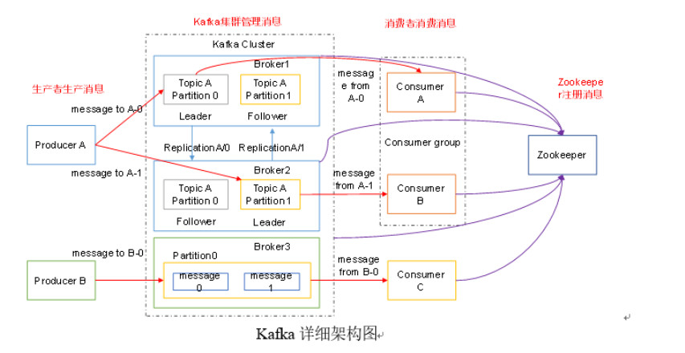

# kafka
## 环境添加：docker 启动kafka
    bus
    启动前提：启动zookeeper
    docker pull docker.io/wurstmeister/kafka
    
    docker run -d --name kafka -p 9092:9092 -v /mydata/kafka:/kafka -e KAFKA_BROKER_ID=0 -e KAFKA_ZOOKEEPER_CONNECT=192.168.56.101:2181 -e KAFKA_ADVERTISED_LISTENERS=PLAINTEXT://192.168.56.101:9092 -e KAFKA_LISTENERS=PLAINTEXT://0.0.0.0:9092 -t wurstmeister/kafka
    
    
    docker pull docker.io/sheepkiller/kafka-manager
    docker run -d --name kafkamanager -p 19092:9000 -e ZK_HOSTS=192.168.56.101:2181  sheepkiller/kafka-manager
### 本地环境启动 修改server.properties 中的zk,和自身端口
    D:\tools\kafka_2.11-1.1.0\bin\windows
    D:\tools\kafka_2.11-1.1.0\bin\windows>kafka-server-start.bat ..\..\config\server.properties
运行脚本即可
start.bat
``` 
cd .\bin\windows
kafka-server-start.bat ..\..\config\server.properties >> ../../run.log
```
stop.bat
```
cd .\bin\windows
zookeeper-server-stop.bat ..\..\config\server.properties
```

### 管理面地址：
    http://192.168.56.101:19092/
## kafka 知识点

### 高吞吐原因：
