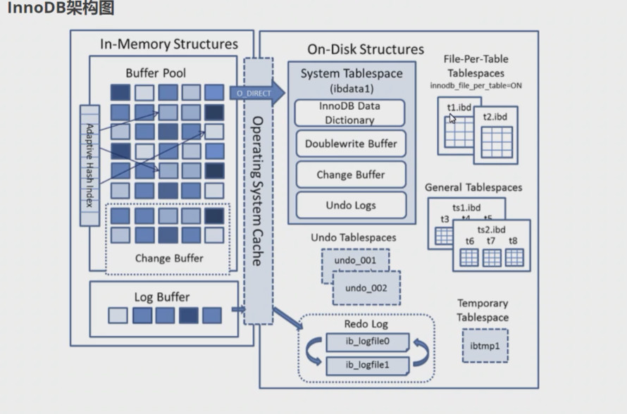
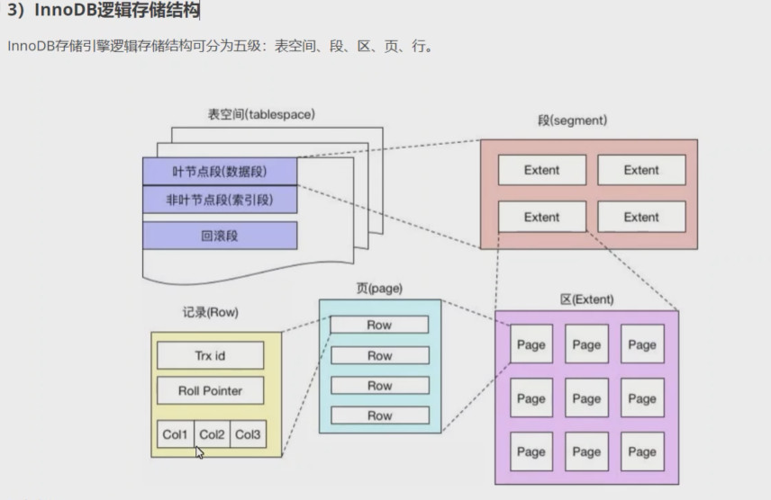
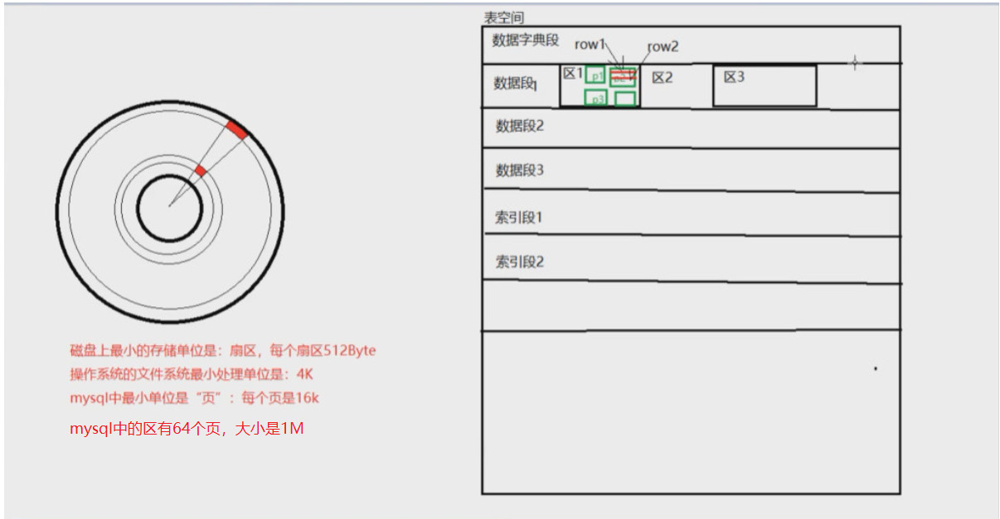
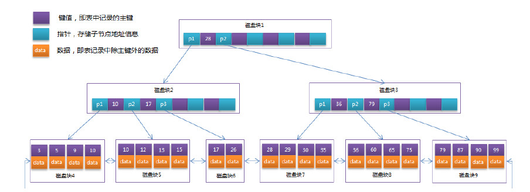
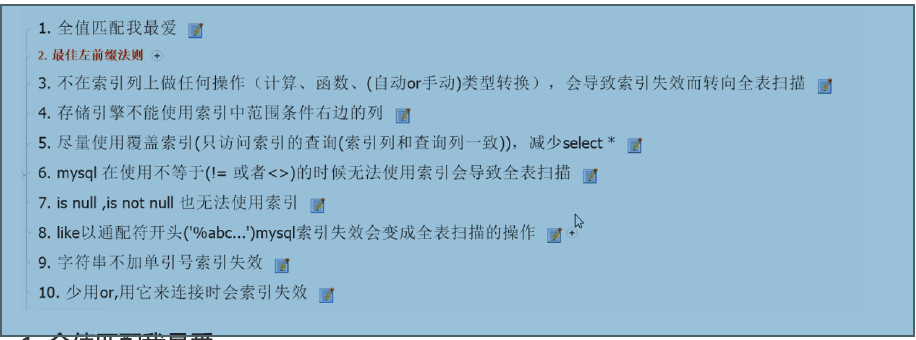
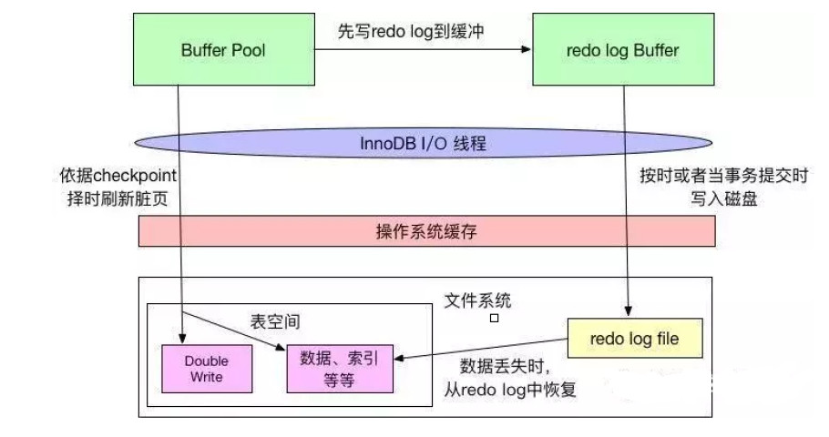

# MyBatis VIP课程配套代码

目录结构：

1、mybatis-standalone  —— MyBatis编程式使用案例

　　在IDEA中，需要修改Java Compiler为1.8，Project Structure —— Modules 的Language Level为1.8

2、spring-mybatis  ——  Spring与MyBatis集成案例

　　需要部署到tomcat中启动，访问：http://localhost:8080/

3、mybatis-generator  —— MyBatis代码生成器

运行环境：

数据库：MySQL 5.7

数据库名称：gp-mybatis 【需要先在本地或者远程创建这个数据库】

用户名密码：root/123456

建表信息：工程根目录 

　mybatis-standalone/table.sql

　spring-mybatis/table.sql

本地环境版本：

　IDEA 2017以上

　JDK 1.8

　Tomcat 8

　Maven 3.5.4

jar包依赖：

　mybatis 3.5.1

　Spring 5.1.3.RELEASE

　mybatis-spring 2.0.0

# mySQL 相关知识
--privileged=true 解决权限问题
docker run --name mysql -p 3306:3306 -v /mydata/mysql:/var/lib/mysql --privileged=true -e MYSQL_ROOT_PASSWORD="123456" -d mysql:5.7
### sql执行过程：
    
#### 第一步:
    先连接到这个数据库上，这时候接待的就是连接器。连接器负责跟客户端建立连接、获取权限、维持和管理连接。
#### 第二步：
    查询缓存，8.0去除这个功能了。
#### 第三步：
    解析器先会做“词法分析”。 词法分析就是把一个完整的 SQL 语句分割成一个个的字符串，语法分析器会根据语法规则做语法检查，判断你输入的这个SQL 语句是否满足 MySQL 语法。
    如果语法正确，就会根据 MySQL 定义的语法规则，根据 SQL 语句生成一个数据结构，这个数据结构我们把它叫做解析树
#### 第四步：
    预处理器则会进一步去检查解析树是否合法，比如表名是否存在，语句中表的列是否存在等等，在这一步MySQL会检验用户是否有表的操作权限。预处理之后会得到一个新的解析树。
#### 第五步：
    查询优化器的作用就是根据解析树生成不同的执行计划，然后选择一种最优的执行计划，MySQL 里面使用的是基于成本模型的优化器，哪种执行计划执行时成本最小就用哪种。
    优化器都做哪些优化处理呢？比如
        1. 当有多个索引可用的时候，决定使用哪个索引；
        2. 在一个语句有多表关联（join）的时候，决定各个表的连接顺序，以哪个表为基准表。    
#### 第六步：
    MySQL 通过分析器知道了你要做什么，通过优化器知道了该怎么做，得到了一个查询计划。于是就进
    入了执行器阶段，开始执行语句。
    （1）开始执行的时候，要先判断一下你对这个表customer有没有执行查询的权限，如果没有，就会
    返回没有权限的错误。 (在工程实现上，如果命中查询缓存，会在查询缓存返回结果的时候，做权限验
    证。)。
    （2）如果有权限，就使用指定的存储引擎打开表开始查询。执行器会根据表的引擎定义，去使用这
    个引擎提供的查询接口，提取数据。
## MySQL 存储索引

### innoDB

#### 主要特点
    1. 支持事务
       InnoDB是事务型存储引擎，支持事务的ACID特性，可以保证数据的一致性，现在绝大部分的
       业务场景都是需要事务的。
    2. MVCC机制：读不加锁，读写可以并发，写操作不会阻塞读操作。
    3. 并发性-锁：行级锁、表级锁
       InnoDB支持行级锁，行锁是InnoDB存储引擎实现的。行锁并发度高，可以最大程度支持并
       发。
    4. 独特的索引结构
       主键索引和数据存储在一起，使用主键索引查询时可以有效减少IO，不需要再去数据文件读
       取数据，提升有效查询效率。
#### 文件系统
#### 1:重做日志文件： 
    默认地址：/var/lib/mysql ： ib_logfile0 ，ib_logfile1 两个文件的默认大小都是50M，循环使用，大小不会变化。
#### 2：系统表文件：
    ibdata1:包含：1.数据字典 2.双写段，3.回滚段，4.修改缓冲区，5.索引段
#### 3：用户表空间文件：
    .ibd 文件：每一个表都有。包含：1.数据内容，2.索引内容
    .frm 文件：每一个表都有。包含：表定义内容

#### 表空间
    如果开启了独立表空间innodb_file_per_table=1，每张表的数据都会存储到一个独立的表空
    间，即一个单独的.ibd文件。
    InnoDB 存储引擎有一个共享表空间，叫做系统表空间，对一个磁盘上的文件名为ibdata1。如果
    设置了参数innodb_file_per_table=0，关闭了独占表空间，则所有基于InnoDB存储引擎的表数据都
    会记录到系统表空间。
#### 段
    表空间是由各个段组成的，常见的段有数据段、索引段、回滚段等。
    如果开启了独立表空间innodb_file_per_table=1，每张表的数据都会存储到一个独立的表空
    间，即一个单独的.ibd文件。一个用户表空间里面由很多个段组成，创建一个索引时会创建两个段：数
    据段和索引段。
    数据段存储着索引树中叶子节点的数据。
    索引段存储着索引树中非叶子节点的数据。
    一个表的段数=索引数*2。
    一个段的空间大小是随着表的大小自动扩展的：表有多大，段就有多大。
    一个段会包含多个区，至少会有一个区，段扩展的最小单位是区
#### 区
    一个区由64个连续的页组成，一个区的大小=1M=64个页(16K)。为了保证区中页的连续性，区扩
    展时InnoDB 存储引擎会一次性从磁盘申请4 ~ 5个区。
#### 页
    InnoDB 每个页默认大小时是 16KB，页是 InnoDB管理磁盘的最小单位，也InnoDB中磁盘和内存
    交互的最小单位。
    show global variables like 'innodb_page_size';
    索引树上一个节点就是一个页，MySQL规定一个页上最少存储2个数据项。如果向一个页插入数据
    时，这个页已将满了，就会从区中分配一个新页。如果向索引树叶子节点中间的一个页中插入数据，如
    果这个页是满的，就会发生页分裂。
    操作系统管理磁盘的最小单位也是页，是操作系统读写磁盘最小单位，Linux中页一般是4K，可以
    通过命令查看。
        #默认 4096 4K
        getconf PAGE_SIZE
    所以InnoDB从磁盘中读取一个数据页时，操作系统会分4次从磁盘文件中读取数据到内存。写入也
    是一样的，需要分4次从内存写入到磁盘中。
    所以InnoDB从磁盘中读取一个数据页时，操作系统会分4次从磁盘文件中读取数据到内存。写入也
    是一样的，需要分4次从内存写入到磁盘中。
#### 行
    InnoDB的数据是以行为单位存储的，1个页中包含多个行。在MySQL5.7中，InnoDB提供了4种行格
    式：Compact、Redundant、Dynamic和Compressed行格式，Dynamic为MySQL5.7默认的行格式。
#### InnoDb索引
    主InnoDB存储引擎逻辑存储结构可分为五级：表空间、段、区、页、行。
    使用辅助索引需要检索两遍索引:首先检索辅助索引获得主键，然后使用主键到主索引中检索获得记录。
#### 内存系统

    简单逻辑图

### 索引分类：
    理解聚簇索引：索引的叶节点就是数据节点。而非聚簇索引的叶节点仍然是索引节点，只不过有一个指针指向对应的数据块；
    聚簇索引的顺序，就是数据在硬盘上的物理顺序。一般情况下主键就是默认的聚簇索引。
    主键索引的叶子节点会存储数据行，辅助索引只会存储主键值。
    聚簇索引之外的所有索引都称为辅助索引，InnoDB的辅助索引只会存储主键值而非磁盘地址。
    辅助索引需要检索两遍索引:首先检索辅助索引获得主键，然后使用主键到主索引中检索获得
    记录。
#### 主键索引：
    索引列中的值必须是唯一的，不允许有空值。
    ALTER TABLE table_name ADD PRIMARY KEY (column_name);
    主键索引的叶子节点会存储数据行，辅助索引只会存储主键值。
    InnoDB要求表必须有一个主键索引(MyISAM 可以没有)。

#### 普通索引：
    MySQL中基本索引类型，没有什么限制，允许在定义索引的列中插入重复值和空值。
    ALTER TABLE table_name ADD INDEX index_name (column_name) ;
#### 唯一索引：
    索引列中的值必须是唯一的，但是允许为空值。
    CREATE UNIQUE INDEX index_name ON table(column_name) ;
#### 全文索引：
    只能在文本类型CHAR,VARCHAR,TEXT类型字段上创建全文索引。字段长度比较大时，
    如果创建普通索引，在进行like模糊查询时效率比较低，这时可以创建全文索引。
#### B+树：

    B+树：改造B树
    在B树基础上，MySQL在B树的基础上继续改造，使用B+树构建索引。B+树和B树最主要的区别在于非叶
    子节点是否存储数据的问题
    B+树的最底层叶子节点包含所有索引项。
    B+树查找数据，由于数据都存放在叶子节点，所以每次查找都需要检索到叶子节点，才能查询到数据。
    B树查找数据时，如果在内节点中查找到数据，可以立即返回，比如查找值等于17的数据，在根节点中
    直接就可以找到，不需要再向下查找，具备中路返回的特点。
    下面我们看一下，如何使用B+树如何查询数据。
    等值查询
    假如我们查询值等于15的数据。查询路径磁盘块1->磁盘块2->磁盘块5。
    - B树：非叶子节点和叶子节点都会存储数据。
    - B+树：只有叶子节点才会存储数据，非叶子节点只存储键值。叶子节点之间使用双向指针连接，最底层
      的叶子节点形成了一个双向有序链表。
#### MyISAM索引
    主键索引，辅助索引
    在 MyISAM 中,辅助索引和主键索引的结构是一样的，没有任何区别，叶子节点的数据存储的都是
    行记录的磁盘地址。只是主键索引的键值是唯一的，而辅助索引的键值可以重复。
    查询数据时，由于辅助索引的键值不唯一，可能存在多个拥有相同的记录，所以即使是等值查询，
    也需要按照范围查询的方式在辅助索引树中检索数据。
### 按照索引列的数量
#### 单列索引：索引中只有一个列。
#### 组合索引：使用2个以上的字段创建的索引。
    组合索引的使用，需要遵循最左前缀原则（最左匹配原则）。
    一般情况下，建议使用组合索引代替单列索引（主键索引除外）。
    ALTER TABLE table_name ADD INDEX index_name (column1,column2);

### 磁盘中存储
#### 读取步骤：
    传统机械硬盘读取数据的过程：
        1.磁头移动到数据所在磁道。
        2.磁盘旋转,将数据所在的扇区移至磁头之下。
        3.磁盘继续旋转,所有所需的数据都被磁头从扇区中读出。
    耗时：
        1.寻道时间：第一步花费的时间，称为寻道时间。
        寻道时间越短，I/O操作越快，目前磁盘的寻道时间一般都在10ms左右。
        2.旋转延迟：第二步花费的时间，称为旋转延迟。
        旋转延迟取决于磁盘转速，这一步相比寻道时间来说，比较快，远远小于1ms。
        普通硬盘一般都是7200转/分，根据硬盘型号的不同，磁道离圆心的距离的不同，一个磁道包含几
        百个，几千个扇区，按100个扇区来算，旋转延迟为0.08ms（转一圈大约为8ms）。
        3.数据传输时间：完成传输所请求的数据所需要的时间。
#### 操作系统读取硬盘以磁盘块为单位
    扇区是硬盘读写的最小单位，由于扇区的数量比较小，在寻址时花费的时间比较长，操作系统认为
    紧邻这个扇区的数据随后也是会被使用到，操作系统一般是以4KB的单位读取磁盘，读取后数据会被缓
    存在内存，称这个操作为预读。
#### MySQL读取以页为单位
       MySQL本质上是一个软件，MySQL需要读取数据时，MySQL会调用操作系统的接口，操作系统会调
       用磁盘的驱动程序将数据读取到内核空间，然后将数据从内核空间copy到用户空间，随后MySQL就能从
       用户空间中读取到数据。操作系统读取磁盘时，Linux读取的最小单位一般为4K。最小单位由操作系统
       决定，不同的操作系统可能会有所不同。
       MySQL的InnoDB存储引擎的数据读取以页为单位，也大小由参数innodb_page_size控制，默认值
       是16k。
### 索引失效：

### 索引创建建议
    1. 表记录很少不需创建索引 （索引是要有存储的开销）.
    2. 一个表的索引个数不能过多。
       （1）空间：浪费空间。每个索引都是一个索引树，占据大量的磁盘空间。
       （2）时间：
       更新（插入/Delete/Update）变慢。需要更新所有的索引树。
       太多的索引也会增加优化器的选择时间。
       所以索引虽然能够提高查询效率，索引并不是越多越好，应该只为需要的列创建索引。
    3. 频繁更新的字段不建议作为索引。
       频繁更新的字段引发频繁的页分裂和页合并，性能消耗比较高。
    4. 区分度低的字段，不要建索引。
       比如性别，男，女；比如状态。区分度太低时，会导致扫描行数过多，再加上回表查询的消
       耗。如果使用索引，比全表扫描的性能还要差。这些字段一般会用在组合索引中。
       姓名，手机号就非常适合建索引。
    5. 在InnoDB存储引擎中，主键索引建议使用自增的长整型，避免使用很长的字段。
       主键索引树一个页节点是16K，主键字段越长，一个页可存储的数据量就会越少，比较臃肿，
       查询时尤其是区间查询时磁盘IO次数会增多。辅助索引树上叶子节点存储的数据是主键值，主键
       值越长，一个页可存储的数据量就会越少，查询时磁盘IO次数会增多，查询效率会降低。
    6. 不建议用无序的值作为索引。例如身份证、UUID
       更新数据时会发生频繁的页分裂，页内数据不紧凑，浪费磁盘空间。
    7. 尽量创建组合索引，而不是单列索引。
       优点：
       （1）1个组合索引等同于多个索引效果，节省空间。
       （2）可以使用覆盖索引
       创建原则：组合索引应该把把频繁的列，区分度高的值放在前面。频繁使用代表索引的利用率高，
       区分度高代表筛选粒度大，可以尽量缩小筛选范围。
    8. 字符串太长时，如何创建索引？
       在保证区分度的情况下，被索引的字段不要太长，可以使用前缀索引。怎么选择长度。
### 锁：

    - 全局锁：锁的是整个database。由MySQL的SQL layer层实现的：Flush tables with read lock 可以添加全局锁
    - 表级锁：锁的是某个table。由MySQL的SQL layer层实现的 show status like 'table%'; 查看表状态
    - 行级锁：锁的是某行数据，也可能锁定行之间的间隙。由某些存储引擎实现，比如InnoDB。
#### 按照锁的功能来说分为：共享读锁和排他写锁。
#### 按照锁的实现方式分为：悲观锁和乐观锁（使用某一版本列或者唯一列进行逻辑控制）
#### 表级锁和行级锁的区别：
    表级锁：开销小，加锁快；不会出现死锁；锁定粒度大，发生锁冲突的概率最高，并发度最低；
    行级锁：开销大，加锁慢；会出现死锁；锁定粒度最小，发生锁冲突的概率最低，并发度也最高；
##### 表级锁
    表共享读锁（Table Read Lock）
    表独占写锁（Table Write Lock）
    lock table 表名称 read(write),表名称2 read(write)，其他;
        1 show open tables; 
        1 unlock tables;
    1、session1: lock table mylock read; -- 给mylock表加读锁
    2、session1: select * from mylock; -- 可以查询
    3、session1：select * from tdep; --不能访问非锁定表
    4、session2：select * from mylock; -- 可以查询 没有锁
    5、session2：update mylock set name='x' where id=2; -- 修改阻塞,自动加行写锁
    6、session1：unlock tables; -- 释放表锁
    7、session2：Rows matched: 1 Changed: 1 Warnings: 0 -- 修改执行完成
    8、session1：select * from tdep; --可以访问

    1、session1: lock table mylock write; -- 给mylock表加写锁
    2、session1: select * from mylock; -- 可以查询
    3、session1：select * from tdep; --不能访问非锁定表
    4、session1：update mylock set name='y' where id=2; --可以执行
    5、session2：select * from mylock; -- 查询阻塞
    6、session1：unlock tables; -- 释放表锁
    7、session2：4 rows in set (22.57 sec) -- 查询执行完成
    8、session1：select * from tdep; --可以访问
##### 行级锁
    show status like 'innodb_row_lock%';
    - Innodb_row_lock_current_waits：当前正在等待锁定的数量；
    - Innodb_row_lock_time：从系统启动到现在锁定总时间长度；
    - Innodb_row_lock_time_avg：每次等待所花平均时间；
    - Innodb_row_lock_time_max：从系统启动到现在等待最常的一次所花的时间；
    - Innodb_row_lock_waits：系统启动后到现在总共等待的次数；
    - 记录锁（Record Locks）:锁定索引中一条记录。
    - 间隙锁（Gap Locks）:锁住的是两个索引之间的区间（缝隙），是一个左开右开区间。
    - Next-Key Locks:间隙锁+紧邻间隙锁的下一个记录锁，左开右闭区间。
### 事务和MVCC底层原理
    事务的隔离性由多版本控制机制和锁实现，而原子性、一致性和持久性通过InnoDB的redo log、undo log和Force Log at Commit机制来实现。
    原子性，持久性和一致性主要是通过redo log、undo log、Force Log at Commit和Double Write机制来完成的。
    redo log用于在崩溃时恢复数据，
    undo log用于对事务回滚时进行撤销，也会用于隔离性的多版本控制。
    Force Log at Commit机制保证事务提交后redo log日志都已经持久化。
    Double Write机制用来提高数据库的可靠性，用来解决脏页落盘时部分写失效问题。
#### 事务四大特性(ACID)
##### 原子性(Atomicity)：
    事务是可以提交或回滚的工作的原子单位。当一个事务对数据库进行多次更改时，要么所有更改
    在事务提交时成功，要么所有更改在事务回滚时撤消。
    它的意思就是在事务中发生的一系列操作是一个不可分割单元，事务里面的一系列更新操作，它们
    要么在事务提交全部是成功执行，要么在事务回滚时全部撤销。我们在程序中使用事务如果发生了
    异常的话，一定要进行事务回滚，如果进行了回滚的话，那么我们前面进行的数据库更新操作就像
    都没有执行过。
##### 一致性(Consistent)：
    数据库在任何时候都保持一致的状态——在每次提交或回滚之后，以及在事务进行期间。如果是
    跨多个表更新相关数据，在事务外查询时将看到所有旧值或所有新值，而不是新旧值的混合。
    事务开始和结束之间的数据的中间状态不会被其他事务看到，事务的原子性保证了数据的一致性。
##### 隔离性(Isolation)：
    事务在进行过程中相互隔离，它们不能相互干扰或查看彼此未提交的数据。
    不同的客户端在操作相同数据的时候，就可能会产生相互干扰，就会影响到数据操作结果。所以我
    们必须要依靠事务提供的隔离性，让我们在不同的事务中进行更新操作更新数据的时候，他们之前
    互相不干扰。
    事务的隔离性是通过锁定机制实现的，有经验的开发人员可以通过调整隔离级别，提高性能和并发
    性，这样他们就可以确保事务之间不会相互干扰。
    由锁机制和MVCC机制来实现的
    MVCC(多版本并发控制)：优化读写性能（读不加锁、读写不冲突）
##### 持久性(Durable)：
    事务的结果是持久的，事务执行成功后必须全部写入磁盘：一旦提交操作成功，该事务所做的更
    改就不会受到电源故障、系统崩溃等其他潜在危险的影响。数据库的数据通常是保存在磁盘上的，
    对数据的修改涉及对磁盘存储的写操作，其中包含一定数量的冗余，以防止在写操作期间出现电源
    故障或软件崩溃。
#####
    原子性：redo log、undo log、Force Log at Commit和Double Write机制。
    持久性：redo log，Double Write。
##### redo log

    redo log主要用于崩溃恢复。数据库崩溃重启后需要从redo log中把未落盘的脏页数据恢复出来，重新写入磁盘，保证用户的数据不丢失。
    redo log写入磁盘时，先写入操作系统缓冲区，然后使用参数innodb_flush_log_at_trx_commit可以控制redo log日志刷新到磁盘的策略和频率。
##### UndoLog
    崩溃恢复时除了需要使用redo log对已经提交的事务。在崩溃恢复中还需要回滚没有提交的事务。
    回滚操作需要undo日志的支持，undo日志的完整性和可靠性需要redo日志来保证，所以崩溃恢复先做redo恢复数据，然后做undo回滚。
    在事务执行的过程中，除了记录redo log，还会记录一定量的undo log。undo log记录了数据在每个操作前的状态，如果事务执行过程中需要回滚，就可以根据undo log进行回滚操作。
    undo log的存储不同于redo log，它存放在数据库内部的一个特殊的段(segment)中，这个段称为回滚段。
    回滚段位于共享表空间中。undo段中的以undo page为更小的组织单位。undo page和存储数
    据库数据和索引的页类似。因为redo log是物理日志，记录的是数据库页的物理修改操作。所以
    undo log（也看成数据库数据）的写入也会产生redo log，也就是undo log的产生会伴随着redo
    log的产生，这是因为undo log也需要持久性的保护。
####
    在事务的并发操作中可能会出现一些问题：
    丢失更新：两个事务针对同一数据都发生修改操作时，会存在丢失更新问题。
    脏读：一个事务读取到另一个事务未提交的数据。
    不可重复读：一个事务因读取到另一个事务已提交的update或者delete数据。导致对同一条记录读取两次以上的结果不一致。
    幻读：一个事务因读取到另一个事务已提交的insert数据。导致对同一张表读取两次以上的结果不一致。
#### 事务隔离级别
    四种隔离级别（SQL92标准）：
    现在来看看MySQL数据库为我们提供的四种隔离级别（由低到高）：
    ① Read uncommitted (读未提交)：最低级别，任何情况都无法保证。
    ② Read committed (RC，读已提交)：可避免脏读的发生。
    ③ Repeatable read (RR，可重复读)：可避免脏读、不可重复读的发生。
    （注意事项：InnoDB的RR还可以解决幻读，主要原因是Next-Key（Gap）锁，只有RR才能使用
    Next-Key锁）
    ④ Serializable (串行化)：可避免脏读、不可重复读、幻读的发生。
    （由MVCC降级为Locking-Base CC）
#### InnoDB的MVCC实现
    MVCC并发控制中，读操作可以分成两类：快照读 (snapshot read)与当前读 (current read)。
    - 快照读，读取的是记录的可见版本 (有可能是历史版本)，不用加锁。(select)
    - 当前读，读取的是记录的最新版本，并且当前读返回的记录，都会加上锁，保证其他事务不会再并发修改这条记录。