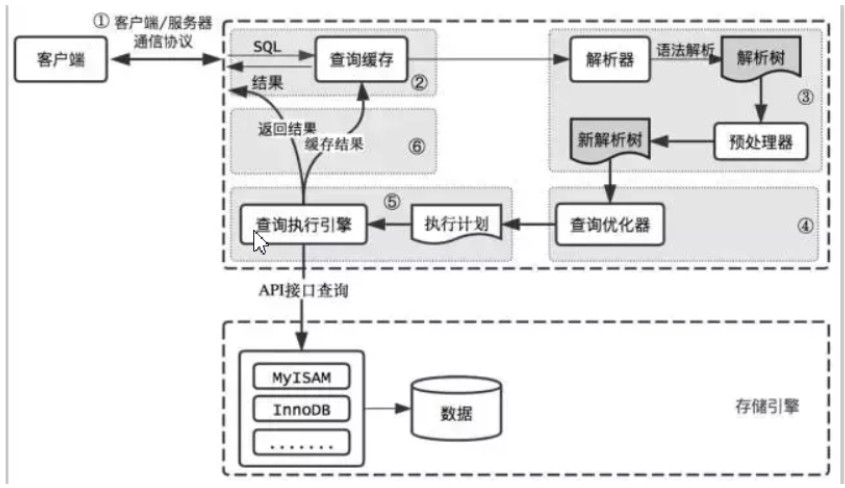

# MyBatis VIP课程配套代码

目录结构：

1、mybatis-standalone  —— MyBatis编程式使用案例

　　在IDEA中，需要修改Java Compiler为1.8，Project Structure —— Modules 的Language Level为1.8

2、spring-mybatis  ——  Spring与MyBatis集成案例

　　需要部署到tomcat中启动，访问：http://localhost:8080/

3、mybatis-generator  —— MyBatis代码生成器

运行环境：

数据库：MySQL 5.7

数据库名称：gp-mybatis 【需要先在本地或者远程创建这个数据库】

用户名密码：root/123456

建表信息：工程根目录 

　mybatis-standalone/table.sql

　spring-mybatis/table.sql

本地环境版本：

　IDEA 2017以上

　JDK 1.8

　Tomcat 8

　Maven 3.5.4

jar包依赖：

　mybatis 3.5.1

　Spring 5.1.3.RELEASE

　mybatis-spring 2.0.0

# mySQL 相关知识
--privileged=true 解决权限问题
docker run --name mysql -p 3306:3306 -v /mydata/mysql:/var/lib/mysql --privileged=true -e MYSQL_ROOT_PASSWORD="123456" -d mysql:5.7
### sql执行过程：
    
#### 第一步:
    先连接到这个数据库上，这时候接待的就是连接器。连接器负责跟客户端建立连接、获取权限、维持和管理连接。
#### 第二步：
    查询缓存，8.0去除这个功能了。
#### 第三步：
    解析器先会做“词法分析”。 词法分析就是把一个完整的 SQL 语句分割成一个个的字符串，语法分析器会根据语法规则做语法检查，判断你输入的这个SQL 语句是否满足 MySQL 语法。
    如果语法正确，就会根据 MySQL 定义的语法规则，根据 SQL 语句生成一个数据结构，这个数据结构我们把它叫做解析树
#### 第四步：
    预处理器则会进一步去检查解析树是否合法，比如表名是否存在，语句中表的列是否存在等等，在这一步MySQL会检验用户是否有表的操作权限。预处理之后会得到一个新的解析树。
#### 第五步：
    查询优化器的作用就是根据解析树生成不同的执行计划，然后选择一种最优的执行计划，MySQL 里面使用的是基于成本模型的优化器，哪种执行计划执行时成本最小就用哪种。
    优化器都做哪些优化处理呢？比如
        1. 当有多个索引可用的时候，决定使用哪个索引；
        2. 在一个语句有多表关联（join）的时候，决定各个表的连接顺序，以哪个表为基准表。    
#### 第六步：
    MySQL 通过分析器知道了你要做什么，通过优化器知道了该怎么做，得到了一个查询计划。于是就进
    入了执行器阶段，开始执行语句。
    （1）开始执行的时候，要先判断一下你对这个表customer有没有执行查询的权限，如果没有，就会
    返回没有权限的错误。 (在工程实现上，如果命中查询缓存，会在查询缓存返回结果的时候，做权限验
    证。)。
    （2）如果有权限，就使用指定的存储引擎打开表开始查询。执行器会根据表的引擎定义，去使用这
    个引擎提供的查询接口，提取数据。
## MySQL 存储索引

