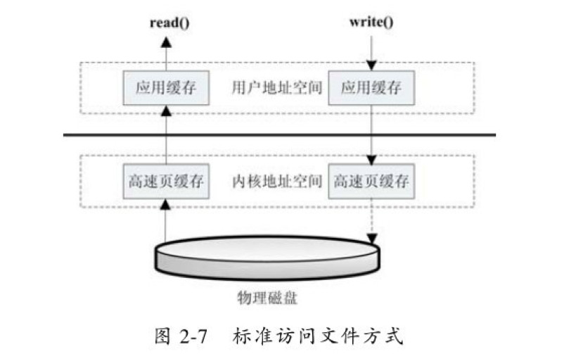
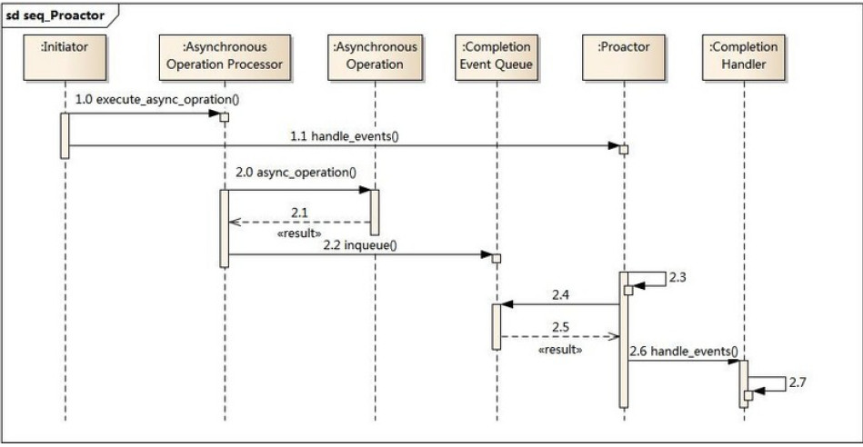

# I/O
## 用户空间(User space)和内核空间(Kernel space)
    Kernel space 是 Linux 内核的运行空间，User space 是用户程序的运行空间
    Kernel space 可以执行任意命令，调用系统的一切资源；User space 只能执行简单的运算，不能直接调用系统资源，必须通过系统接口（又称 system call），才能向内核发出指令。通过系统接口，进程可以从用户空间切换到内核空间。
### top 
    第一项24.8 us（user 的缩写）就是 CPU 消耗在 User space 的时间百分比，
    第二项0.5 sy（system 的缩写）是消耗在 Kernel space 的时间百分比。
    ni：niceness 的缩写，CPU 消耗在 nice 进程（低优先级）的时间百分比
    id：idle 的缩写，CPU 消耗在闲置进程的时间百分比，这个值越低，表示 CPU 越忙
    wa：wait 的缩写，CPU 等待外部 I/O 的时间百分比，这段时间 CPU 不能干其他事，但是也没有执行运算，这个值太高就说明外部设备有问题
    hi：hardware interrupt 的缩写，CPU 响应硬件中断请求的时间百分比
    si：software interrupt 的缩写，CPU 响应软件中断请求的时间百分比
    st：stole time 的缩写，该项指标只对虚拟机有效，表示分配给当前虚拟机的 CPU 时间之中，被同一台物理机上的其他虚拟机偷走的时间百分比
### PIO与DMA
    PIO 我们拿磁盘来说，很早以前，磁盘和内存之间的数据传输是需要CPU控制的，也就是说如果我们读取磁盘文件到内存中，数据要经过CPU存储转发，这种方式称为PIO。显然这种方式非常不合理，需要占用大量的CPU时间来读取文件，造成文件访问时系统几乎停止响应。
    DMA（直接内存访问，Direct Memory Access）取代了PIO，它可以不经过CPU而直接进行磁盘和内存（内核空间）的数据交换。在DMA模式下，CPU只需要向DMA控制器下达指令，让DMA控制器来处理数据的传送即可，DMA控制器通过系统总线来传输数据，传送完毕再通知CPU，这样就在很大程度上降低了CPU占有率，大大节省了系统资源，而它的传输速度与PIO的差异其实并不十分明显，因为这主要取决于慢速设备的速度。
### 缓存IO和直接IO
    缓存IO：数据从磁盘先通过DMA copy到内核空间，再从内核空间通过cpu copy到用户空间
    缓存I/O又被称作标准I/O，大多数文件系统的默认I/O操作都是缓存I/O。在Linux的缓存I/O机制中，数据先从磁盘复制到内核空间的缓冲区，然后从内核空间缓冲区复制到应用程序的地址空间。
    读操作：操作系统检查内核的缓冲区有没有需要的数据，如果已经缓存了，那么就直接从缓存中返回；否则从磁盘中读取，然后缓存在操作系统的缓存中。
    写操作：将数据从用户空间复制到内核空间的缓存中。这时对用户程序来说写操作就已经完成，至于什么时候再写到磁盘中由操作系统决定，除非显示地调用了sync同步命令
    缓存I/O的优点：
    1）在一定程度上分离了内核空间和用户空间，保护系统本身的运行安全；
    2）可以减少读盘的次数，从而提高性能。
    缓存I/O的缺点：
    在缓存 I/O 机制中，DMA 方式可以将数据直接从磁盘读到页缓存中，或者将数据从页缓存直接写回到磁盘上，而不能直接在应用程序地址空间和磁盘之间进行数据传输，这样，数据在传输过程中需要在应用程序地址空间（用户空间）和缓存（内核空间）之间进行多次数据拷贝操作，这些数据拷贝操作所带来的CPU以及内存开销是非常大的。
    直接IO：数据从磁盘通过DMA copy到用户空间
## 磁盘IO

    当应用程序调用read接口时，操作系统检查在内核的高速缓存有没有需要的数据，如果已经缓存了，那么就直接从缓存中返回，如果没有，则从磁盘中读取，然后缓存在操作系统的缓存中。应用程序调用write接口时，将数据从用户地址空间复制到内核地址空间的缓存中，这时对用户程序来说，写操作已经完成，至于什么时候再写到磁盘中，由操作系统决定，除非显示调用了sync同步命令。
## 网络IO
    1）操作系统将数据从磁盘复制到操作系统内核的页缓存中 2）应用将数据从内核缓存复制到应用的缓存中 3）应用将数据写回内核的Socket缓存中 4）操作系统将数据从Socket缓存区复制到网卡缓存，然后将其通过网络发出
    1、当调用read系统调用时，通过DMA（Direct Memory Access）将数据copy到内核模式 2、然后由CPU控制将内核模式数据copy到用户模式下的 buffer中 3、read调用完成后，write调用首先将用户模式下 buffer中的数据copy到内核模式下的socket buffer中 4、最后通过DMA copy将内核模式下的socket buffer中的数据copy到网卡设备中传送。从上面的过程可以看出，数据白白从内核模式到用户模式走了一圈，浪费了两次copy，而这两次copy都是CPUcopy，即占用CPU资源。
    磁盘IO和网络IO对比首先，磁盘IO主要的延时是由（以15000rpm硬盘为例）： 机械转动延时（机械磁盘的主要性能瓶颈，平均为2ms） + 寻址延时（2~3ms） + 块传输延时（一般4k每块，40m/s的传输速度，延时一般为0.1ms) 决定。（平均为5ms）而网络IO主要延是由： 服务器响应延时 + 带宽限制 + 网络延时 + 跳转路由延时 + 本地接收延时 决定。（一般为几十到几千毫秒，受环境干扰极大）所以两者一般来说网络IO延时要大于磁盘IO的延时。
## 同步IO和异步IO
    指的是用户空间和内核空间数据交互的方式:
    同步：用户空间要的数据，必须等到内核空间给它才做其他事情
    异步：用户空间要的数据，不需要等到内核空间给它，才做其他事情。内核空间会异步通知用户进程，并把数据直接给到用户空间。
## 阻塞IO和非阻塞IO
    指的是用户就和内核空间IO操作的方式
    堵塞：用户空间通过系统调用（systemcall）和内核空间发送IO操作时，该调用是堵塞的
    非堵塞：用户空间通过系统调用（systemcall）和内核空间发送IO操作时，该调用是不堵塞的，直接返回的，只是返回时，可能没有数据而已
## 反应器Reactor
    反应器设计模式(Reactor pattern)是一种为处理并发服务请求，并将请求提交到一个或者多个服务处理程序的事件设计模式。当客户端请求抵达后，服务处理程序使用多路分配策略，由一个非阻塞的线程来接收所有的请求，然后派发这些请求至相关的工作线程进行处理。
### 初始事件分发器(Initialization Dispatcher)：
    用于管理Event Handler，定义注册、移除EventHandler等。它还作为Reactor模式的入口调用Synchronous Event Demultiplexer的select方法以阻塞等待事件返回，当阻塞等待返回时，根据事件发生的Handle将其分发给对应的Event Handler处理，即回调EventHandler中的handle_event()方法
### 同步（多路）事件分离器(Synchronous Event Demultiplexer)：
    无限循环等待新事件的到来，一旦发现有新的事件到来，就会通知初始事件分发器去调取特定的事件处理器。
### 系统处理程序(Handles)：
    操作系统中的句柄，是对资源在操作系统层面上的一种抽象，它可以是打开的文件、一个连接(Socket)、Timer等。由于Reactor模式一般使用在网络编程中，因而这里一般指SocketHandle，即一个网络连接（Connection，在Java NIO中的Channel）。这个Channel注册到SynchronousEvent Demultiplexer中，以监听Handle中发生的事件，对ServerSocketChannnel可以是CONNECT事件，对SocketChannel可以是READ、WRITE、CLOSE事件等。事件处理器(Event Handler)： 定义事件处理方法，以供Initialization Dispatcher回调使用。
### Reactor包含如下角色：
    Handle 句柄；用来标识socket连接或是打开文件；服务器端启动一条单线程，用于轮询IO操作是否就绪，当有就绪的才进行相应的读写操作，这样的话就减少了服务器产生大量的线程，也不会出现线程之间的切换产生的性能消耗。(目前JAVA的NIO就采用的此种模式，这里引申出一个问题：在多核情况下NIO的扩展问题)
    Synchronous Event Demultiplexer：同步事件多路分解器：由操作系统内核实现的一个函数；用于阻塞等待发生在句柄集合上的一个或多个事件；（如select/epoll；）
    Event Handler：事件处理接口
    Concrete Event HandlerA：实现应用程序所提供的特定事件处理逻辑；
    Reactor：反应器，定义一个接口，实现以下功能： 1）供应用程序注册和删除关注的事件句柄； 2）运行事件循环； 3）有就绪事件到来时，分发事件到之前注册的回调函数上处理；  
    Initiation Dispatcher：用于管理Event Handler，即EventHandler的容器，用以注册、移除EventHandler等；另外，它还作为Reactor模式的入口调用Synchronous Event Demultiplexer的select方法以阻塞等待事件返回，当阻塞等待返回时，根据事件发生的Handle将其分发给对应的Event Handler处理，即回调EventHandler中的handle_event()方法。
## Proactor模式
### Proactor主动器模式包含如下角色
    Handle 句柄；用来标识socket连接或是打开文件；
    Asynchronous Operation Processor：异步操作处理器；负责执行异步操作，一般由操作系统内核实现；
    Asynchronous Operation：异步操作
    Completion Event Queue：完成事件队列；异步操作完成的结果放到队列中等待后续使用
    Proactor：主动器；为应用程序进程提供事件循环；从完成事件队列中取出异步操作的结果，分发调用相应的后续处理逻辑；
    Completion Handler：完成事件接口；一般是由回调函数组成的接口；
    Concrete Completion Handler：完成事件处理逻辑；实现接口定义特定的应用处理逻辑；
### 业务流程时序图


    1. 应用程序启动，调用异步操作处理器提供的异步操作接口函数，调用之后应用程序和异步操作处理就独立运行；应用程序可以调用新的异步操作，而其它操作可以并发进行；
    2. 应用程序启动Proactor主动器，进行无限的事件循环，等待完成事件到来；
    3. 异步操作处理器执行异步操作，完成后将结果放入到完成事件队列；
    4. 主动器从完成事件队列中取出结果，分发到相应的完成事件回调函数处理逻辑中；
# netty 是一个高性能的成熟的NIO框架
* netty-io： 各类IO编程的比较：
    * bio：同步阻塞io
        * java.net.ServerSocket ：启动一个io，检查端口 
        * Socket client = server.accept(); 阻塞，等待客户端信息
    * nio : 异步阻塞io
    * aio : 异步非阻塞io
* netty-tomcat：基于netty实现一个简易版Tomcat
* netty-rpc：基于netty实现一个简易版远程过程调用例子
       ```
          
          在java的动态代理机制中，有两个重要的类或接口，一个是 InvocationHandler(Interface)、
          另一个则是 Proxy(Class)，这一个类和接口是实现我们动态代理所必须用到的。首先我们先来看看java的API帮助文档是怎么样对这两个类进行描述的
          com.ithawk.netty.demo.rpc.consumer.proxy.RpcProxy
       ```